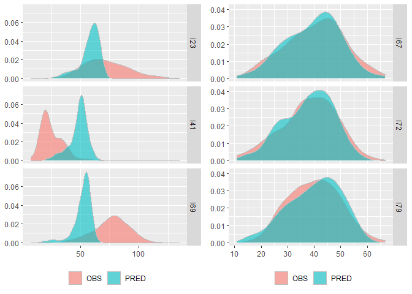

This is an [R Markdown](http://rmarkdown.rstudio.com) Notebook showing an application of the two-components regression model on the `OzoneFull` dataset which is available in the `HistDAWass` package. We used the `HistDAWass` package and the therein build functions for the regression analysis.

# Install and load the package

For installing and loading the package in your environment launch the following code:


```r
## if not installed in your environment
#  install.packages("HistDAWass")
library(HistDAWass) #load the package
#other useful packages
library(tidyverse)
library(plotly)
library(patchwork)
```

# Data description

The `OzoneFull` dataset is a `MatH` object, namely, a table of histogram-valued data, representing aggregate raw data downloaded from the Clean Air Status and Trends Network (CASTNET) ([\<http://java.epa.gov/castnet/\>](http://java.epa.gov/castnet/%7D,)), an air-quality monitoring network of the United States, designed to provide data to assess trends in air quality, atmospheric deposition and ecological effects due to changes in air pollutant emissions.

We selected data on the ozone concentration in 78 USA sites among those depicted in Fig. \@ref(fig:map) for which the monitored data were complete (i.e., without missing values for each of the selected characteristics).

<div class="figure">

<p class="caption">CASTNET network sites map</p>
</div>

Ozone is a gas that can cause respiratory diseases. In the literature, several studies reported evidence of the relation between the ozone concentration level and temperature, wind speed and the solar radiation (see, for example,[@Duenas2002]).

Given the distribution of \emph{temperature} ($X_{1}$) (degrees Celsius), the distribution of \emph{solar radiation} ($X_{2}$) (Watts per square meter) and the distribution of \emph{wind speed} ($X_{3}$) (meters per second), the main objective is to predict the distribution of \emph{ozone concentration} ($Y$) (Particles per billion) using a linear model. CASTNET collects hourly data and, as the period of observation, we chose the summer season of 2010 and the central hours of the days (10 a.m.--5 p.m.).

We collected the histograms of the values of each site observed for the four variables. The histograms were constructed using 100 equi-frequent bins, namely, we have bins of different widths but of constant frequency. The histogram representation of varying bin-width histograms in not always pleasant, we plot the data using only ten equi-frequent bins. We show the first 5 of 78 sites.


```r
plot(New_OZ[1:10,])+theme_bw()+xlab("")+ylab("")+theme(legend.position = "none")
```

<!-- -->

Each cell of the data table contains a histogram. We see the first three rows of the matrix


|ST_ID |Bin         |    p|Bin1        |   p1|Bin2           |   p2|Bin3      |   p3|
|:-----|:-----------|----:|:-----------|----:|:--------------|----:|:---------|----:|
|I1    |8.77-16.62  | 0.01|8.45-11.65  | 0.01|25.29- 75.88   | 0.01|0.10-0.35 | 0.01|
|I1    |16.62-17.54 | 0.01|11.65-13.06 | 0.01|75.88-108.27   | 0.01|0.35-0.41 | 0.01|
|I1    |17.54-18.42 | 0.01|13.06-13.83 | 0.01|108.27-111.43  | 0.01|0.41-0.50 | 0.01|
|I1    |18.42-18.90 | 0.01|13.83-14.12 | 0.01|111.43-114.09  | 0.01|0.50-0.55 | 0.01|
|I1    |...-...     | 0.01|...-...     | 0.01|...-...        | 0.01|...-...   | 0.01|
|I1    |65.68-67.78 | 0.01|28.87-29.23 | 0.01|914.12-933.30  | 0.01|3.52-3.79 | 0.01|
|I1    |67.78-89.60 | 0.01|29.23-30.18 | 0.01|933.30-942.00  | 0.01|3.79-4.48 | 0.01|
|I2    |9.00-15.00  | 0.01|9.50- 9.75  | 0.01|49.00- 56.16   | 0.01|0.10-0.55 | 0.01|
|I2    |15.00-17.00 | 0.01|9.75-10.38  | 0.01|56.16- 71.50   | 0.01|0.55-0.80 | 0.01|
|I2    |17.00-18.00 | 0.01|10.38-10.60 | 0.01|71.50-102.84   | 0.01|0.80-0.80 | 0.01|
|I2    |18.00-19.00 | 0.01|10.60-11.24 | 0.01|102.84-133.40  | 0.01|0.80-0.90 | 0.01|
|I2    |...-...     | 0.01|...-...     | 0.01|...-...        | 0.01|...-...   | 0.01|
|I2    |54.24-58.00 | 0.01|29.02-29.60 | 0.01|910.00-916.84  | 0.01|7.52-8.37 | 0.01|
|I2    |58.00-63.00 | 0.01|29.60-30.70 | 0.01|916.84-944.00  | 0.01|8.37-9.60 | 0.01|
|I3    |9.25-17.99  | 0.01|17.57-20.13 | 0.01|52.57- 78.67   | 0.01|0.08-0.26 | 0.01|
|I3    |17.99-20.31 | 0.01|20.13-20.63 | 0.01|78.67-105.48   | 0.01|0.26-0.38 | 0.01|
|I3    |20.31-21.41 | 0.01|20.63-21.13 | 0.01|105.48-116.96  | 0.01|0.38-0.41 | 0.01|
|I3    |21.41-22.20 | 0.01|21.13-21.61 | 0.01|116.96-140.19  | 0.01|0.41-0.45 | 0.01|
|I3    |...-...     | 0.01|...-...     | 0.01|...-...        | 0.01|...-...   | 0.01|
|I3    |62.38-64.11 | 0.01|36.10-36.42 | 0.01|979.18- 990.02 | 0.01|3.77-4.07 | 0.01|
|I3    |64.11-69.45 | 0.01|36.42-37.07 | 0.01|990.02-1020.00 | 0.01|4.07-4.81 | 0.01|

## Basic Wasserstein-based statistics

### The Frechét mean distributions of the the four variables

We start computing the Frechét mean of each distributional variable using the $L_2$ Wassertein distance as in [@IrpVer2015]

#### Ozone


```r
mean_Oz<-WH.vec.mean(OzoneFull[,1])
mean_Oz
```

```
## Output shows the first five and the last five bins due to eccesive length 
##                  X                 p
## Bin_1   [14.789-19.479)              0.01
## Bin_2   [19.479-21.567)              0.01
## Bin_3   [21.567-22.872)              0.01
## Bin_4   [22.872-23.912)              0.01
## Bin_5   [23.912-24.894)              0.01
## ...               ...               ...
## Bin_96 [57.865 ; 58.948)              0.01
## Bin_97 [58.948 ; 60.278)              0.01
## Bin_98 [60.278 ; 61.979)              0.01
## Bin_99 [61.979 ; 64.515)              0.01
## Bin_100 [64.515 ; 71.095)              0.01
## 
##  mean =  41.2147347282052   std  =  9.96802979889176 
## 
```

#### Temperature


```r
mean_Temp<-WH.vec.mean(OzoneFull[,2])
mean_Temp
```

```
## Output shows the first five and the last five bins due to eccesive length 
##                  X                 p
## Bin_1   [10.355-12.383)              0.01
## Bin_2    [12.383-13.91)              0.01
## Bin_3      [13.91-15.1)              0.01
## Bin_4     [15.1-15.853)              0.01
## Bin_5   [15.853-16.473)              0.01
## ...               ...               ...
## Bin_96 [28.795 ; 29.106)              0.01
## Bin_97 [29.106 ; 29.447)              0.01
## Bin_98 [29.447 ; 29.888)              0.01
## Bin_99 [29.888 ; 30.569)              0.01
## Bin_100 [30.569 ; 31.602)              0.01
## 
##  mean =  23.2805152974359   std  =  3.76407404885491 
## 
```

#### Solar Radiation


```r
mean_SR<-WH.vec.mean(OzoneFull[,3])
mean_SR
```

```
## Output shows the first five and the last five bins due to eccesive length 
##                  X                 p
## Bin_1   [54.186-89.738)              0.01
## Bin_2   [89.738-123.48)              0.01
## Bin_3   [123.48-148.68)              0.01
## Bin_4    [148.68-177.1)              0.01
## Bin_5    [177.1-202.25)              0.01
## ...               ...               ...
## Bin_96 [926.63 ; 934.72)              0.01
## Bin_97 [934.72 ; 943.94)              0.01
## Bin_98 [943.94 ; 955.36)              0.01
## Bin_99 [955.36 ; 970.49)              0.01
## Bin_100 [970.49 ; 997.58)              0.01
## 
##  mean =  645.350728000001   std  =  225.781773829828 
## 
```

#### Wind Speed


```r
mean_WS<-WH.vec.mean(OzoneFull[,4])
mean_WS
```

```
## Output shows the first five and the last five bins due to eccesive length 
##                  X                 p
## Bin_1 [0.11386-0.36784)              0.01
## Bin_2 [0.36784-0.52206)              0.01
## Bin_3 [0.52206-0.62055)              0.01
## Bin_4 [0.62055-0.70678)              0.01
## Bin_5 [0.70678-0.77491)              0.01
## ...               ...               ...
## Bin_96 [4.3248 ; 4.4692)              0.01
## Bin_97 [4.4692 ; 4.6702)              0.01
## Bin_98 [4.6702 ; 4.9502)              0.01
## Bin_99 [4.9502 ; 5.4696)              0.01
## Bin_100 [5.4696 ; 6.5707)              0.01
## 
##  mean =  2.34883345512821   std  =  1.09865034695591 
## 
```

### The plot of the four barycenters


```r
p_oz<-plot(mean_Oz,col="black")+ggtitle("Ozone conc.")+theme_bw()
p_Temp<-plot(mean_Temp,col="grey50", border="grey50")+ggtitle("Temperature")+theme_bw()
p_SR<-plot(mean_SR,col="grey50", border="grey50")+ggtitle("Solar Radiation")+theme_bw()
p_WS<-plot(mean_WS,col="grey50", border="grey50")+ggtitle("Wind speed")+theme_bw()


p_oz+p_Temp+p_SR+p_WS
```

<!-- -->

In Table \ref{TAB:OZO_summarystat}, we report the main summary statistics for the four histogram variables, while in Fig. \ref{Fig: OZO_barycenters}, we provide the four barycenters of the 78 sites for each variable. We note, for example, the different skewness of the barycenters. In general, when the barycenter is skewed, the observed distributions are in general skewed in the same direction. This is not in general true for symmetric barycenters, which can be generated both from left- and right-skewed distributions.


```r
# mean values of the Frechet means
aver<-c(meanH(mean_Oz),meanH(mean_Temp),meanH(mean_SR),meanH(mean_WS))
# standard deviations values of the Frechet means
std<-c(stdH(mean_Oz),stdH(mean_Temp),stdH(mean_SR),stdH(mean_WS))
# first quartiles of the Frechet means
Q1s<-c(compQ(mean_Oz,p = 0.25),compQ(mean_Temp,p = 0.25),
       compQ(mean_SR,p = 0.25),compQ(mean_WS,  p = 0.25))
# medians of the Frechet means
meds<-c(compQ(mean_Oz,p = 0.5),compQ(mean_Temp,p = 0.5),
        compQ(mean_SR,p = 0.5),compQ(mean_WS,  p = 0.5))
# third quartiles of the Frechet means
Q3s<-c(compQ(mean_Oz,p = 0.75),compQ(mean_Temp,p = 0.75),
       compQ(mean_SR,p = 0.75),compQ(mean_WS, p = 0.75))

# skewness measures values of the Frechet means
ske<-c(skewH(mean_Oz),skewH(mean_Temp),skewH(mean_SR),skewH(mean_WS))
# kurtosis measures values of the Frechet means
kur<-c(kurtH(mean_Oz),kurtH(mean_Temp),kurtH(mean_SR),kurtH(mean_WS))

# Let's put all in a table

FR_means_stats<-tibble(
  Variable=c("Ozone", "Temperature","Solar Radiation","Wind Speed"),
  Mean=round(aver,2),
  Std=round(std,2),
  First_Q=round(Q1s,2),
  Median=round(meds,2),
  Third_Q=round(Q3s,2),
  Skewness=round(ske,3),
  Kurtosis=round(kur,3)
)

knitr::kable(FR_means_stats,caption = "Basic statistics of barycenters")
```


Table: Basic statistics of barycenters

|Variable        |   Mean|    Std| First_Q| Median| Third_Q| Skewness| Kurtosis|
|:---------------|------:|------:|-------:|------:|-------:|--------:|--------:|
|Ozone           |  41.21|   9.97|   34.27|  41.15|   48.05|    0.078|    2.778|
|Temperature     |  23.28|   3.76|   21.04|  23.71|   25.93|   -0.596|    3.393|
|Solar Radiation | 645.35| 225.78|  496.05| 701.63|  826.56|   -0.715|    2.580|
|Wind Speed      |   2.35|   1.10|    1.54|   2.22|    3.03|    0.649|    3.456|

We show the covariances and correlations of the variables in the next two tables, and the standard deviations of the variables computed according to what is proposed in [@IrpVer2015] :


```r
# Covariance matrix
Cov_M<-WH.var.covar(OzoneFull)
# Standard deviation of variables
Std_vars<-sqrt(diag(Cov_M))


#Correlation matrix
Corr_M<-round(WH.correlation(OzoneFull),3)


knitr::kable(round(Cov_M,2), caption="Covariance matrix")
```


Table: Covariance matrix

|                       | Ozone.Conc.ppb| Temperature.C| Solar.Radiation.WattM2| Wind.Speed.mSec|
|:----------------------|--------------:|-------------:|----------------------:|---------------:|
|Ozone.Conc.ppb         |          90.81|          9.05|                 690.92|            5.03|
|Temperature.C          |           9.05|         14.76|                 197.71|            0.72|
|Solar.Radiation.WattM2 |         690.92|        197.71|               12866.55|           65.47|
|Wind.Speed.mSec        |           5.03|          0.72|                  65.47|            1.73|

```r
knitr::kable(round(Std_vars,2), caption="Standard deviations")
```


Table: Standard deviations

|                       |      x|
|:----------------------|------:|
|Ozone.Conc.ppb         |   9.53|
|Temperature.C          |   3.84|
|Solar.Radiation.WattM2 | 113.43|
|Wind.Speed.mSec        |   1.31|

```r
knitr::kable(Corr_M, caption="Correlation matrix")
```


Table: Correlation matrix

|                       | Ozone.Conc.ppb| Temperature.C| Solar.Radiation.WattM2| Wind.Speed.mSec|
|:----------------------|--------------:|-------------:|----------------------:|---------------:|
|Ozone.Conc.ppb         |          1.000|         0.247|                  0.639|           0.402|
|Temperature.C          |          0.247|         1.000|                  0.454|           0.143|
|Solar.Radiation.WattM2 |          0.639|         0.454|                  1.000|           0.439|
|Wind.Speed.mSec        |          0.402|         0.143|                  0.439|           1.000|

## Two-components regression model

Now we estimate the model

$$
Y=\beta_0+\beta_1\mu_{X_1}+\beta_2\mu_{X_2}+\beta_3\mu_{X_3}+
\gamma_1{X^c_1}+\gamma_2{X^c_2}+\gamma_3{X^c_3}+\varepsilon
$$


```r
results<-WH.regression.two.components(OzoneFull,1,c(2:4))
knitr::kable(data.frame(Coeff.est.=round(results,3)),
             caption="regression parameters")
```


Table: regression parameters

|                           | Coeff.est.|
|:--------------------------|----------:|
|(AV_Intercept)             |      2.927|
|AV_Temperature.C           |     -0.346|
|AV_Solar.Radiation.WattM2  |      0.070|
|AV_Wind.Speed.mSec         |      0.395|
|CEN_Temperature.C          |      0.915|
|CEN_Solar.Radiation.WattM2 |      0.018|
|CEN_Wind.Speed.mSec        |      1.887|

We compute the goodness of fit statistics


```r
# we compute the expected distributions
expected<-WH.regression.two.components.predict(OzoneFull[,2:4],results)

# we compute the GOF measures

GOFS<- WH.regression.GOF(OzoneFull[,1],expected)
GOFS
```

```
## $RMSE_W
## [1] 7.000022
## 
## $OMEGA
## [1] 0.7423388
## 
## $PSEUDOR2
## $PSEUDOR2$index
## [1] 0.4604191
## 
## $PSEUDOR2$details
##       TotSSQ        SSQ.R        SSQ.E         Bias    SSQ.R.rel    SSQ.E.rel 
## 7083.3190671 4070.7089580 3822.0239212 -809.4138121    0.5746895    0.5395809 
## SSQ.bias.rel 
##   -0.1142704
```

## Parametric bootstrap confidence intervals for the model

We perform a bootstrap estimates of the confidence intervals of the parameters using 1,000 replications


```r
set.seed(12345)
DATA<-OzoneFull

n<-get.MatH.nrows(DATA)
repl<-1000
for (r in 1:repl){
  els<-sample(c(1:n),n,replace = T)
  par<-WH.regression.two.components(DATA[els,],1,2:4)
  if (r>1){
  WH_BOOT=rbind(WH_BOOT,par)
  }else{
    WH_BOOT=par  
  }
  #if ((r%%100)==0){print(r)}
}
```


```r
Boot_results<-data.frame(model.est.=results,
                         boot.mean.est.=colMeans(WH_BOOT),
                         bias=results-colMeans(WH_BOOT),
                         q.2.5=t(data.frame(WH_BOOT) %>% summarise(across(1:7, ~quantile(.,probs=c(0.025))))),
                         q.97.5=t(data.frame(WH_BOOT) %>% summarise(across(1:7, ~quantile(.,probs=c(0.975)))))
)

knitr::kable(round(Boot_results,3), caption="Bootstrap results")
```


Table: Bootstrap results

|                           | model.est.| boot.mean.est.|   bias|   q.2.5| q.97.5|
|:--------------------------|----------:|--------------:|------:|-------:|------:|
|(AV_Intercept)             |      2.927|          3.209| -0.282| -11.587| 15.136|
|AV_Temperature.C           |     -0.346|         -0.352|  0.006|  -0.813|  0.179|
|AV_Solar.Radiation.WattM2  |      0.070|          0.070|  0.000|   0.051|  0.090|
|AV_Wind.Speed.mSec         |      0.395|          0.378|  0.017|  -1.301|  1.942|
|CEN_Temperature.C          |      0.915|          0.911|  0.004|   0.474|  1.371|
|CEN_Solar.Radiation.WattM2 |      0.018|          0.018|  0.000|   0.012|  0.024|
|CEN_Wind.Speed.mSec        |      1.887|          1.973| -0.087|   1.044|  3.118|

From the goodness-of-fit measures of the full model, we can conclude that the model has .....

We performed a parametric bootstrap estimate of the model.

Reading the bootstrap results, we may assert that the ozone concentration distribution of a site depends on the mean \emph{solar
radiation}, where for each $\Delta Watt/m^{2}$ a $0.070\;(ppb)$ variation of the \emph{ozone concentration} mean level is expected, while in general we cannot say that the mean levels of \emph{temperature} and \emph{wind
speed} induce a significant variation of the \emph{ozone concentration
level }($95\%$ bootstrap confidence intervals include the zero). Furthermore, the variability of the \emph{ozone concentration} is almost the same of the \emph{temperature }($0.928$); a unitary variation in the variability of the \emph{solar radiation} induces a variation of $0.018\;(ppb)$ and a variation in the variability of the \emph{wind speed} causes an increase in the variability of $1.958\;(ppb)$.

## Residual analysis


```r
Res<-matrix(0,n,length(expected@M[1,1][[1]]@x))
C<-matrix(0,n,length(expected@M[1,1][[1]]@x)-1)
R<-matrix(0,n,length(expected@M[1,1][[1]]@x)-1)
for(i in 1:n){
  Res[i,]<-expected@M[i,1][[1]]@x-OzoneFull@M[i,1][[1]]@x
  R[i,]<-diff(expected@M[i,1][[1]]@x-OzoneFull@M[i,1][[1]]@x)/2
  C[i,]<-(Res[i,1:(length(Res[i,])-1)]+
            Res[i,2:(length(Res[i,]))])/2
}

SDRES<-sqrt((0.01*(sum(C^2)-sum(colMeans(C)^2)+
                    1/3*(sum(R^2)-sum(colMeans(R)^2))))/n)

Res_st<-data.frame(ID=c(1:n),Res/SDRES)
Res<-data.frame(ID=c(1:n),Res)
```


```r
MyL<-Res %>% pivot_longer(-ID,names_to = "var",values_to = "val")%>% mutate(Q=rep(0:100,78)/100)
MyL_st<-Res_st %>% pivot_longer(-ID,names_to = "var",values_to = "val")%>% mutate(Q=rep(0:100,78)/100)
```

#### Plot of standardized residual functions


```r
res_pl<-#ggplotly(
  ggplot(MyL_st,aes(x=Q,y=val,color=as.factor(ID)))+
    geom_line(aes(group=as.factor(ID)),alpha=0.4)+
    geom_line(inherit.aes = FALSE,
              data=(MyL_st %>% group_by(Q) %>% summarize(v=mean(val))),aes(x=Q,y=v))+
    geom_line(inherit.aes = FALSE,
              data=MyL_st %>% filter(ID%in%c(22,37,63)) ,
              aes(x=Q,y=val,group=as.factor(ID)),
              linetype = 2,color="black")+
    xlab("t")+ylab("Standardized residuals")+
    theme_bw()
    #)

res_pl
```

<!-- -->


```r
plo_hist<-ggplot(MyL_st,aes(x=as.factor(Q),y=val,color=ID))+geom_boxplot()
plo_hist
```

<!-- -->

In general the standardized error functions are inside the $\pm2\sigma$ band. Looking at the point-wise boxplots, we see that in general the average error function is close to the zero line, suggesting that the process generating the error functions has zero mean. Also the boxplots seem to suggest that the process have constant variance in $[0;1]$.

We note that stations $I23$, $I41$, and $I69$ present error functions which have the most part of the values far more than $\pm2\sigma$.

### Worst and best predictions


```r
HistDAWass::plotPredVsObs(expected[c(22,61,37,66,63,73),],OzoneFull[c(22,61,37,66,63,73),1],type="DENS")
```

<!-- -->

### Pointwise testing for normality (a tentative)

We compute the Shapiro test for each percentile with and without outliers.


```r
full<-numeric()
red<-numeric()
for (i in 2:102){
  full<-c(full,shapiro.test(Res[,i])$p.value)
  red<-c(red,shapiro.test(Res[-c(22,37,63),i])$p.value)
}
p1<-ggplot(data.frame(p=round(c(0:100)/100,2),full=full),aes(x=p,y=full))+geom_point()+geom_hline(yintercept=0.05)+ggtitle("pvalues of Shapiro test for each percentile, all the data")
p2<-ggplot(data.frame(p=round(c(0:100)/100,2),red=red),aes(x=p,y=red))+geom_point()+geom_hline(yintercept=0.05)+ggtitle("pvalues of Shapiro test for each percentile, after removing the three outliers")
p1
```

<!-- -->

```r
p2
```

<!-- -->

It seems that removing the ouliers the process is almost Gaussian after $p=0.07$.

### Best and worst predictions


```r
tmp_e<-expected[c(22,61,37,66,63,73),]
tmp_o<-OzoneFull[c(22,61,37,66,63,73),1]

for (i in 1:6){
   tmp_e@M[i,1][[1]]@x<-tmp_e@M[i,1][[1]]@x[seq(1,101,by=10)]
    tmp_e@M[i,1][[1]]@p<-tmp_e@M[i,1][[1]]@p[seq(1,101,by=10)]
       tmp_o@M[i,1][[1]]@x<-tmp_o@M[i,1][[1]]@x[seq(1,101,by=10)]
    tmp_o@M[i,1][[1]]@p<-tmp_o@M[i,1][[1]]@p[seq(1,101,by=10)]
}
HistDAWass::plotPredVsObs(tmp_e,tmp_o)
```

<!-- -->

# References
