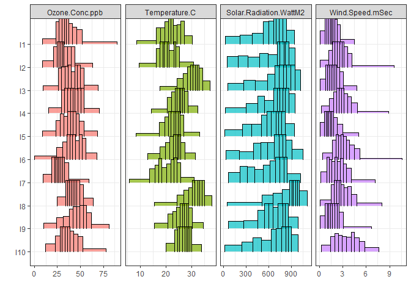

This is an [R Markdown](http://rmarkdown.rstudio.com) Notebook showing an application of the two-components regression model on the `OzoneFull` dataset which is available in the `HistDAWass` package. We used the `HistDAWass` package and the therein build functions for the regression analysis.

# Install and load the package

For installing and loading the package in your environment launch the following code:


```r
## if not installed in your environment
#  install.packages("HistDAWass")
library(HistDAWass) #load the package
#other useful packages
library(tidyverse)
library(plotly)
library(patchwork)
```

# Data description

The `OzoneFull` dataset is a `MatH` object, namely, a table of histogram-valued data, representing aggregate raw data downloaded from the Clean Air Status and Trends Network (CASTNET) ([\<http://java.epa.gov/castnet/\>](http://java.epa.gov/castnet/%7D,)), an air-quality monitoring network of the United States, designed to provide data to assess trends in air quality, atmospheric deposition and ecological effects due to changes in air pollutant emissions.

We selected data on the ozone concentration in 78 USA sites among those depicted in Fig. \@ref(fig:map) for which the monitored data were complete (i.e., without missing values for each of the selected characteristics).

<div class="figure">

<p class="caption">CASTNET network sites map</p>
</div>

Ozone is a gas that can cause respiratory diseases. In the literature, several studies reported evidence of the relation between the ozone concentration level and temperature, wind speed and the solar radiation (see, for example,[@Duenas2002]).

Given the distribution of \emph{temperature} ($X_{1}$) (degrees Celsius), the distribution of \emph{solar radiation} ($X_{2}$) (Watts per square meter) and the distribution of \emph{wind speed} ($X_{3}$) (meters per second), the main objective is to predict the distribution of \emph{ozone concentration} ($Y$) (Particles per billion) using a linear model. CASTNET collects hourly data and, as the period of observation, we chose the summer season of 2010 and the central hours of the days (10 a.m.--5 p.m.).

We collected the histograms of the values of each site observed for the four variables. The histograms were constructed using 100 equi-frequent bins, namely, we have bins of different widths but of constant frequency. The histogram representation of varying bin-width histograms in not always pleasant, we plot the data using only ten equi-frequent bins. We show the first 5 of 78 sites.


```r
plot(New_OZ[1:10,])+theme_bw()+xlab("")+ylab("")+theme(legend.position = "none")
```

<!-- -->

Each cell of the data table contains a histogram. We see the first three rows of the matrix

<div data-pagedtable="false">
  <script data-pagedtable-source type="application/json">
{"columns":[{"label":["ST_ID"],"name":[1],"type":["chr"],"align":["left"]},{"label":["Bin"],"name":[2],"type":["chr"],"align":["left"]},{"label":["p"],"name":[3],"type":["dbl"],"align":["right"]},{"label":["Bin1"],"name":[4],"type":["chr"],"align":["left"]},{"label":["p1"],"name":[5],"type":["dbl"],"align":["right"]},{"label":["Bin2"],"name":[6],"type":["chr"],"align":["left"]},{"label":["p2"],"name":[7],"type":["dbl"],"align":["right"]},{"label":["Bin3"],"name":[8],"type":["chr"],"align":["left"]},{"label":["p3"],"name":[9],"type":["dbl"],"align":["right"]}],"data":[{"1":"I1","2":"8.77-16.62","3":"0.01","4":"8.45-11.65","5":"0.01","6":"25.29- 75.88","7":"0.01","8":"0.10-0.35","9":"0.01"},{"1":"I1","2":"16.62-17.54","3":"0.01","4":"11.65-13.06","5":"0.01","6":"75.88-108.27","7":"0.01","8":"0.35-0.41","9":"0.01"},{"1":"I1","2":"17.54-18.42","3":"0.01","4":"13.06-13.83","5":"0.01","6":"108.27-111.43","7":"0.01","8":"0.41-0.50","9":"0.01"},{"1":"I1","2":"18.42-18.90","3":"0.01","4":"13.83-14.12","5":"0.01","6":"111.43-114.09","7":"0.01","8":"0.50-0.55","9":"0.01"},{"1":"I1","2":"...-...","3":"0.01","4":"...-...","5":"0.01","6":"...-...","7":"0.01","8":"...-...","9":"0.01"},{"1":"I1","2":"65.68-67.78","3":"0.01","4":"28.87-29.23","5":"0.01","6":"914.12-933.30","7":"0.01","8":"3.52-3.79","9":"0.01"},{"1":"I1","2":"67.78-89.60","3":"0.01","4":"29.23-30.18","5":"0.01","6":"933.30-942.00","7":"0.01","8":"3.79-4.48","9":"0.01"},{"1":"I2","2":"9.00-15.00","3":"0.01","4":"9.50- 9.75","5":"0.01","6":"49.00- 56.16","7":"0.01","8":"0.10-0.55","9":"0.01"},{"1":"I2","2":"15.00-17.00","3":"0.01","4":"9.75-10.38","5":"0.01","6":"56.16- 71.50","7":"0.01","8":"0.55-0.80","9":"0.01"},{"1":"I2","2":"17.00-18.00","3":"0.01","4":"10.38-10.60","5":"0.01","6":"71.50-102.84","7":"0.01","8":"0.80-0.80","9":"0.01"},{"1":"I2","2":"18.00-19.00","3":"0.01","4":"10.60-11.24","5":"0.01","6":"102.84-133.40","7":"0.01","8":"0.80-0.90","9":"0.01"},{"1":"I2","2":"...-...","3":"0.01","4":"...-...","5":"0.01","6":"...-...","7":"0.01","8":"...-...","9":"0.01"},{"1":"I2","2":"54.24-58.00","3":"0.01","4":"29.02-29.60","5":"0.01","6":"910.00-916.84","7":"0.01","8":"7.52-8.37","9":"0.01"},{"1":"I2","2":"58.00-63.00","3":"0.01","4":"29.60-30.70","5":"0.01","6":"916.84-944.00","7":"0.01","8":"8.37-9.60","9":"0.01"},{"1":"I3","2":"9.25-17.99","3":"0.01","4":"17.57-20.13","5":"0.01","6":"52.57- 78.67","7":"0.01","8":"0.08-0.26","9":"0.01"},{"1":"I3","2":"17.99-20.31","3":"0.01","4":"20.13-20.63","5":"0.01","6":"78.67-105.48","7":"0.01","8":"0.26-0.38","9":"0.01"},{"1":"I3","2":"20.31-21.41","3":"0.01","4":"20.63-21.13","5":"0.01","6":"105.48-116.96","7":"0.01","8":"0.38-0.41","9":"0.01"},{"1":"I3","2":"21.41-22.20","3":"0.01","4":"21.13-21.61","5":"0.01","6":"116.96-140.19","7":"0.01","8":"0.41-0.45","9":"0.01"},{"1":"I3","2":"...-...","3":"0.01","4":"...-...","5":"0.01","6":"...-...","7":"0.01","8":"...-...","9":"0.01"},{"1":"I3","2":"62.38-64.11","3":"0.01","4":"36.10-36.42","5":"0.01","6":"979.18- 990.02","7":"0.01","8":"3.77-4.07","9":"0.01"},{"1":"I3","2":"64.11-69.45","3":"0.01","4":"36.42-37.07","5":"0.01","6":"990.02-1020.00","7":"0.01","8":"4.07-4.81","9":"0.01"}],"options":{"columns":{"min":{},"max":[10]},"rows":{"min":[10],"max":[10]},"pages":{}}}
  </script>
</div>

## Basic Wasserstein-based statistics

### The Frechét mean distributions of the the four variables

We start computing the Frechét mean of each distributional variable using the $L_2$ Wassertein distance as in [@IrpVer2015]

#### Ozone


```r
mean_Oz<-WH.vec.mean(OzoneFull[,1])
mean_Oz
```

```
## Output shows the first five and the last five bins due to eccesive length 
##                  X                 p
## Bin_1   [14.789-19.479)              0.01
## Bin_2   [19.479-21.567)              0.01
## Bin_3   [21.567-22.872)              0.01
## Bin_4   [22.872-23.912)              0.01
## Bin_5   [23.912-24.894)              0.01
## ...               ...               ...
## Bin_96 [57.865 ; 58.948)              0.01
## Bin_97 [58.948 ; 60.278)              0.01
## Bin_98 [60.278 ; 61.979)              0.01
## Bin_99 [61.979 ; 64.515)              0.01
## Bin_100 [64.515 ; 71.095)              0.01
## 
##  mean =  41.2147347282052   std  =  9.96802979889176 
## 
```

#### Temperature


```r
mean_Temp<-WH.vec.mean(OzoneFull[,2])
mean_Temp
```

```
## Output shows the first five and the last five bins due to eccesive length 
##                  X                 p
## Bin_1   [10.355-12.383)              0.01
## Bin_2    [12.383-13.91)              0.01
## Bin_3      [13.91-15.1)              0.01
## Bin_4     [15.1-15.853)              0.01
## Bin_5   [15.853-16.473)              0.01
## ...               ...               ...
## Bin_96 [28.795 ; 29.106)              0.01
## Bin_97 [29.106 ; 29.447)              0.01
## Bin_98 [29.447 ; 29.888)              0.01
## Bin_99 [29.888 ; 30.569)              0.01
## Bin_100 [30.569 ; 31.602)              0.01
## 
##  mean =  23.2805152974359   std  =  3.76407404885491 
## 
```

#### Solar Radiation


```r
mean_SR<-WH.vec.mean(OzoneFull[,3])
mean_SR
```

```
## Output shows the first five and the last five bins due to eccesive length 
##                  X                 p
## Bin_1   [54.186-89.738)              0.01
## Bin_2   [89.738-123.48)              0.01
## Bin_3   [123.48-148.68)              0.01
## Bin_4    [148.68-177.1)              0.01
## Bin_5    [177.1-202.25)              0.01
## ...               ...               ...
## Bin_96 [926.63 ; 934.72)              0.01
## Bin_97 [934.72 ; 943.94)              0.01
## Bin_98 [943.94 ; 955.36)              0.01
## Bin_99 [955.36 ; 970.49)              0.01
## Bin_100 [970.49 ; 997.58)              0.01
## 
##  mean =  645.350728000001   std  =  225.781773829828 
## 
```

#### Wind Speed


```r
mean_WS<-WH.vec.mean(OzoneFull[,4])
mean_WS
```

```
## Output shows the first five and the last five bins due to eccesive length 
##                  X                 p
## Bin_1 [0.11386-0.36784)              0.01
## Bin_2 [0.36784-0.52206)              0.01
## Bin_3 [0.52206-0.62055)              0.01
## Bin_4 [0.62055-0.70678)              0.01
## Bin_5 [0.70678-0.77491)              0.01
## ...               ...               ...
## Bin_96 [4.3248 ; 4.4692)              0.01
## Bin_97 [4.4692 ; 4.6702)              0.01
## Bin_98 [4.6702 ; 4.9502)              0.01
## Bin_99 [4.9502 ; 5.4696)              0.01
## Bin_100 [5.4696 ; 6.5707)              0.01
## 
##  mean =  2.34883345512821   std  =  1.09865034695591 
## 
```

### The plot of the four barycenters


```r
p_oz<-plot(mean_Oz,col="black")+ggtitle("Ozone conc.")+theme_bw()
p_Temp<-plot(mean_Temp,col="grey50", border="grey50")+ggtitle("Temperature")+theme_bw()
p_SR<-plot(mean_SR,col="grey50", border="grey50")+ggtitle("Solar Radiation")+theme_bw()
p_WS<-plot(mean_WS,col="grey50", border="grey50")+ggtitle("Wind speed")+theme_bw()


p_oz+p_Temp+p_SR+p_WS
```

<!-- -->

In Table \ref{TAB:OZO_summarystat}, we report the main summary statistics for the four histogram variables, while in Fig. \ref{Fig: OZO_barycenters}, we provide the four barycenters of the 78 sites for each variable. We note, for example, the different skewness of the barycenters. In general, when the barycenter is skewed, the observed distributions are in general skewed in the same direction. This is not in general true for symmetric barycenters, which can be generated both from left- and right-skewed distributions.


```r
# mean values of the Frechet means
aver<-c(meanH(mean_Oz),meanH(mean_Temp),meanH(mean_SR),meanH(mean_WS))
# standard deviations values of the Frechet means
std<-c(stdH(mean_Oz),stdH(mean_Temp),stdH(mean_SR),stdH(mean_WS))
# first quartiles of the Frechet means
Q1s<-c(compQ(mean_Oz,p = 0.25),compQ(mean_Temp,p = 0.25),
       compQ(mean_SR,p = 0.25),compQ(mean_WS,  p = 0.25))
# medians of the Frechet means
meds<-c(compQ(mean_Oz,p = 0.5),compQ(mean_Temp,p = 0.5),
        compQ(mean_SR,p = 0.5),compQ(mean_WS,  p = 0.5))
# third quartiles of the Frechet means
Q3s<-c(compQ(mean_Oz,p = 0.75),compQ(mean_Temp,p = 0.75),
       compQ(mean_SR,p = 0.75),compQ(mean_WS, p = 0.75))

# skewness measures values of the Frechet means
ske<-c(skewH(mean_Oz),skewH(mean_Temp),skewH(mean_SR),skewH(mean_WS))
# kurtosis measures values of the Frechet means
kur<-c(kurtH(mean_Oz),kurtH(mean_Temp),kurtH(mean_SR),kurtH(mean_WS))

# Let's put all in a table

FR_means_stats<-tibble(
  Variable=c("Ozone", "Temperature","Solar Radiation","Wind Speed"),
  Mean=round(aver,2),
  Std=round(std,2),
  First_Q=round(Q1s,2),
  Median=round(meds,2),
  Third_Q=round(Q3s,2),
  Skewness=round(ske,3),
  Kurtosis=round(kur,3)
)

FR_means_stats
```

<div data-pagedtable="false">
  <script data-pagedtable-source type="application/json">
{"columns":[{"label":["Variable"],"name":[1],"type":["chr"],"align":["left"]},{"label":["Mean"],"name":[2],"type":["dbl"],"align":["right"]},{"label":["Std"],"name":[3],"type":["dbl"],"align":["right"]},{"label":["First_Q"],"name":[4],"type":["dbl"],"align":["right"]},{"label":["Median"],"name":[5],"type":["dbl"],"align":["right"]},{"label":["Third_Q"],"name":[6],"type":["dbl"],"align":["right"]},{"label":["Skewness"],"name":[7],"type":["dbl"],"align":["right"]},{"label":["Kurtosis"],"name":[8],"type":["dbl"],"align":["right"]}],"data":[{"1":"Ozone","2":"41.21","3":"9.97","4":"34.27","5":"41.15","6":"48.05","7":"0.078","8":"2.778"},{"1":"Temperature","2":"23.28","3":"3.76","4":"21.04","5":"23.71","6":"25.93","7":"-0.596","8":"3.393"},{"1":"Solar Radiation","2":"645.35","3":"225.78","4":"496.05","5":"701.63","6":"826.56","7":"-0.715","8":"2.580"},{"1":"Wind Speed","2":"2.35","3":"1.10","4":"1.54","5":"2.22","6":"3.03","7":"0.649","8":"3.456"}],"options":{"columns":{"min":{},"max":[10]},"rows":{"min":[10],"max":[10]},"pages":{}}}
  </script>
</div>

We show the covariances and correlations of the variables in the next two tables, and the standard deviations of the variables computed according to what is proposed in [@IrpVer2015] :


```r
# Covariance matrix
Cov_M<-WH.var.covar(OzoneFull)
# Standard deviation of variables
Std_vars<-sqrt(diag(Cov_M))


#Correlation matrix
Corr_M<-round(WH.correlation(OzoneFull),3)


knitr::kable(round(Cov_M,2), caption="Covariance matrix")
```


Table: Covariance matrix

|                       | Ozone.Conc.ppb| Temperature.C| Solar.Radiation.WattM2| Wind.Speed.mSec|
|:----------------------|--------------:|-------------:|----------------------:|---------------:|
|Ozone.Conc.ppb         |          90.81|          9.05|                 690.92|            5.03|
|Temperature.C          |           9.05|         14.76|                 197.71|            0.72|
|Solar.Radiation.WattM2 |         690.92|        197.71|               12866.55|           65.47|
|Wind.Speed.mSec        |           5.03|          0.72|                  65.47|            1.73|

```r
knitr::kable(round(Std_vars,2), caption="Standard deviations")
```


Table: Standard deviations

|                       |      x|
|:----------------------|------:|
|Ozone.Conc.ppb         |   9.53|
|Temperature.C          |   3.84|
|Solar.Radiation.WattM2 | 113.43|
|Wind.Speed.mSec        |   1.31|

```r
knitr::kable(Corr_M, caption="Correlation matrix")
```


Table: Correlation matrix

|                       | Ozone.Conc.ppb| Temperature.C| Solar.Radiation.WattM2| Wind.Speed.mSec|
|:----------------------|--------------:|-------------:|----------------------:|---------------:|
|Ozone.Conc.ppb         |          1.000|         0.247|                  0.639|           0.402|
|Temperature.C          |          0.247|         1.000|                  0.454|           0.143|
|Solar.Radiation.WattM2 |          0.639|         0.454|                  1.000|           0.439|
|Wind.Speed.mSec        |          0.402|         0.143|                  0.439|           1.000|

## Two-components regression model

Now we estimate the model

$$
Y=\beta_0+\beta_1\mu_{X_1}+\beta_2\mu_{X_2}+\beta_3\mu_{X_3}+
\gamma_1{X^c_1}+\gamma_2{X^c_2}+\gamma_3{X^c_3}+\varepsilon
$$


```r
results<-WH.regression.two.components(OzoneFull,1,c(2:4))
knitr::kable(data.frame(Coeff.est.=round(results,3)),
             caption="regression parameters")
```


Table: regression parameters

|                           | Coeff.est.|
|:--------------------------|----------:|
|(AV_Intercept)             |      2.927|
|AV_Temperature.C           |     -0.346|
|AV_Solar.Radiation.WattM2  |      0.070|
|AV_Wind.Speed.mSec         |      0.395|
|CEN_Temperature.C          |      0.915|
|CEN_Solar.Radiation.WattM2 |      0.018|
|CEN_Wind.Speed.mSec        |      1.887|

We compute the goodness of fit statistics


```r
# we compute the expected distributions
expected<-WH.regression.two.components.predict(OzoneFull[,2:4],results)

# we compute the GOF measures

GOFS<- WH.regression.GOF(OzoneFull[,1],expected)
GOFS
```

```
## $RMSE_W
## [1] 7.000022
## 
## $OMEGA
## [1] 0.7423388
## 
## $PSEUDOR2
## $PSEUDOR2$index
## [1] 0.4604191
## 
## $PSEUDOR2$details
##       TotSSQ        SSQ.R        SSQ.E         Bias    SSQ.R.rel    SSQ.E.rel 
## 7083.3190671 4070.7089580 3822.0239212 -809.4138121    0.5746895    0.5395809 
## SSQ.bias.rel 
##   -0.1142704
```

## Parametric bootstrap confidence intervals for the model

We perform a bootstrap estimates of the confidence intervals of the parameters using 1,000 replications


```r
set.seed(12345)
DATA<-OzoneFull

n<-get.MatH.nrows(DATA)
repl<-1000
for (r in 1:repl){
  els<-sample(c(1:n),n,replace = T)
  par<-WH.regression.two.components(DATA[els,],1,2:4)
  if (r>1){
  WH_BOOT=rbind(WH_BOOT,par)
  }else{
    WH_BOOT=par  
  }
  #if ((r%%100)==0){print(r)}
}
```


```r
Boot_results<-data.frame(model.est.=results,
                         boot.mean.est.=colMeans(WH_BOOT),
                         bias=results-colMeans(WH_BOOT),
                         q.2.5=t(data.frame(WH_BOOT) %>% summarise(across(1:7, ~quantile(.,probs=c(0.025))))),
                         q.97.5=t(data.frame(WH_BOOT) %>% summarise(across(1:7, ~quantile(.,probs=c(0.975)))))
)

knitr::kable(round(Boot_results,3), caption="Bootstrap results")
```


Table: Bootstrap results

|                           | model.est.| boot.mean.est.|   bias|   q.2.5| q.97.5|
|:--------------------------|----------:|--------------:|------:|-------:|------:|
|(AV_Intercept)             |      2.927|          3.209| -0.282| -11.587| 15.136|
|AV_Temperature.C           |     -0.346|         -0.352|  0.006|  -0.813|  0.179|
|AV_Solar.Radiation.WattM2  |      0.070|          0.070|  0.000|   0.051|  0.090|
|AV_Wind.Speed.mSec         |      0.395|          0.378|  0.017|  -1.301|  1.942|
|CEN_Temperature.C          |      0.915|          0.911|  0.004|   0.474|  1.371|
|CEN_Solar.Radiation.WattM2 |      0.018|          0.018|  0.000|   0.012|  0.024|
|CEN_Wind.Speed.mSec        |      1.887|          1.973| -0.087|   1.044|  3.118|

From the goodness-of-fit measures of the full model, we can conclude that the model has .....

We performed a parametric bootstrap estimate of the model.

Reading the bootstrap results, we may assert that the ozone concentration distribution of a site depends on the mean \emph{solar
radiation}, where for each $\Delta Watt/m^{2}$ a $0.070\;(ppb)$ variation of the \emph{ozone concentration} mean level is expected, while in general we cannot say that the mean levels of \emph{temperature} and \emph{wind
speed} induce a significant variation of the \emph{ozone concentration
level }($95\%$ bootstrap confidence intervals include the zero). Furthermore, the variability of the \emph{ozone concentration} is almost the same of the \emph{temperature }($0.928$); a unitary variation in the variability of the \emph{solar radiation} induces a variation of $0.018\;(ppb)$ and a variation in the variability of the \emph{wind speed} causes an increase in the variability of $1.958\;(ppb)$.

## Residual analysis


```r
Res<-matrix(0,n,length(expected@M[1,1][[1]]@x))
C<-matrix(0,n,length(expected@M[1,1][[1]]@x)-1)
R<-matrix(0,n,length(expected@M[1,1][[1]]@x)-1)
for(i in 1:n){
  Res[i,]<-expected@M[i,1][[1]]@x-OzoneFull@M[i,1][[1]]@x
  R[i,]<-diff(expected@M[i,1][[1]]@x-OzoneFull@M[i,1][[1]]@x)/2
  C[i,]<-(Res[i,1:(length(Res[i,])-1)]+
            Res[i,2:(length(Res[i,]))])/2
}

SDRES<-sqrt((0.01*(sum(C^2)-sum(colMeans(C)^2)+
                    1/3*(sum(R^2)-sum(colMeans(R)^2))))/n)

Res_st<-data.frame(ID=c(1:n),Res/SDRES)
Res<-data.frame(ID=c(1:n),Res)
```


```r
MyL<-Res %>% pivot_longer(-ID,names_to = "var",values_to = "val")%>% mutate(Q=rep(0:100,78)/100)
MyL_st<-Res_st %>% pivot_longer(-ID,names_to = "var",values_to = "val")%>% mutate(Q=rep(0:100,78)/100)
```

#### Plot of standardized residual functions


```r
res_pl<-ggplotly(
  ggplot(MyL_st,aes(x=Q,y=val,color=as.factor(ID)))+
    geom_line(aes(group=as.factor(ID)),alpha=0.4)+
    geom_line(inherit.aes = FALSE,
              data=(MyL_st %>% group_by(Q) %>% summarize(v=mean(val))),aes(x=Q,y=v))+
    geom_line(inherit.aes = FALSE,
              data=MyL_st %>% filter(ID%in%c(22,37,63)) ,
              aes(x=Q,y=val,group=as.factor(ID)),
              linetype = 2,color="black")+
    xlab("prob")+ylab("standardized residuals")+
    theme_bw()
    )

res_pl
```

```{=html}
<div id="htmlwidget-768e4ad327e89900964e" style="width:672px;height:480px;" class="plotly html-widget"></div>
<script type="application/json" data-for="htmlwidget-768e4ad327e89900964e">{"x":{"data":[{"x":[0,0.01,0.02,0.03,0.04,0.05,0.06,0.07,0.08,0.09,0.1,0.11,0.12,0.13,0.14,0.15,0.16,0.17,0.18,0.19,0.2,0.21,0.22,0.23,0.24,0.25,0.26,0.27,0.28,0.29,0.3,0.31,0.32,0.33,0.34,0.35,0.36,0.37,0.38,0.39,0.4,0.41,0.42,0.43,0.44,0.45,0.46,0.47,0.48,0.49,0.5,0.51,0.52,0.53,0.54,0.55,0.56,0.57,0.58,0.59,0.6,0.61,0.62,0.63,0.64,0.65,0.66,0.67,0.68,0.69,0.7,0.71,0.72,0.73,0.74,0.75,0.76,0.77,0.78,0.79,0.8,0.81,0.82,0.83,0.84,0.85,0.86,0.87,0.88,0.89,0.9,0.91,0.92,0.93,0.94,0.95,0.96,0.97,0.98,0.99,1],"y":[0.509890960229021,0.00493616047917502,0.160364116191404,0.165313001051491,0.157274713938027,0.0929638363771469,0.114417626449348,0.0457545378599943,0.089024211936619,0.0905024642805869,0.128929640629824,0.140554224144258,0.149061174631276,0.189888122816128,0.241550872954549,0.318286057218045,0.345323887416563,0.316966520392525,0.278273429060149,0.315871365338609,0.346746032620462,0.324193358420318,0.353729644419629,0.350790798915576,0.386718513465025,0.432060611684512,0.45269777696078,0.477703849568556,0.535449999337194,0.545665671897181,0.559167091420821,0.532037604524511,0.532484286419363,0.508704318516525,0.518013981951176,0.511075672259428,0.503066094249402,0.508675859840667,0.505464749032846,0.556573236468571,0.58687485872165,0.586059017598652,0.598649689029606,0.603307356698195,0.627209976193416,0.642103354416465,0.63048805462001,0.619911171997444,0.603772649852324,0.614868877642776,0.585175082698368,0.565612272786962,0.561385882682521,0.552701054928483,0.520819012035554,0.496118700664765,0.484184976846866,0.492850976668796,0.477667502634756,0.467389308459749,0.478729479706327,0.479390439405579,0.480600409432549,0.458562626322256,0.44268167806403,0.430500234011673,0.410722159304783,0.389458992709271,0.327592351471922,0.290607292718957,0.266786852369583,0.189377526796665,0.139078091114085,0.136208174629216,0.130011670184466,0.0981760653567357,0.0894425672606965,0.03566098817899,0.0249123376250973,0.000208781740132634,-0.0279096963192602,-0.0502002431932677,-0.096387837749066,-0.147327992912983,-0.141409367230504,-0.182114956795056,-0.231253331887178,-0.322757677848434,-0.330361835670553,-0.360505180030784,-0.40756800272116,-0.484558448062793,-0.712684855685621,-0.769810169280177,-0.810330422893466,-0.907595494803844,-1.08992139891815,-1.40914028292558,-1.70300302349896,-1.83211091055586,-4.61687573882037],"text":["as.factor(ID): 1<br />Q: 0.00<br />val:  5.098910e-01<br />as.factor(ID): 1","as.factor(ID): 1<br />Q: 0.01<br />val:  4.936160e-03<br />as.factor(ID): 1","as.factor(ID): 1<br />Q: 0.02<br />val:  1.603641e-01<br />as.factor(ID): 1","as.factor(ID): 1<br />Q: 0.03<br />val:  1.653130e-01<br />as.factor(ID): 1","as.factor(ID): 1<br />Q: 0.04<br />val:  1.572747e-01<br />as.factor(ID): 1","as.factor(ID): 1<br />Q: 0.05<br />val:  9.296384e-02<br />as.factor(ID): 1","as.factor(ID): 1<br />Q: 0.06<br />val:  1.144176e-01<br />as.factor(ID): 1","as.factor(ID): 1<br />Q: 0.07<br />val:  4.575454e-02<br />as.factor(ID): 1","as.factor(ID): 1<br />Q: 0.08<br />val:  8.902421e-02<br />as.factor(ID): 1","as.factor(ID): 1<br />Q: 0.09<br />val:  9.050246e-02<br />as.factor(ID): 1","as.factor(ID): 1<br />Q: 0.10<br />val:  1.289296e-01<br />as.factor(ID): 1","as.factor(ID): 1<br />Q: 0.11<br />val:  1.405542e-01<br />as.factor(ID): 1","as.factor(ID): 1<br />Q: 0.12<br />val:  1.490612e-01<br />as.factor(ID): 1","as.factor(ID): 1<br />Q: 0.13<br />val:  1.898881e-01<br />as.factor(ID): 1","as.factor(ID): 1<br />Q: 0.14<br />val:  2.415509e-01<br />as.factor(ID): 1","as.factor(ID): 1<br />Q: 0.15<br />val:  3.182861e-01<br />as.factor(ID): 1","as.factor(ID): 1<br />Q: 0.16<br />val:  3.453239e-01<br />as.factor(ID): 1","as.factor(ID): 1<br />Q: 0.17<br />val:  3.169665e-01<br />as.factor(ID): 1","as.factor(ID): 1<br />Q: 0.18<br />val:  2.782734e-01<br />as.factor(ID): 1","as.factor(ID): 1<br />Q: 0.19<br />val:  3.158714e-01<br />as.factor(ID): 1","as.factor(ID): 1<br />Q: 0.20<br />val:  3.467460e-01<br />as.factor(ID): 1","as.factor(ID): 1<br />Q: 0.21<br />val:  3.241934e-01<br />as.factor(ID): 1","as.factor(ID): 1<br />Q: 0.22<br />val:  3.537296e-01<br />as.factor(ID): 1","as.factor(ID): 1<br />Q: 0.23<br />val:  3.507908e-01<br />as.factor(ID): 1","as.factor(ID): 1<br />Q: 0.24<br />val:  3.867185e-01<br />as.factor(ID): 1","as.factor(ID): 1<br />Q: 0.25<br />val:  4.320606e-01<br />as.factor(ID): 1","as.factor(ID): 1<br />Q: 0.26<br />val:  4.526978e-01<br />as.factor(ID): 1","as.factor(ID): 1<br />Q: 0.27<br />val:  4.777038e-01<br />as.factor(ID): 1","as.factor(ID): 1<br />Q: 0.28<br />val:  5.354500e-01<br />as.factor(ID): 1","as.factor(ID): 1<br />Q: 0.29<br />val:  5.456657e-01<br />as.factor(ID): 1","as.factor(ID): 1<br />Q: 0.30<br />val:  5.591671e-01<br />as.factor(ID): 1","as.factor(ID): 1<br />Q: 0.31<br />val:  5.320376e-01<br />as.factor(ID): 1","as.factor(ID): 1<br />Q: 0.32<br />val:  5.324843e-01<br />as.factor(ID): 1","as.factor(ID): 1<br />Q: 0.33<br />val:  5.087043e-01<br />as.factor(ID): 1","as.factor(ID): 1<br />Q: 0.34<br />val:  5.180140e-01<br />as.factor(ID): 1","as.factor(ID): 1<br />Q: 0.35<br />val:  5.110757e-01<br />as.factor(ID): 1","as.factor(ID): 1<br />Q: 0.36<br />val:  5.030661e-01<br />as.factor(ID): 1","as.factor(ID): 1<br />Q: 0.37<br />val:  5.086759e-01<br />as.factor(ID): 1","as.factor(ID): 1<br />Q: 0.38<br />val:  5.054647e-01<br />as.factor(ID): 1","as.factor(ID): 1<br />Q: 0.39<br />val:  5.565732e-01<br />as.factor(ID): 1","as.factor(ID): 1<br />Q: 0.40<br />val:  5.868749e-01<br />as.factor(ID): 1","as.factor(ID): 1<br />Q: 0.41<br />val:  5.860590e-01<br />as.factor(ID): 1","as.factor(ID): 1<br />Q: 0.42<br />val:  5.986497e-01<br />as.factor(ID): 1","as.factor(ID): 1<br />Q: 0.43<br />val:  6.033074e-01<br />as.factor(ID): 1","as.factor(ID): 1<br />Q: 0.44<br />val:  6.272100e-01<br />as.factor(ID): 1","as.factor(ID): 1<br />Q: 0.45<br />val:  6.421034e-01<br />as.factor(ID): 1","as.factor(ID): 1<br />Q: 0.46<br />val:  6.304881e-01<br />as.factor(ID): 1","as.factor(ID): 1<br />Q: 0.47<br />val:  6.199112e-01<br />as.factor(ID): 1","as.factor(ID): 1<br />Q: 0.48<br />val:  6.037726e-01<br />as.factor(ID): 1","as.factor(ID): 1<br />Q: 0.49<br />val:  6.148689e-01<br />as.factor(ID): 1","as.factor(ID): 1<br />Q: 0.50<br />val:  5.851751e-01<br />as.factor(ID): 1","as.factor(ID): 1<br />Q: 0.51<br />val:  5.656123e-01<br />as.factor(ID): 1","as.factor(ID): 1<br />Q: 0.52<br />val:  5.613859e-01<br />as.factor(ID): 1","as.factor(ID): 1<br />Q: 0.53<br />val:  5.527011e-01<br />as.factor(ID): 1","as.factor(ID): 1<br />Q: 0.54<br />val:  5.208190e-01<br />as.factor(ID): 1","as.factor(ID): 1<br />Q: 0.55<br />val:  4.961187e-01<br />as.factor(ID): 1","as.factor(ID): 1<br />Q: 0.56<br />val:  4.841850e-01<br />as.factor(ID): 1","as.factor(ID): 1<br />Q: 0.57<br />val:  4.928510e-01<br />as.factor(ID): 1","as.factor(ID): 1<br />Q: 0.58<br />val:  4.776675e-01<br />as.factor(ID): 1","as.factor(ID): 1<br />Q: 0.59<br />val:  4.673893e-01<br />as.factor(ID): 1","as.factor(ID): 1<br />Q: 0.60<br />val:  4.787295e-01<br />as.factor(ID): 1","as.factor(ID): 1<br />Q: 0.61<br />val:  4.793904e-01<br />as.factor(ID): 1","as.factor(ID): 1<br />Q: 0.62<br />val:  4.806004e-01<br />as.factor(ID): 1","as.factor(ID): 1<br />Q: 0.63<br />val:  4.585626e-01<br />as.factor(ID): 1","as.factor(ID): 1<br />Q: 0.64<br />val:  4.426817e-01<br />as.factor(ID): 1","as.factor(ID): 1<br />Q: 0.65<br />val:  4.305002e-01<br />as.factor(ID): 1","as.factor(ID): 1<br />Q: 0.66<br />val:  4.107222e-01<br />as.factor(ID): 1","as.factor(ID): 1<br />Q: 0.67<br />val:  3.894590e-01<br />as.factor(ID): 1","as.factor(ID): 1<br />Q: 0.68<br />val:  3.275924e-01<br />as.factor(ID): 1","as.factor(ID): 1<br />Q: 0.69<br />val:  2.906073e-01<br />as.factor(ID): 1","as.factor(ID): 1<br />Q: 0.70<br />val:  2.667869e-01<br />as.factor(ID): 1","as.factor(ID): 1<br />Q: 0.71<br />val:  1.893775e-01<br />as.factor(ID): 1","as.factor(ID): 1<br />Q: 0.72<br />val:  1.390781e-01<br />as.factor(ID): 1","as.factor(ID): 1<br />Q: 0.73<br />val:  1.362082e-01<br />as.factor(ID): 1","as.factor(ID): 1<br />Q: 0.74<br />val:  1.300117e-01<br />as.factor(ID): 1","as.factor(ID): 1<br />Q: 0.75<br />val:  9.817607e-02<br />as.factor(ID): 1","as.factor(ID): 1<br />Q: 0.76<br />val:  8.944257e-02<br />as.factor(ID): 1","as.factor(ID): 1<br />Q: 0.77<br />val:  3.566099e-02<br />as.factor(ID): 1","as.factor(ID): 1<br />Q: 0.78<br />val:  2.491234e-02<br />as.factor(ID): 1","as.factor(ID): 1<br />Q: 0.79<br />val:  2.087817e-04<br />as.factor(ID): 1","as.factor(ID): 1<br />Q: 0.80<br />val: -2.790970e-02<br />as.factor(ID): 1","as.factor(ID): 1<br />Q: 0.81<br />val: -5.020024e-02<br />as.factor(ID): 1","as.factor(ID): 1<br />Q: 0.82<br />val: -9.638784e-02<br />as.factor(ID): 1","as.factor(ID): 1<br />Q: 0.83<br />val: -1.473280e-01<br />as.factor(ID): 1","as.factor(ID): 1<br />Q: 0.84<br />val: -1.414094e-01<br />as.factor(ID): 1","as.factor(ID): 1<br />Q: 0.85<br />val: -1.821150e-01<br />as.factor(ID): 1","as.factor(ID): 1<br />Q: 0.86<br />val: -2.312533e-01<br />as.factor(ID): 1","as.factor(ID): 1<br />Q: 0.87<br />val: -3.227577e-01<br />as.factor(ID): 1","as.factor(ID): 1<br />Q: 0.88<br />val: -3.303618e-01<br />as.factor(ID): 1","as.factor(ID): 1<br />Q: 0.89<br />val: -3.605052e-01<br />as.factor(ID): 1","as.factor(ID): 1<br />Q: 0.90<br />val: -4.075680e-01<br />as.factor(ID): 1","as.factor(ID): 1<br />Q: 0.91<br />val: -4.845584e-01<br />as.factor(ID): 1","as.factor(ID): 1<br />Q: 0.92<br />val: -7.126849e-01<br />as.factor(ID): 1","as.factor(ID): 1<br />Q: 0.93<br />val: -7.698102e-01<br />as.factor(ID): 1","as.factor(ID): 1<br />Q: 0.94<br />val: -8.103304e-01<br />as.factor(ID): 1","as.factor(ID): 1<br />Q: 0.95<br />val: -9.075955e-01<br />as.factor(ID): 1","as.factor(ID): 1<br />Q: 0.96<br />val: -1.089921e+00<br />as.factor(ID): 1","as.factor(ID): 1<br />Q: 0.97<br />val: -1.409140e+00<br />as.factor(ID): 1","as.factor(ID): 1<br />Q: 0.98<br />val: -1.703003e+00<br />as.factor(ID): 1","as.factor(ID): 1<br />Q: 0.99<br />val: -1.832111e+00<br />as.factor(ID): 1","as.factor(ID): 1<br />Q: 1.00<br />val: -4.616876e+00<br />as.factor(ID): 1"],"type":"scatter","mode":"lines","line":{"width":1.88976377952756,"color":"rgba(248,118,109,0.4)","dash":"solid"},"hoveron":"points","name":"1","legendgroup":"1","showlegend":true,"xaxis":"x","yaxis":"y","hoverinfo":"text","frame":null},{"x":[0,0.01,0.02,0.03,0.04,0.05,0.06,0.07,0.08,0.09,0.1,0.11,0.12,0.13,0.14,0.15,0.16,0.17,0.18,0.19,0.2,0.21,0.22,0.23,0.24,0.25,0.26,0.27,0.28,0.29,0.3,0.31,0.32,0.33,0.34,0.35,0.36,0.37,0.38,0.39,0.4,0.41,0.42,0.43,0.44,0.45,0.46,0.47,0.48,0.49,0.5,0.51,0.52,0.53,0.54,0.55,0.56,0.57,0.58,0.59,0.6,0.61,0.62,0.63,0.64,0.65,0.66,0.67,0.68,0.69,0.7,0.71,0.72,0.73,0.74,0.75,0.76,0.77,0.78,0.79,0.8,0.81,0.82,0.83,0.84,0.85,0.86,0.87,0.88,0.89,0.9,0.91,0.92,0.93,0.94,0.95,0.96,0.97,0.98,0.99,1],"y":[0.754344961433623,0.0681566417525773,-0.0255367360899615,-0.0581054197576019,-0.0108278111648645,0.381276910873894,0.307686375051736,0.38945376823732,0.415250239986761,0.510742646370576,0.566621711191722,0.480870209682838,0.533911575311501,0.48483316307868,0.550481896368588,0.515613020070178,0.556032017616247,0.472596871092003,0.510341797948257,0.563943875326054,0.668756410442885,0.619775690815567,0.689300304703285,0.783286714405973,0.810611520743225,0.876673182335337,0.767705836661153,0.866771580512232,0.927048035191703,0.977875990670132,1.01100985843207,1.07945518463703,1.12600226366883,1.07776578849233,1.07934861528248,1.10113734945395,1.13967078346595,1.18239435866477,1.23569988699722,1.28580858603781,1.19018266253049,1.21761222239741,1.25792646641381,1.28870813923019,1.22487491197788,1.27267903336572,1.34614776952284,1.4204928924123,1.47678204970345,1.52799795866269,1.44001174496422,1.4581706174553,1.48638582879475,1.51803686664133,1.56233876648735,1.59678865947909,1.47351769753286,1.48591925076781,1.5051256585556,1.54266355958568,1.57845975800643,1.47665152961165,1.49508783353553,1.53653881876968,1.45687194363036,1.49078194392078,1.56558100629632,1.46052541848176,1.48077936156625,1.56233661309622,1.45937609587506,1.46466614912342,1.50810898076008,1.37532543739634,1.41724934285277,1.28743541017788,1.30914860482065,1.35886808118789,1.22508335062771,1.27694900516065,1.15053956220006,1.17110776587356,1.07078030815834,1.08820654053799,1.15236169691912,1.04821263915973,1.10827929205426,1.01281049884145,1.0365736851699,0.986259742017764,1.04691417209647,0.938035715045195,1.0124573519303,0.959308055382512,0.986015835389423,0.74992847773895,0.722297378650026,0.69295578725922,1.09643981098631,0.883693729808057,0.715829863022002],"text":["as.factor(ID): 2<br />Q: 0.00<br />val:  7.543450e-01<br />as.factor(ID): 2","as.factor(ID): 2<br />Q: 0.01<br />val:  6.815664e-02<br />as.factor(ID): 2","as.factor(ID): 2<br />Q: 0.02<br />val: -2.553674e-02<br />as.factor(ID): 2","as.factor(ID): 2<br />Q: 0.03<br />val: -5.810542e-02<br />as.factor(ID): 2","as.factor(ID): 2<br />Q: 0.04<br />val: -1.082781e-02<br />as.factor(ID): 2","as.factor(ID): 2<br />Q: 0.05<br />val:  3.812769e-01<br />as.factor(ID): 2","as.factor(ID): 2<br />Q: 0.06<br />val:  3.076864e-01<br />as.factor(ID): 2","as.factor(ID): 2<br />Q: 0.07<br />val:  3.894538e-01<br />as.factor(ID): 2","as.factor(ID): 2<br />Q: 0.08<br />val:  4.152502e-01<br />as.factor(ID): 2","as.factor(ID): 2<br />Q: 0.09<br />val:  5.107426e-01<br />as.factor(ID): 2","as.factor(ID): 2<br />Q: 0.10<br />val:  5.666217e-01<br />as.factor(ID): 2","as.factor(ID): 2<br />Q: 0.11<br />val:  4.808702e-01<br />as.factor(ID): 2","as.factor(ID): 2<br />Q: 0.12<br />val:  5.339116e-01<br />as.factor(ID): 2","as.factor(ID): 2<br />Q: 0.13<br />val:  4.848332e-01<br />as.factor(ID): 2","as.factor(ID): 2<br />Q: 0.14<br />val:  5.504819e-01<br />as.factor(ID): 2","as.factor(ID): 2<br />Q: 0.15<br />val:  5.156130e-01<br />as.factor(ID): 2","as.factor(ID): 2<br />Q: 0.16<br />val:  5.560320e-01<br />as.factor(ID): 2","as.factor(ID): 2<br />Q: 0.17<br />val:  4.725969e-01<br />as.factor(ID): 2","as.factor(ID): 2<br />Q: 0.18<br />val:  5.103418e-01<br />as.factor(ID): 2","as.factor(ID): 2<br />Q: 0.19<br />val:  5.639439e-01<br />as.factor(ID): 2","as.factor(ID): 2<br />Q: 0.20<br />val:  6.687564e-01<br />as.factor(ID): 2","as.factor(ID): 2<br />Q: 0.21<br />val:  6.197757e-01<br />as.factor(ID): 2","as.factor(ID): 2<br />Q: 0.22<br />val:  6.893003e-01<br />as.factor(ID): 2","as.factor(ID): 2<br />Q: 0.23<br />val:  7.832867e-01<br />as.factor(ID): 2","as.factor(ID): 2<br />Q: 0.24<br />val:  8.106115e-01<br />as.factor(ID): 2","as.factor(ID): 2<br />Q: 0.25<br />val:  8.766732e-01<br />as.factor(ID): 2","as.factor(ID): 2<br />Q: 0.26<br />val:  7.677058e-01<br />as.factor(ID): 2","as.factor(ID): 2<br />Q: 0.27<br />val:  8.667716e-01<br />as.factor(ID): 2","as.factor(ID): 2<br />Q: 0.28<br />val:  9.270480e-01<br />as.factor(ID): 2","as.factor(ID): 2<br />Q: 0.29<br />val:  9.778760e-01<br />as.factor(ID): 2","as.factor(ID): 2<br />Q: 0.30<br />val:  1.011010e+00<br />as.factor(ID): 2","as.factor(ID): 2<br />Q: 0.31<br />val:  1.079455e+00<br />as.factor(ID): 2","as.factor(ID): 2<br />Q: 0.32<br />val:  1.126002e+00<br />as.factor(ID): 2","as.factor(ID): 2<br />Q: 0.33<br />val:  1.077766e+00<br />as.factor(ID): 2","as.factor(ID): 2<br />Q: 0.34<br />val:  1.079349e+00<br />as.factor(ID): 2","as.factor(ID): 2<br />Q: 0.35<br />val:  1.101137e+00<br />as.factor(ID): 2","as.factor(ID): 2<br />Q: 0.36<br />val:  1.139671e+00<br />as.factor(ID): 2","as.factor(ID): 2<br />Q: 0.37<br />val:  1.182394e+00<br />as.factor(ID): 2","as.factor(ID): 2<br />Q: 0.38<br />val:  1.235700e+00<br />as.factor(ID): 2","as.factor(ID): 2<br />Q: 0.39<br />val:  1.285809e+00<br />as.factor(ID): 2","as.factor(ID): 2<br />Q: 0.40<br />val:  1.190183e+00<br />as.factor(ID): 2","as.factor(ID): 2<br />Q: 0.41<br />val:  1.217612e+00<br />as.factor(ID): 2","as.factor(ID): 2<br />Q: 0.42<br />val:  1.257926e+00<br />as.factor(ID): 2","as.factor(ID): 2<br />Q: 0.43<br />val:  1.288708e+00<br />as.factor(ID): 2","as.factor(ID): 2<br />Q: 0.44<br />val:  1.224875e+00<br />as.factor(ID): 2","as.factor(ID): 2<br />Q: 0.45<br />val:  1.272679e+00<br />as.factor(ID): 2","as.factor(ID): 2<br />Q: 0.46<br />val:  1.346148e+00<br />as.factor(ID): 2","as.factor(ID): 2<br />Q: 0.47<br />val:  1.420493e+00<br />as.factor(ID): 2","as.factor(ID): 2<br />Q: 0.48<br />val:  1.476782e+00<br />as.factor(ID): 2","as.factor(ID): 2<br />Q: 0.49<br />val:  1.527998e+00<br />as.factor(ID): 2","as.factor(ID): 2<br />Q: 0.50<br />val:  1.440012e+00<br />as.factor(ID): 2","as.factor(ID): 2<br />Q: 0.51<br />val:  1.458171e+00<br />as.factor(ID): 2","as.factor(ID): 2<br />Q: 0.52<br />val:  1.486386e+00<br />as.factor(ID): 2","as.factor(ID): 2<br />Q: 0.53<br />val:  1.518037e+00<br />as.factor(ID): 2","as.factor(ID): 2<br />Q: 0.54<br />val:  1.562339e+00<br />as.factor(ID): 2","as.factor(ID): 2<br />Q: 0.55<br />val:  1.596789e+00<br />as.factor(ID): 2","as.factor(ID): 2<br />Q: 0.56<br />val:  1.473518e+00<br />as.factor(ID): 2","as.factor(ID): 2<br />Q: 0.57<br />val:  1.485919e+00<br />as.factor(ID): 2","as.factor(ID): 2<br />Q: 0.58<br />val:  1.505126e+00<br />as.factor(ID): 2","as.factor(ID): 2<br />Q: 0.59<br />val:  1.542664e+00<br />as.factor(ID): 2","as.factor(ID): 2<br />Q: 0.60<br />val:  1.578460e+00<br />as.factor(ID): 2","as.factor(ID): 2<br />Q: 0.61<br />val:  1.476652e+00<br />as.factor(ID): 2","as.factor(ID): 2<br />Q: 0.62<br />val:  1.495088e+00<br />as.factor(ID): 2","as.factor(ID): 2<br />Q: 0.63<br />val:  1.536539e+00<br />as.factor(ID): 2","as.factor(ID): 2<br />Q: 0.64<br />val:  1.456872e+00<br />as.factor(ID): 2","as.factor(ID): 2<br />Q: 0.65<br />val:  1.490782e+00<br />as.factor(ID): 2","as.factor(ID): 2<br />Q: 0.66<br />val:  1.565581e+00<br />as.factor(ID): 2","as.factor(ID): 2<br />Q: 0.67<br />val:  1.460525e+00<br />as.factor(ID): 2","as.factor(ID): 2<br />Q: 0.68<br />val:  1.480779e+00<br />as.factor(ID): 2","as.factor(ID): 2<br />Q: 0.69<br />val:  1.562337e+00<br />as.factor(ID): 2","as.factor(ID): 2<br />Q: 0.70<br />val:  1.459376e+00<br />as.factor(ID): 2","as.factor(ID): 2<br />Q: 0.71<br />val:  1.464666e+00<br />as.factor(ID): 2","as.factor(ID): 2<br />Q: 0.72<br />val:  1.508109e+00<br />as.factor(ID): 2","as.factor(ID): 2<br />Q: 0.73<br />val:  1.375325e+00<br />as.factor(ID): 2","as.factor(ID): 2<br />Q: 0.74<br />val:  1.417249e+00<br />as.factor(ID): 2","as.factor(ID): 2<br />Q: 0.75<br />val:  1.287435e+00<br />as.factor(ID): 2","as.factor(ID): 2<br />Q: 0.76<br />val:  1.309149e+00<br />as.factor(ID): 2","as.factor(ID): 2<br />Q: 0.77<br />val:  1.358868e+00<br />as.factor(ID): 2","as.factor(ID): 2<br />Q: 0.78<br />val:  1.225083e+00<br />as.factor(ID): 2","as.factor(ID): 2<br />Q: 0.79<br />val:  1.276949e+00<br />as.factor(ID): 2","as.factor(ID): 2<br />Q: 0.80<br />val:  1.150540e+00<br />as.factor(ID): 2","as.factor(ID): 2<br />Q: 0.81<br />val:  1.171108e+00<br />as.factor(ID): 2","as.factor(ID): 2<br />Q: 0.82<br />val:  1.070780e+00<br />as.factor(ID): 2","as.factor(ID): 2<br />Q: 0.83<br />val:  1.088207e+00<br />as.factor(ID): 2","as.factor(ID): 2<br />Q: 0.84<br />val:  1.152362e+00<br />as.factor(ID): 2","as.factor(ID): 2<br />Q: 0.85<br />val:  1.048213e+00<br />as.factor(ID): 2","as.factor(ID): 2<br />Q: 0.86<br />val:  1.108279e+00<br />as.factor(ID): 2","as.factor(ID): 2<br />Q: 0.87<br />val:  1.012810e+00<br />as.factor(ID): 2","as.factor(ID): 2<br />Q: 0.88<br />val:  1.036574e+00<br />as.factor(ID): 2","as.factor(ID): 2<br />Q: 0.89<br />val:  9.862597e-01<br />as.factor(ID): 2","as.factor(ID): 2<br />Q: 0.90<br />val:  1.046914e+00<br />as.factor(ID): 2","as.factor(ID): 2<br />Q: 0.91<br />val:  9.380357e-01<br />as.factor(ID): 2","as.factor(ID): 2<br />Q: 0.92<br />val:  1.012457e+00<br />as.factor(ID): 2","as.factor(ID): 2<br />Q: 0.93<br />val:  9.593081e-01<br />as.factor(ID): 2","as.factor(ID): 2<br />Q: 0.94<br />val:  9.860158e-01<br />as.factor(ID): 2","as.factor(ID): 2<br />Q: 0.95<br />val:  7.499285e-01<br />as.factor(ID): 2","as.factor(ID): 2<br />Q: 0.96<br />val:  7.222974e-01<br />as.factor(ID): 2","as.factor(ID): 2<br />Q: 0.97<br />val:  6.929558e-01<br />as.factor(ID): 2","as.factor(ID): 2<br />Q: 0.98<br />val:  1.096440e+00<br />as.factor(ID): 2","as.factor(ID): 2<br />Q: 0.99<br />val:  8.836937e-01<br />as.factor(ID): 2","as.factor(ID): 2<br />Q: 1.00<br />val:  7.158299e-01<br />as.factor(ID): 2"],"type":"scatter","mode":"lines","line":{"width":1.88976377952756,"color":"rgba(245,122,96,0.4)","dash":"solid"},"hoveron":"points","name":"2","legendgroup":"2","showlegend":true,"xaxis":"x","yaxis":"y","hoverinfo":"text","frame":null},{"x":[0,0.01,0.02,0.03,0.04,0.05,0.06,0.07,0.08,0.09,0.1,0.11,0.12,0.13,0.14,0.15,0.16,0.17,0.18,0.19,0.2,0.21,0.22,0.23,0.24,0.25,0.26,0.27,0.28,0.29,0.3,0.31,0.32,0.33,0.34,0.35,0.36,0.37,0.38,0.39,0.4,0.41,0.42,0.43,0.44,0.45,0.46,0.47,0.48,0.49,0.5,0.51,0.52,0.53,0.54,0.55,0.56,0.57,0.58,0.59,0.6,0.61,0.62,0.63,0.64,0.65,0.66,0.67,0.68,0.69,0.7,0.71,0.72,0.73,0.74,0.75,0.76,0.77,0.78,0.79,0.8,0.81,0.82,0.83,0.84,0.85,0.86,0.87,0.88,0.89,0.9,0.91,0.92,0.93,0.94,0.95,0.96,0.97,0.98,0.99,1],"y":[0.77357322861847,-0.0241699951921943,-0.187803344136057,-0.239024192169524,-0.219607470492239,-0.0420038798451982,-0.0799075334336191,-0.0309850902985593,-0.0671355137671723,-0.0234203812850069,0.0318839796190011,0.0408060066041785,0.0846710178200644,0.0715124024479682,0.130274478361772,0.111859830563067,0.149891057608429,0.160513510662085,0.24736155095689,0.261334400388514,0.276685140246484,0.2995738006561,0.297082412344946,0.293637192641046,0.353469563813384,0.359564179563714,0.374122524425669,0.426930940365336,0.461927953111048,0.459414967467722,0.473885132096948,0.500173454785384,0.482566613292823,0.500795256149973,0.50125909639876,0.496693244390593,0.467800526154661,0.464497624702858,0.411018086305399,0.437424326350397,0.456504950564666,0.438371985491645,0.384074421631056,0.401954536936935,0.413940048499073,0.390844470813873,0.383665487378675,0.383758470117058,0.370304740491233,0.332716970092099,0.332424836917149,0.263710322297113,0.241656318828289,0.19274854465705,0.17846423822774,0.148059183036855,0.124190567798087,0.127002833300753,0.025080374616965,0.0345229890254775,0.0316513383259976,0.0221229345415786,0.0118597199837399,-0.0117595905769347,-0.0333628647074141,-0.0479068224440101,-0.0802242964321433,-0.0853037031585756,-0.120914331290372,-0.109056676064925,-0.0901213020362674,-0.0761957884485076,-0.0819606863119149,-0.085446104113728,-0.088324290498088,-0.0940975005157586,-0.121462351083976,-0.135181797690011,-0.15450398399581,-0.155948551649866,-0.184467824385633,-0.200475907847666,-0.239681618666938,-0.228367675402421,-0.262719148949229,-0.22573546176599,-0.219234600947548,-0.235171469976561,-0.267052251475515,-0.258991460406941,-0.287179288391039,-0.301757630828304,-0.308494931729081,-0.322899236860736,-0.352231611511559,-0.347516021905284,-0.462601156363215,-0.65355866296082,-0.972714070532628,-1.06987449814635,-1.46897651351047],"text":["as.factor(ID): 3<br />Q: 0.00<br />val:  7.735732e-01<br />as.factor(ID): 3","as.factor(ID): 3<br />Q: 0.01<br />val: -2.417000e-02<br />as.factor(ID): 3","as.factor(ID): 3<br />Q: 0.02<br />val: -1.878033e-01<br />as.factor(ID): 3","as.factor(ID): 3<br />Q: 0.03<br />val: -2.390242e-01<br />as.factor(ID): 3","as.factor(ID): 3<br />Q: 0.04<br />val: -2.196075e-01<br />as.factor(ID): 3","as.factor(ID): 3<br />Q: 0.05<br />val: -4.200388e-02<br />as.factor(ID): 3","as.factor(ID): 3<br />Q: 0.06<br />val: -7.990753e-02<br />as.factor(ID): 3","as.factor(ID): 3<br />Q: 0.07<br />val: -3.098509e-02<br />as.factor(ID): 3","as.factor(ID): 3<br />Q: 0.08<br />val: -6.713551e-02<br />as.factor(ID): 3","as.factor(ID): 3<br />Q: 0.09<br />val: -2.342038e-02<br />as.factor(ID): 3","as.factor(ID): 3<br />Q: 0.10<br />val:  3.188398e-02<br />as.factor(ID): 3","as.factor(ID): 3<br />Q: 0.11<br />val:  4.080601e-02<br />as.factor(ID): 3","as.factor(ID): 3<br />Q: 0.12<br />val:  8.467102e-02<br />as.factor(ID): 3","as.factor(ID): 3<br />Q: 0.13<br />val:  7.151240e-02<br />as.factor(ID): 3","as.factor(ID): 3<br />Q: 0.14<br />val:  1.302745e-01<br />as.factor(ID): 3","as.factor(ID): 3<br />Q: 0.15<br />val:  1.118598e-01<br />as.factor(ID): 3","as.factor(ID): 3<br />Q: 0.16<br />val:  1.498911e-01<br />as.factor(ID): 3","as.factor(ID): 3<br />Q: 0.17<br />val:  1.605135e-01<br />as.factor(ID): 3","as.factor(ID): 3<br />Q: 0.18<br />val:  2.473616e-01<br />as.factor(ID): 3","as.factor(ID): 3<br />Q: 0.19<br />val:  2.613344e-01<br />as.factor(ID): 3","as.factor(ID): 3<br />Q: 0.20<br />val:  2.766851e-01<br />as.factor(ID): 3","as.factor(ID): 3<br />Q: 0.21<br />val:  2.995738e-01<br />as.factor(ID): 3","as.factor(ID): 3<br />Q: 0.22<br />val:  2.970824e-01<br />as.factor(ID): 3","as.factor(ID): 3<br />Q: 0.23<br />val:  2.936372e-01<br />as.factor(ID): 3","as.factor(ID): 3<br />Q: 0.24<br />val:  3.534696e-01<br />as.factor(ID): 3","as.factor(ID): 3<br />Q: 0.25<br />val:  3.595642e-01<br />as.factor(ID): 3","as.factor(ID): 3<br />Q: 0.26<br />val:  3.741225e-01<br />as.factor(ID): 3","as.factor(ID): 3<br />Q: 0.27<br />val:  4.269309e-01<br />as.factor(ID): 3","as.factor(ID): 3<br />Q: 0.28<br />val:  4.619280e-01<br />as.factor(ID): 3","as.factor(ID): 3<br />Q: 0.29<br />val:  4.594150e-01<br />as.factor(ID): 3","as.factor(ID): 3<br />Q: 0.30<br />val:  4.738851e-01<br />as.factor(ID): 3","as.factor(ID): 3<br />Q: 0.31<br />val:  5.001735e-01<br />as.factor(ID): 3","as.factor(ID): 3<br />Q: 0.32<br />val:  4.825666e-01<br />as.factor(ID): 3","as.factor(ID): 3<br />Q: 0.33<br />val:  5.007953e-01<br />as.factor(ID): 3","as.factor(ID): 3<br />Q: 0.34<br />val:  5.012591e-01<br />as.factor(ID): 3","as.factor(ID): 3<br />Q: 0.35<br />val:  4.966932e-01<br />as.factor(ID): 3","as.factor(ID): 3<br />Q: 0.36<br />val:  4.678005e-01<br />as.factor(ID): 3","as.factor(ID): 3<br />Q: 0.37<br />val:  4.644976e-01<br />as.factor(ID): 3","as.factor(ID): 3<br />Q: 0.38<br />val:  4.110181e-01<br />as.factor(ID): 3","as.factor(ID): 3<br />Q: 0.39<br />val:  4.374243e-01<br />as.factor(ID): 3","as.factor(ID): 3<br />Q: 0.40<br />val:  4.565050e-01<br />as.factor(ID): 3","as.factor(ID): 3<br />Q: 0.41<br />val:  4.383720e-01<br />as.factor(ID): 3","as.factor(ID): 3<br />Q: 0.42<br />val:  3.840744e-01<br />as.factor(ID): 3","as.factor(ID): 3<br />Q: 0.43<br />val:  4.019545e-01<br />as.factor(ID): 3","as.factor(ID): 3<br />Q: 0.44<br />val:  4.139400e-01<br />as.factor(ID): 3","as.factor(ID): 3<br />Q: 0.45<br />val:  3.908445e-01<br />as.factor(ID): 3","as.factor(ID): 3<br />Q: 0.46<br />val:  3.836655e-01<br />as.factor(ID): 3","as.factor(ID): 3<br />Q: 0.47<br />val:  3.837585e-01<br />as.factor(ID): 3","as.factor(ID): 3<br />Q: 0.48<br />val:  3.703047e-01<br />as.factor(ID): 3","as.factor(ID): 3<br />Q: 0.49<br />val:  3.327170e-01<br />as.factor(ID): 3","as.factor(ID): 3<br />Q: 0.50<br />val:  3.324248e-01<br />as.factor(ID): 3","as.factor(ID): 3<br />Q: 0.51<br />val:  2.637103e-01<br />as.factor(ID): 3","as.factor(ID): 3<br />Q: 0.52<br />val:  2.416563e-01<br />as.factor(ID): 3","as.factor(ID): 3<br />Q: 0.53<br />val:  1.927485e-01<br />as.factor(ID): 3","as.factor(ID): 3<br />Q: 0.54<br />val:  1.784642e-01<br />as.factor(ID): 3","as.factor(ID): 3<br />Q: 0.55<br />val:  1.480592e-01<br />as.factor(ID): 3","as.factor(ID): 3<br />Q: 0.56<br />val:  1.241906e-01<br />as.factor(ID): 3","as.factor(ID): 3<br />Q: 0.57<br />val:  1.270028e-01<br />as.factor(ID): 3","as.factor(ID): 3<br />Q: 0.58<br />val:  2.508037e-02<br />as.factor(ID): 3","as.factor(ID): 3<br />Q: 0.59<br />val:  3.452299e-02<br />as.factor(ID): 3","as.factor(ID): 3<br />Q: 0.60<br />val:  3.165134e-02<br />as.factor(ID): 3","as.factor(ID): 3<br />Q: 0.61<br />val:  2.212293e-02<br />as.factor(ID): 3","as.factor(ID): 3<br />Q: 0.62<br />val:  1.185972e-02<br />as.factor(ID): 3","as.factor(ID): 3<br />Q: 0.63<br />val: -1.175959e-02<br />as.factor(ID): 3","as.factor(ID): 3<br />Q: 0.64<br />val: -3.336286e-02<br />as.factor(ID): 3","as.factor(ID): 3<br />Q: 0.65<br />val: -4.790682e-02<br />as.factor(ID): 3","as.factor(ID): 3<br />Q: 0.66<br />val: -8.022430e-02<br />as.factor(ID): 3","as.factor(ID): 3<br />Q: 0.67<br />val: -8.530370e-02<br />as.factor(ID): 3","as.factor(ID): 3<br />Q: 0.68<br />val: -1.209143e-01<br />as.factor(ID): 3","as.factor(ID): 3<br />Q: 0.69<br />val: -1.090567e-01<br />as.factor(ID): 3","as.factor(ID): 3<br />Q: 0.70<br />val: -9.012130e-02<br />as.factor(ID): 3","as.factor(ID): 3<br />Q: 0.71<br />val: -7.619579e-02<br />as.factor(ID): 3","as.factor(ID): 3<br />Q: 0.72<br />val: -8.196069e-02<br />as.factor(ID): 3","as.factor(ID): 3<br />Q: 0.73<br />val: -8.544610e-02<br />as.factor(ID): 3","as.factor(ID): 3<br />Q: 0.74<br />val: -8.832429e-02<br />as.factor(ID): 3","as.factor(ID): 3<br />Q: 0.75<br />val: -9.409750e-02<br />as.factor(ID): 3","as.factor(ID): 3<br />Q: 0.76<br />val: -1.214624e-01<br />as.factor(ID): 3","as.factor(ID): 3<br />Q: 0.77<br />val: -1.351818e-01<br />as.factor(ID): 3","as.factor(ID): 3<br />Q: 0.78<br />val: -1.545040e-01<br />as.factor(ID): 3","as.factor(ID): 3<br />Q: 0.79<br />val: -1.559486e-01<br />as.factor(ID): 3","as.factor(ID): 3<br />Q: 0.80<br />val: -1.844678e-01<br />as.factor(ID): 3","as.factor(ID): 3<br />Q: 0.81<br />val: -2.004759e-01<br />as.factor(ID): 3","as.factor(ID): 3<br />Q: 0.82<br />val: -2.396816e-01<br />as.factor(ID): 3","as.factor(ID): 3<br />Q: 0.83<br />val: -2.283677e-01<br />as.factor(ID): 3","as.factor(ID): 3<br />Q: 0.84<br />val: -2.627191e-01<br />as.factor(ID): 3","as.factor(ID): 3<br />Q: 0.85<br />val: -2.257355e-01<br />as.factor(ID): 3","as.factor(ID): 3<br />Q: 0.86<br />val: -2.192346e-01<br />as.factor(ID): 3","as.factor(ID): 3<br />Q: 0.87<br />val: -2.351715e-01<br />as.factor(ID): 3","as.factor(ID): 3<br />Q: 0.88<br />val: -2.670523e-01<br />as.factor(ID): 3","as.factor(ID): 3<br />Q: 0.89<br />val: -2.589915e-01<br />as.factor(ID): 3","as.factor(ID): 3<br />Q: 0.90<br />val: -2.871793e-01<br />as.factor(ID): 3","as.factor(ID): 3<br />Q: 0.91<br />val: -3.017576e-01<br />as.factor(ID): 3","as.factor(ID): 3<br />Q: 0.92<br />val: -3.084949e-01<br />as.factor(ID): 3","as.factor(ID): 3<br />Q: 0.93<br />val: -3.228992e-01<br />as.factor(ID): 3","as.factor(ID): 3<br />Q: 0.94<br />val: -3.522316e-01<br />as.factor(ID): 3","as.factor(ID): 3<br />Q: 0.95<br />val: -3.475160e-01<br />as.factor(ID): 3","as.factor(ID): 3<br />Q: 0.96<br />val: -4.626012e-01<br />as.factor(ID): 3","as.factor(ID): 3<br />Q: 0.97<br />val: -6.535587e-01<br />as.factor(ID): 3","as.factor(ID): 3<br />Q: 0.98<br />val: -9.727141e-01<br />as.factor(ID): 3","as.factor(ID): 3<br />Q: 0.99<br />val: -1.069874e+00<br />as.factor(ID): 3","as.factor(ID): 3<br />Q: 1.00<br />val: -1.468977e+00<br />as.factor(ID): 3"],"type":"scatter","mode":"lines","line":{"width":1.88976377952756,"color":"rgba(242,125,82,0.4)","dash":"solid"},"hoveron":"points","name":"3","legendgroup":"3","showlegend":true,"xaxis":"x","yaxis":"y","hoverinfo":"text","frame":null},{"x":[0,0.01,0.02,0.03,0.04,0.05,0.06,0.07,0.08,0.09,0.1,0.11,0.12,0.13,0.14,0.15,0.16,0.17,0.18,0.19,0.2,0.21,0.22,0.23,0.24,0.25,0.26,0.27,0.28,0.29,0.3,0.31,0.32,0.33,0.34,0.35,0.36,0.37,0.38,0.39,0.4,0.41,0.42,0.43,0.44,0.45,0.46,0.47,0.48,0.49,0.5,0.51,0.52,0.53,0.54,0.55,0.56,0.57,0.58,0.59,0.6,0.61,0.62,0.63,0.64,0.65,0.66,0.67,0.68,0.69,0.7,0.71,0.72,0.73,0.74,0.75,0.76,0.77,0.78,0.79,0.8,0.81,0.82,0.83,0.84,0.85,0.86,0.87,0.88,0.89,0.9,0.91,0.92,0.93,0.94,0.95,0.96,0.97,0.98,0.99,1],"y":[-0.147931088037819,-0.319237786277014,-0.139599210958669,-0.20593581363671,-0.24183519107345,-0.467639105528765,-0.484817145855609,-0.518889162521546,-0.414957798479893,-0.364307260359664,-0.327659660080295,-0.28686883738375,-0.269833642304424,-0.209529408581786,-0.163206277797303,-0.154404939737103,-0.167203614211095,-0.134029022911532,-0.087355903657465,-0.0442896889310447,-0.0476351195185898,-0.0399658163086989,-0.0685516638087752,-0.0444698878216313,-0.0333311483814395,-0.0523936796086881,-0.0412089011027366,-0.0164419058147588,-0.0430748075194282,-0.0350444367933179,0.010161024702483,0.0132017790382755,0.0181290394678725,0.0765148823173474,0.0539540174697494,0.0683682662724918,0.0682285108140056,0.0831017581962055,0.0563755180925217,0.0777838424471016,0.0764148123986482,0.0450363208722431,0.0351507669911007,0.0346556005485101,0.03352844058173,0.0338639445709227,-0.00351985646013195,-0.00510926125069983,-0.0158185102753385,-0.0188943557107701,-0.0354126164633691,-0.0498747772309694,-0.0669495087063663,-0.0671629326163916,-0.0816880735380483,-0.0677783038221056,-0.0810663523183177,-0.0844407202086754,-0.0789409489575449,-0.075889631191799,-0.0637200071033878,-0.0644889310065835,-0.0752014624192309,-0.0728589208735723,-0.0879630688744904,-0.133131485455581,-0.171889557213476,-0.183620445618925,-0.177340198093278,-0.212179018939929,-0.2399624757065,-0.222708529938034,-0.250170572369144,-0.287433672136225,-0.285986914075573,-0.288599036150761,-0.305049303976289,-0.320830338701283,-0.336659545920644,-0.335801215243824,-0.392776681671894,-0.378088837949724,-0.395527443141861,-0.384118374259206,-0.372833346647967,-0.372522717982352,-0.350561216965509,-0.325626593993681,-0.340629767067103,-0.346454764553443,-0.327662224518012,-0.327620575370312,-0.332944466404459,-0.346067812611439,-0.454227809570562,-0.487389088721402,-0.536907658180049,-0.497773351621005,-0.464939777425313,-0.41708722436169,-0.92045244826557],"text":["as.factor(ID): 4<br />Q: 0.00<br />val: -1.479311e-01<br />as.factor(ID): 4","as.factor(ID): 4<br />Q: 0.01<br />val: -3.192378e-01<br />as.factor(ID): 4","as.factor(ID): 4<br />Q: 0.02<br />val: -1.395992e-01<br />as.factor(ID): 4","as.factor(ID): 4<br />Q: 0.03<br />val: -2.059358e-01<br />as.factor(ID): 4","as.factor(ID): 4<br />Q: 0.04<br />val: -2.418352e-01<br />as.factor(ID): 4","as.factor(ID): 4<br />Q: 0.05<br />val: -4.676391e-01<br />as.factor(ID): 4","as.factor(ID): 4<br />Q: 0.06<br />val: -4.848171e-01<br />as.factor(ID): 4","as.factor(ID): 4<br />Q: 0.07<br />val: -5.188892e-01<br />as.factor(ID): 4","as.factor(ID): 4<br />Q: 0.08<br />val: -4.149578e-01<br />as.factor(ID): 4","as.factor(ID): 4<br />Q: 0.09<br />val: -3.643073e-01<br />as.factor(ID): 4","as.factor(ID): 4<br />Q: 0.10<br />val: -3.276597e-01<br />as.factor(ID): 4","as.factor(ID): 4<br />Q: 0.11<br />val: -2.868688e-01<br />as.factor(ID): 4","as.factor(ID): 4<br />Q: 0.12<br />val: -2.698336e-01<br />as.factor(ID): 4","as.factor(ID): 4<br />Q: 0.13<br />val: -2.095294e-01<br />as.factor(ID): 4","as.factor(ID): 4<br />Q: 0.14<br />val: -1.632063e-01<br />as.factor(ID): 4","as.factor(ID): 4<br />Q: 0.15<br />val: -1.544049e-01<br />as.factor(ID): 4","as.factor(ID): 4<br />Q: 0.16<br />val: -1.672036e-01<br />as.factor(ID): 4","as.factor(ID): 4<br />Q: 0.17<br />val: -1.340290e-01<br />as.factor(ID): 4","as.factor(ID): 4<br />Q: 0.18<br />val: -8.735590e-02<br />as.factor(ID): 4","as.factor(ID): 4<br />Q: 0.19<br />val: -4.428969e-02<br />as.factor(ID): 4","as.factor(ID): 4<br />Q: 0.20<br />val: -4.763512e-02<br />as.factor(ID): 4","as.factor(ID): 4<br />Q: 0.21<br />val: -3.996582e-02<br />as.factor(ID): 4","as.factor(ID): 4<br />Q: 0.22<br />val: -6.855166e-02<br />as.factor(ID): 4","as.factor(ID): 4<br />Q: 0.23<br />val: -4.446989e-02<br />as.factor(ID): 4","as.factor(ID): 4<br />Q: 0.24<br />val: -3.333115e-02<br />as.factor(ID): 4","as.factor(ID): 4<br />Q: 0.25<br />val: -5.239368e-02<br />as.factor(ID): 4","as.factor(ID): 4<br />Q: 0.26<br />val: -4.120890e-02<br />as.factor(ID): 4","as.factor(ID): 4<br />Q: 0.27<br />val: -1.644191e-02<br />as.factor(ID): 4","as.factor(ID): 4<br />Q: 0.28<br />val: -4.307481e-02<br />as.factor(ID): 4","as.factor(ID): 4<br />Q: 0.29<br />val: -3.504444e-02<br />as.factor(ID): 4","as.factor(ID): 4<br />Q: 0.30<br />val:  1.016102e-02<br />as.factor(ID): 4","as.factor(ID): 4<br />Q: 0.31<br />val:  1.320178e-02<br />as.factor(ID): 4","as.factor(ID): 4<br />Q: 0.32<br />val:  1.812904e-02<br />as.factor(ID): 4","as.factor(ID): 4<br />Q: 0.33<br />val:  7.651488e-02<br />as.factor(ID): 4","as.factor(ID): 4<br />Q: 0.34<br />val:  5.395402e-02<br />as.factor(ID): 4","as.factor(ID): 4<br />Q: 0.35<br />val:  6.836827e-02<br />as.factor(ID): 4","as.factor(ID): 4<br />Q: 0.36<br />val:  6.822851e-02<br />as.factor(ID): 4","as.factor(ID): 4<br />Q: 0.37<br />val:  8.310176e-02<br />as.factor(ID): 4","as.factor(ID): 4<br />Q: 0.38<br />val:  5.637552e-02<br />as.factor(ID): 4","as.factor(ID): 4<br />Q: 0.39<br />val:  7.778384e-02<br />as.factor(ID): 4","as.factor(ID): 4<br />Q: 0.40<br />val:  7.641481e-02<br />as.factor(ID): 4","as.factor(ID): 4<br />Q: 0.41<br />val:  4.503632e-02<br />as.factor(ID): 4","as.factor(ID): 4<br />Q: 0.42<br />val:  3.515077e-02<br />as.factor(ID): 4","as.factor(ID): 4<br />Q: 0.43<br />val:  3.465560e-02<br />as.factor(ID): 4","as.factor(ID): 4<br />Q: 0.44<br />val:  3.352844e-02<br />as.factor(ID): 4","as.factor(ID): 4<br />Q: 0.45<br />val:  3.386394e-02<br />as.factor(ID): 4","as.factor(ID): 4<br />Q: 0.46<br />val: -3.519856e-03<br />as.factor(ID): 4","as.factor(ID): 4<br />Q: 0.47<br />val: -5.109261e-03<br />as.factor(ID): 4","as.factor(ID): 4<br />Q: 0.48<br />val: -1.581851e-02<br />as.factor(ID): 4","as.factor(ID): 4<br />Q: 0.49<br />val: -1.889436e-02<br />as.factor(ID): 4","as.factor(ID): 4<br />Q: 0.50<br />val: -3.541262e-02<br />as.factor(ID): 4","as.factor(ID): 4<br />Q: 0.51<br />val: -4.987478e-02<br />as.factor(ID): 4","as.factor(ID): 4<br />Q: 0.52<br />val: -6.694951e-02<br />as.factor(ID): 4","as.factor(ID): 4<br />Q: 0.53<br />val: -6.716293e-02<br />as.factor(ID): 4","as.factor(ID): 4<br />Q: 0.54<br />val: -8.168807e-02<br />as.factor(ID): 4","as.factor(ID): 4<br />Q: 0.55<br />val: -6.777830e-02<br />as.factor(ID): 4","as.factor(ID): 4<br />Q: 0.56<br />val: -8.106635e-02<br />as.factor(ID): 4","as.factor(ID): 4<br />Q: 0.57<br />val: -8.444072e-02<br />as.factor(ID): 4","as.factor(ID): 4<br />Q: 0.58<br />val: -7.894095e-02<br />as.factor(ID): 4","as.factor(ID): 4<br />Q: 0.59<br />val: -7.588963e-02<br />as.factor(ID): 4","as.factor(ID): 4<br />Q: 0.60<br />val: -6.372001e-02<br />as.factor(ID): 4","as.factor(ID): 4<br />Q: 0.61<br />val: -6.448893e-02<br />as.factor(ID): 4","as.factor(ID): 4<br />Q: 0.62<br />val: -7.520146e-02<br />as.factor(ID): 4","as.factor(ID): 4<br />Q: 0.63<br />val: -7.285892e-02<br />as.factor(ID): 4","as.factor(ID): 4<br />Q: 0.64<br />val: -8.796307e-02<br />as.factor(ID): 4","as.factor(ID): 4<br />Q: 0.65<br />val: -1.331315e-01<br />as.factor(ID): 4","as.factor(ID): 4<br />Q: 0.66<br />val: -1.718896e-01<br />as.factor(ID): 4","as.factor(ID): 4<br />Q: 0.67<br />val: -1.836204e-01<br />as.factor(ID): 4","as.factor(ID): 4<br />Q: 0.68<br />val: -1.773402e-01<br />as.factor(ID): 4","as.factor(ID): 4<br />Q: 0.69<br />val: -2.121790e-01<br />as.factor(ID): 4","as.factor(ID): 4<br />Q: 0.70<br />val: -2.399625e-01<br />as.factor(ID): 4","as.factor(ID): 4<br />Q: 0.71<br />val: -2.227085e-01<br />as.factor(ID): 4","as.factor(ID): 4<br />Q: 0.72<br />val: -2.501706e-01<br />as.factor(ID): 4","as.factor(ID): 4<br />Q: 0.73<br />val: -2.874337e-01<br />as.factor(ID): 4","as.factor(ID): 4<br />Q: 0.74<br />val: -2.859869e-01<br />as.factor(ID): 4","as.factor(ID): 4<br />Q: 0.75<br />val: -2.885990e-01<br />as.factor(ID): 4","as.factor(ID): 4<br />Q: 0.76<br />val: -3.050493e-01<br />as.factor(ID): 4","as.factor(ID): 4<br />Q: 0.77<br />val: -3.208303e-01<br />as.factor(ID): 4","as.factor(ID): 4<br />Q: 0.78<br />val: -3.366595e-01<br />as.factor(ID): 4","as.factor(ID): 4<br />Q: 0.79<br />val: -3.358012e-01<br />as.factor(ID): 4","as.factor(ID): 4<br />Q: 0.80<br />val: -3.927767e-01<br />as.factor(ID): 4","as.factor(ID): 4<br />Q: 0.81<br />val: -3.780888e-01<br />as.factor(ID): 4","as.factor(ID): 4<br />Q: 0.82<br />val: -3.955274e-01<br />as.factor(ID): 4","as.factor(ID): 4<br />Q: 0.83<br />val: -3.841184e-01<br />as.factor(ID): 4","as.factor(ID): 4<br />Q: 0.84<br />val: -3.728333e-01<br />as.factor(ID): 4","as.factor(ID): 4<br />Q: 0.85<br />val: -3.725227e-01<br />as.factor(ID): 4","as.factor(ID): 4<br />Q: 0.86<br />val: -3.505612e-01<br />as.factor(ID): 4","as.factor(ID): 4<br />Q: 0.87<br />val: -3.256266e-01<br />as.factor(ID): 4","as.factor(ID): 4<br />Q: 0.88<br />val: -3.406298e-01<br />as.factor(ID): 4","as.factor(ID): 4<br />Q: 0.89<br />val: -3.464548e-01<br />as.factor(ID): 4","as.factor(ID): 4<br />Q: 0.90<br />val: -3.276622e-01<br />as.factor(ID): 4","as.factor(ID): 4<br />Q: 0.91<br />val: -3.276206e-01<br />as.factor(ID): 4","as.factor(ID): 4<br />Q: 0.92<br />val: -3.329445e-01<br />as.factor(ID): 4","as.factor(ID): 4<br />Q: 0.93<br />val: -3.460678e-01<br />as.factor(ID): 4","as.factor(ID): 4<br />Q: 0.94<br />val: -4.542278e-01<br />as.factor(ID): 4","as.factor(ID): 4<br />Q: 0.95<br />val: -4.873891e-01<br />as.factor(ID): 4","as.factor(ID): 4<br />Q: 0.96<br />val: -5.369077e-01<br />as.factor(ID): 4","as.factor(ID): 4<br />Q: 0.97<br />val: -4.977734e-01<br />as.factor(ID): 4","as.factor(ID): 4<br />Q: 0.98<br />val: -4.649398e-01<br />as.factor(ID): 4","as.factor(ID): 4<br />Q: 0.99<br />val: -4.170872e-01<br />as.factor(ID): 4","as.factor(ID): 4<br />Q: 1.00<br />val: -9.204524e-01<br />as.factor(ID): 4"],"type":"scatter","mode":"lines","line":{"width":1.88976377952756,"color":"rgba(238,128,67,0.4)","dash":"solid"},"hoveron":"points","name":"4","legendgroup":"4","showlegend":true,"xaxis":"x","yaxis":"y","hoverinfo":"text","frame":null},{"x":[0,0.01,0.02,0.03,0.04,0.05,0.06,0.07,0.08,0.09,0.1,0.11,0.12,0.13,0.14,0.15,0.16,0.17,0.18,0.19,0.2,0.21,0.22,0.23,0.24,0.25,0.26,0.27,0.28,0.29,0.3,0.31,0.32,0.33,0.34,0.35,0.36,0.37,0.38,0.39,0.4,0.41,0.42,0.43,0.44,0.45,0.46,0.47,0.48,0.49,0.5,0.51,0.52,0.53,0.54,0.55,0.56,0.57,0.58,0.59,0.6,0.61,0.62,0.63,0.64,0.65,0.66,0.67,0.68,0.69,0.7,0.71,0.72,0.73,0.74,0.75,0.76,0.77,0.78,0.79,0.8,0.81,0.82,0.83,0.84,0.85,0.86,0.87,0.88,0.89,0.9,0.91,0.92,0.93,0.94,0.95,0.96,0.97,0.98,0.99,1],"y":[0.279506540568987,0.396310544855218,0.121695212313092,0.292990745427724,0.409692023328886,0.350378529943264,0.285291447901332,0.222875434311091,0.216291888788249,0.198744645510968,0.15957792332847,0.238879488774306,0.246504376941419,0.233441729103686,0.158233487775352,0.179938894024089,0.194651459132084,0.110693689493191,0.112220611042745,0.0869452903639606,0.0637788080420695,0.084304780156582,0.0715580262927067,0.111240480500717,0.122019043566717,0.116960550414301,0.112672923179703,0.170032295946184,0.173408831429707,0.13631344038981,0.0968145058358287,0.0756985828379268,0.0651218680346374,0.00409715569179514,-0.0194436146349562,-0.0596133445443702,-0.0539023156108047,-0.0494293042919631,-0.0599115212601814,-0.107158258790033,-0.104211038493407,-0.105647948757691,-0.104837043271524,-0.111530845641362,-0.109676719357143,-0.111885452086965,-0.0973774747806496,-0.103600035457408,-0.128500830688511,-0.157653966779981,-0.174949635461913,-0.178079405293795,-0.19509573151257,-0.230100769701285,-0.225416349272001,-0.198579026073187,-0.209366786430899,-0.230665109082378,-0.246528759356355,-0.242415422222312,-0.269141118922744,-0.326444949654235,-0.321913135578048,-0.324135776668322,-0.35350385892916,-0.386656224625332,-0.396131149871167,-0.436000809369198,-0.430165614284225,-0.449044686005771,-0.463389291586213,-0.486755414284756,-0.520560925727778,-0.548039343079132,-0.599149171970389,-0.582060545556406,-0.601061508995955,-0.606949708732053,-0.606492866995116,-0.610565643249089,-0.651623808366751,-0.671152234403914,-0.677667534223124,-0.686536324381751,-0.677830417949606,-0.739663177252958,-0.77972962606469,-0.823522499022051,-0.874092868096817,-0.881127918127554,-0.909687025950721,-0.92525477038857,-1.01424459101131,-1.2755403914989,-1.23629887922416,-1.25513208186402,-1.36259348138268,-1.33153820096164,-1.25282411547717,-1.17180246830003,-1.29194398266286],"text":["as.factor(ID): 5<br />Q: 0.00<br />val:  2.795065e-01<br />as.factor(ID): 5","as.factor(ID): 5<br />Q: 0.01<br />val:  3.963105e-01<br />as.factor(ID): 5","as.factor(ID): 5<br />Q: 0.02<br />val:  1.216952e-01<br />as.factor(ID): 5","as.factor(ID): 5<br />Q: 0.03<br />val:  2.929907e-01<br />as.factor(ID): 5","as.factor(ID): 5<br />Q: 0.04<br />val:  4.096920e-01<br />as.factor(ID): 5","as.factor(ID): 5<br />Q: 0.05<br />val:  3.503785e-01<br />as.factor(ID): 5","as.factor(ID): 5<br />Q: 0.06<br />val:  2.852914e-01<br />as.factor(ID): 5","as.factor(ID): 5<br />Q: 0.07<br />val:  2.228754e-01<br />as.factor(ID): 5","as.factor(ID): 5<br />Q: 0.08<br />val:  2.162919e-01<br />as.factor(ID): 5","as.factor(ID): 5<br />Q: 0.09<br />val:  1.987446e-01<br />as.factor(ID): 5","as.factor(ID): 5<br />Q: 0.10<br />val:  1.595779e-01<br />as.factor(ID): 5","as.factor(ID): 5<br />Q: 0.11<br />val:  2.388795e-01<br />as.factor(ID): 5","as.factor(ID): 5<br />Q: 0.12<br />val:  2.465044e-01<br />as.factor(ID): 5","as.factor(ID): 5<br />Q: 0.13<br />val:  2.334417e-01<br />as.factor(ID): 5","as.factor(ID): 5<br />Q: 0.14<br />val:  1.582335e-01<br />as.factor(ID): 5","as.factor(ID): 5<br />Q: 0.15<br />val:  1.799389e-01<br />as.factor(ID): 5","as.factor(ID): 5<br />Q: 0.16<br />val:  1.946515e-01<br />as.factor(ID): 5","as.factor(ID): 5<br />Q: 0.17<br />val:  1.106937e-01<br />as.factor(ID): 5","as.factor(ID): 5<br />Q: 0.18<br />val:  1.122206e-01<br />as.factor(ID): 5","as.factor(ID): 5<br />Q: 0.19<br />val:  8.694529e-02<br />as.factor(ID): 5","as.factor(ID): 5<br />Q: 0.20<br />val:  6.377881e-02<br />as.factor(ID): 5","as.factor(ID): 5<br />Q: 0.21<br />val:  8.430478e-02<br />as.factor(ID): 5","as.factor(ID): 5<br />Q: 0.22<br />val:  7.155803e-02<br />as.factor(ID): 5","as.factor(ID): 5<br />Q: 0.23<br />val:  1.112405e-01<br />as.factor(ID): 5","as.factor(ID): 5<br />Q: 0.24<br />val:  1.220190e-01<br />as.factor(ID): 5","as.factor(ID): 5<br />Q: 0.25<br />val:  1.169606e-01<br />as.factor(ID): 5","as.factor(ID): 5<br />Q: 0.26<br />val:  1.126729e-01<br />as.factor(ID): 5","as.factor(ID): 5<br />Q: 0.27<br />val:  1.700323e-01<br />as.factor(ID): 5","as.factor(ID): 5<br />Q: 0.28<br />val:  1.734088e-01<br />as.factor(ID): 5","as.factor(ID): 5<br />Q: 0.29<br />val:  1.363134e-01<br />as.factor(ID): 5","as.factor(ID): 5<br />Q: 0.30<br />val:  9.681451e-02<br />as.factor(ID): 5","as.factor(ID): 5<br />Q: 0.31<br />val:  7.569858e-02<br />as.factor(ID): 5","as.factor(ID): 5<br />Q: 0.32<br />val:  6.512187e-02<br />as.factor(ID): 5","as.factor(ID): 5<br />Q: 0.33<br />val:  4.097156e-03<br />as.factor(ID): 5","as.factor(ID): 5<br />Q: 0.34<br />val: -1.944361e-02<br />as.factor(ID): 5","as.factor(ID): 5<br />Q: 0.35<br />val: -5.961334e-02<br />as.factor(ID): 5","as.factor(ID): 5<br />Q: 0.36<br />val: -5.390232e-02<br />as.factor(ID): 5","as.factor(ID): 5<br />Q: 0.37<br />val: -4.942930e-02<br />as.factor(ID): 5","as.factor(ID): 5<br />Q: 0.38<br />val: -5.991152e-02<br />as.factor(ID): 5","as.factor(ID): 5<br />Q: 0.39<br />val: -1.071583e-01<br />as.factor(ID): 5","as.factor(ID): 5<br />Q: 0.40<br />val: -1.042110e-01<br />as.factor(ID): 5","as.factor(ID): 5<br />Q: 0.41<br />val: -1.056479e-01<br />as.factor(ID): 5","as.factor(ID): 5<br />Q: 0.42<br />val: -1.048370e-01<br />as.factor(ID): 5","as.factor(ID): 5<br />Q: 0.43<br />val: -1.115308e-01<br />as.factor(ID): 5","as.factor(ID): 5<br />Q: 0.44<br />val: -1.096767e-01<br />as.factor(ID): 5","as.factor(ID): 5<br />Q: 0.45<br />val: -1.118855e-01<br />as.factor(ID): 5","as.factor(ID): 5<br />Q: 0.46<br />val: -9.737747e-02<br />as.factor(ID): 5","as.factor(ID): 5<br />Q: 0.47<br />val: -1.036000e-01<br />as.factor(ID): 5","as.factor(ID): 5<br />Q: 0.48<br />val: -1.285008e-01<br />as.factor(ID): 5","as.factor(ID): 5<br />Q: 0.49<br />val: -1.576540e-01<br />as.factor(ID): 5","as.factor(ID): 5<br />Q: 0.50<br />val: -1.749496e-01<br />as.factor(ID): 5","as.factor(ID): 5<br />Q: 0.51<br />val: -1.780794e-01<br />as.factor(ID): 5","as.factor(ID): 5<br />Q: 0.52<br />val: -1.950957e-01<br />as.factor(ID): 5","as.factor(ID): 5<br />Q: 0.53<br />val: -2.301008e-01<br />as.factor(ID): 5","as.factor(ID): 5<br />Q: 0.54<br />val: -2.254163e-01<br />as.factor(ID): 5","as.factor(ID): 5<br />Q: 0.55<br />val: -1.985790e-01<br />as.factor(ID): 5","as.factor(ID): 5<br />Q: 0.56<br />val: -2.093668e-01<br />as.factor(ID): 5","as.factor(ID): 5<br />Q: 0.57<br />val: -2.306651e-01<br />as.factor(ID): 5","as.factor(ID): 5<br />Q: 0.58<br />val: -2.465288e-01<br />as.factor(ID): 5","as.factor(ID): 5<br />Q: 0.59<br />val: -2.424154e-01<br />as.factor(ID): 5","as.factor(ID): 5<br />Q: 0.60<br />val: -2.691411e-01<br />as.factor(ID): 5","as.factor(ID): 5<br />Q: 0.61<br />val: -3.264449e-01<br />as.factor(ID): 5","as.factor(ID): 5<br />Q: 0.62<br />val: -3.219131e-01<br />as.factor(ID): 5","as.factor(ID): 5<br />Q: 0.63<br />val: -3.241358e-01<br />as.factor(ID): 5","as.factor(ID): 5<br />Q: 0.64<br />val: -3.535039e-01<br />as.factor(ID): 5","as.factor(ID): 5<br />Q: 0.65<br />val: -3.866562e-01<br />as.factor(ID): 5","as.factor(ID): 5<br />Q: 0.66<br />val: -3.961311e-01<br />as.factor(ID): 5","as.factor(ID): 5<br />Q: 0.67<br />val: -4.360008e-01<br />as.factor(ID): 5","as.factor(ID): 5<br />Q: 0.68<br />val: -4.301656e-01<br />as.factor(ID): 5","as.factor(ID): 5<br />Q: 0.69<br />val: -4.490447e-01<br />as.factor(ID): 5","as.factor(ID): 5<br />Q: 0.70<br />val: -4.633893e-01<br />as.factor(ID): 5","as.factor(ID): 5<br />Q: 0.71<br />val: -4.867554e-01<br />as.factor(ID): 5","as.factor(ID): 5<br />Q: 0.72<br />val: -5.205609e-01<br />as.factor(ID): 5","as.factor(ID): 5<br />Q: 0.73<br />val: -5.480393e-01<br />as.factor(ID): 5","as.factor(ID): 5<br />Q: 0.74<br />val: -5.991492e-01<br />as.factor(ID): 5","as.factor(ID): 5<br />Q: 0.75<br />val: -5.820605e-01<br />as.factor(ID): 5","as.factor(ID): 5<br />Q: 0.76<br />val: -6.010615e-01<br />as.factor(ID): 5","as.factor(ID): 5<br />Q: 0.77<br />val: -6.069497e-01<br />as.factor(ID): 5","as.factor(ID): 5<br />Q: 0.78<br />val: -6.064929e-01<br />as.factor(ID): 5","as.factor(ID): 5<br />Q: 0.79<br />val: -6.105656e-01<br />as.factor(ID): 5","as.factor(ID): 5<br />Q: 0.80<br />val: -6.516238e-01<br />as.factor(ID): 5","as.factor(ID): 5<br />Q: 0.81<br />val: -6.711522e-01<br />as.factor(ID): 5","as.factor(ID): 5<br />Q: 0.82<br />val: -6.776675e-01<br />as.factor(ID): 5","as.factor(ID): 5<br />Q: 0.83<br />val: -6.865363e-01<br />as.factor(ID): 5","as.factor(ID): 5<br />Q: 0.84<br />val: -6.778304e-01<br />as.factor(ID): 5","as.factor(ID): 5<br />Q: 0.85<br />val: -7.396632e-01<br />as.factor(ID): 5","as.factor(ID): 5<br />Q: 0.86<br />val: -7.797296e-01<br />as.factor(ID): 5","as.factor(ID): 5<br />Q: 0.87<br />val: -8.235225e-01<br />as.factor(ID): 5","as.factor(ID): 5<br />Q: 0.88<br />val: -8.740929e-01<br />as.factor(ID): 5","as.factor(ID): 5<br />Q: 0.89<br />val: -8.811279e-01<br />as.factor(ID): 5","as.factor(ID): 5<br />Q: 0.90<br />val: -9.096870e-01<br />as.factor(ID): 5","as.factor(ID): 5<br />Q: 0.91<br />val: -9.252548e-01<br />as.factor(ID): 5","as.factor(ID): 5<br />Q: 0.92<br />val: -1.014245e+00<br />as.factor(ID): 5","as.factor(ID): 5<br />Q: 0.93<br />val: -1.275540e+00<br />as.factor(ID): 5","as.factor(ID): 5<br />Q: 0.94<br />val: -1.236299e+00<br />as.factor(ID): 5","as.factor(ID): 5<br />Q: 0.95<br />val: -1.255132e+00<br />as.factor(ID): 5","as.factor(ID): 5<br />Q: 0.96<br />val: -1.362593e+00<br />as.factor(ID): 5","as.factor(ID): 5<br />Q: 0.97<br />val: -1.331538e+00<br />as.factor(ID): 5","as.factor(ID): 5<br />Q: 0.98<br />val: -1.252824e+00<br />as.factor(ID): 5","as.factor(ID): 5<br />Q: 0.99<br />val: -1.171802e+00<br />as.factor(ID): 5","as.factor(ID): 5<br />Q: 1.00<br />val: -1.291944e+00<br />as.factor(ID): 5"],"type":"scatter","mode":"lines","line":{"width":1.88976377952756,"color":"rgba(234,132,47,0.4)","dash":"solid"},"hoveron":"points","name":"5","legendgroup":"5","showlegend":true,"xaxis":"x","yaxis":"y","hoverinfo":"text","frame":null},{"x":[0,0.01,0.02,0.03,0.04,0.05,0.06,0.07,0.08,0.09,0.1,0.11,0.12,0.13,0.14,0.15,0.16,0.17,0.18,0.19,0.2,0.21,0.22,0.23,0.24,0.25,0.26,0.27,0.28,0.29,0.3,0.31,0.32,0.33,0.34,0.35,0.36,0.37,0.38,0.39,0.4,0.41,0.42,0.43,0.44,0.45,0.46,0.47,0.48,0.49,0.5,0.51,0.52,0.53,0.54,0.55,0.56,0.57,0.58,0.59,0.6,0.61,0.62,0.63,0.64,0.65,0.66,0.67,0.68,0.69,0.7,0.71,0.72,0.73,0.74,0.75,0.76,0.77,0.78,0.79,0.8,0.81,0.82,0.83,0.84,0.85,0.86,0.87,0.88,0.89,0.9,0.91,0.92,0.93,0.94,0.95,0.96,0.97,0.98,0.99,1],"y":[2.01714380924104,-0.0595099516606502,-0.0447292357744666,-0.014293232795123,-0.107972334063356,-0.156777885278285,-0.138581988506209,-0.0123019750598557,0.0657471965020891,0.0148066008896212,-0.0118973087828588,0.00285339846347091,0.0421909528428441,-0.0203114272153945,-0.0202116250680557,-0.0645300825982189,-0.0417777431921718,-0.00182278019686195,-0.0255657599042582,-0.0731506604797642,-0.0564364537000116,-0.0909313101292147,-0.0507107333345059,-0.010770965952389,-0.0410035871799918,-0.0541343579981916,-0.132607119090795,-0.119434242645474,-0.125157949760677,-0.170909999860772,-0.165346399215056,-0.197775715037813,-0.185536692412011,-0.195923273675664,-0.173151253528921,-0.16259571084189,-0.154389812711426,-0.14524471124448,-0.114790189136107,-0.129910224534905,-0.137551822631575,-0.104166143867089,-0.137514440615315,-0.131060478698824,-0.100890302219641,-0.096166512637557,-0.0560399733779866,-0.0535808608716431,-0.0768884457195017,-0.0806227976159729,-0.0875560986473567,-0.0829189108189261,-0.100030655653522,-0.117991773426476,-0.126599481127455,-0.144619369544244,-0.1662074602508,-0.17944848425647,-0.210852272540118,-0.178786581461456,-0.160558773051333,-0.171431438509103,-0.171006144032242,-0.200493642426341,-0.235970381236632,-0.275015817019218,-0.32143043550679,-0.357357792001615,-0.396516809981145,-0.423300408175049,-0.450428411493037,-0.507877302879156,-0.543816445723418,-0.554072901099853,-0.544033416168804,-0.544312330424884,-0.546622566694416,-0.572581848099824,-0.588402767911392,-0.566356175383195,-0.580431213554126,-0.574396573611666,-0.525521916770794,-0.530995985137528,-0.501466659230601,-0.487720440699758,-0.484511522435141,-0.501881938181804,-0.505227551736921,-0.528197881626558,-0.507000203668137,-0.461752671042989,-0.457958592386242,-0.475835495073223,-0.465052275410463,-0.416105453833342,-0.441904755817656,-0.435981464706713,-0.514888821079147,-0.428162006313131,0.139283886009628],"text":["as.factor(ID): 6<br />Q: 0.00<br />val:  2.017144e+00<br />as.factor(ID): 6","as.factor(ID): 6<br />Q: 0.01<br />val: -5.950995e-02<br />as.factor(ID): 6","as.factor(ID): 6<br />Q: 0.02<br />val: -4.472924e-02<br />as.factor(ID): 6","as.factor(ID): 6<br />Q: 0.03<br />val: -1.429323e-02<br />as.factor(ID): 6","as.factor(ID): 6<br />Q: 0.04<br />val: -1.079723e-01<br />as.factor(ID): 6","as.factor(ID): 6<br />Q: 0.05<br />val: -1.567779e-01<br />as.factor(ID): 6","as.factor(ID): 6<br />Q: 0.06<br />val: -1.385820e-01<br />as.factor(ID): 6","as.factor(ID): 6<br />Q: 0.07<br />val: -1.230198e-02<br />as.factor(ID): 6","as.factor(ID): 6<br />Q: 0.08<br />val:  6.574720e-02<br />as.factor(ID): 6","as.factor(ID): 6<br />Q: 0.09<br />val:  1.480660e-02<br />as.factor(ID): 6","as.factor(ID): 6<br />Q: 0.10<br />val: -1.189731e-02<br />as.factor(ID): 6","as.factor(ID): 6<br />Q: 0.11<br />val:  2.853398e-03<br />as.factor(ID): 6","as.factor(ID): 6<br />Q: 0.12<br />val:  4.219095e-02<br />as.factor(ID): 6","as.factor(ID): 6<br />Q: 0.13<br />val: -2.031143e-02<br />as.factor(ID): 6","as.factor(ID): 6<br />Q: 0.14<br />val: -2.021163e-02<br />as.factor(ID): 6","as.factor(ID): 6<br />Q: 0.15<br />val: -6.453008e-02<br />as.factor(ID): 6","as.factor(ID): 6<br />Q: 0.16<br />val: -4.177774e-02<br />as.factor(ID): 6","as.factor(ID): 6<br />Q: 0.17<br />val: -1.822780e-03<br />as.factor(ID): 6","as.factor(ID): 6<br />Q: 0.18<br />val: -2.556576e-02<br />as.factor(ID): 6","as.factor(ID): 6<br />Q: 0.19<br />val: -7.315066e-02<br />as.factor(ID): 6","as.factor(ID): 6<br />Q: 0.20<br />val: -5.643645e-02<br />as.factor(ID): 6","as.factor(ID): 6<br />Q: 0.21<br />val: -9.093131e-02<br />as.factor(ID): 6","as.factor(ID): 6<br />Q: 0.22<br />val: -5.071073e-02<br />as.factor(ID): 6","as.factor(ID): 6<br />Q: 0.23<br />val: -1.077097e-02<br />as.factor(ID): 6","as.factor(ID): 6<br />Q: 0.24<br />val: -4.100359e-02<br />as.factor(ID): 6","as.factor(ID): 6<br />Q: 0.25<br />val: -5.413436e-02<br />as.factor(ID): 6","as.factor(ID): 6<br />Q: 0.26<br />val: -1.326071e-01<br />as.factor(ID): 6","as.factor(ID): 6<br />Q: 0.27<br />val: -1.194342e-01<br />as.factor(ID): 6","as.factor(ID): 6<br />Q: 0.28<br />val: -1.251579e-01<br />as.factor(ID): 6","as.factor(ID): 6<br />Q: 0.29<br />val: -1.709100e-01<br />as.factor(ID): 6","as.factor(ID): 6<br />Q: 0.30<br />val: -1.653464e-01<br />as.factor(ID): 6","as.factor(ID): 6<br />Q: 0.31<br />val: -1.977757e-01<br />as.factor(ID): 6","as.factor(ID): 6<br />Q: 0.32<br />val: -1.855367e-01<br />as.factor(ID): 6","as.factor(ID): 6<br />Q: 0.33<br />val: -1.959233e-01<br />as.factor(ID): 6","as.factor(ID): 6<br />Q: 0.34<br />val: -1.731513e-01<br />as.factor(ID): 6","as.factor(ID): 6<br />Q: 0.35<br />val: -1.625957e-01<br />as.factor(ID): 6","as.factor(ID): 6<br />Q: 0.36<br />val: -1.543898e-01<br />as.factor(ID): 6","as.factor(ID): 6<br />Q: 0.37<br />val: -1.452447e-01<br />as.factor(ID): 6","as.factor(ID): 6<br />Q: 0.38<br />val: -1.147902e-01<br />as.factor(ID): 6","as.factor(ID): 6<br />Q: 0.39<br />val: -1.299102e-01<br />as.factor(ID): 6","as.factor(ID): 6<br />Q: 0.40<br />val: -1.375518e-01<br />as.factor(ID): 6","as.factor(ID): 6<br />Q: 0.41<br />val: -1.041661e-01<br />as.factor(ID): 6","as.factor(ID): 6<br />Q: 0.42<br />val: -1.375144e-01<br />as.factor(ID): 6","as.factor(ID): 6<br />Q: 0.43<br />val: -1.310605e-01<br />as.factor(ID): 6","as.factor(ID): 6<br />Q: 0.44<br />val: -1.008903e-01<br />as.factor(ID): 6","as.factor(ID): 6<br />Q: 0.45<br />val: -9.616651e-02<br />as.factor(ID): 6","as.factor(ID): 6<br />Q: 0.46<br />val: -5.603997e-02<br />as.factor(ID): 6","as.factor(ID): 6<br />Q: 0.47<br />val: -5.358086e-02<br />as.factor(ID): 6","as.factor(ID): 6<br />Q: 0.48<br />val: -7.688845e-02<br />as.factor(ID): 6","as.factor(ID): 6<br />Q: 0.49<br />val: -8.062280e-02<br />as.factor(ID): 6","as.factor(ID): 6<br />Q: 0.50<br />val: -8.755610e-02<br />as.factor(ID): 6","as.factor(ID): 6<br />Q: 0.51<br />val: -8.291891e-02<br />as.factor(ID): 6","as.factor(ID): 6<br />Q: 0.52<br />val: -1.000307e-01<br />as.factor(ID): 6","as.factor(ID): 6<br />Q: 0.53<br />val: -1.179918e-01<br />as.factor(ID): 6","as.factor(ID): 6<br />Q: 0.54<br />val: -1.265995e-01<br />as.factor(ID): 6","as.factor(ID): 6<br />Q: 0.55<br />val: -1.446194e-01<br />as.factor(ID): 6","as.factor(ID): 6<br />Q: 0.56<br />val: -1.662075e-01<br />as.factor(ID): 6","as.factor(ID): 6<br />Q: 0.57<br />val: -1.794485e-01<br />as.factor(ID): 6","as.factor(ID): 6<br />Q: 0.58<br />val: -2.108523e-01<br />as.factor(ID): 6","as.factor(ID): 6<br />Q: 0.59<br />val: -1.787866e-01<br />as.factor(ID): 6","as.factor(ID): 6<br />Q: 0.60<br />val: -1.605588e-01<br />as.factor(ID): 6","as.factor(ID): 6<br />Q: 0.61<br />val: -1.714314e-01<br />as.factor(ID): 6","as.factor(ID): 6<br />Q: 0.62<br />val: -1.710061e-01<br />as.factor(ID): 6","as.factor(ID): 6<br />Q: 0.63<br />val: -2.004936e-01<br />as.factor(ID): 6","as.factor(ID): 6<br />Q: 0.64<br />val: -2.359704e-01<br />as.factor(ID): 6","as.factor(ID): 6<br />Q: 0.65<br />val: -2.750158e-01<br />as.factor(ID): 6","as.factor(ID): 6<br />Q: 0.66<br />val: -3.214304e-01<br />as.factor(ID): 6","as.factor(ID): 6<br />Q: 0.67<br />val: -3.573578e-01<br />as.factor(ID): 6","as.factor(ID): 6<br />Q: 0.68<br />val: -3.965168e-01<br />as.factor(ID): 6","as.factor(ID): 6<br />Q: 0.69<br />val: -4.233004e-01<br />as.factor(ID): 6","as.factor(ID): 6<br />Q: 0.70<br />val: -4.504284e-01<br />as.factor(ID): 6","as.factor(ID): 6<br />Q: 0.71<br />val: -5.078773e-01<br />as.factor(ID): 6","as.factor(ID): 6<br />Q: 0.72<br />val: -5.438164e-01<br />as.factor(ID): 6","as.factor(ID): 6<br />Q: 0.73<br />val: -5.540729e-01<br />as.factor(ID): 6","as.factor(ID): 6<br />Q: 0.74<br />val: -5.440334e-01<br />as.factor(ID): 6","as.factor(ID): 6<br />Q: 0.75<br />val: -5.443123e-01<br />as.factor(ID): 6","as.factor(ID): 6<br />Q: 0.76<br />val: -5.466226e-01<br />as.factor(ID): 6","as.factor(ID): 6<br />Q: 0.77<br />val: -5.725818e-01<br />as.factor(ID): 6","as.factor(ID): 6<br />Q: 0.78<br />val: -5.884028e-01<br />as.factor(ID): 6","as.factor(ID): 6<br />Q: 0.79<br />val: -5.663562e-01<br />as.factor(ID): 6","as.factor(ID): 6<br />Q: 0.80<br />val: -5.804312e-01<br />as.factor(ID): 6","as.factor(ID): 6<br />Q: 0.81<br />val: -5.743966e-01<br />as.factor(ID): 6","as.factor(ID): 6<br />Q: 0.82<br />val: -5.255219e-01<br />as.factor(ID): 6","as.factor(ID): 6<br />Q: 0.83<br />val: -5.309960e-01<br />as.factor(ID): 6","as.factor(ID): 6<br />Q: 0.84<br />val: -5.014667e-01<br />as.factor(ID): 6","as.factor(ID): 6<br />Q: 0.85<br />val: -4.877204e-01<br />as.factor(ID): 6","as.factor(ID): 6<br />Q: 0.86<br />val: -4.845115e-01<br />as.factor(ID): 6","as.factor(ID): 6<br />Q: 0.87<br />val: -5.018819e-01<br />as.factor(ID): 6","as.factor(ID): 6<br />Q: 0.88<br />val: -5.052276e-01<br />as.factor(ID): 6","as.factor(ID): 6<br />Q: 0.89<br />val: -5.281979e-01<br />as.factor(ID): 6","as.factor(ID): 6<br />Q: 0.90<br />val: -5.070002e-01<br />as.factor(ID): 6","as.factor(ID): 6<br />Q: 0.91<br />val: -4.617527e-01<br />as.factor(ID): 6","as.factor(ID): 6<br />Q: 0.92<br />val: -4.579586e-01<br />as.factor(ID): 6","as.factor(ID): 6<br />Q: 0.93<br />val: -4.758355e-01<br />as.factor(ID): 6","as.factor(ID): 6<br />Q: 0.94<br />val: -4.650523e-01<br />as.factor(ID): 6","as.factor(ID): 6<br />Q: 0.95<br />val: -4.161055e-01<br />as.factor(ID): 6","as.factor(ID): 6<br />Q: 0.96<br />val: -4.419048e-01<br />as.factor(ID): 6","as.factor(ID): 6<br />Q: 0.97<br />val: -4.359815e-01<br />as.factor(ID): 6","as.factor(ID): 6<br />Q: 0.98<br />val: -5.148888e-01<br />as.factor(ID): 6","as.factor(ID): 6<br />Q: 0.99<br />val: -4.281620e-01<br />as.factor(ID): 6","as.factor(ID): 6<br />Q: 1.00<br />val:  1.392839e-01<br />as.factor(ID): 6"],"type":"scatter","mode":"lines","line":{"width":1.88976377952756,"color":"rgba(230,135,11,0.4)","dash":"solid"},"hoveron":"points","name":"6","legendgroup":"6","showlegend":true,"xaxis":"x","yaxis":"y","hoverinfo":"text","frame":null},{"x":[0,0.01,0.02,0.03,0.04,0.05,0.06,0.07,0.08,0.09,0.1,0.11,0.12,0.13,0.14,0.15,0.16,0.17,0.18,0.19,0.2,0.21,0.22,0.23,0.24,0.25,0.26,0.27,0.28,0.29,0.3,0.31,0.32,0.33,0.34,0.35,0.36,0.37,0.38,0.39,0.4,0.41,0.42,0.43,0.44,0.45,0.46,0.47,0.48,0.49,0.5,0.51,0.52,0.53,0.54,0.55,0.56,0.57,0.58,0.59,0.6,0.61,0.62,0.63,0.64,0.65,0.66,0.67,0.68,0.69,0.7,0.71,0.72,0.73,0.74,0.75,0.76,0.77,0.78,0.79,0.8,0.81,0.82,0.83,0.84,0.85,0.86,0.87,0.88,0.89,0.9,0.91,0.92,0.93,0.94,0.95,0.96,0.97,0.98,0.99,1],"y":[0.214898953900184,0.390125875766739,0.451805018143364,0.305464360657739,0.268167056981041,0.294870747547769,0.331203680418333,0.358916428846118,0.424215621602759,0.456115128430417,0.48890535528933,0.5240211059364,0.528813248048127,0.554965500479059,0.573049670632369,0.581371515952946,0.610965164213308,0.583774179210207,0.608593195177219,0.614267719675109,0.644490087228757,0.66224187619092,0.712889249505888,0.744316415977828,0.797139664643799,0.842116217409393,0.891159725751906,0.937351370534051,0.937857175781941,0.954433142406808,0.978525951518452,0.997491256484003,1.03736634193757,1.07551354096495,1.10363083207576,1.15360760694467,1.16808973041905,1.19916097578905,1.23683120247906,1.27118441714848,1.29957004255496,1.34493964920222,1.36618063611325,1.3879194502829,1.42852257820844,1.44007337975478,1.4816396633559,1.54818178846244,1.57774805676004,1.60169094328272,1.60733115559396,1.62750577963861,1.69097869212532,1.71350583951249,1.75011937777018,1.77275844507545,1.78954507238933,1.78771060154921,1.80026357838064,1.80752126488136,1.83195488395328,1.84453555769426,1.86638963866906,1.88415473399508,1.8932506858165,1.91367851073773,1.92442646670873,1.92731890168837,1.92098819215929,1.93029770666425,1.95744522316785,1.98349744504707,2.00711867344362,1.99386638939855,2.03041807610304,2.02723962572131,2.06255831059936,2.06380810478237,2.05112064658719,2.06999327194948,2.03124693656801,2.02478418626749,2.03535755063192,2.01730953996742,2.01392125771298,1.98508883144665,1.95458068073972,1.92140504779377,1.93175072111024,1.92185740170781,1.89209975776769,1.88029763940091,1.78446471632451,1.7458099135748,1.74419712744087,1.71752659232603,1.77952098621006,1.58913364128302,1.1710049906739,1.17094684005768,0.691618325481188],"text":["as.factor(ID): 7<br />Q: 0.00<br />val:  2.148990e-01<br />as.factor(ID): 7","as.factor(ID): 7<br />Q: 0.01<br />val:  3.901259e-01<br />as.factor(ID): 7","as.factor(ID): 7<br />Q: 0.02<br />val:  4.518050e-01<br />as.factor(ID): 7","as.factor(ID): 7<br />Q: 0.03<br />val:  3.054644e-01<br />as.factor(ID): 7","as.factor(ID): 7<br />Q: 0.04<br />val:  2.681671e-01<br />as.factor(ID): 7","as.factor(ID): 7<br />Q: 0.05<br />val:  2.948707e-01<br />as.factor(ID): 7","as.factor(ID): 7<br />Q: 0.06<br />val:  3.312037e-01<br />as.factor(ID): 7","as.factor(ID): 7<br />Q: 0.07<br />val:  3.589164e-01<br />as.factor(ID): 7","as.factor(ID): 7<br />Q: 0.08<br />val:  4.242156e-01<br />as.factor(ID): 7","as.factor(ID): 7<br />Q: 0.09<br />val:  4.561151e-01<br />as.factor(ID): 7","as.factor(ID): 7<br />Q: 0.10<br />val:  4.889054e-01<br />as.factor(ID): 7","as.factor(ID): 7<br />Q: 0.11<br />val:  5.240211e-01<br />as.factor(ID): 7","as.factor(ID): 7<br />Q: 0.12<br />val:  5.288132e-01<br />as.factor(ID): 7","as.factor(ID): 7<br />Q: 0.13<br />val:  5.549655e-01<br />as.factor(ID): 7","as.factor(ID): 7<br />Q: 0.14<br />val:  5.730497e-01<br />as.factor(ID): 7","as.factor(ID): 7<br />Q: 0.15<br />val:  5.813715e-01<br />as.factor(ID): 7","as.factor(ID): 7<br />Q: 0.16<br />val:  6.109652e-01<br />as.factor(ID): 7","as.factor(ID): 7<br />Q: 0.17<br />val:  5.837742e-01<br />as.factor(ID): 7","as.factor(ID): 7<br />Q: 0.18<br />val:  6.085932e-01<br />as.factor(ID): 7","as.factor(ID): 7<br />Q: 0.19<br />val:  6.142677e-01<br />as.factor(ID): 7","as.factor(ID): 7<br />Q: 0.20<br />val:  6.444901e-01<br />as.factor(ID): 7","as.factor(ID): 7<br />Q: 0.21<br />val:  6.622419e-01<br />as.factor(ID): 7","as.factor(ID): 7<br />Q: 0.22<br />val:  7.128892e-01<br />as.factor(ID): 7","as.factor(ID): 7<br />Q: 0.23<br />val:  7.443164e-01<br />as.factor(ID): 7","as.factor(ID): 7<br />Q: 0.24<br />val:  7.971397e-01<br />as.factor(ID): 7","as.factor(ID): 7<br />Q: 0.25<br />val:  8.421162e-01<br />as.factor(ID): 7","as.factor(ID): 7<br />Q: 0.26<br />val:  8.911597e-01<br />as.factor(ID): 7","as.factor(ID): 7<br />Q: 0.27<br />val:  9.373514e-01<br />as.factor(ID): 7","as.factor(ID): 7<br />Q: 0.28<br />val:  9.378572e-01<br />as.factor(ID): 7","as.factor(ID): 7<br />Q: 0.29<br />val:  9.544331e-01<br />as.factor(ID): 7","as.factor(ID): 7<br />Q: 0.30<br />val:  9.785260e-01<br />as.factor(ID): 7","as.factor(ID): 7<br />Q: 0.31<br />val:  9.974913e-01<br />as.factor(ID): 7","as.factor(ID): 7<br />Q: 0.32<br />val:  1.037366e+00<br />as.factor(ID): 7","as.factor(ID): 7<br />Q: 0.33<br />val:  1.075514e+00<br />as.factor(ID): 7","as.factor(ID): 7<br />Q: 0.34<br />val:  1.103631e+00<br />as.factor(ID): 7","as.factor(ID): 7<br />Q: 0.35<br />val:  1.153608e+00<br />as.factor(ID): 7","as.factor(ID): 7<br />Q: 0.36<br />val:  1.168090e+00<br />as.factor(ID): 7","as.factor(ID): 7<br />Q: 0.37<br />val:  1.199161e+00<br />as.factor(ID): 7","as.factor(ID): 7<br />Q: 0.38<br />val:  1.236831e+00<br />as.factor(ID): 7","as.factor(ID): 7<br />Q: 0.39<br />val:  1.271184e+00<br />as.factor(ID): 7","as.factor(ID): 7<br />Q: 0.40<br />val:  1.299570e+00<br />as.factor(ID): 7","as.factor(ID): 7<br />Q: 0.41<br />val:  1.344940e+00<br />as.factor(ID): 7","as.factor(ID): 7<br />Q: 0.42<br />val:  1.366181e+00<br />as.factor(ID): 7","as.factor(ID): 7<br />Q: 0.43<br />val:  1.387919e+00<br />as.factor(ID): 7","as.factor(ID): 7<br />Q: 0.44<br />val:  1.428523e+00<br />as.factor(ID): 7","as.factor(ID): 7<br />Q: 0.45<br />val:  1.440073e+00<br />as.factor(ID): 7","as.factor(ID): 7<br />Q: 0.46<br />val:  1.481640e+00<br />as.factor(ID): 7","as.factor(ID): 7<br />Q: 0.47<br />val:  1.548182e+00<br />as.factor(ID): 7","as.factor(ID): 7<br />Q: 0.48<br />val:  1.577748e+00<br />as.factor(ID): 7","as.factor(ID): 7<br />Q: 0.49<br />val:  1.601691e+00<br />as.factor(ID): 7","as.factor(ID): 7<br />Q: 0.50<br />val:  1.607331e+00<br />as.factor(ID): 7","as.factor(ID): 7<br />Q: 0.51<br />val:  1.627506e+00<br />as.factor(ID): 7","as.factor(ID): 7<br />Q: 0.52<br />val:  1.690979e+00<br />as.factor(ID): 7","as.factor(ID): 7<br />Q: 0.53<br />val:  1.713506e+00<br />as.factor(ID): 7","as.factor(ID): 7<br />Q: 0.54<br />val:  1.750119e+00<br />as.factor(ID): 7","as.factor(ID): 7<br />Q: 0.55<br />val:  1.772758e+00<br />as.factor(ID): 7","as.factor(ID): 7<br />Q: 0.56<br />val:  1.789545e+00<br />as.factor(ID): 7","as.factor(ID): 7<br />Q: 0.57<br />val:  1.787711e+00<br />as.factor(ID): 7","as.factor(ID): 7<br />Q: 0.58<br />val:  1.800264e+00<br />as.factor(ID): 7","as.factor(ID): 7<br />Q: 0.59<br />val:  1.807521e+00<br />as.factor(ID): 7","as.factor(ID): 7<br />Q: 0.60<br />val:  1.831955e+00<br />as.factor(ID): 7","as.factor(ID): 7<br />Q: 0.61<br />val:  1.844536e+00<br />as.factor(ID): 7","as.factor(ID): 7<br />Q: 0.62<br />val:  1.866390e+00<br />as.factor(ID): 7","as.factor(ID): 7<br />Q: 0.63<br />val:  1.884155e+00<br />as.factor(ID): 7","as.factor(ID): 7<br />Q: 0.64<br />val:  1.893251e+00<br />as.factor(ID): 7","as.factor(ID): 7<br />Q: 0.65<br />val:  1.913679e+00<br />as.factor(ID): 7","as.factor(ID): 7<br />Q: 0.66<br />val:  1.924426e+00<br />as.factor(ID): 7","as.factor(ID): 7<br />Q: 0.67<br />val:  1.927319e+00<br />as.factor(ID): 7","as.factor(ID): 7<br />Q: 0.68<br />val:  1.920988e+00<br />as.factor(ID): 7","as.factor(ID): 7<br />Q: 0.69<br />val:  1.930298e+00<br />as.factor(ID): 7","as.factor(ID): 7<br />Q: 0.70<br />val:  1.957445e+00<br />as.factor(ID): 7","as.factor(ID): 7<br />Q: 0.71<br />val:  1.983497e+00<br />as.factor(ID): 7","as.factor(ID): 7<br />Q: 0.72<br />val:  2.007119e+00<br />as.factor(ID): 7","as.factor(ID): 7<br />Q: 0.73<br />val:  1.993866e+00<br />as.factor(ID): 7","as.factor(ID): 7<br />Q: 0.74<br />val:  2.030418e+00<br />as.factor(ID): 7","as.factor(ID): 7<br />Q: 0.75<br />val:  2.027240e+00<br />as.factor(ID): 7","as.factor(ID): 7<br />Q: 0.76<br />val:  2.062558e+00<br />as.factor(ID): 7","as.factor(ID): 7<br />Q: 0.77<br />val:  2.063808e+00<br />as.factor(ID): 7","as.factor(ID): 7<br />Q: 0.78<br />val:  2.051121e+00<br />as.factor(ID): 7","as.factor(ID): 7<br />Q: 0.79<br />val:  2.069993e+00<br />as.factor(ID): 7","as.factor(ID): 7<br />Q: 0.80<br />val:  2.031247e+00<br />as.factor(ID): 7","as.factor(ID): 7<br />Q: 0.81<br />val:  2.024784e+00<br />as.factor(ID): 7","as.factor(ID): 7<br />Q: 0.82<br />val:  2.035358e+00<br />as.factor(ID): 7","as.factor(ID): 7<br />Q: 0.83<br />val:  2.017310e+00<br />as.factor(ID): 7","as.factor(ID): 7<br />Q: 0.84<br />val:  2.013921e+00<br />as.factor(ID): 7","as.factor(ID): 7<br />Q: 0.85<br />val:  1.985089e+00<br />as.factor(ID): 7","as.factor(ID): 7<br />Q: 0.86<br />val:  1.954581e+00<br />as.factor(ID): 7","as.factor(ID): 7<br />Q: 0.87<br />val:  1.921405e+00<br />as.factor(ID): 7","as.factor(ID): 7<br />Q: 0.88<br />val:  1.931751e+00<br />as.factor(ID): 7","as.factor(ID): 7<br />Q: 0.89<br />val:  1.921857e+00<br />as.factor(ID): 7","as.factor(ID): 7<br />Q: 0.90<br />val:  1.892100e+00<br />as.factor(ID): 7","as.factor(ID): 7<br />Q: 0.91<br />val:  1.880298e+00<br />as.factor(ID): 7","as.factor(ID): 7<br />Q: 0.92<br />val:  1.784465e+00<br />as.factor(ID): 7","as.factor(ID): 7<br />Q: 0.93<br />val:  1.745810e+00<br />as.factor(ID): 7","as.factor(ID): 7<br />Q: 0.94<br />val:  1.744197e+00<br />as.factor(ID): 7","as.factor(ID): 7<br />Q: 0.95<br />val:  1.717527e+00<br />as.factor(ID): 7","as.factor(ID): 7<br />Q: 0.96<br />val:  1.779521e+00<br />as.factor(ID): 7","as.factor(ID): 7<br />Q: 0.97<br />val:  1.589134e+00<br />as.factor(ID): 7","as.factor(ID): 7<br />Q: 0.98<br />val:  1.171005e+00<br />as.factor(ID): 7","as.factor(ID): 7<br />Q: 0.99<br />val:  1.170947e+00<br />as.factor(ID): 7","as.factor(ID): 7<br />Q: 1.00<br />val:  6.916183e-01<br />as.factor(ID): 7"],"type":"scatter","mode":"lines","line":{"width":1.88976377952756,"color":"rgba(225,138,0,0.4)","dash":"solid"},"hoveron":"points","name":"7","legendgroup":"7","showlegend":true,"xaxis":"x","yaxis":"y","hoverinfo":"text","frame":null},{"x":[0,0.01,0.02,0.03,0.04,0.05,0.06,0.07,0.08,0.09,0.1,0.11,0.12,0.13,0.14,0.15,0.16,0.17,0.18,0.19,0.2,0.21,0.22,0.23,0.24,0.25,0.26,0.27,0.28,0.29,0.3,0.31,0.32,0.33,0.34,0.35,0.36,0.37,0.38,0.39,0.4,0.41,0.42,0.43,0.44,0.45,0.46,0.47,0.48,0.49,0.5,0.51,0.52,0.53,0.54,0.55,0.56,0.57,0.58,0.59,0.6,0.61,0.62,0.63,0.64,0.65,0.66,0.67,0.68,0.69,0.7,0.71,0.72,0.73,0.74,0.75,0.76,0.77,0.78,0.79,0.8,0.81,0.82,0.83,0.84,0.85,0.86,0.87,0.88,0.89,0.9,0.91,0.92,0.93,0.94,0.95,0.96,0.97,0.98,0.99,1],"y":[-1.01985700842725,-1.19727012057526,-0.785342158137712,-0.488060596606981,-0.265866949449755,-0.0681253077309533,-0.0442988572508722,0.215860635268544,0.412023336314509,0.354653472538302,0.436785021844562,0.533290298303905,0.620937272824626,0.682236524832529,0.637250059859397,0.721283037606483,0.832169430807304,0.948992109978169,1.01158712600087,0.940646825246935,0.982013084995389,1.04032907120836,1.10786521466924,1.03884484106134,1.10059100725147,1.14695711236279,1.22935054549323,1.27385493069644,1.21068673648023,1.28911540038995,1.3375163131423,1.40692215523049,1.54834420233027,1.45126574767742,1.48391711912111,1.57390702978956,1.59416097287405,1.62631936587477,1.53019126227855,1.55657328684877,1.58803585760801,1.64090650691501,1.66174674795301,1.69699481640831,1.57487345553962,1.59250856038235,1.62323785643389,1.64537736305245,1.70383646129007,1.5817742898108,1.5987808734755,1.61903481655999,1.66362993702302,1.69172452992605,1.70815496917756,1.61315756684827,1.62869760109758,1.66367126173768,1.68046833834305,1.72726328292916,1.61314651479809,1.63051973581664,1.69914056102858,1.72447441570582,1.66253699006134,1.6513546361709,1.68198102532968,1.69788769693284,1.74033537003763,1.60414733695959,1.64057728941627,1.68741715682237,1.58059847054706,1.60518000134223,1.64342070517277,1.66367464825726,1.53909839206589,1.58563145282783,1.48675816990073,1.50496941915664,1.50831529810167,1.41384789742516,1.45535278876291,1.47345928448915,1.37605255097743,1.4171384281965,1.44701573489274,1.35001245660481,1.38028401687892,1.42655519381668,1.33197400195209,1.36897729516798,1.42623172781439,1.35667541492518,1.40210856362557,1.32382900477932,1.03397866929998,0.986138958588328,0.969270877897132,1.01778577175592,1.25577807970821],"text":["as.factor(ID): 8<br />Q: 0.00<br />val: -1.019857e+00<br />as.factor(ID): 8","as.factor(ID): 8<br />Q: 0.01<br />val: -1.197270e+00<br />as.factor(ID): 8","as.factor(ID): 8<br />Q: 0.02<br />val: -7.853422e-01<br />as.factor(ID): 8","as.factor(ID): 8<br />Q: 0.03<br />val: -4.880606e-01<br />as.factor(ID): 8","as.factor(ID): 8<br />Q: 0.04<br />val: -2.658669e-01<br />as.factor(ID): 8","as.factor(ID): 8<br />Q: 0.05<br />val: -6.812531e-02<br />as.factor(ID): 8","as.factor(ID): 8<br />Q: 0.06<br />val: -4.429886e-02<br />as.factor(ID): 8","as.factor(ID): 8<br />Q: 0.07<br />val:  2.158606e-01<br />as.factor(ID): 8","as.factor(ID): 8<br />Q: 0.08<br />val:  4.120233e-01<br />as.factor(ID): 8","as.factor(ID): 8<br />Q: 0.09<br />val:  3.546535e-01<br />as.factor(ID): 8","as.factor(ID): 8<br />Q: 0.10<br />val:  4.367850e-01<br />as.factor(ID): 8","as.factor(ID): 8<br />Q: 0.11<br />val:  5.332903e-01<br />as.factor(ID): 8","as.factor(ID): 8<br />Q: 0.12<br />val:  6.209373e-01<br />as.factor(ID): 8","as.factor(ID): 8<br />Q: 0.13<br />val:  6.822365e-01<br />as.factor(ID): 8","as.factor(ID): 8<br />Q: 0.14<br />val:  6.372501e-01<br />as.factor(ID): 8","as.factor(ID): 8<br />Q: 0.15<br />val:  7.212830e-01<br />as.factor(ID): 8","as.factor(ID): 8<br />Q: 0.16<br />val:  8.321694e-01<br />as.factor(ID): 8","as.factor(ID): 8<br />Q: 0.17<br />val:  9.489921e-01<br />as.factor(ID): 8","as.factor(ID): 8<br />Q: 0.18<br />val:  1.011587e+00<br />as.factor(ID): 8","as.factor(ID): 8<br />Q: 0.19<br />val:  9.406468e-01<br />as.factor(ID): 8","as.factor(ID): 8<br />Q: 0.20<br />val:  9.820131e-01<br />as.factor(ID): 8","as.factor(ID): 8<br />Q: 0.21<br />val:  1.040329e+00<br />as.factor(ID): 8","as.factor(ID): 8<br />Q: 0.22<br />val:  1.107865e+00<br />as.factor(ID): 8","as.factor(ID): 8<br />Q: 0.23<br />val:  1.038845e+00<br />as.factor(ID): 8","as.factor(ID): 8<br />Q: 0.24<br />val:  1.100591e+00<br />as.factor(ID): 8","as.factor(ID): 8<br />Q: 0.25<br />val:  1.146957e+00<br />as.factor(ID): 8","as.factor(ID): 8<br />Q: 0.26<br />val:  1.229351e+00<br />as.factor(ID): 8","as.factor(ID): 8<br />Q: 0.27<br />val:  1.273855e+00<br />as.factor(ID): 8","as.factor(ID): 8<br />Q: 0.28<br />val:  1.210687e+00<br />as.factor(ID): 8","as.factor(ID): 8<br />Q: 0.29<br />val:  1.289115e+00<br />as.factor(ID): 8","as.factor(ID): 8<br />Q: 0.30<br />val:  1.337516e+00<br />as.factor(ID): 8","as.factor(ID): 8<br />Q: 0.31<br />val:  1.406922e+00<br />as.factor(ID): 8","as.factor(ID): 8<br />Q: 0.32<br />val:  1.548344e+00<br />as.factor(ID): 8","as.factor(ID): 8<br />Q: 0.33<br />val:  1.451266e+00<br />as.factor(ID): 8","as.factor(ID): 8<br />Q: 0.34<br />val:  1.483917e+00<br />as.factor(ID): 8","as.factor(ID): 8<br />Q: 0.35<br />val:  1.573907e+00<br />as.factor(ID): 8","as.factor(ID): 8<br />Q: 0.36<br />val:  1.594161e+00<br />as.factor(ID): 8","as.factor(ID): 8<br />Q: 0.37<br />val:  1.626319e+00<br />as.factor(ID): 8","as.factor(ID): 8<br />Q: 0.38<br />val:  1.530191e+00<br />as.factor(ID): 8","as.factor(ID): 8<br />Q: 0.39<br />val:  1.556573e+00<br />as.factor(ID): 8","as.factor(ID): 8<br />Q: 0.40<br />val:  1.588036e+00<br />as.factor(ID): 8","as.factor(ID): 8<br />Q: 0.41<br />val:  1.640907e+00<br />as.factor(ID): 8","as.factor(ID): 8<br />Q: 0.42<br />val:  1.661747e+00<br />as.factor(ID): 8","as.factor(ID): 8<br />Q: 0.43<br />val:  1.696995e+00<br />as.factor(ID): 8","as.factor(ID): 8<br />Q: 0.44<br />val:  1.574873e+00<br />as.factor(ID): 8","as.factor(ID): 8<br />Q: 0.45<br />val:  1.592509e+00<br />as.factor(ID): 8","as.factor(ID): 8<br />Q: 0.46<br />val:  1.623238e+00<br />as.factor(ID): 8","as.factor(ID): 8<br />Q: 0.47<br />val:  1.645377e+00<br />as.factor(ID): 8","as.factor(ID): 8<br />Q: 0.48<br />val:  1.703836e+00<br />as.factor(ID): 8","as.factor(ID): 8<br />Q: 0.49<br />val:  1.581774e+00<br />as.factor(ID): 8","as.factor(ID): 8<br />Q: 0.50<br />val:  1.598781e+00<br />as.factor(ID): 8","as.factor(ID): 8<br />Q: 0.51<br />val:  1.619035e+00<br />as.factor(ID): 8","as.factor(ID): 8<br />Q: 0.52<br />val:  1.663630e+00<br />as.factor(ID): 8","as.factor(ID): 8<br />Q: 0.53<br />val:  1.691725e+00<br />as.factor(ID): 8","as.factor(ID): 8<br />Q: 0.54<br />val:  1.708155e+00<br />as.factor(ID): 8","as.factor(ID): 8<br />Q: 0.55<br />val:  1.613158e+00<br />as.factor(ID): 8","as.factor(ID): 8<br />Q: 0.56<br />val:  1.628698e+00<br />as.factor(ID): 8","as.factor(ID): 8<br />Q: 0.57<br />val:  1.663671e+00<br />as.factor(ID): 8","as.factor(ID): 8<br />Q: 0.58<br />val:  1.680468e+00<br />as.factor(ID): 8","as.factor(ID): 8<br />Q: 0.59<br />val:  1.727263e+00<br />as.factor(ID): 8","as.factor(ID): 8<br />Q: 0.60<br />val:  1.613147e+00<br />as.factor(ID): 8","as.factor(ID): 8<br />Q: 0.61<br />val:  1.630520e+00<br />as.factor(ID): 8","as.factor(ID): 8<br />Q: 0.62<br />val:  1.699141e+00<br />as.factor(ID): 8","as.factor(ID): 8<br />Q: 0.63<br />val:  1.724474e+00<br />as.factor(ID): 8","as.factor(ID): 8<br />Q: 0.64<br />val:  1.662537e+00<br />as.factor(ID): 8","as.factor(ID): 8<br />Q: 0.65<br />val:  1.651355e+00<br />as.factor(ID): 8","as.factor(ID): 8<br />Q: 0.66<br />val:  1.681981e+00<br />as.factor(ID): 8","as.factor(ID): 8<br />Q: 0.67<br />val:  1.697888e+00<br />as.factor(ID): 8","as.factor(ID): 8<br />Q: 0.68<br />val:  1.740335e+00<br />as.factor(ID): 8","as.factor(ID): 8<br />Q: 0.69<br />val:  1.604147e+00<br />as.factor(ID): 8","as.factor(ID): 8<br />Q: 0.70<br />val:  1.640577e+00<br />as.factor(ID): 8","as.factor(ID): 8<br />Q: 0.71<br />val:  1.687417e+00<br />as.factor(ID): 8","as.factor(ID): 8<br />Q: 0.72<br />val:  1.580598e+00<br />as.factor(ID): 8","as.factor(ID): 8<br />Q: 0.73<br />val:  1.605180e+00<br />as.factor(ID): 8","as.factor(ID): 8<br />Q: 0.74<br />val:  1.643421e+00<br />as.factor(ID): 8","as.factor(ID): 8<br />Q: 0.75<br />val:  1.663675e+00<br />as.factor(ID): 8","as.factor(ID): 8<br />Q: 0.76<br />val:  1.539098e+00<br />as.factor(ID): 8","as.factor(ID): 8<br />Q: 0.77<br />val:  1.585631e+00<br />as.factor(ID): 8","as.factor(ID): 8<br />Q: 0.78<br />val:  1.486758e+00<br />as.factor(ID): 8","as.factor(ID): 8<br />Q: 0.79<br />val:  1.504969e+00<br />as.factor(ID): 8","as.factor(ID): 8<br />Q: 0.80<br />val:  1.508315e+00<br />as.factor(ID): 8","as.factor(ID): 8<br />Q: 0.81<br />val:  1.413848e+00<br />as.factor(ID): 8","as.factor(ID): 8<br />Q: 0.82<br />val:  1.455353e+00<br />as.factor(ID): 8","as.factor(ID): 8<br />Q: 0.83<br />val:  1.473459e+00<br />as.factor(ID): 8","as.factor(ID): 8<br />Q: 0.84<br />val:  1.376053e+00<br />as.factor(ID): 8","as.factor(ID): 8<br />Q: 0.85<br />val:  1.417138e+00<br />as.factor(ID): 8","as.factor(ID): 8<br />Q: 0.86<br />val:  1.447016e+00<br />as.factor(ID): 8","as.factor(ID): 8<br />Q: 0.87<br />val:  1.350012e+00<br />as.factor(ID): 8","as.factor(ID): 8<br />Q: 0.88<br />val:  1.380284e+00<br />as.factor(ID): 8","as.factor(ID): 8<br />Q: 0.89<br />val:  1.426555e+00<br />as.factor(ID): 8","as.factor(ID): 8<br />Q: 0.90<br />val:  1.331974e+00<br />as.factor(ID): 8","as.factor(ID): 8<br />Q: 0.91<br />val:  1.368977e+00<br />as.factor(ID): 8","as.factor(ID): 8<br />Q: 0.92<br />val:  1.426232e+00<br />as.factor(ID): 8","as.factor(ID): 8<br />Q: 0.93<br />val:  1.356675e+00<br />as.factor(ID): 8","as.factor(ID): 8<br />Q: 0.94<br />val:  1.402109e+00<br />as.factor(ID): 8","as.factor(ID): 8<br />Q: 0.95<br />val:  1.323829e+00<br />as.factor(ID): 8","as.factor(ID): 8<br />Q: 0.96<br />val:  1.033979e+00<br />as.factor(ID): 8","as.factor(ID): 8<br />Q: 0.97<br />val:  9.861390e-01<br />as.factor(ID): 8","as.factor(ID): 8<br />Q: 0.98<br />val:  9.692709e-01<br />as.factor(ID): 8","as.factor(ID): 8<br />Q: 0.99<br />val:  1.017786e+00<br />as.factor(ID): 8","as.factor(ID): 8<br />Q: 1.00<br />val:  1.255778e+00<br />as.factor(ID): 8"],"type":"scatter","mode":"lines","line":{"width":1.88976377952756,"color":"rgba(220,141,0,0.4)","dash":"solid"},"hoveron":"points","name":"8","legendgroup":"8","showlegend":true,"xaxis":"x","yaxis":"y","hoverinfo":"text","frame":null},{"x":[0,0.01,0.02,0.03,0.04,0.05,0.06,0.07,0.08,0.09,0.1,0.11,0.12,0.13,0.14,0.15,0.16,0.17,0.18,0.19,0.2,0.21,0.22,0.23,0.24,0.25,0.26,0.27,0.28,0.29,0.3,0.31,0.32,0.33,0.34,0.35,0.36,0.37,0.38,0.39,0.4,0.41,0.42,0.43,0.44,0.45,0.46,0.47,0.48,0.49,0.5,0.51,0.52,0.53,0.54,0.55,0.56,0.57,0.58,0.59,0.6,0.61,0.62,0.63,0.64,0.65,0.66,0.67,0.68,0.69,0.7,0.71,0.72,0.73,0.74,0.75,0.76,0.77,0.78,0.79,0.8,0.81,0.82,0.83,0.84,0.85,0.86,0.87,0.88,0.89,0.9,0.91,0.92,0.93,0.94,0.95,0.96,0.97,0.98,0.99,1],"y":[0.818725394138537,0.44623303922386,0.489027435517558,0.502898482350592,0.423385555115552,0.467659298448995,0.375613367952718,0.353932578518443,0.332492452394298,0.203064740032467,0.158455514450935,0.17031343573405,0.175178271438983,0.0984447961673966,0.137000469584893,0.144206995772458,0.189678562886761,0.120672593498101,0.0779586395533455,-0.0118995872796389,-0.0588141531942655,-0.160482767136849,-0.185164323505407,-0.282126956001767,-0.331179276001376,-0.338308876333143,-0.343121319409429,-0.374660068398276,-0.442988289856839,-0.461853288454365,-0.507317751484789,-0.570308605183992,-0.632039380298194,-0.65044974002759,-0.654113468163725,-0.66847215192038,-0.642247405886462,-0.689775309593742,-0.72260153375476,-0.728866027498806,-0.729154126312601,-0.733590680178581,-0.745255622140588,-0.738304299037384,-0.751617741579153,-0.755960339826949,-0.767735860411413,-0.765838865226125,-0.81432241040352,-0.838463050174126,-0.926869284234189,-0.924728051790556,-0.924031822376055,-0.930339537042671,-0.939070309175537,-0.992129589071504,-0.996671986256793,-1.00646420412032,-1.03507329904191,-1.058542723397,-1.09801099555046,-1.08549752159946,-1.09235320266624,-1.08580781408346,-1.15013966468273,-1.17605257444943,-1.19511111741268,-1.20043918214864,-1.18852711510263,-1.21431995722585,-1.25625805891013,-1.28421321853457,-1.26735869613367,-1.28458934960994,-1.30811511004107,-1.37297750468551,-1.42157572816411,-1.42043515866719,-1.43609582918725,-1.47432663449503,-1.49233759083243,-1.47031512461885,-1.53386106011369,-1.53266597516293,-1.57753436778413,-1.62821790424408,-1.69025571447973,-1.70533052385249,-1.70985976355488,-1.8030318481111,-1.81353749464718,-1.83606636346236,-1.96850735279335,-2.02893236718307,-2.08918546302304,-2.1467620595853,-2.16550430904447,-2.38089716916088,-2.28354823679193,-2.51458271640921,-2.70419639673852],"text":["as.factor(ID): 9<br />Q: 0.00<br />val:  8.187254e-01<br />as.factor(ID): 9","as.factor(ID): 9<br />Q: 0.01<br />val:  4.462330e-01<br />as.factor(ID): 9","as.factor(ID): 9<br />Q: 0.02<br />val:  4.890274e-01<br />as.factor(ID): 9","as.factor(ID): 9<br />Q: 0.03<br />val:  5.028985e-01<br />as.factor(ID): 9","as.factor(ID): 9<br />Q: 0.04<br />val:  4.233856e-01<br />as.factor(ID): 9","as.factor(ID): 9<br />Q: 0.05<br />val:  4.676593e-01<br />as.factor(ID): 9","as.factor(ID): 9<br />Q: 0.06<br />val:  3.756134e-01<br />as.factor(ID): 9","as.factor(ID): 9<br />Q: 0.07<br />val:  3.539326e-01<br />as.factor(ID): 9","as.factor(ID): 9<br />Q: 0.08<br />val:  3.324925e-01<br />as.factor(ID): 9","as.factor(ID): 9<br />Q: 0.09<br />val:  2.030647e-01<br />as.factor(ID): 9","as.factor(ID): 9<br />Q: 0.10<br />val:  1.584555e-01<br />as.factor(ID): 9","as.factor(ID): 9<br />Q: 0.11<br />val:  1.703134e-01<br />as.factor(ID): 9","as.factor(ID): 9<br />Q: 0.12<br />val:  1.751783e-01<br />as.factor(ID): 9","as.factor(ID): 9<br />Q: 0.13<br />val:  9.844480e-02<br />as.factor(ID): 9","as.factor(ID): 9<br />Q: 0.14<br />val:  1.370005e-01<br />as.factor(ID): 9","as.factor(ID): 9<br />Q: 0.15<br />val:  1.442070e-01<br />as.factor(ID): 9","as.factor(ID): 9<br />Q: 0.16<br />val:  1.896786e-01<br />as.factor(ID): 9","as.factor(ID): 9<br />Q: 0.17<br />val:  1.206726e-01<br />as.factor(ID): 9","as.factor(ID): 9<br />Q: 0.18<br />val:  7.795864e-02<br />as.factor(ID): 9","as.factor(ID): 9<br />Q: 0.19<br />val: -1.189959e-02<br />as.factor(ID): 9","as.factor(ID): 9<br />Q: 0.20<br />val: -5.881415e-02<br />as.factor(ID): 9","as.factor(ID): 9<br />Q: 0.21<br />val: -1.604828e-01<br />as.factor(ID): 9","as.factor(ID): 9<br />Q: 0.22<br />val: -1.851643e-01<br />as.factor(ID): 9","as.factor(ID): 9<br />Q: 0.23<br />val: -2.821270e-01<br />as.factor(ID): 9","as.factor(ID): 9<br />Q: 0.24<br />val: -3.311793e-01<br />as.factor(ID): 9","as.factor(ID): 9<br />Q: 0.25<br />val: -3.383089e-01<br />as.factor(ID): 9","as.factor(ID): 9<br />Q: 0.26<br />val: -3.431213e-01<br />as.factor(ID): 9","as.factor(ID): 9<br />Q: 0.27<br />val: -3.746601e-01<br />as.factor(ID): 9","as.factor(ID): 9<br />Q: 0.28<br />val: -4.429883e-01<br />as.factor(ID): 9","as.factor(ID): 9<br />Q: 0.29<br />val: -4.618533e-01<br />as.factor(ID): 9","as.factor(ID): 9<br />Q: 0.30<br />val: -5.073178e-01<br />as.factor(ID): 9","as.factor(ID): 9<br />Q: 0.31<br />val: -5.703086e-01<br />as.factor(ID): 9","as.factor(ID): 9<br />Q: 0.32<br />val: -6.320394e-01<br />as.factor(ID): 9","as.factor(ID): 9<br />Q: 0.33<br />val: -6.504497e-01<br />as.factor(ID): 9","as.factor(ID): 9<br />Q: 0.34<br />val: -6.541135e-01<br />as.factor(ID): 9","as.factor(ID): 9<br />Q: 0.35<br />val: -6.684722e-01<br />as.factor(ID): 9","as.factor(ID): 9<br />Q: 0.36<br />val: -6.422474e-01<br />as.factor(ID): 9","as.factor(ID): 9<br />Q: 0.37<br />val: -6.897753e-01<br />as.factor(ID): 9","as.factor(ID): 9<br />Q: 0.38<br />val: -7.226015e-01<br />as.factor(ID): 9","as.factor(ID): 9<br />Q: 0.39<br />val: -7.288660e-01<br />as.factor(ID): 9","as.factor(ID): 9<br />Q: 0.40<br />val: -7.291541e-01<br />as.factor(ID): 9","as.factor(ID): 9<br />Q: 0.41<br />val: -7.335907e-01<br />as.factor(ID): 9","as.factor(ID): 9<br />Q: 0.42<br />val: -7.452556e-01<br />as.factor(ID): 9","as.factor(ID): 9<br />Q: 0.43<br />val: -7.383043e-01<br />as.factor(ID): 9","as.factor(ID): 9<br />Q: 0.44<br />val: -7.516177e-01<br />as.factor(ID): 9","as.factor(ID): 9<br />Q: 0.45<br />val: -7.559603e-01<br />as.factor(ID): 9","as.factor(ID): 9<br />Q: 0.46<br />val: -7.677359e-01<br />as.factor(ID): 9","as.factor(ID): 9<br />Q: 0.47<br />val: -7.658389e-01<br />as.factor(ID): 9","as.factor(ID): 9<br />Q: 0.48<br />val: -8.143224e-01<br />as.factor(ID): 9","as.factor(ID): 9<br />Q: 0.49<br />val: -8.384631e-01<br />as.factor(ID): 9","as.factor(ID): 9<br />Q: 0.50<br />val: -9.268693e-01<br />as.factor(ID): 9","as.factor(ID): 9<br />Q: 0.51<br />val: -9.247281e-01<br />as.factor(ID): 9","as.factor(ID): 9<br />Q: 0.52<br />val: -9.240318e-01<br />as.factor(ID): 9","as.factor(ID): 9<br />Q: 0.53<br />val: -9.303395e-01<br />as.factor(ID): 9","as.factor(ID): 9<br />Q: 0.54<br />val: -9.390703e-01<br />as.factor(ID): 9","as.factor(ID): 9<br />Q: 0.55<br />val: -9.921296e-01<br />as.factor(ID): 9","as.factor(ID): 9<br />Q: 0.56<br />val: -9.966720e-01<br />as.factor(ID): 9","as.factor(ID): 9<br />Q: 0.57<br />val: -1.006464e+00<br />as.factor(ID): 9","as.factor(ID): 9<br />Q: 0.58<br />val: -1.035073e+00<br />as.factor(ID): 9","as.factor(ID): 9<br />Q: 0.59<br />val: -1.058543e+00<br />as.factor(ID): 9","as.factor(ID): 9<br />Q: 0.60<br />val: -1.098011e+00<br />as.factor(ID): 9","as.factor(ID): 9<br />Q: 0.61<br />val: -1.085498e+00<br />as.factor(ID): 9","as.factor(ID): 9<br />Q: 0.62<br />val: -1.092353e+00<br />as.factor(ID): 9","as.factor(ID): 9<br />Q: 0.63<br />val: -1.085808e+00<br />as.factor(ID): 9","as.factor(ID): 9<br />Q: 0.64<br />val: -1.150140e+00<br />as.factor(ID): 9","as.factor(ID): 9<br />Q: 0.65<br />val: -1.176053e+00<br />as.factor(ID): 9","as.factor(ID): 9<br />Q: 0.66<br />val: -1.195111e+00<br />as.factor(ID): 9","as.factor(ID): 9<br />Q: 0.67<br />val: -1.200439e+00<br />as.factor(ID): 9","as.factor(ID): 9<br />Q: 0.68<br />val: -1.188527e+00<br />as.factor(ID): 9","as.factor(ID): 9<br />Q: 0.69<br />val: -1.214320e+00<br />as.factor(ID): 9","as.factor(ID): 9<br />Q: 0.70<br />val: -1.256258e+00<br />as.factor(ID): 9","as.factor(ID): 9<br />Q: 0.71<br />val: -1.284213e+00<br />as.factor(ID): 9","as.factor(ID): 9<br />Q: 0.72<br />val: -1.267359e+00<br />as.factor(ID): 9","as.factor(ID): 9<br />Q: 0.73<br />val: -1.284589e+00<br />as.factor(ID): 9","as.factor(ID): 9<br />Q: 0.74<br />val: -1.308115e+00<br />as.factor(ID): 9","as.factor(ID): 9<br />Q: 0.75<br />val: -1.372978e+00<br />as.factor(ID): 9","as.factor(ID): 9<br />Q: 0.76<br />val: -1.421576e+00<br />as.factor(ID): 9","as.factor(ID): 9<br />Q: 0.77<br />val: -1.420435e+00<br />as.factor(ID): 9","as.factor(ID): 9<br />Q: 0.78<br />val: -1.436096e+00<br />as.factor(ID): 9","as.factor(ID): 9<br />Q: 0.79<br />val: -1.474327e+00<br />as.factor(ID): 9","as.factor(ID): 9<br />Q: 0.80<br />val: -1.492338e+00<br />as.factor(ID): 9","as.factor(ID): 9<br />Q: 0.81<br />val: -1.470315e+00<br />as.factor(ID): 9","as.factor(ID): 9<br />Q: 0.82<br />val: -1.533861e+00<br />as.factor(ID): 9","as.factor(ID): 9<br />Q: 0.83<br />val: -1.532666e+00<br />as.factor(ID): 9","as.factor(ID): 9<br />Q: 0.84<br />val: -1.577534e+00<br />as.factor(ID): 9","as.factor(ID): 9<br />Q: 0.85<br />val: -1.628218e+00<br />as.factor(ID): 9","as.factor(ID): 9<br />Q: 0.86<br />val: -1.690256e+00<br />as.factor(ID): 9","as.factor(ID): 9<br />Q: 0.87<br />val: -1.705331e+00<br />as.factor(ID): 9","as.factor(ID): 9<br />Q: 0.88<br />val: -1.709860e+00<br />as.factor(ID): 9","as.factor(ID): 9<br />Q: 0.89<br />val: -1.803032e+00<br />as.factor(ID): 9","as.factor(ID): 9<br />Q: 0.90<br />val: -1.813537e+00<br />as.factor(ID): 9","as.factor(ID): 9<br />Q: 0.91<br />val: -1.836066e+00<br />as.factor(ID): 9","as.factor(ID): 9<br />Q: 0.92<br />val: -1.968507e+00<br />as.factor(ID): 9","as.factor(ID): 9<br />Q: 0.93<br />val: -2.028932e+00<br />as.factor(ID): 9","as.factor(ID): 9<br />Q: 0.94<br />val: -2.089185e+00<br />as.factor(ID): 9","as.factor(ID): 9<br />Q: 0.95<br />val: -2.146762e+00<br />as.factor(ID): 9","as.factor(ID): 9<br />Q: 0.96<br />val: -2.165504e+00<br />as.factor(ID): 9","as.factor(ID): 9<br />Q: 0.97<br />val: -2.380897e+00<br />as.factor(ID): 9","as.factor(ID): 9<br />Q: 0.98<br />val: -2.283548e+00<br />as.factor(ID): 9","as.factor(ID): 9<br />Q: 0.99<br />val: -2.514583e+00<br />as.factor(ID): 9","as.factor(ID): 9<br />Q: 1.00<br />val: -2.704196e+00<br />as.factor(ID): 9"],"type":"scatter","mode":"lines","line":{"width":1.88976377952756,"color":"rgba(215,144,0,0.4)","dash":"solid"},"hoveron":"points","name":"9","legendgroup":"9","showlegend":true,"xaxis":"x","yaxis":"y","hoverinfo":"text","frame":null},{"x":[0,0.01,0.02,0.03,0.04,0.05,0.06,0.07,0.08,0.09,0.1,0.11,0.12,0.13,0.14,0.15,0.16,0.17,0.18,0.19,0.2,0.21,0.22,0.23,0.24,0.25,0.26,0.27,0.28,0.29,0.3,0.31,0.32,0.33,0.34,0.35,0.36,0.37,0.38,0.39,0.4,0.41,0.42,0.43,0.44,0.45,0.46,0.47,0.48,0.49,0.5,0.51,0.52,0.53,0.54,0.55,0.56,0.57,0.58,0.59,0.6,0.61,0.62,0.63,0.64,0.65,0.66,0.67,0.68,0.69,0.7,0.71,0.72,0.73,0.74,0.75,0.76,0.77,0.78,0.79,0.8,0.81,0.82,0.83,0.84,0.85,0.86,0.87,0.88,0.89,0.9,0.91,0.92,0.93,0.94,0.95,0.96,0.97,0.98,0.99,1],"y":[0.487827927208354,0.285836189724264,0.155647284119855,0.234151338556245,0.286162207978466,0.387939632139326,0.248913712594434,0.267208550584593,0.210058194389932,0.277897074869223,0.302603026870058,0.313275725278054,0.308424035941243,0.17843879565062,0.228176962665184,0.183912053813006,0.161799718407301,0.208872705196719,0.224166321882181,0.230801244518689,0.278421375047319,0.278806369005045,0.348255853443733,0.366759716073768,0.379503232255979,0.417621978746944,0.431347577606098,0.444817306806508,0.474901391766901,0.486304477026197,0.50684892298083,0.512498317970866,0.567262267061665,0.579539098934422,0.612358051184315,0.61355013760692,0.613169253999515,0.646212247551787,0.649926593621506,0.635941491615115,0.654583418975118,0.661030686453948,0.666157622031511,0.670551496488631,0.667443508877835,0.67522771474947,0.67234316486082,0.686651683966078,0.695898722154426,0.738939108922822,0.740419985265397,0.724390005393523,0.779101207280939,0.779251869419212,0.799342424603653,0.821776919920737,0.831553068860754,0.828922624999358,0.830563061453577,0.837582067118905,0.799527675404886,0.778789655885938,0.732828684538891,0.727096100323402,0.711633476369394,0.64721359342489,0.623355373925724,0.622446679896482,0.559913823789468,0.559677258531692,0.56942188836408,0.578968786384218,0.560735192951961,0.54775394428273,0.496392478945482,0.473236404691406,0.401175644790162,0.396109750977433,0.323207317305651,0.317348783159502,0.260372616614069,0.278777263930871,0.23731957192888,0.206363847648088,0.173478370903592,0.164674569135564,0.142369530861594,0.100682495912424,0.0928290658818364,-0.00583561496740647,-0.102335656823571,-0.173577131706478,-0.164250877773811,-0.290669982096003,-0.304801531803865,-0.329025375620242,-0.486250100866148,-0.505086463198727,-0.702761689411742,-0.70971594157794,-2.5519947787097],"text":["as.factor(ID): 10<br />Q: 0.00<br />val:  4.878279e-01<br />as.factor(ID): 10","as.factor(ID): 10<br />Q: 0.01<br />val:  2.858362e-01<br />as.factor(ID): 10","as.factor(ID): 10<br />Q: 0.02<br />val:  1.556473e-01<br />as.factor(ID): 10","as.factor(ID): 10<br />Q: 0.03<br />val:  2.341513e-01<br />as.factor(ID): 10","as.factor(ID): 10<br />Q: 0.04<br />val:  2.861622e-01<br />as.factor(ID): 10","as.factor(ID): 10<br />Q: 0.05<br />val:  3.879396e-01<br />as.factor(ID): 10","as.factor(ID): 10<br />Q: 0.06<br />val:  2.489137e-01<br />as.factor(ID): 10","as.factor(ID): 10<br />Q: 0.07<br />val:  2.672086e-01<br />as.factor(ID): 10","as.factor(ID): 10<br />Q: 0.08<br />val:  2.100582e-01<br />as.factor(ID): 10","as.factor(ID): 10<br />Q: 0.09<br />val:  2.778971e-01<br />as.factor(ID): 10","as.factor(ID): 10<br />Q: 0.10<br />val:  3.026030e-01<br />as.factor(ID): 10","as.factor(ID): 10<br />Q: 0.11<br />val:  3.132757e-01<br />as.factor(ID): 10","as.factor(ID): 10<br />Q: 0.12<br />val:  3.084240e-01<br />as.factor(ID): 10","as.factor(ID): 10<br />Q: 0.13<br />val:  1.784388e-01<br />as.factor(ID): 10","as.factor(ID): 10<br />Q: 0.14<br />val:  2.281770e-01<br />as.factor(ID): 10","as.factor(ID): 10<br />Q: 0.15<br />val:  1.839121e-01<br />as.factor(ID): 10","as.factor(ID): 10<br />Q: 0.16<br />val:  1.617997e-01<br />as.factor(ID): 10","as.factor(ID): 10<br />Q: 0.17<br />val:  2.088727e-01<br />as.factor(ID): 10","as.factor(ID): 10<br />Q: 0.18<br />val:  2.241663e-01<br />as.factor(ID): 10","as.factor(ID): 10<br />Q: 0.19<br />val:  2.308012e-01<br />as.factor(ID): 10","as.factor(ID): 10<br />Q: 0.20<br />val:  2.784214e-01<br />as.factor(ID): 10","as.factor(ID): 10<br />Q: 0.21<br />val:  2.788064e-01<br />as.factor(ID): 10","as.factor(ID): 10<br />Q: 0.22<br />val:  3.482559e-01<br />as.factor(ID): 10","as.factor(ID): 10<br />Q: 0.23<br />val:  3.667597e-01<br />as.factor(ID): 10","as.factor(ID): 10<br />Q: 0.24<br />val:  3.795032e-01<br />as.factor(ID): 10","as.factor(ID): 10<br />Q: 0.25<br />val:  4.176220e-01<br />as.factor(ID): 10","as.factor(ID): 10<br />Q: 0.26<br />val:  4.313476e-01<br />as.factor(ID): 10","as.factor(ID): 10<br />Q: 0.27<br />val:  4.448173e-01<br />as.factor(ID): 10","as.factor(ID): 10<br />Q: 0.28<br />val:  4.749014e-01<br />as.factor(ID): 10","as.factor(ID): 10<br />Q: 0.29<br />val:  4.863045e-01<br />as.factor(ID): 10","as.factor(ID): 10<br />Q: 0.30<br />val:  5.068489e-01<br />as.factor(ID): 10","as.factor(ID): 10<br />Q: 0.31<br />val:  5.124983e-01<br />as.factor(ID): 10","as.factor(ID): 10<br />Q: 0.32<br />val:  5.672623e-01<br />as.factor(ID): 10","as.factor(ID): 10<br />Q: 0.33<br />val:  5.795391e-01<br />as.factor(ID): 10","as.factor(ID): 10<br />Q: 0.34<br />val:  6.123581e-01<br />as.factor(ID): 10","as.factor(ID): 10<br />Q: 0.35<br />val:  6.135501e-01<br />as.factor(ID): 10","as.factor(ID): 10<br />Q: 0.36<br />val:  6.131693e-01<br />as.factor(ID): 10","as.factor(ID): 10<br />Q: 0.37<br />val:  6.462122e-01<br />as.factor(ID): 10","as.factor(ID): 10<br />Q: 0.38<br />val:  6.499266e-01<br />as.factor(ID): 10","as.factor(ID): 10<br />Q: 0.39<br />val:  6.359415e-01<br />as.factor(ID): 10","as.factor(ID): 10<br />Q: 0.40<br />val:  6.545834e-01<br />as.factor(ID): 10","as.factor(ID): 10<br />Q: 0.41<br />val:  6.610307e-01<br />as.factor(ID): 10","as.factor(ID): 10<br />Q: 0.42<br />val:  6.661576e-01<br />as.factor(ID): 10","as.factor(ID): 10<br />Q: 0.43<br />val:  6.705515e-01<br />as.factor(ID): 10","as.factor(ID): 10<br />Q: 0.44<br />val:  6.674435e-01<br />as.factor(ID): 10","as.factor(ID): 10<br />Q: 0.45<br />val:  6.752277e-01<br />as.factor(ID): 10","as.factor(ID): 10<br />Q: 0.46<br />val:  6.723432e-01<br />as.factor(ID): 10","as.factor(ID): 10<br />Q: 0.47<br />val:  6.866517e-01<br />as.factor(ID): 10","as.factor(ID): 10<br />Q: 0.48<br />val:  6.958987e-01<br />as.factor(ID): 10","as.factor(ID): 10<br />Q: 0.49<br />val:  7.389391e-01<br />as.factor(ID): 10","as.factor(ID): 10<br />Q: 0.50<br />val:  7.404200e-01<br />as.factor(ID): 10","as.factor(ID): 10<br />Q: 0.51<br />val:  7.243900e-01<br />as.factor(ID): 10","as.factor(ID): 10<br />Q: 0.52<br />val:  7.791012e-01<br />as.factor(ID): 10","as.factor(ID): 10<br />Q: 0.53<br />val:  7.792519e-01<br />as.factor(ID): 10","as.factor(ID): 10<br />Q: 0.54<br />val:  7.993424e-01<br />as.factor(ID): 10","as.factor(ID): 10<br />Q: 0.55<br />val:  8.217769e-01<br />as.factor(ID): 10","as.factor(ID): 10<br />Q: 0.56<br />val:  8.315531e-01<br />as.factor(ID): 10","as.factor(ID): 10<br />Q: 0.57<br />val:  8.289226e-01<br />as.factor(ID): 10","as.factor(ID): 10<br />Q: 0.58<br />val:  8.305631e-01<br />as.factor(ID): 10","as.factor(ID): 10<br />Q: 0.59<br />val:  8.375821e-01<br />as.factor(ID): 10","as.factor(ID): 10<br />Q: 0.60<br />val:  7.995277e-01<br />as.factor(ID): 10","as.factor(ID): 10<br />Q: 0.61<br />val:  7.787897e-01<br />as.factor(ID): 10","as.factor(ID): 10<br />Q: 0.62<br />val:  7.328287e-01<br />as.factor(ID): 10","as.factor(ID): 10<br />Q: 0.63<br />val:  7.270961e-01<br />as.factor(ID): 10","as.factor(ID): 10<br />Q: 0.64<br />val:  7.116335e-01<br />as.factor(ID): 10","as.factor(ID): 10<br />Q: 0.65<br />val:  6.472136e-01<br />as.factor(ID): 10","as.factor(ID): 10<br />Q: 0.66<br />val:  6.233554e-01<br />as.factor(ID): 10","as.factor(ID): 10<br />Q: 0.67<br />val:  6.224467e-01<br />as.factor(ID): 10","as.factor(ID): 10<br />Q: 0.68<br />val:  5.599138e-01<br />as.factor(ID): 10","as.factor(ID): 10<br />Q: 0.69<br />val:  5.596773e-01<br />as.factor(ID): 10","as.factor(ID): 10<br />Q: 0.70<br />val:  5.694219e-01<br />as.factor(ID): 10","as.factor(ID): 10<br />Q: 0.71<br />val:  5.789688e-01<br />as.factor(ID): 10","as.factor(ID): 10<br />Q: 0.72<br />val:  5.607352e-01<br />as.factor(ID): 10","as.factor(ID): 10<br />Q: 0.73<br />val:  5.477539e-01<br />as.factor(ID): 10","as.factor(ID): 10<br />Q: 0.74<br />val:  4.963925e-01<br />as.factor(ID): 10","as.factor(ID): 10<br />Q: 0.75<br />val:  4.732364e-01<br />as.factor(ID): 10","as.factor(ID): 10<br />Q: 0.76<br />val:  4.011756e-01<br />as.factor(ID): 10","as.factor(ID): 10<br />Q: 0.77<br />val:  3.961098e-01<br />as.factor(ID): 10","as.factor(ID): 10<br />Q: 0.78<br />val:  3.232073e-01<br />as.factor(ID): 10","as.factor(ID): 10<br />Q: 0.79<br />val:  3.173488e-01<br />as.factor(ID): 10","as.factor(ID): 10<br />Q: 0.80<br />val:  2.603726e-01<br />as.factor(ID): 10","as.factor(ID): 10<br />Q: 0.81<br />val:  2.787773e-01<br />as.factor(ID): 10","as.factor(ID): 10<br />Q: 0.82<br />val:  2.373196e-01<br />as.factor(ID): 10","as.factor(ID): 10<br />Q: 0.83<br />val:  2.063638e-01<br />as.factor(ID): 10","as.factor(ID): 10<br />Q: 0.84<br />val:  1.734784e-01<br />as.factor(ID): 10","as.factor(ID): 10<br />Q: 0.85<br />val:  1.646746e-01<br />as.factor(ID): 10","as.factor(ID): 10<br />Q: 0.86<br />val:  1.423695e-01<br />as.factor(ID): 10","as.factor(ID): 10<br />Q: 0.87<br />val:  1.006825e-01<br />as.factor(ID): 10","as.factor(ID): 10<br />Q: 0.88<br />val:  9.282907e-02<br />as.factor(ID): 10","as.factor(ID): 10<br />Q: 0.89<br />val: -5.835615e-03<br />as.factor(ID): 10","as.factor(ID): 10<br />Q: 0.90<br />val: -1.023357e-01<br />as.factor(ID): 10","as.factor(ID): 10<br />Q: 0.91<br />val: -1.735771e-01<br />as.factor(ID): 10","as.factor(ID): 10<br />Q: 0.92<br />val: -1.642509e-01<br />as.factor(ID): 10","as.factor(ID): 10<br />Q: 0.93<br />val: -2.906700e-01<br />as.factor(ID): 10","as.factor(ID): 10<br />Q: 0.94<br />val: -3.048015e-01<br />as.factor(ID): 10","as.factor(ID): 10<br />Q: 0.95<br />val: -3.290254e-01<br />as.factor(ID): 10","as.factor(ID): 10<br />Q: 0.96<br />val: -4.862501e-01<br />as.factor(ID): 10","as.factor(ID): 10<br />Q: 0.97<br />val: -5.050865e-01<br />as.factor(ID): 10","as.factor(ID): 10<br />Q: 0.98<br />val: -7.027617e-01<br />as.factor(ID): 10","as.factor(ID): 10<br />Q: 0.99<br />val: -7.097159e-01<br />as.factor(ID): 10","as.factor(ID): 10<br />Q: 1.00<br />val: -2.551995e+00<br />as.factor(ID): 10"],"type":"scatter","mode":"lines","line":{"width":1.88976377952756,"color":"rgba(209,147,0,0.4)","dash":"solid"},"hoveron":"points","name":"10","legendgroup":"10","showlegend":true,"xaxis":"x","yaxis":"y","hoverinfo":"text","frame":null},{"x":[0,0.01,0.02,0.03,0.04,0.05,0.06,0.07,0.08,0.09,0.1,0.11,0.12,0.13,0.14,0.15,0.16,0.17,0.18,0.19,0.2,0.21,0.22,0.23,0.24,0.25,0.26,0.27,0.28,0.29,0.3,0.31,0.32,0.33,0.34,0.35,0.36,0.37,0.38,0.39,0.4,0.41,0.42,0.43,0.44,0.45,0.46,0.47,0.48,0.49,0.5,0.51,0.52,0.53,0.54,0.55,0.56,0.57,0.58,0.59,0.6,0.61,0.62,0.63,0.64,0.65,0.66,0.67,0.68,0.69,0.7,0.71,0.72,0.73,0.74,0.75,0.76,0.77,0.78,0.79,0.8,0.81,0.82,0.83,0.84,0.85,0.86,0.87,0.88,0.89,0.9,0.91,0.92,0.93,0.94,0.95,0.96,0.97,0.98,0.99,1],"y":[1.06980902117659,0.978494634278625,1.17274551461196,1.21029400273473,1.32298655002107,1.3553024089992,1.46719420052053,1.47060728305748,1.51955549684852,1.54059285861461,1.54967230512651,1.59916340410731,1.57978777392216,1.5497886973027,1.54226755806922,1.52783126640545,1.54122026603555,1.55706054930133,1.56331347507421,1.57621504359559,1.60604066953233,1.63973176052227,1.66785290756886,1.65259851144965,1.66962447695682,1.67075901947912,1.69004084516813,1.66722775317403,1.70123396345012,1.7089326632891,1.71632013933374,1.69330324092973,1.65786061660923,1.65613207196739,1.61509840308259,1.64514539517827,1.61972868838434,1.61499438730444,1.61416147816919,1.6403297248453,1.57949030420981,1.52474619533442,1.52756520409209,1.52624869026981,1.49957174985531,1.50792441832944,1.48970660016733,1.47793892584066,1.46212470212909,1.48786168979354,1.53512982455605,1.53529483233231,1.48767633879421,1.4930219106182,1.44433924622112,1.46619980139659,1.4478517174744,1.43593343037894,1.44989526768546,1.4224050733024,1.41571315808826,1.38200922681109,1.36886492878638,1.35809089566765,1.36908837319134,1.37496800291048,1.35218265316977,1.32785369973717,1.27242784354435,1.25251597578613,1.23864065854266,1.22580362745352,1.23475458848781,1.20630701559997,1.14630920216341,1.10007214481672,1.10106251011392,1.09098398681364,1.07208760480929,1.11242118393894,1.10284218209904,1.08031770593035,1.04358790899333,0.995482358824375,0.925012140690358,0.912492199555409,0.877630535819572,0.858172479057307,0.817863996816247,0.794013843186933,0.775210181051112,0.830783130897833,0.836357547656978,0.803569565815429,0.777835920746673,0.801329970482627,0.737620318645804,0.653030036098736,0.644360822896253,0.208882278555773,0.459575077938445],"text":["as.factor(ID): 11<br />Q: 0.00<br />val:  1.069809e+00<br />as.factor(ID): 11","as.factor(ID): 11<br />Q: 0.01<br />val:  9.784946e-01<br />as.factor(ID): 11","as.factor(ID): 11<br />Q: 0.02<br />val:  1.172746e+00<br />as.factor(ID): 11","as.factor(ID): 11<br />Q: 0.03<br />val:  1.210294e+00<br />as.factor(ID): 11","as.factor(ID): 11<br />Q: 0.04<br />val:  1.322987e+00<br />as.factor(ID): 11","as.factor(ID): 11<br />Q: 0.05<br />val:  1.355302e+00<br />as.factor(ID): 11","as.factor(ID): 11<br />Q: 0.06<br />val:  1.467194e+00<br />as.factor(ID): 11","as.factor(ID): 11<br />Q: 0.07<br />val:  1.470607e+00<br />as.factor(ID): 11","as.factor(ID): 11<br />Q: 0.08<br />val:  1.519555e+00<br />as.factor(ID): 11","as.factor(ID): 11<br />Q: 0.09<br />val:  1.540593e+00<br />as.factor(ID): 11","as.factor(ID): 11<br />Q: 0.10<br />val:  1.549672e+00<br />as.factor(ID): 11","as.factor(ID): 11<br />Q: 0.11<br />val:  1.599163e+00<br />as.factor(ID): 11","as.factor(ID): 11<br />Q: 0.12<br />val:  1.579788e+00<br />as.factor(ID): 11","as.factor(ID): 11<br />Q: 0.13<br />val:  1.549789e+00<br />as.factor(ID): 11","as.factor(ID): 11<br />Q: 0.14<br />val:  1.542268e+00<br />as.factor(ID): 11","as.factor(ID): 11<br />Q: 0.15<br />val:  1.527831e+00<br />as.factor(ID): 11","as.factor(ID): 11<br />Q: 0.16<br />val:  1.541220e+00<br />as.factor(ID): 11","as.factor(ID): 11<br />Q: 0.17<br />val:  1.557061e+00<br />as.factor(ID): 11","as.factor(ID): 11<br />Q: 0.18<br />val:  1.563313e+00<br />as.factor(ID): 11","as.factor(ID): 11<br />Q: 0.19<br />val:  1.576215e+00<br />as.factor(ID): 11","as.factor(ID): 11<br />Q: 0.20<br />val:  1.606041e+00<br />as.factor(ID): 11","as.factor(ID): 11<br />Q: 0.21<br />val:  1.639732e+00<br />as.factor(ID): 11","as.factor(ID): 11<br />Q: 0.22<br />val:  1.667853e+00<br />as.factor(ID): 11","as.factor(ID): 11<br />Q: 0.23<br />val:  1.652599e+00<br />as.factor(ID): 11","as.factor(ID): 11<br />Q: 0.24<br />val:  1.669624e+00<br />as.factor(ID): 11","as.factor(ID): 11<br />Q: 0.25<br />val:  1.670759e+00<br />as.factor(ID): 11","as.factor(ID): 11<br />Q: 0.26<br />val:  1.690041e+00<br />as.factor(ID): 11","as.factor(ID): 11<br />Q: 0.27<br />val:  1.667228e+00<br />as.factor(ID): 11","as.factor(ID): 11<br />Q: 0.28<br />val:  1.701234e+00<br />as.factor(ID): 11","as.factor(ID): 11<br />Q: 0.29<br />val:  1.708933e+00<br />as.factor(ID): 11","as.factor(ID): 11<br />Q: 0.30<br />val:  1.716320e+00<br />as.factor(ID): 11","as.factor(ID): 11<br />Q: 0.31<br />val:  1.693303e+00<br />as.factor(ID): 11","as.factor(ID): 11<br />Q: 0.32<br />val:  1.657861e+00<br />as.factor(ID): 11","as.factor(ID): 11<br />Q: 0.33<br />val:  1.656132e+00<br />as.factor(ID): 11","as.factor(ID): 11<br />Q: 0.34<br />val:  1.615098e+00<br />as.factor(ID): 11","as.factor(ID): 11<br />Q: 0.35<br />val:  1.645145e+00<br />as.factor(ID): 11","as.factor(ID): 11<br />Q: 0.36<br />val:  1.619729e+00<br />as.factor(ID): 11","as.factor(ID): 11<br />Q: 0.37<br />val:  1.614994e+00<br />as.factor(ID): 11","as.factor(ID): 11<br />Q: 0.38<br />val:  1.614161e+00<br />as.factor(ID): 11","as.factor(ID): 11<br />Q: 0.39<br />val:  1.640330e+00<br />as.factor(ID): 11","as.factor(ID): 11<br />Q: 0.40<br />val:  1.579490e+00<br />as.factor(ID): 11","as.factor(ID): 11<br />Q: 0.41<br />val:  1.524746e+00<br />as.factor(ID): 11","as.factor(ID): 11<br />Q: 0.42<br />val:  1.527565e+00<br />as.factor(ID): 11","as.factor(ID): 11<br />Q: 0.43<br />val:  1.526249e+00<br />as.factor(ID): 11","as.factor(ID): 11<br />Q: 0.44<br />val:  1.499572e+00<br />as.factor(ID): 11","as.factor(ID): 11<br />Q: 0.45<br />val:  1.507924e+00<br />as.factor(ID): 11","as.factor(ID): 11<br />Q: 0.46<br />val:  1.489707e+00<br />as.factor(ID): 11","as.factor(ID): 11<br />Q: 0.47<br />val:  1.477939e+00<br />as.factor(ID): 11","as.factor(ID): 11<br />Q: 0.48<br />val:  1.462125e+00<br />as.factor(ID): 11","as.factor(ID): 11<br />Q: 0.49<br />val:  1.487862e+00<br />as.factor(ID): 11","as.factor(ID): 11<br />Q: 0.50<br />val:  1.535130e+00<br />as.factor(ID): 11","as.factor(ID): 11<br />Q: 0.51<br />val:  1.535295e+00<br />as.factor(ID): 11","as.factor(ID): 11<br />Q: 0.52<br />val:  1.487676e+00<br />as.factor(ID): 11","as.factor(ID): 11<br />Q: 0.53<br />val:  1.493022e+00<br />as.factor(ID): 11","as.factor(ID): 11<br />Q: 0.54<br />val:  1.444339e+00<br />as.factor(ID): 11","as.factor(ID): 11<br />Q: 0.55<br />val:  1.466200e+00<br />as.factor(ID): 11","as.factor(ID): 11<br />Q: 0.56<br />val:  1.447852e+00<br />as.factor(ID): 11","as.factor(ID): 11<br />Q: 0.57<br />val:  1.435933e+00<br />as.factor(ID): 11","as.factor(ID): 11<br />Q: 0.58<br />val:  1.449895e+00<br />as.factor(ID): 11","as.factor(ID): 11<br />Q: 0.59<br />val:  1.422405e+00<br />as.factor(ID): 11","as.factor(ID): 11<br />Q: 0.60<br />val:  1.415713e+00<br />as.factor(ID): 11","as.factor(ID): 11<br />Q: 0.61<br />val:  1.382009e+00<br />as.factor(ID): 11","as.factor(ID): 11<br />Q: 0.62<br />val:  1.368865e+00<br />as.factor(ID): 11","as.factor(ID): 11<br />Q: 0.63<br />val:  1.358091e+00<br />as.factor(ID): 11","as.factor(ID): 11<br />Q: 0.64<br />val:  1.369088e+00<br />as.factor(ID): 11","as.factor(ID): 11<br />Q: 0.65<br />val:  1.374968e+00<br />as.factor(ID): 11","as.factor(ID): 11<br />Q: 0.66<br />val:  1.352183e+00<br />as.factor(ID): 11","as.factor(ID): 11<br />Q: 0.67<br />val:  1.327854e+00<br />as.factor(ID): 11","as.factor(ID): 11<br />Q: 0.68<br />val:  1.272428e+00<br />as.factor(ID): 11","as.factor(ID): 11<br />Q: 0.69<br />val:  1.252516e+00<br />as.factor(ID): 11","as.factor(ID): 11<br />Q: 0.70<br />val:  1.238641e+00<br />as.factor(ID): 11","as.factor(ID): 11<br />Q: 0.71<br />val:  1.225804e+00<br />as.factor(ID): 11","as.factor(ID): 11<br />Q: 0.72<br />val:  1.234755e+00<br />as.factor(ID): 11","as.factor(ID): 11<br />Q: 0.73<br />val:  1.206307e+00<br />as.factor(ID): 11","as.factor(ID): 11<br />Q: 0.74<br />val:  1.146309e+00<br />as.factor(ID): 11","as.factor(ID): 11<br />Q: 0.75<br />val:  1.100072e+00<br />as.factor(ID): 11","as.factor(ID): 11<br />Q: 0.76<br />val:  1.101063e+00<br />as.factor(ID): 11","as.factor(ID): 11<br />Q: 0.77<br />val:  1.090984e+00<br />as.factor(ID): 11","as.factor(ID): 11<br />Q: 0.78<br />val:  1.072088e+00<br />as.factor(ID): 11","as.factor(ID): 11<br />Q: 0.79<br />val:  1.112421e+00<br />as.factor(ID): 11","as.factor(ID): 11<br />Q: 0.80<br />val:  1.102842e+00<br />as.factor(ID): 11","as.factor(ID): 11<br />Q: 0.81<br />val:  1.080318e+00<br />as.factor(ID): 11","as.factor(ID): 11<br />Q: 0.82<br />val:  1.043588e+00<br />as.factor(ID): 11","as.factor(ID): 11<br />Q: 0.83<br />val:  9.954824e-01<br />as.factor(ID): 11","as.factor(ID): 11<br />Q: 0.84<br />val:  9.250121e-01<br />as.factor(ID): 11","as.factor(ID): 11<br />Q: 0.85<br />val:  9.124922e-01<br />as.factor(ID): 11","as.factor(ID): 11<br />Q: 0.86<br />val:  8.776305e-01<br />as.factor(ID): 11","as.factor(ID): 11<br />Q: 0.87<br />val:  8.581725e-01<br />as.factor(ID): 11","as.factor(ID): 11<br />Q: 0.88<br />val:  8.178640e-01<br />as.factor(ID): 11","as.factor(ID): 11<br />Q: 0.89<br />val:  7.940138e-01<br />as.factor(ID): 11","as.factor(ID): 11<br />Q: 0.90<br />val:  7.752102e-01<br />as.factor(ID): 11","as.factor(ID): 11<br />Q: 0.91<br />val:  8.307831e-01<br />as.factor(ID): 11","as.factor(ID): 11<br />Q: 0.92<br />val:  8.363575e-01<br />as.factor(ID): 11","as.factor(ID): 11<br />Q: 0.93<br />val:  8.035696e-01<br />as.factor(ID): 11","as.factor(ID): 11<br />Q: 0.94<br />val:  7.778359e-01<br />as.factor(ID): 11","as.factor(ID): 11<br />Q: 0.95<br />val:  8.013300e-01<br />as.factor(ID): 11","as.factor(ID): 11<br />Q: 0.96<br />val:  7.376203e-01<br />as.factor(ID): 11","as.factor(ID): 11<br />Q: 0.97<br />val:  6.530300e-01<br />as.factor(ID): 11","as.factor(ID): 11<br />Q: 0.98<br />val:  6.443608e-01<br />as.factor(ID): 11","as.factor(ID): 11<br />Q: 0.99<br />val:  2.088823e-01<br />as.factor(ID): 11","as.factor(ID): 11<br />Q: 1.00<br />val:  4.595751e-01<br />as.factor(ID): 11"],"type":"scatter","mode":"lines","line":{"width":1.88976377952756,"color":"rgba(203,150,0,0.4)","dash":"solid"},"hoveron":"points","name":"11","legendgroup":"11","showlegend":true,"xaxis":"x","yaxis":"y","hoverinfo":"text","frame":null},{"x":[0,0.01,0.02,0.03,0.04,0.05,0.06,0.07,0.08,0.09,0.1,0.11,0.12,0.13,0.14,0.15,0.16,0.17,0.18,0.19,0.2,0.21,0.22,0.23,0.24,0.25,0.26,0.27,0.28,0.29,0.3,0.31,0.32,0.33,0.34,0.35,0.36,0.37,0.38,0.39,0.4,0.41,0.42,0.43,0.44,0.45,0.46,0.47,0.48,0.49,0.5,0.51,0.52,0.53,0.54,0.55,0.56,0.57,0.58,0.59,0.6,0.61,0.62,0.63,0.64,0.65,0.66,0.67,0.68,0.69,0.7,0.71,0.72,0.73,0.74,0.75,0.76,0.77,0.78,0.79,0.8,0.81,0.82,0.83,0.84,0.85,0.86,0.87,0.88,0.89,0.9,0.91,0.92,0.93,0.94,0.95,0.96,0.97,0.98,0.99,1],"y":[-0.222086049724516,0.0097208218089184,0.0712964024675264,0.0223371527303273,-0.0165391672148768,-0.108589839222113,-0.232658745191665,-0.270073699591115,-0.336054859774956,-0.352925161949149,-0.338206402029158,-0.312388107491135,-0.275586956974378,-0.253076086136479,-0.198583959480913,-0.139402987924769,-0.103302573588345,-0.035371734582221,-0.0234811774029434,-0.0504424126519868,-0.0832934657576602,-0.0690159464484174,-0.0909574106725592,-0.100836077012766,-0.117601039175886,-0.106112774793948,-0.181430163187159,-0.192156188730952,-0.214099623487704,-0.248257723397151,-0.275003466719305,-0.312211223713868,-0.344903683825704,-0.325145466517251,-0.364963665018911,-0.358768548804359,-0.383123069131996,-0.359264205057032,-0.403296391262999,-0.405977183795119,-0.414983644203582,-0.415231454597498,-0.438911215103522,-0.446336183802064,-0.43215614378943,-0.449472861669779,-0.438784726584649,-0.479039380777924,-0.460670511156302,-0.487406755640434,-0.47858036494791,-0.498157841521418,-0.506834163023764,-0.510363812495709,-0.509886338797905,-0.525542684299104,-0.541200553732871,-0.562997310291848,-0.570260680853546,-0.60742609087497,-0.674929405419386,-0.714727591958156,-0.727865126587389,-0.7612732943801,-0.768095229974249,-0.779133169851536,-0.787074067187102,-0.812798357340366,-0.831441747576189,-0.838306360091194,-0.872475866548228,-0.91920023122196,-0.93776015059768,-0.994987950853911,-1.00371296003039,-1.02098096769971,-1.04320236761261,-1.03964314868894,-1.05328593996132,-1.06638688670072,-1.06583765687857,-1.10356788458267,-1.15854775646084,-1.14237378210201,-1.14978277216358,-1.16718024727713,-1.17588296935412,-1.16017125840275,-1.15047714724428,-1.17997033461582,-1.18011380108095,-1.22447106876719,-1.28196744266278,-1.37471622005162,-1.56765209118434,-1.6942815097301,-1.83335807100544,-2.10720400835995,-2.24214214434816,-2.5640407274697,-3.27353291348055],"text":["as.factor(ID): 12<br />Q: 0.00<br />val: -2.220860e-01<br />as.factor(ID): 12","as.factor(ID): 12<br />Q: 0.01<br />val:  9.720822e-03<br />as.factor(ID): 12","as.factor(ID): 12<br />Q: 0.02<br />val:  7.129640e-02<br />as.factor(ID): 12","as.factor(ID): 12<br />Q: 0.03<br />val:  2.233715e-02<br />as.factor(ID): 12","as.factor(ID): 12<br />Q: 0.04<br />val: -1.653917e-02<br />as.factor(ID): 12","as.factor(ID): 12<br />Q: 0.05<br />val: -1.085898e-01<br />as.factor(ID): 12","as.factor(ID): 12<br />Q: 0.06<br />val: -2.326587e-01<br />as.factor(ID): 12","as.factor(ID): 12<br />Q: 0.07<br />val: -2.700737e-01<br />as.factor(ID): 12","as.factor(ID): 12<br />Q: 0.08<br />val: -3.360549e-01<br />as.factor(ID): 12","as.factor(ID): 12<br />Q: 0.09<br />val: -3.529252e-01<br />as.factor(ID): 12","as.factor(ID): 12<br />Q: 0.10<br />val: -3.382064e-01<br />as.factor(ID): 12","as.factor(ID): 12<br />Q: 0.11<br />val: -3.123881e-01<br />as.factor(ID): 12","as.factor(ID): 12<br />Q: 0.12<br />val: -2.755870e-01<br />as.factor(ID): 12","as.factor(ID): 12<br />Q: 0.13<br />val: -2.530761e-01<br />as.factor(ID): 12","as.factor(ID): 12<br />Q: 0.14<br />val: -1.985840e-01<br />as.factor(ID): 12","as.factor(ID): 12<br />Q: 0.15<br />val: -1.394030e-01<br />as.factor(ID): 12","as.factor(ID): 12<br />Q: 0.16<br />val: -1.033026e-01<br />as.factor(ID): 12","as.factor(ID): 12<br />Q: 0.17<br />val: -3.537173e-02<br />as.factor(ID): 12","as.factor(ID): 12<br />Q: 0.18<br />val: -2.348118e-02<br />as.factor(ID): 12","as.factor(ID): 12<br />Q: 0.19<br />val: -5.044241e-02<br />as.factor(ID): 12","as.factor(ID): 12<br />Q: 0.20<br />val: -8.329347e-02<br />as.factor(ID): 12","as.factor(ID): 12<br />Q: 0.21<br />val: -6.901595e-02<br />as.factor(ID): 12","as.factor(ID): 12<br />Q: 0.22<br />val: -9.095741e-02<br />as.factor(ID): 12","as.factor(ID): 12<br />Q: 0.23<br />val: -1.008361e-01<br />as.factor(ID): 12","as.factor(ID): 12<br />Q: 0.24<br />val: -1.176010e-01<br />as.factor(ID): 12","as.factor(ID): 12<br />Q: 0.25<br />val: -1.061128e-01<br />as.factor(ID): 12","as.factor(ID): 12<br />Q: 0.26<br />val: -1.814302e-01<br />as.factor(ID): 12","as.factor(ID): 12<br />Q: 0.27<br />val: -1.921562e-01<br />as.factor(ID): 12","as.factor(ID): 12<br />Q: 0.28<br />val: -2.140996e-01<br />as.factor(ID): 12","as.factor(ID): 12<br />Q: 0.29<br />val: -2.482577e-01<br />as.factor(ID): 12","as.factor(ID): 12<br />Q: 0.30<br />val: -2.750035e-01<br />as.factor(ID): 12","as.factor(ID): 12<br />Q: 0.31<br />val: -3.122112e-01<br />as.factor(ID): 12","as.factor(ID): 12<br />Q: 0.32<br />val: -3.449037e-01<br />as.factor(ID): 12","as.factor(ID): 12<br />Q: 0.33<br />val: -3.251455e-01<br />as.factor(ID): 12","as.factor(ID): 12<br />Q: 0.34<br />val: -3.649637e-01<br />as.factor(ID): 12","as.factor(ID): 12<br />Q: 0.35<br />val: -3.587685e-01<br />as.factor(ID): 12","as.factor(ID): 12<br />Q: 0.36<br />val: -3.831231e-01<br />as.factor(ID): 12","as.factor(ID): 12<br />Q: 0.37<br />val: -3.592642e-01<br />as.factor(ID): 12","as.factor(ID): 12<br />Q: 0.38<br />val: -4.032964e-01<br />as.factor(ID): 12","as.factor(ID): 12<br />Q: 0.39<br />val: -4.059772e-01<br />as.factor(ID): 12","as.factor(ID): 12<br />Q: 0.40<br />val: -4.149836e-01<br />as.factor(ID): 12","as.factor(ID): 12<br />Q: 0.41<br />val: -4.152315e-01<br />as.factor(ID): 12","as.factor(ID): 12<br />Q: 0.42<br />val: -4.389112e-01<br />as.factor(ID): 12","as.factor(ID): 12<br />Q: 0.43<br />val: -4.463362e-01<br />as.factor(ID): 12","as.factor(ID): 12<br />Q: 0.44<br />val: -4.321561e-01<br />as.factor(ID): 12","as.factor(ID): 12<br />Q: 0.45<br />val: -4.494729e-01<br />as.factor(ID): 12","as.factor(ID): 12<br />Q: 0.46<br />val: -4.387847e-01<br />as.factor(ID): 12","as.factor(ID): 12<br />Q: 0.47<br />val: -4.790394e-01<br />as.factor(ID): 12","as.factor(ID): 12<br />Q: 0.48<br />val: -4.606705e-01<br />as.factor(ID): 12","as.factor(ID): 12<br />Q: 0.49<br />val: -4.874068e-01<br />as.factor(ID): 12","as.factor(ID): 12<br />Q: 0.50<br />val: -4.785804e-01<br />as.factor(ID): 12","as.factor(ID): 12<br />Q: 0.51<br />val: -4.981578e-01<br />as.factor(ID): 12","as.factor(ID): 12<br />Q: 0.52<br />val: -5.068342e-01<br />as.factor(ID): 12","as.factor(ID): 12<br />Q: 0.53<br />val: -5.103638e-01<br />as.factor(ID): 12","as.factor(ID): 12<br />Q: 0.54<br />val: -5.098863e-01<br />as.factor(ID): 12","as.factor(ID): 12<br />Q: 0.55<br />val: -5.255427e-01<br />as.factor(ID): 12","as.factor(ID): 12<br />Q: 0.56<br />val: -5.412006e-01<br />as.factor(ID): 12","as.factor(ID): 12<br />Q: 0.57<br />val: -5.629973e-01<br />as.factor(ID): 12","as.factor(ID): 12<br />Q: 0.58<br />val: -5.702607e-01<br />as.factor(ID): 12","as.factor(ID): 12<br />Q: 0.59<br />val: -6.074261e-01<br />as.factor(ID): 12","as.factor(ID): 12<br />Q: 0.60<br />val: -6.749294e-01<br />as.factor(ID): 12","as.factor(ID): 12<br />Q: 0.61<br />val: -7.147276e-01<br />as.factor(ID): 12","as.factor(ID): 12<br />Q: 0.62<br />val: -7.278651e-01<br />as.factor(ID): 12","as.factor(ID): 12<br />Q: 0.63<br />val: -7.612733e-01<br />as.factor(ID): 12","as.factor(ID): 12<br />Q: 0.64<br />val: -7.680952e-01<br />as.factor(ID): 12","as.factor(ID): 12<br />Q: 0.65<br />val: -7.791332e-01<br />as.factor(ID): 12","as.factor(ID): 12<br />Q: 0.66<br />val: -7.870741e-01<br />as.factor(ID): 12","as.factor(ID): 12<br />Q: 0.67<br />val: -8.127984e-01<br />as.factor(ID): 12","as.factor(ID): 12<br />Q: 0.68<br />val: -8.314417e-01<br />as.factor(ID): 12","as.factor(ID): 12<br />Q: 0.69<br />val: -8.383064e-01<br />as.factor(ID): 12","as.factor(ID): 12<br />Q: 0.70<br />val: -8.724759e-01<br />as.factor(ID): 12","as.factor(ID): 12<br />Q: 0.71<br />val: -9.192002e-01<br />as.factor(ID): 12","as.factor(ID): 12<br />Q: 0.72<br />val: -9.377602e-01<br />as.factor(ID): 12","as.factor(ID): 12<br />Q: 0.73<br />val: -9.949880e-01<br />as.factor(ID): 12","as.factor(ID): 12<br />Q: 0.74<br />val: -1.003713e+00<br />as.factor(ID): 12","as.factor(ID): 12<br />Q: 0.75<br />val: -1.020981e+00<br />as.factor(ID): 12","as.factor(ID): 12<br />Q: 0.76<br />val: -1.043202e+00<br />as.factor(ID): 12","as.factor(ID): 12<br />Q: 0.77<br />val: -1.039643e+00<br />as.factor(ID): 12","as.factor(ID): 12<br />Q: 0.78<br />val: -1.053286e+00<br />as.factor(ID): 12","as.factor(ID): 12<br />Q: 0.79<br />val: -1.066387e+00<br />as.factor(ID): 12","as.factor(ID): 12<br />Q: 0.80<br />val: -1.065838e+00<br />as.factor(ID): 12","as.factor(ID): 12<br />Q: 0.81<br />val: -1.103568e+00<br />as.factor(ID): 12","as.factor(ID): 12<br />Q: 0.82<br />val: -1.158548e+00<br />as.factor(ID): 12","as.factor(ID): 12<br />Q: 0.83<br />val: -1.142374e+00<br />as.factor(ID): 12","as.factor(ID): 12<br />Q: 0.84<br />val: -1.149783e+00<br />as.factor(ID): 12","as.factor(ID): 12<br />Q: 0.85<br />val: -1.167180e+00<br />as.factor(ID): 12","as.factor(ID): 12<br />Q: 0.86<br />val: -1.175883e+00<br />as.factor(ID): 12","as.factor(ID): 12<br />Q: 0.87<br />val: -1.160171e+00<br />as.factor(ID): 12","as.factor(ID): 12<br />Q: 0.88<br />val: -1.150477e+00<br />as.factor(ID): 12","as.factor(ID): 12<br />Q: 0.89<br />val: -1.179970e+00<br />as.factor(ID): 12","as.factor(ID): 12<br />Q: 0.90<br />val: -1.180114e+00<br />as.factor(ID): 12","as.factor(ID): 12<br />Q: 0.91<br />val: -1.224471e+00<br />as.factor(ID): 12","as.factor(ID): 12<br />Q: 0.92<br />val: -1.281967e+00<br />as.factor(ID): 12","as.factor(ID): 12<br />Q: 0.93<br />val: -1.374716e+00<br />as.factor(ID): 12","as.factor(ID): 12<br />Q: 0.94<br />val: -1.567652e+00<br />as.factor(ID): 12","as.factor(ID): 12<br />Q: 0.95<br />val: -1.694282e+00<br />as.factor(ID): 12","as.factor(ID): 12<br />Q: 0.96<br />val: -1.833358e+00<br />as.factor(ID): 12","as.factor(ID): 12<br />Q: 0.97<br />val: -2.107204e+00<br />as.factor(ID): 12","as.factor(ID): 12<br />Q: 0.98<br />val: -2.242142e+00<br />as.factor(ID): 12","as.factor(ID): 12<br />Q: 0.99<br />val: -2.564041e+00<br />as.factor(ID): 12","as.factor(ID): 12<br />Q: 1.00<br />val: -3.273533e+00<br />as.factor(ID): 12"],"type":"scatter","mode":"lines","line":{"width":1.88976377952756,"color":"rgba(197,153,0,0.4)","dash":"solid"},"hoveron":"points","name":"12","legendgroup":"12","showlegend":true,"xaxis":"x","yaxis":"y","hoverinfo":"text","frame":null},{"x":[0,0.01,0.02,0.03,0.04,0.05,0.06,0.07,0.08,0.09,0.1,0.11,0.12,0.13,0.14,0.15,0.16,0.17,0.18,0.19,0.2,0.21,0.22,0.23,0.24,0.25,0.26,0.27,0.28,0.29,0.3,0.31,0.32,0.33,0.34,0.35,0.36,0.37,0.38,0.39,0.4,0.41,0.42,0.43,0.44,0.45,0.46,0.47,0.48,0.49,0.5,0.51,0.52,0.53,0.54,0.55,0.56,0.57,0.58,0.59,0.6,0.61,0.62,0.63,0.64,0.65,0.66,0.67,0.68,0.69,0.7,0.71,0.72,0.73,0.74,0.75,0.76,0.77,0.78,0.79,0.8,0.81,0.82,0.83,0.84,0.85,0.86,0.87,0.88,0.89,0.9,0.91,0.92,0.93,0.94,0.95,0.96,0.97,0.98,0.99,1],"y":[1.07223157271828,1.00006117545432,1.1010235164807,0.896297362349028,0.899609248246435,0.85924449536279,0.856510850279589,0.753160316777056,0.730322136696773,0.651684020305796,0.617647338644657,0.639804830476643,0.683134980719074,0.657475790308295,0.624353355508275,0.646671556946908,0.643332223695397,0.670995915196216,0.590055579125557,0.562291929017629,0.568446615032047,0.58428858338938,0.588167322365704,0.735028724857311,0.732066473576621,0.692968712811337,0.627327358834525,0.654851268306027,0.636359241731699,0.621383817632321,0.623592626101605,0.635862533682165,0.658199349148143,0.685285286823442,0.669886268256719,0.653733988483825,0.720431800984117,0.742259425386549,0.749684386854891,0.757401649624689,0.758555250095541,0.755387092087107,0.787521899074271,0.808461299430258,0.82181339088997,0.838014012323864,0.848360454720535,0.848087794396837,0.835103189293329,0.843173959485063,0.832805480255063,0.835036628222183,0.841725859805987,0.849490431020128,0.856164750972384,0.855137134556905,0.85885786635982,0.842319264205635,0.830909876989691,0.809361317448693,0.800918223472394,0.792314338471073,0.767926974797243,0.739780970444974,0.726949573718786,0.718602906057551,0.742280946513038,0.717000375223575,0.73293856735044,0.755411230816534,0.750524164598482,0.740379508339724,0.761188545906648,0.78480786623075,0.772763089533212,0.748186138001718,0.741926124410563,0.717615853133797,0.708884900452973,0.72133337441136,0.694648800177678,0.69333283752488,0.710441191247541,0.697506976751707,0.681933167117318,0.68664247991706,0.695014621397944,0.648746302674508,0.619311842499092,0.565638127827772,0.568225214015694,0.490338983397641,0.386589763871401,0.390832501063991,0.266657186258469,0.234838464444726,0.167535674053686,0.18052769132619,0.0243574506892122,-0.0565081201673523,-0.317170733491333],"text":["as.factor(ID): 13<br />Q: 0.00<br />val:  1.072232e+00<br />as.factor(ID): 13","as.factor(ID): 13<br />Q: 0.01<br />val:  1.000061e+00<br />as.factor(ID): 13","as.factor(ID): 13<br />Q: 0.02<br />val:  1.101024e+00<br />as.factor(ID): 13","as.factor(ID): 13<br />Q: 0.03<br />val:  8.962974e-01<br />as.factor(ID): 13","as.factor(ID): 13<br />Q: 0.04<br />val:  8.996092e-01<br />as.factor(ID): 13","as.factor(ID): 13<br />Q: 0.05<br />val:  8.592445e-01<br />as.factor(ID): 13","as.factor(ID): 13<br />Q: 0.06<br />val:  8.565109e-01<br />as.factor(ID): 13","as.factor(ID): 13<br />Q: 0.07<br />val:  7.531603e-01<br />as.factor(ID): 13","as.factor(ID): 13<br />Q: 0.08<br />val:  7.303221e-01<br />as.factor(ID): 13","as.factor(ID): 13<br />Q: 0.09<br />val:  6.516840e-01<br />as.factor(ID): 13","as.factor(ID): 13<br />Q: 0.10<br />val:  6.176473e-01<br />as.factor(ID): 13","as.factor(ID): 13<br />Q: 0.11<br />val:  6.398048e-01<br />as.factor(ID): 13","as.factor(ID): 13<br />Q: 0.12<br />val:  6.831350e-01<br />as.factor(ID): 13","as.factor(ID): 13<br />Q: 0.13<br />val:  6.574758e-01<br />as.factor(ID): 13","as.factor(ID): 13<br />Q: 0.14<br />val:  6.243534e-01<br />as.factor(ID): 13","as.factor(ID): 13<br />Q: 0.15<br />val:  6.466716e-01<br />as.factor(ID): 13","as.factor(ID): 13<br />Q: 0.16<br />val:  6.433322e-01<br />as.factor(ID): 13","as.factor(ID): 13<br />Q: 0.17<br />val:  6.709959e-01<br />as.factor(ID): 13","as.factor(ID): 13<br />Q: 0.18<br />val:  5.900556e-01<br />as.factor(ID): 13","as.factor(ID): 13<br />Q: 0.19<br />val:  5.622919e-01<br />as.factor(ID): 13","as.factor(ID): 13<br />Q: 0.20<br />val:  5.684466e-01<br />as.factor(ID): 13","as.factor(ID): 13<br />Q: 0.21<br />val:  5.842886e-01<br />as.factor(ID): 13","as.factor(ID): 13<br />Q: 0.22<br />val:  5.881673e-01<br />as.factor(ID): 13","as.factor(ID): 13<br />Q: 0.23<br />val:  7.350287e-01<br />as.factor(ID): 13","as.factor(ID): 13<br />Q: 0.24<br />val:  7.320665e-01<br />as.factor(ID): 13","as.factor(ID): 13<br />Q: 0.25<br />val:  6.929687e-01<br />as.factor(ID): 13","as.factor(ID): 13<br />Q: 0.26<br />val:  6.273274e-01<br />as.factor(ID): 13","as.factor(ID): 13<br />Q: 0.27<br />val:  6.548513e-01<br />as.factor(ID): 13","as.factor(ID): 13<br />Q: 0.28<br />val:  6.363592e-01<br />as.factor(ID): 13","as.factor(ID): 13<br />Q: 0.29<br />val:  6.213838e-01<br />as.factor(ID): 13","as.factor(ID): 13<br />Q: 0.30<br />val:  6.235926e-01<br />as.factor(ID): 13","as.factor(ID): 13<br />Q: 0.31<br />val:  6.358625e-01<br />as.factor(ID): 13","as.factor(ID): 13<br />Q: 0.32<br />val:  6.581993e-01<br />as.factor(ID): 13","as.factor(ID): 13<br />Q: 0.33<br />val:  6.852853e-01<br />as.factor(ID): 13","as.factor(ID): 13<br />Q: 0.34<br />val:  6.698863e-01<br />as.factor(ID): 13","as.factor(ID): 13<br />Q: 0.35<br />val:  6.537340e-01<br />as.factor(ID): 13","as.factor(ID): 13<br />Q: 0.36<br />val:  7.204318e-01<br />as.factor(ID): 13","as.factor(ID): 13<br />Q: 0.37<br />val:  7.422594e-01<br />as.factor(ID): 13","as.factor(ID): 13<br />Q: 0.38<br />val:  7.496844e-01<br />as.factor(ID): 13","as.factor(ID): 13<br />Q: 0.39<br />val:  7.574016e-01<br />as.factor(ID): 13","as.factor(ID): 13<br />Q: 0.40<br />val:  7.585553e-01<br />as.factor(ID): 13","as.factor(ID): 13<br />Q: 0.41<br />val:  7.553871e-01<br />as.factor(ID): 13","as.factor(ID): 13<br />Q: 0.42<br />val:  7.875219e-01<br />as.factor(ID): 13","as.factor(ID): 13<br />Q: 0.43<br />val:  8.084613e-01<br />as.factor(ID): 13","as.factor(ID): 13<br />Q: 0.44<br />val:  8.218134e-01<br />as.factor(ID): 13","as.factor(ID): 13<br />Q: 0.45<br />val:  8.380140e-01<br />as.factor(ID): 13","as.factor(ID): 13<br />Q: 0.46<br />val:  8.483605e-01<br />as.factor(ID): 13","as.factor(ID): 13<br />Q: 0.47<br />val:  8.480878e-01<br />as.factor(ID): 13","as.factor(ID): 13<br />Q: 0.48<br />val:  8.351032e-01<br />as.factor(ID): 13","as.factor(ID): 13<br />Q: 0.49<br />val:  8.431740e-01<br />as.factor(ID): 13","as.factor(ID): 13<br />Q: 0.50<br />val:  8.328055e-01<br />as.factor(ID): 13","as.factor(ID): 13<br />Q: 0.51<br />val:  8.350366e-01<br />as.factor(ID): 13","as.factor(ID): 13<br />Q: 0.52<br />val:  8.417259e-01<br />as.factor(ID): 13","as.factor(ID): 13<br />Q: 0.53<br />val:  8.494904e-01<br />as.factor(ID): 13","as.factor(ID): 13<br />Q: 0.54<br />val:  8.561648e-01<br />as.factor(ID): 13","as.factor(ID): 13<br />Q: 0.55<br />val:  8.551371e-01<br />as.factor(ID): 13","as.factor(ID): 13<br />Q: 0.56<br />val:  8.588579e-01<br />as.factor(ID): 13","as.factor(ID): 13<br />Q: 0.57<br />val:  8.423193e-01<br />as.factor(ID): 13","as.factor(ID): 13<br />Q: 0.58<br />val:  8.309099e-01<br />as.factor(ID): 13","as.factor(ID): 13<br />Q: 0.59<br />val:  8.093613e-01<br />as.factor(ID): 13","as.factor(ID): 13<br />Q: 0.60<br />val:  8.009182e-01<br />as.factor(ID): 13","as.factor(ID): 13<br />Q: 0.61<br />val:  7.923143e-01<br />as.factor(ID): 13","as.factor(ID): 13<br />Q: 0.62<br />val:  7.679270e-01<br />as.factor(ID): 13","as.factor(ID): 13<br />Q: 0.63<br />val:  7.397810e-01<br />as.factor(ID): 13","as.factor(ID): 13<br />Q: 0.64<br />val:  7.269496e-01<br />as.factor(ID): 13","as.factor(ID): 13<br />Q: 0.65<br />val:  7.186029e-01<br />as.factor(ID): 13","as.factor(ID): 13<br />Q: 0.66<br />val:  7.422809e-01<br />as.factor(ID): 13","as.factor(ID): 13<br />Q: 0.67<br />val:  7.170004e-01<br />as.factor(ID): 13","as.factor(ID): 13<br />Q: 0.68<br />val:  7.329386e-01<br />as.factor(ID): 13","as.factor(ID): 13<br />Q: 0.69<br />val:  7.554112e-01<br />as.factor(ID): 13","as.factor(ID): 13<br />Q: 0.70<br />val:  7.505242e-01<br />as.factor(ID): 13","as.factor(ID): 13<br />Q: 0.71<br />val:  7.403795e-01<br />as.factor(ID): 13","as.factor(ID): 13<br />Q: 0.72<br />val:  7.611885e-01<br />as.factor(ID): 13","as.factor(ID): 13<br />Q: 0.73<br />val:  7.848079e-01<br />as.factor(ID): 13","as.factor(ID): 13<br />Q: 0.74<br />val:  7.727631e-01<br />as.factor(ID): 13","as.factor(ID): 13<br />Q: 0.75<br />val:  7.481861e-01<br />as.factor(ID): 13","as.factor(ID): 13<br />Q: 0.76<br />val:  7.419261e-01<br />as.factor(ID): 13","as.factor(ID): 13<br />Q: 0.77<br />val:  7.176159e-01<br />as.factor(ID): 13","as.factor(ID): 13<br />Q: 0.78<br />val:  7.088849e-01<br />as.factor(ID): 13","as.factor(ID): 13<br />Q: 0.79<br />val:  7.213334e-01<br />as.factor(ID): 13","as.factor(ID): 13<br />Q: 0.80<br />val:  6.946488e-01<br />as.factor(ID): 13","as.factor(ID): 13<br />Q: 0.81<br />val:  6.933328e-01<br />as.factor(ID): 13","as.factor(ID): 13<br />Q: 0.82<br />val:  7.104412e-01<br />as.factor(ID): 13","as.factor(ID): 13<br />Q: 0.83<br />val:  6.975070e-01<br />as.factor(ID): 13","as.factor(ID): 13<br />Q: 0.84<br />val:  6.819332e-01<br />as.factor(ID): 13","as.factor(ID): 13<br />Q: 0.85<br />val:  6.866425e-01<br />as.factor(ID): 13","as.factor(ID): 13<br />Q: 0.86<br />val:  6.950146e-01<br />as.factor(ID): 13","as.factor(ID): 13<br />Q: 0.87<br />val:  6.487463e-01<br />as.factor(ID): 13","as.factor(ID): 13<br />Q: 0.88<br />val:  6.193118e-01<br />as.factor(ID): 13","as.factor(ID): 13<br />Q: 0.89<br />val:  5.656381e-01<br />as.factor(ID): 13","as.factor(ID): 13<br />Q: 0.90<br />val:  5.682252e-01<br />as.factor(ID): 13","as.factor(ID): 13<br />Q: 0.91<br />val:  4.903390e-01<br />as.factor(ID): 13","as.factor(ID): 13<br />Q: 0.92<br />val:  3.865898e-01<br />as.factor(ID): 13","as.factor(ID): 13<br />Q: 0.93<br />val:  3.908325e-01<br />as.factor(ID): 13","as.factor(ID): 13<br />Q: 0.94<br />val:  2.666572e-01<br />as.factor(ID): 13","as.factor(ID): 13<br />Q: 0.95<br />val:  2.348385e-01<br />as.factor(ID): 13","as.factor(ID): 13<br />Q: 0.96<br />val:  1.675357e-01<br />as.factor(ID): 13","as.factor(ID): 13<br />Q: 0.97<br />val:  1.805277e-01<br />as.factor(ID): 13","as.factor(ID): 13<br />Q: 0.98<br />val:  2.435745e-02<br />as.factor(ID): 13","as.factor(ID): 13<br />Q: 0.99<br />val: -5.650812e-02<br />as.factor(ID): 13","as.factor(ID): 13<br />Q: 1.00<br />val: -3.171707e-01<br />as.factor(ID): 13"],"type":"scatter","mode":"lines","line":{"width":1.88976377952756,"color":"rgba(190,156,0,0.4)","dash":"solid"},"hoveron":"points","name":"13","legendgroup":"13","showlegend":true,"xaxis":"x","yaxis":"y","hoverinfo":"text","frame":null},{"x":[0,0.01,0.02,0.03,0.04,0.05,0.06,0.07,0.08,0.09,0.1,0.11,0.12,0.13,0.14,0.15,0.16,0.17,0.18,0.19,0.2,0.21,0.22,0.23,0.24,0.25,0.26,0.27,0.28,0.29,0.3,0.31,0.32,0.33,0.34,0.35,0.36,0.37,0.38,0.39,0.4,0.41,0.42,0.43,0.44,0.45,0.46,0.47,0.48,0.49,0.5,0.51,0.52,0.53,0.54,0.55,0.56,0.57,0.58,0.59,0.6,0.61,0.62,0.63,0.64,0.65,0.66,0.67,0.68,0.69,0.7,0.71,0.72,0.73,0.74,0.75,0.76,0.77,0.78,0.79,0.8,0.81,0.82,0.83,0.84,0.85,0.86,0.87,0.88,0.89,0.9,0.91,0.92,0.93,0.94,0.95,0.96,0.97,0.98,0.99,1],"y":[-2.35116488931799,-2.35476601935245,-2.29424323994001,-2.26103150327292,-2.14986057699015,-2.06775341680945,-1.77078713323278,-1.78423134372098,-1.65208409433523,-1.60861882217983,-1.48921633724683,-1.57026802367293,-1.31236557043808,-1.17420118366121,-1.04767802470492,-0.968217340688892,-1.02453156677968,-0.89019070640832,-0.764820291093647,-0.667326484783896,-0.596613070211725,-0.672430253135653,-0.604765014399588,-0.55867900277565,-0.487885176419325,-0.608637928777714,-0.568376061526152,-0.514379311775188,-0.478454392529294,-0.444284094905379,-0.567812815800039,-0.530866549639856,-0.479095812394392,-0.459234695046165,-0.430328262288196,-0.54584333816306,-0.51128869164164,-0.495591527097818,-0.479894362553995,-0.458959521526646,-0.413683503120757,-0.519943756526534,-0.510830199445198,-0.491152400773895,-0.47383155652018,-0.413565459895742,-0.405320878906216,-0.391425953277184,-0.341619344713041,-0.399738510059347,-0.430977767983786,-0.423121253258496,-0.364751043643789,-0.356396949652563,-0.306799848147763,-0.26974882845791,-0.249442508608585,-0.20586873505984,-0.180403303874241,-0.269010740893634,-0.26110184940351,-0.23563641821791,-0.20693949251928,-0.173458569676985,-0.135805217191527,-0.0851082036251849,-0.208248858255606,-0.163203775819447,-0.124773654288103,-0.0823694755215088,-0.0397122953573814,-0.00483491140819077,0.0127740050521185,0.0324518037234207,-0.0797616893299199,-0.0375061906738854,-0.00838139508474524,0.0204903724520469,0.0498697825842087,0.0789106532971677,-0.0358140745484639,0.017650975100768,0.0682886294221618,0.0952902927437553,0.140566311149646,0.0405931161610006,0.0863405254504076,0.133528295772787,0.178778125796259,0.169597955496402,0.126437903631091,0.181809945724781,0.111517185146523,0.170892876768761,0.241573970876206,0.196838204968261,0.182960618920899,0.0322630216122017,-0.0768985151804681,-0.428727583147368,-0.516811023910565],"text":["as.factor(ID): 14<br />Q: 0.00<br />val: -2.351165e+00<br />as.factor(ID): 14","as.factor(ID): 14<br />Q: 0.01<br />val: -2.354766e+00<br />as.factor(ID): 14","as.factor(ID): 14<br />Q: 0.02<br />val: -2.294243e+00<br />as.factor(ID): 14","as.factor(ID): 14<br />Q: 0.03<br />val: -2.261032e+00<br />as.factor(ID): 14","as.factor(ID): 14<br />Q: 0.04<br />val: -2.149861e+00<br />as.factor(ID): 14","as.factor(ID): 14<br />Q: 0.05<br />val: -2.067753e+00<br />as.factor(ID): 14","as.factor(ID): 14<br />Q: 0.06<br />val: -1.770787e+00<br />as.factor(ID): 14","as.factor(ID): 14<br />Q: 0.07<br />val: -1.784231e+00<br />as.factor(ID): 14","as.factor(ID): 14<br />Q: 0.08<br />val: -1.652084e+00<br />as.factor(ID): 14","as.factor(ID): 14<br />Q: 0.09<br />val: -1.608619e+00<br />as.factor(ID): 14","as.factor(ID): 14<br />Q: 0.10<br />val: -1.489216e+00<br />as.factor(ID): 14","as.factor(ID): 14<br />Q: 0.11<br />val: -1.570268e+00<br />as.factor(ID): 14","as.factor(ID): 14<br />Q: 0.12<br />val: -1.312366e+00<br />as.factor(ID): 14","as.factor(ID): 14<br />Q: 0.13<br />val: -1.174201e+00<br />as.factor(ID): 14","as.factor(ID): 14<br />Q: 0.14<br />val: -1.047678e+00<br />as.factor(ID): 14","as.factor(ID): 14<br />Q: 0.15<br />val: -9.682173e-01<br />as.factor(ID): 14","as.factor(ID): 14<br />Q: 0.16<br />val: -1.024532e+00<br />as.factor(ID): 14","as.factor(ID): 14<br />Q: 0.17<br />val: -8.901907e-01<br />as.factor(ID): 14","as.factor(ID): 14<br />Q: 0.18<br />val: -7.648203e-01<br />as.factor(ID): 14","as.factor(ID): 14<br />Q: 0.19<br />val: -6.673265e-01<br />as.factor(ID): 14","as.factor(ID): 14<br />Q: 0.20<br />val: -5.966131e-01<br />as.factor(ID): 14","as.factor(ID): 14<br />Q: 0.21<br />val: -6.724303e-01<br />as.factor(ID): 14","as.factor(ID): 14<br />Q: 0.22<br />val: -6.047650e-01<br />as.factor(ID): 14","as.factor(ID): 14<br />Q: 0.23<br />val: -5.586790e-01<br />as.factor(ID): 14","as.factor(ID): 14<br />Q: 0.24<br />val: -4.878852e-01<br />as.factor(ID): 14","as.factor(ID): 14<br />Q: 0.25<br />val: -6.086379e-01<br />as.factor(ID): 14","as.factor(ID): 14<br />Q: 0.26<br />val: -5.683761e-01<br />as.factor(ID): 14","as.factor(ID): 14<br />Q: 0.27<br />val: -5.143793e-01<br />as.factor(ID): 14","as.factor(ID): 14<br />Q: 0.28<br />val: -4.784544e-01<br />as.factor(ID): 14","as.factor(ID): 14<br />Q: 0.29<br />val: -4.442841e-01<br />as.factor(ID): 14","as.factor(ID): 14<br />Q: 0.30<br />val: -5.678128e-01<br />as.factor(ID): 14","as.factor(ID): 14<br />Q: 0.31<br />val: -5.308665e-01<br />as.factor(ID): 14","as.factor(ID): 14<br />Q: 0.32<br />val: -4.790958e-01<br />as.factor(ID): 14","as.factor(ID): 14<br />Q: 0.33<br />val: -4.592347e-01<br />as.factor(ID): 14","as.factor(ID): 14<br />Q: 0.34<br />val: -4.303283e-01<br />as.factor(ID): 14","as.factor(ID): 14<br />Q: 0.35<br />val: -5.458433e-01<br />as.factor(ID): 14","as.factor(ID): 14<br />Q: 0.36<br />val: -5.112887e-01<br />as.factor(ID): 14","as.factor(ID): 14<br />Q: 0.37<br />val: -4.955915e-01<br />as.factor(ID): 14","as.factor(ID): 14<br />Q: 0.38<br />val: -4.798944e-01<br />as.factor(ID): 14","as.factor(ID): 14<br />Q: 0.39<br />val: -4.589595e-01<br />as.factor(ID): 14","as.factor(ID): 14<br />Q: 0.40<br />val: -4.136835e-01<br />as.factor(ID): 14","as.factor(ID): 14<br />Q: 0.41<br />val: -5.199438e-01<br />as.factor(ID): 14","as.factor(ID): 14<br />Q: 0.42<br />val: -5.108302e-01<br />as.factor(ID): 14","as.factor(ID): 14<br />Q: 0.43<br />val: -4.911524e-01<br />as.factor(ID): 14","as.factor(ID): 14<br />Q: 0.44<br />val: -4.738316e-01<br />as.factor(ID): 14","as.factor(ID): 14<br />Q: 0.45<br />val: -4.135655e-01<br />as.factor(ID): 14","as.factor(ID): 14<br />Q: 0.46<br />val: -4.053209e-01<br />as.factor(ID): 14","as.factor(ID): 14<br />Q: 0.47<br />val: -3.914260e-01<br />as.factor(ID): 14","as.factor(ID): 14<br />Q: 0.48<br />val: -3.416193e-01<br />as.factor(ID): 14","as.factor(ID): 14<br />Q: 0.49<br />val: -3.997385e-01<br />as.factor(ID): 14","as.factor(ID): 14<br />Q: 0.50<br />val: -4.309778e-01<br />as.factor(ID): 14","as.factor(ID): 14<br />Q: 0.51<br />val: -4.231213e-01<br />as.factor(ID): 14","as.factor(ID): 14<br />Q: 0.52<br />val: -3.647510e-01<br />as.factor(ID): 14","as.factor(ID): 14<br />Q: 0.53<br />val: -3.563969e-01<br />as.factor(ID): 14","as.factor(ID): 14<br />Q: 0.54<br />val: -3.067998e-01<br />as.factor(ID): 14","as.factor(ID): 14<br />Q: 0.55<br />val: -2.697488e-01<br />as.factor(ID): 14","as.factor(ID): 14<br />Q: 0.56<br />val: -2.494425e-01<br />as.factor(ID): 14","as.factor(ID): 14<br />Q: 0.57<br />val: -2.058687e-01<br />as.factor(ID): 14","as.factor(ID): 14<br />Q: 0.58<br />val: -1.804033e-01<br />as.factor(ID): 14","as.factor(ID): 14<br />Q: 0.59<br />val: -2.690107e-01<br />as.factor(ID): 14","as.factor(ID): 14<br />Q: 0.60<br />val: -2.611018e-01<br />as.factor(ID): 14","as.factor(ID): 14<br />Q: 0.61<br />val: -2.356364e-01<br />as.factor(ID): 14","as.factor(ID): 14<br />Q: 0.62<br />val: -2.069395e-01<br />as.factor(ID): 14","as.factor(ID): 14<br />Q: 0.63<br />val: -1.734586e-01<br />as.factor(ID): 14","as.factor(ID): 14<br />Q: 0.64<br />val: -1.358052e-01<br />as.factor(ID): 14","as.factor(ID): 14<br />Q: 0.65<br />val: -8.510820e-02<br />as.factor(ID): 14","as.factor(ID): 14<br />Q: 0.66<br />val: -2.082489e-01<br />as.factor(ID): 14","as.factor(ID): 14<br />Q: 0.67<br />val: -1.632038e-01<br />as.factor(ID): 14","as.factor(ID): 14<br />Q: 0.68<br />val: -1.247737e-01<br />as.factor(ID): 14","as.factor(ID): 14<br />Q: 0.69<br />val: -8.236948e-02<br />as.factor(ID): 14","as.factor(ID): 14<br />Q: 0.70<br />val: -3.971230e-02<br />as.factor(ID): 14","as.factor(ID): 14<br />Q: 0.71<br />val: -4.834911e-03<br />as.factor(ID): 14","as.factor(ID): 14<br />Q: 0.72<br />val:  1.277401e-02<br />as.factor(ID): 14","as.factor(ID): 14<br />Q: 0.73<br />val:  3.245180e-02<br />as.factor(ID): 14","as.factor(ID): 14<br />Q: 0.74<br />val: -7.976169e-02<br />as.factor(ID): 14","as.factor(ID): 14<br />Q: 0.75<br />val: -3.750619e-02<br />as.factor(ID): 14","as.factor(ID): 14<br />Q: 0.76<br />val: -8.381395e-03<br />as.factor(ID): 14","as.factor(ID): 14<br />Q: 0.77<br />val:  2.049037e-02<br />as.factor(ID): 14","as.factor(ID): 14<br />Q: 0.78<br />val:  4.986978e-02<br />as.factor(ID): 14","as.factor(ID): 14<br />Q: 0.79<br />val:  7.891065e-02<br />as.factor(ID): 14","as.factor(ID): 14<br />Q: 0.80<br />val: -3.581407e-02<br />as.factor(ID): 14","as.factor(ID): 14<br />Q: 0.81<br />val:  1.765098e-02<br />as.factor(ID): 14","as.factor(ID): 14<br />Q: 0.82<br />val:  6.828863e-02<br />as.factor(ID): 14","as.factor(ID): 14<br />Q: 0.83<br />val:  9.529029e-02<br />as.factor(ID): 14","as.factor(ID): 14<br />Q: 0.84<br />val:  1.405663e-01<br />as.factor(ID): 14","as.factor(ID): 14<br />Q: 0.85<br />val:  4.059312e-02<br />as.factor(ID): 14","as.factor(ID): 14<br />Q: 0.86<br />val:  8.634053e-02<br />as.factor(ID): 14","as.factor(ID): 14<br />Q: 0.87<br />val:  1.335283e-01<br />as.factor(ID): 14","as.factor(ID): 14<br />Q: 0.88<br />val:  1.787781e-01<br />as.factor(ID): 14","as.factor(ID): 14<br />Q: 0.89<br />val:  1.695980e-01<br />as.factor(ID): 14","as.factor(ID): 14<br />Q: 0.90<br />val:  1.264379e-01<br />as.factor(ID): 14","as.factor(ID): 14<br />Q: 0.91<br />val:  1.818099e-01<br />as.factor(ID): 14","as.factor(ID): 14<br />Q: 0.92<br />val:  1.115172e-01<br />as.factor(ID): 14","as.factor(ID): 14<br />Q: 0.93<br />val:  1.708929e-01<br />as.factor(ID): 14","as.factor(ID): 14<br />Q: 0.94<br />val:  2.415740e-01<br />as.factor(ID): 14","as.factor(ID): 14<br />Q: 0.95<br />val:  1.968382e-01<br />as.factor(ID): 14","as.factor(ID): 14<br />Q: 0.96<br />val:  1.829606e-01<br />as.factor(ID): 14","as.factor(ID): 14<br />Q: 0.97<br />val:  3.226302e-02<br />as.factor(ID): 14","as.factor(ID): 14<br />Q: 0.98<br />val: -7.689852e-02<br />as.factor(ID): 14","as.factor(ID): 14<br />Q: 0.99<br />val: -4.287276e-01<br />as.factor(ID): 14","as.factor(ID): 14<br />Q: 1.00<br />val: -5.168110e-01<br />as.factor(ID): 14"],"type":"scatter","mode":"lines","line":{"width":1.88976377952756,"color":"rgba(183,159,0,0.4)","dash":"solid"},"hoveron":"points","name":"14","legendgroup":"14","showlegend":true,"xaxis":"x","yaxis":"y","hoverinfo":"text","frame":null},{"x":[0,0.01,0.02,0.03,0.04,0.05,0.06,0.07,0.08,0.09,0.1,0.11,0.12,0.13,0.14,0.15,0.16,0.17,0.18,0.19,0.2,0.21,0.22,0.23,0.24,0.25,0.26,0.27,0.28,0.29,0.3,0.31,0.32,0.33,0.34,0.35,0.36,0.37,0.38,0.39,0.4,0.41,0.42,0.43,0.44,0.45,0.46,0.47,0.48,0.49,0.5,0.51,0.52,0.53,0.54,0.55,0.56,0.57,0.58,0.59,0.6,0.61,0.62,0.63,0.64,0.65,0.66,0.67,0.68,0.69,0.7,0.71,0.72,0.73,0.74,0.75,0.76,0.77,0.78,0.79,0.8,0.81,0.82,0.83,0.84,0.85,0.86,0.87,0.88,0.89,0.9,0.91,0.92,0.93,0.94,0.95,0.96,0.97,0.98,0.99,1],"y":[1.57180137023272,0.154732527436983,0.0734544294919506,0.265159576402694,0.304113479617642,0.27341881447448,0.35364310005765,0.356043932460244,0.304839927292801,0.316028546837377,0.285178076974286,0.273456163231312,0.267194134159187,0.181166224610488,0.221320028048786,0.187157313034426,0.139506769326678,0.118800601598706,0.0920778848367054,0.0657064956172803,0.0318739391837555,0.00351523833117004,-0.0216751644094466,0.017306162135266,0.00281017524712512,-0.0239417949642372,-0.0205992471249303,-0.0595742931696507,-0.027906550561667,-0.0352978641935278,-0.0902930782452098,-0.0889696173472751,-0.101260514344737,-0.102652921431885,-0.104230345203692,-0.11794476973862,-0.0863192229012504,-0.0856803136699189,-0.0397770968898862,-0.0719373371818912,-0.0797016724831795,-0.0665591056864697,-0.0840681343106338,-0.125155824891277,-0.126501366316073,-0.151010922348847,-0.141781120485924,-0.136566986464462,-0.130708410497163,-0.135084584506692,-0.143368022913626,-0.162868839155172,-0.149546298957481,-0.152392951189981,-0.167749518582302,-0.176298303092803,-0.162591144971844,-0.153836596959802,-0.1323425471054,-0.159460857824972,-0.152667539224186,-0.146857450805926,-0.152947609388509,-0.166783905264245,-0.163177751881039,-0.179011931523341,-0.176804660848431,-0.187465660029713,-0.182867505477777,-0.200879503595092,-0.1968803338669,-0.220831300244332,-0.229379819289434,-0.21256084947741,-0.224167670915857,-0.240333054177651,-0.264674178864376,-0.279949696044873,-0.29036578372672,-0.292425408033239,-0.364301628774424,-0.421090825238685,-0.444935587024624,-0.477707055703105,-0.488757519710581,-0.512335063287774,-0.525513424795699,-0.536740030902202,-0.55004675810133,-0.517147472465839,-0.531188569285979,-0.569442400532857,-0.647425562771089,-0.717435137816815,-0.863750490537458,-0.859567307457671,-0.997557606202703,-0.986909432161631,-1.19377908479251,-1.56298949905136,-2.07158881563052],"text":["as.factor(ID): 15<br />Q: 0.00<br />val:  1.571801e+00<br />as.factor(ID): 15","as.factor(ID): 15<br />Q: 0.01<br />val:  1.547325e-01<br />as.factor(ID): 15","as.factor(ID): 15<br />Q: 0.02<br />val:  7.345443e-02<br />as.factor(ID): 15","as.factor(ID): 15<br />Q: 0.03<br />val:  2.651596e-01<br />as.factor(ID): 15","as.factor(ID): 15<br />Q: 0.04<br />val:  3.041135e-01<br />as.factor(ID): 15","as.factor(ID): 15<br />Q: 0.05<br />val:  2.734188e-01<br />as.factor(ID): 15","as.factor(ID): 15<br />Q: 0.06<br />val:  3.536431e-01<br />as.factor(ID): 15","as.factor(ID): 15<br />Q: 0.07<br />val:  3.560439e-01<br />as.factor(ID): 15","as.factor(ID): 15<br />Q: 0.08<br />val:  3.048399e-01<br />as.factor(ID): 15","as.factor(ID): 15<br />Q: 0.09<br />val:  3.160285e-01<br />as.factor(ID): 15","as.factor(ID): 15<br />Q: 0.10<br />val:  2.851781e-01<br />as.factor(ID): 15","as.factor(ID): 15<br />Q: 0.11<br />val:  2.734562e-01<br />as.factor(ID): 15","as.factor(ID): 15<br />Q: 0.12<br />val:  2.671941e-01<br />as.factor(ID): 15","as.factor(ID): 15<br />Q: 0.13<br />val:  1.811662e-01<br />as.factor(ID): 15","as.factor(ID): 15<br />Q: 0.14<br />val:  2.213200e-01<br />as.factor(ID): 15","as.factor(ID): 15<br />Q: 0.15<br />val:  1.871573e-01<br />as.factor(ID): 15","as.factor(ID): 15<br />Q: 0.16<br />val:  1.395068e-01<br />as.factor(ID): 15","as.factor(ID): 15<br />Q: 0.17<br />val:  1.188006e-01<br />as.factor(ID): 15","as.factor(ID): 15<br />Q: 0.18<br />val:  9.207788e-02<br />as.factor(ID): 15","as.factor(ID): 15<br />Q: 0.19<br />val:  6.570650e-02<br />as.factor(ID): 15","as.factor(ID): 15<br />Q: 0.20<br />val:  3.187394e-02<br />as.factor(ID): 15","as.factor(ID): 15<br />Q: 0.21<br />val:  3.515238e-03<br />as.factor(ID): 15","as.factor(ID): 15<br />Q: 0.22<br />val: -2.167516e-02<br />as.factor(ID): 15","as.factor(ID): 15<br />Q: 0.23<br />val:  1.730616e-02<br />as.factor(ID): 15","as.factor(ID): 15<br />Q: 0.24<br />val:  2.810175e-03<br />as.factor(ID): 15","as.factor(ID): 15<br />Q: 0.25<br />val: -2.394179e-02<br />as.factor(ID): 15","as.factor(ID): 15<br />Q: 0.26<br />val: -2.059925e-02<br />as.factor(ID): 15","as.factor(ID): 15<br />Q: 0.27<br />val: -5.957429e-02<br />as.factor(ID): 15","as.factor(ID): 15<br />Q: 0.28<br />val: -2.790655e-02<br />as.factor(ID): 15","as.factor(ID): 15<br />Q: 0.29<br />val: -3.529786e-02<br />as.factor(ID): 15","as.factor(ID): 15<br />Q: 0.30<br />val: -9.029308e-02<br />as.factor(ID): 15","as.factor(ID): 15<br />Q: 0.31<br />val: -8.896962e-02<br />as.factor(ID): 15","as.factor(ID): 15<br />Q: 0.32<br />val: -1.012605e-01<br />as.factor(ID): 15","as.factor(ID): 15<br />Q: 0.33<br />val: -1.026529e-01<br />as.factor(ID): 15","as.factor(ID): 15<br />Q: 0.34<br />val: -1.042303e-01<br />as.factor(ID): 15","as.factor(ID): 15<br />Q: 0.35<br />val: -1.179448e-01<br />as.factor(ID): 15","as.factor(ID): 15<br />Q: 0.36<br />val: -8.631922e-02<br />as.factor(ID): 15","as.factor(ID): 15<br />Q: 0.37<br />val: -8.568031e-02<br />as.factor(ID): 15","as.factor(ID): 15<br />Q: 0.38<br />val: -3.977710e-02<br />as.factor(ID): 15","as.factor(ID): 15<br />Q: 0.39<br />val: -7.193734e-02<br />as.factor(ID): 15","as.factor(ID): 15<br />Q: 0.40<br />val: -7.970167e-02<br />as.factor(ID): 15","as.factor(ID): 15<br />Q: 0.41<br />val: -6.655911e-02<br />as.factor(ID): 15","as.factor(ID): 15<br />Q: 0.42<br />val: -8.406813e-02<br />as.factor(ID): 15","as.factor(ID): 15<br />Q: 0.43<br />val: -1.251558e-01<br />as.factor(ID): 15","as.factor(ID): 15<br />Q: 0.44<br />val: -1.265014e-01<br />as.factor(ID): 15","as.factor(ID): 15<br />Q: 0.45<br />val: -1.510109e-01<br />as.factor(ID): 15","as.factor(ID): 15<br />Q: 0.46<br />val: -1.417811e-01<br />as.factor(ID): 15","as.factor(ID): 15<br />Q: 0.47<br />val: -1.365670e-01<br />as.factor(ID): 15","as.factor(ID): 15<br />Q: 0.48<br />val: -1.307084e-01<br />as.factor(ID): 15","as.factor(ID): 15<br />Q: 0.49<br />val: -1.350846e-01<br />as.factor(ID): 15","as.factor(ID): 15<br />Q: 0.50<br />val: -1.433680e-01<br />as.factor(ID): 15","as.factor(ID): 15<br />Q: 0.51<br />val: -1.628688e-01<br />as.factor(ID): 15","as.factor(ID): 15<br />Q: 0.52<br />val: -1.495463e-01<br />as.factor(ID): 15","as.factor(ID): 15<br />Q: 0.53<br />val: -1.523930e-01<br />as.factor(ID): 15","as.factor(ID): 15<br />Q: 0.54<br />val: -1.677495e-01<br />as.factor(ID): 15","as.factor(ID): 15<br />Q: 0.55<br />val: -1.762983e-01<br />as.factor(ID): 15","as.factor(ID): 15<br />Q: 0.56<br />val: -1.625911e-01<br />as.factor(ID): 15","as.factor(ID): 15<br />Q: 0.57<br />val: -1.538366e-01<br />as.factor(ID): 15","as.factor(ID): 15<br />Q: 0.58<br />val: -1.323425e-01<br />as.factor(ID): 15","as.factor(ID): 15<br />Q: 0.59<br />val: -1.594609e-01<br />as.factor(ID): 15","as.factor(ID): 15<br />Q: 0.60<br />val: -1.526675e-01<br />as.factor(ID): 15","as.factor(ID): 15<br />Q: 0.61<br />val: -1.468575e-01<br />as.factor(ID): 15","as.factor(ID): 15<br />Q: 0.62<br />val: -1.529476e-01<br />as.factor(ID): 15","as.factor(ID): 15<br />Q: 0.63<br />val: -1.667839e-01<br />as.factor(ID): 15","as.factor(ID): 15<br />Q: 0.64<br />val: -1.631778e-01<br />as.factor(ID): 15","as.factor(ID): 15<br />Q: 0.65<br />val: -1.790119e-01<br />as.factor(ID): 15","as.factor(ID): 15<br />Q: 0.66<br />val: -1.768047e-01<br />as.factor(ID): 15","as.factor(ID): 15<br />Q: 0.67<br />val: -1.874657e-01<br />as.factor(ID): 15","as.factor(ID): 15<br />Q: 0.68<br />val: -1.828675e-01<br />as.factor(ID): 15","as.factor(ID): 15<br />Q: 0.69<br />val: -2.008795e-01<br />as.factor(ID): 15","as.factor(ID): 15<br />Q: 0.70<br />val: -1.968803e-01<br />as.factor(ID): 15","as.factor(ID): 15<br />Q: 0.71<br />val: -2.208313e-01<br />as.factor(ID): 15","as.factor(ID): 15<br />Q: 0.72<br />val: -2.293798e-01<br />as.factor(ID): 15","as.factor(ID): 15<br />Q: 0.73<br />val: -2.125608e-01<br />as.factor(ID): 15","as.factor(ID): 15<br />Q: 0.74<br />val: -2.241677e-01<br />as.factor(ID): 15","as.factor(ID): 15<br />Q: 0.75<br />val: -2.403331e-01<br />as.factor(ID): 15","as.factor(ID): 15<br />Q: 0.76<br />val: -2.646742e-01<br />as.factor(ID): 15","as.factor(ID): 15<br />Q: 0.77<br />val: -2.799497e-01<br />as.factor(ID): 15","as.factor(ID): 15<br />Q: 0.78<br />val: -2.903658e-01<br />as.factor(ID): 15","as.factor(ID): 15<br />Q: 0.79<br />val: -2.924254e-01<br />as.factor(ID): 15","as.factor(ID): 15<br />Q: 0.80<br />val: -3.643016e-01<br />as.factor(ID): 15","as.factor(ID): 15<br />Q: 0.81<br />val: -4.210908e-01<br />as.factor(ID): 15","as.factor(ID): 15<br />Q: 0.82<br />val: -4.449356e-01<br />as.factor(ID): 15","as.factor(ID): 15<br />Q: 0.83<br />val: -4.777071e-01<br />as.factor(ID): 15","as.factor(ID): 15<br />Q: 0.84<br />val: -4.887575e-01<br />as.factor(ID): 15","as.factor(ID): 15<br />Q: 0.85<br />val: -5.123351e-01<br />as.factor(ID): 15","as.factor(ID): 15<br />Q: 0.86<br />val: -5.255134e-01<br />as.factor(ID): 15","as.factor(ID): 15<br />Q: 0.87<br />val: -5.367400e-01<br />as.factor(ID): 15","as.factor(ID): 15<br />Q: 0.88<br />val: -5.500468e-01<br />as.factor(ID): 15","as.factor(ID): 15<br />Q: 0.89<br />val: -5.171475e-01<br />as.factor(ID): 15","as.factor(ID): 15<br />Q: 0.90<br />val: -5.311886e-01<br />as.factor(ID): 15","as.factor(ID): 15<br />Q: 0.91<br />val: -5.694424e-01<br />as.factor(ID): 15","as.factor(ID): 15<br />Q: 0.92<br />val: -6.474256e-01<br />as.factor(ID): 15","as.factor(ID): 15<br />Q: 0.93<br />val: -7.174351e-01<br />as.factor(ID): 15","as.factor(ID): 15<br />Q: 0.94<br />val: -8.637505e-01<br />as.factor(ID): 15","as.factor(ID): 15<br />Q: 0.95<br />val: -8.595673e-01<br />as.factor(ID): 15","as.factor(ID): 15<br />Q: 0.96<br />val: -9.975576e-01<br />as.factor(ID): 15","as.factor(ID): 15<br />Q: 0.97<br />val: -9.869094e-01<br />as.factor(ID): 15","as.factor(ID): 15<br />Q: 0.98<br />val: -1.193779e+00<br />as.factor(ID): 15","as.factor(ID): 15<br />Q: 0.99<br />val: -1.562989e+00<br />as.factor(ID): 15","as.factor(ID): 15<br />Q: 1.00<br />val: -2.071589e+00<br />as.factor(ID): 15"],"type":"scatter","mode":"lines","line":{"width":1.88976377952756,"color":"rgba(176,161,0,0.4)","dash":"solid"},"hoveron":"points","name":"15","legendgroup":"15","showlegend":true,"xaxis":"x","yaxis":"y","hoverinfo":"text","frame":null},{"x":[0,0.01,0.02,0.03,0.04,0.05,0.06,0.07,0.08,0.09,0.1,0.11,0.12,0.13,0.14,0.15,0.16,0.17,0.18,0.19,0.2,0.21,0.22,0.23,0.24,0.25,0.26,0.27,0.28,0.29,0.3,0.31,0.32,0.33,0.34,0.35,0.36,0.37,0.38,0.39,0.4,0.41,0.42,0.43,0.44,0.45,0.46,0.47,0.48,0.49,0.5,0.51,0.52,0.53,0.54,0.55,0.56,0.57,0.58,0.59,0.6,0.61,0.62,0.63,0.64,0.65,0.66,0.67,0.68,0.69,0.7,0.71,0.72,0.73,0.74,0.75,0.76,0.77,0.78,0.79,0.8,0.81,0.82,0.83,0.84,0.85,0.86,0.87,0.88,0.89,0.9,0.91,0.92,0.93,0.94,0.95,0.96,0.97,0.98,0.99,1],"y":[0.229543938563333,-0.0561589139706991,0.183602721794482,0.111258421083306,0.152579333855829,0.180503111087692,0.20673489994942,0.242581348316941,0.288990206997452,0.299306112108515,0.333960214911958,0.312182323876195,0.309086820167983,0.28117677848999,0.279875280836929,0.297102890606078,0.297833414018332,0.294646054981849,0.277765812888439,0.299672608776206,0.321754709314909,0.372112985719313,0.411141716281623,0.369752022484725,0.36228287573806,0.390205926405805,0.402013557180657,0.416889488784293,0.418935860902956,0.436004342703145,0.412075003176324,0.394184377198812,0.403526100309281,0.404163480259499,0.397812281665646,0.393020213584019,0.371255221967816,0.357915145436083,0.342160902834744,0.381474957695156,0.373557853673061,0.381838341622505,0.358575018142173,0.357148261072537,0.389967773152993,0.404841011641441,0.427849666448956,0.426287853144854,0.433435981906408,0.420010467428808,0.432400954638268,0.449889319267911,0.466332576671022,0.472763019036527,0.437388401724966,0.433054976194866,0.418657260470305,0.439665505653011,0.440764398819114,0.451575221950129,0.429495985998665,0.429638174888145,0.43102993520215,0.433289556452088,0.400170109163153,0.355663340162467,0.321185193020872,0.301708060483,0.280928302666941,0.24986819281871,0.251110462303443,0.222852398010262,0.215490380510173,0.187628687414647,0.173387181974871,0.187625742232901,0.196056970448434,0.186222833281713,0.183405117249499,0.170874414995302,0.198207063036649,0.21004164753408,0.203612094226475,0.150193944949468,0.143535505731102,0.109609361150129,0.0903210477702199,0.0891880106910167,0.0744578592179115,0.0568018381206966,0.0220244872429125,-0.0299346695681511,-0.0363088857810497,-0.0501718689894856,-0.105364815185451,-0.244185217342885,-0.234655624225115,-0.243441434029324,-0.355369276601909,-0.451266018548091,-0.489923605290237],"text":["as.factor(ID): 16<br />Q: 0.00<br />val:  2.295439e-01<br />as.factor(ID): 16","as.factor(ID): 16<br />Q: 0.01<br />val: -5.615891e-02<br />as.factor(ID): 16","as.factor(ID): 16<br />Q: 0.02<br />val:  1.836027e-01<br />as.factor(ID): 16","as.factor(ID): 16<br />Q: 0.03<br />val:  1.112584e-01<br />as.factor(ID): 16","as.factor(ID): 16<br />Q: 0.04<br />val:  1.525793e-01<br />as.factor(ID): 16","as.factor(ID): 16<br />Q: 0.05<br />val:  1.805031e-01<br />as.factor(ID): 16","as.factor(ID): 16<br />Q: 0.06<br />val:  2.067349e-01<br />as.factor(ID): 16","as.factor(ID): 16<br />Q: 0.07<br />val:  2.425813e-01<br />as.factor(ID): 16","as.factor(ID): 16<br />Q: 0.08<br />val:  2.889902e-01<br />as.factor(ID): 16","as.factor(ID): 16<br />Q: 0.09<br />val:  2.993061e-01<br />as.factor(ID): 16","as.factor(ID): 16<br />Q: 0.10<br />val:  3.339602e-01<br />as.factor(ID): 16","as.factor(ID): 16<br />Q: 0.11<br />val:  3.121823e-01<br />as.factor(ID): 16","as.factor(ID): 16<br />Q: 0.12<br />val:  3.090868e-01<br />as.factor(ID): 16","as.factor(ID): 16<br />Q: 0.13<br />val:  2.811768e-01<br />as.factor(ID): 16","as.factor(ID): 16<br />Q: 0.14<br />val:  2.798753e-01<br />as.factor(ID): 16","as.factor(ID): 16<br />Q: 0.15<br />val:  2.971029e-01<br />as.factor(ID): 16","as.factor(ID): 16<br />Q: 0.16<br />val:  2.978334e-01<br />as.factor(ID): 16","as.factor(ID): 16<br />Q: 0.17<br />val:  2.946461e-01<br />as.factor(ID): 16","as.factor(ID): 16<br />Q: 0.18<br />val:  2.777658e-01<br />as.factor(ID): 16","as.factor(ID): 16<br />Q: 0.19<br />val:  2.996726e-01<br />as.factor(ID): 16","as.factor(ID): 16<br />Q: 0.20<br />val:  3.217547e-01<br />as.factor(ID): 16","as.factor(ID): 16<br />Q: 0.21<br />val:  3.721130e-01<br />as.factor(ID): 16","as.factor(ID): 16<br />Q: 0.22<br />val:  4.111417e-01<br />as.factor(ID): 16","as.factor(ID): 16<br />Q: 0.23<br />val:  3.697520e-01<br />as.factor(ID): 16","as.factor(ID): 16<br />Q: 0.24<br />val:  3.622829e-01<br />as.factor(ID): 16","as.factor(ID): 16<br />Q: 0.25<br />val:  3.902059e-01<br />as.factor(ID): 16","as.factor(ID): 16<br />Q: 0.26<br />val:  4.020136e-01<br />as.factor(ID): 16","as.factor(ID): 16<br />Q: 0.27<br />val:  4.168895e-01<br />as.factor(ID): 16","as.factor(ID): 16<br />Q: 0.28<br />val:  4.189359e-01<br />as.factor(ID): 16","as.factor(ID): 16<br />Q: 0.29<br />val:  4.360043e-01<br />as.factor(ID): 16","as.factor(ID): 16<br />Q: 0.30<br />val:  4.120750e-01<br />as.factor(ID): 16","as.factor(ID): 16<br />Q: 0.31<br />val:  3.941844e-01<br />as.factor(ID): 16","as.factor(ID): 16<br />Q: 0.32<br />val:  4.035261e-01<br />as.factor(ID): 16","as.factor(ID): 16<br />Q: 0.33<br />val:  4.041635e-01<br />as.factor(ID): 16","as.factor(ID): 16<br />Q: 0.34<br />val:  3.978123e-01<br />as.factor(ID): 16","as.factor(ID): 16<br />Q: 0.35<br />val:  3.930202e-01<br />as.factor(ID): 16","as.factor(ID): 16<br />Q: 0.36<br />val:  3.712552e-01<br />as.factor(ID): 16","as.factor(ID): 16<br />Q: 0.37<br />val:  3.579151e-01<br />as.factor(ID): 16","as.factor(ID): 16<br />Q: 0.38<br />val:  3.421609e-01<br />as.factor(ID): 16","as.factor(ID): 16<br />Q: 0.39<br />val:  3.814750e-01<br />as.factor(ID): 16","as.factor(ID): 16<br />Q: 0.40<br />val:  3.735579e-01<br />as.factor(ID): 16","as.factor(ID): 16<br />Q: 0.41<br />val:  3.818383e-01<br />as.factor(ID): 16","as.factor(ID): 16<br />Q: 0.42<br />val:  3.585750e-01<br />as.factor(ID): 16","as.factor(ID): 16<br />Q: 0.43<br />val:  3.571483e-01<br />as.factor(ID): 16","as.factor(ID): 16<br />Q: 0.44<br />val:  3.899678e-01<br />as.factor(ID): 16","as.factor(ID): 16<br />Q: 0.45<br />val:  4.048410e-01<br />as.factor(ID): 16","as.factor(ID): 16<br />Q: 0.46<br />val:  4.278497e-01<br />as.factor(ID): 16","as.factor(ID): 16<br />Q: 0.47<br />val:  4.262879e-01<br />as.factor(ID): 16","as.factor(ID): 16<br />Q: 0.48<br />val:  4.334360e-01<br />as.factor(ID): 16","as.factor(ID): 16<br />Q: 0.49<br />val:  4.200105e-01<br />as.factor(ID): 16","as.factor(ID): 16<br />Q: 0.50<br />val:  4.324010e-01<br />as.factor(ID): 16","as.factor(ID): 16<br />Q: 0.51<br />val:  4.498893e-01<br />as.factor(ID): 16","as.factor(ID): 16<br />Q: 0.52<br />val:  4.663326e-01<br />as.factor(ID): 16","as.factor(ID): 16<br />Q: 0.53<br />val:  4.727630e-01<br />as.factor(ID): 16","as.factor(ID): 16<br />Q: 0.54<br />val:  4.373884e-01<br />as.factor(ID): 16","as.factor(ID): 16<br />Q: 0.55<br />val:  4.330550e-01<br />as.factor(ID): 16","as.factor(ID): 16<br />Q: 0.56<br />val:  4.186573e-01<br />as.factor(ID): 16","as.factor(ID): 16<br />Q: 0.57<br />val:  4.396655e-01<br />as.factor(ID): 16","as.factor(ID): 16<br />Q: 0.58<br />val:  4.407644e-01<br />as.factor(ID): 16","as.factor(ID): 16<br />Q: 0.59<br />val:  4.515752e-01<br />as.factor(ID): 16","as.factor(ID): 16<br />Q: 0.60<br />val:  4.294960e-01<br />as.factor(ID): 16","as.factor(ID): 16<br />Q: 0.61<br />val:  4.296382e-01<br />as.factor(ID): 16","as.factor(ID): 16<br />Q: 0.62<br />val:  4.310299e-01<br />as.factor(ID): 16","as.factor(ID): 16<br />Q: 0.63<br />val:  4.332896e-01<br />as.factor(ID): 16","as.factor(ID): 16<br />Q: 0.64<br />val:  4.001701e-01<br />as.factor(ID): 16","as.factor(ID): 16<br />Q: 0.65<br />val:  3.556633e-01<br />as.factor(ID): 16","as.factor(ID): 16<br />Q: 0.66<br />val:  3.211852e-01<br />as.factor(ID): 16","as.factor(ID): 16<br />Q: 0.67<br />val:  3.017081e-01<br />as.factor(ID): 16","as.factor(ID): 16<br />Q: 0.68<br />val:  2.809283e-01<br />as.factor(ID): 16","as.factor(ID): 16<br />Q: 0.69<br />val:  2.498682e-01<br />as.factor(ID): 16","as.factor(ID): 16<br />Q: 0.70<br />val:  2.511105e-01<br />as.factor(ID): 16","as.factor(ID): 16<br />Q: 0.71<br />val:  2.228524e-01<br />as.factor(ID): 16","as.factor(ID): 16<br />Q: 0.72<br />val:  2.154904e-01<br />as.factor(ID): 16","as.factor(ID): 16<br />Q: 0.73<br />val:  1.876287e-01<br />as.factor(ID): 16","as.factor(ID): 16<br />Q: 0.74<br />val:  1.733872e-01<br />as.factor(ID): 16","as.factor(ID): 16<br />Q: 0.75<br />val:  1.876257e-01<br />as.factor(ID): 16","as.factor(ID): 16<br />Q: 0.76<br />val:  1.960570e-01<br />as.factor(ID): 16","as.factor(ID): 16<br />Q: 0.77<br />val:  1.862228e-01<br />as.factor(ID): 16","as.factor(ID): 16<br />Q: 0.78<br />val:  1.834051e-01<br />as.factor(ID): 16","as.factor(ID): 16<br />Q: 0.79<br />val:  1.708744e-01<br />as.factor(ID): 16","as.factor(ID): 16<br />Q: 0.80<br />val:  1.982071e-01<br />as.factor(ID): 16","as.factor(ID): 16<br />Q: 0.81<br />val:  2.100416e-01<br />as.factor(ID): 16","as.factor(ID): 16<br />Q: 0.82<br />val:  2.036121e-01<br />as.factor(ID): 16","as.factor(ID): 16<br />Q: 0.83<br />val:  1.501939e-01<br />as.factor(ID): 16","as.factor(ID): 16<br />Q: 0.84<br />val:  1.435355e-01<br />as.factor(ID): 16","as.factor(ID): 16<br />Q: 0.85<br />val:  1.096094e-01<br />as.factor(ID): 16","as.factor(ID): 16<br />Q: 0.86<br />val:  9.032105e-02<br />as.factor(ID): 16","as.factor(ID): 16<br />Q: 0.87<br />val:  8.918801e-02<br />as.factor(ID): 16","as.factor(ID): 16<br />Q: 0.88<br />val:  7.445786e-02<br />as.factor(ID): 16","as.factor(ID): 16<br />Q: 0.89<br />val:  5.680184e-02<br />as.factor(ID): 16","as.factor(ID): 16<br />Q: 0.90<br />val:  2.202449e-02<br />as.factor(ID): 16","as.factor(ID): 16<br />Q: 0.91<br />val: -2.993467e-02<br />as.factor(ID): 16","as.factor(ID): 16<br />Q: 0.92<br />val: -3.630889e-02<br />as.factor(ID): 16","as.factor(ID): 16<br />Q: 0.93<br />val: -5.017187e-02<br />as.factor(ID): 16","as.factor(ID): 16<br />Q: 0.94<br />val: -1.053648e-01<br />as.factor(ID): 16","as.factor(ID): 16<br />Q: 0.95<br />val: -2.441852e-01<br />as.factor(ID): 16","as.factor(ID): 16<br />Q: 0.96<br />val: -2.346556e-01<br />as.factor(ID): 16","as.factor(ID): 16<br />Q: 0.97<br />val: -2.434414e-01<br />as.factor(ID): 16","as.factor(ID): 16<br />Q: 0.98<br />val: -3.553693e-01<br />as.factor(ID): 16","as.factor(ID): 16<br />Q: 0.99<br />val: -4.512660e-01<br />as.factor(ID): 16","as.factor(ID): 16<br />Q: 1.00<br />val: -4.899236e-01<br />as.factor(ID): 16"],"type":"scatter","mode":"lines","line":{"width":1.88976377952756,"color":"rgba(168,164,0,0.4)","dash":"solid"},"hoveron":"points","name":"16","legendgroup":"16","showlegend":true,"xaxis":"x","yaxis":"y","hoverinfo":"text","frame":null},{"x":[0,0.01,0.02,0.03,0.04,0.05,0.06,0.07,0.08,0.09,0.1,0.11,0.12,0.13,0.14,0.15,0.16,0.17,0.18,0.19,0.2,0.21,0.22,0.23,0.24,0.25,0.26,0.27,0.28,0.29,0.3,0.31,0.32,0.33,0.34,0.35,0.36,0.37,0.38,0.39,0.4,0.41,0.42,0.43,0.44,0.45,0.46,0.47,0.48,0.49,0.5,0.51,0.52,0.53,0.54,0.55,0.56,0.57,0.58,0.59,0.6,0.61,0.62,0.63,0.64,0.65,0.66,0.67,0.68,0.69,0.7,0.71,0.72,0.73,0.74,0.75,0.76,0.77,0.78,0.79,0.8,0.81,0.82,0.83,0.84,0.85,0.86,0.87,0.88,0.89,0.9,0.91,0.92,0.93,0.94,0.95,0.96,0.97,0.98,0.99,1],"y":[-1.35259143702686,-0.959574297478999,-1.14826157712602,-1.06339684114718,-1.08647359177044,-1.00822149613803,-0.988362976573758,-0.850480055894553,-0.872106732611114,-0.866942921201683,-0.724484421667389,-0.77813775622724,-0.629797273849088,-0.493793536161875,-0.52129315352527,-0.426748310953053,-0.512513384401485,-0.425859721775733,-0.368434140564961,-0.453690839807066,-0.375114775865407,-0.311565872640937,-0.386563860700899,-0.323944469873696,-0.266990279546443,-0.195511860453062,-0.27778498404609,-0.232805932840653,-0.194482005887995,-0.251717607407965,-0.179991322760263,-0.104600511210996,-0.0601485027726119,-0.137547312117258,-0.0807867639425874,-0.0273259519525379,0.01732154527533,0.0402467033664189,-0.083334394293075,-0.0594750214846001,-0.0121477422004848,-0.115773292457742,-0.0516416387111571,-0.0300258997409489,0.00505066779192178,0.0404938726786392,-0.047432666397895,-0.0279643747859334,-0.0212601488870195,0.00751534195886142,0.0501725221229888,0.0684885249085756,0.0973322574260484,0.12345239817209,0.191077430255881,0.0520086751119064,0.0729435161392558,0.0964971954083678,0.144392052056022,0.167945731325134,0.187571153231602,0.230073535290461,0.121679367243955,0.132521357564855,0.154451357124075,0.172400722555814,0.220295579203468,0.249354847444852,0.264799964406687,0.312537690759835,0.185499726621214,0.228156906785341,0.251710586054453,0.267407750598277,0.302224280943871,0.177648024752508,0.195964027538093,0.236054746225292,0.247368127429709,0.220715147924378,0.184964960307242,0.21442610856801,0.234800237846222,0.16768495670541,0.154175148275815,0.201179599921269,0.221381166240925,0.12449820037756,0.156887687997075,0.198504630721606,0.229436135975381,0.125487442702466,0.200385862618249,0.251842339274701,0.185323878745934,0.235470936281503,0.349473745469627,0.296581222517237,0.415219873512833,0.309548468909454,-0.303072952452132],"text":["as.factor(ID): 17<br />Q: 0.00<br />val: -1.352591e+00<br />as.factor(ID): 17","as.factor(ID): 17<br />Q: 0.01<br />val: -9.595743e-01<br />as.factor(ID): 17","as.factor(ID): 17<br />Q: 0.02<br />val: -1.148262e+00<br />as.factor(ID): 17","as.factor(ID): 17<br />Q: 0.03<br />val: -1.063397e+00<br />as.factor(ID): 17","as.factor(ID): 17<br />Q: 0.04<br />val: -1.086474e+00<br />as.factor(ID): 17","as.factor(ID): 17<br />Q: 0.05<br />val: -1.008221e+00<br />as.factor(ID): 17","as.factor(ID): 17<br />Q: 0.06<br />val: -9.883630e-01<br />as.factor(ID): 17","as.factor(ID): 17<br />Q: 0.07<br />val: -8.504801e-01<br />as.factor(ID): 17","as.factor(ID): 17<br />Q: 0.08<br />val: -8.721067e-01<br />as.factor(ID): 17","as.factor(ID): 17<br />Q: 0.09<br />val: -8.669429e-01<br />as.factor(ID): 17","as.factor(ID): 17<br />Q: 0.10<br />val: -7.244844e-01<br />as.factor(ID): 17","as.factor(ID): 17<br />Q: 0.11<br />val: -7.781378e-01<br />as.factor(ID): 17","as.factor(ID): 17<br />Q: 0.12<br />val: -6.297973e-01<br />as.factor(ID): 17","as.factor(ID): 17<br />Q: 0.13<br />val: -4.937935e-01<br />as.factor(ID): 17","as.factor(ID): 17<br />Q: 0.14<br />val: -5.212932e-01<br />as.factor(ID): 17","as.factor(ID): 17<br />Q: 0.15<br />val: -4.267483e-01<br />as.factor(ID): 17","as.factor(ID): 17<br />Q: 0.16<br />val: -5.125134e-01<br />as.factor(ID): 17","as.factor(ID): 17<br />Q: 0.17<br />val: -4.258597e-01<br />as.factor(ID): 17","as.factor(ID): 17<br />Q: 0.18<br />val: -3.684341e-01<br />as.factor(ID): 17","as.factor(ID): 17<br />Q: 0.19<br />val: -4.536908e-01<br />as.factor(ID): 17","as.factor(ID): 17<br />Q: 0.20<br />val: -3.751148e-01<br />as.factor(ID): 17","as.factor(ID): 17<br />Q: 0.21<br />val: -3.115659e-01<br />as.factor(ID): 17","as.factor(ID): 17<br />Q: 0.22<br />val: -3.865639e-01<br />as.factor(ID): 17","as.factor(ID): 17<br />Q: 0.23<br />val: -3.239445e-01<br />as.factor(ID): 17","as.factor(ID): 17<br />Q: 0.24<br />val: -2.669903e-01<br />as.factor(ID): 17","as.factor(ID): 17<br />Q: 0.25<br />val: -1.955119e-01<br />as.factor(ID): 17","as.factor(ID): 17<br />Q: 0.26<br />val: -2.777850e-01<br />as.factor(ID): 17","as.factor(ID): 17<br />Q: 0.27<br />val: -2.328059e-01<br />as.factor(ID): 17","as.factor(ID): 17<br />Q: 0.28<br />val: -1.944820e-01<br />as.factor(ID): 17","as.factor(ID): 17<br />Q: 0.29<br />val: -2.517176e-01<br />as.factor(ID): 17","as.factor(ID): 17<br />Q: 0.30<br />val: -1.799913e-01<br />as.factor(ID): 17","as.factor(ID): 17<br />Q: 0.31<br />val: -1.046005e-01<br />as.factor(ID): 17","as.factor(ID): 17<br />Q: 0.32<br />val: -6.014850e-02<br />as.factor(ID): 17","as.factor(ID): 17<br />Q: 0.33<br />val: -1.375473e-01<br />as.factor(ID): 17","as.factor(ID): 17<br />Q: 0.34<br />val: -8.078676e-02<br />as.factor(ID): 17","as.factor(ID): 17<br />Q: 0.35<br />val: -2.732595e-02<br />as.factor(ID): 17","as.factor(ID): 17<br />Q: 0.36<br />val:  1.732155e-02<br />as.factor(ID): 17","as.factor(ID): 17<br />Q: 0.37<br />val:  4.024670e-02<br />as.factor(ID): 17","as.factor(ID): 17<br />Q: 0.38<br />val: -8.333439e-02<br />as.factor(ID): 17","as.factor(ID): 17<br />Q: 0.39<br />val: -5.947502e-02<br />as.factor(ID): 17","as.factor(ID): 17<br />Q: 0.40<br />val: -1.214774e-02<br />as.factor(ID): 17","as.factor(ID): 17<br />Q: 0.41<br />val: -1.157733e-01<br />as.factor(ID): 17","as.factor(ID): 17<br />Q: 0.42<br />val: -5.164164e-02<br />as.factor(ID): 17","as.factor(ID): 17<br />Q: 0.43<br />val: -3.002590e-02<br />as.factor(ID): 17","as.factor(ID): 17<br />Q: 0.44<br />val:  5.050668e-03<br />as.factor(ID): 17","as.factor(ID): 17<br />Q: 0.45<br />val:  4.049387e-02<br />as.factor(ID): 17","as.factor(ID): 17<br />Q: 0.46<br />val: -4.743267e-02<br />as.factor(ID): 17","as.factor(ID): 17<br />Q: 0.47<br />val: -2.796437e-02<br />as.factor(ID): 17","as.factor(ID): 17<br />Q: 0.48<br />val: -2.126015e-02<br />as.factor(ID): 17","as.factor(ID): 17<br />Q: 0.49<br />val:  7.515342e-03<br />as.factor(ID): 17","as.factor(ID): 17<br />Q: 0.50<br />val:  5.017252e-02<br />as.factor(ID): 17","as.factor(ID): 17<br />Q: 0.51<br />val:  6.848852e-02<br />as.factor(ID): 17","as.factor(ID): 17<br />Q: 0.52<br />val:  9.733226e-02<br />as.factor(ID): 17","as.factor(ID): 17<br />Q: 0.53<br />val:  1.234524e-01<br />as.factor(ID): 17","as.factor(ID): 17<br />Q: 0.54<br />val:  1.910774e-01<br />as.factor(ID): 17","as.factor(ID): 17<br />Q: 0.55<br />val:  5.200868e-02<br />as.factor(ID): 17","as.factor(ID): 17<br />Q: 0.56<br />val:  7.294352e-02<br />as.factor(ID): 17","as.factor(ID): 17<br />Q: 0.57<br />val:  9.649720e-02<br />as.factor(ID): 17","as.factor(ID): 17<br />Q: 0.58<br />val:  1.443921e-01<br />as.factor(ID): 17","as.factor(ID): 17<br />Q: 0.59<br />val:  1.679457e-01<br />as.factor(ID): 17","as.factor(ID): 17<br />Q: 0.60<br />val:  1.875712e-01<br />as.factor(ID): 17","as.factor(ID): 17<br />Q: 0.61<br />val:  2.300735e-01<br />as.factor(ID): 17","as.factor(ID): 17<br />Q: 0.62<br />val:  1.216794e-01<br />as.factor(ID): 17","as.factor(ID): 17<br />Q: 0.63<br />val:  1.325214e-01<br />as.factor(ID): 17","as.factor(ID): 17<br />Q: 0.64<br />val:  1.544514e-01<br />as.factor(ID): 17","as.factor(ID): 17<br />Q: 0.65<br />val:  1.724007e-01<br />as.factor(ID): 17","as.factor(ID): 17<br />Q: 0.66<br />val:  2.202956e-01<br />as.factor(ID): 17","as.factor(ID): 17<br />Q: 0.67<br />val:  2.493548e-01<br />as.factor(ID): 17","as.factor(ID): 17<br />Q: 0.68<br />val:  2.648000e-01<br />as.factor(ID): 17","as.factor(ID): 17<br />Q: 0.69<br />val:  3.125377e-01<br />as.factor(ID): 17","as.factor(ID): 17<br />Q: 0.70<br />val:  1.854997e-01<br />as.factor(ID): 17","as.factor(ID): 17<br />Q: 0.71<br />val:  2.281569e-01<br />as.factor(ID): 17","as.factor(ID): 17<br />Q: 0.72<br />val:  2.517106e-01<br />as.factor(ID): 17","as.factor(ID): 17<br />Q: 0.73<br />val:  2.674078e-01<br />as.factor(ID): 17","as.factor(ID): 17<br />Q: 0.74<br />val:  3.022243e-01<br />as.factor(ID): 17","as.factor(ID): 17<br />Q: 0.75<br />val:  1.776480e-01<br />as.factor(ID): 17","as.factor(ID): 17<br />Q: 0.76<br />val:  1.959640e-01<br />as.factor(ID): 17","as.factor(ID): 17<br />Q: 0.77<br />val:  2.360547e-01<br />as.factor(ID): 17","as.factor(ID): 17<br />Q: 0.78<br />val:  2.473681e-01<br />as.factor(ID): 17","as.factor(ID): 17<br />Q: 0.79<br />val:  2.207151e-01<br />as.factor(ID): 17","as.factor(ID): 17<br />Q: 0.80<br />val:  1.849650e-01<br />as.factor(ID): 17","as.factor(ID): 17<br />Q: 0.81<br />val:  2.144261e-01<br />as.factor(ID): 17","as.factor(ID): 17<br />Q: 0.82<br />val:  2.348002e-01<br />as.factor(ID): 17","as.factor(ID): 17<br />Q: 0.83<br />val:  1.676850e-01<br />as.factor(ID): 17","as.factor(ID): 17<br />Q: 0.84<br />val:  1.541751e-01<br />as.factor(ID): 17","as.factor(ID): 17<br />Q: 0.85<br />val:  2.011796e-01<br />as.factor(ID): 17","as.factor(ID): 17<br />Q: 0.86<br />val:  2.213812e-01<br />as.factor(ID): 17","as.factor(ID): 17<br />Q: 0.87<br />val:  1.244982e-01<br />as.factor(ID): 17","as.factor(ID): 17<br />Q: 0.88<br />val:  1.568877e-01<br />as.factor(ID): 17","as.factor(ID): 17<br />Q: 0.89<br />val:  1.985046e-01<br />as.factor(ID): 17","as.factor(ID): 17<br />Q: 0.90<br />val:  2.294361e-01<br />as.factor(ID): 17","as.factor(ID): 17<br />Q: 0.91<br />val:  1.254874e-01<br />as.factor(ID): 17","as.factor(ID): 17<br />Q: 0.92<br />val:  2.003859e-01<br />as.factor(ID): 17","as.factor(ID): 17<br />Q: 0.93<br />val:  2.518423e-01<br />as.factor(ID): 17","as.factor(ID): 17<br />Q: 0.94<br />val:  1.853239e-01<br />as.factor(ID): 17","as.factor(ID): 17<br />Q: 0.95<br />val:  2.354709e-01<br />as.factor(ID): 17","as.factor(ID): 17<br />Q: 0.96<br />val:  3.494737e-01<br />as.factor(ID): 17","as.factor(ID): 17<br />Q: 0.97<br />val:  2.965812e-01<br />as.factor(ID): 17","as.factor(ID): 17<br />Q: 0.98<br />val:  4.152199e-01<br />as.factor(ID): 17","as.factor(ID): 17<br />Q: 0.99<br />val:  3.095485e-01<br />as.factor(ID): 17","as.factor(ID): 17<br />Q: 1.00<br />val: -3.030730e-01<br />as.factor(ID): 17"],"type":"scatter","mode":"lines","line":{"width":1.88976377952756,"color":"rgba(159,166,0,0.4)","dash":"solid"},"hoveron":"points","name":"17","legendgroup":"17","showlegend":true,"xaxis":"x","yaxis":"y","hoverinfo":"text","frame":null},{"x":[0,0.01,0.02,0.03,0.04,0.05,0.06,0.07,0.08,0.09,0.1,0.11,0.12,0.13,0.14,0.15,0.16,0.17,0.18,0.19,0.2,0.21,0.22,0.23,0.24,0.25,0.26,0.27,0.28,0.29,0.3,0.31,0.32,0.33,0.34,0.35,0.36,0.37,0.38,0.39,0.4,0.41,0.42,0.43,0.44,0.45,0.46,0.47,0.48,0.49,0.5,0.51,0.52,0.53,0.54,0.55,0.56,0.57,0.58,0.59,0.6,0.61,0.62,0.63,0.64,0.65,0.66,0.67,0.68,0.69,0.7,0.71,0.72,0.73,0.74,0.75,0.76,0.77,0.78,0.79,0.8,0.81,0.82,0.83,0.84,0.85,0.86,0.87,0.88,0.89,0.9,0.91,0.92,0.93,0.94,0.95,0.96,0.97,0.98,0.99,1],"y":[0.371266664440318,0.229325577397077,-0.604468828404496,-0.510966323496656,-0.539143490443182,-0.534558932472583,-0.514860158141651,-0.508847895172331,-0.583530588862734,-0.649746394918655,-0.659087944322575,-0.591420054418002,-0.675593177970056,-0.526455625789163,-0.415765386150816,-0.492987857377512,-0.372193439073026,-0.345092135661102,-0.328621061673668,-0.257001694490674,-0.198509989350013,-0.210252148357382,-0.133822278350168,-0.0871863106954608,-0.196730435379104,-0.137076995025932,-0.11363902735842,-0.136871150428372,-0.033335817385436,0.0145511639607498,0.0683262365398093,-0.00448960588175067,0.0363222174005821,0.0734938555268637,0.15754932686217,0.0376084143587281,0.0656561719280132,0.12093615241744,0.144123194332705,0.044766350409522,0.0804436642473222,0.173642212676803,0.20827183256883,0.0702768011039792,0.131553921167044,0.155840875143849,0.17599006469867,0.0888333121879061,0.106573170560305,0.149034861934948,0.162113188237008,0.0729296068044252,0.0991021243153018,0.155874842602533,0.16077207011463,0.186604138654076,0.245564941033389,0.270248052376877,0.171198012536531,0.21227356627994,0.238053258054551,0.27879683966529,0.327503536167892,0.196941721784823,0.254226626338473,0.266849426663773,0.306887768586137,0.181211600333232,0.235444045525954,0.238350797325243,0.295739134186779,0.177785735093105,0.221202378347345,0.272894550445555,0.174937860903066,0.19029457647546,0.243348544459389,0.136154129326037,0.189293907324513,0.21712661640336,0.258479136918632,0.135128975228871,0.190943046842309,0.21130227047235,0.125559163596259,0.177436790050295,0.0863319329543283,0.146126638695248,0.0370115343078132,0.0898666360061951,0.153449138253617,0.0602000115835987,0.0964915681833405,0.147267146896935,0.0558313645764377,-0.00436537231402053,-0.0666585549700573,-0.076789761458454,-0.116339085643533,-0.126029801186106,-0.171782414511452],"text":["as.factor(ID): 18<br />Q: 0.00<br />val:  3.712667e-01<br />as.factor(ID): 18","as.factor(ID): 18<br />Q: 0.01<br />val:  2.293256e-01<br />as.factor(ID): 18","as.factor(ID): 18<br />Q: 0.02<br />val: -6.044688e-01<br />as.factor(ID): 18","as.factor(ID): 18<br />Q: 0.03<br />val: -5.109663e-01<br />as.factor(ID): 18","as.factor(ID): 18<br />Q: 0.04<br />val: -5.391435e-01<br />as.factor(ID): 18","as.factor(ID): 18<br />Q: 0.05<br />val: -5.345589e-01<br />as.factor(ID): 18","as.factor(ID): 18<br />Q: 0.06<br />val: -5.148602e-01<br />as.factor(ID): 18","as.factor(ID): 18<br />Q: 0.07<br />val: -5.088479e-01<br />as.factor(ID): 18","as.factor(ID): 18<br />Q: 0.08<br />val: -5.835306e-01<br />as.factor(ID): 18","as.factor(ID): 18<br />Q: 0.09<br />val: -6.497464e-01<br />as.factor(ID): 18","as.factor(ID): 18<br />Q: 0.10<br />val: -6.590879e-01<br />as.factor(ID): 18","as.factor(ID): 18<br />Q: 0.11<br />val: -5.914201e-01<br />as.factor(ID): 18","as.factor(ID): 18<br />Q: 0.12<br />val: -6.755932e-01<br />as.factor(ID): 18","as.factor(ID): 18<br />Q: 0.13<br />val: -5.264556e-01<br />as.factor(ID): 18","as.factor(ID): 18<br />Q: 0.14<br />val: -4.157654e-01<br />as.factor(ID): 18","as.factor(ID): 18<br />Q: 0.15<br />val: -4.929879e-01<br />as.factor(ID): 18","as.factor(ID): 18<br />Q: 0.16<br />val: -3.721934e-01<br />as.factor(ID): 18","as.factor(ID): 18<br />Q: 0.17<br />val: -3.450921e-01<br />as.factor(ID): 18","as.factor(ID): 18<br />Q: 0.18<br />val: -3.286211e-01<br />as.factor(ID): 18","as.factor(ID): 18<br />Q: 0.19<br />val: -2.570017e-01<br />as.factor(ID): 18","as.factor(ID): 18<br />Q: 0.20<br />val: -1.985100e-01<br />as.factor(ID): 18","as.factor(ID): 18<br />Q: 0.21<br />val: -2.102521e-01<br />as.factor(ID): 18","as.factor(ID): 18<br />Q: 0.22<br />val: -1.338223e-01<br />as.factor(ID): 18","as.factor(ID): 18<br />Q: 0.23<br />val: -8.718631e-02<br />as.factor(ID): 18","as.factor(ID): 18<br />Q: 0.24<br />val: -1.967304e-01<br />as.factor(ID): 18","as.factor(ID): 18<br />Q: 0.25<br />val: -1.370770e-01<br />as.factor(ID): 18","as.factor(ID): 18<br />Q: 0.26<br />val: -1.136390e-01<br />as.factor(ID): 18","as.factor(ID): 18<br />Q: 0.27<br />val: -1.368712e-01<br />as.factor(ID): 18","as.factor(ID): 18<br />Q: 0.28<br />val: -3.333582e-02<br />as.factor(ID): 18","as.factor(ID): 18<br />Q: 0.29<br />val:  1.455116e-02<br />as.factor(ID): 18","as.factor(ID): 18<br />Q: 0.30<br />val:  6.832624e-02<br />as.factor(ID): 18","as.factor(ID): 18<br />Q: 0.31<br />val: -4.489606e-03<br />as.factor(ID): 18","as.factor(ID): 18<br />Q: 0.32<br />val:  3.632222e-02<br />as.factor(ID): 18","as.factor(ID): 18<br />Q: 0.33<br />val:  7.349386e-02<br />as.factor(ID): 18","as.factor(ID): 18<br />Q: 0.34<br />val:  1.575493e-01<br />as.factor(ID): 18","as.factor(ID): 18<br />Q: 0.35<br />val:  3.760841e-02<br />as.factor(ID): 18","as.factor(ID): 18<br />Q: 0.36<br />val:  6.565617e-02<br />as.factor(ID): 18","as.factor(ID): 18<br />Q: 0.37<br />val:  1.209362e-01<br />as.factor(ID): 18","as.factor(ID): 18<br />Q: 0.38<br />val:  1.441232e-01<br />as.factor(ID): 18","as.factor(ID): 18<br />Q: 0.39<br />val:  4.476635e-02<br />as.factor(ID): 18","as.factor(ID): 18<br />Q: 0.40<br />val:  8.044366e-02<br />as.factor(ID): 18","as.factor(ID): 18<br />Q: 0.41<br />val:  1.736422e-01<br />as.factor(ID): 18","as.factor(ID): 18<br />Q: 0.42<br />val:  2.082718e-01<br />as.factor(ID): 18","as.factor(ID): 18<br />Q: 0.43<br />val:  7.027680e-02<br />as.factor(ID): 18","as.factor(ID): 18<br />Q: 0.44<br />val:  1.315539e-01<br />as.factor(ID): 18","as.factor(ID): 18<br />Q: 0.45<br />val:  1.558409e-01<br />as.factor(ID): 18","as.factor(ID): 18<br />Q: 0.46<br />val:  1.759901e-01<br />as.factor(ID): 18","as.factor(ID): 18<br />Q: 0.47<br />val:  8.883331e-02<br />as.factor(ID): 18","as.factor(ID): 18<br />Q: 0.48<br />val:  1.065732e-01<br />as.factor(ID): 18","as.factor(ID): 18<br />Q: 0.49<br />val:  1.490349e-01<br />as.factor(ID): 18","as.factor(ID): 18<br />Q: 0.50<br />val:  1.621132e-01<br />as.factor(ID): 18","as.factor(ID): 18<br />Q: 0.51<br />val:  7.292961e-02<br />as.factor(ID): 18","as.factor(ID): 18<br />Q: 0.52<br />val:  9.910212e-02<br />as.factor(ID): 18","as.factor(ID): 18<br />Q: 0.53<br />val:  1.558748e-01<br />as.factor(ID): 18","as.factor(ID): 18<br />Q: 0.54<br />val:  1.607721e-01<br />as.factor(ID): 18","as.factor(ID): 18<br />Q: 0.55<br />val:  1.866041e-01<br />as.factor(ID): 18","as.factor(ID): 18<br />Q: 0.56<br />val:  2.455649e-01<br />as.factor(ID): 18","as.factor(ID): 18<br />Q: 0.57<br />val:  2.702481e-01<br />as.factor(ID): 18","as.factor(ID): 18<br />Q: 0.58<br />val:  1.711980e-01<br />as.factor(ID): 18","as.factor(ID): 18<br />Q: 0.59<br />val:  2.122736e-01<br />as.factor(ID): 18","as.factor(ID): 18<br />Q: 0.60<br />val:  2.380533e-01<br />as.factor(ID): 18","as.factor(ID): 18<br />Q: 0.61<br />val:  2.787968e-01<br />as.factor(ID): 18","as.factor(ID): 18<br />Q: 0.62<br />val:  3.275035e-01<br />as.factor(ID): 18","as.factor(ID): 18<br />Q: 0.63<br />val:  1.969417e-01<br />as.factor(ID): 18","as.factor(ID): 18<br />Q: 0.64<br />val:  2.542266e-01<br />as.factor(ID): 18","as.factor(ID): 18<br />Q: 0.65<br />val:  2.668494e-01<br />as.factor(ID): 18","as.factor(ID): 18<br />Q: 0.66<br />val:  3.068878e-01<br />as.factor(ID): 18","as.factor(ID): 18<br />Q: 0.67<br />val:  1.812116e-01<br />as.factor(ID): 18","as.factor(ID): 18<br />Q: 0.68<br />val:  2.354440e-01<br />as.factor(ID): 18","as.factor(ID): 18<br />Q: 0.69<br />val:  2.383508e-01<br />as.factor(ID): 18","as.factor(ID): 18<br />Q: 0.70<br />val:  2.957391e-01<br />as.factor(ID): 18","as.factor(ID): 18<br />Q: 0.71<br />val:  1.777857e-01<br />as.factor(ID): 18","as.factor(ID): 18<br />Q: 0.72<br />val:  2.212024e-01<br />as.factor(ID): 18","as.factor(ID): 18<br />Q: 0.73<br />val:  2.728946e-01<br />as.factor(ID): 18","as.factor(ID): 18<br />Q: 0.74<br />val:  1.749379e-01<br />as.factor(ID): 18","as.factor(ID): 18<br />Q: 0.75<br />val:  1.902946e-01<br />as.factor(ID): 18","as.factor(ID): 18<br />Q: 0.76<br />val:  2.433485e-01<br />as.factor(ID): 18","as.factor(ID): 18<br />Q: 0.77<br />val:  1.361541e-01<br />as.factor(ID): 18","as.factor(ID): 18<br />Q: 0.78<br />val:  1.892939e-01<br />as.factor(ID): 18","as.factor(ID): 18<br />Q: 0.79<br />val:  2.171266e-01<br />as.factor(ID): 18","as.factor(ID): 18<br />Q: 0.80<br />val:  2.584791e-01<br />as.factor(ID): 18","as.factor(ID): 18<br />Q: 0.81<br />val:  1.351290e-01<br />as.factor(ID): 18","as.factor(ID): 18<br />Q: 0.82<br />val:  1.909430e-01<br />as.factor(ID): 18","as.factor(ID): 18<br />Q: 0.83<br />val:  2.113023e-01<br />as.factor(ID): 18","as.factor(ID): 18<br />Q: 0.84<br />val:  1.255592e-01<br />as.factor(ID): 18","as.factor(ID): 18<br />Q: 0.85<br />val:  1.774368e-01<br />as.factor(ID): 18","as.factor(ID): 18<br />Q: 0.86<br />val:  8.633193e-02<br />as.factor(ID): 18","as.factor(ID): 18<br />Q: 0.87<br />val:  1.461266e-01<br />as.factor(ID): 18","as.factor(ID): 18<br />Q: 0.88<br />val:  3.701153e-02<br />as.factor(ID): 18","as.factor(ID): 18<br />Q: 0.89<br />val:  8.986664e-02<br />as.factor(ID): 18","as.factor(ID): 18<br />Q: 0.90<br />val:  1.534491e-01<br />as.factor(ID): 18","as.factor(ID): 18<br />Q: 0.91<br />val:  6.020001e-02<br />as.factor(ID): 18","as.factor(ID): 18<br />Q: 0.92<br />val:  9.649157e-02<br />as.factor(ID): 18","as.factor(ID): 18<br />Q: 0.93<br />val:  1.472671e-01<br />as.factor(ID): 18","as.factor(ID): 18<br />Q: 0.94<br />val:  5.583136e-02<br />as.factor(ID): 18","as.factor(ID): 18<br />Q: 0.95<br />val: -4.365372e-03<br />as.factor(ID): 18","as.factor(ID): 18<br />Q: 0.96<br />val: -6.665855e-02<br />as.factor(ID): 18","as.factor(ID): 18<br />Q: 0.97<br />val: -7.678976e-02<br />as.factor(ID): 18","as.factor(ID): 18<br />Q: 0.98<br />val: -1.163391e-01<br />as.factor(ID): 18","as.factor(ID): 18<br />Q: 0.99<br />val: -1.260298e-01<br />as.factor(ID): 18","as.factor(ID): 18<br />Q: 1.00<br />val: -1.717824e-01<br />as.factor(ID): 18"],"type":"scatter","mode":"lines","line":{"width":1.88976377952756,"color":"rgba(150,169,0,0.4)","dash":"solid"},"hoveron":"points","name":"18","legendgroup":"18","showlegend":true,"xaxis":"x","yaxis":"y","hoverinfo":"text","frame":null},{"x":[0,0.01,0.02,0.03,0.04,0.05,0.06,0.07,0.08,0.09,0.1,0.11,0.12,0.13,0.14,0.15,0.16,0.17,0.18,0.19,0.2,0.21,0.22,0.23,0.24,0.25,0.26,0.27,0.28,0.29,0.3,0.31,0.32,0.33,0.34,0.35,0.36,0.37,0.38,0.39,0.4,0.41,0.42,0.43,0.44,0.45,0.46,0.47,0.48,0.49,0.5,0.51,0.52,0.53,0.54,0.55,0.56,0.57,0.58,0.59,0.6,0.61,0.62,0.63,0.64,0.65,0.66,0.67,0.68,0.69,0.7,0.71,0.72,0.73,0.74,0.75,0.76,0.77,0.78,0.79,0.8,0.81,0.82,0.83,0.84,0.85,0.86,0.87,0.88,0.89,0.9,0.91,0.92,0.93,0.94,0.95,0.96,0.97,0.98,0.99,1],"y":[-0.116219873668366,-0.523794826103494,-0.359452070254489,0.105754049977071,0.0245607635016037,-0.0503940046183832,-0.0591198416191335,-0.104981388575299,-0.0410530634931544,-0.0388522956288271,-0.0531994390294619,-0.019969186956911,-0.0224957720508378,-0.0160226745539399,0.0106534128408637,0.0070844648180639,-0.0613867439488612,-0.119982303312919,-0.166030946750121,-0.162917906372166,-0.169971460714007,-0.175759570736509,-0.140390355138054,-0.158218328057616,-0.104911892741676,-0.115382309959471,-0.168677799937486,-0.142100791307877,-0.145345626777157,-0.190120626093871,-0.210258210810675,-0.204668819819809,-0.206097709710584,-0.186663366614924,-0.152332928343026,-0.179628004696764,-0.172825692239706,-0.200806114758132,-0.186308268714343,-0.219163106972623,-0.240277266627404,-0.254717567829288,-0.249908339408753,-0.236201334303294,-0.22856024342082,-0.217695300007926,-0.220054095192064,-0.241229932303969,-0.258873415433128,-0.259347624404068,-0.263218304508331,-0.282872952723639,-0.281680917588515,-0.284537654935145,-0.317040807725775,-0.300393181813531,-0.293832985256042,-0.2942446840401,-0.308865495866451,-0.319390869185409,-0.352873153362263,-0.339648980049717,-0.358977064353982,-0.356989018812605,-0.335370668259969,-0.343036119164123,-0.378868650156782,-0.393901110523823,-0.380339121477507,-0.363312694763776,-0.35304378838019,-0.367663967412722,-0.377174789820514,-0.368133611445897,-0.388586406934095,-0.372052379076731,-0.388135520498425,-0.39731016890951,-0.391094988873697,-0.399531309460131,-0.418293702242403,-0.410966296718214,-0.433428001501519,-0.451752364304328,-0.450918030033279,-0.449676277845444,-0.498906844882485,-0.545814790608643,-0.560456197928219,-0.603170175110332,-0.641310614889577,-0.664203421107038,-0.677887708778644,-0.654247357020249,-0.655840862457438,-0.733769089102119,-0.90129351932161,-0.85441742678934,-1.05673693457485,-1.2975370364672,-1.29775010628855],"text":["as.factor(ID): 19<br />Q: 0.00<br />val: -1.162199e-01<br />as.factor(ID): 19","as.factor(ID): 19<br />Q: 0.01<br />val: -5.237948e-01<br />as.factor(ID): 19","as.factor(ID): 19<br />Q: 0.02<br />val: -3.594521e-01<br />as.factor(ID): 19","as.factor(ID): 19<br />Q: 0.03<br />val:  1.057540e-01<br />as.factor(ID): 19","as.factor(ID): 19<br />Q: 0.04<br />val:  2.456076e-02<br />as.factor(ID): 19","as.factor(ID): 19<br />Q: 0.05<br />val: -5.039400e-02<br />as.factor(ID): 19","as.factor(ID): 19<br />Q: 0.06<br />val: -5.911984e-02<br />as.factor(ID): 19","as.factor(ID): 19<br />Q: 0.07<br />val: -1.049814e-01<br />as.factor(ID): 19","as.factor(ID): 19<br />Q: 0.08<br />val: -4.105306e-02<br />as.factor(ID): 19","as.factor(ID): 19<br />Q: 0.09<br />val: -3.885230e-02<br />as.factor(ID): 19","as.factor(ID): 19<br />Q: 0.10<br />val: -5.319944e-02<br />as.factor(ID): 19","as.factor(ID): 19<br />Q: 0.11<br />val: -1.996919e-02<br />as.factor(ID): 19","as.factor(ID): 19<br />Q: 0.12<br />val: -2.249577e-02<br />as.factor(ID): 19","as.factor(ID): 19<br />Q: 0.13<br />val: -1.602267e-02<br />as.factor(ID): 19","as.factor(ID): 19<br />Q: 0.14<br />val:  1.065341e-02<br />as.factor(ID): 19","as.factor(ID): 19<br />Q: 0.15<br />val:  7.084465e-03<br />as.factor(ID): 19","as.factor(ID): 19<br />Q: 0.16<br />val: -6.138674e-02<br />as.factor(ID): 19","as.factor(ID): 19<br />Q: 0.17<br />val: -1.199823e-01<br />as.factor(ID): 19","as.factor(ID): 19<br />Q: 0.18<br />val: -1.660309e-01<br />as.factor(ID): 19","as.factor(ID): 19<br />Q: 0.19<br />val: -1.629179e-01<br />as.factor(ID): 19","as.factor(ID): 19<br />Q: 0.20<br />val: -1.699715e-01<br />as.factor(ID): 19","as.factor(ID): 19<br />Q: 0.21<br />val: -1.757596e-01<br />as.factor(ID): 19","as.factor(ID): 19<br />Q: 0.22<br />val: -1.403904e-01<br />as.factor(ID): 19","as.factor(ID): 19<br />Q: 0.23<br />val: -1.582183e-01<br />as.factor(ID): 19","as.factor(ID): 19<br />Q: 0.24<br />val: -1.049119e-01<br />as.factor(ID): 19","as.factor(ID): 19<br />Q: 0.25<br />val: -1.153823e-01<br />as.factor(ID): 19","as.factor(ID): 19<br />Q: 0.26<br />val: -1.686778e-01<br />as.factor(ID): 19","as.factor(ID): 19<br />Q: 0.27<br />val: -1.421008e-01<br />as.factor(ID): 19","as.factor(ID): 19<br />Q: 0.28<br />val: -1.453456e-01<br />as.factor(ID): 19","as.factor(ID): 19<br />Q: 0.29<br />val: -1.901206e-01<br />as.factor(ID): 19","as.factor(ID): 19<br />Q: 0.30<br />val: -2.102582e-01<br />as.factor(ID): 19","as.factor(ID): 19<br />Q: 0.31<br />val: -2.046688e-01<br />as.factor(ID): 19","as.factor(ID): 19<br />Q: 0.32<br />val: -2.060977e-01<br />as.factor(ID): 19","as.factor(ID): 19<br />Q: 0.33<br />val: -1.866634e-01<br />as.factor(ID): 19","as.factor(ID): 19<br />Q: 0.34<br />val: -1.523329e-01<br />as.factor(ID): 19","as.factor(ID): 19<br />Q: 0.35<br />val: -1.796280e-01<br />as.factor(ID): 19","as.factor(ID): 19<br />Q: 0.36<br />val: -1.728257e-01<br />as.factor(ID): 19","as.factor(ID): 19<br />Q: 0.37<br />val: -2.008061e-01<br />as.factor(ID): 19","as.factor(ID): 19<br />Q: 0.38<br />val: -1.863083e-01<br />as.factor(ID): 19","as.factor(ID): 19<br />Q: 0.39<br />val: -2.191631e-01<br />as.factor(ID): 19","as.factor(ID): 19<br />Q: 0.40<br />val: -2.402773e-01<br />as.factor(ID): 19","as.factor(ID): 19<br />Q: 0.41<br />val: -2.547176e-01<br />as.factor(ID): 19","as.factor(ID): 19<br />Q: 0.42<br />val: -2.499083e-01<br />as.factor(ID): 19","as.factor(ID): 19<br />Q: 0.43<br />val: -2.362013e-01<br />as.factor(ID): 19","as.factor(ID): 19<br />Q: 0.44<br />val: -2.285602e-01<br />as.factor(ID): 19","as.factor(ID): 19<br />Q: 0.45<br />val: -2.176953e-01<br />as.factor(ID): 19","as.factor(ID): 19<br />Q: 0.46<br />val: -2.200541e-01<br />as.factor(ID): 19","as.factor(ID): 19<br />Q: 0.47<br />val: -2.412299e-01<br />as.factor(ID): 19","as.factor(ID): 19<br />Q: 0.48<br />val: -2.588734e-01<br />as.factor(ID): 19","as.factor(ID): 19<br />Q: 0.49<br />val: -2.593476e-01<br />as.factor(ID): 19","as.factor(ID): 19<br />Q: 0.50<br />val: -2.632183e-01<br />as.factor(ID): 19","as.factor(ID): 19<br />Q: 0.51<br />val: -2.828730e-01<br />as.factor(ID): 19","as.factor(ID): 19<br />Q: 0.52<br />val: -2.816809e-01<br />as.factor(ID): 19","as.factor(ID): 19<br />Q: 0.53<br />val: -2.845377e-01<br />as.factor(ID): 19","as.factor(ID): 19<br />Q: 0.54<br />val: -3.170408e-01<br />as.factor(ID): 19","as.factor(ID): 19<br />Q: 0.55<br />val: -3.003932e-01<br />as.factor(ID): 19","as.factor(ID): 19<br />Q: 0.56<br />val: -2.938330e-01<br />as.factor(ID): 19","as.factor(ID): 19<br />Q: 0.57<br />val: -2.942447e-01<br />as.factor(ID): 19","as.factor(ID): 19<br />Q: 0.58<br />val: -3.088655e-01<br />as.factor(ID): 19","as.factor(ID): 19<br />Q: 0.59<br />val: -3.193909e-01<br />as.factor(ID): 19","as.factor(ID): 19<br />Q: 0.60<br />val: -3.528732e-01<br />as.factor(ID): 19","as.factor(ID): 19<br />Q: 0.61<br />val: -3.396490e-01<br />as.factor(ID): 19","as.factor(ID): 19<br />Q: 0.62<br />val: -3.589771e-01<br />as.factor(ID): 19","as.factor(ID): 19<br />Q: 0.63<br />val: -3.569890e-01<br />as.factor(ID): 19","as.factor(ID): 19<br />Q: 0.64<br />val: -3.353707e-01<br />as.factor(ID): 19","as.factor(ID): 19<br />Q: 0.65<br />val: -3.430361e-01<br />as.factor(ID): 19","as.factor(ID): 19<br />Q: 0.66<br />val: -3.788687e-01<br />as.factor(ID): 19","as.factor(ID): 19<br />Q: 0.67<br />val: -3.939011e-01<br />as.factor(ID): 19","as.factor(ID): 19<br />Q: 0.68<br />val: -3.803391e-01<br />as.factor(ID): 19","as.factor(ID): 19<br />Q: 0.69<br />val: -3.633127e-01<br />as.factor(ID): 19","as.factor(ID): 19<br />Q: 0.70<br />val: -3.530438e-01<br />as.factor(ID): 19","as.factor(ID): 19<br />Q: 0.71<br />val: -3.676640e-01<br />as.factor(ID): 19","as.factor(ID): 19<br />Q: 0.72<br />val: -3.771748e-01<br />as.factor(ID): 19","as.factor(ID): 19<br />Q: 0.73<br />val: -3.681336e-01<br />as.factor(ID): 19","as.factor(ID): 19<br />Q: 0.74<br />val: -3.885864e-01<br />as.factor(ID): 19","as.factor(ID): 19<br />Q: 0.75<br />val: -3.720524e-01<br />as.factor(ID): 19","as.factor(ID): 19<br />Q: 0.76<br />val: -3.881355e-01<br />as.factor(ID): 19","as.factor(ID): 19<br />Q: 0.77<br />val: -3.973102e-01<br />as.factor(ID): 19","as.factor(ID): 19<br />Q: 0.78<br />val: -3.910950e-01<br />as.factor(ID): 19","as.factor(ID): 19<br />Q: 0.79<br />val: -3.995313e-01<br />as.factor(ID): 19","as.factor(ID): 19<br />Q: 0.80<br />val: -4.182937e-01<br />as.factor(ID): 19","as.factor(ID): 19<br />Q: 0.81<br />val: -4.109663e-01<br />as.factor(ID): 19","as.factor(ID): 19<br />Q: 0.82<br />val: -4.334280e-01<br />as.factor(ID): 19","as.factor(ID): 19<br />Q: 0.83<br />val: -4.517524e-01<br />as.factor(ID): 19","as.factor(ID): 19<br />Q: 0.84<br />val: -4.509180e-01<br />as.factor(ID): 19","as.factor(ID): 19<br />Q: 0.85<br />val: -4.496763e-01<br />as.factor(ID): 19","as.factor(ID): 19<br />Q: 0.86<br />val: -4.989068e-01<br />as.factor(ID): 19","as.factor(ID): 19<br />Q: 0.87<br />val: -5.458148e-01<br />as.factor(ID): 19","as.factor(ID): 19<br />Q: 0.88<br />val: -5.604562e-01<br />as.factor(ID): 19","as.factor(ID): 19<br />Q: 0.89<br />val: -6.031702e-01<br />as.factor(ID): 19","as.factor(ID): 19<br />Q: 0.90<br />val: -6.413106e-01<br />as.factor(ID): 19","as.factor(ID): 19<br />Q: 0.91<br />val: -6.642034e-01<br />as.factor(ID): 19","as.factor(ID): 19<br />Q: 0.92<br />val: -6.778877e-01<br />as.factor(ID): 19","as.factor(ID): 19<br />Q: 0.93<br />val: -6.542474e-01<br />as.factor(ID): 19","as.factor(ID): 19<br />Q: 0.94<br />val: -6.558409e-01<br />as.factor(ID): 19","as.factor(ID): 19<br />Q: 0.95<br />val: -7.337691e-01<br />as.factor(ID): 19","as.factor(ID): 19<br />Q: 0.96<br />val: -9.012935e-01<br />as.factor(ID): 19","as.factor(ID): 19<br />Q: 0.97<br />val: -8.544174e-01<br />as.factor(ID): 19","as.factor(ID): 19<br />Q: 0.98<br />val: -1.056737e+00<br />as.factor(ID): 19","as.factor(ID): 19<br />Q: 0.99<br />val: -1.297537e+00<br />as.factor(ID): 19","as.factor(ID): 19<br />Q: 1.00<br />val: -1.297750e+00<br />as.factor(ID): 19"],"type":"scatter","mode":"lines","line":{"width":1.88976377952756,"color":"rgba(140,171,0,0.4)","dash":"solid"},"hoveron":"points","name":"19","legendgroup":"19","showlegend":true,"xaxis":"x","yaxis":"y","hoverinfo":"text","frame":null},{"x":[0,0.01,0.02,0.03,0.04,0.05,0.06,0.07,0.08,0.09,0.1,0.11,0.12,0.13,0.14,0.15,0.16,0.17,0.18,0.19,0.2,0.21,0.22,0.23,0.24,0.25,0.26,0.27,0.28,0.29,0.3,0.31,0.32,0.33,0.34,0.35,0.36,0.37,0.38,0.39,0.4,0.41,0.42,0.43,0.44,0.45,0.46,0.47,0.48,0.49,0.5,0.51,0.52,0.53,0.54,0.55,0.56,0.57,0.58,0.59,0.6,0.61,0.62,0.63,0.64,0.65,0.66,0.67,0.68,0.69,0.7,0.71,0.72,0.73,0.74,0.75,0.76,0.77,0.78,0.79,0.8,0.81,0.82,0.83,0.84,0.85,0.86,0.87,0.88,0.89,0.9,0.91,0.92,0.93,0.94,0.95,0.96,0.97,0.98,0.99,1],"y":[1.04209806863641,0.468601480954291,0.390637125605588,0.391062365997185,0.419457554970185,0.392745845568151,0.461388511572586,0.479586228084865,0.479887984236446,0.466639574309583,0.434132134638583,0.434827584738517,0.457223578955997,0.492458550270752,0.514945048435354,0.467866915878433,0.484701821722901,0.47370749162037,0.449506342123848,0.421504687109877,0.41931745289411,0.368493167899968,0.394842135021305,0.391842832217248,0.376757890221843,0.360019078470978,0.350994904931134,0.353521418048363,0.344120485873147,0.239230020734988,0.246269999012235,0.233207405532214,0.244499716498487,0.238641304856506,0.268767019209464,0.229157695622124,0.22931398080668,0.278158722613334,0.249654645796545,0.235254523780179,0.245619173778605,0.238204302896034,0.191489983805648,0.168732156898584,0.158109796372532,0.11550516428667,0.121750681568075,0.125768766323241,0.139010377028823,0.12393288438543,0.159763581940356,0.160797076273293,0.126483355264415,0.120974455867403,0.15384553112191,0.158681825277072,0.161759814641233,0.156416907836586,0.134973247807284,0.14086987723629,0.143585101564267,0.135283942669139,0.145188174715592,0.140375025058686,0.129567386141273,0.121204208936607,0.134458318990853,0.145148291111693,0.153768484954778,0.163923607829797,0.161623430562612,0.168263683726736,0.17085695272854,0.171136378191656,0.157585679447986,0.155241573809665,0.13153973266734,0.109488808803124,0.100321807119846,0.0841662997582693,0.0336605381020371,0.0128672041999791,0.0270581094511682,0.0321166622684194,0.0222909858919418,0.0234103983506426,-0.0277088120363176,-0.0735698119944854,-0.134958257608967,-0.145587282081401,-0.218208954347252,-0.210116779972752,-0.331163085886197,-0.309874954792266,-0.311836930994857,-0.314471837069818,-0.298945375833459,-0.295740461334433,-0.320929096227367,-0.526133038416383,-0.352427661104365],"text":["as.factor(ID): 20<br />Q: 0.00<br />val:  1.042098e+00<br />as.factor(ID): 20","as.factor(ID): 20<br />Q: 0.01<br />val:  4.686015e-01<br />as.factor(ID): 20","as.factor(ID): 20<br />Q: 0.02<br />val:  3.906371e-01<br />as.factor(ID): 20","as.factor(ID): 20<br />Q: 0.03<br />val:  3.910624e-01<br />as.factor(ID): 20","as.factor(ID): 20<br />Q: 0.04<br />val:  4.194576e-01<br />as.factor(ID): 20","as.factor(ID): 20<br />Q: 0.05<br />val:  3.927458e-01<br />as.factor(ID): 20","as.factor(ID): 20<br />Q: 0.06<br />val:  4.613885e-01<br />as.factor(ID): 20","as.factor(ID): 20<br />Q: 0.07<br />val:  4.795862e-01<br />as.factor(ID): 20","as.factor(ID): 20<br />Q: 0.08<br />val:  4.798880e-01<br />as.factor(ID): 20","as.factor(ID): 20<br />Q: 0.09<br />val:  4.666396e-01<br />as.factor(ID): 20","as.factor(ID): 20<br />Q: 0.10<br />val:  4.341321e-01<br />as.factor(ID): 20","as.factor(ID): 20<br />Q: 0.11<br />val:  4.348276e-01<br />as.factor(ID): 20","as.factor(ID): 20<br />Q: 0.12<br />val:  4.572236e-01<br />as.factor(ID): 20","as.factor(ID): 20<br />Q: 0.13<br />val:  4.924586e-01<br />as.factor(ID): 20","as.factor(ID): 20<br />Q: 0.14<br />val:  5.149450e-01<br />as.factor(ID): 20","as.factor(ID): 20<br />Q: 0.15<br />val:  4.678669e-01<br />as.factor(ID): 20","as.factor(ID): 20<br />Q: 0.16<br />val:  4.847018e-01<br />as.factor(ID): 20","as.factor(ID): 20<br />Q: 0.17<br />val:  4.737075e-01<br />as.factor(ID): 20","as.factor(ID): 20<br />Q: 0.18<br />val:  4.495063e-01<br />as.factor(ID): 20","as.factor(ID): 20<br />Q: 0.19<br />val:  4.215047e-01<br />as.factor(ID): 20","as.factor(ID): 20<br />Q: 0.20<br />val:  4.193175e-01<br />as.factor(ID): 20","as.factor(ID): 20<br />Q: 0.21<br />val:  3.684932e-01<br />as.factor(ID): 20","as.factor(ID): 20<br />Q: 0.22<br />val:  3.948421e-01<br />as.factor(ID): 20","as.factor(ID): 20<br />Q: 0.23<br />val:  3.918428e-01<br />as.factor(ID): 20","as.factor(ID): 20<br />Q: 0.24<br />val:  3.767579e-01<br />as.factor(ID): 20","as.factor(ID): 20<br />Q: 0.25<br />val:  3.600191e-01<br />as.factor(ID): 20","as.factor(ID): 20<br />Q: 0.26<br />val:  3.509949e-01<br />as.factor(ID): 20","as.factor(ID): 20<br />Q: 0.27<br />val:  3.535214e-01<br />as.factor(ID): 20","as.factor(ID): 20<br />Q: 0.28<br />val:  3.441205e-01<br />as.factor(ID): 20","as.factor(ID): 20<br />Q: 0.29<br />val:  2.392300e-01<br />as.factor(ID): 20","as.factor(ID): 20<br />Q: 0.30<br />val:  2.462700e-01<br />as.factor(ID): 20","as.factor(ID): 20<br />Q: 0.31<br />val:  2.332074e-01<br />as.factor(ID): 20","as.factor(ID): 20<br />Q: 0.32<br />val:  2.444997e-01<br />as.factor(ID): 20","as.factor(ID): 20<br />Q: 0.33<br />val:  2.386413e-01<br />as.factor(ID): 20","as.factor(ID): 20<br />Q: 0.34<br />val:  2.687670e-01<br />as.factor(ID): 20","as.factor(ID): 20<br />Q: 0.35<br />val:  2.291577e-01<br />as.factor(ID): 20","as.factor(ID): 20<br />Q: 0.36<br />val:  2.293140e-01<br />as.factor(ID): 20","as.factor(ID): 20<br />Q: 0.37<br />val:  2.781587e-01<br />as.factor(ID): 20","as.factor(ID): 20<br />Q: 0.38<br />val:  2.496546e-01<br />as.factor(ID): 20","as.factor(ID): 20<br />Q: 0.39<br />val:  2.352545e-01<br />as.factor(ID): 20","as.factor(ID): 20<br />Q: 0.40<br />val:  2.456192e-01<br />as.factor(ID): 20","as.factor(ID): 20<br />Q: 0.41<br />val:  2.382043e-01<br />as.factor(ID): 20","as.factor(ID): 20<br />Q: 0.42<br />val:  1.914900e-01<br />as.factor(ID): 20","as.factor(ID): 20<br />Q: 0.43<br />val:  1.687322e-01<br />as.factor(ID): 20","as.factor(ID): 20<br />Q: 0.44<br />val:  1.581098e-01<br />as.factor(ID): 20","as.factor(ID): 20<br />Q: 0.45<br />val:  1.155052e-01<br />as.factor(ID): 20","as.factor(ID): 20<br />Q: 0.46<br />val:  1.217507e-01<br />as.factor(ID): 20","as.factor(ID): 20<br />Q: 0.47<br />val:  1.257688e-01<br />as.factor(ID): 20","as.factor(ID): 20<br />Q: 0.48<br />val:  1.390104e-01<br />as.factor(ID): 20","as.factor(ID): 20<br />Q: 0.49<br />val:  1.239329e-01<br />as.factor(ID): 20","as.factor(ID): 20<br />Q: 0.50<br />val:  1.597636e-01<br />as.factor(ID): 20","as.factor(ID): 20<br />Q: 0.51<br />val:  1.607971e-01<br />as.factor(ID): 20","as.factor(ID): 20<br />Q: 0.52<br />val:  1.264834e-01<br />as.factor(ID): 20","as.factor(ID): 20<br />Q: 0.53<br />val:  1.209745e-01<br />as.factor(ID): 20","as.factor(ID): 20<br />Q: 0.54<br />val:  1.538455e-01<br />as.factor(ID): 20","as.factor(ID): 20<br />Q: 0.55<br />val:  1.586818e-01<br />as.factor(ID): 20","as.factor(ID): 20<br />Q: 0.56<br />val:  1.617598e-01<br />as.factor(ID): 20","as.factor(ID): 20<br />Q: 0.57<br />val:  1.564169e-01<br />as.factor(ID): 20","as.factor(ID): 20<br />Q: 0.58<br />val:  1.349732e-01<br />as.factor(ID): 20","as.factor(ID): 20<br />Q: 0.59<br />val:  1.408699e-01<br />as.factor(ID): 20","as.factor(ID): 20<br />Q: 0.60<br />val:  1.435851e-01<br />as.factor(ID): 20","as.factor(ID): 20<br />Q: 0.61<br />val:  1.352839e-01<br />as.factor(ID): 20","as.factor(ID): 20<br />Q: 0.62<br />val:  1.451882e-01<br />as.factor(ID): 20","as.factor(ID): 20<br />Q: 0.63<br />val:  1.403750e-01<br />as.factor(ID): 20","as.factor(ID): 20<br />Q: 0.64<br />val:  1.295674e-01<br />as.factor(ID): 20","as.factor(ID): 20<br />Q: 0.65<br />val:  1.212042e-01<br />as.factor(ID): 20","as.factor(ID): 20<br />Q: 0.66<br />val:  1.344583e-01<br />as.factor(ID): 20","as.factor(ID): 20<br />Q: 0.67<br />val:  1.451483e-01<br />as.factor(ID): 20","as.factor(ID): 20<br />Q: 0.68<br />val:  1.537685e-01<br />as.factor(ID): 20","as.factor(ID): 20<br />Q: 0.69<br />val:  1.639236e-01<br />as.factor(ID): 20","as.factor(ID): 20<br />Q: 0.70<br />val:  1.616234e-01<br />as.factor(ID): 20","as.factor(ID): 20<br />Q: 0.71<br />val:  1.682637e-01<br />as.factor(ID): 20","as.factor(ID): 20<br />Q: 0.72<br />val:  1.708570e-01<br />as.factor(ID): 20","as.factor(ID): 20<br />Q: 0.73<br />val:  1.711364e-01<br />as.factor(ID): 20","as.factor(ID): 20<br />Q: 0.74<br />val:  1.575857e-01<br />as.factor(ID): 20","as.factor(ID): 20<br />Q: 0.75<br />val:  1.552416e-01<br />as.factor(ID): 20","as.factor(ID): 20<br />Q: 0.76<br />val:  1.315397e-01<br />as.factor(ID): 20","as.factor(ID): 20<br />Q: 0.77<br />val:  1.094888e-01<br />as.factor(ID): 20","as.factor(ID): 20<br />Q: 0.78<br />val:  1.003218e-01<br />as.factor(ID): 20","as.factor(ID): 20<br />Q: 0.79<br />val:  8.416630e-02<br />as.factor(ID): 20","as.factor(ID): 20<br />Q: 0.80<br />val:  3.366054e-02<br />as.factor(ID): 20","as.factor(ID): 20<br />Q: 0.81<br />val:  1.286720e-02<br />as.factor(ID): 20","as.factor(ID): 20<br />Q: 0.82<br />val:  2.705811e-02<br />as.factor(ID): 20","as.factor(ID): 20<br />Q: 0.83<br />val:  3.211666e-02<br />as.factor(ID): 20","as.factor(ID): 20<br />Q: 0.84<br />val:  2.229099e-02<br />as.factor(ID): 20","as.factor(ID): 20<br />Q: 0.85<br />val:  2.341040e-02<br />as.factor(ID): 20","as.factor(ID): 20<br />Q: 0.86<br />val: -2.770881e-02<br />as.factor(ID): 20","as.factor(ID): 20<br />Q: 0.87<br />val: -7.356981e-02<br />as.factor(ID): 20","as.factor(ID): 20<br />Q: 0.88<br />val: -1.349583e-01<br />as.factor(ID): 20","as.factor(ID): 20<br />Q: 0.89<br />val: -1.455873e-01<br />as.factor(ID): 20","as.factor(ID): 20<br />Q: 0.90<br />val: -2.182090e-01<br />as.factor(ID): 20","as.factor(ID): 20<br />Q: 0.91<br />val: -2.101168e-01<br />as.factor(ID): 20","as.factor(ID): 20<br />Q: 0.92<br />val: -3.311631e-01<br />as.factor(ID): 20","as.factor(ID): 20<br />Q: 0.93<br />val: -3.098750e-01<br />as.factor(ID): 20","as.factor(ID): 20<br />Q: 0.94<br />val: -3.118369e-01<br />as.factor(ID): 20","as.factor(ID): 20<br />Q: 0.95<br />val: -3.144718e-01<br />as.factor(ID): 20","as.factor(ID): 20<br />Q: 0.96<br />val: -2.989454e-01<br />as.factor(ID): 20","as.factor(ID): 20<br />Q: 0.97<br />val: -2.957405e-01<br />as.factor(ID): 20","as.factor(ID): 20<br />Q: 0.98<br />val: -3.209291e-01<br />as.factor(ID): 20","as.factor(ID): 20<br />Q: 0.99<br />val: -5.261330e-01<br />as.factor(ID): 20","as.factor(ID): 20<br />Q: 1.00<br />val: -3.524277e-01<br />as.factor(ID): 20"],"type":"scatter","mode":"lines","line":{"width":1.88976377952756,"color":"rgba(129,173,0,0.4)","dash":"solid"},"hoveron":"points","name":"20","legendgroup":"20","showlegend":true,"xaxis":"x","yaxis":"y","hoverinfo":"text","frame":null},{"x":[0,0.01,0.02,0.03,0.04,0.05,0.06,0.07,0.08,0.09,0.1,0.11,0.12,0.13,0.14,0.15,0.16,0.17,0.18,0.19,0.2,0.21,0.22,0.23,0.24,0.25,0.26,0.27,0.28,0.29,0.3,0.31,0.32,0.33,0.34,0.35,0.36,0.37,0.38,0.39,0.4,0.41,0.42,0.43,0.44,0.45,0.46,0.47,0.48,0.49,0.5,0.51,0.52,0.53,0.54,0.55,0.56,0.57,0.58,0.59,0.6,0.61,0.62,0.63,0.64,0.65,0.66,0.67,0.68,0.69,0.7,0.71,0.72,0.73,0.74,0.75,0.76,0.77,0.78,0.79,0.8,0.81,0.82,0.83,0.84,0.85,0.86,0.87,0.88,0.89,0.9,0.91,0.92,0.93,0.94,0.95,0.96,0.97,0.98,0.99,1],"y":[-2.58755292380175,-2.50568725477892,-2.47128649266663,-2.13952200189615,-1.93865425461872,-1.70750002775923,-1.57081803895507,-1.4566856465461,-1.31285357253359,-1.12362243273319,-0.975289410687692,-0.856969913948956,-0.793969446045206,-0.694547730777933,-0.637206497195577,-0.558903845310031,-0.495453636835983,-0.444819873281903,-0.411476436583005,-0.35959679517611,-0.340289582058032,-0.33139929361652,-0.302427782793704,-0.259382739059415,-0.193971591075244,-0.167994719736898,-0.0784906065996379,-0.0179532224579696,0.0420823361508158,0.114464191310661,0.11740903078182,0.134572472785346,0.143079307941969,0.133824165728574,0.144774611534113,0.170961377343476,0.196599800330113,0.193498975224052,0.189531405503119,0.227032265143883,0.242406096689179,0.272718448413647,0.279998444342615,0.30547810026197,0.329717485198798,0.360120796135433,0.366104028830938,0.36914932200484,0.405219768111494,0.421813769491696,0.452256450820313,0.457551507146489,0.469062056928525,0.474449712038796,0.516473294935391,0.544583816045384,0.54572312104607,0.56798347485156,0.591532272750816,0.631466910876678,0.656165449850043,0.69474325136169,0.696795902090002,0.711841964241798,0.733847973939648,0.720751981568333,0.733102977548972,0.756884502650099,0.77674498316358,0.80230007242211,0.816233378680958,0.830440035552774,0.848919428034891,0.857243389283519,0.914123818185429,0.946054457898052,0.959805731875998,0.97449612757964,0.989219826240267,1.00005451959729,0.99864685321814,1.01937138122153,1.05098758538351,1.05035258477536,1.04184210914588,1.0737721604349,1.0832486939463,1.1027229974655,1.09873475979169,1.11510789371743,1.09575967244436,1.11384053021947,1.09653814389427,1.08748429020623,0.995766714821158,1.0140741763006,0.95207787637786,0.876544392773209,0.899271111695162,0.897333948430631,0.838074224772843],"text":["as.factor(ID): 21<br />Q: 0.00<br />val: -2.587553e+00<br />as.factor(ID): 21","as.factor(ID): 21<br />Q: 0.01<br />val: -2.505687e+00<br />as.factor(ID): 21","as.factor(ID): 21<br />Q: 0.02<br />val: -2.471286e+00<br />as.factor(ID): 21","as.factor(ID): 21<br />Q: 0.03<br />val: -2.139522e+00<br />as.factor(ID): 21","as.factor(ID): 21<br />Q: 0.04<br />val: -1.938654e+00<br />as.factor(ID): 21","as.factor(ID): 21<br />Q: 0.05<br />val: -1.707500e+00<br />as.factor(ID): 21","as.factor(ID): 21<br />Q: 0.06<br />val: -1.570818e+00<br />as.factor(ID): 21","as.factor(ID): 21<br />Q: 0.07<br />val: -1.456686e+00<br />as.factor(ID): 21","as.factor(ID): 21<br />Q: 0.08<br />val: -1.312854e+00<br />as.factor(ID): 21","as.factor(ID): 21<br />Q: 0.09<br />val: -1.123622e+00<br />as.factor(ID): 21","as.factor(ID): 21<br />Q: 0.10<br />val: -9.752894e-01<br />as.factor(ID): 21","as.factor(ID): 21<br />Q: 0.11<br />val: -8.569699e-01<br />as.factor(ID): 21","as.factor(ID): 21<br />Q: 0.12<br />val: -7.939694e-01<br />as.factor(ID): 21","as.factor(ID): 21<br />Q: 0.13<br />val: -6.945477e-01<br />as.factor(ID): 21","as.factor(ID): 21<br />Q: 0.14<br />val: -6.372065e-01<br />as.factor(ID): 21","as.factor(ID): 21<br />Q: 0.15<br />val: -5.589038e-01<br />as.factor(ID): 21","as.factor(ID): 21<br />Q: 0.16<br />val: -4.954536e-01<br />as.factor(ID): 21","as.factor(ID): 21<br />Q: 0.17<br />val: -4.448199e-01<br />as.factor(ID): 21","as.factor(ID): 21<br />Q: 0.18<br />val: -4.114764e-01<br />as.factor(ID): 21","as.factor(ID): 21<br />Q: 0.19<br />val: -3.595968e-01<br />as.factor(ID): 21","as.factor(ID): 21<br />Q: 0.20<br />val: -3.402896e-01<br />as.factor(ID): 21","as.factor(ID): 21<br />Q: 0.21<br />val: -3.313993e-01<br />as.factor(ID): 21","as.factor(ID): 21<br />Q: 0.22<br />val: -3.024278e-01<br />as.factor(ID): 21","as.factor(ID): 21<br />Q: 0.23<br />val: -2.593827e-01<br />as.factor(ID): 21","as.factor(ID): 21<br />Q: 0.24<br />val: -1.939716e-01<br />as.factor(ID): 21","as.factor(ID): 21<br />Q: 0.25<br />val: -1.679947e-01<br />as.factor(ID): 21","as.factor(ID): 21<br />Q: 0.26<br />val: -7.849061e-02<br />as.factor(ID): 21","as.factor(ID): 21<br />Q: 0.27<br />val: -1.795322e-02<br />as.factor(ID): 21","as.factor(ID): 21<br />Q: 0.28<br />val:  4.208234e-02<br />as.factor(ID): 21","as.factor(ID): 21<br />Q: 0.29<br />val:  1.144642e-01<br />as.factor(ID): 21","as.factor(ID): 21<br />Q: 0.30<br />val:  1.174090e-01<br />as.factor(ID): 21","as.factor(ID): 21<br />Q: 0.31<br />val:  1.345725e-01<br />as.factor(ID): 21","as.factor(ID): 21<br />Q: 0.32<br />val:  1.430793e-01<br />as.factor(ID): 21","as.factor(ID): 21<br />Q: 0.33<br />val:  1.338242e-01<br />as.factor(ID): 21","as.factor(ID): 21<br />Q: 0.34<br />val:  1.447746e-01<br />as.factor(ID): 21","as.factor(ID): 21<br />Q: 0.35<br />val:  1.709614e-01<br />as.factor(ID): 21","as.factor(ID): 21<br />Q: 0.36<br />val:  1.965998e-01<br />as.factor(ID): 21","as.factor(ID): 21<br />Q: 0.37<br />val:  1.934990e-01<br />as.factor(ID): 21","as.factor(ID): 21<br />Q: 0.38<br />val:  1.895314e-01<br />as.factor(ID): 21","as.factor(ID): 21<br />Q: 0.39<br />val:  2.270323e-01<br />as.factor(ID): 21","as.factor(ID): 21<br />Q: 0.40<br />val:  2.424061e-01<br />as.factor(ID): 21","as.factor(ID): 21<br />Q: 0.41<br />val:  2.727184e-01<br />as.factor(ID): 21","as.factor(ID): 21<br />Q: 0.42<br />val:  2.799984e-01<br />as.factor(ID): 21","as.factor(ID): 21<br />Q: 0.43<br />val:  3.054781e-01<br />as.factor(ID): 21","as.factor(ID): 21<br />Q: 0.44<br />val:  3.297175e-01<br />as.factor(ID): 21","as.factor(ID): 21<br />Q: 0.45<br />val:  3.601208e-01<br />as.factor(ID): 21","as.factor(ID): 21<br />Q: 0.46<br />val:  3.661040e-01<br />as.factor(ID): 21","as.factor(ID): 21<br />Q: 0.47<br />val:  3.691493e-01<br />as.factor(ID): 21","as.factor(ID): 21<br />Q: 0.48<br />val:  4.052198e-01<br />as.factor(ID): 21","as.factor(ID): 21<br />Q: 0.49<br />val:  4.218138e-01<br />as.factor(ID): 21","as.factor(ID): 21<br />Q: 0.50<br />val:  4.522565e-01<br />as.factor(ID): 21","as.factor(ID): 21<br />Q: 0.51<br />val:  4.575515e-01<br />as.factor(ID): 21","as.factor(ID): 21<br />Q: 0.52<br />val:  4.690621e-01<br />as.factor(ID): 21","as.factor(ID): 21<br />Q: 0.53<br />val:  4.744497e-01<br />as.factor(ID): 21","as.factor(ID): 21<br />Q: 0.54<br />val:  5.164733e-01<br />as.factor(ID): 21","as.factor(ID): 21<br />Q: 0.55<br />val:  5.445838e-01<br />as.factor(ID): 21","as.factor(ID): 21<br />Q: 0.56<br />val:  5.457231e-01<br />as.factor(ID): 21","as.factor(ID): 21<br />Q: 0.57<br />val:  5.679835e-01<br />as.factor(ID): 21","as.factor(ID): 21<br />Q: 0.58<br />val:  5.915323e-01<br />as.factor(ID): 21","as.factor(ID): 21<br />Q: 0.59<br />val:  6.314669e-01<br />as.factor(ID): 21","as.factor(ID): 21<br />Q: 0.60<br />val:  6.561654e-01<br />as.factor(ID): 21","as.factor(ID): 21<br />Q: 0.61<br />val:  6.947433e-01<br />as.factor(ID): 21","as.factor(ID): 21<br />Q: 0.62<br />val:  6.967959e-01<br />as.factor(ID): 21","as.factor(ID): 21<br />Q: 0.63<br />val:  7.118420e-01<br />as.factor(ID): 21","as.factor(ID): 21<br />Q: 0.64<br />val:  7.338480e-01<br />as.factor(ID): 21","as.factor(ID): 21<br />Q: 0.65<br />val:  7.207520e-01<br />as.factor(ID): 21","as.factor(ID): 21<br />Q: 0.66<br />val:  7.331030e-01<br />as.factor(ID): 21","as.factor(ID): 21<br />Q: 0.67<br />val:  7.568845e-01<br />as.factor(ID): 21","as.factor(ID): 21<br />Q: 0.68<br />val:  7.767450e-01<br />as.factor(ID): 21","as.factor(ID): 21<br />Q: 0.69<br />val:  8.023001e-01<br />as.factor(ID): 21","as.factor(ID): 21<br />Q: 0.70<br />val:  8.162334e-01<br />as.factor(ID): 21","as.factor(ID): 21<br />Q: 0.71<br />val:  8.304400e-01<br />as.factor(ID): 21","as.factor(ID): 21<br />Q: 0.72<br />val:  8.489194e-01<br />as.factor(ID): 21","as.factor(ID): 21<br />Q: 0.73<br />val:  8.572434e-01<br />as.factor(ID): 21","as.factor(ID): 21<br />Q: 0.74<br />val:  9.141238e-01<br />as.factor(ID): 21","as.factor(ID): 21<br />Q: 0.75<br />val:  9.460545e-01<br />as.factor(ID): 21","as.factor(ID): 21<br />Q: 0.76<br />val:  9.598057e-01<br />as.factor(ID): 21","as.factor(ID): 21<br />Q: 0.77<br />val:  9.744961e-01<br />as.factor(ID): 21","as.factor(ID): 21<br />Q: 0.78<br />val:  9.892198e-01<br />as.factor(ID): 21","as.factor(ID): 21<br />Q: 0.79<br />val:  1.000055e+00<br />as.factor(ID): 21","as.factor(ID): 21<br />Q: 0.80<br />val:  9.986469e-01<br />as.factor(ID): 21","as.factor(ID): 21<br />Q: 0.81<br />val:  1.019371e+00<br />as.factor(ID): 21","as.factor(ID): 21<br />Q: 0.82<br />val:  1.050988e+00<br />as.factor(ID): 21","as.factor(ID): 21<br />Q: 0.83<br />val:  1.050353e+00<br />as.factor(ID): 21","as.factor(ID): 21<br />Q: 0.84<br />val:  1.041842e+00<br />as.factor(ID): 21","as.factor(ID): 21<br />Q: 0.85<br />val:  1.073772e+00<br />as.factor(ID): 21","as.factor(ID): 21<br />Q: 0.86<br />val:  1.083249e+00<br />as.factor(ID): 21","as.factor(ID): 21<br />Q: 0.87<br />val:  1.102723e+00<br />as.factor(ID): 21","as.factor(ID): 21<br />Q: 0.88<br />val:  1.098735e+00<br />as.factor(ID): 21","as.factor(ID): 21<br />Q: 0.89<br />val:  1.115108e+00<br />as.factor(ID): 21","as.factor(ID): 21<br />Q: 0.90<br />val:  1.095760e+00<br />as.factor(ID): 21","as.factor(ID): 21<br />Q: 0.91<br />val:  1.113841e+00<br />as.factor(ID): 21","as.factor(ID): 21<br />Q: 0.92<br />val:  1.096538e+00<br />as.factor(ID): 21","as.factor(ID): 21<br />Q: 0.93<br />val:  1.087484e+00<br />as.factor(ID): 21","as.factor(ID): 21<br />Q: 0.94<br />val:  9.957667e-01<br />as.factor(ID): 21","as.factor(ID): 21<br />Q: 0.95<br />val:  1.014074e+00<br />as.factor(ID): 21","as.factor(ID): 21<br />Q: 0.96<br />val:  9.520779e-01<br />as.factor(ID): 21","as.factor(ID): 21<br />Q: 0.97<br />val:  8.765444e-01<br />as.factor(ID): 21","as.factor(ID): 21<br />Q: 0.98<br />val:  8.992711e-01<br />as.factor(ID): 21","as.factor(ID): 21<br />Q: 0.99<br />val:  8.973339e-01<br />as.factor(ID): 21","as.factor(ID): 21<br />Q: 1.00<br />val:  8.380742e-01<br />as.factor(ID): 21"],"type":"scatter","mode":"lines","line":{"width":1.88976377952756,"color":"rgba(117,175,0,0.4)","dash":"solid"},"hoveron":"points","name":"21","legendgroup":"21","showlegend":true,"xaxis":"x","yaxis":"y","hoverinfo":"text","frame":null},{"x":[0,0.01,0.02,0.03,0.04,0.05,0.06,0.07,0.08,0.09,0.1,0.11,0.12,0.13,0.14,0.15,0.16,0.17,0.18,0.19,0.2,0.21,0.22,0.23,0.24,0.25,0.26,0.27,0.28,0.29,0.3,0.31,0.32,0.33,0.34,0.35,0.36,0.37,0.38,0.39,0.4,0.41,0.42,0.43,0.44,0.45,0.46,0.47,0.48,0.49,0.5,0.51,0.52,0.53,0.54,0.55,0.56,0.57,0.58,0.59,0.6,0.61,0.62,0.63,0.64,0.65,0.66,0.67,0.68,0.69,0.7,0.71,0.72,0.73,0.74,0.75,0.76,0.77,0.78,0.79,0.8,0.81,0.82,0.83,0.84,0.85,0.86,0.87,0.88,0.89,0.9,0.91,0.92,0.93,0.94,0.95,0.96,0.97,0.98,0.99,1],"y":[-0.416919871080862,-0.572573257578697,-0.922618335128619,-0.922455914275249,-0.832981839766216,-0.713950248074811,-0.644012549589156,-0.661339166131669,-0.648151647020491,-0.581900261628285,-0.568706539222041,-0.474071737234893,-0.475453238201244,-0.45016357832583,-0.340152000721376,-0.344818898706347,-0.320087615676509,-0.284233263704621,-0.288093356738982,-0.285435078957371,-0.352226021442684,-0.432056307213568,-0.462298424018713,-0.484985239245239,-0.525922327797071,-0.573064717637352,-0.587618968666096,-0.590353292655877,-0.595777684543065,-0.630440686050837,-0.668332165183512,-0.657924051040322,-0.696312230514077,-0.710239549990822,-0.742243883458417,-0.750562506631477,-0.829987402490431,-0.877905280499294,-0.908768611170033,-0.95937654925784,-0.988846914165918,-1.03192788046344,-1.10305633211375,-1.14986013650701,-1.20267559510473,-1.263378863355,-1.26320235836581,-1.32193754156492,-1.34284216704517,-1.36961412443398,-1.41997157349436,-1.46595558444379,-1.47307914043552,-1.50981506583581,-1.55458622884676,-1.61910411472063,-1.63438316367669,-1.66415860393279,-1.7543116087016,-1.80775037282973,-1.86837741521317,-1.97247413085175,-2.01520009851862,-2.12817551484558,-2.1680482958959,-2.22212470138106,-2.28886508587945,-2.34501031423557,-2.43819142186792,-2.51254113209007,-2.58978179931607,-2.65862420469005,-2.75632393210183,-2.82032185070648,-2.87326867631114,-2.89546173473402,-2.95439886028479,-2.99171849183271,-3.06639133113466,-3.21374685454748,-3.3046718522194,-3.38438554645195,-3.45868935049386,-3.56017062726307,-3.61714613106611,-3.77575880254287,-3.90690431507888,-3.92155946315278,-4.04749254442366,-4.15551459456131,-4.30377728651674,-4.38802822041803,-4.60103696315464,-4.96460040287932,-5.2133320432829,-5.34171850051664,-6.02014628795152,-6.19626261934814,-6.68970030667188,-7.09709682049763,-10.8127405113157],"text":["as.factor(ID): 22<br />Q: 0.00<br />val: -4.169199e-01<br />as.factor(ID): 22","as.factor(ID): 22<br />Q: 0.01<br />val: -5.725733e-01<br />as.factor(ID): 22","as.factor(ID): 22<br />Q: 0.02<br />val: -9.226183e-01<br />as.factor(ID): 22","as.factor(ID): 22<br />Q: 0.03<br />val: -9.224559e-01<br />as.factor(ID): 22","as.factor(ID): 22<br />Q: 0.04<br />val: -8.329818e-01<br />as.factor(ID): 22","as.factor(ID): 22<br />Q: 0.05<br />val: -7.139502e-01<br />as.factor(ID): 22","as.factor(ID): 22<br />Q: 0.06<br />val: -6.440125e-01<br />as.factor(ID): 22","as.factor(ID): 22<br />Q: 0.07<br />val: -6.613392e-01<br />as.factor(ID): 22","as.factor(ID): 22<br />Q: 0.08<br />val: -6.481516e-01<br />as.factor(ID): 22","as.factor(ID): 22<br />Q: 0.09<br />val: -5.819003e-01<br />as.factor(ID): 22","as.factor(ID): 22<br />Q: 0.10<br />val: -5.687065e-01<br />as.factor(ID): 22","as.factor(ID): 22<br />Q: 0.11<br />val: -4.740717e-01<br />as.factor(ID): 22","as.factor(ID): 22<br />Q: 0.12<br />val: -4.754532e-01<br />as.factor(ID): 22","as.factor(ID): 22<br />Q: 0.13<br />val: -4.501636e-01<br />as.factor(ID): 22","as.factor(ID): 22<br />Q: 0.14<br />val: -3.401520e-01<br />as.factor(ID): 22","as.factor(ID): 22<br />Q: 0.15<br />val: -3.448189e-01<br />as.factor(ID): 22","as.factor(ID): 22<br />Q: 0.16<br />val: -3.200876e-01<br />as.factor(ID): 22","as.factor(ID): 22<br />Q: 0.17<br />val: -2.842333e-01<br />as.factor(ID): 22","as.factor(ID): 22<br />Q: 0.18<br />val: -2.880934e-01<br />as.factor(ID): 22","as.factor(ID): 22<br />Q: 0.19<br />val: -2.854351e-01<br />as.factor(ID): 22","as.factor(ID): 22<br />Q: 0.20<br />val: -3.522260e-01<br />as.factor(ID): 22","as.factor(ID): 22<br />Q: 0.21<br />val: -4.320563e-01<br />as.factor(ID): 22","as.factor(ID): 22<br />Q: 0.22<br />val: -4.622984e-01<br />as.factor(ID): 22","as.factor(ID): 22<br />Q: 0.23<br />val: -4.849852e-01<br />as.factor(ID): 22","as.factor(ID): 22<br />Q: 0.24<br />val: -5.259223e-01<br />as.factor(ID): 22","as.factor(ID): 22<br />Q: 0.25<br />val: -5.730647e-01<br />as.factor(ID): 22","as.factor(ID): 22<br />Q: 0.26<br />val: -5.876190e-01<br />as.factor(ID): 22","as.factor(ID): 22<br />Q: 0.27<br />val: -5.903533e-01<br />as.factor(ID): 22","as.factor(ID): 22<br />Q: 0.28<br />val: -5.957777e-01<br />as.factor(ID): 22","as.factor(ID): 22<br />Q: 0.29<br />val: -6.304407e-01<br />as.factor(ID): 22","as.factor(ID): 22<br />Q: 0.30<br />val: -6.683322e-01<br />as.factor(ID): 22","as.factor(ID): 22<br />Q: 0.31<br />val: -6.579241e-01<br />as.factor(ID): 22","as.factor(ID): 22<br />Q: 0.32<br />val: -6.963122e-01<br />as.factor(ID): 22","as.factor(ID): 22<br />Q: 0.33<br />val: -7.102395e-01<br />as.factor(ID): 22","as.factor(ID): 22<br />Q: 0.34<br />val: -7.422439e-01<br />as.factor(ID): 22","as.factor(ID): 22<br />Q: 0.35<br />val: -7.505625e-01<br />as.factor(ID): 22","as.factor(ID): 22<br />Q: 0.36<br />val: -8.299874e-01<br />as.factor(ID): 22","as.factor(ID): 22<br />Q: 0.37<br />val: -8.779053e-01<br />as.factor(ID): 22","as.factor(ID): 22<br />Q: 0.38<br />val: -9.087686e-01<br />as.factor(ID): 22","as.factor(ID): 22<br />Q: 0.39<br />val: -9.593765e-01<br />as.factor(ID): 22","as.factor(ID): 22<br />Q: 0.40<br />val: -9.888469e-01<br />as.factor(ID): 22","as.factor(ID): 22<br />Q: 0.41<br />val: -1.031928e+00<br />as.factor(ID): 22","as.factor(ID): 22<br />Q: 0.42<br />val: -1.103056e+00<br />as.factor(ID): 22","as.factor(ID): 22<br />Q: 0.43<br />val: -1.149860e+00<br />as.factor(ID): 22","as.factor(ID): 22<br />Q: 0.44<br />val: -1.202676e+00<br />as.factor(ID): 22","as.factor(ID): 22<br />Q: 0.45<br />val: -1.263379e+00<br />as.factor(ID): 22","as.factor(ID): 22<br />Q: 0.46<br />val: -1.263202e+00<br />as.factor(ID): 22","as.factor(ID): 22<br />Q: 0.47<br />val: -1.321938e+00<br />as.factor(ID): 22","as.factor(ID): 22<br />Q: 0.48<br />val: -1.342842e+00<br />as.factor(ID): 22","as.factor(ID): 22<br />Q: 0.49<br />val: -1.369614e+00<br />as.factor(ID): 22","as.factor(ID): 22<br />Q: 0.50<br />val: -1.419972e+00<br />as.factor(ID): 22","as.factor(ID): 22<br />Q: 0.51<br />val: -1.465956e+00<br />as.factor(ID): 22","as.factor(ID): 22<br />Q: 0.52<br />val: -1.473079e+00<br />as.factor(ID): 22","as.factor(ID): 22<br />Q: 0.53<br />val: -1.509815e+00<br />as.factor(ID): 22","as.factor(ID): 22<br />Q: 0.54<br />val: -1.554586e+00<br />as.factor(ID): 22","as.factor(ID): 22<br />Q: 0.55<br />val: -1.619104e+00<br />as.factor(ID): 22","as.factor(ID): 22<br />Q: 0.56<br />val: -1.634383e+00<br />as.factor(ID): 22","as.factor(ID): 22<br />Q: 0.57<br />val: -1.664159e+00<br />as.factor(ID): 22","as.factor(ID): 22<br />Q: 0.58<br />val: -1.754312e+00<br />as.factor(ID): 22","as.factor(ID): 22<br />Q: 0.59<br />val: -1.807750e+00<br />as.factor(ID): 22","as.factor(ID): 22<br />Q: 0.60<br />val: -1.868377e+00<br />as.factor(ID): 22","as.factor(ID): 22<br />Q: 0.61<br />val: -1.972474e+00<br />as.factor(ID): 22","as.factor(ID): 22<br />Q: 0.62<br />val: -2.015200e+00<br />as.factor(ID): 22","as.factor(ID): 22<br />Q: 0.63<br />val: -2.128176e+00<br />as.factor(ID): 22","as.factor(ID): 22<br />Q: 0.64<br />val: -2.168048e+00<br />as.factor(ID): 22","as.factor(ID): 22<br />Q: 0.65<br />val: -2.222125e+00<br />as.factor(ID): 22","as.factor(ID): 22<br />Q: 0.66<br />val: -2.288865e+00<br />as.factor(ID): 22","as.factor(ID): 22<br />Q: 0.67<br />val: -2.345010e+00<br />as.factor(ID): 22","as.factor(ID): 22<br />Q: 0.68<br />val: -2.438191e+00<br />as.factor(ID): 22","as.factor(ID): 22<br />Q: 0.69<br />val: -2.512541e+00<br />as.factor(ID): 22","as.factor(ID): 22<br />Q: 0.70<br />val: -2.589782e+00<br />as.factor(ID): 22","as.factor(ID): 22<br />Q: 0.71<br />val: -2.658624e+00<br />as.factor(ID): 22","as.factor(ID): 22<br />Q: 0.72<br />val: -2.756324e+00<br />as.factor(ID): 22","as.factor(ID): 22<br />Q: 0.73<br />val: -2.820322e+00<br />as.factor(ID): 22","as.factor(ID): 22<br />Q: 0.74<br />val: -2.873269e+00<br />as.factor(ID): 22","as.factor(ID): 22<br />Q: 0.75<br />val: -2.895462e+00<br />as.factor(ID): 22","as.factor(ID): 22<br />Q: 0.76<br />val: -2.954399e+00<br />as.factor(ID): 22","as.factor(ID): 22<br />Q: 0.77<br />val: -2.991718e+00<br />as.factor(ID): 22","as.factor(ID): 22<br />Q: 0.78<br />val: -3.066391e+00<br />as.factor(ID): 22","as.factor(ID): 22<br />Q: 0.79<br />val: -3.213747e+00<br />as.factor(ID): 22","as.factor(ID): 22<br />Q: 0.80<br />val: -3.304672e+00<br />as.factor(ID): 22","as.factor(ID): 22<br />Q: 0.81<br />val: -3.384386e+00<br />as.factor(ID): 22","as.factor(ID): 22<br />Q: 0.82<br />val: -3.458689e+00<br />as.factor(ID): 22","as.factor(ID): 22<br />Q: 0.83<br />val: -3.560171e+00<br />as.factor(ID): 22","as.factor(ID): 22<br />Q: 0.84<br />val: -3.617146e+00<br />as.factor(ID): 22","as.factor(ID): 22<br />Q: 0.85<br />val: -3.775759e+00<br />as.factor(ID): 22","as.factor(ID): 22<br />Q: 0.86<br />val: -3.906904e+00<br />as.factor(ID): 22","as.factor(ID): 22<br />Q: 0.87<br />val: -3.921559e+00<br />as.factor(ID): 22","as.factor(ID): 22<br />Q: 0.88<br />val: -4.047493e+00<br />as.factor(ID): 22","as.factor(ID): 22<br />Q: 0.89<br />val: -4.155515e+00<br />as.factor(ID): 22","as.factor(ID): 22<br />Q: 0.90<br />val: -4.303777e+00<br />as.factor(ID): 22","as.factor(ID): 22<br />Q: 0.91<br />val: -4.388028e+00<br />as.factor(ID): 22","as.factor(ID): 22<br />Q: 0.92<br />val: -4.601037e+00<br />as.factor(ID): 22","as.factor(ID): 22<br />Q: 0.93<br />val: -4.964600e+00<br />as.factor(ID): 22","as.factor(ID): 22<br />Q: 0.94<br />val: -5.213332e+00<br />as.factor(ID): 22","as.factor(ID): 22<br />Q: 0.95<br />val: -5.341719e+00<br />as.factor(ID): 22","as.factor(ID): 22<br />Q: 0.96<br />val: -6.020146e+00<br />as.factor(ID): 22","as.factor(ID): 22<br />Q: 0.97<br />val: -6.196263e+00<br />as.factor(ID): 22","as.factor(ID): 22<br />Q: 0.98<br />val: -6.689700e+00<br />as.factor(ID): 22","as.factor(ID): 22<br />Q: 0.99<br />val: -7.097097e+00<br />as.factor(ID): 22","as.factor(ID): 22<br />Q: 1.00<br />val: -1.081274e+01<br />as.factor(ID): 22"],"type":"scatter","mode":"lines","line":{"width":1.88976377952756,"color":"rgba(104,177,0,0.4)","dash":"solid"},"hoveron":"points","name":"22","legendgroup":"22","showlegend":true,"xaxis":"x","yaxis":"y","hoverinfo":"text","frame":null},{"x":[0,0.01,0.02,0.03,0.04,0.05,0.06,0.07,0.08,0.09,0.1,0.11,0.12,0.13,0.14,0.15,0.16,0.17,0.18,0.19,0.2,0.21,0.22,0.23,0.24,0.25,0.26,0.27,0.28,0.29,0.3,0.31,0.32,0.33,0.34,0.35,0.36,0.37,0.38,0.39,0.4,0.41,0.42,0.43,0.44,0.45,0.46,0.47,0.48,0.49,0.5,0.51,0.52,0.53,0.54,0.55,0.56,0.57,0.58,0.59,0.6,0.61,0.62,0.63,0.64,0.65,0.66,0.67,0.68,0.69,0.7,0.71,0.72,0.73,0.74,0.75,0.76,0.77,0.78,0.79,0.8,0.81,0.82,0.83,0.84,0.85,0.86,0.87,0.88,0.89,0.9,0.91,0.92,0.93,0.94,0.95,0.96,0.97,0.98,0.99,1],"y":[2.07454610739681,1.81169253143205,1.82172989516255,1.72635728540816,1.67119030111425,1.69231456736408,1.68229169090249,1.74820798494195,1.64296603224754,1.7097514799536,1.63997800405366,1.64743263314174,1.63241676942689,1.6073553998553,1.61047740638356,1.55763967306162,1.54421161847535,1.51930001418105,1.46463936152823,1.43427511990037,1.44316067252514,1.41051338155583,1.38959051335738,1.39369499921958,1.38955975570329,1.3719970997836,1.38192028665885,1.37162986037624,1.43580585302243,1.42424141146223,1.47597386945584,1.44578670706114,1.45775116908498,1.42283497893853,1.40161931285183,1.38579194585955,1.3998729153601,1.35269794630553,1.3096276091745,1.32241028370839,1.33047669298889,1.31539110233022,1.29601419111307,1.2850747917378,1.25218505328452,1.24468610471055,1.25000190789835,1.26249550361391,1.24294328714834,1.23376445315307,1.21790422667947,1.20304259550999,1.19418945584468,1.18112203449083,1.19331341930556,1.16330823039479,1.15724851750855,1.1651548655559,1.14065373321057,1.15219578186477,1.1527171590164,1.1458721993069,1.14193105402714,1.13504203824885,1.11793164245899,1.110780600802,1.10331129744061,1.09261749565505,1.11352548929033,1.10130908328031,1.08729097547561,1.08620541188544,1.03897537558515,1.0626685622905,1.05375745204333,1.06509083539914,1.04354363321216,1.04191335264347,1.03083480684031,1.00966996575733,0.976672052270402,0.862452044359677,0.873835210437066,0.841507112451721,0.851926985908357,0.864075244482155,0.875836414384035,0.880433206796244,0.863981623608407,0.822910014422353,0.783830232854938,0.783223316644218,0.763805009552998,0.73486485714696,0.736216157201574,0.725176171615749,0.619842898824596,0.566386477905491,0.540341639491675,0.143260795877583,-0.71183170090295],"text":["as.factor(ID): 23<br />Q: 0.00<br />val:  2.074546e+00<br />as.factor(ID): 23","as.factor(ID): 23<br />Q: 0.01<br />val:  1.811693e+00<br />as.factor(ID): 23","as.factor(ID): 23<br />Q: 0.02<br />val:  1.821730e+00<br />as.factor(ID): 23","as.factor(ID): 23<br />Q: 0.03<br />val:  1.726357e+00<br />as.factor(ID): 23","as.factor(ID): 23<br />Q: 0.04<br />val:  1.671190e+00<br />as.factor(ID): 23","as.factor(ID): 23<br />Q: 0.05<br />val:  1.692315e+00<br />as.factor(ID): 23","as.factor(ID): 23<br />Q: 0.06<br />val:  1.682292e+00<br />as.factor(ID): 23","as.factor(ID): 23<br />Q: 0.07<br />val:  1.748208e+00<br />as.factor(ID): 23","as.factor(ID): 23<br />Q: 0.08<br />val:  1.642966e+00<br />as.factor(ID): 23","as.factor(ID): 23<br />Q: 0.09<br />val:  1.709751e+00<br />as.factor(ID): 23","as.factor(ID): 23<br />Q: 0.10<br />val:  1.639978e+00<br />as.factor(ID): 23","as.factor(ID): 23<br />Q: 0.11<br />val:  1.647433e+00<br />as.factor(ID): 23","as.factor(ID): 23<br />Q: 0.12<br />val:  1.632417e+00<br />as.factor(ID): 23","as.factor(ID): 23<br />Q: 0.13<br />val:  1.607355e+00<br />as.factor(ID): 23","as.factor(ID): 23<br />Q: 0.14<br />val:  1.610477e+00<br />as.factor(ID): 23","as.factor(ID): 23<br />Q: 0.15<br />val:  1.557640e+00<br />as.factor(ID): 23","as.factor(ID): 23<br />Q: 0.16<br />val:  1.544212e+00<br />as.factor(ID): 23","as.factor(ID): 23<br />Q: 0.17<br />val:  1.519300e+00<br />as.factor(ID): 23","as.factor(ID): 23<br />Q: 0.18<br />val:  1.464639e+00<br />as.factor(ID): 23","as.factor(ID): 23<br />Q: 0.19<br />val:  1.434275e+00<br />as.factor(ID): 23","as.factor(ID): 23<br />Q: 0.20<br />val:  1.443161e+00<br />as.factor(ID): 23","as.factor(ID): 23<br />Q: 0.21<br />val:  1.410513e+00<br />as.factor(ID): 23","as.factor(ID): 23<br />Q: 0.22<br />val:  1.389591e+00<br />as.factor(ID): 23","as.factor(ID): 23<br />Q: 0.23<br />val:  1.393695e+00<br />as.factor(ID): 23","as.factor(ID): 23<br />Q: 0.24<br />val:  1.389560e+00<br />as.factor(ID): 23","as.factor(ID): 23<br />Q: 0.25<br />val:  1.371997e+00<br />as.factor(ID): 23","as.factor(ID): 23<br />Q: 0.26<br />val:  1.381920e+00<br />as.factor(ID): 23","as.factor(ID): 23<br />Q: 0.27<br />val:  1.371630e+00<br />as.factor(ID): 23","as.factor(ID): 23<br />Q: 0.28<br />val:  1.435806e+00<br />as.factor(ID): 23","as.factor(ID): 23<br />Q: 0.29<br />val:  1.424241e+00<br />as.factor(ID): 23","as.factor(ID): 23<br />Q: 0.30<br />val:  1.475974e+00<br />as.factor(ID): 23","as.factor(ID): 23<br />Q: 0.31<br />val:  1.445787e+00<br />as.factor(ID): 23","as.factor(ID): 23<br />Q: 0.32<br />val:  1.457751e+00<br />as.factor(ID): 23","as.factor(ID): 23<br />Q: 0.33<br />val:  1.422835e+00<br />as.factor(ID): 23","as.factor(ID): 23<br />Q: 0.34<br />val:  1.401619e+00<br />as.factor(ID): 23","as.factor(ID): 23<br />Q: 0.35<br />val:  1.385792e+00<br />as.factor(ID): 23","as.factor(ID): 23<br />Q: 0.36<br />val:  1.399873e+00<br />as.factor(ID): 23","as.factor(ID): 23<br />Q: 0.37<br />val:  1.352698e+00<br />as.factor(ID): 23","as.factor(ID): 23<br />Q: 0.38<br />val:  1.309628e+00<br />as.factor(ID): 23","as.factor(ID): 23<br />Q: 0.39<br />val:  1.322410e+00<br />as.factor(ID): 23","as.factor(ID): 23<br />Q: 0.40<br />val:  1.330477e+00<br />as.factor(ID): 23","as.factor(ID): 23<br />Q: 0.41<br />val:  1.315391e+00<br />as.factor(ID): 23","as.factor(ID): 23<br />Q: 0.42<br />val:  1.296014e+00<br />as.factor(ID): 23","as.factor(ID): 23<br />Q: 0.43<br />val:  1.285075e+00<br />as.factor(ID): 23","as.factor(ID): 23<br />Q: 0.44<br />val:  1.252185e+00<br />as.factor(ID): 23","as.factor(ID): 23<br />Q: 0.45<br />val:  1.244686e+00<br />as.factor(ID): 23","as.factor(ID): 23<br />Q: 0.46<br />val:  1.250002e+00<br />as.factor(ID): 23","as.factor(ID): 23<br />Q: 0.47<br />val:  1.262496e+00<br />as.factor(ID): 23","as.factor(ID): 23<br />Q: 0.48<br />val:  1.242943e+00<br />as.factor(ID): 23","as.factor(ID): 23<br />Q: 0.49<br />val:  1.233764e+00<br />as.factor(ID): 23","as.factor(ID): 23<br />Q: 0.50<br />val:  1.217904e+00<br />as.factor(ID): 23","as.factor(ID): 23<br />Q: 0.51<br />val:  1.203043e+00<br />as.factor(ID): 23","as.factor(ID): 23<br />Q: 0.52<br />val:  1.194189e+00<br />as.factor(ID): 23","as.factor(ID): 23<br />Q: 0.53<br />val:  1.181122e+00<br />as.factor(ID): 23","as.factor(ID): 23<br />Q: 0.54<br />val:  1.193313e+00<br />as.factor(ID): 23","as.factor(ID): 23<br />Q: 0.55<br />val:  1.163308e+00<br />as.factor(ID): 23","as.factor(ID): 23<br />Q: 0.56<br />val:  1.157249e+00<br />as.factor(ID): 23","as.factor(ID): 23<br />Q: 0.57<br />val:  1.165155e+00<br />as.factor(ID): 23","as.factor(ID): 23<br />Q: 0.58<br />val:  1.140654e+00<br />as.factor(ID): 23","as.factor(ID): 23<br />Q: 0.59<br />val:  1.152196e+00<br />as.factor(ID): 23","as.factor(ID): 23<br />Q: 0.60<br />val:  1.152717e+00<br />as.factor(ID): 23","as.factor(ID): 23<br />Q: 0.61<br />val:  1.145872e+00<br />as.factor(ID): 23","as.factor(ID): 23<br />Q: 0.62<br />val:  1.141931e+00<br />as.factor(ID): 23","as.factor(ID): 23<br />Q: 0.63<br />val:  1.135042e+00<br />as.factor(ID): 23","as.factor(ID): 23<br />Q: 0.64<br />val:  1.117932e+00<br />as.factor(ID): 23","as.factor(ID): 23<br />Q: 0.65<br />val:  1.110781e+00<br />as.factor(ID): 23","as.factor(ID): 23<br />Q: 0.66<br />val:  1.103311e+00<br />as.factor(ID): 23","as.factor(ID): 23<br />Q: 0.67<br />val:  1.092617e+00<br />as.factor(ID): 23","as.factor(ID): 23<br />Q: 0.68<br />val:  1.113525e+00<br />as.factor(ID): 23","as.factor(ID): 23<br />Q: 0.69<br />val:  1.101309e+00<br />as.factor(ID): 23","as.factor(ID): 23<br />Q: 0.70<br />val:  1.087291e+00<br />as.factor(ID): 23","as.factor(ID): 23<br />Q: 0.71<br />val:  1.086205e+00<br />as.factor(ID): 23","as.factor(ID): 23<br />Q: 0.72<br />val:  1.038975e+00<br />as.factor(ID): 23","as.factor(ID): 23<br />Q: 0.73<br />val:  1.062669e+00<br />as.factor(ID): 23","as.factor(ID): 23<br />Q: 0.74<br />val:  1.053757e+00<br />as.factor(ID): 23","as.factor(ID): 23<br />Q: 0.75<br />val:  1.065091e+00<br />as.factor(ID): 23","as.factor(ID): 23<br />Q: 0.76<br />val:  1.043544e+00<br />as.factor(ID): 23","as.factor(ID): 23<br />Q: 0.77<br />val:  1.041913e+00<br />as.factor(ID): 23","as.factor(ID): 23<br />Q: 0.78<br />val:  1.030835e+00<br />as.factor(ID): 23","as.factor(ID): 23<br />Q: 0.79<br />val:  1.009670e+00<br />as.factor(ID): 23","as.factor(ID): 23<br />Q: 0.80<br />val:  9.766721e-01<br />as.factor(ID): 23","as.factor(ID): 23<br />Q: 0.81<br />val:  8.624520e-01<br />as.factor(ID): 23","as.factor(ID): 23<br />Q: 0.82<br />val:  8.738352e-01<br />as.factor(ID): 23","as.factor(ID): 23<br />Q: 0.83<br />val:  8.415071e-01<br />as.factor(ID): 23","as.factor(ID): 23<br />Q: 0.84<br />val:  8.519270e-01<br />as.factor(ID): 23","as.factor(ID): 23<br />Q: 0.85<br />val:  8.640752e-01<br />as.factor(ID): 23","as.factor(ID): 23<br />Q: 0.86<br />val:  8.758364e-01<br />as.factor(ID): 23","as.factor(ID): 23<br />Q: 0.87<br />val:  8.804332e-01<br />as.factor(ID): 23","as.factor(ID): 23<br />Q: 0.88<br />val:  8.639816e-01<br />as.factor(ID): 23","as.factor(ID): 23<br />Q: 0.89<br />val:  8.229100e-01<br />as.factor(ID): 23","as.factor(ID): 23<br />Q: 0.90<br />val:  7.838302e-01<br />as.factor(ID): 23","as.factor(ID): 23<br />Q: 0.91<br />val:  7.832233e-01<br />as.factor(ID): 23","as.factor(ID): 23<br />Q: 0.92<br />val:  7.638050e-01<br />as.factor(ID): 23","as.factor(ID): 23<br />Q: 0.93<br />val:  7.348649e-01<br />as.factor(ID): 23","as.factor(ID): 23<br />Q: 0.94<br />val:  7.362162e-01<br />as.factor(ID): 23","as.factor(ID): 23<br />Q: 0.95<br />val:  7.251762e-01<br />as.factor(ID): 23","as.factor(ID): 23<br />Q: 0.96<br />val:  6.198429e-01<br />as.factor(ID): 23","as.factor(ID): 23<br />Q: 0.97<br />val:  5.663865e-01<br />as.factor(ID): 23","as.factor(ID): 23<br />Q: 0.98<br />val:  5.403416e-01<br />as.factor(ID): 23","as.factor(ID): 23<br />Q: 0.99<br />val:  1.432608e-01<br />as.factor(ID): 23","as.factor(ID): 23<br />Q: 1.00<br />val: -7.118317e-01<br />as.factor(ID): 23"],"type":"scatter","mode":"lines","line":{"width":1.88976377952756,"color":"rgba(88,179,0,0.4)","dash":"solid"},"hoveron":"points","name":"23","legendgroup":"23","showlegend":true,"xaxis":"x","yaxis":"y","hoverinfo":"text","frame":null},{"x":[0,0.01,0.02,0.03,0.04,0.05,0.06,0.07,0.08,0.09,0.1,0.11,0.12,0.13,0.14,0.15,0.16,0.17,0.18,0.19,0.2,0.21,0.22,0.23,0.24,0.25,0.26,0.27,0.28,0.29,0.3,0.31,0.32,0.33,0.34,0.35,0.36,0.37,0.38,0.39,0.4,0.41,0.42,0.43,0.44,0.45,0.46,0.47,0.48,0.49,0.5,0.51,0.52,0.53,0.54,0.55,0.56,0.57,0.58,0.59,0.6,0.61,0.62,0.63,0.64,0.65,0.66,0.67,0.68,0.69,0.7,0.71,0.72,0.73,0.74,0.75,0.76,0.77,0.78,0.79,0.8,0.81,0.82,0.83,0.84,0.85,0.86,0.87,0.88,0.89,0.9,0.91,0.92,0.93,0.94,0.95,0.96,0.97,0.98,0.99,1],"y":[-0.740219488921143,-0.579097759161625,-0.0336313213411526,-0.0358442802686284,-0.0405999284823857,-0.144444200860013,-0.113603075828286,-0.130713895721607,-0.128181672230039,-0.149580959554719,-0.146428221547769,-0.109040063719176,-0.0887508199529093,-0.0681106889508416,-0.0169189225327892,0.0198958960404281,0.0646343375298983,0.0863577191327637,0.0916692102461859,0.0498134414002234,0.0566387751178286,0.0785773865399466,0.0876696654766037,0.144187515635634,0.129492268426606,0.173627192537882,0.205999018786609,0.19668774008373,0.194770626922142,0.208299702887939,0.226681968794519,0.220225434877386,0.252094190046257,0.248204809347034,0.262371426152819,0.281304924073231,0.251650073231571,0.246781019336537,0.238748898631257,0.227857109899076,0.223328882887979,0.227303782167083,0.229791623389032,0.234919308607357,0.237003491390791,0.229769736804719,0.237455995067961,0.240376129488503,0.242312982949995,0.231203192938262,0.250433622678776,0.278779874206556,0.280513561561473,0.317163417017259,0.322552694087879,0.329367822537305,0.317075313715867,0.36397965394145,0.391145128208497,0.367757831547168,0.387224767526849,0.400576111779092,0.392335503592082,0.359379092850672,0.35244703757235,0.353233548744798,0.340484503412764,0.353178537633602,0.381017568456134,0.34617002790528,0.322777840615216,0.321270700137254,0.326488009609142,0.331311424603145,0.32413970437642,0.288344172302249,0.295789495286097,0.245525523588324,0.244384204350932,0.230597742171723,0.216020550241319,0.191072149282163,0.183730190551372,0.138481675341525,0.15635062347129,0.136622759761455,0.0977113037188171,0.109803291164982,0.117514019451404,0.0602503172120071,0.0427707698849659,-0.0529948819146081,-0.093457406018146,-0.0456510012734328,-0.0136601400088026,-0.0415751034490679,-0.124770315748686,-0.116402828207772,-0.0984427537565922,-0.425272825727933,-0.679393615189769],"text":["as.factor(ID): 24<br />Q: 0.00<br />val: -7.402195e-01<br />as.factor(ID): 24","as.factor(ID): 24<br />Q: 0.01<br />val: -5.790978e-01<br />as.factor(ID): 24","as.factor(ID): 24<br />Q: 0.02<br />val: -3.363132e-02<br />as.factor(ID): 24","as.factor(ID): 24<br />Q: 0.03<br />val: -3.584428e-02<br />as.factor(ID): 24","as.factor(ID): 24<br />Q: 0.04<br />val: -4.059993e-02<br />as.factor(ID): 24","as.factor(ID): 24<br />Q: 0.05<br />val: -1.444442e-01<br />as.factor(ID): 24","as.factor(ID): 24<br />Q: 0.06<br />val: -1.136031e-01<br />as.factor(ID): 24","as.factor(ID): 24<br />Q: 0.07<br />val: -1.307139e-01<br />as.factor(ID): 24","as.factor(ID): 24<br />Q: 0.08<br />val: -1.281817e-01<br />as.factor(ID): 24","as.factor(ID): 24<br />Q: 0.09<br />val: -1.495810e-01<br />as.factor(ID): 24","as.factor(ID): 24<br />Q: 0.10<br />val: -1.464282e-01<br />as.factor(ID): 24","as.factor(ID): 24<br />Q: 0.11<br />val: -1.090401e-01<br />as.factor(ID): 24","as.factor(ID): 24<br />Q: 0.12<br />val: -8.875082e-02<br />as.factor(ID): 24","as.factor(ID): 24<br />Q: 0.13<br />val: -6.811069e-02<br />as.factor(ID): 24","as.factor(ID): 24<br />Q: 0.14<br />val: -1.691892e-02<br />as.factor(ID): 24","as.factor(ID): 24<br />Q: 0.15<br />val:  1.989590e-02<br />as.factor(ID): 24","as.factor(ID): 24<br />Q: 0.16<br />val:  6.463434e-02<br />as.factor(ID): 24","as.factor(ID): 24<br />Q: 0.17<br />val:  8.635772e-02<br />as.factor(ID): 24","as.factor(ID): 24<br />Q: 0.18<br />val:  9.166921e-02<br />as.factor(ID): 24","as.factor(ID): 24<br />Q: 0.19<br />val:  4.981344e-02<br />as.factor(ID): 24","as.factor(ID): 24<br />Q: 0.20<br />val:  5.663878e-02<br />as.factor(ID): 24","as.factor(ID): 24<br />Q: 0.21<br />val:  7.857739e-02<br />as.factor(ID): 24","as.factor(ID): 24<br />Q: 0.22<br />val:  8.766967e-02<br />as.factor(ID): 24","as.factor(ID): 24<br />Q: 0.23<br />val:  1.441875e-01<br />as.factor(ID): 24","as.factor(ID): 24<br />Q: 0.24<br />val:  1.294923e-01<br />as.factor(ID): 24","as.factor(ID): 24<br />Q: 0.25<br />val:  1.736272e-01<br />as.factor(ID): 24","as.factor(ID): 24<br />Q: 0.26<br />val:  2.059990e-01<br />as.factor(ID): 24","as.factor(ID): 24<br />Q: 0.27<br />val:  1.966877e-01<br />as.factor(ID): 24","as.factor(ID): 24<br />Q: 0.28<br />val:  1.947706e-01<br />as.factor(ID): 24","as.factor(ID): 24<br />Q: 0.29<br />val:  2.082997e-01<br />as.factor(ID): 24","as.factor(ID): 24<br />Q: 0.30<br />val:  2.266820e-01<br />as.factor(ID): 24","as.factor(ID): 24<br />Q: 0.31<br />val:  2.202254e-01<br />as.factor(ID): 24","as.factor(ID): 24<br />Q: 0.32<br />val:  2.520942e-01<br />as.factor(ID): 24","as.factor(ID): 24<br />Q: 0.33<br />val:  2.482048e-01<br />as.factor(ID): 24","as.factor(ID): 24<br />Q: 0.34<br />val:  2.623714e-01<br />as.factor(ID): 24","as.factor(ID): 24<br />Q: 0.35<br />val:  2.813049e-01<br />as.factor(ID): 24","as.factor(ID): 24<br />Q: 0.36<br />val:  2.516501e-01<br />as.factor(ID): 24","as.factor(ID): 24<br />Q: 0.37<br />val:  2.467810e-01<br />as.factor(ID): 24","as.factor(ID): 24<br />Q: 0.38<br />val:  2.387489e-01<br />as.factor(ID): 24","as.factor(ID): 24<br />Q: 0.39<br />val:  2.278571e-01<br />as.factor(ID): 24","as.factor(ID): 24<br />Q: 0.40<br />val:  2.233289e-01<br />as.factor(ID): 24","as.factor(ID): 24<br />Q: 0.41<br />val:  2.273038e-01<br />as.factor(ID): 24","as.factor(ID): 24<br />Q: 0.42<br />val:  2.297916e-01<br />as.factor(ID): 24","as.factor(ID): 24<br />Q: 0.43<br />val:  2.349193e-01<br />as.factor(ID): 24","as.factor(ID): 24<br />Q: 0.44<br />val:  2.370035e-01<br />as.factor(ID): 24","as.factor(ID): 24<br />Q: 0.45<br />val:  2.297697e-01<br />as.factor(ID): 24","as.factor(ID): 24<br />Q: 0.46<br />val:  2.374560e-01<br />as.factor(ID): 24","as.factor(ID): 24<br />Q: 0.47<br />val:  2.403761e-01<br />as.factor(ID): 24","as.factor(ID): 24<br />Q: 0.48<br />val:  2.423130e-01<br />as.factor(ID): 24","as.factor(ID): 24<br />Q: 0.49<br />val:  2.312032e-01<br />as.factor(ID): 24","as.factor(ID): 24<br />Q: 0.50<br />val:  2.504336e-01<br />as.factor(ID): 24","as.factor(ID): 24<br />Q: 0.51<br />val:  2.787799e-01<br />as.factor(ID): 24","as.factor(ID): 24<br />Q: 0.52<br />val:  2.805136e-01<br />as.factor(ID): 24","as.factor(ID): 24<br />Q: 0.53<br />val:  3.171634e-01<br />as.factor(ID): 24","as.factor(ID): 24<br />Q: 0.54<br />val:  3.225527e-01<br />as.factor(ID): 24","as.factor(ID): 24<br />Q: 0.55<br />val:  3.293678e-01<br />as.factor(ID): 24","as.factor(ID): 24<br />Q: 0.56<br />val:  3.170753e-01<br />as.factor(ID): 24","as.factor(ID): 24<br />Q: 0.57<br />val:  3.639797e-01<br />as.factor(ID): 24","as.factor(ID): 24<br />Q: 0.58<br />val:  3.911451e-01<br />as.factor(ID): 24","as.factor(ID): 24<br />Q: 0.59<br />val:  3.677578e-01<br />as.factor(ID): 24","as.factor(ID): 24<br />Q: 0.60<br />val:  3.872248e-01<br />as.factor(ID): 24","as.factor(ID): 24<br />Q: 0.61<br />val:  4.005761e-01<br />as.factor(ID): 24","as.factor(ID): 24<br />Q: 0.62<br />val:  3.923355e-01<br />as.factor(ID): 24","as.factor(ID): 24<br />Q: 0.63<br />val:  3.593791e-01<br />as.factor(ID): 24","as.factor(ID): 24<br />Q: 0.64<br />val:  3.524470e-01<br />as.factor(ID): 24","as.factor(ID): 24<br />Q: 0.65<br />val:  3.532335e-01<br />as.factor(ID): 24","as.factor(ID): 24<br />Q: 0.66<br />val:  3.404845e-01<br />as.factor(ID): 24","as.factor(ID): 24<br />Q: 0.67<br />val:  3.531785e-01<br />as.factor(ID): 24","as.factor(ID): 24<br />Q: 0.68<br />val:  3.810176e-01<br />as.factor(ID): 24","as.factor(ID): 24<br />Q: 0.69<br />val:  3.461700e-01<br />as.factor(ID): 24","as.factor(ID): 24<br />Q: 0.70<br />val:  3.227778e-01<br />as.factor(ID): 24","as.factor(ID): 24<br />Q: 0.71<br />val:  3.212707e-01<br />as.factor(ID): 24","as.factor(ID): 24<br />Q: 0.72<br />val:  3.264880e-01<br />as.factor(ID): 24","as.factor(ID): 24<br />Q: 0.73<br />val:  3.313114e-01<br />as.factor(ID): 24","as.factor(ID): 24<br />Q: 0.74<br />val:  3.241397e-01<br />as.factor(ID): 24","as.factor(ID): 24<br />Q: 0.75<br />val:  2.883442e-01<br />as.factor(ID): 24","as.factor(ID): 24<br />Q: 0.76<br />val:  2.957895e-01<br />as.factor(ID): 24","as.factor(ID): 24<br />Q: 0.77<br />val:  2.455255e-01<br />as.factor(ID): 24","as.factor(ID): 24<br />Q: 0.78<br />val:  2.443842e-01<br />as.factor(ID): 24","as.factor(ID): 24<br />Q: 0.79<br />val:  2.305977e-01<br />as.factor(ID): 24","as.factor(ID): 24<br />Q: 0.80<br />val:  2.160206e-01<br />as.factor(ID): 24","as.factor(ID): 24<br />Q: 0.81<br />val:  1.910721e-01<br />as.factor(ID): 24","as.factor(ID): 24<br />Q: 0.82<br />val:  1.837302e-01<br />as.factor(ID): 24","as.factor(ID): 24<br />Q: 0.83<br />val:  1.384817e-01<br />as.factor(ID): 24","as.factor(ID): 24<br />Q: 0.84<br />val:  1.563506e-01<br />as.factor(ID): 24","as.factor(ID): 24<br />Q: 0.85<br />val:  1.366228e-01<br />as.factor(ID): 24","as.factor(ID): 24<br />Q: 0.86<br />val:  9.771130e-02<br />as.factor(ID): 24","as.factor(ID): 24<br />Q: 0.87<br />val:  1.098033e-01<br />as.factor(ID): 24","as.factor(ID): 24<br />Q: 0.88<br />val:  1.175140e-01<br />as.factor(ID): 24","as.factor(ID): 24<br />Q: 0.89<br />val:  6.025032e-02<br />as.factor(ID): 24","as.factor(ID): 24<br />Q: 0.90<br />val:  4.277077e-02<br />as.factor(ID): 24","as.factor(ID): 24<br />Q: 0.91<br />val: -5.299488e-02<br />as.factor(ID): 24","as.factor(ID): 24<br />Q: 0.92<br />val: -9.345741e-02<br />as.factor(ID): 24","as.factor(ID): 24<br />Q: 0.93<br />val: -4.565100e-02<br />as.factor(ID): 24","as.factor(ID): 24<br />Q: 0.94<br />val: -1.366014e-02<br />as.factor(ID): 24","as.factor(ID): 24<br />Q: 0.95<br />val: -4.157510e-02<br />as.factor(ID): 24","as.factor(ID): 24<br />Q: 0.96<br />val: -1.247703e-01<br />as.factor(ID): 24","as.factor(ID): 24<br />Q: 0.97<br />val: -1.164028e-01<br />as.factor(ID): 24","as.factor(ID): 24<br />Q: 0.98<br />val: -9.844275e-02<br />as.factor(ID): 24","as.factor(ID): 24<br />Q: 0.99<br />val: -4.252728e-01<br />as.factor(ID): 24","as.factor(ID): 24<br />Q: 1.00<br />val: -6.793936e-01<br />as.factor(ID): 24"],"type":"scatter","mode":"lines","line":{"width":1.88976377952756,"color":"rgba(68,181,0,0.4)","dash":"solid"},"hoveron":"points","name":"24","legendgroup":"24","showlegend":true,"xaxis":"x","yaxis":"y","hoverinfo":"text","frame":null},{"x":[0,0.01,0.02,0.03,0.04,0.05,0.06,0.07,0.08,0.09,0.1,0.11,0.12,0.13,0.14,0.15,0.16,0.17,0.18,0.19,0.2,0.21,0.22,0.23,0.24,0.25,0.26,0.27,0.28,0.29,0.3,0.31,0.32,0.33,0.34,0.35,0.36,0.37,0.38,0.39,0.4,0.41,0.42,0.43,0.44,0.45,0.46,0.47,0.48,0.49,0.5,0.51,0.52,0.53,0.54,0.55,0.56,0.57,0.58,0.59,0.6,0.61,0.62,0.63,0.64,0.65,0.66,0.67,0.68,0.69,0.7,0.71,0.72,0.73,0.74,0.75,0.76,0.77,0.78,0.79,0.8,0.81,0.82,0.83,0.84,0.85,0.86,0.87,0.88,0.89,0.9,0.91,0.92,0.93,0.94,0.95,0.96,0.97,0.98,0.99,1],"y":[0.697257009196867,0.889570839793143,0.852429563919042,0.91287004688535,0.855973498429836,0.877999730898075,0.762586135526401,0.691405912244156,0.638447998198821,0.672843893188671,0.652084083895148,0.599456801708062,0.565697804232098,0.554562685992108,0.605932410145766,0.588573396432254,0.592334960316172,0.580612988429009,0.58423029686276,0.550454790706443,0.561656028593184,0.522213994434256,0.535900042046918,0.535648008625469,0.496371514594659,0.506699550098982,0.49590343236043,0.489372110616122,0.497104304538917,0.505961964688347,0.537542281788222,0.551296079694503,0.538694348301674,0.53066278688791,0.545081097908664,0.533511920458462,0.542058651624765,0.537282068908442,0.541730551016304,0.564169462521756,0.586662532002625,0.604383560926983,0.607267559785678,0.617545106472658,0.645790749715289,0.634024371948575,0.645332175871759,0.674661758235655,0.6882455505359,0.720740570742738,0.724524958777986,0.715689409721181,0.683898468358703,0.701844351911547,0.682069508224768,0.662530479954913,0.646641588422059,0.646167951064537,0.598677024156418,0.606944255894666,0.601073105804941,0.572635901059276,0.560606291060582,0.556321117575929,0.543401314739129,0.555000334334454,0.532360056982335,0.540072130997576,0.540228716960087,0.507737996764914,0.485872743377657,0.463530191838248,0.435496681723486,0.436102086099673,0.426963664669288,0.4067701878421,0.391843504728402,0.396383003451284,0.368254752269358,0.363995910767864,0.337515585038492,0.264422119360761,0.249083549656766,0.124380840507856,0.123292381827063,0.0990003954876265,-0.00276911784771049,-0.077745169089062,-0.228369179251916,-0.29896175176902,-0.378109445316857,-0.423825459577699,-0.465609775543134,-0.603189241402916,-0.715847146022848,-0.83381965794888,-0.919419448103237,-1.01489488103106,-1.22493656651122,-1.57901791746308,-2.11080936069429],"text":["as.factor(ID): 25<br />Q: 0.00<br />val:  6.972570e-01<br />as.factor(ID): 25","as.factor(ID): 25<br />Q: 0.01<br />val:  8.895708e-01<br />as.factor(ID): 25","as.factor(ID): 25<br />Q: 0.02<br />val:  8.524296e-01<br />as.factor(ID): 25","as.factor(ID): 25<br />Q: 0.03<br />val:  9.128700e-01<br />as.factor(ID): 25","as.factor(ID): 25<br />Q: 0.04<br />val:  8.559735e-01<br />as.factor(ID): 25","as.factor(ID): 25<br />Q: 0.05<br />val:  8.779997e-01<br />as.factor(ID): 25","as.factor(ID): 25<br />Q: 0.06<br />val:  7.625861e-01<br />as.factor(ID): 25","as.factor(ID): 25<br />Q: 0.07<br />val:  6.914059e-01<br />as.factor(ID): 25","as.factor(ID): 25<br />Q: 0.08<br />val:  6.384480e-01<br />as.factor(ID): 25","as.factor(ID): 25<br />Q: 0.09<br />val:  6.728439e-01<br />as.factor(ID): 25","as.factor(ID): 25<br />Q: 0.10<br />val:  6.520841e-01<br />as.factor(ID): 25","as.factor(ID): 25<br />Q: 0.11<br />val:  5.994568e-01<br />as.factor(ID): 25","as.factor(ID): 25<br />Q: 0.12<br />val:  5.656978e-01<br />as.factor(ID): 25","as.factor(ID): 25<br />Q: 0.13<br />val:  5.545627e-01<br />as.factor(ID): 25","as.factor(ID): 25<br />Q: 0.14<br />val:  6.059324e-01<br />as.factor(ID): 25","as.factor(ID): 25<br />Q: 0.15<br />val:  5.885734e-01<br />as.factor(ID): 25","as.factor(ID): 25<br />Q: 0.16<br />val:  5.923350e-01<br />as.factor(ID): 25","as.factor(ID): 25<br />Q: 0.17<br />val:  5.806130e-01<br />as.factor(ID): 25","as.factor(ID): 25<br />Q: 0.18<br />val:  5.842303e-01<br />as.factor(ID): 25","as.factor(ID): 25<br />Q: 0.19<br />val:  5.504548e-01<br />as.factor(ID): 25","as.factor(ID): 25<br />Q: 0.20<br />val:  5.616560e-01<br />as.factor(ID): 25","as.factor(ID): 25<br />Q: 0.21<br />val:  5.222140e-01<br />as.factor(ID): 25","as.factor(ID): 25<br />Q: 0.22<br />val:  5.359000e-01<br />as.factor(ID): 25","as.factor(ID): 25<br />Q: 0.23<br />val:  5.356480e-01<br />as.factor(ID): 25","as.factor(ID): 25<br />Q: 0.24<br />val:  4.963715e-01<br />as.factor(ID): 25","as.factor(ID): 25<br />Q: 0.25<br />val:  5.066996e-01<br />as.factor(ID): 25","as.factor(ID): 25<br />Q: 0.26<br />val:  4.959034e-01<br />as.factor(ID): 25","as.factor(ID): 25<br />Q: 0.27<br />val:  4.893721e-01<br />as.factor(ID): 25","as.factor(ID): 25<br />Q: 0.28<br />val:  4.971043e-01<br />as.factor(ID): 25","as.factor(ID): 25<br />Q: 0.29<br />val:  5.059620e-01<br />as.factor(ID): 25","as.factor(ID): 25<br />Q: 0.30<br />val:  5.375423e-01<br />as.factor(ID): 25","as.factor(ID): 25<br />Q: 0.31<br />val:  5.512961e-01<br />as.factor(ID): 25","as.factor(ID): 25<br />Q: 0.32<br />val:  5.386943e-01<br />as.factor(ID): 25","as.factor(ID): 25<br />Q: 0.33<br />val:  5.306628e-01<br />as.factor(ID): 25","as.factor(ID): 25<br />Q: 0.34<br />val:  5.450811e-01<br />as.factor(ID): 25","as.factor(ID): 25<br />Q: 0.35<br />val:  5.335119e-01<br />as.factor(ID): 25","as.factor(ID): 25<br />Q: 0.36<br />val:  5.420587e-01<br />as.factor(ID): 25","as.factor(ID): 25<br />Q: 0.37<br />val:  5.372821e-01<br />as.factor(ID): 25","as.factor(ID): 25<br />Q: 0.38<br />val:  5.417306e-01<br />as.factor(ID): 25","as.factor(ID): 25<br />Q: 0.39<br />val:  5.641695e-01<br />as.factor(ID): 25","as.factor(ID): 25<br />Q: 0.40<br />val:  5.866625e-01<br />as.factor(ID): 25","as.factor(ID): 25<br />Q: 0.41<br />val:  6.043836e-01<br />as.factor(ID): 25","as.factor(ID): 25<br />Q: 0.42<br />val:  6.072676e-01<br />as.factor(ID): 25","as.factor(ID): 25<br />Q: 0.43<br />val:  6.175451e-01<br />as.factor(ID): 25","as.factor(ID): 25<br />Q: 0.44<br />val:  6.457907e-01<br />as.factor(ID): 25","as.factor(ID): 25<br />Q: 0.45<br />val:  6.340244e-01<br />as.factor(ID): 25","as.factor(ID): 25<br />Q: 0.46<br />val:  6.453322e-01<br />as.factor(ID): 25","as.factor(ID): 25<br />Q: 0.47<br />val:  6.746618e-01<br />as.factor(ID): 25","as.factor(ID): 25<br />Q: 0.48<br />val:  6.882456e-01<br />as.factor(ID): 25","as.factor(ID): 25<br />Q: 0.49<br />val:  7.207406e-01<br />as.factor(ID): 25","as.factor(ID): 25<br />Q: 0.50<br />val:  7.245250e-01<br />as.factor(ID): 25","as.factor(ID): 25<br />Q: 0.51<br />val:  7.156894e-01<br />as.factor(ID): 25","as.factor(ID): 25<br />Q: 0.52<br />val:  6.838985e-01<br />as.factor(ID): 25","as.factor(ID): 25<br />Q: 0.53<br />val:  7.018444e-01<br />as.factor(ID): 25","as.factor(ID): 25<br />Q: 0.54<br />val:  6.820695e-01<br />as.factor(ID): 25","as.factor(ID): 25<br />Q: 0.55<br />val:  6.625305e-01<br />as.factor(ID): 25","as.factor(ID): 25<br />Q: 0.56<br />val:  6.466416e-01<br />as.factor(ID): 25","as.factor(ID): 25<br />Q: 0.57<br />val:  6.461680e-01<br />as.factor(ID): 25","as.factor(ID): 25<br />Q: 0.58<br />val:  5.986770e-01<br />as.factor(ID): 25","as.factor(ID): 25<br />Q: 0.59<br />val:  6.069443e-01<br />as.factor(ID): 25","as.factor(ID): 25<br />Q: 0.60<br />val:  6.010731e-01<br />as.factor(ID): 25","as.factor(ID): 25<br />Q: 0.61<br />val:  5.726359e-01<br />as.factor(ID): 25","as.factor(ID): 25<br />Q: 0.62<br />val:  5.606063e-01<br />as.factor(ID): 25","as.factor(ID): 25<br />Q: 0.63<br />val:  5.563211e-01<br />as.factor(ID): 25","as.factor(ID): 25<br />Q: 0.64<br />val:  5.434013e-01<br />as.factor(ID): 25","as.factor(ID): 25<br />Q: 0.65<br />val:  5.550003e-01<br />as.factor(ID): 25","as.factor(ID): 25<br />Q: 0.66<br />val:  5.323601e-01<br />as.factor(ID): 25","as.factor(ID): 25<br />Q: 0.67<br />val:  5.400721e-01<br />as.factor(ID): 25","as.factor(ID): 25<br />Q: 0.68<br />val:  5.402287e-01<br />as.factor(ID): 25","as.factor(ID): 25<br />Q: 0.69<br />val:  5.077380e-01<br />as.factor(ID): 25","as.factor(ID): 25<br />Q: 0.70<br />val:  4.858727e-01<br />as.factor(ID): 25","as.factor(ID): 25<br />Q: 0.71<br />val:  4.635302e-01<br />as.factor(ID): 25","as.factor(ID): 25<br />Q: 0.72<br />val:  4.354967e-01<br />as.factor(ID): 25","as.factor(ID): 25<br />Q: 0.73<br />val:  4.361021e-01<br />as.factor(ID): 25","as.factor(ID): 25<br />Q: 0.74<br />val:  4.269637e-01<br />as.factor(ID): 25","as.factor(ID): 25<br />Q: 0.75<br />val:  4.067702e-01<br />as.factor(ID): 25","as.factor(ID): 25<br />Q: 0.76<br />val:  3.918435e-01<br />as.factor(ID): 25","as.factor(ID): 25<br />Q: 0.77<br />val:  3.963830e-01<br />as.factor(ID): 25","as.factor(ID): 25<br />Q: 0.78<br />val:  3.682548e-01<br />as.factor(ID): 25","as.factor(ID): 25<br />Q: 0.79<br />val:  3.639959e-01<br />as.factor(ID): 25","as.factor(ID): 25<br />Q: 0.80<br />val:  3.375156e-01<br />as.factor(ID): 25","as.factor(ID): 25<br />Q: 0.81<br />val:  2.644221e-01<br />as.factor(ID): 25","as.factor(ID): 25<br />Q: 0.82<br />val:  2.490835e-01<br />as.factor(ID): 25","as.factor(ID): 25<br />Q: 0.83<br />val:  1.243808e-01<br />as.factor(ID): 25","as.factor(ID): 25<br />Q: 0.84<br />val:  1.232924e-01<br />as.factor(ID): 25","as.factor(ID): 25<br />Q: 0.85<br />val:  9.900040e-02<br />as.factor(ID): 25","as.factor(ID): 25<br />Q: 0.86<br />val: -2.769118e-03<br />as.factor(ID): 25","as.factor(ID): 25<br />Q: 0.87<br />val: -7.774517e-02<br />as.factor(ID): 25","as.factor(ID): 25<br />Q: 0.88<br />val: -2.283692e-01<br />as.factor(ID): 25","as.factor(ID): 25<br />Q: 0.89<br />val: -2.989618e-01<br />as.factor(ID): 25","as.factor(ID): 25<br />Q: 0.90<br />val: -3.781094e-01<br />as.factor(ID): 25","as.factor(ID): 25<br />Q: 0.91<br />val: -4.238255e-01<br />as.factor(ID): 25","as.factor(ID): 25<br />Q: 0.92<br />val: -4.656098e-01<br />as.factor(ID): 25","as.factor(ID): 25<br />Q: 0.93<br />val: -6.031892e-01<br />as.factor(ID): 25","as.factor(ID): 25<br />Q: 0.94<br />val: -7.158471e-01<br />as.factor(ID): 25","as.factor(ID): 25<br />Q: 0.95<br />val: -8.338197e-01<br />as.factor(ID): 25","as.factor(ID): 25<br />Q: 0.96<br />val: -9.194194e-01<br />as.factor(ID): 25","as.factor(ID): 25<br />Q: 0.97<br />val: -1.014895e+00<br />as.factor(ID): 25","as.factor(ID): 25<br />Q: 0.98<br />val: -1.224937e+00<br />as.factor(ID): 25","as.factor(ID): 25<br />Q: 0.99<br />val: -1.579018e+00<br />as.factor(ID): 25","as.factor(ID): 25<br />Q: 1.00<br />val: -2.110809e+00<br />as.factor(ID): 25"],"type":"scatter","mode":"lines","line":{"width":1.88976377952756,"color":"rgba(36,183,0,0.4)","dash":"solid"},"hoveron":"points","name":"25","legendgroup":"25","showlegend":true,"xaxis":"x","yaxis":"y","hoverinfo":"text","frame":null},{"x":[0,0.01,0.02,0.03,0.04,0.05,0.06,0.07,0.08,0.09,0.1,0.11,0.12,0.13,0.14,0.15,0.16,0.17,0.18,0.19,0.2,0.21,0.22,0.23,0.24,0.25,0.26,0.27,0.28,0.29,0.3,0.31,0.32,0.33,0.34,0.35,0.36,0.37,0.38,0.39,0.4,0.41,0.42,0.43,0.44,0.45,0.46,0.47,0.48,0.49,0.5,0.51,0.52,0.53,0.54,0.55,0.56,0.57,0.58,0.59,0.6,0.61,0.62,0.63,0.64,0.65,0.66,0.67,0.68,0.69,0.7,0.71,0.72,0.73,0.74,0.75,0.76,0.77,0.78,0.79,0.8,0.81,0.82,0.83,0.84,0.85,0.86,0.87,0.88,0.89,0.9,0.91,0.92,0.93,0.94,0.95,0.96,0.97,0.98,0.99,1],"y":[0.312758470671673,0.00550589795380771,-0.268797746105084,-0.0697731112204298,-0.0607109779257545,-0.0301622236824512,-0.0323036425987953,-0.0197277499168981,0.025690252940307,-0.00508133287617515,-0.042720116486526,-0.0652821957880411,-0.110463771109048,-0.0260927293631338,-0.153391767666597,-0.228867660607782,-0.301363349459853,-0.329517666299919,-0.31109738279683,-0.318898370320006,-0.435613589439088,-0.441955506184516,-0.448949899071884,-0.44119027038106,-0.456767353566303,-0.469998627015771,-0.471635817850774,-0.486248731799283,-0.48513184108338,-0.480801593894868,-0.466865288670768,-0.511145841439658,-0.50442673095805,-0.491353858605152,-0.480064310737368,-0.435781572846498,-0.461814779412756,-0.472317317893434,-0.444769067663772,-0.446033153953532,-0.444974329345514,-0.463655936971271,-0.480860001035902,-0.490504613738766,-0.504272850525747,-0.511827497017471,-0.533764252811001,-0.545144519549165,-0.5613834294137,-0.559283921257804,-0.578754917782024,-0.57446255790264,-0.576558175353713,-0.609077291341225,-0.592131575163337,-0.593890123017098,-0.585753726841685,-0.597021796627628,-0.613223381725386,-0.618752263582406,-0.633444152919546,-0.631865150222133,-0.633646736848274,-0.638146338877024,-0.629053897341414,-0.637806740622008,-0.626563746889155,-0.643307306749853,-0.636074529954668,-0.667890446852219,-0.685779530519806,-0.691277826038554,-0.730365129506447,-0.761810495702039,-0.774643786715659,-0.833993080321672,-0.90342538819159,-0.896044426104287,-0.955378425628374,-0.995328128105743,-1.01417441412663,-1.05825755290782,-1.08873568091618,-1.16091677486517,-1.25410699335841,-1.29862890879319,-1.38070483514933,-1.42600021892484,-1.42752428655779,-1.47392153339351,-1.49213654192521,-1.50025458914215,-1.55816673642266,-1.59350023780211,-1.57186279199102,-1.58453245041798,-1.69806856737258,-2.08235433242842,-2.14757302828778,-2.437189674598,-3.20288756905817],"text":["as.factor(ID): 26<br />Q: 0.00<br />val:  3.127585e-01<br />as.factor(ID): 26","as.factor(ID): 26<br />Q: 0.01<br />val:  5.505898e-03<br />as.factor(ID): 26","as.factor(ID): 26<br />Q: 0.02<br />val: -2.687977e-01<br />as.factor(ID): 26","as.factor(ID): 26<br />Q: 0.03<br />val: -6.977311e-02<br />as.factor(ID): 26","as.factor(ID): 26<br />Q: 0.04<br />val: -6.071098e-02<br />as.factor(ID): 26","as.factor(ID): 26<br />Q: 0.05<br />val: -3.016222e-02<br />as.factor(ID): 26","as.factor(ID): 26<br />Q: 0.06<br />val: -3.230364e-02<br />as.factor(ID): 26","as.factor(ID): 26<br />Q: 0.07<br />val: -1.972775e-02<br />as.factor(ID): 26","as.factor(ID): 26<br />Q: 0.08<br />val:  2.569025e-02<br />as.factor(ID): 26","as.factor(ID): 26<br />Q: 0.09<br />val: -5.081333e-03<br />as.factor(ID): 26","as.factor(ID): 26<br />Q: 0.10<br />val: -4.272012e-02<br />as.factor(ID): 26","as.factor(ID): 26<br />Q: 0.11<br />val: -6.528220e-02<br />as.factor(ID): 26","as.factor(ID): 26<br />Q: 0.12<br />val: -1.104638e-01<br />as.factor(ID): 26","as.factor(ID): 26<br />Q: 0.13<br />val: -2.609273e-02<br />as.factor(ID): 26","as.factor(ID): 26<br />Q: 0.14<br />val: -1.533918e-01<br />as.factor(ID): 26","as.factor(ID): 26<br />Q: 0.15<br />val: -2.288677e-01<br />as.factor(ID): 26","as.factor(ID): 26<br />Q: 0.16<br />val: -3.013633e-01<br />as.factor(ID): 26","as.factor(ID): 26<br />Q: 0.17<br />val: -3.295177e-01<br />as.factor(ID): 26","as.factor(ID): 26<br />Q: 0.18<br />val: -3.110974e-01<br />as.factor(ID): 26","as.factor(ID): 26<br />Q: 0.19<br />val: -3.188984e-01<br />as.factor(ID): 26","as.factor(ID): 26<br />Q: 0.20<br />val: -4.356136e-01<br />as.factor(ID): 26","as.factor(ID): 26<br />Q: 0.21<br />val: -4.419555e-01<br />as.factor(ID): 26","as.factor(ID): 26<br />Q: 0.22<br />val: -4.489499e-01<br />as.factor(ID): 26","as.factor(ID): 26<br />Q: 0.23<br />val: -4.411903e-01<br />as.factor(ID): 26","as.factor(ID): 26<br />Q: 0.24<br />val: -4.567674e-01<br />as.factor(ID): 26","as.factor(ID): 26<br />Q: 0.25<br />val: -4.699986e-01<br />as.factor(ID): 26","as.factor(ID): 26<br />Q: 0.26<br />val: -4.716358e-01<br />as.factor(ID): 26","as.factor(ID): 26<br />Q: 0.27<br />val: -4.862487e-01<br />as.factor(ID): 26","as.factor(ID): 26<br />Q: 0.28<br />val: -4.851318e-01<br />as.factor(ID): 26","as.factor(ID): 26<br />Q: 0.29<br />val: -4.808016e-01<br />as.factor(ID): 26","as.factor(ID): 26<br />Q: 0.30<br />val: -4.668653e-01<br />as.factor(ID): 26","as.factor(ID): 26<br />Q: 0.31<br />val: -5.111458e-01<br />as.factor(ID): 26","as.factor(ID): 26<br />Q: 0.32<br />val: -5.044267e-01<br />as.factor(ID): 26","as.factor(ID): 26<br />Q: 0.33<br />val: -4.913539e-01<br />as.factor(ID): 26","as.factor(ID): 26<br />Q: 0.34<br />val: -4.800643e-01<br />as.factor(ID): 26","as.factor(ID): 26<br />Q: 0.35<br />val: -4.357816e-01<br />as.factor(ID): 26","as.factor(ID): 26<br />Q: 0.36<br />val: -4.618148e-01<br />as.factor(ID): 26","as.factor(ID): 26<br />Q: 0.37<br />val: -4.723173e-01<br />as.factor(ID): 26","as.factor(ID): 26<br />Q: 0.38<br />val: -4.447691e-01<br />as.factor(ID): 26","as.factor(ID): 26<br />Q: 0.39<br />val: -4.460332e-01<br />as.factor(ID): 26","as.factor(ID): 26<br />Q: 0.40<br />val: -4.449743e-01<br />as.factor(ID): 26","as.factor(ID): 26<br />Q: 0.41<br />val: -4.636559e-01<br />as.factor(ID): 26","as.factor(ID): 26<br />Q: 0.42<br />val: -4.808600e-01<br />as.factor(ID): 26","as.factor(ID): 26<br />Q: 0.43<br />val: -4.905046e-01<br />as.factor(ID): 26","as.factor(ID): 26<br />Q: 0.44<br />val: -5.042729e-01<br />as.factor(ID): 26","as.factor(ID): 26<br />Q: 0.45<br />val: -5.118275e-01<br />as.factor(ID): 26","as.factor(ID): 26<br />Q: 0.46<br />val: -5.337643e-01<br />as.factor(ID): 26","as.factor(ID): 26<br />Q: 0.47<br />val: -5.451445e-01<br />as.factor(ID): 26","as.factor(ID): 26<br />Q: 0.48<br />val: -5.613834e-01<br />as.factor(ID): 26","as.factor(ID): 26<br />Q: 0.49<br />val: -5.592839e-01<br />as.factor(ID): 26","as.factor(ID): 26<br />Q: 0.50<br />val: -5.787549e-01<br />as.factor(ID): 26","as.factor(ID): 26<br />Q: 0.51<br />val: -5.744626e-01<br />as.factor(ID): 26","as.factor(ID): 26<br />Q: 0.52<br />val: -5.765582e-01<br />as.factor(ID): 26","as.factor(ID): 26<br />Q: 0.53<br />val: -6.090773e-01<br />as.factor(ID): 26","as.factor(ID): 26<br />Q: 0.54<br />val: -5.921316e-01<br />as.factor(ID): 26","as.factor(ID): 26<br />Q: 0.55<br />val: -5.938901e-01<br />as.factor(ID): 26","as.factor(ID): 26<br />Q: 0.56<br />val: -5.857537e-01<br />as.factor(ID): 26","as.factor(ID): 26<br />Q: 0.57<br />val: -5.970218e-01<br />as.factor(ID): 26","as.factor(ID): 26<br />Q: 0.58<br />val: -6.132234e-01<br />as.factor(ID): 26","as.factor(ID): 26<br />Q: 0.59<br />val: -6.187523e-01<br />as.factor(ID): 26","as.factor(ID): 26<br />Q: 0.60<br />val: -6.334442e-01<br />as.factor(ID): 26","as.factor(ID): 26<br />Q: 0.61<br />val: -6.318652e-01<br />as.factor(ID): 26","as.factor(ID): 26<br />Q: 0.62<br />val: -6.336467e-01<br />as.factor(ID): 26","as.factor(ID): 26<br />Q: 0.63<br />val: -6.381463e-01<br />as.factor(ID): 26","as.factor(ID): 26<br />Q: 0.64<br />val: -6.290539e-01<br />as.factor(ID): 26","as.factor(ID): 26<br />Q: 0.65<br />val: -6.378067e-01<br />as.factor(ID): 26","as.factor(ID): 26<br />Q: 0.66<br />val: -6.265637e-01<br />as.factor(ID): 26","as.factor(ID): 26<br />Q: 0.67<br />val: -6.433073e-01<br />as.factor(ID): 26","as.factor(ID): 26<br />Q: 0.68<br />val: -6.360745e-01<br />as.factor(ID): 26","as.factor(ID): 26<br />Q: 0.69<br />val: -6.678904e-01<br />as.factor(ID): 26","as.factor(ID): 26<br />Q: 0.70<br />val: -6.857795e-01<br />as.factor(ID): 26","as.factor(ID): 26<br />Q: 0.71<br />val: -6.912778e-01<br />as.factor(ID): 26","as.factor(ID): 26<br />Q: 0.72<br />val: -7.303651e-01<br />as.factor(ID): 26","as.factor(ID): 26<br />Q: 0.73<br />val: -7.618105e-01<br />as.factor(ID): 26","as.factor(ID): 26<br />Q: 0.74<br />val: -7.746438e-01<br />as.factor(ID): 26","as.factor(ID): 26<br />Q: 0.75<br />val: -8.339931e-01<br />as.factor(ID): 26","as.factor(ID): 26<br />Q: 0.76<br />val: -9.034254e-01<br />as.factor(ID): 26","as.factor(ID): 26<br />Q: 0.77<br />val: -8.960444e-01<br />as.factor(ID): 26","as.factor(ID): 26<br />Q: 0.78<br />val: -9.553784e-01<br />as.factor(ID): 26","as.factor(ID): 26<br />Q: 0.79<br />val: -9.953281e-01<br />as.factor(ID): 26","as.factor(ID): 26<br />Q: 0.80<br />val: -1.014174e+00<br />as.factor(ID): 26","as.factor(ID): 26<br />Q: 0.81<br />val: -1.058258e+00<br />as.factor(ID): 26","as.factor(ID): 26<br />Q: 0.82<br />val: -1.088736e+00<br />as.factor(ID): 26","as.factor(ID): 26<br />Q: 0.83<br />val: -1.160917e+00<br />as.factor(ID): 26","as.factor(ID): 26<br />Q: 0.84<br />val: -1.254107e+00<br />as.factor(ID): 26","as.factor(ID): 26<br />Q: 0.85<br />val: -1.298629e+00<br />as.factor(ID): 26","as.factor(ID): 26<br />Q: 0.86<br />val: -1.380705e+00<br />as.factor(ID): 26","as.factor(ID): 26<br />Q: 0.87<br />val: -1.426000e+00<br />as.factor(ID): 26","as.factor(ID): 26<br />Q: 0.88<br />val: -1.427524e+00<br />as.factor(ID): 26","as.factor(ID): 26<br />Q: 0.89<br />val: -1.473922e+00<br />as.factor(ID): 26","as.factor(ID): 26<br />Q: 0.90<br />val: -1.492137e+00<br />as.factor(ID): 26","as.factor(ID): 26<br />Q: 0.91<br />val: -1.500255e+00<br />as.factor(ID): 26","as.factor(ID): 26<br />Q: 0.92<br />val: -1.558167e+00<br />as.factor(ID): 26","as.factor(ID): 26<br />Q: 0.93<br />val: -1.593500e+00<br />as.factor(ID): 26","as.factor(ID): 26<br />Q: 0.94<br />val: -1.571863e+00<br />as.factor(ID): 26","as.factor(ID): 26<br />Q: 0.95<br />val: -1.584532e+00<br />as.factor(ID): 26","as.factor(ID): 26<br />Q: 0.96<br />val: -1.698069e+00<br />as.factor(ID): 26","as.factor(ID): 26<br />Q: 0.97<br />val: -2.082354e+00<br />as.factor(ID): 26","as.factor(ID): 26<br />Q: 0.98<br />val: -2.147573e+00<br />as.factor(ID): 26","as.factor(ID): 26<br />Q: 0.99<br />val: -2.437190e+00<br />as.factor(ID): 26","as.factor(ID): 26<br />Q: 1.00<br />val: -3.202888e+00<br />as.factor(ID): 26"],"type":"scatter","mode":"lines","line":{"width":1.88976377952756,"color":"rgba(0,184,33,0.4)","dash":"solid"},"hoveron":"points","name":"26","legendgroup":"26","showlegend":true,"xaxis":"x","yaxis":"y","hoverinfo":"text","frame":null},{"x":[0,0.01,0.02,0.03,0.04,0.05,0.06,0.07,0.08,0.09,0.1,0.11,0.12,0.13,0.14,0.15,0.16,0.17,0.18,0.19,0.2,0.21,0.22,0.23,0.24,0.25,0.26,0.27,0.28,0.29,0.3,0.31,0.32,0.33,0.34,0.35,0.36,0.37,0.38,0.39,0.4,0.41,0.42,0.43,0.44,0.45,0.46,0.47,0.48,0.49,0.5,0.51,0.52,0.53,0.54,0.55,0.56,0.57,0.58,0.59,0.6,0.61,0.62,0.63,0.64,0.65,0.66,0.67,0.68,0.69,0.7,0.71,0.72,0.73,0.74,0.75,0.76,0.77,0.78,0.79,0.8,0.81,0.82,0.83,0.84,0.85,0.86,0.87,0.88,0.89,0.9,0.91,0.92,0.93,0.94,0.95,0.96,0.97,0.98,0.99,1],"y":[-1.70415364224935,-1.61080093495953,-1.79346483917809,-1.82476756228309,-1.86928485745965,-1.92562123502648,-1.86665351148162,-1.70325856185676,-1.64949501647526,-1.61372661846766,-1.51872147916039,-1.3740377377934,-1.43743313932634,-1.37492016007993,-1.30023268050814,-1.40516287912798,-1.35108305361769,-1.30785157567728,-1.26488198156104,-1.31346878820173,-1.27683678263056,-1.22929770676198,-1.20037778883326,-1.2791021310655,-1.17300872237369,-1.12460780962134,-1.08405706563158,-1.03957489129782,-1.16326074248698,-1.07175190563831,-1.03250106182537,-0.995711925959697,-0.958503775975338,-0.901574720638939,-0.845850591039975,-0.962360825446708,-0.944306706485299,-0.907135068359017,-0.847298309328923,-0.796576954017065,-0.776532517991915,-0.886849590936413,-0.835893073281909,-0.814643971665549,-0.780891101669641,-0.76371310929435,-0.721843427239651,-0.817155090157959,-0.775128277808755,-0.744241851462706,-0.721316693371617,-0.653780549910738,-0.635359793595481,-0.739012325480494,-0.697210896383657,-0.670262246344307,-0.586190910102242,-0.5753822473718,-0.679249045788182,-0.641258417312644,-0.561625087811719,-0.510179602605998,-0.461372504216908,-0.418766374473166,-0.541352313600789,-0.50325375861423,-0.455463655496247,-0.436257247708461,-0.403558258971962,-0.521755655288153,-0.474227435994347,-0.4346623315924,-0.377054213663776,-0.278836380157893,-0.217838062217325,-0.316840167466729,-0.252059617023292,-0.177107222005349,-0.122134791617695,-0.0745227033192282,-0.0314483556733189,-0.107785611451403,-0.0548644320164635,0.00638649966418326,-0.0856415521224834,-0.0649178046451514,-0.162795929040388,-0.0653624093763147,-0.13341629324279,-0.00335959814895583,0.0467538716499312,-0.0570523622048546,0.0159116828536699,-0.0542019854205804,0.0612179205394918,0.02511557295775,0.045370459224402,-0.176950140594715,-0.25999511397301,-0.609252754002935,-0.315483272914021],"text":["as.factor(ID): 27<br />Q: 0.00<br />val: -1.704154e+00<br />as.factor(ID): 27","as.factor(ID): 27<br />Q: 0.01<br />val: -1.610801e+00<br />as.factor(ID): 27","as.factor(ID): 27<br />Q: 0.02<br />val: -1.793465e+00<br />as.factor(ID): 27","as.factor(ID): 27<br />Q: 0.03<br />val: -1.824768e+00<br />as.factor(ID): 27","as.factor(ID): 27<br />Q: 0.04<br />val: -1.869285e+00<br />as.factor(ID): 27","as.factor(ID): 27<br />Q: 0.05<br />val: -1.925621e+00<br />as.factor(ID): 27","as.factor(ID): 27<br />Q: 0.06<br />val: -1.866654e+00<br />as.factor(ID): 27","as.factor(ID): 27<br />Q: 0.07<br />val: -1.703259e+00<br />as.factor(ID): 27","as.factor(ID): 27<br />Q: 0.08<br />val: -1.649495e+00<br />as.factor(ID): 27","as.factor(ID): 27<br />Q: 0.09<br />val: -1.613727e+00<br />as.factor(ID): 27","as.factor(ID): 27<br />Q: 0.10<br />val: -1.518721e+00<br />as.factor(ID): 27","as.factor(ID): 27<br />Q: 0.11<br />val: -1.374038e+00<br />as.factor(ID): 27","as.factor(ID): 27<br />Q: 0.12<br />val: -1.437433e+00<br />as.factor(ID): 27","as.factor(ID): 27<br />Q: 0.13<br />val: -1.374920e+00<br />as.factor(ID): 27","as.factor(ID): 27<br />Q: 0.14<br />val: -1.300233e+00<br />as.factor(ID): 27","as.factor(ID): 27<br />Q: 0.15<br />val: -1.405163e+00<br />as.factor(ID): 27","as.factor(ID): 27<br />Q: 0.16<br />val: -1.351083e+00<br />as.factor(ID): 27","as.factor(ID): 27<br />Q: 0.17<br />val: -1.307852e+00<br />as.factor(ID): 27","as.factor(ID): 27<br />Q: 0.18<br />val: -1.264882e+00<br />as.factor(ID): 27","as.factor(ID): 27<br />Q: 0.19<br />val: -1.313469e+00<br />as.factor(ID): 27","as.factor(ID): 27<br />Q: 0.20<br />val: -1.276837e+00<br />as.factor(ID): 27","as.factor(ID): 27<br />Q: 0.21<br />val: -1.229298e+00<br />as.factor(ID): 27","as.factor(ID): 27<br />Q: 0.22<br />val: -1.200378e+00<br />as.factor(ID): 27","as.factor(ID): 27<br />Q: 0.23<br />val: -1.279102e+00<br />as.factor(ID): 27","as.factor(ID): 27<br />Q: 0.24<br />val: -1.173009e+00<br />as.factor(ID): 27","as.factor(ID): 27<br />Q: 0.25<br />val: -1.124608e+00<br />as.factor(ID): 27","as.factor(ID): 27<br />Q: 0.26<br />val: -1.084057e+00<br />as.factor(ID): 27","as.factor(ID): 27<br />Q: 0.27<br />val: -1.039575e+00<br />as.factor(ID): 27","as.factor(ID): 27<br />Q: 0.28<br />val: -1.163261e+00<br />as.factor(ID): 27","as.factor(ID): 27<br />Q: 0.29<br />val: -1.071752e+00<br />as.factor(ID): 27","as.factor(ID): 27<br />Q: 0.30<br />val: -1.032501e+00<br />as.factor(ID): 27","as.factor(ID): 27<br />Q: 0.31<br />val: -9.957119e-01<br />as.factor(ID): 27","as.factor(ID): 27<br />Q: 0.32<br />val: -9.585038e-01<br />as.factor(ID): 27","as.factor(ID): 27<br />Q: 0.33<br />val: -9.015747e-01<br />as.factor(ID): 27","as.factor(ID): 27<br />Q: 0.34<br />val: -8.458506e-01<br />as.factor(ID): 27","as.factor(ID): 27<br />Q: 0.35<br />val: -9.623608e-01<br />as.factor(ID): 27","as.factor(ID): 27<br />Q: 0.36<br />val: -9.443067e-01<br />as.factor(ID): 27","as.factor(ID): 27<br />Q: 0.37<br />val: -9.071351e-01<br />as.factor(ID): 27","as.factor(ID): 27<br />Q: 0.38<br />val: -8.472983e-01<br />as.factor(ID): 27","as.factor(ID): 27<br />Q: 0.39<br />val: -7.965770e-01<br />as.factor(ID): 27","as.factor(ID): 27<br />Q: 0.40<br />val: -7.765325e-01<br />as.factor(ID): 27","as.factor(ID): 27<br />Q: 0.41<br />val: -8.868496e-01<br />as.factor(ID): 27","as.factor(ID): 27<br />Q: 0.42<br />val: -8.358931e-01<br />as.factor(ID): 27","as.factor(ID): 27<br />Q: 0.43<br />val: -8.146440e-01<br />as.factor(ID): 27","as.factor(ID): 27<br />Q: 0.44<br />val: -7.808911e-01<br />as.factor(ID): 27","as.factor(ID): 27<br />Q: 0.45<br />val: -7.637131e-01<br />as.factor(ID): 27","as.factor(ID): 27<br />Q: 0.46<br />val: -7.218434e-01<br />as.factor(ID): 27","as.factor(ID): 27<br />Q: 0.47<br />val: -8.171551e-01<br />as.factor(ID): 27","as.factor(ID): 27<br />Q: 0.48<br />val: -7.751283e-01<br />as.factor(ID): 27","as.factor(ID): 27<br />Q: 0.49<br />val: -7.442419e-01<br />as.factor(ID): 27","as.factor(ID): 27<br />Q: 0.50<br />val: -7.213167e-01<br />as.factor(ID): 27","as.factor(ID): 27<br />Q: 0.51<br />val: -6.537805e-01<br />as.factor(ID): 27","as.factor(ID): 27<br />Q: 0.52<br />val: -6.353598e-01<br />as.factor(ID): 27","as.factor(ID): 27<br />Q: 0.53<br />val: -7.390123e-01<br />as.factor(ID): 27","as.factor(ID): 27<br />Q: 0.54<br />val: -6.972109e-01<br />as.factor(ID): 27","as.factor(ID): 27<br />Q: 0.55<br />val: -6.702622e-01<br />as.factor(ID): 27","as.factor(ID): 27<br />Q: 0.56<br />val: -5.861909e-01<br />as.factor(ID): 27","as.factor(ID): 27<br />Q: 0.57<br />val: -5.753822e-01<br />as.factor(ID): 27","as.factor(ID): 27<br />Q: 0.58<br />val: -6.792490e-01<br />as.factor(ID): 27","as.factor(ID): 27<br />Q: 0.59<br />val: -6.412584e-01<br />as.factor(ID): 27","as.factor(ID): 27<br />Q: 0.60<br />val: -5.616251e-01<br />as.factor(ID): 27","as.factor(ID): 27<br />Q: 0.61<br />val: -5.101796e-01<br />as.factor(ID): 27","as.factor(ID): 27<br />Q: 0.62<br />val: -4.613725e-01<br />as.factor(ID): 27","as.factor(ID): 27<br />Q: 0.63<br />val: -4.187664e-01<br />as.factor(ID): 27","as.factor(ID): 27<br />Q: 0.64<br />val: -5.413523e-01<br />as.factor(ID): 27","as.factor(ID): 27<br />Q: 0.65<br />val: -5.032538e-01<br />as.factor(ID): 27","as.factor(ID): 27<br />Q: 0.66<br />val: -4.554637e-01<br />as.factor(ID): 27","as.factor(ID): 27<br />Q: 0.67<br />val: -4.362572e-01<br />as.factor(ID): 27","as.factor(ID): 27<br />Q: 0.68<br />val: -4.035583e-01<br />as.factor(ID): 27","as.factor(ID): 27<br />Q: 0.69<br />val: -5.217557e-01<br />as.factor(ID): 27","as.factor(ID): 27<br />Q: 0.70<br />val: -4.742274e-01<br />as.factor(ID): 27","as.factor(ID): 27<br />Q: 0.71<br />val: -4.346623e-01<br />as.factor(ID): 27","as.factor(ID): 27<br />Q: 0.72<br />val: -3.770542e-01<br />as.factor(ID): 27","as.factor(ID): 27<br />Q: 0.73<br />val: -2.788364e-01<br />as.factor(ID): 27","as.factor(ID): 27<br />Q: 0.74<br />val: -2.178381e-01<br />as.factor(ID): 27","as.factor(ID): 27<br />Q: 0.75<br />val: -3.168402e-01<br />as.factor(ID): 27","as.factor(ID): 27<br />Q: 0.76<br />val: -2.520596e-01<br />as.factor(ID): 27","as.factor(ID): 27<br />Q: 0.77<br />val: -1.771072e-01<br />as.factor(ID): 27","as.factor(ID): 27<br />Q: 0.78<br />val: -1.221348e-01<br />as.factor(ID): 27","as.factor(ID): 27<br />Q: 0.79<br />val: -7.452270e-02<br />as.factor(ID): 27","as.factor(ID): 27<br />Q: 0.80<br />val: -3.144836e-02<br />as.factor(ID): 27","as.factor(ID): 27<br />Q: 0.81<br />val: -1.077856e-01<br />as.factor(ID): 27","as.factor(ID): 27<br />Q: 0.82<br />val: -5.486443e-02<br />as.factor(ID): 27","as.factor(ID): 27<br />Q: 0.83<br />val:  6.386500e-03<br />as.factor(ID): 27","as.factor(ID): 27<br />Q: 0.84<br />val: -8.564155e-02<br />as.factor(ID): 27","as.factor(ID): 27<br />Q: 0.85<br />val: -6.491780e-02<br />as.factor(ID): 27","as.factor(ID): 27<br />Q: 0.86<br />val: -1.627959e-01<br />as.factor(ID): 27","as.factor(ID): 27<br />Q: 0.87<br />val: -6.536241e-02<br />as.factor(ID): 27","as.factor(ID): 27<br />Q: 0.88<br />val: -1.334163e-01<br />as.factor(ID): 27","as.factor(ID): 27<br />Q: 0.89<br />val: -3.359598e-03<br />as.factor(ID): 27","as.factor(ID): 27<br />Q: 0.90<br />val:  4.675387e-02<br />as.factor(ID): 27","as.factor(ID): 27<br />Q: 0.91<br />val: -5.705236e-02<br />as.factor(ID): 27","as.factor(ID): 27<br />Q: 0.92<br />val:  1.591168e-02<br />as.factor(ID): 27","as.factor(ID): 27<br />Q: 0.93<br />val: -5.420199e-02<br />as.factor(ID): 27","as.factor(ID): 27<br />Q: 0.94<br />val:  6.121792e-02<br />as.factor(ID): 27","as.factor(ID): 27<br />Q: 0.95<br />val:  2.511557e-02<br />as.factor(ID): 27","as.factor(ID): 27<br />Q: 0.96<br />val:  4.537046e-02<br />as.factor(ID): 27","as.factor(ID): 27<br />Q: 0.97<br />val: -1.769501e-01<br />as.factor(ID): 27","as.factor(ID): 27<br />Q: 0.98<br />val: -2.599951e-01<br />as.factor(ID): 27","as.factor(ID): 27<br />Q: 0.99<br />val: -6.092528e-01<br />as.factor(ID): 27","as.factor(ID): 27<br />Q: 1.00<br />val: -3.154833e-01<br />as.factor(ID): 27"],"type":"scatter","mode":"lines","line":{"width":1.88976377952756,"color":"rgba(0,186,56,0.4)","dash":"solid"},"hoveron":"points","name":"27","legendgroup":"27","showlegend":true,"xaxis":"x","yaxis":"y","hoverinfo":"text","frame":null},{"x":[0,0.01,0.02,0.03,0.04,0.05,0.06,0.07,0.08,0.09,0.1,0.11,0.12,0.13,0.14,0.15,0.16,0.17,0.18,0.19,0.2,0.21,0.22,0.23,0.24,0.25,0.26,0.27,0.28,0.29,0.3,0.31,0.32,0.33,0.34,0.35,0.36,0.37,0.38,0.39,0.4,0.41,0.42,0.43,0.44,0.45,0.46,0.47,0.48,0.49,0.5,0.51,0.52,0.53,0.54,0.55,0.56,0.57,0.58,0.59,0.6,0.61,0.62,0.63,0.64,0.65,0.66,0.67,0.68,0.69,0.7,0.71,0.72,0.73,0.74,0.75,0.76,0.77,0.78,0.79,0.8,0.81,0.82,0.83,0.84,0.85,0.86,0.87,0.88,0.89,0.9,0.91,0.92,0.93,0.94,0.95,0.96,0.97,0.98,0.99,1],"y":[0.147925533824967,0.254898758287324,0.166395686113238,0.302850715905484,0.406800779312874,0.438628753174347,0.47582885162059,0.376860132327663,0.427586835990283,0.41118984700344,0.457746701028404,0.434188631285941,0.429482660842546,0.434585093886704,0.410053423823112,0.350251707495611,0.372666271390973,0.352367888308837,0.34343468048376,0.363502412284972,0.369306187264889,0.378676264136596,0.374026768636386,0.375715827312611,0.338845251980407,0.308643498796531,0.290231943876387,0.292734730997834,0.293079594283657,0.274365718285566,0.265522485147651,0.268798104624747,0.262689754250817,0.213319995142192,0.203389041117701,0.19480493374421,0.17147306158335,0.185832819012293,0.178476378353137,0.145859772447806,0.143924192112611,0.163740191656179,0.165722983884602,0.185331740935476,0.182437322229068,0.232178929600562,0.213864345658171,0.184836869551154,0.165645449574695,0.159989639752216,0.150988967068045,0.13914079001207,0.136583519345523,0.147042350930134,0.150965825253963,0.160137751454464,0.140625656819368,0.166241536429335,0.193306586149251,0.179809926389422,0.171154287425307,0.157745489335829,0.136008471016567,0.173216673783751,0.164154601557299,0.136286878243969,0.117029706975667,0.13844177272578,0.135177258223775,0.117976747797471,0.109111078240447,0.10650524165726,0.122216376871975,0.0865332415146157,0.0891975123688306,0.0934543726446686,0.0922896974951914,0.0956586962365587,0.0674300267624166,0.0802150484037728,0.0737955477304228,0.0813555768858103,0.0658990535679816,0.0274923382524719,0.0245199568154228,0.021579700896571,0.00506127021540642,0.00467683447607434,-0.0600667950601346,-0.0663104279066492,-0.0696412445652487,-0.102025788786689,-0.13041811052165,-0.171376234569705,-0.251053164680062,-0.316720786819041,-0.316610367785299,-0.428134157053583,-0.52320109217701,-0.502292758923643,-2.15776071686504],"text":["as.factor(ID): 28<br />Q: 0.00<br />val:  1.479255e-01<br />as.factor(ID): 28","as.factor(ID): 28<br />Q: 0.01<br />val:  2.548988e-01<br />as.factor(ID): 28","as.factor(ID): 28<br />Q: 0.02<br />val:  1.663957e-01<br />as.factor(ID): 28","as.factor(ID): 28<br />Q: 0.03<br />val:  3.028507e-01<br />as.factor(ID): 28","as.factor(ID): 28<br />Q: 0.04<br />val:  4.068008e-01<br />as.factor(ID): 28","as.factor(ID): 28<br />Q: 0.05<br />val:  4.386288e-01<br />as.factor(ID): 28","as.factor(ID): 28<br />Q: 0.06<br />val:  4.758289e-01<br />as.factor(ID): 28","as.factor(ID): 28<br />Q: 0.07<br />val:  3.768601e-01<br />as.factor(ID): 28","as.factor(ID): 28<br />Q: 0.08<br />val:  4.275868e-01<br />as.factor(ID): 28","as.factor(ID): 28<br />Q: 0.09<br />val:  4.111898e-01<br />as.factor(ID): 28","as.factor(ID): 28<br />Q: 0.10<br />val:  4.577467e-01<br />as.factor(ID): 28","as.factor(ID): 28<br />Q: 0.11<br />val:  4.341886e-01<br />as.factor(ID): 28","as.factor(ID): 28<br />Q: 0.12<br />val:  4.294827e-01<br />as.factor(ID): 28","as.factor(ID): 28<br />Q: 0.13<br />val:  4.345851e-01<br />as.factor(ID): 28","as.factor(ID): 28<br />Q: 0.14<br />val:  4.100534e-01<br />as.factor(ID): 28","as.factor(ID): 28<br />Q: 0.15<br />val:  3.502517e-01<br />as.factor(ID): 28","as.factor(ID): 28<br />Q: 0.16<br />val:  3.726663e-01<br />as.factor(ID): 28","as.factor(ID): 28<br />Q: 0.17<br />val:  3.523679e-01<br />as.factor(ID): 28","as.factor(ID): 28<br />Q: 0.18<br />val:  3.434347e-01<br />as.factor(ID): 28","as.factor(ID): 28<br />Q: 0.19<br />val:  3.635024e-01<br />as.factor(ID): 28","as.factor(ID): 28<br />Q: 0.20<br />val:  3.693062e-01<br />as.factor(ID): 28","as.factor(ID): 28<br />Q: 0.21<br />val:  3.786763e-01<br />as.factor(ID): 28","as.factor(ID): 28<br />Q: 0.22<br />val:  3.740268e-01<br />as.factor(ID): 28","as.factor(ID): 28<br />Q: 0.23<br />val:  3.757158e-01<br />as.factor(ID): 28","as.factor(ID): 28<br />Q: 0.24<br />val:  3.388453e-01<br />as.factor(ID): 28","as.factor(ID): 28<br />Q: 0.25<br />val:  3.086435e-01<br />as.factor(ID): 28","as.factor(ID): 28<br />Q: 0.26<br />val:  2.902319e-01<br />as.factor(ID): 28","as.factor(ID): 28<br />Q: 0.27<br />val:  2.927347e-01<br />as.factor(ID): 28","as.factor(ID): 28<br />Q: 0.28<br />val:  2.930796e-01<br />as.factor(ID): 28","as.factor(ID): 28<br />Q: 0.29<br />val:  2.743657e-01<br />as.factor(ID): 28","as.factor(ID): 28<br />Q: 0.30<br />val:  2.655225e-01<br />as.factor(ID): 28","as.factor(ID): 28<br />Q: 0.31<br />val:  2.687981e-01<br />as.factor(ID): 28","as.factor(ID): 28<br />Q: 0.32<br />val:  2.626898e-01<br />as.factor(ID): 28","as.factor(ID): 28<br />Q: 0.33<br />val:  2.133200e-01<br />as.factor(ID): 28","as.factor(ID): 28<br />Q: 0.34<br />val:  2.033890e-01<br />as.factor(ID): 28","as.factor(ID): 28<br />Q: 0.35<br />val:  1.948049e-01<br />as.factor(ID): 28","as.factor(ID): 28<br />Q: 0.36<br />val:  1.714731e-01<br />as.factor(ID): 28","as.factor(ID): 28<br />Q: 0.37<br />val:  1.858328e-01<br />as.factor(ID): 28","as.factor(ID): 28<br />Q: 0.38<br />val:  1.784764e-01<br />as.factor(ID): 28","as.factor(ID): 28<br />Q: 0.39<br />val:  1.458598e-01<br />as.factor(ID): 28","as.factor(ID): 28<br />Q: 0.40<br />val:  1.439242e-01<br />as.factor(ID): 28","as.factor(ID): 28<br />Q: 0.41<br />val:  1.637402e-01<br />as.factor(ID): 28","as.factor(ID): 28<br />Q: 0.42<br />val:  1.657230e-01<br />as.factor(ID): 28","as.factor(ID): 28<br />Q: 0.43<br />val:  1.853317e-01<br />as.factor(ID): 28","as.factor(ID): 28<br />Q: 0.44<br />val:  1.824373e-01<br />as.factor(ID): 28","as.factor(ID): 28<br />Q: 0.45<br />val:  2.321789e-01<br />as.factor(ID): 28","as.factor(ID): 28<br />Q: 0.46<br />val:  2.138643e-01<br />as.factor(ID): 28","as.factor(ID): 28<br />Q: 0.47<br />val:  1.848369e-01<br />as.factor(ID): 28","as.factor(ID): 28<br />Q: 0.48<br />val:  1.656454e-01<br />as.factor(ID): 28","as.factor(ID): 28<br />Q: 0.49<br />val:  1.599896e-01<br />as.factor(ID): 28","as.factor(ID): 28<br />Q: 0.50<br />val:  1.509890e-01<br />as.factor(ID): 28","as.factor(ID): 28<br />Q: 0.51<br />val:  1.391408e-01<br />as.factor(ID): 28","as.factor(ID): 28<br />Q: 0.52<br />val:  1.365835e-01<br />as.factor(ID): 28","as.factor(ID): 28<br />Q: 0.53<br />val:  1.470424e-01<br />as.factor(ID): 28","as.factor(ID): 28<br />Q: 0.54<br />val:  1.509658e-01<br />as.factor(ID): 28","as.factor(ID): 28<br />Q: 0.55<br />val:  1.601378e-01<br />as.factor(ID): 28","as.factor(ID): 28<br />Q: 0.56<br />val:  1.406257e-01<br />as.factor(ID): 28","as.factor(ID): 28<br />Q: 0.57<br />val:  1.662415e-01<br />as.factor(ID): 28","as.factor(ID): 28<br />Q: 0.58<br />val:  1.933066e-01<br />as.factor(ID): 28","as.factor(ID): 28<br />Q: 0.59<br />val:  1.798099e-01<br />as.factor(ID): 28","as.factor(ID): 28<br />Q: 0.60<br />val:  1.711543e-01<br />as.factor(ID): 28","as.factor(ID): 28<br />Q: 0.61<br />val:  1.577455e-01<br />as.factor(ID): 28","as.factor(ID): 28<br />Q: 0.62<br />val:  1.360085e-01<br />as.factor(ID): 28","as.factor(ID): 28<br />Q: 0.63<br />val:  1.732167e-01<br />as.factor(ID): 28","as.factor(ID): 28<br />Q: 0.64<br />val:  1.641546e-01<br />as.factor(ID): 28","as.factor(ID): 28<br />Q: 0.65<br />val:  1.362869e-01<br />as.factor(ID): 28","as.factor(ID): 28<br />Q: 0.66<br />val:  1.170297e-01<br />as.factor(ID): 28","as.factor(ID): 28<br />Q: 0.67<br />val:  1.384418e-01<br />as.factor(ID): 28","as.factor(ID): 28<br />Q: 0.68<br />val:  1.351773e-01<br />as.factor(ID): 28","as.factor(ID): 28<br />Q: 0.69<br />val:  1.179767e-01<br />as.factor(ID): 28","as.factor(ID): 28<br />Q: 0.70<br />val:  1.091111e-01<br />as.factor(ID): 28","as.factor(ID): 28<br />Q: 0.71<br />val:  1.065052e-01<br />as.factor(ID): 28","as.factor(ID): 28<br />Q: 0.72<br />val:  1.222164e-01<br />as.factor(ID): 28","as.factor(ID): 28<br />Q: 0.73<br />val:  8.653324e-02<br />as.factor(ID): 28","as.factor(ID): 28<br />Q: 0.74<br />val:  8.919751e-02<br />as.factor(ID): 28","as.factor(ID): 28<br />Q: 0.75<br />val:  9.345437e-02<br />as.factor(ID): 28","as.factor(ID): 28<br />Q: 0.76<br />val:  9.228970e-02<br />as.factor(ID): 28","as.factor(ID): 28<br />Q: 0.77<br />val:  9.565870e-02<br />as.factor(ID): 28","as.factor(ID): 28<br />Q: 0.78<br />val:  6.743003e-02<br />as.factor(ID): 28","as.factor(ID): 28<br />Q: 0.79<br />val:  8.021505e-02<br />as.factor(ID): 28","as.factor(ID): 28<br />Q: 0.80<br />val:  7.379555e-02<br />as.factor(ID): 28","as.factor(ID): 28<br />Q: 0.81<br />val:  8.135558e-02<br />as.factor(ID): 28","as.factor(ID): 28<br />Q: 0.82<br />val:  6.589905e-02<br />as.factor(ID): 28","as.factor(ID): 28<br />Q: 0.83<br />val:  2.749234e-02<br />as.factor(ID): 28","as.factor(ID): 28<br />Q: 0.84<br />val:  2.451996e-02<br />as.factor(ID): 28","as.factor(ID): 28<br />Q: 0.85<br />val:  2.157970e-02<br />as.factor(ID): 28","as.factor(ID): 28<br />Q: 0.86<br />val:  5.061270e-03<br />as.factor(ID): 28","as.factor(ID): 28<br />Q: 0.87<br />val:  4.676834e-03<br />as.factor(ID): 28","as.factor(ID): 28<br />Q: 0.88<br />val: -6.006680e-02<br />as.factor(ID): 28","as.factor(ID): 28<br />Q: 0.89<br />val: -6.631043e-02<br />as.factor(ID): 28","as.factor(ID): 28<br />Q: 0.90<br />val: -6.964124e-02<br />as.factor(ID): 28","as.factor(ID): 28<br />Q: 0.91<br />val: -1.020258e-01<br />as.factor(ID): 28","as.factor(ID): 28<br />Q: 0.92<br />val: -1.304181e-01<br />as.factor(ID): 28","as.factor(ID): 28<br />Q: 0.93<br />val: -1.713762e-01<br />as.factor(ID): 28","as.factor(ID): 28<br />Q: 0.94<br />val: -2.510532e-01<br />as.factor(ID): 28","as.factor(ID): 28<br />Q: 0.95<br />val: -3.167208e-01<br />as.factor(ID): 28","as.factor(ID): 28<br />Q: 0.96<br />val: -3.166104e-01<br />as.factor(ID): 28","as.factor(ID): 28<br />Q: 0.97<br />val: -4.281342e-01<br />as.factor(ID): 28","as.factor(ID): 28<br />Q: 0.98<br />val: -5.232011e-01<br />as.factor(ID): 28","as.factor(ID): 28<br />Q: 0.99<br />val: -5.022928e-01<br />as.factor(ID): 28","as.factor(ID): 28<br />Q: 1.00<br />val: -2.157761e+00<br />as.factor(ID): 28"],"type":"scatter","mode":"lines","line":{"width":1.88976377952756,"color":"rgba(0,187,73,0.4)","dash":"solid"},"hoveron":"points","name":"28","legendgroup":"28","showlegend":true,"xaxis":"x","yaxis":"y","hoverinfo":"text","frame":null},{"x":[0,0.01,0.02,0.03,0.04,0.05,0.06,0.07,0.08,0.09,0.1,0.11,0.12,0.13,0.14,0.15,0.16,0.17,0.18,0.19,0.2,0.21,0.22,0.23,0.24,0.25,0.26,0.27,0.28,0.29,0.3,0.31,0.32,0.33,0.34,0.35,0.36,0.37,0.38,0.39,0.4,0.41,0.42,0.43,0.44,0.45,0.46,0.47,0.48,0.49,0.5,0.51,0.52,0.53,0.54,0.55,0.56,0.57,0.58,0.59,0.6,0.61,0.62,0.63,0.64,0.65,0.66,0.67,0.68,0.69,0.7,0.71,0.72,0.73,0.74,0.75,0.76,0.77,0.78,0.79,0.8,0.81,0.82,0.83,0.84,0.85,0.86,0.87,0.88,0.89,0.9,0.91,0.92,0.93,0.94,0.95,0.96,0.97,0.98,0.99,1],"y":[0.702097413660304,0.599362878510122,0.733116045513763,0.745566803982995,0.77168020163899,0.823367433155075,0.835820967092103,0.826254857788167,0.881232938147103,0.946556173292987,1.05416233834916,1.12899016633369,1.13790372622888,1.22247056428594,1.22753501030079,1.20206475063685,1.15339810027478,1.11395759631055,1.10453007988161,1.16762978637678,1.13649174183132,1.13652532139804,1.05936215130842,1.00717493046352,0.97562129946581,0.933121878133348,0.872536344601433,0.829686393981381,0.83661865853262,0.775081906809743,0.707527019322622,0.667700515190338,0.585059303313141,0.548408158420922,0.52324595456192,0.480632984119684,0.488285484633087,0.468012649816116,0.45459272051292,0.443317500165292,0.421306203556884,0.419234878625558,0.40872630652861,0.351315986372531,0.321431230694447,0.313296283693975,0.30657592835711,0.303243701641975,0.282546609509688,0.239345726667035,0.214892975307957,0.157566610156109,0.152851381277146,0.132824512049166,0.115844451461753,0.0940741078816904,0.125178131638506,0.121033522368631,0.116781438573579,0.0968857946597893,0.0723493873009657,0.0282364276064871,0.0286378891505613,0.0154852983367803,0.00263399956317969,0.00408274187508851,0.021231699325819,0.0162112158906862,-0.0267023854730741,-0.065269093696389,-0.0961857111899539,-0.101778416182538,-0.118182310458488,-0.141292792524595,-0.148718483716711,-0.152658805816103,-0.181817240362725,-0.192084045359919,-0.200859928654321,-0.194417657563227,-0.166841030540089,-0.15528236215504,-0.157584731773899,-0.16704672087218,-0.171240944364428,-0.217930026051496,-0.244460266912812,-0.207819112749433,-0.244574932402895,-0.304133408815633,-0.34805283338169,-0.450607771983045,-0.501968654750884,-0.557483354733367,-0.655685954602117,-0.726268213372767,-0.820166832888256,-0.913597160339739,-1.05544784936118,-1.17584003346615,-1.08719602545156],"text":["as.factor(ID): 29<br />Q: 0.00<br />val:  7.020974e-01<br />as.factor(ID): 29","as.factor(ID): 29<br />Q: 0.01<br />val:  5.993629e-01<br />as.factor(ID): 29","as.factor(ID): 29<br />Q: 0.02<br />val:  7.331160e-01<br />as.factor(ID): 29","as.factor(ID): 29<br />Q: 0.03<br />val:  7.455668e-01<br />as.factor(ID): 29","as.factor(ID): 29<br />Q: 0.04<br />val:  7.716802e-01<br />as.factor(ID): 29","as.factor(ID): 29<br />Q: 0.05<br />val:  8.233674e-01<br />as.factor(ID): 29","as.factor(ID): 29<br />Q: 0.06<br />val:  8.358210e-01<br />as.factor(ID): 29","as.factor(ID): 29<br />Q: 0.07<br />val:  8.262549e-01<br />as.factor(ID): 29","as.factor(ID): 29<br />Q: 0.08<br />val:  8.812329e-01<br />as.factor(ID): 29","as.factor(ID): 29<br />Q: 0.09<br />val:  9.465562e-01<br />as.factor(ID): 29","as.factor(ID): 29<br />Q: 0.10<br />val:  1.054162e+00<br />as.factor(ID): 29","as.factor(ID): 29<br />Q: 0.11<br />val:  1.128990e+00<br />as.factor(ID): 29","as.factor(ID): 29<br />Q: 0.12<br />val:  1.137904e+00<br />as.factor(ID): 29","as.factor(ID): 29<br />Q: 0.13<br />val:  1.222471e+00<br />as.factor(ID): 29","as.factor(ID): 29<br />Q: 0.14<br />val:  1.227535e+00<br />as.factor(ID): 29","as.factor(ID): 29<br />Q: 0.15<br />val:  1.202065e+00<br />as.factor(ID): 29","as.factor(ID): 29<br />Q: 0.16<br />val:  1.153398e+00<br />as.factor(ID): 29","as.factor(ID): 29<br />Q: 0.17<br />val:  1.113958e+00<br />as.factor(ID): 29","as.factor(ID): 29<br />Q: 0.18<br />val:  1.104530e+00<br />as.factor(ID): 29","as.factor(ID): 29<br />Q: 0.19<br />val:  1.167630e+00<br />as.factor(ID): 29","as.factor(ID): 29<br />Q: 0.20<br />val:  1.136492e+00<br />as.factor(ID): 29","as.factor(ID): 29<br />Q: 0.21<br />val:  1.136525e+00<br />as.factor(ID): 29","as.factor(ID): 29<br />Q: 0.22<br />val:  1.059362e+00<br />as.factor(ID): 29","as.factor(ID): 29<br />Q: 0.23<br />val:  1.007175e+00<br />as.factor(ID): 29","as.factor(ID): 29<br />Q: 0.24<br />val:  9.756213e-01<br />as.factor(ID): 29","as.factor(ID): 29<br />Q: 0.25<br />val:  9.331219e-01<br />as.factor(ID): 29","as.factor(ID): 29<br />Q: 0.26<br />val:  8.725363e-01<br />as.factor(ID): 29","as.factor(ID): 29<br />Q: 0.27<br />val:  8.296864e-01<br />as.factor(ID): 29","as.factor(ID): 29<br />Q: 0.28<br />val:  8.366187e-01<br />as.factor(ID): 29","as.factor(ID): 29<br />Q: 0.29<br />val:  7.750819e-01<br />as.factor(ID): 29","as.factor(ID): 29<br />Q: 0.30<br />val:  7.075270e-01<br />as.factor(ID): 29","as.factor(ID): 29<br />Q: 0.31<br />val:  6.677005e-01<br />as.factor(ID): 29","as.factor(ID): 29<br />Q: 0.32<br />val:  5.850593e-01<br />as.factor(ID): 29","as.factor(ID): 29<br />Q: 0.33<br />val:  5.484082e-01<br />as.factor(ID): 29","as.factor(ID): 29<br />Q: 0.34<br />val:  5.232460e-01<br />as.factor(ID): 29","as.factor(ID): 29<br />Q: 0.35<br />val:  4.806330e-01<br />as.factor(ID): 29","as.factor(ID): 29<br />Q: 0.36<br />val:  4.882855e-01<br />as.factor(ID): 29","as.factor(ID): 29<br />Q: 0.37<br />val:  4.680126e-01<br />as.factor(ID): 29","as.factor(ID): 29<br />Q: 0.38<br />val:  4.545927e-01<br />as.factor(ID): 29","as.factor(ID): 29<br />Q: 0.39<br />val:  4.433175e-01<br />as.factor(ID): 29","as.factor(ID): 29<br />Q: 0.40<br />val:  4.213062e-01<br />as.factor(ID): 29","as.factor(ID): 29<br />Q: 0.41<br />val:  4.192349e-01<br />as.factor(ID): 29","as.factor(ID): 29<br />Q: 0.42<br />val:  4.087263e-01<br />as.factor(ID): 29","as.factor(ID): 29<br />Q: 0.43<br />val:  3.513160e-01<br />as.factor(ID): 29","as.factor(ID): 29<br />Q: 0.44<br />val:  3.214312e-01<br />as.factor(ID): 29","as.factor(ID): 29<br />Q: 0.45<br />val:  3.132963e-01<br />as.factor(ID): 29","as.factor(ID): 29<br />Q: 0.46<br />val:  3.065759e-01<br />as.factor(ID): 29","as.factor(ID): 29<br />Q: 0.47<br />val:  3.032437e-01<br />as.factor(ID): 29","as.factor(ID): 29<br />Q: 0.48<br />val:  2.825466e-01<br />as.factor(ID): 29","as.factor(ID): 29<br />Q: 0.49<br />val:  2.393457e-01<br />as.factor(ID): 29","as.factor(ID): 29<br />Q: 0.50<br />val:  2.148930e-01<br />as.factor(ID): 29","as.factor(ID): 29<br />Q: 0.51<br />val:  1.575666e-01<br />as.factor(ID): 29","as.factor(ID): 29<br />Q: 0.52<br />val:  1.528514e-01<br />as.factor(ID): 29","as.factor(ID): 29<br />Q: 0.53<br />val:  1.328245e-01<br />as.factor(ID): 29","as.factor(ID): 29<br />Q: 0.54<br />val:  1.158445e-01<br />as.factor(ID): 29","as.factor(ID): 29<br />Q: 0.55<br />val:  9.407411e-02<br />as.factor(ID): 29","as.factor(ID): 29<br />Q: 0.56<br />val:  1.251781e-01<br />as.factor(ID): 29","as.factor(ID): 29<br />Q: 0.57<br />val:  1.210335e-01<br />as.factor(ID): 29","as.factor(ID): 29<br />Q: 0.58<br />val:  1.167814e-01<br />as.factor(ID): 29","as.factor(ID): 29<br />Q: 0.59<br />val:  9.688579e-02<br />as.factor(ID): 29","as.factor(ID): 29<br />Q: 0.60<br />val:  7.234939e-02<br />as.factor(ID): 29","as.factor(ID): 29<br />Q: 0.61<br />val:  2.823643e-02<br />as.factor(ID): 29","as.factor(ID): 29<br />Q: 0.62<br />val:  2.863789e-02<br />as.factor(ID): 29","as.factor(ID): 29<br />Q: 0.63<br />val:  1.548530e-02<br />as.factor(ID): 29","as.factor(ID): 29<br />Q: 0.64<br />val:  2.634000e-03<br />as.factor(ID): 29","as.factor(ID): 29<br />Q: 0.65<br />val:  4.082742e-03<br />as.factor(ID): 29","as.factor(ID): 29<br />Q: 0.66<br />val:  2.123170e-02<br />as.factor(ID): 29","as.factor(ID): 29<br />Q: 0.67<br />val:  1.621122e-02<br />as.factor(ID): 29","as.factor(ID): 29<br />Q: 0.68<br />val: -2.670239e-02<br />as.factor(ID): 29","as.factor(ID): 29<br />Q: 0.69<br />val: -6.526909e-02<br />as.factor(ID): 29","as.factor(ID): 29<br />Q: 0.70<br />val: -9.618571e-02<br />as.factor(ID): 29","as.factor(ID): 29<br />Q: 0.71<br />val: -1.017784e-01<br />as.factor(ID): 29","as.factor(ID): 29<br />Q: 0.72<br />val: -1.181823e-01<br />as.factor(ID): 29","as.factor(ID): 29<br />Q: 0.73<br />val: -1.412928e-01<br />as.factor(ID): 29","as.factor(ID): 29<br />Q: 0.74<br />val: -1.487185e-01<br />as.factor(ID): 29","as.factor(ID): 29<br />Q: 0.75<br />val: -1.526588e-01<br />as.factor(ID): 29","as.factor(ID): 29<br />Q: 0.76<br />val: -1.818172e-01<br />as.factor(ID): 29","as.factor(ID): 29<br />Q: 0.77<br />val: -1.920840e-01<br />as.factor(ID): 29","as.factor(ID): 29<br />Q: 0.78<br />val: -2.008599e-01<br />as.factor(ID): 29","as.factor(ID): 29<br />Q: 0.79<br />val: -1.944177e-01<br />as.factor(ID): 29","as.factor(ID): 29<br />Q: 0.80<br />val: -1.668410e-01<br />as.factor(ID): 29","as.factor(ID): 29<br />Q: 0.81<br />val: -1.552824e-01<br />as.factor(ID): 29","as.factor(ID): 29<br />Q: 0.82<br />val: -1.575847e-01<br />as.factor(ID): 29","as.factor(ID): 29<br />Q: 0.83<br />val: -1.670467e-01<br />as.factor(ID): 29","as.factor(ID): 29<br />Q: 0.84<br />val: -1.712409e-01<br />as.factor(ID): 29","as.factor(ID): 29<br />Q: 0.85<br />val: -2.179300e-01<br />as.factor(ID): 29","as.factor(ID): 29<br />Q: 0.86<br />val: -2.444603e-01<br />as.factor(ID): 29","as.factor(ID): 29<br />Q: 0.87<br />val: -2.078191e-01<br />as.factor(ID): 29","as.factor(ID): 29<br />Q: 0.88<br />val: -2.445749e-01<br />as.factor(ID): 29","as.factor(ID): 29<br />Q: 0.89<br />val: -3.041334e-01<br />as.factor(ID): 29","as.factor(ID): 29<br />Q: 0.90<br />val: -3.480528e-01<br />as.factor(ID): 29","as.factor(ID): 29<br />Q: 0.91<br />val: -4.506078e-01<br />as.factor(ID): 29","as.factor(ID): 29<br />Q: 0.92<br />val: -5.019687e-01<br />as.factor(ID): 29","as.factor(ID): 29<br />Q: 0.93<br />val: -5.574834e-01<br />as.factor(ID): 29","as.factor(ID): 29<br />Q: 0.94<br />val: -6.556860e-01<br />as.factor(ID): 29","as.factor(ID): 29<br />Q: 0.95<br />val: -7.262682e-01<br />as.factor(ID): 29","as.factor(ID): 29<br />Q: 0.96<br />val: -8.201668e-01<br />as.factor(ID): 29","as.factor(ID): 29<br />Q: 0.97<br />val: -9.135972e-01<br />as.factor(ID): 29","as.factor(ID): 29<br />Q: 0.98<br />val: -1.055448e+00<br />as.factor(ID): 29","as.factor(ID): 29<br />Q: 0.99<br />val: -1.175840e+00<br />as.factor(ID): 29","as.factor(ID): 29<br />Q: 1.00<br />val: -1.087196e+00<br />as.factor(ID): 29"],"type":"scatter","mode":"lines","line":{"width":1.88976377952756,"color":"rgba(0,188,88,0.4)","dash":"solid"},"hoveron":"points","name":"29","legendgroup":"29","showlegend":true,"xaxis":"x","yaxis":"y","hoverinfo":"text","frame":null},{"x":[0,0.01,0.02,0.03,0.04,0.05,0.06,0.07,0.08,0.09,0.1,0.11,0.12,0.13,0.14,0.15,0.16,0.17,0.18,0.19,0.2,0.21,0.22,0.23,0.24,0.25,0.26,0.27,0.28,0.29,0.3,0.31,0.32,0.33,0.34,0.35,0.36,0.37,0.38,0.39,0.4,0.41,0.42,0.43,0.44,0.45,0.46,0.47,0.48,0.49,0.5,0.51,0.52,0.53,0.54,0.55,0.56,0.57,0.58,0.59,0.6,0.61,0.62,0.63,0.64,0.65,0.66,0.67,0.68,0.69,0.7,0.71,0.72,0.73,0.74,0.75,0.76,0.77,0.78,0.79,0.8,0.81,0.82,0.83,0.84,0.85,0.86,0.87,0.88,0.89,0.9,0.91,0.92,0.93,0.94,0.95,0.96,0.97,0.98,0.99,1],"y":[0.505863368853304,-0.202276490821883,-0.0164769599193941,-0.0466161669405599,-0.119845754159469,-0.208330092279125,-0.276902555065513,-0.231505691135949,-0.222467732982183,-0.258035218767109,-0.273974109664216,-0.234726438832633,-0.159390519860746,-0.23647182719685,-0.115941117421099,0.00251371829841749,-0.065118671041351,0.0390494779906985,0.00791117175103805,0.0691550213755556,0.112068589798404,0.19125671679823,0.180718808706522,0.320644310430876,0.386754111128642,0.347897212634755,0.415284702639887,0.466990893007955,0.542528157577421,0.45570112497454,0.498241381496436,0.540111063551134,0.435960793751119,0.497980617255043,0.545354301791335,0.439498296854687,0.479403850228062,0.521928241843201,0.539589535068346,0.441190915424742,0.473367623584932,0.514582596079189,0.541409823150505,0.429131159909767,0.448243760953543,0.472452149783096,0.497969957733532,0.531328415502499,0.411335126234221,0.464586125153062,0.496383909464499,0.548207023474797,0.570451283623028,0.449148575233869,0.466809868459014,0.50016832622798,0.525686134178416,0.538582645758706,0.428591814618809,0.443634269602191,0.503952742991463,0.385923582404508,0.406858423431857,0.427138554898764,0.46704410827214,0.480294011222209,0.394812887102528,0.413144754794871,0.46204084874707,0.480665033348992,0.523844134524572,0.551049432968869,0.428043369179089,0.484449450112473,0.507348419821144,0.561641718617462,0.600237852869954,0.501328058084772,0.530639373908142,0.573298515012991,0.599471032523866,0.517956998211098,0.560746922578967,0.587574149650283,0.572349239367085,0.529208752892159,0.573830061737609,0.539275928701722,0.508917569375076,0.526578862600221,0.451861591737835,0.507349507604096,0.540300846412547,0.46558357555016,0.528536752087954,0.430265801956453,0.52302328404686,0.490032134002503,0.503102711629225,0.415688211151984,0.677688174259214],"text":["as.factor(ID): 30<br />Q: 0.00<br />val:  5.058634e-01<br />as.factor(ID): 30","as.factor(ID): 30<br />Q: 0.01<br />val: -2.022765e-01<br />as.factor(ID): 30","as.factor(ID): 30<br />Q: 0.02<br />val: -1.647696e-02<br />as.factor(ID): 30","as.factor(ID): 30<br />Q: 0.03<br />val: -4.661617e-02<br />as.factor(ID): 30","as.factor(ID): 30<br />Q: 0.04<br />val: -1.198458e-01<br />as.factor(ID): 30","as.factor(ID): 30<br />Q: 0.05<br />val: -2.083301e-01<br />as.factor(ID): 30","as.factor(ID): 30<br />Q: 0.06<br />val: -2.769026e-01<br />as.factor(ID): 30","as.factor(ID): 30<br />Q: 0.07<br />val: -2.315057e-01<br />as.factor(ID): 30","as.factor(ID): 30<br />Q: 0.08<br />val: -2.224677e-01<br />as.factor(ID): 30","as.factor(ID): 30<br />Q: 0.09<br />val: -2.580352e-01<br />as.factor(ID): 30","as.factor(ID): 30<br />Q: 0.10<br />val: -2.739741e-01<br />as.factor(ID): 30","as.factor(ID): 30<br />Q: 0.11<br />val: -2.347264e-01<br />as.factor(ID): 30","as.factor(ID): 30<br />Q: 0.12<br />val: -1.593905e-01<br />as.factor(ID): 30","as.factor(ID): 30<br />Q: 0.13<br />val: -2.364718e-01<br />as.factor(ID): 30","as.factor(ID): 30<br />Q: 0.14<br />val: -1.159411e-01<br />as.factor(ID): 30","as.factor(ID): 30<br />Q: 0.15<br />val:  2.513718e-03<br />as.factor(ID): 30","as.factor(ID): 30<br />Q: 0.16<br />val: -6.511867e-02<br />as.factor(ID): 30","as.factor(ID): 30<br />Q: 0.17<br />val:  3.904948e-02<br />as.factor(ID): 30","as.factor(ID): 30<br />Q: 0.18<br />val:  7.911172e-03<br />as.factor(ID): 30","as.factor(ID): 30<br />Q: 0.19<br />val:  6.915502e-02<br />as.factor(ID): 30","as.factor(ID): 30<br />Q: 0.20<br />val:  1.120686e-01<br />as.factor(ID): 30","as.factor(ID): 30<br />Q: 0.21<br />val:  1.912567e-01<br />as.factor(ID): 30","as.factor(ID): 30<br />Q: 0.22<br />val:  1.807188e-01<br />as.factor(ID): 30","as.factor(ID): 30<br />Q: 0.23<br />val:  3.206443e-01<br />as.factor(ID): 30","as.factor(ID): 30<br />Q: 0.24<br />val:  3.867541e-01<br />as.factor(ID): 30","as.factor(ID): 30<br />Q: 0.25<br />val:  3.478972e-01<br />as.factor(ID): 30","as.factor(ID): 30<br />Q: 0.26<br />val:  4.152847e-01<br />as.factor(ID): 30","as.factor(ID): 30<br />Q: 0.27<br />val:  4.669909e-01<br />as.factor(ID): 30","as.factor(ID): 30<br />Q: 0.28<br />val:  5.425282e-01<br />as.factor(ID): 30","as.factor(ID): 30<br />Q: 0.29<br />val:  4.557011e-01<br />as.factor(ID): 30","as.factor(ID): 30<br />Q: 0.30<br />val:  4.982414e-01<br />as.factor(ID): 30","as.factor(ID): 30<br />Q: 0.31<br />val:  5.401111e-01<br />as.factor(ID): 30","as.factor(ID): 30<br />Q: 0.32<br />val:  4.359608e-01<br />as.factor(ID): 30","as.factor(ID): 30<br />Q: 0.33<br />val:  4.979806e-01<br />as.factor(ID): 30","as.factor(ID): 30<br />Q: 0.34<br />val:  5.453543e-01<br />as.factor(ID): 30","as.factor(ID): 30<br />Q: 0.35<br />val:  4.394983e-01<br />as.factor(ID): 30","as.factor(ID): 30<br />Q: 0.36<br />val:  4.794039e-01<br />as.factor(ID): 30","as.factor(ID): 30<br />Q: 0.37<br />val:  5.219282e-01<br />as.factor(ID): 30","as.factor(ID): 30<br />Q: 0.38<br />val:  5.395895e-01<br />as.factor(ID): 30","as.factor(ID): 30<br />Q: 0.39<br />val:  4.411909e-01<br />as.factor(ID): 30","as.factor(ID): 30<br />Q: 0.40<br />val:  4.733676e-01<br />as.factor(ID): 30","as.factor(ID): 30<br />Q: 0.41<br />val:  5.145826e-01<br />as.factor(ID): 30","as.factor(ID): 30<br />Q: 0.42<br />val:  5.414098e-01<br />as.factor(ID): 30","as.factor(ID): 30<br />Q: 0.43<br />val:  4.291312e-01<br />as.factor(ID): 30","as.factor(ID): 30<br />Q: 0.44<br />val:  4.482438e-01<br />as.factor(ID): 30","as.factor(ID): 30<br />Q: 0.45<br />val:  4.724521e-01<br />as.factor(ID): 30","as.factor(ID): 30<br />Q: 0.46<br />val:  4.979700e-01<br />as.factor(ID): 30","as.factor(ID): 30<br />Q: 0.47<br />val:  5.313284e-01<br />as.factor(ID): 30","as.factor(ID): 30<br />Q: 0.48<br />val:  4.113351e-01<br />as.factor(ID): 30","as.factor(ID): 30<br />Q: 0.49<br />val:  4.645861e-01<br />as.factor(ID): 30","as.factor(ID): 30<br />Q: 0.50<br />val:  4.963839e-01<br />as.factor(ID): 30","as.factor(ID): 30<br />Q: 0.51<br />val:  5.482070e-01<br />as.factor(ID): 30","as.factor(ID): 30<br />Q: 0.52<br />val:  5.704513e-01<br />as.factor(ID): 30","as.factor(ID): 30<br />Q: 0.53<br />val:  4.491486e-01<br />as.factor(ID): 30","as.factor(ID): 30<br />Q: 0.54<br />val:  4.668099e-01<br />as.factor(ID): 30","as.factor(ID): 30<br />Q: 0.55<br />val:  5.001683e-01<br />as.factor(ID): 30","as.factor(ID): 30<br />Q: 0.56<br />val:  5.256861e-01<br />as.factor(ID): 30","as.factor(ID): 30<br />Q: 0.57<br />val:  5.385826e-01<br />as.factor(ID): 30","as.factor(ID): 30<br />Q: 0.58<br />val:  4.285918e-01<br />as.factor(ID): 30","as.factor(ID): 30<br />Q: 0.59<br />val:  4.436343e-01<br />as.factor(ID): 30","as.factor(ID): 30<br />Q: 0.60<br />val:  5.039527e-01<br />as.factor(ID): 30","as.factor(ID): 30<br />Q: 0.61<br />val:  3.859236e-01<br />as.factor(ID): 30","as.factor(ID): 30<br />Q: 0.62<br />val:  4.068584e-01<br />as.factor(ID): 30","as.factor(ID): 30<br />Q: 0.63<br />val:  4.271386e-01<br />as.factor(ID): 30","as.factor(ID): 30<br />Q: 0.64<br />val:  4.670441e-01<br />as.factor(ID): 30","as.factor(ID): 30<br />Q: 0.65<br />val:  4.802940e-01<br />as.factor(ID): 30","as.factor(ID): 30<br />Q: 0.66<br />val:  3.948129e-01<br />as.factor(ID): 30","as.factor(ID): 30<br />Q: 0.67<br />val:  4.131448e-01<br />as.factor(ID): 30","as.factor(ID): 30<br />Q: 0.68<br />val:  4.620408e-01<br />as.factor(ID): 30","as.factor(ID): 30<br />Q: 0.69<br />val:  4.806650e-01<br />as.factor(ID): 30","as.factor(ID): 30<br />Q: 0.70<br />val:  5.238441e-01<br />as.factor(ID): 30","as.factor(ID): 30<br />Q: 0.71<br />val:  5.510494e-01<br />as.factor(ID): 30","as.factor(ID): 30<br />Q: 0.72<br />val:  4.280434e-01<br />as.factor(ID): 30","as.factor(ID): 30<br />Q: 0.73<br />val:  4.844495e-01<br />as.factor(ID): 30","as.factor(ID): 30<br />Q: 0.74<br />val:  5.073484e-01<br />as.factor(ID): 30","as.factor(ID): 30<br />Q: 0.75<br />val:  5.616417e-01<br />as.factor(ID): 30","as.factor(ID): 30<br />Q: 0.76<br />val:  6.002379e-01<br />as.factor(ID): 30","as.factor(ID): 30<br />Q: 0.77<br />val:  5.013281e-01<br />as.factor(ID): 30","as.factor(ID): 30<br />Q: 0.78<br />val:  5.306394e-01<br />as.factor(ID): 30","as.factor(ID): 30<br />Q: 0.79<br />val:  5.732985e-01<br />as.factor(ID): 30","as.factor(ID): 30<br />Q: 0.80<br />val:  5.994710e-01<br />as.factor(ID): 30","as.factor(ID): 30<br />Q: 0.81<br />val:  5.179570e-01<br />as.factor(ID): 30","as.factor(ID): 30<br />Q: 0.82<br />val:  5.607469e-01<br />as.factor(ID): 30","as.factor(ID): 30<br />Q: 0.83<br />val:  5.875741e-01<br />as.factor(ID): 30","as.factor(ID): 30<br />Q: 0.84<br />val:  5.723492e-01<br />as.factor(ID): 30","as.factor(ID): 30<br />Q: 0.85<br />val:  5.292088e-01<br />as.factor(ID): 30","as.factor(ID): 30<br />Q: 0.86<br />val:  5.738301e-01<br />as.factor(ID): 30","as.factor(ID): 30<br />Q: 0.87<br />val:  5.392759e-01<br />as.factor(ID): 30","as.factor(ID): 30<br />Q: 0.88<br />val:  5.089176e-01<br />as.factor(ID): 30","as.factor(ID): 30<br />Q: 0.89<br />val:  5.265789e-01<br />as.factor(ID): 30","as.factor(ID): 30<br />Q: 0.90<br />val:  4.518616e-01<br />as.factor(ID): 30","as.factor(ID): 30<br />Q: 0.91<br />val:  5.073495e-01<br />as.factor(ID): 30","as.factor(ID): 30<br />Q: 0.92<br />val:  5.403008e-01<br />as.factor(ID): 30","as.factor(ID): 30<br />Q: 0.93<br />val:  4.655836e-01<br />as.factor(ID): 30","as.factor(ID): 30<br />Q: 0.94<br />val:  5.285368e-01<br />as.factor(ID): 30","as.factor(ID): 30<br />Q: 0.95<br />val:  4.302658e-01<br />as.factor(ID): 30","as.factor(ID): 30<br />Q: 0.96<br />val:  5.230233e-01<br />as.factor(ID): 30","as.factor(ID): 30<br />Q: 0.97<br />val:  4.900321e-01<br />as.factor(ID): 30","as.factor(ID): 30<br />Q: 0.98<br />val:  5.031027e-01<br />as.factor(ID): 30","as.factor(ID): 30<br />Q: 0.99<br />val:  4.156882e-01<br />as.factor(ID): 30","as.factor(ID): 30<br />Q: 1.00<br />val:  6.776882e-01<br />as.factor(ID): 30"],"type":"scatter","mode":"lines","line":{"width":1.88976377952756,"color":"rgba(0,189,100,0.4)","dash":"solid"},"hoveron":"points","name":"30","legendgroup":"30","showlegend":true,"xaxis":"x","yaxis":"y","hoverinfo":"text","frame":null},{"x":[0,0.01,0.02,0.03,0.04,0.05,0.06,0.07,0.08,0.09,0.1,0.11,0.12,0.13,0.14,0.15,0.16,0.17,0.18,0.19,0.2,0.21,0.22,0.23,0.24,0.25,0.26,0.27,0.28,0.29,0.3,0.31,0.32,0.33,0.34,0.35,0.36,0.37,0.38,0.39,0.4,0.41,0.42,0.43,0.44,0.45,0.46,0.47,0.48,0.49,0.5,0.51,0.52,0.53,0.54,0.55,0.56,0.57,0.58,0.59,0.6,0.61,0.62,0.63,0.64,0.65,0.66,0.67,0.68,0.69,0.7,0.71,0.72,0.73,0.74,0.75,0.76,0.77,0.78,0.79,0.8,0.81,0.82,0.83,0.84,0.85,0.86,0.87,0.88,0.89,0.9,0.91,0.92,0.93,0.94,0.95,0.96,0.97,0.98,0.99,1],"y":[-2.35880082758746,-2.14324266561981,-1.54795597446938,-1.56701641416695,-1.41624881157324,-1.38920805135407,-1.19183018001963,-1.03686577074329,-1.06682511254069,-0.854251973311988,-0.892939571398809,-0.698856382051364,-0.749838501604615,-0.645970594891721,-0.552366687449636,-0.423845189406088,-0.309515947995998,-0.327170580207263,-0.164324589652958,-0.0556745324332951,0.0680228147243095,0.0330067388263854,0.0992954160271819,0.16222499971955,0.0869673489223565,0.158746010334892,0.240018884452467,0.277976174051278,0.31073229902464,0.230190883789877,0.258510848658999,0.296991905906162,0.347205358476426,0.404128460310415,0.4373730463907,0.328405066120247,0.3738522330905,0.421499224183834,0.466108362916725,0.510808236909426,0.414551945587184,0.440357825744213,0.465325677663877,0.478404003965936,0.534522012692728,0.590706416454211,0.612688792778265,0.480271886768369,0.512870881447225,0.556942234261904,0.580495913531017,0.596297831604509,0.641310119549324,0.681050065789434,0.575994477974867,0.587822107883582,0.621605796941766,0.64890956330702,0.668587361978322,0.693031446249634,0.587836439684219,0.611704379542343,0.632063076156504,0.667558657808057,0.722616502228061,0.750634835518252,0.795910853924144,0.809574208987175,0.681809950699832,0.735360228757154,0.780218502236903,0.840631405680186,0.909424591497112,0.805823133165398,0.833371713131425,0.885194827141723,0.929282044863159,0.948907466769629,0.858047828862318,0.918879746424283,0.977354709568661,0.993434376373088,0.920564740631353,0.940500298251074,0.845136258567932,0.889940886090303,0.961389422007071,0.99028737792628,0.913150452405811,0.980267581748007,0.863281196985729,0.932794648286807,0.859992456488855,0.958488473289703,0.881283306097639,0.720659694878677,0.740152357527779,0.702967820714423,0.605497361599701,0.390690118248331,0.499531466690727],"text":["as.factor(ID): 31<br />Q: 0.00<br />val: -2.358801e+00<br />as.factor(ID): 31","as.factor(ID): 31<br />Q: 0.01<br />val: -2.143243e+00<br />as.factor(ID): 31","as.factor(ID): 31<br />Q: 0.02<br />val: -1.547956e+00<br />as.factor(ID): 31","as.factor(ID): 31<br />Q: 0.03<br />val: -1.567016e+00<br />as.factor(ID): 31","as.factor(ID): 31<br />Q: 0.04<br />val: -1.416249e+00<br />as.factor(ID): 31","as.factor(ID): 31<br />Q: 0.05<br />val: -1.389208e+00<br />as.factor(ID): 31","as.factor(ID): 31<br />Q: 0.06<br />val: -1.191830e+00<br />as.factor(ID): 31","as.factor(ID): 31<br />Q: 0.07<br />val: -1.036866e+00<br />as.factor(ID): 31","as.factor(ID): 31<br />Q: 0.08<br />val: -1.066825e+00<br />as.factor(ID): 31","as.factor(ID): 31<br />Q: 0.09<br />val: -8.542520e-01<br />as.factor(ID): 31","as.factor(ID): 31<br />Q: 0.10<br />val: -8.929396e-01<br />as.factor(ID): 31","as.factor(ID): 31<br />Q: 0.11<br />val: -6.988564e-01<br />as.factor(ID): 31","as.factor(ID): 31<br />Q: 0.12<br />val: -7.498385e-01<br />as.factor(ID): 31","as.factor(ID): 31<br />Q: 0.13<br />val: -6.459706e-01<br />as.factor(ID): 31","as.factor(ID): 31<br />Q: 0.14<br />val: -5.523667e-01<br />as.factor(ID): 31","as.factor(ID): 31<br />Q: 0.15<br />val: -4.238452e-01<br />as.factor(ID): 31","as.factor(ID): 31<br />Q: 0.16<br />val: -3.095159e-01<br />as.factor(ID): 31","as.factor(ID): 31<br />Q: 0.17<br />val: -3.271706e-01<br />as.factor(ID): 31","as.factor(ID): 31<br />Q: 0.18<br />val: -1.643246e-01<br />as.factor(ID): 31","as.factor(ID): 31<br />Q: 0.19<br />val: -5.567453e-02<br />as.factor(ID): 31","as.factor(ID): 31<br />Q: 0.20<br />val:  6.802281e-02<br />as.factor(ID): 31","as.factor(ID): 31<br />Q: 0.21<br />val:  3.300674e-02<br />as.factor(ID): 31","as.factor(ID): 31<br />Q: 0.22<br />val:  9.929542e-02<br />as.factor(ID): 31","as.factor(ID): 31<br />Q: 0.23<br />val:  1.622250e-01<br />as.factor(ID): 31","as.factor(ID): 31<br />Q: 0.24<br />val:  8.696735e-02<br />as.factor(ID): 31","as.factor(ID): 31<br />Q: 0.25<br />val:  1.587460e-01<br />as.factor(ID): 31","as.factor(ID): 31<br />Q: 0.26<br />val:  2.400189e-01<br />as.factor(ID): 31","as.factor(ID): 31<br />Q: 0.27<br />val:  2.779762e-01<br />as.factor(ID): 31","as.factor(ID): 31<br />Q: 0.28<br />val:  3.107323e-01<br />as.factor(ID): 31","as.factor(ID): 31<br />Q: 0.29<br />val:  2.301909e-01<br />as.factor(ID): 31","as.factor(ID): 31<br />Q: 0.30<br />val:  2.585108e-01<br />as.factor(ID): 31","as.factor(ID): 31<br />Q: 0.31<br />val:  2.969919e-01<br />as.factor(ID): 31","as.factor(ID): 31<br />Q: 0.32<br />val:  3.472054e-01<br />as.factor(ID): 31","as.factor(ID): 31<br />Q: 0.33<br />val:  4.041285e-01<br />as.factor(ID): 31","as.factor(ID): 31<br />Q: 0.34<br />val:  4.373730e-01<br />as.factor(ID): 31","as.factor(ID): 31<br />Q: 0.35<br />val:  3.284051e-01<br />as.factor(ID): 31","as.factor(ID): 31<br />Q: 0.36<br />val:  3.738522e-01<br />as.factor(ID): 31","as.factor(ID): 31<br />Q: 0.37<br />val:  4.214992e-01<br />as.factor(ID): 31","as.factor(ID): 31<br />Q: 0.38<br />val:  4.661084e-01<br />as.factor(ID): 31","as.factor(ID): 31<br />Q: 0.39<br />val:  5.108082e-01<br />as.factor(ID): 31","as.factor(ID): 31<br />Q: 0.40<br />val:  4.145519e-01<br />as.factor(ID): 31","as.factor(ID): 31<br />Q: 0.41<br />val:  4.403578e-01<br />as.factor(ID): 31","as.factor(ID): 31<br />Q: 0.42<br />val:  4.653257e-01<br />as.factor(ID): 31","as.factor(ID): 31<br />Q: 0.43<br />val:  4.784040e-01<br />as.factor(ID): 31","as.factor(ID): 31<br />Q: 0.44<br />val:  5.345220e-01<br />as.factor(ID): 31","as.factor(ID): 31<br />Q: 0.45<br />val:  5.907064e-01<br />as.factor(ID): 31","as.factor(ID): 31<br />Q: 0.46<br />val:  6.126888e-01<br />as.factor(ID): 31","as.factor(ID): 31<br />Q: 0.47<br />val:  4.802719e-01<br />as.factor(ID): 31","as.factor(ID): 31<br />Q: 0.48<br />val:  5.128709e-01<br />as.factor(ID): 31","as.factor(ID): 31<br />Q: 0.49<br />val:  5.569422e-01<br />as.factor(ID): 31","as.factor(ID): 31<br />Q: 0.50<br />val:  5.804959e-01<br />as.factor(ID): 31","as.factor(ID): 31<br />Q: 0.51<br />val:  5.962978e-01<br />as.factor(ID): 31","as.factor(ID): 31<br />Q: 0.52<br />val:  6.413101e-01<br />as.factor(ID): 31","as.factor(ID): 31<br />Q: 0.53<br />val:  6.810501e-01<br />as.factor(ID): 31","as.factor(ID): 31<br />Q: 0.54<br />val:  5.759945e-01<br />as.factor(ID): 31","as.factor(ID): 31<br />Q: 0.55<br />val:  5.878221e-01<br />as.factor(ID): 31","as.factor(ID): 31<br />Q: 0.56<br />val:  6.216058e-01<br />as.factor(ID): 31","as.factor(ID): 31<br />Q: 0.57<br />val:  6.489096e-01<br />as.factor(ID): 31","as.factor(ID): 31<br />Q: 0.58<br />val:  6.685874e-01<br />as.factor(ID): 31","as.factor(ID): 31<br />Q: 0.59<br />val:  6.930314e-01<br />as.factor(ID): 31","as.factor(ID): 31<br />Q: 0.60<br />val:  5.878364e-01<br />as.factor(ID): 31","as.factor(ID): 31<br />Q: 0.61<br />val:  6.117044e-01<br />as.factor(ID): 31","as.factor(ID): 31<br />Q: 0.62<br />val:  6.320631e-01<br />as.factor(ID): 31","as.factor(ID): 31<br />Q: 0.63<br />val:  6.675587e-01<br />as.factor(ID): 31","as.factor(ID): 31<br />Q: 0.64<br />val:  7.226165e-01<br />as.factor(ID): 31","as.factor(ID): 31<br />Q: 0.65<br />val:  7.506348e-01<br />as.factor(ID): 31","as.factor(ID): 31<br />Q: 0.66<br />val:  7.959109e-01<br />as.factor(ID): 31","as.factor(ID): 31<br />Q: 0.67<br />val:  8.095742e-01<br />as.factor(ID): 31","as.factor(ID): 31<br />Q: 0.68<br />val:  6.818100e-01<br />as.factor(ID): 31","as.factor(ID): 31<br />Q: 0.69<br />val:  7.353602e-01<br />as.factor(ID): 31","as.factor(ID): 31<br />Q: 0.70<br />val:  7.802185e-01<br />as.factor(ID): 31","as.factor(ID): 31<br />Q: 0.71<br />val:  8.406314e-01<br />as.factor(ID): 31","as.factor(ID): 31<br />Q: 0.72<br />val:  9.094246e-01<br />as.factor(ID): 31","as.factor(ID): 31<br />Q: 0.73<br />val:  8.058231e-01<br />as.factor(ID): 31","as.factor(ID): 31<br />Q: 0.74<br />val:  8.333717e-01<br />as.factor(ID): 31","as.factor(ID): 31<br />Q: 0.75<br />val:  8.851948e-01<br />as.factor(ID): 31","as.factor(ID): 31<br />Q: 0.76<br />val:  9.292820e-01<br />as.factor(ID): 31","as.factor(ID): 31<br />Q: 0.77<br />val:  9.489075e-01<br />as.factor(ID): 31","as.factor(ID): 31<br />Q: 0.78<br />val:  8.580478e-01<br />as.factor(ID): 31","as.factor(ID): 31<br />Q: 0.79<br />val:  9.188797e-01<br />as.factor(ID): 31","as.factor(ID): 31<br />Q: 0.80<br />val:  9.773547e-01<br />as.factor(ID): 31","as.factor(ID): 31<br />Q: 0.81<br />val:  9.934344e-01<br />as.factor(ID): 31","as.factor(ID): 31<br />Q: 0.82<br />val:  9.205647e-01<br />as.factor(ID): 31","as.factor(ID): 31<br />Q: 0.83<br />val:  9.405003e-01<br />as.factor(ID): 31","as.factor(ID): 31<br />Q: 0.84<br />val:  8.451363e-01<br />as.factor(ID): 31","as.factor(ID): 31<br />Q: 0.85<br />val:  8.899409e-01<br />as.factor(ID): 31","as.factor(ID): 31<br />Q: 0.86<br />val:  9.613894e-01<br />as.factor(ID): 31","as.factor(ID): 31<br />Q: 0.87<br />val:  9.902874e-01<br />as.factor(ID): 31","as.factor(ID): 31<br />Q: 0.88<br />val:  9.131505e-01<br />as.factor(ID): 31","as.factor(ID): 31<br />Q: 0.89<br />val:  9.802676e-01<br />as.factor(ID): 31","as.factor(ID): 31<br />Q: 0.90<br />val:  8.632812e-01<br />as.factor(ID): 31","as.factor(ID): 31<br />Q: 0.91<br />val:  9.327946e-01<br />as.factor(ID): 31","as.factor(ID): 31<br />Q: 0.92<br />val:  8.599925e-01<br />as.factor(ID): 31","as.factor(ID): 31<br />Q: 0.93<br />val:  9.584885e-01<br />as.factor(ID): 31","as.factor(ID): 31<br />Q: 0.94<br />val:  8.812833e-01<br />as.factor(ID): 31","as.factor(ID): 31<br />Q: 0.95<br />val:  7.206597e-01<br />as.factor(ID): 31","as.factor(ID): 31<br />Q: 0.96<br />val:  7.401524e-01<br />as.factor(ID): 31","as.factor(ID): 31<br />Q: 0.97<br />val:  7.029678e-01<br />as.factor(ID): 31","as.factor(ID): 31<br />Q: 0.98<br />val:  6.054974e-01<br />as.factor(ID): 31","as.factor(ID): 31<br />Q: 0.99<br />val:  3.906901e-01<br />as.factor(ID): 31","as.factor(ID): 31<br />Q: 1.00<br />val:  4.995315e-01<br />as.factor(ID): 31"],"type":"scatter","mode":"lines","line":{"width":1.88976377952756,"color":"rgba(0,190,112,0.4)","dash":"solid"},"hoveron":"points","name":"31","legendgroup":"31","showlegend":true,"xaxis":"x","yaxis":"y","hoverinfo":"text","frame":null},{"x":[0,0.01,0.02,0.03,0.04,0.05,0.06,0.07,0.08,0.09,0.1,0.11,0.12,0.13,0.14,0.15,0.16,0.17,0.18,0.19,0.2,0.21,0.22,0.23,0.24,0.25,0.26,0.27,0.28,0.29,0.3,0.31,0.32,0.33,0.34,0.35,0.36,0.37,0.38,0.39,0.4,0.41,0.42,0.43,0.44,0.45,0.46,0.47,0.48,0.49,0.5,0.51,0.52,0.53,0.54,0.55,0.56,0.57,0.58,0.59,0.6,0.61,0.62,0.63,0.64,0.65,0.66,0.67,0.68,0.69,0.7,0.71,0.72,0.73,0.74,0.75,0.76,0.77,0.78,0.79,0.8,0.81,0.82,0.83,0.84,0.85,0.86,0.87,0.88,0.89,0.9,0.91,0.92,0.93,0.94,0.95,0.96,0.97,0.98,0.99,1],"y":[-0.195463842835209,-0.0760824586336806,0.155178157683966,0.29641022935798,0.272336609903499,0.243400620306359,0.192791472783389,0.114387531322789,0.205656629564326,0.146532710324229,0.211443250785348,0.132342045529244,0.219867748136243,0.125408131725157,0.10965876122028,0.0492780032704013,0.119957285720508,0.0110781940729672,-0.0773721126519192,-0.0420336612948722,-0.0119328864213512,0.0378091752653935,-0.0519505505803767,-0.0198697821187759,-0.11367468896942,-0.0816097854145768,-0.0395914499041321,-0.143232865068148,-0.119663320892278,-0.0764842197166985,-0.178167179384179,-0.120414276331609,-0.238443436918565,-0.210306790726366,-0.323984002886307,-0.262753624344375,-0.250979164445833,-0.366389486791024,-0.330263537324547,-0.309328696297199,-0.378909349411532,-0.347586462992408,-0.286494242653903,-0.390774502471602,-0.357400179795877,-0.331873646146725,-0.271532168642655,-0.381050104943879,-0.360754108570213,-0.333272171938456,-0.320193845636397,-0.4414806891188,-0.38114635082277,-0.356937961993217,-0.47238449261077,-0.476931251261494,-0.432948787069729,-0.410704526921499,-0.389769685894149,-0.503215879558019,-0.436334445657581,-0.397067736937889,-0.387901803091717,-0.500038577634706,-0.462735997596336,-0.422027081206773,-0.426983915647177,-0.468692899705679,-0.432566950239202,-0.53750191961734,-0.503472887381176,-0.474664959524681,-0.577519583776365,-0.570317778611516,-0.550814414269352,-0.635198541160533,-0.610990152330979,-0.573687572292609,-0.668030265061465,-0.642643240374052,-0.599184702479705,-0.71655915350622,-0.689731926434903,-0.672070633209758,-0.753319134769797,-0.720597141918499,-0.682642232055702,-0.782607018643767,-0.755395374236766,-0.704226969786908,-0.809832513632247,-0.746224627534012,-0.694401513523714,-0.813352502914517,-0.889112073654379,-0.986205599968646,-1.06210626616092,-1.07637903984305,-1.20282992622346,-1.35724422558089,-1.54848542869557],"text":["as.factor(ID): 32<br />Q: 0.00<br />val: -1.954638e-01<br />as.factor(ID): 32","as.factor(ID): 32<br />Q: 0.01<br />val: -7.608246e-02<br />as.factor(ID): 32","as.factor(ID): 32<br />Q: 0.02<br />val:  1.551782e-01<br />as.factor(ID): 32","as.factor(ID): 32<br />Q: 0.03<br />val:  2.964102e-01<br />as.factor(ID): 32","as.factor(ID): 32<br />Q: 0.04<br />val:  2.723366e-01<br />as.factor(ID): 32","as.factor(ID): 32<br />Q: 0.05<br />val:  2.434006e-01<br />as.factor(ID): 32","as.factor(ID): 32<br />Q: 0.06<br />val:  1.927915e-01<br />as.factor(ID): 32","as.factor(ID): 32<br />Q: 0.07<br />val:  1.143875e-01<br />as.factor(ID): 32","as.factor(ID): 32<br />Q: 0.08<br />val:  2.056566e-01<br />as.factor(ID): 32","as.factor(ID): 32<br />Q: 0.09<br />val:  1.465327e-01<br />as.factor(ID): 32","as.factor(ID): 32<br />Q: 0.10<br />val:  2.114433e-01<br />as.factor(ID): 32","as.factor(ID): 32<br />Q: 0.11<br />val:  1.323420e-01<br />as.factor(ID): 32","as.factor(ID): 32<br />Q: 0.12<br />val:  2.198677e-01<br />as.factor(ID): 32","as.factor(ID): 32<br />Q: 0.13<br />val:  1.254081e-01<br />as.factor(ID): 32","as.factor(ID): 32<br />Q: 0.14<br />val:  1.096588e-01<br />as.factor(ID): 32","as.factor(ID): 32<br />Q: 0.15<br />val:  4.927800e-02<br />as.factor(ID): 32","as.factor(ID): 32<br />Q: 0.16<br />val:  1.199573e-01<br />as.factor(ID): 32","as.factor(ID): 32<br />Q: 0.17<br />val:  1.107819e-02<br />as.factor(ID): 32","as.factor(ID): 32<br />Q: 0.18<br />val: -7.737211e-02<br />as.factor(ID): 32","as.factor(ID): 32<br />Q: 0.19<br />val: -4.203366e-02<br />as.factor(ID): 32","as.factor(ID): 32<br />Q: 0.20<br />val: -1.193289e-02<br />as.factor(ID): 32","as.factor(ID): 32<br />Q: 0.21<br />val:  3.780918e-02<br />as.factor(ID): 32","as.factor(ID): 32<br />Q: 0.22<br />val: -5.195055e-02<br />as.factor(ID): 32","as.factor(ID): 32<br />Q: 0.23<br />val: -1.986978e-02<br />as.factor(ID): 32","as.factor(ID): 32<br />Q: 0.24<br />val: -1.136747e-01<br />as.factor(ID): 32","as.factor(ID): 32<br />Q: 0.25<br />val: -8.160979e-02<br />as.factor(ID): 32","as.factor(ID): 32<br />Q: 0.26<br />val: -3.959145e-02<br />as.factor(ID): 32","as.factor(ID): 32<br />Q: 0.27<br />val: -1.432329e-01<br />as.factor(ID): 32","as.factor(ID): 32<br />Q: 0.28<br />val: -1.196633e-01<br />as.factor(ID): 32","as.factor(ID): 32<br />Q: 0.29<br />val: -7.648422e-02<br />as.factor(ID): 32","as.factor(ID): 32<br />Q: 0.30<br />val: -1.781672e-01<br />as.factor(ID): 32","as.factor(ID): 32<br />Q: 0.31<br />val: -1.204143e-01<br />as.factor(ID): 32","as.factor(ID): 32<br />Q: 0.32<br />val: -2.384434e-01<br />as.factor(ID): 32","as.factor(ID): 32<br />Q: 0.33<br />val: -2.103068e-01<br />as.factor(ID): 32","as.factor(ID): 32<br />Q: 0.34<br />val: -3.239840e-01<br />as.factor(ID): 32","as.factor(ID): 32<br />Q: 0.35<br />val: -2.627536e-01<br />as.factor(ID): 32","as.factor(ID): 32<br />Q: 0.36<br />val: -2.509792e-01<br />as.factor(ID): 32","as.factor(ID): 32<br />Q: 0.37<br />val: -3.663895e-01<br />as.factor(ID): 32","as.factor(ID): 32<br />Q: 0.38<br />val: -3.302635e-01<br />as.factor(ID): 32","as.factor(ID): 32<br />Q: 0.39<br />val: -3.093287e-01<br />as.factor(ID): 32","as.factor(ID): 32<br />Q: 0.40<br />val: -3.789093e-01<br />as.factor(ID): 32","as.factor(ID): 32<br />Q: 0.41<br />val: -3.475865e-01<br />as.factor(ID): 32","as.factor(ID): 32<br />Q: 0.42<br />val: -2.864942e-01<br />as.factor(ID): 32","as.factor(ID): 32<br />Q: 0.43<br />val: -3.907745e-01<br />as.factor(ID): 32","as.factor(ID): 32<br />Q: 0.44<br />val: -3.574002e-01<br />as.factor(ID): 32","as.factor(ID): 32<br />Q: 0.45<br />val: -3.318736e-01<br />as.factor(ID): 32","as.factor(ID): 32<br />Q: 0.46<br />val: -2.715322e-01<br />as.factor(ID): 32","as.factor(ID): 32<br />Q: 0.47<br />val: -3.810501e-01<br />as.factor(ID): 32","as.factor(ID): 32<br />Q: 0.48<br />val: -3.607541e-01<br />as.factor(ID): 32","as.factor(ID): 32<br />Q: 0.49<br />val: -3.332722e-01<br />as.factor(ID): 32","as.factor(ID): 32<br />Q: 0.50<br />val: -3.201938e-01<br />as.factor(ID): 32","as.factor(ID): 32<br />Q: 0.51<br />val: -4.414807e-01<br />as.factor(ID): 32","as.factor(ID): 32<br />Q: 0.52<br />val: -3.811464e-01<br />as.factor(ID): 32","as.factor(ID): 32<br />Q: 0.53<br />val: -3.569380e-01<br />as.factor(ID): 32","as.factor(ID): 32<br />Q: 0.54<br />val: -4.723845e-01<br />as.factor(ID): 32","as.factor(ID): 32<br />Q: 0.55<br />val: -4.769313e-01<br />as.factor(ID): 32","as.factor(ID): 32<br />Q: 0.56<br />val: -4.329488e-01<br />as.factor(ID): 32","as.factor(ID): 32<br />Q: 0.57<br />val: -4.107045e-01<br />as.factor(ID): 32","as.factor(ID): 32<br />Q: 0.58<br />val: -3.897697e-01<br />as.factor(ID): 32","as.factor(ID): 32<br />Q: 0.59<br />val: -5.032159e-01<br />as.factor(ID): 32","as.factor(ID): 32<br />Q: 0.60<br />val: -4.363344e-01<br />as.factor(ID): 32","as.factor(ID): 32<br />Q: 0.61<br />val: -3.970677e-01<br />as.factor(ID): 32","as.factor(ID): 32<br />Q: 0.62<br />val: -3.879018e-01<br />as.factor(ID): 32","as.factor(ID): 32<br />Q: 0.63<br />val: -5.000386e-01<br />as.factor(ID): 32","as.factor(ID): 32<br />Q: 0.64<br />val: -4.627360e-01<br />as.factor(ID): 32","as.factor(ID): 32<br />Q: 0.65<br />val: -4.220271e-01<br />as.factor(ID): 32","as.factor(ID): 32<br />Q: 0.66<br />val: -4.269839e-01<br />as.factor(ID): 32","as.factor(ID): 32<br />Q: 0.67<br />val: -4.686929e-01<br />as.factor(ID): 32","as.factor(ID): 32<br />Q: 0.68<br />val: -4.325670e-01<br />as.factor(ID): 32","as.factor(ID): 32<br />Q: 0.69<br />val: -5.375019e-01<br />as.factor(ID): 32","as.factor(ID): 32<br />Q: 0.70<br />val: -5.034729e-01<br />as.factor(ID): 32","as.factor(ID): 32<br />Q: 0.71<br />val: -4.746650e-01<br />as.factor(ID): 32","as.factor(ID): 32<br />Q: 0.72<br />val: -5.775196e-01<br />as.factor(ID): 32","as.factor(ID): 32<br />Q: 0.73<br />val: -5.703178e-01<br />as.factor(ID): 32","as.factor(ID): 32<br />Q: 0.74<br />val: -5.508144e-01<br />as.factor(ID): 32","as.factor(ID): 32<br />Q: 0.75<br />val: -6.351985e-01<br />as.factor(ID): 32","as.factor(ID): 32<br />Q: 0.76<br />val: -6.109902e-01<br />as.factor(ID): 32","as.factor(ID): 32<br />Q: 0.77<br />val: -5.736876e-01<br />as.factor(ID): 32","as.factor(ID): 32<br />Q: 0.78<br />val: -6.680303e-01<br />as.factor(ID): 32","as.factor(ID): 32<br />Q: 0.79<br />val: -6.426432e-01<br />as.factor(ID): 32","as.factor(ID): 32<br />Q: 0.80<br />val: -5.991847e-01<br />as.factor(ID): 32","as.factor(ID): 32<br />Q: 0.81<br />val: -7.165592e-01<br />as.factor(ID): 32","as.factor(ID): 32<br />Q: 0.82<br />val: -6.897319e-01<br />as.factor(ID): 32","as.factor(ID): 32<br />Q: 0.83<br />val: -6.720706e-01<br />as.factor(ID): 32","as.factor(ID): 32<br />Q: 0.84<br />val: -7.533191e-01<br />as.factor(ID): 32","as.factor(ID): 32<br />Q: 0.85<br />val: -7.205971e-01<br />as.factor(ID): 32","as.factor(ID): 32<br />Q: 0.86<br />val: -6.826422e-01<br />as.factor(ID): 32","as.factor(ID): 32<br />Q: 0.87<br />val: -7.826070e-01<br />as.factor(ID): 32","as.factor(ID): 32<br />Q: 0.88<br />val: -7.553954e-01<br />as.factor(ID): 32","as.factor(ID): 32<br />Q: 0.89<br />val: -7.042270e-01<br />as.factor(ID): 32","as.factor(ID): 32<br />Q: 0.90<br />val: -8.098325e-01<br />as.factor(ID): 32","as.factor(ID): 32<br />Q: 0.91<br />val: -7.462246e-01<br />as.factor(ID): 32","as.factor(ID): 32<br />Q: 0.92<br />val: -6.944015e-01<br />as.factor(ID): 32","as.factor(ID): 32<br />Q: 0.93<br />val: -8.133525e-01<br />as.factor(ID): 32","as.factor(ID): 32<br />Q: 0.94<br />val: -8.891121e-01<br />as.factor(ID): 32","as.factor(ID): 32<br />Q: 0.95<br />val: -9.862056e-01<br />as.factor(ID): 32","as.factor(ID): 32<br />Q: 0.96<br />val: -1.062106e+00<br />as.factor(ID): 32","as.factor(ID): 32<br />Q: 0.97<br />val: -1.076379e+00<br />as.factor(ID): 32","as.factor(ID): 32<br />Q: 0.98<br />val: -1.202830e+00<br />as.factor(ID): 32","as.factor(ID): 32<br />Q: 0.99<br />val: -1.357244e+00<br />as.factor(ID): 32","as.factor(ID): 32<br />Q: 1.00<br />val: -1.548485e+00<br />as.factor(ID): 32"],"type":"scatter","mode":"lines","line":{"width":1.88976377952756,"color":"rgba(0,191,123,0.4)","dash":"solid"},"hoveron":"points","name":"32","legendgroup":"32","showlegend":true,"xaxis":"x","yaxis":"y","hoverinfo":"text","frame":null},{"x":[0,0.01,0.02,0.03,0.04,0.05,0.06,0.07,0.08,0.09,0.1,0.11,0.12,0.13,0.14,0.15,0.16,0.17,0.18,0.19,0.2,0.21,0.22,0.23,0.24,0.25,0.26,0.27,0.28,0.29,0.3,0.31,0.32,0.33,0.34,0.35,0.36,0.37,0.38,0.39,0.4,0.41,0.42,0.43,0.44,0.45,0.46,0.47,0.48,0.49,0.5,0.51,0.52,0.53,0.54,0.55,0.56,0.57,0.58,0.59,0.6,0.61,0.62,0.63,0.64,0.65,0.66,0.67,0.68,0.69,0.7,0.71,0.72,0.73,0.74,0.75,0.76,0.77,0.78,0.79,0.8,0.81,0.82,0.83,0.84,0.85,0.86,0.87,0.88,0.89,0.9,0.91,0.92,0.93,0.94,0.95,0.96,0.97,0.98,0.99,1],"y":[-1.83372552440801,-2.68592692158164,-2.50750826995717,-2.18226081334203,-2.10564115130073,-1.88305167760465,-1.71489619416947,-1.53743589823336,-1.43622584427565,-1.39945464406593,-1.32297097118637,-1.27991824177952,-1.23696698981093,-1.17226150994593,-1.14052402604112,-1.13792445662176,-1.14269718845377,-1.11259885580018,-1.09151518554143,-1.05262828521382,-0.996716116301386,-0.933900934435058,-0.926655489592574,-0.903186550648621,-0.870211011787484,-0.857605806860932,-0.822870028602414,-0.823463143197617,-0.793028254932042,-0.762126764230627,-0.734685176073064,-0.735715595349767,-0.697772758798742,-0.674935156923337,-0.648643382574233,-0.61894439968733,-0.597629194891289,-0.562681567299523,-0.551914532754334,-0.513993935782042,-0.489696677562076,-0.459216996833943,-0.442644890520041,-0.392161806410589,-0.360285697660978,-0.318522570698533,-0.293048959802169,-0.251941300432004,-0.239559111051541,-0.205752292676459,-0.180353918604808,-0.137936709506835,-0.115582507959948,-0.0857521897872415,-0.0568224230745819,-0.0155390601827142,-0.00225589501098155,0.0208647997936156,0.0619250206749374,0.0962524650741822,0.143254850422661,0.168238874728883,0.192325729404041,0.211915260360426,0.231198912099879,0.243693227595882,0.249960386912983,0.265933104270204,0.292568462412525,0.31648307305163,0.348020790144235,0.37999158631554,0.394819021024739,0.380653760941119,0.394608931295929,0.413171935005575,0.416632821606406,0.431247072586244,0.451929553656205,0.450759270277192,0.444441974516585,0.461456576996112,0.456683387594538,0.455319105053662,0.464587528640082,0.44496333298177,0.442561409824814,0.442516539592263,0.451547835981324,0.471597951080288,0.480302419178588,0.487731934862306,0.472456028445878,0.496767583090946,0.485622013771119,0.514218184428174,0.561418325117283,0.607216568248091,0.590521281699177,0.528703515908292,0.538470480099594],"text":["as.factor(ID): 33<br />Q: 0.00<br />val: -1.833726e+00<br />as.factor(ID): 33","as.factor(ID): 33<br />Q: 0.01<br />val: -2.685927e+00<br />as.factor(ID): 33","as.factor(ID): 33<br />Q: 0.02<br />val: -2.507508e+00<br />as.factor(ID): 33","as.factor(ID): 33<br />Q: 0.03<br />val: -2.182261e+00<br />as.factor(ID): 33","as.factor(ID): 33<br />Q: 0.04<br />val: -2.105641e+00<br />as.factor(ID): 33","as.factor(ID): 33<br />Q: 0.05<br />val: -1.883052e+00<br />as.factor(ID): 33","as.factor(ID): 33<br />Q: 0.06<br />val: -1.714896e+00<br />as.factor(ID): 33","as.factor(ID): 33<br />Q: 0.07<br />val: -1.537436e+00<br />as.factor(ID): 33","as.factor(ID): 33<br />Q: 0.08<br />val: -1.436226e+00<br />as.factor(ID): 33","as.factor(ID): 33<br />Q: 0.09<br />val: -1.399455e+00<br />as.factor(ID): 33","as.factor(ID): 33<br />Q: 0.10<br />val: -1.322971e+00<br />as.factor(ID): 33","as.factor(ID): 33<br />Q: 0.11<br />val: -1.279918e+00<br />as.factor(ID): 33","as.factor(ID): 33<br />Q: 0.12<br />val: -1.236967e+00<br />as.factor(ID): 33","as.factor(ID): 33<br />Q: 0.13<br />val: -1.172262e+00<br />as.factor(ID): 33","as.factor(ID): 33<br />Q: 0.14<br />val: -1.140524e+00<br />as.factor(ID): 33","as.factor(ID): 33<br />Q: 0.15<br />val: -1.137924e+00<br />as.factor(ID): 33","as.factor(ID): 33<br />Q: 0.16<br />val: -1.142697e+00<br />as.factor(ID): 33","as.factor(ID): 33<br />Q: 0.17<br />val: -1.112599e+00<br />as.factor(ID): 33","as.factor(ID): 33<br />Q: 0.18<br />val: -1.091515e+00<br />as.factor(ID): 33","as.factor(ID): 33<br />Q: 0.19<br />val: -1.052628e+00<br />as.factor(ID): 33","as.factor(ID): 33<br />Q: 0.20<br />val: -9.967161e-01<br />as.factor(ID): 33","as.factor(ID): 33<br />Q: 0.21<br />val: -9.339009e-01<br />as.factor(ID): 33","as.factor(ID): 33<br />Q: 0.22<br />val: -9.266555e-01<br />as.factor(ID): 33","as.factor(ID): 33<br />Q: 0.23<br />val: -9.031866e-01<br />as.factor(ID): 33","as.factor(ID): 33<br />Q: 0.24<br />val: -8.702110e-01<br />as.factor(ID): 33","as.factor(ID): 33<br />Q: 0.25<br />val: -8.576058e-01<br />as.factor(ID): 33","as.factor(ID): 33<br />Q: 0.26<br />val: -8.228700e-01<br />as.factor(ID): 33","as.factor(ID): 33<br />Q: 0.27<br />val: -8.234631e-01<br />as.factor(ID): 33","as.factor(ID): 33<br />Q: 0.28<br />val: -7.930283e-01<br />as.factor(ID): 33","as.factor(ID): 33<br />Q: 0.29<br />val: -7.621268e-01<br />as.factor(ID): 33","as.factor(ID): 33<br />Q: 0.30<br />val: -7.346852e-01<br />as.factor(ID): 33","as.factor(ID): 33<br />Q: 0.31<br />val: -7.357156e-01<br />as.factor(ID): 33","as.factor(ID): 33<br />Q: 0.32<br />val: -6.977728e-01<br />as.factor(ID): 33","as.factor(ID): 33<br />Q: 0.33<br />val: -6.749352e-01<br />as.factor(ID): 33","as.factor(ID): 33<br />Q: 0.34<br />val: -6.486434e-01<br />as.factor(ID): 33","as.factor(ID): 33<br />Q: 0.35<br />val: -6.189444e-01<br />as.factor(ID): 33","as.factor(ID): 33<br />Q: 0.36<br />val: -5.976292e-01<br />as.factor(ID): 33","as.factor(ID): 33<br />Q: 0.37<br />val: -5.626816e-01<br />as.factor(ID): 33","as.factor(ID): 33<br />Q: 0.38<br />val: -5.519145e-01<br />as.factor(ID): 33","as.factor(ID): 33<br />Q: 0.39<br />val: -5.139939e-01<br />as.factor(ID): 33","as.factor(ID): 33<br />Q: 0.40<br />val: -4.896967e-01<br />as.factor(ID): 33","as.factor(ID): 33<br />Q: 0.41<br />val: -4.592170e-01<br />as.factor(ID): 33","as.factor(ID): 33<br />Q: 0.42<br />val: -4.426449e-01<br />as.factor(ID): 33","as.factor(ID): 33<br />Q: 0.43<br />val: -3.921618e-01<br />as.factor(ID): 33","as.factor(ID): 33<br />Q: 0.44<br />val: -3.602857e-01<br />as.factor(ID): 33","as.factor(ID): 33<br />Q: 0.45<br />val: -3.185226e-01<br />as.factor(ID): 33","as.factor(ID): 33<br />Q: 0.46<br />val: -2.930490e-01<br />as.factor(ID): 33","as.factor(ID): 33<br />Q: 0.47<br />val: -2.519413e-01<br />as.factor(ID): 33","as.factor(ID): 33<br />Q: 0.48<br />val: -2.395591e-01<br />as.factor(ID): 33","as.factor(ID): 33<br />Q: 0.49<br />val: -2.057523e-01<br />as.factor(ID): 33","as.factor(ID): 33<br />Q: 0.50<br />val: -1.803539e-01<br />as.factor(ID): 33","as.factor(ID): 33<br />Q: 0.51<br />val: -1.379367e-01<br />as.factor(ID): 33","as.factor(ID): 33<br />Q: 0.52<br />val: -1.155825e-01<br />as.factor(ID): 33","as.factor(ID): 33<br />Q: 0.53<br />val: -8.575219e-02<br />as.factor(ID): 33","as.factor(ID): 33<br />Q: 0.54<br />val: -5.682242e-02<br />as.factor(ID): 33","as.factor(ID): 33<br />Q: 0.55<br />val: -1.553906e-02<br />as.factor(ID): 33","as.factor(ID): 33<br />Q: 0.56<br />val: -2.255895e-03<br />as.factor(ID): 33","as.factor(ID): 33<br />Q: 0.57<br />val:  2.086480e-02<br />as.factor(ID): 33","as.factor(ID): 33<br />Q: 0.58<br />val:  6.192502e-02<br />as.factor(ID): 33","as.factor(ID): 33<br />Q: 0.59<br />val:  9.625247e-02<br />as.factor(ID): 33","as.factor(ID): 33<br />Q: 0.60<br />val:  1.432549e-01<br />as.factor(ID): 33","as.factor(ID): 33<br />Q: 0.61<br />val:  1.682389e-01<br />as.factor(ID): 33","as.factor(ID): 33<br />Q: 0.62<br />val:  1.923257e-01<br />as.factor(ID): 33","as.factor(ID): 33<br />Q: 0.63<br />val:  2.119153e-01<br />as.factor(ID): 33","as.factor(ID): 33<br />Q: 0.64<br />val:  2.311989e-01<br />as.factor(ID): 33","as.factor(ID): 33<br />Q: 0.65<br />val:  2.436932e-01<br />as.factor(ID): 33","as.factor(ID): 33<br />Q: 0.66<br />val:  2.499604e-01<br />as.factor(ID): 33","as.factor(ID): 33<br />Q: 0.67<br />val:  2.659331e-01<br />as.factor(ID): 33","as.factor(ID): 33<br />Q: 0.68<br />val:  2.925685e-01<br />as.factor(ID): 33","as.factor(ID): 33<br />Q: 0.69<br />val:  3.164831e-01<br />as.factor(ID): 33","as.factor(ID): 33<br />Q: 0.70<br />val:  3.480208e-01<br />as.factor(ID): 33","as.factor(ID): 33<br />Q: 0.71<br />val:  3.799916e-01<br />as.factor(ID): 33","as.factor(ID): 33<br />Q: 0.72<br />val:  3.948190e-01<br />as.factor(ID): 33","as.factor(ID): 33<br />Q: 0.73<br />val:  3.806538e-01<br />as.factor(ID): 33","as.factor(ID): 33<br />Q: 0.74<br />val:  3.946089e-01<br />as.factor(ID): 33","as.factor(ID): 33<br />Q: 0.75<br />val:  4.131719e-01<br />as.factor(ID): 33","as.factor(ID): 33<br />Q: 0.76<br />val:  4.166328e-01<br />as.factor(ID): 33","as.factor(ID): 33<br />Q: 0.77<br />val:  4.312471e-01<br />as.factor(ID): 33","as.factor(ID): 33<br />Q: 0.78<br />val:  4.519296e-01<br />as.factor(ID): 33","as.factor(ID): 33<br />Q: 0.79<br />val:  4.507593e-01<br />as.factor(ID): 33","as.factor(ID): 33<br />Q: 0.80<br />val:  4.444420e-01<br />as.factor(ID): 33","as.factor(ID): 33<br />Q: 0.81<br />val:  4.614566e-01<br />as.factor(ID): 33","as.factor(ID): 33<br />Q: 0.82<br />val:  4.566834e-01<br />as.factor(ID): 33","as.factor(ID): 33<br />Q: 0.83<br />val:  4.553191e-01<br />as.factor(ID): 33","as.factor(ID): 33<br />Q: 0.84<br />val:  4.645875e-01<br />as.factor(ID): 33","as.factor(ID): 33<br />Q: 0.85<br />val:  4.449633e-01<br />as.factor(ID): 33","as.factor(ID): 33<br />Q: 0.86<br />val:  4.425614e-01<br />as.factor(ID): 33","as.factor(ID): 33<br />Q: 0.87<br />val:  4.425165e-01<br />as.factor(ID): 33","as.factor(ID): 33<br />Q: 0.88<br />val:  4.515478e-01<br />as.factor(ID): 33","as.factor(ID): 33<br />Q: 0.89<br />val:  4.715980e-01<br />as.factor(ID): 33","as.factor(ID): 33<br />Q: 0.90<br />val:  4.803024e-01<br />as.factor(ID): 33","as.factor(ID): 33<br />Q: 0.91<br />val:  4.877319e-01<br />as.factor(ID): 33","as.factor(ID): 33<br />Q: 0.92<br />val:  4.724560e-01<br />as.factor(ID): 33","as.factor(ID): 33<br />Q: 0.93<br />val:  4.967676e-01<br />as.factor(ID): 33","as.factor(ID): 33<br />Q: 0.94<br />val:  4.856220e-01<br />as.factor(ID): 33","as.factor(ID): 33<br />Q: 0.95<br />val:  5.142182e-01<br />as.factor(ID): 33","as.factor(ID): 33<br />Q: 0.96<br />val:  5.614183e-01<br />as.factor(ID): 33","as.factor(ID): 33<br />Q: 0.97<br />val:  6.072166e-01<br />as.factor(ID): 33","as.factor(ID): 33<br />Q: 0.98<br />val:  5.905213e-01<br />as.factor(ID): 33","as.factor(ID): 33<br />Q: 0.99<br />val:  5.287035e-01<br />as.factor(ID): 33","as.factor(ID): 33<br />Q: 1.00<br />val:  5.384705e-01<br />as.factor(ID): 33"],"type":"scatter","mode":"lines","line":{"width":1.88976377952756,"color":"rgba(0,192,134,0.4)","dash":"solid"},"hoveron":"points","name":"33","legendgroup":"33","showlegend":true,"xaxis":"x","yaxis":"y","hoverinfo":"text","frame":null},{"x":[0,0.01,0.02,0.03,0.04,0.05,0.06,0.07,0.08,0.09,0.1,0.11,0.12,0.13,0.14,0.15,0.16,0.17,0.18,0.19,0.2,0.21,0.22,0.23,0.24,0.25,0.26,0.27,0.28,0.29,0.3,0.31,0.32,0.33,0.34,0.35,0.36,0.37,0.38,0.39,0.4,0.41,0.42,0.43,0.44,0.45,0.46,0.47,0.48,0.49,0.5,0.51,0.52,0.53,0.54,0.55,0.56,0.57,0.58,0.59,0.6,0.61,0.62,0.63,0.64,0.65,0.66,0.67,0.68,0.69,0.7,0.71,0.72,0.73,0.74,0.75,0.76,0.77,0.78,0.79,0.8,0.81,0.82,0.83,0.84,0.85,0.86,0.87,0.88,0.89,0.9,0.91,0.92,0.93,0.94,0.95,0.96,0.97,0.98,0.99,1],"y":[0.436928815916667,0.316672180674256,0.279954634418341,0.201079007650884,0.233159496765412,0.257070249944008,0.256791380660437,0.265193687323775,0.348472398236692,0.445802111422926,0.496125842641405,0.56480582894377,0.60146956459132,0.654203478966685,0.681357085491301,0.6915155399451,0.742739460409298,0.759217424381213,0.773466658681656,0.758070044250026,0.799417941642916,0.830738838756826,0.865721302683543,0.877908779949123,0.924112310179566,0.967868674987438,0.984940842261279,1.01700305059425,1.05765643594069,1.07443659612285,1.06477312526833,1.0684967942376,1.09416023069925,1.12041143691162,1.10699677844604,1.11814554246034,1.13565549479719,1.1334619755469,1.15983850410422,1.17698666824723,1.24478866214961,1.27284415894214,1.29301666187452,1.3224757894276,1.34770321396804,1.38194769520457,1.39535979083875,1.39418354848025,1.43435654385233,1.48062341055439,1.48588457606758,1.49142793315083,1.49040743550742,1.51219326249877,1.52886996910198,1.53106272882508,1.5424452293538,1.52661800718469,1.54921530215092,1.5769733063701,1.62071650221542,1.62519809393699,1.64724823359707,1.65632417250885,1.64861548682568,1.66458111312907,1.6568629980107,1.64758077499861,1.64496605449198,1.64340026236786,1.62071903398598,1.60737145067389,1.60355837582577,1.62056344858726,1.59999395639288,1.61355271514986,1.56977822682272,1.58592081499276,1.58664949296681,1.5865073045776,1.55758492624136,1.55001702916431,1.53830304798039,1.50332934438798,1.49434727690848,1.45328335488427,1.43485816192735,1.41818143278197,1.38701839770612,1.37872787097621,1.34462382380422,1.37364071389681,1.25554573540844,0.963594507976728,0.703109997626444,0.755607694936235,0.69209380477542,0.642739784230633,0.486484079062966,0.278323574217449,-0.845290755849436],"text":["as.factor(ID): 34<br />Q: 0.00<br />val:  4.369288e-01<br />as.factor(ID): 34","as.factor(ID): 34<br />Q: 0.01<br />val:  3.166722e-01<br />as.factor(ID): 34","as.factor(ID): 34<br />Q: 0.02<br />val:  2.799546e-01<br />as.factor(ID): 34","as.factor(ID): 34<br />Q: 0.03<br />val:  2.010790e-01<br />as.factor(ID): 34","as.factor(ID): 34<br />Q: 0.04<br />val:  2.331595e-01<br />as.factor(ID): 34","as.factor(ID): 34<br />Q: 0.05<br />val:  2.570702e-01<br />as.factor(ID): 34","as.factor(ID): 34<br />Q: 0.06<br />val:  2.567914e-01<br />as.factor(ID): 34","as.factor(ID): 34<br />Q: 0.07<br />val:  2.651937e-01<br />as.factor(ID): 34","as.factor(ID): 34<br />Q: 0.08<br />val:  3.484724e-01<br />as.factor(ID): 34","as.factor(ID): 34<br />Q: 0.09<br />val:  4.458021e-01<br />as.factor(ID): 34","as.factor(ID): 34<br />Q: 0.10<br />val:  4.961258e-01<br />as.factor(ID): 34","as.factor(ID): 34<br />Q: 0.11<br />val:  5.648058e-01<br />as.factor(ID): 34","as.factor(ID): 34<br />Q: 0.12<br />val:  6.014696e-01<br />as.factor(ID): 34","as.factor(ID): 34<br />Q: 0.13<br />val:  6.542035e-01<br />as.factor(ID): 34","as.factor(ID): 34<br />Q: 0.14<br />val:  6.813571e-01<br />as.factor(ID): 34","as.factor(ID): 34<br />Q: 0.15<br />val:  6.915155e-01<br />as.factor(ID): 34","as.factor(ID): 34<br />Q: 0.16<br />val:  7.427395e-01<br />as.factor(ID): 34","as.factor(ID): 34<br />Q: 0.17<br />val:  7.592174e-01<br />as.factor(ID): 34","as.factor(ID): 34<br />Q: 0.18<br />val:  7.734667e-01<br />as.factor(ID): 34","as.factor(ID): 34<br />Q: 0.19<br />val:  7.580700e-01<br />as.factor(ID): 34","as.factor(ID): 34<br />Q: 0.20<br />val:  7.994179e-01<br />as.factor(ID): 34","as.factor(ID): 34<br />Q: 0.21<br />val:  8.307388e-01<br />as.factor(ID): 34","as.factor(ID): 34<br />Q: 0.22<br />val:  8.657213e-01<br />as.factor(ID): 34","as.factor(ID): 34<br />Q: 0.23<br />val:  8.779088e-01<br />as.factor(ID): 34","as.factor(ID): 34<br />Q: 0.24<br />val:  9.241123e-01<br />as.factor(ID): 34","as.factor(ID): 34<br />Q: 0.25<br />val:  9.678687e-01<br />as.factor(ID): 34","as.factor(ID): 34<br />Q: 0.26<br />val:  9.849408e-01<br />as.factor(ID): 34","as.factor(ID): 34<br />Q: 0.27<br />val:  1.017003e+00<br />as.factor(ID): 34","as.factor(ID): 34<br />Q: 0.28<br />val:  1.057656e+00<br />as.factor(ID): 34","as.factor(ID): 34<br />Q: 0.29<br />val:  1.074437e+00<br />as.factor(ID): 34","as.factor(ID): 34<br />Q: 0.30<br />val:  1.064773e+00<br />as.factor(ID): 34","as.factor(ID): 34<br />Q: 0.31<br />val:  1.068497e+00<br />as.factor(ID): 34","as.factor(ID): 34<br />Q: 0.32<br />val:  1.094160e+00<br />as.factor(ID): 34","as.factor(ID): 34<br />Q: 0.33<br />val:  1.120411e+00<br />as.factor(ID): 34","as.factor(ID): 34<br />Q: 0.34<br />val:  1.106997e+00<br />as.factor(ID): 34","as.factor(ID): 34<br />Q: 0.35<br />val:  1.118146e+00<br />as.factor(ID): 34","as.factor(ID): 34<br />Q: 0.36<br />val:  1.135655e+00<br />as.factor(ID): 34","as.factor(ID): 34<br />Q: 0.37<br />val:  1.133462e+00<br />as.factor(ID): 34","as.factor(ID): 34<br />Q: 0.38<br />val:  1.159839e+00<br />as.factor(ID): 34","as.factor(ID): 34<br />Q: 0.39<br />val:  1.176987e+00<br />as.factor(ID): 34","as.factor(ID): 34<br />Q: 0.40<br />val:  1.244789e+00<br />as.factor(ID): 34","as.factor(ID): 34<br />Q: 0.41<br />val:  1.272844e+00<br />as.factor(ID): 34","as.factor(ID): 34<br />Q: 0.42<br />val:  1.293017e+00<br />as.factor(ID): 34","as.factor(ID): 34<br />Q: 0.43<br />val:  1.322476e+00<br />as.factor(ID): 34","as.factor(ID): 34<br />Q: 0.44<br />val:  1.347703e+00<br />as.factor(ID): 34","as.factor(ID): 34<br />Q: 0.45<br />val:  1.381948e+00<br />as.factor(ID): 34","as.factor(ID): 34<br />Q: 0.46<br />val:  1.395360e+00<br />as.factor(ID): 34","as.factor(ID): 34<br />Q: 0.47<br />val:  1.394184e+00<br />as.factor(ID): 34","as.factor(ID): 34<br />Q: 0.48<br />val:  1.434357e+00<br />as.factor(ID): 34","as.factor(ID): 34<br />Q: 0.49<br />val:  1.480623e+00<br />as.factor(ID): 34","as.factor(ID): 34<br />Q: 0.50<br />val:  1.485885e+00<br />as.factor(ID): 34","as.factor(ID): 34<br />Q: 0.51<br />val:  1.491428e+00<br />as.factor(ID): 34","as.factor(ID): 34<br />Q: 0.52<br />val:  1.490407e+00<br />as.factor(ID): 34","as.factor(ID): 34<br />Q: 0.53<br />val:  1.512193e+00<br />as.factor(ID): 34","as.factor(ID): 34<br />Q: 0.54<br />val:  1.528870e+00<br />as.factor(ID): 34","as.factor(ID): 34<br />Q: 0.55<br />val:  1.531063e+00<br />as.factor(ID): 34","as.factor(ID): 34<br />Q: 0.56<br />val:  1.542445e+00<br />as.factor(ID): 34","as.factor(ID): 34<br />Q: 0.57<br />val:  1.526618e+00<br />as.factor(ID): 34","as.factor(ID): 34<br />Q: 0.58<br />val:  1.549215e+00<br />as.factor(ID): 34","as.factor(ID): 34<br />Q: 0.59<br />val:  1.576973e+00<br />as.factor(ID): 34","as.factor(ID): 34<br />Q: 0.60<br />val:  1.620717e+00<br />as.factor(ID): 34","as.factor(ID): 34<br />Q: 0.61<br />val:  1.625198e+00<br />as.factor(ID): 34","as.factor(ID): 34<br />Q: 0.62<br />val:  1.647248e+00<br />as.factor(ID): 34","as.factor(ID): 34<br />Q: 0.63<br />val:  1.656324e+00<br />as.factor(ID): 34","as.factor(ID): 34<br />Q: 0.64<br />val:  1.648615e+00<br />as.factor(ID): 34","as.factor(ID): 34<br />Q: 0.65<br />val:  1.664581e+00<br />as.factor(ID): 34","as.factor(ID): 34<br />Q: 0.66<br />val:  1.656863e+00<br />as.factor(ID): 34","as.factor(ID): 34<br />Q: 0.67<br />val:  1.647581e+00<br />as.factor(ID): 34","as.factor(ID): 34<br />Q: 0.68<br />val:  1.644966e+00<br />as.factor(ID): 34","as.factor(ID): 34<br />Q: 0.69<br />val:  1.643400e+00<br />as.factor(ID): 34","as.factor(ID): 34<br />Q: 0.70<br />val:  1.620719e+00<br />as.factor(ID): 34","as.factor(ID): 34<br />Q: 0.71<br />val:  1.607371e+00<br />as.factor(ID): 34","as.factor(ID): 34<br />Q: 0.72<br />val:  1.603558e+00<br />as.factor(ID): 34","as.factor(ID): 34<br />Q: 0.73<br />val:  1.620563e+00<br />as.factor(ID): 34","as.factor(ID): 34<br />Q: 0.74<br />val:  1.599994e+00<br />as.factor(ID): 34","as.factor(ID): 34<br />Q: 0.75<br />val:  1.613553e+00<br />as.factor(ID): 34","as.factor(ID): 34<br />Q: 0.76<br />val:  1.569778e+00<br />as.factor(ID): 34","as.factor(ID): 34<br />Q: 0.77<br />val:  1.585921e+00<br />as.factor(ID): 34","as.factor(ID): 34<br />Q: 0.78<br />val:  1.586649e+00<br />as.factor(ID): 34","as.factor(ID): 34<br />Q: 0.79<br />val:  1.586507e+00<br />as.factor(ID): 34","as.factor(ID): 34<br />Q: 0.80<br />val:  1.557585e+00<br />as.factor(ID): 34","as.factor(ID): 34<br />Q: 0.81<br />val:  1.550017e+00<br />as.factor(ID): 34","as.factor(ID): 34<br />Q: 0.82<br />val:  1.538303e+00<br />as.factor(ID): 34","as.factor(ID): 34<br />Q: 0.83<br />val:  1.503329e+00<br />as.factor(ID): 34","as.factor(ID): 34<br />Q: 0.84<br />val:  1.494347e+00<br />as.factor(ID): 34","as.factor(ID): 34<br />Q: 0.85<br />val:  1.453283e+00<br />as.factor(ID): 34","as.factor(ID): 34<br />Q: 0.86<br />val:  1.434858e+00<br />as.factor(ID): 34","as.factor(ID): 34<br />Q: 0.87<br />val:  1.418181e+00<br />as.factor(ID): 34","as.factor(ID): 34<br />Q: 0.88<br />val:  1.387018e+00<br />as.factor(ID): 34","as.factor(ID): 34<br />Q: 0.89<br />val:  1.378728e+00<br />as.factor(ID): 34","as.factor(ID): 34<br />Q: 0.90<br />val:  1.344624e+00<br />as.factor(ID): 34","as.factor(ID): 34<br />Q: 0.91<br />val:  1.373641e+00<br />as.factor(ID): 34","as.factor(ID): 34<br />Q: 0.92<br />val:  1.255546e+00<br />as.factor(ID): 34","as.factor(ID): 34<br />Q: 0.93<br />val:  9.635945e-01<br />as.factor(ID): 34","as.factor(ID): 34<br />Q: 0.94<br />val:  7.031100e-01<br />as.factor(ID): 34","as.factor(ID): 34<br />Q: 0.95<br />val:  7.556077e-01<br />as.factor(ID): 34","as.factor(ID): 34<br />Q: 0.96<br />val:  6.920938e-01<br />as.factor(ID): 34","as.factor(ID): 34<br />Q: 0.97<br />val:  6.427398e-01<br />as.factor(ID): 34","as.factor(ID): 34<br />Q: 0.98<br />val:  4.864841e-01<br />as.factor(ID): 34","as.factor(ID): 34<br />Q: 0.99<br />val:  2.783236e-01<br />as.factor(ID): 34","as.factor(ID): 34<br />Q: 1.00<br />val: -8.452908e-01<br />as.factor(ID): 34"],"type":"scatter","mode":"lines","line":{"width":1.88976377952756,"color":"rgba(0,192,144,0.4)","dash":"solid"},"hoveron":"points","name":"34","legendgroup":"34","showlegend":true,"xaxis":"x","yaxis":"y","hoverinfo":"text","frame":null},{"x":[0,0.01,0.02,0.03,0.04,0.05,0.06,0.07,0.08,0.09,0.1,0.11,0.12,0.13,0.14,0.15,0.16,0.17,0.18,0.19,0.2,0.21,0.22,0.23,0.24,0.25,0.26,0.27,0.28,0.29,0.3,0.31,0.32,0.33,0.34,0.35,0.36,0.37,0.38,0.39,0.4,0.41,0.42,0.43,0.44,0.45,0.46,0.47,0.48,0.49,0.5,0.51,0.52,0.53,0.54,0.55,0.56,0.57,0.58,0.59,0.6,0.61,0.62,0.63,0.64,0.65,0.66,0.67,0.68,0.69,0.7,0.71,0.72,0.73,0.74,0.75,0.76,0.77,0.78,0.79,0.8,0.81,0.82,0.83,0.84,0.85,0.86,0.87,0.88,0.89,0.9,0.91,0.92,0.93,0.94,0.95,0.96,0.97,0.98,0.99,1],"y":[0.469288987928551,0.44369578767112,0.646397288120844,0.842509602634035,0.896211259071597,0.644543200864029,0.537398736189798,0.514647919443753,0.460987566691218,0.290222425198597,0.239400110599692,0.156793910878084,0.149605845907327,0.135084083609929,0.115169234552108,0.127354005352611,0.0645516262968002,0.0897182791786254,0.109468377751188,0.0527390376229121,0.0919549971090186,0.126463847863643,0.160964554094771,0.157659408147122,0.207928040822616,0.267802302983635,0.31276903049208,0.356151741404035,0.370954893479942,0.418014863638631,0.411869700402265,0.462504778569441,0.49478461361435,0.488339614847088,0.50385905685377,0.526819853923805,0.564451182328918,0.590091642945038,0.593844115474996,0.630170232343488,0.675145347281369,0.687394223683161,0.687587320325998,0.678224688269288,0.681528855263758,0.69889581352956,0.70874162826343,0.730159171863789,0.746116232866377,0.755477310086562,0.75915475385552,0.763124733674092,0.750072829206598,0.72108179981111,0.725269888641575,0.726828965726227,0.743612399382936,0.739965681327673,0.724452116554154,0.717414175906226,0.758006513819451,0.726380137575018,0.716574780429247,0.709795029409644,0.682898051851274,0.659701701918011,0.628664986689582,0.620288804123933,0.619835497525928,0.580385874495946,0.541224510710485,0.522096038114073,0.454569895620346,0.382895838832823,0.276617986326498,0.218279865159357,0.206280635235317,0.168737887252241,0.15067749836307,0.140466739886164,0.140259162682768,0.0758773951944905,0.0540141273671298,0.0440949799749648,0.00975459959282758,-0.0358780373097808,-0.0416974433594062,-0.120300324794591,-0.207985786596734,-0.328061098404533,-0.330609267898963,-0.354353720982031,-0.377573127087994,-0.422798007416757,-0.606050225673143,-0.700430738178591,-0.711465890942032,-0.701308603862707,-0.839650207940739,-1.03058784141675,-4.09515894296411],"text":["as.factor(ID): 35<br />Q: 0.00<br />val:  4.692890e-01<br />as.factor(ID): 35","as.factor(ID): 35<br />Q: 0.01<br />val:  4.436958e-01<br />as.factor(ID): 35","as.factor(ID): 35<br />Q: 0.02<br />val:  6.463973e-01<br />as.factor(ID): 35","as.factor(ID): 35<br />Q: 0.03<br />val:  8.425096e-01<br />as.factor(ID): 35","as.factor(ID): 35<br />Q: 0.04<br />val:  8.962113e-01<br />as.factor(ID): 35","as.factor(ID): 35<br />Q: 0.05<br />val:  6.445432e-01<br />as.factor(ID): 35","as.factor(ID): 35<br />Q: 0.06<br />val:  5.373987e-01<br />as.factor(ID): 35","as.factor(ID): 35<br />Q: 0.07<br />val:  5.146479e-01<br />as.factor(ID): 35","as.factor(ID): 35<br />Q: 0.08<br />val:  4.609876e-01<br />as.factor(ID): 35","as.factor(ID): 35<br />Q: 0.09<br />val:  2.902224e-01<br />as.factor(ID): 35","as.factor(ID): 35<br />Q: 0.10<br />val:  2.394001e-01<br />as.factor(ID): 35","as.factor(ID): 35<br />Q: 0.11<br />val:  1.567939e-01<br />as.factor(ID): 35","as.factor(ID): 35<br />Q: 0.12<br />val:  1.496058e-01<br />as.factor(ID): 35","as.factor(ID): 35<br />Q: 0.13<br />val:  1.350841e-01<br />as.factor(ID): 35","as.factor(ID): 35<br />Q: 0.14<br />val:  1.151692e-01<br />as.factor(ID): 35","as.factor(ID): 35<br />Q: 0.15<br />val:  1.273540e-01<br />as.factor(ID): 35","as.factor(ID): 35<br />Q: 0.16<br />val:  6.455163e-02<br />as.factor(ID): 35","as.factor(ID): 35<br />Q: 0.17<br />val:  8.971828e-02<br />as.factor(ID): 35","as.factor(ID): 35<br />Q: 0.18<br />val:  1.094684e-01<br />as.factor(ID): 35","as.factor(ID): 35<br />Q: 0.19<br />val:  5.273904e-02<br />as.factor(ID): 35","as.factor(ID): 35<br />Q: 0.20<br />val:  9.195500e-02<br />as.factor(ID): 35","as.factor(ID): 35<br />Q: 0.21<br />val:  1.264638e-01<br />as.factor(ID): 35","as.factor(ID): 35<br />Q: 0.22<br />val:  1.609646e-01<br />as.factor(ID): 35","as.factor(ID): 35<br />Q: 0.23<br />val:  1.576594e-01<br />as.factor(ID): 35","as.factor(ID): 35<br />Q: 0.24<br />val:  2.079280e-01<br />as.factor(ID): 35","as.factor(ID): 35<br />Q: 0.25<br />val:  2.678023e-01<br />as.factor(ID): 35","as.factor(ID): 35<br />Q: 0.26<br />val:  3.127690e-01<br />as.factor(ID): 35","as.factor(ID): 35<br />Q: 0.27<br />val:  3.561517e-01<br />as.factor(ID): 35","as.factor(ID): 35<br />Q: 0.28<br />val:  3.709549e-01<br />as.factor(ID): 35","as.factor(ID): 35<br />Q: 0.29<br />val:  4.180149e-01<br />as.factor(ID): 35","as.factor(ID): 35<br />Q: 0.30<br />val:  4.118697e-01<br />as.factor(ID): 35","as.factor(ID): 35<br />Q: 0.31<br />val:  4.625048e-01<br />as.factor(ID): 35","as.factor(ID): 35<br />Q: 0.32<br />val:  4.947846e-01<br />as.factor(ID): 35","as.factor(ID): 35<br />Q: 0.33<br />val:  4.883396e-01<br />as.factor(ID): 35","as.factor(ID): 35<br />Q: 0.34<br />val:  5.038591e-01<br />as.factor(ID): 35","as.factor(ID): 35<br />Q: 0.35<br />val:  5.268199e-01<br />as.factor(ID): 35","as.factor(ID): 35<br />Q: 0.36<br />val:  5.644512e-01<br />as.factor(ID): 35","as.factor(ID): 35<br />Q: 0.37<br />val:  5.900916e-01<br />as.factor(ID): 35","as.factor(ID): 35<br />Q: 0.38<br />val:  5.938441e-01<br />as.factor(ID): 35","as.factor(ID): 35<br />Q: 0.39<br />val:  6.301702e-01<br />as.factor(ID): 35","as.factor(ID): 35<br />Q: 0.40<br />val:  6.751453e-01<br />as.factor(ID): 35","as.factor(ID): 35<br />Q: 0.41<br />val:  6.873942e-01<br />as.factor(ID): 35","as.factor(ID): 35<br />Q: 0.42<br />val:  6.875873e-01<br />as.factor(ID): 35","as.factor(ID): 35<br />Q: 0.43<br />val:  6.782247e-01<br />as.factor(ID): 35","as.factor(ID): 35<br />Q: 0.44<br />val:  6.815289e-01<br />as.factor(ID): 35","as.factor(ID): 35<br />Q: 0.45<br />val:  6.988958e-01<br />as.factor(ID): 35","as.factor(ID): 35<br />Q: 0.46<br />val:  7.087416e-01<br />as.factor(ID): 35","as.factor(ID): 35<br />Q: 0.47<br />val:  7.301592e-01<br />as.factor(ID): 35","as.factor(ID): 35<br />Q: 0.48<br />val:  7.461162e-01<br />as.factor(ID): 35","as.factor(ID): 35<br />Q: 0.49<br />val:  7.554773e-01<br />as.factor(ID): 35","as.factor(ID): 35<br />Q: 0.50<br />val:  7.591548e-01<br />as.factor(ID): 35","as.factor(ID): 35<br />Q: 0.51<br />val:  7.631247e-01<br />as.factor(ID): 35","as.factor(ID): 35<br />Q: 0.52<br />val:  7.500728e-01<br />as.factor(ID): 35","as.factor(ID): 35<br />Q: 0.53<br />val:  7.210818e-01<br />as.factor(ID): 35","as.factor(ID): 35<br />Q: 0.54<br />val:  7.252699e-01<br />as.factor(ID): 35","as.factor(ID): 35<br />Q: 0.55<br />val:  7.268290e-01<br />as.factor(ID): 35","as.factor(ID): 35<br />Q: 0.56<br />val:  7.436124e-01<br />as.factor(ID): 35","as.factor(ID): 35<br />Q: 0.57<br />val:  7.399657e-01<br />as.factor(ID): 35","as.factor(ID): 35<br />Q: 0.58<br />val:  7.244521e-01<br />as.factor(ID): 35","as.factor(ID): 35<br />Q: 0.59<br />val:  7.174142e-01<br />as.factor(ID): 35","as.factor(ID): 35<br />Q: 0.60<br />val:  7.580065e-01<br />as.factor(ID): 35","as.factor(ID): 35<br />Q: 0.61<br />val:  7.263801e-01<br />as.factor(ID): 35","as.factor(ID): 35<br />Q: 0.62<br />val:  7.165748e-01<br />as.factor(ID): 35","as.factor(ID): 35<br />Q: 0.63<br />val:  7.097950e-01<br />as.factor(ID): 35","as.factor(ID): 35<br />Q: 0.64<br />val:  6.828981e-01<br />as.factor(ID): 35","as.factor(ID): 35<br />Q: 0.65<br />val:  6.597017e-01<br />as.factor(ID): 35","as.factor(ID): 35<br />Q: 0.66<br />val:  6.286650e-01<br />as.factor(ID): 35","as.factor(ID): 35<br />Q: 0.67<br />val:  6.202888e-01<br />as.factor(ID): 35","as.factor(ID): 35<br />Q: 0.68<br />val:  6.198355e-01<br />as.factor(ID): 35","as.factor(ID): 35<br />Q: 0.69<br />val:  5.803859e-01<br />as.factor(ID): 35","as.factor(ID): 35<br />Q: 0.70<br />val:  5.412245e-01<br />as.factor(ID): 35","as.factor(ID): 35<br />Q: 0.71<br />val:  5.220960e-01<br />as.factor(ID): 35","as.factor(ID): 35<br />Q: 0.72<br />val:  4.545699e-01<br />as.factor(ID): 35","as.factor(ID): 35<br />Q: 0.73<br />val:  3.828958e-01<br />as.factor(ID): 35","as.factor(ID): 35<br />Q: 0.74<br />val:  2.766180e-01<br />as.factor(ID): 35","as.factor(ID): 35<br />Q: 0.75<br />val:  2.182799e-01<br />as.factor(ID): 35","as.factor(ID): 35<br />Q: 0.76<br />val:  2.062806e-01<br />as.factor(ID): 35","as.factor(ID): 35<br />Q: 0.77<br />val:  1.687379e-01<br />as.factor(ID): 35","as.factor(ID): 35<br />Q: 0.78<br />val:  1.506775e-01<br />as.factor(ID): 35","as.factor(ID): 35<br />Q: 0.79<br />val:  1.404667e-01<br />as.factor(ID): 35","as.factor(ID): 35<br />Q: 0.80<br />val:  1.402592e-01<br />as.factor(ID): 35","as.factor(ID): 35<br />Q: 0.81<br />val:  7.587740e-02<br />as.factor(ID): 35","as.factor(ID): 35<br />Q: 0.82<br />val:  5.401413e-02<br />as.factor(ID): 35","as.factor(ID): 35<br />Q: 0.83<br />val:  4.409498e-02<br />as.factor(ID): 35","as.factor(ID): 35<br />Q: 0.84<br />val:  9.754600e-03<br />as.factor(ID): 35","as.factor(ID): 35<br />Q: 0.85<br />val: -3.587804e-02<br />as.factor(ID): 35","as.factor(ID): 35<br />Q: 0.86<br />val: -4.169744e-02<br />as.factor(ID): 35","as.factor(ID): 35<br />Q: 0.87<br />val: -1.203003e-01<br />as.factor(ID): 35","as.factor(ID): 35<br />Q: 0.88<br />val: -2.079858e-01<br />as.factor(ID): 35","as.factor(ID): 35<br />Q: 0.89<br />val: -3.280611e-01<br />as.factor(ID): 35","as.factor(ID): 35<br />Q: 0.90<br />val: -3.306093e-01<br />as.factor(ID): 35","as.factor(ID): 35<br />Q: 0.91<br />val: -3.543537e-01<br />as.factor(ID): 35","as.factor(ID): 35<br />Q: 0.92<br />val: -3.775731e-01<br />as.factor(ID): 35","as.factor(ID): 35<br />Q: 0.93<br />val: -4.227980e-01<br />as.factor(ID): 35","as.factor(ID): 35<br />Q: 0.94<br />val: -6.060502e-01<br />as.factor(ID): 35","as.factor(ID): 35<br />Q: 0.95<br />val: -7.004307e-01<br />as.factor(ID): 35","as.factor(ID): 35<br />Q: 0.96<br />val: -7.114659e-01<br />as.factor(ID): 35","as.factor(ID): 35<br />Q: 0.97<br />val: -7.013086e-01<br />as.factor(ID): 35","as.factor(ID): 35<br />Q: 0.98<br />val: -8.396502e-01<br />as.factor(ID): 35","as.factor(ID): 35<br />Q: 0.99<br />val: -1.030588e+00<br />as.factor(ID): 35","as.factor(ID): 35<br />Q: 1.00<br />val: -4.095159e+00<br />as.factor(ID): 35"],"type":"scatter","mode":"lines","line":{"width":1.88976377952756,"color":"rgba(0,193,153,0.4)","dash":"solid"},"hoveron":"points","name":"35","legendgroup":"35","showlegend":true,"xaxis":"x","yaxis":"y","hoverinfo":"text","frame":null},{"x":[0,0.01,0.02,0.03,0.04,0.05,0.06,0.07,0.08,0.09,0.1,0.11,0.12,0.13,0.14,0.15,0.16,0.17,0.18,0.19,0.2,0.21,0.22,0.23,0.24,0.25,0.26,0.27,0.28,0.29,0.3,0.31,0.32,0.33,0.34,0.35,0.36,0.37,0.38,0.39,0.4,0.41,0.42,0.43,0.44,0.45,0.46,0.47,0.48,0.49,0.5,0.51,0.52,0.53,0.54,0.55,0.56,0.57,0.58,0.59,0.6,0.61,0.62,0.63,0.64,0.65,0.66,0.67,0.68,0.69,0.7,0.71,0.72,0.73,0.74,0.75,0.76,0.77,0.78,0.79,0.8,0.81,0.82,0.83,0.84,0.85,0.86,0.87,0.88,0.89,0.9,0.91,0.92,0.93,0.94,0.95,0.96,0.97,0.98,0.99,1],"y":[0.0633486787601715,-0.0696510960411907,0.315835838072517,0.436882078466157,0.454912570034914,0.518305438556152,0.543793749124466,0.554081833466253,0.558145905036665,0.573440590708478,0.549156710476291,0.584341022750307,0.638057993491668,0.648784712211515,0.685411766168991,0.716128761340273,0.720831918606264,0.701750910623847,0.700534571206123,0.712068959538234,0.738650596001053,0.766261457502929,0.746819268024018,0.727478877720401,0.760838853737238,0.770170834932079,0.800857429872789,0.835464015735132,0.880893767959739,0.891378425482788,0.927605869488479,0.925267796774346,0.935504143887872,0.966551921015837,0.977797464607787,0.992721374274546,0.986732730750178,0.988623722305166,1.04032166756034,1.07026143589085,1.08263249915181,1.11920771212192,1.13667944890664,1.11970740734524,1.16850110071754,1.19396932292546,1.1958180952746,1.23000060330884,1.2504780186718,1.24732239340061,1.23171233919888,1.24915956571841,1.24098781748975,1.23153926224096,1.22013355392879,1.23560652235797,1.282467366074,1.27805529808247,1.28642362634569,1.27756434369499,1.26529594795169,1.28511424434233,1.2737892991784,1.26264034515246,1.28499595399488,1.31738960558843,1.30842568330409,1.32474402110402,1.30188640467396,1.30281142247481,1.30672701663813,1.30446649217088,1.31624423306305,1.32265430329337,1.34763239829528,1.33128211089922,1.33117546100071,1.3280316972422,1.26122488329023,1.21494077432158,1.17120005586094,1.17018613068436,1.10369409319717,1.03658268651632,0.96509043606241,0.923658352620618,0.827203254439831,0.741006265287462,0.672599227461747,0.681130270010188,0.628520756810824,0.557365544324079,0.485624099904061,0.466509466107056,0.518058231498422,0.495325567952452,0.554813519469518,0.524826378182242,0.427759029486404,0.316648426220392,0.253768635701648],"text":["as.factor(ID): 36<br />Q: 0.00<br />val:  6.334868e-02<br />as.factor(ID): 36","as.factor(ID): 36<br />Q: 0.01<br />val: -6.965110e-02<br />as.factor(ID): 36","as.factor(ID): 36<br />Q: 0.02<br />val:  3.158358e-01<br />as.factor(ID): 36","as.factor(ID): 36<br />Q: 0.03<br />val:  4.368821e-01<br />as.factor(ID): 36","as.factor(ID): 36<br />Q: 0.04<br />val:  4.549126e-01<br />as.factor(ID): 36","as.factor(ID): 36<br />Q: 0.05<br />val:  5.183054e-01<br />as.factor(ID): 36","as.factor(ID): 36<br />Q: 0.06<br />val:  5.437937e-01<br />as.factor(ID): 36","as.factor(ID): 36<br />Q: 0.07<br />val:  5.540818e-01<br />as.factor(ID): 36","as.factor(ID): 36<br />Q: 0.08<br />val:  5.581459e-01<br />as.factor(ID): 36","as.factor(ID): 36<br />Q: 0.09<br />val:  5.734406e-01<br />as.factor(ID): 36","as.factor(ID): 36<br />Q: 0.10<br />val:  5.491567e-01<br />as.factor(ID): 36","as.factor(ID): 36<br />Q: 0.11<br />val:  5.843410e-01<br />as.factor(ID): 36","as.factor(ID): 36<br />Q: 0.12<br />val:  6.380580e-01<br />as.factor(ID): 36","as.factor(ID): 36<br />Q: 0.13<br />val:  6.487847e-01<br />as.factor(ID): 36","as.factor(ID): 36<br />Q: 0.14<br />val:  6.854118e-01<br />as.factor(ID): 36","as.factor(ID): 36<br />Q: 0.15<br />val:  7.161288e-01<br />as.factor(ID): 36","as.factor(ID): 36<br />Q: 0.16<br />val:  7.208319e-01<br />as.factor(ID): 36","as.factor(ID): 36<br />Q: 0.17<br />val:  7.017509e-01<br />as.factor(ID): 36","as.factor(ID): 36<br />Q: 0.18<br />val:  7.005346e-01<br />as.factor(ID): 36","as.factor(ID): 36<br />Q: 0.19<br />val:  7.120690e-01<br />as.factor(ID): 36","as.factor(ID): 36<br />Q: 0.20<br />val:  7.386506e-01<br />as.factor(ID): 36","as.factor(ID): 36<br />Q: 0.21<br />val:  7.662615e-01<br />as.factor(ID): 36","as.factor(ID): 36<br />Q: 0.22<br />val:  7.468193e-01<br />as.factor(ID): 36","as.factor(ID): 36<br />Q: 0.23<br />val:  7.274789e-01<br />as.factor(ID): 36","as.factor(ID): 36<br />Q: 0.24<br />val:  7.608389e-01<br />as.factor(ID): 36","as.factor(ID): 36<br />Q: 0.25<br />val:  7.701708e-01<br />as.factor(ID): 36","as.factor(ID): 36<br />Q: 0.26<br />val:  8.008574e-01<br />as.factor(ID): 36","as.factor(ID): 36<br />Q: 0.27<br />val:  8.354640e-01<br />as.factor(ID): 36","as.factor(ID): 36<br />Q: 0.28<br />val:  8.808938e-01<br />as.factor(ID): 36","as.factor(ID): 36<br />Q: 0.29<br />val:  8.913784e-01<br />as.factor(ID): 36","as.factor(ID): 36<br />Q: 0.30<br />val:  9.276059e-01<br />as.factor(ID): 36","as.factor(ID): 36<br />Q: 0.31<br />val:  9.252678e-01<br />as.factor(ID): 36","as.factor(ID): 36<br />Q: 0.32<br />val:  9.355041e-01<br />as.factor(ID): 36","as.factor(ID): 36<br />Q: 0.33<br />val:  9.665519e-01<br />as.factor(ID): 36","as.factor(ID): 36<br />Q: 0.34<br />val:  9.777975e-01<br />as.factor(ID): 36","as.factor(ID): 36<br />Q: 0.35<br />val:  9.927214e-01<br />as.factor(ID): 36","as.factor(ID): 36<br />Q: 0.36<br />val:  9.867327e-01<br />as.factor(ID): 36","as.factor(ID): 36<br />Q: 0.37<br />val:  9.886237e-01<br />as.factor(ID): 36","as.factor(ID): 36<br />Q: 0.38<br />val:  1.040322e+00<br />as.factor(ID): 36","as.factor(ID): 36<br />Q: 0.39<br />val:  1.070261e+00<br />as.factor(ID): 36","as.factor(ID): 36<br />Q: 0.40<br />val:  1.082632e+00<br />as.factor(ID): 36","as.factor(ID): 36<br />Q: 0.41<br />val:  1.119208e+00<br />as.factor(ID): 36","as.factor(ID): 36<br />Q: 0.42<br />val:  1.136679e+00<br />as.factor(ID): 36","as.factor(ID): 36<br />Q: 0.43<br />val:  1.119707e+00<br />as.factor(ID): 36","as.factor(ID): 36<br />Q: 0.44<br />val:  1.168501e+00<br />as.factor(ID): 36","as.factor(ID): 36<br />Q: 0.45<br />val:  1.193969e+00<br />as.factor(ID): 36","as.factor(ID): 36<br />Q: 0.46<br />val:  1.195818e+00<br />as.factor(ID): 36","as.factor(ID): 36<br />Q: 0.47<br />val:  1.230001e+00<br />as.factor(ID): 36","as.factor(ID): 36<br />Q: 0.48<br />val:  1.250478e+00<br />as.factor(ID): 36","as.factor(ID): 36<br />Q: 0.49<br />val:  1.247322e+00<br />as.factor(ID): 36","as.factor(ID): 36<br />Q: 0.50<br />val:  1.231712e+00<br />as.factor(ID): 36","as.factor(ID): 36<br />Q: 0.51<br />val:  1.249160e+00<br />as.factor(ID): 36","as.factor(ID): 36<br />Q: 0.52<br />val:  1.240988e+00<br />as.factor(ID): 36","as.factor(ID): 36<br />Q: 0.53<br />val:  1.231539e+00<br />as.factor(ID): 36","as.factor(ID): 36<br />Q: 0.54<br />val:  1.220134e+00<br />as.factor(ID): 36","as.factor(ID): 36<br />Q: 0.55<br />val:  1.235607e+00<br />as.factor(ID): 36","as.factor(ID): 36<br />Q: 0.56<br />val:  1.282467e+00<br />as.factor(ID): 36","as.factor(ID): 36<br />Q: 0.57<br />val:  1.278055e+00<br />as.factor(ID): 36","as.factor(ID): 36<br />Q: 0.58<br />val:  1.286424e+00<br />as.factor(ID): 36","as.factor(ID): 36<br />Q: 0.59<br />val:  1.277564e+00<br />as.factor(ID): 36","as.factor(ID): 36<br />Q: 0.60<br />val:  1.265296e+00<br />as.factor(ID): 36","as.factor(ID): 36<br />Q: 0.61<br />val:  1.285114e+00<br />as.factor(ID): 36","as.factor(ID): 36<br />Q: 0.62<br />val:  1.273789e+00<br />as.factor(ID): 36","as.factor(ID): 36<br />Q: 0.63<br />val:  1.262640e+00<br />as.factor(ID): 36","as.factor(ID): 36<br />Q: 0.64<br />val:  1.284996e+00<br />as.factor(ID): 36","as.factor(ID): 36<br />Q: 0.65<br />val:  1.317390e+00<br />as.factor(ID): 36","as.factor(ID): 36<br />Q: 0.66<br />val:  1.308426e+00<br />as.factor(ID): 36","as.factor(ID): 36<br />Q: 0.67<br />val:  1.324744e+00<br />as.factor(ID): 36","as.factor(ID): 36<br />Q: 0.68<br />val:  1.301886e+00<br />as.factor(ID): 36","as.factor(ID): 36<br />Q: 0.69<br />val:  1.302811e+00<br />as.factor(ID): 36","as.factor(ID): 36<br />Q: 0.70<br />val:  1.306727e+00<br />as.factor(ID): 36","as.factor(ID): 36<br />Q: 0.71<br />val:  1.304466e+00<br />as.factor(ID): 36","as.factor(ID): 36<br />Q: 0.72<br />val:  1.316244e+00<br />as.factor(ID): 36","as.factor(ID): 36<br />Q: 0.73<br />val:  1.322654e+00<br />as.factor(ID): 36","as.factor(ID): 36<br />Q: 0.74<br />val:  1.347632e+00<br />as.factor(ID): 36","as.factor(ID): 36<br />Q: 0.75<br />val:  1.331282e+00<br />as.factor(ID): 36","as.factor(ID): 36<br />Q: 0.76<br />val:  1.331175e+00<br />as.factor(ID): 36","as.factor(ID): 36<br />Q: 0.77<br />val:  1.328032e+00<br />as.factor(ID): 36","as.factor(ID): 36<br />Q: 0.78<br />val:  1.261225e+00<br />as.factor(ID): 36","as.factor(ID): 36<br />Q: 0.79<br />val:  1.214941e+00<br />as.factor(ID): 36","as.factor(ID): 36<br />Q: 0.80<br />val:  1.171200e+00<br />as.factor(ID): 36","as.factor(ID): 36<br />Q: 0.81<br />val:  1.170186e+00<br />as.factor(ID): 36","as.factor(ID): 36<br />Q: 0.82<br />val:  1.103694e+00<br />as.factor(ID): 36","as.factor(ID): 36<br />Q: 0.83<br />val:  1.036583e+00<br />as.factor(ID): 36","as.factor(ID): 36<br />Q: 0.84<br />val:  9.650904e-01<br />as.factor(ID): 36","as.factor(ID): 36<br />Q: 0.85<br />val:  9.236584e-01<br />as.factor(ID): 36","as.factor(ID): 36<br />Q: 0.86<br />val:  8.272033e-01<br />as.factor(ID): 36","as.factor(ID): 36<br />Q: 0.87<br />val:  7.410063e-01<br />as.factor(ID): 36","as.factor(ID): 36<br />Q: 0.88<br />val:  6.725992e-01<br />as.factor(ID): 36","as.factor(ID): 36<br />Q: 0.89<br />val:  6.811303e-01<br />as.factor(ID): 36","as.factor(ID): 36<br />Q: 0.90<br />val:  6.285208e-01<br />as.factor(ID): 36","as.factor(ID): 36<br />Q: 0.91<br />val:  5.573655e-01<br />as.factor(ID): 36","as.factor(ID): 36<br />Q: 0.92<br />val:  4.856241e-01<br />as.factor(ID): 36","as.factor(ID): 36<br />Q: 0.93<br />val:  4.665095e-01<br />as.factor(ID): 36","as.factor(ID): 36<br />Q: 0.94<br />val:  5.180582e-01<br />as.factor(ID): 36","as.factor(ID): 36<br />Q: 0.95<br />val:  4.953256e-01<br />as.factor(ID): 36","as.factor(ID): 36<br />Q: 0.96<br />val:  5.548135e-01<br />as.factor(ID): 36","as.factor(ID): 36<br />Q: 0.97<br />val:  5.248264e-01<br />as.factor(ID): 36","as.factor(ID): 36<br />Q: 0.98<br />val:  4.277590e-01<br />as.factor(ID): 36","as.factor(ID): 36<br />Q: 0.99<br />val:  3.166484e-01<br />as.factor(ID): 36","as.factor(ID): 36<br />Q: 1.00<br />val:  2.537686e-01<br />as.factor(ID): 36"],"type":"scatter","mode":"lines","line":{"width":1.88976377952756,"color":"rgba(0,193,162,0.4)","dash":"solid"},"hoveron":"points","name":"36","legendgroup":"36","showlegend":true,"xaxis":"x","yaxis":"y","hoverinfo":"text","frame":null},{"x":[0,0.01,0.02,0.03,0.04,0.05,0.06,0.07,0.08,0.09,0.1,0.11,0.12,0.13,0.14,0.15,0.16,0.17,0.18,0.19,0.2,0.21,0.22,0.23,0.24,0.25,0.26,0.27,0.28,0.29,0.3,0.31,0.32,0.33,0.34,0.35,0.36,0.37,0.38,0.39,0.4,0.41,0.42,0.43,0.44,0.45,0.46,0.47,0.48,0.49,0.5,0.51,0.52,0.53,0.54,0.55,0.56,0.57,0.58,0.59,0.6,0.61,0.62,0.63,0.64,0.65,0.66,0.67,0.68,0.69,0.7,0.71,0.72,0.73,0.74,0.75,0.76,0.77,0.78,0.79,0.8,0.81,0.82,0.83,0.84,0.85,0.86,0.87,0.88,0.89,0.9,0.91,0.92,0.93,0.94,0.95,0.96,0.97,0.98,0.99,1],"y":[1.99255350079678,2.17390368183999,2.14184539612005,2.2196359666924,2.34340844380755,2.40670355702442,2.59130280229165,2.697229136396,2.84785484499684,2.95586799493022,3.07540622959998,3.14135714165864,3.16028968473517,3.19113363379673,3.26313345405652,3.3207433753259,3.40324763441295,3.47312162610177,3.52011190581509,3.59781471983208,3.64663264073974,3.665277616859,3.71800960409253,3.73860853827797,3.7619283664889,3.78726813399073,3.83008852264372,3.83245039322909,3.83865261310641,3.84035752729046,3.86669546919829,3.8643186554562,3.89075325094865,3.91384729590186,3.92041386637095,3.91399532704588,3.9258301126819,3.93328765377942,3.9289000903485,3.93503910685508,3.93910408292713,3.91576347136114,3.90720207123369,3.90147218223107,3.90555527350697,3.90312370605353,3.90501027166319,3.91185754850908,3.91397026582524,3.92095248518488,3.91493689935935,3.90493038714652,3.89153066890508,3.87553645363134,3.88080517287971,3.86465193605868,3.83781730188643,3.7869215229955,3.75678519266717,3.73660202893018,3.72857532725686,3.70642328678615,3.67728177359363,3.67527368488142,3.63878994109056,3.58876410775924,3.54046383458366,3.46313500885275,3.43927041768521,3.33588421072099,3.282613251269,3.2265185598136,3.18133062890696,3.13338899974529,3.096785099618,3.08494546539688,3.07590811562098,3.06511487917462,3.02527476534612,2.9943587466069,2.93887886964214,2.90907091011414,2.89889239506818,2.88697898415928,2.85125898065825,2.81408394054174,2.73618561637958,2.73395110993716,2.72643119371492,2.7018401869508,2.68108860389715,2.62120116303619,2.59645121760352,2.5526876013446,2.53595900292787,2.44623941872863,2.3374947829521,2.08426965602113,1.46651574853694,0.973818029565815,0.637431383030874],"text":["as.factor(ID): 37<br />Q: 0.00<br />val:  1.992554e+00<br />as.factor(ID): 37","as.factor(ID): 37<br />Q: 0.01<br />val:  2.173904e+00<br />as.factor(ID): 37","as.factor(ID): 37<br />Q: 0.02<br />val:  2.141845e+00<br />as.factor(ID): 37","as.factor(ID): 37<br />Q: 0.03<br />val:  2.219636e+00<br />as.factor(ID): 37","as.factor(ID): 37<br />Q: 0.04<br />val:  2.343408e+00<br />as.factor(ID): 37","as.factor(ID): 37<br />Q: 0.05<br />val:  2.406704e+00<br />as.factor(ID): 37","as.factor(ID): 37<br />Q: 0.06<br />val:  2.591303e+00<br />as.factor(ID): 37","as.factor(ID): 37<br />Q: 0.07<br />val:  2.697229e+00<br />as.factor(ID): 37","as.factor(ID): 37<br />Q: 0.08<br />val:  2.847855e+00<br />as.factor(ID): 37","as.factor(ID): 37<br />Q: 0.09<br />val:  2.955868e+00<br />as.factor(ID): 37","as.factor(ID): 37<br />Q: 0.10<br />val:  3.075406e+00<br />as.factor(ID): 37","as.factor(ID): 37<br />Q: 0.11<br />val:  3.141357e+00<br />as.factor(ID): 37","as.factor(ID): 37<br />Q: 0.12<br />val:  3.160290e+00<br />as.factor(ID): 37","as.factor(ID): 37<br />Q: 0.13<br />val:  3.191134e+00<br />as.factor(ID): 37","as.factor(ID): 37<br />Q: 0.14<br />val:  3.263133e+00<br />as.factor(ID): 37","as.factor(ID): 37<br />Q: 0.15<br />val:  3.320743e+00<br />as.factor(ID): 37","as.factor(ID): 37<br />Q: 0.16<br />val:  3.403248e+00<br />as.factor(ID): 37","as.factor(ID): 37<br />Q: 0.17<br />val:  3.473122e+00<br />as.factor(ID): 37","as.factor(ID): 37<br />Q: 0.18<br />val:  3.520112e+00<br />as.factor(ID): 37","as.factor(ID): 37<br />Q: 0.19<br />val:  3.597815e+00<br />as.factor(ID): 37","as.factor(ID): 37<br />Q: 0.20<br />val:  3.646633e+00<br />as.factor(ID): 37","as.factor(ID): 37<br />Q: 0.21<br />val:  3.665278e+00<br />as.factor(ID): 37","as.factor(ID): 37<br />Q: 0.22<br />val:  3.718010e+00<br />as.factor(ID): 37","as.factor(ID): 37<br />Q: 0.23<br />val:  3.738609e+00<br />as.factor(ID): 37","as.factor(ID): 37<br />Q: 0.24<br />val:  3.761928e+00<br />as.factor(ID): 37","as.factor(ID): 37<br />Q: 0.25<br />val:  3.787268e+00<br />as.factor(ID): 37","as.factor(ID): 37<br />Q: 0.26<br />val:  3.830089e+00<br />as.factor(ID): 37","as.factor(ID): 37<br />Q: 0.27<br />val:  3.832450e+00<br />as.factor(ID): 37","as.factor(ID): 37<br />Q: 0.28<br />val:  3.838653e+00<br />as.factor(ID): 37","as.factor(ID): 37<br />Q: 0.29<br />val:  3.840358e+00<br />as.factor(ID): 37","as.factor(ID): 37<br />Q: 0.30<br />val:  3.866695e+00<br />as.factor(ID): 37","as.factor(ID): 37<br />Q: 0.31<br />val:  3.864319e+00<br />as.factor(ID): 37","as.factor(ID): 37<br />Q: 0.32<br />val:  3.890753e+00<br />as.factor(ID): 37","as.factor(ID): 37<br />Q: 0.33<br />val:  3.913847e+00<br />as.factor(ID): 37","as.factor(ID): 37<br />Q: 0.34<br />val:  3.920414e+00<br />as.factor(ID): 37","as.factor(ID): 37<br />Q: 0.35<br />val:  3.913995e+00<br />as.factor(ID): 37","as.factor(ID): 37<br />Q: 0.36<br />val:  3.925830e+00<br />as.factor(ID): 37","as.factor(ID): 37<br />Q: 0.37<br />val:  3.933288e+00<br />as.factor(ID): 37","as.factor(ID): 37<br />Q: 0.38<br />val:  3.928900e+00<br />as.factor(ID): 37","as.factor(ID): 37<br />Q: 0.39<br />val:  3.935039e+00<br />as.factor(ID): 37","as.factor(ID): 37<br />Q: 0.40<br />val:  3.939104e+00<br />as.factor(ID): 37","as.factor(ID): 37<br />Q: 0.41<br />val:  3.915763e+00<br />as.factor(ID): 37","as.factor(ID): 37<br />Q: 0.42<br />val:  3.907202e+00<br />as.factor(ID): 37","as.factor(ID): 37<br />Q: 0.43<br />val:  3.901472e+00<br />as.factor(ID): 37","as.factor(ID): 37<br />Q: 0.44<br />val:  3.905555e+00<br />as.factor(ID): 37","as.factor(ID): 37<br />Q: 0.45<br />val:  3.903124e+00<br />as.factor(ID): 37","as.factor(ID): 37<br />Q: 0.46<br />val:  3.905010e+00<br />as.factor(ID): 37","as.factor(ID): 37<br />Q: 0.47<br />val:  3.911858e+00<br />as.factor(ID): 37","as.factor(ID): 37<br />Q: 0.48<br />val:  3.913970e+00<br />as.factor(ID): 37","as.factor(ID): 37<br />Q: 0.49<br />val:  3.920952e+00<br />as.factor(ID): 37","as.factor(ID): 37<br />Q: 0.50<br />val:  3.914937e+00<br />as.factor(ID): 37","as.factor(ID): 37<br />Q: 0.51<br />val:  3.904930e+00<br />as.factor(ID): 37","as.factor(ID): 37<br />Q: 0.52<br />val:  3.891531e+00<br />as.factor(ID): 37","as.factor(ID): 37<br />Q: 0.53<br />val:  3.875536e+00<br />as.factor(ID): 37","as.factor(ID): 37<br />Q: 0.54<br />val:  3.880805e+00<br />as.factor(ID): 37","as.factor(ID): 37<br />Q: 0.55<br />val:  3.864652e+00<br />as.factor(ID): 37","as.factor(ID): 37<br />Q: 0.56<br />val:  3.837817e+00<br />as.factor(ID): 37","as.factor(ID): 37<br />Q: 0.57<br />val:  3.786922e+00<br />as.factor(ID): 37","as.factor(ID): 37<br />Q: 0.58<br />val:  3.756785e+00<br />as.factor(ID): 37","as.factor(ID): 37<br />Q: 0.59<br />val:  3.736602e+00<br />as.factor(ID): 37","as.factor(ID): 37<br />Q: 0.60<br />val:  3.728575e+00<br />as.factor(ID): 37","as.factor(ID): 37<br />Q: 0.61<br />val:  3.706423e+00<br />as.factor(ID): 37","as.factor(ID): 37<br />Q: 0.62<br />val:  3.677282e+00<br />as.factor(ID): 37","as.factor(ID): 37<br />Q: 0.63<br />val:  3.675274e+00<br />as.factor(ID): 37","as.factor(ID): 37<br />Q: 0.64<br />val:  3.638790e+00<br />as.factor(ID): 37","as.factor(ID): 37<br />Q: 0.65<br />val:  3.588764e+00<br />as.factor(ID): 37","as.factor(ID): 37<br />Q: 0.66<br />val:  3.540464e+00<br />as.factor(ID): 37","as.factor(ID): 37<br />Q: 0.67<br />val:  3.463135e+00<br />as.factor(ID): 37","as.factor(ID): 37<br />Q: 0.68<br />val:  3.439270e+00<br />as.factor(ID): 37","as.factor(ID): 37<br />Q: 0.69<br />val:  3.335884e+00<br />as.factor(ID): 37","as.factor(ID): 37<br />Q: 0.70<br />val:  3.282613e+00<br />as.factor(ID): 37","as.factor(ID): 37<br />Q: 0.71<br />val:  3.226519e+00<br />as.factor(ID): 37","as.factor(ID): 37<br />Q: 0.72<br />val:  3.181331e+00<br />as.factor(ID): 37","as.factor(ID): 37<br />Q: 0.73<br />val:  3.133389e+00<br />as.factor(ID): 37","as.factor(ID): 37<br />Q: 0.74<br />val:  3.096785e+00<br />as.factor(ID): 37","as.factor(ID): 37<br />Q: 0.75<br />val:  3.084945e+00<br />as.factor(ID): 37","as.factor(ID): 37<br />Q: 0.76<br />val:  3.075908e+00<br />as.factor(ID): 37","as.factor(ID): 37<br />Q: 0.77<br />val:  3.065115e+00<br />as.factor(ID): 37","as.factor(ID): 37<br />Q: 0.78<br />val:  3.025275e+00<br />as.factor(ID): 37","as.factor(ID): 37<br />Q: 0.79<br />val:  2.994359e+00<br />as.factor(ID): 37","as.factor(ID): 37<br />Q: 0.80<br />val:  2.938879e+00<br />as.factor(ID): 37","as.factor(ID): 37<br />Q: 0.81<br />val:  2.909071e+00<br />as.factor(ID): 37","as.factor(ID): 37<br />Q: 0.82<br />val:  2.898892e+00<br />as.factor(ID): 37","as.factor(ID): 37<br />Q: 0.83<br />val:  2.886979e+00<br />as.factor(ID): 37","as.factor(ID): 37<br />Q: 0.84<br />val:  2.851259e+00<br />as.factor(ID): 37","as.factor(ID): 37<br />Q: 0.85<br />val:  2.814084e+00<br />as.factor(ID): 37","as.factor(ID): 37<br />Q: 0.86<br />val:  2.736186e+00<br />as.factor(ID): 37","as.factor(ID): 37<br />Q: 0.87<br />val:  2.733951e+00<br />as.factor(ID): 37","as.factor(ID): 37<br />Q: 0.88<br />val:  2.726431e+00<br />as.factor(ID): 37","as.factor(ID): 37<br />Q: 0.89<br />val:  2.701840e+00<br />as.factor(ID): 37","as.factor(ID): 37<br />Q: 0.90<br />val:  2.681089e+00<br />as.factor(ID): 37","as.factor(ID): 37<br />Q: 0.91<br />val:  2.621201e+00<br />as.factor(ID): 37","as.factor(ID): 37<br />Q: 0.92<br />val:  2.596451e+00<br />as.factor(ID): 37","as.factor(ID): 37<br />Q: 0.93<br />val:  2.552688e+00<br />as.factor(ID): 37","as.factor(ID): 37<br />Q: 0.94<br />val:  2.535959e+00<br />as.factor(ID): 37","as.factor(ID): 37<br />Q: 0.95<br />val:  2.446239e+00<br />as.factor(ID): 37","as.factor(ID): 37<br />Q: 0.96<br />val:  2.337495e+00<br />as.factor(ID): 37","as.factor(ID): 37<br />Q: 0.97<br />val:  2.084270e+00<br />as.factor(ID): 37","as.factor(ID): 37<br />Q: 0.98<br />val:  1.466516e+00<br />as.factor(ID): 37","as.factor(ID): 37<br />Q: 0.99<br />val:  9.738180e-01<br />as.factor(ID): 37","as.factor(ID): 37<br />Q: 1.00<br />val:  6.374314e-01<br />as.factor(ID): 37"],"type":"scatter","mode":"lines","line":{"width":1.88976377952756,"color":"rgba(0,193,171,0.4)","dash":"solid"},"hoveron":"points","name":"37","legendgroup":"37","showlegend":true,"xaxis":"x","yaxis":"y","hoverinfo":"text","frame":null},{"x":[0,0.01,0.02,0.03,0.04,0.05,0.06,0.07,0.08,0.09,0.1,0.11,0.12,0.13,0.14,0.15,0.16,0.17,0.18,0.19,0.2,0.21,0.22,0.23,0.24,0.25,0.26,0.27,0.28,0.29,0.3,0.31,0.32,0.33,0.34,0.35,0.36,0.37,0.38,0.39,0.4,0.41,0.42,0.43,0.44,0.45,0.46,0.47,0.48,0.49,0.5,0.51,0.52,0.53,0.54,0.55,0.56,0.57,0.58,0.59,0.6,0.61,0.62,0.63,0.64,0.65,0.66,0.67,0.68,0.69,0.7,0.71,0.72,0.73,0.74,0.75,0.76,0.77,0.78,0.79,0.8,0.81,0.82,0.83,0.84,0.85,0.86,0.87,0.88,0.89,0.9,0.91,0.92,0.93,0.94,0.95,0.96,0.97,0.98,0.99,1],"y":[-1.60970694400737,-1.39794138434444,-0.88450009676519,-0.664236341153612,-0.423111587816621,-0.182031570148968,-0.0677756237273409,-0.138957780261484,-0.162460974313183,-0.205928483249193,-0.249860386501004,-0.139260218869877,-0.21502502502897,-0.144624024408909,-0.226281216611969,-0.178519148513304,-0.0894093193713914,-0.194213346837443,-0.146711315926054,-0.248241324125168,-0.212655478678533,-0.17052391279966,-0.100630814921195,-0.225207071112558,-0.182026123300077,-0.151794406514469,-0.23589937379682,-0.227674289678893,-0.206870390563632,-0.185673665712107,-0.278314113623816,-0.262742496923783,-0.251094378114369,-0.371480175820776,-0.31600242830301,-0.294809828327241,-0.292190990085478,-0.389807230656537,-0.375665504151016,-0.353552185914873,-0.303953497919397,-0.438882763636042,-0.419365406755264,-0.373172477666622,-0.366232873624084,-0.467122661997348,-0.465420417140202,-0.421191934031015,-0.421191934031015,-0.542232758595999,-0.527452187436793,-0.477069434459465,-0.450765975036501,-0.451585428353098,-0.525876071635152,-0.503893695311097,-0.468045966040286,-0.586975383640371,-0.557005550678937,-0.531817462636386,-0.503873017547759,-0.625437609761095,-0.618497688420422,-0.597685837240767,-0.699631112975129,-0.790751644236999,-0.816612738265379,-0.813196587364105,-0.901134787627622,-0.857561014078876,-0.996132189956915,-1.12070844614828,-1.07464677626986,-1.20811121757646,-1.19505714761803,-1.29760905959805,-1.42506603785536,-1.41028546669615,-1.50934206830018,-1.57896360462546,-1.57924488227868,-1.53773578545997,-1.6517061790149,-1.62266652546524,-1.71034292074859,-1.84747786046942,-1.80420569184479,-1.91605387068721,-1.86842375354695,-1.99378566121084,-2.09061625030937,-2.07326636006888,-2.28458048536563,-2.3846449785701,-2.31201643610578,-2.53029654041231,-2.74746694652323,-2.87545352908349,-3.09671863459614,-3.37762979616131,-4.28189666916004],"text":["as.factor(ID): 38<br />Q: 0.00<br />val: -1.609707e+00<br />as.factor(ID): 38","as.factor(ID): 38<br />Q: 0.01<br />val: -1.397941e+00<br />as.factor(ID): 38","as.factor(ID): 38<br />Q: 0.02<br />val: -8.845001e-01<br />as.factor(ID): 38","as.factor(ID): 38<br />Q: 0.03<br />val: -6.642363e-01<br />as.factor(ID): 38","as.factor(ID): 38<br />Q: 0.04<br />val: -4.231116e-01<br />as.factor(ID): 38","as.factor(ID): 38<br />Q: 0.05<br />val: -1.820316e-01<br />as.factor(ID): 38","as.factor(ID): 38<br />Q: 0.06<br />val: -6.777562e-02<br />as.factor(ID): 38","as.factor(ID): 38<br />Q: 0.07<br />val: -1.389578e-01<br />as.factor(ID): 38","as.factor(ID): 38<br />Q: 0.08<br />val: -1.624610e-01<br />as.factor(ID): 38","as.factor(ID): 38<br />Q: 0.09<br />val: -2.059285e-01<br />as.factor(ID): 38","as.factor(ID): 38<br />Q: 0.10<br />val: -2.498604e-01<br />as.factor(ID): 38","as.factor(ID): 38<br />Q: 0.11<br />val: -1.392602e-01<br />as.factor(ID): 38","as.factor(ID): 38<br />Q: 0.12<br />val: -2.150250e-01<br />as.factor(ID): 38","as.factor(ID): 38<br />Q: 0.13<br />val: -1.446240e-01<br />as.factor(ID): 38","as.factor(ID): 38<br />Q: 0.14<br />val: -2.262812e-01<br />as.factor(ID): 38","as.factor(ID): 38<br />Q: 0.15<br />val: -1.785191e-01<br />as.factor(ID): 38","as.factor(ID): 38<br />Q: 0.16<br />val: -8.940932e-02<br />as.factor(ID): 38","as.factor(ID): 38<br />Q: 0.17<br />val: -1.942133e-01<br />as.factor(ID): 38","as.factor(ID): 38<br />Q: 0.18<br />val: -1.467113e-01<br />as.factor(ID): 38","as.factor(ID): 38<br />Q: 0.19<br />val: -2.482413e-01<br />as.factor(ID): 38","as.factor(ID): 38<br />Q: 0.20<br />val: -2.126555e-01<br />as.factor(ID): 38","as.factor(ID): 38<br />Q: 0.21<br />val: -1.705239e-01<br />as.factor(ID): 38","as.factor(ID): 38<br />Q: 0.22<br />val: -1.006308e-01<br />as.factor(ID): 38","as.factor(ID): 38<br />Q: 0.23<br />val: -2.252071e-01<br />as.factor(ID): 38","as.factor(ID): 38<br />Q: 0.24<br />val: -1.820261e-01<br />as.factor(ID): 38","as.factor(ID): 38<br />Q: 0.25<br />val: -1.517944e-01<br />as.factor(ID): 38","as.factor(ID): 38<br />Q: 0.26<br />val: -2.358994e-01<br />as.factor(ID): 38","as.factor(ID): 38<br />Q: 0.27<br />val: -2.276743e-01<br />as.factor(ID): 38","as.factor(ID): 38<br />Q: 0.28<br />val: -2.068704e-01<br />as.factor(ID): 38","as.factor(ID): 38<br />Q: 0.29<br />val: -1.856737e-01<br />as.factor(ID): 38","as.factor(ID): 38<br />Q: 0.30<br />val: -2.783141e-01<br />as.factor(ID): 38","as.factor(ID): 38<br />Q: 0.31<br />val: -2.627425e-01<br />as.factor(ID): 38","as.factor(ID): 38<br />Q: 0.32<br />val: -2.510944e-01<br />as.factor(ID): 38","as.factor(ID): 38<br />Q: 0.33<br />val: -3.714802e-01<br />as.factor(ID): 38","as.factor(ID): 38<br />Q: 0.34<br />val: -3.160024e-01<br />as.factor(ID): 38","as.factor(ID): 38<br />Q: 0.35<br />val: -2.948098e-01<br />as.factor(ID): 38","as.factor(ID): 38<br />Q: 0.36<br />val: -2.921910e-01<br />as.factor(ID): 38","as.factor(ID): 38<br />Q: 0.37<br />val: -3.898072e-01<br />as.factor(ID): 38","as.factor(ID): 38<br />Q: 0.38<br />val: -3.756655e-01<br />as.factor(ID): 38","as.factor(ID): 38<br />Q: 0.39<br />val: -3.535522e-01<br />as.factor(ID): 38","as.factor(ID): 38<br />Q: 0.40<br />val: -3.039535e-01<br />as.factor(ID): 38","as.factor(ID): 38<br />Q: 0.41<br />val: -4.388828e-01<br />as.factor(ID): 38","as.factor(ID): 38<br />Q: 0.42<br />val: -4.193654e-01<br />as.factor(ID): 38","as.factor(ID): 38<br />Q: 0.43<br />val: -3.731725e-01<br />as.factor(ID): 38","as.factor(ID): 38<br />Q: 0.44<br />val: -3.662329e-01<br />as.factor(ID): 38","as.factor(ID): 38<br />Q: 0.45<br />val: -4.671227e-01<br />as.factor(ID): 38","as.factor(ID): 38<br />Q: 0.46<br />val: -4.654204e-01<br />as.factor(ID): 38","as.factor(ID): 38<br />Q: 0.47<br />val: -4.211919e-01<br />as.factor(ID): 38","as.factor(ID): 38<br />Q: 0.48<br />val: -4.211919e-01<br />as.factor(ID): 38","as.factor(ID): 38<br />Q: 0.49<br />val: -5.422328e-01<br />as.factor(ID): 38","as.factor(ID): 38<br />Q: 0.50<br />val: -5.274522e-01<br />as.factor(ID): 38","as.factor(ID): 38<br />Q: 0.51<br />val: -4.770694e-01<br />as.factor(ID): 38","as.factor(ID): 38<br />Q: 0.52<br />val: -4.507660e-01<br />as.factor(ID): 38","as.factor(ID): 38<br />Q: 0.53<br />val: -4.515854e-01<br />as.factor(ID): 38","as.factor(ID): 38<br />Q: 0.54<br />val: -5.258761e-01<br />as.factor(ID): 38","as.factor(ID): 38<br />Q: 0.55<br />val: -5.038937e-01<br />as.factor(ID): 38","as.factor(ID): 38<br />Q: 0.56<br />val: -4.680460e-01<br />as.factor(ID): 38","as.factor(ID): 38<br />Q: 0.57<br />val: -5.869754e-01<br />as.factor(ID): 38","as.factor(ID): 38<br />Q: 0.58<br />val: -5.570056e-01<br />as.factor(ID): 38","as.factor(ID): 38<br />Q: 0.59<br />val: -5.318175e-01<br />as.factor(ID): 38","as.factor(ID): 38<br />Q: 0.60<br />val: -5.038730e-01<br />as.factor(ID): 38","as.factor(ID): 38<br />Q: 0.61<br />val: -6.254376e-01<br />as.factor(ID): 38","as.factor(ID): 38<br />Q: 0.62<br />val: -6.184977e-01<br />as.factor(ID): 38","as.factor(ID): 38<br />Q: 0.63<br />val: -5.976858e-01<br />as.factor(ID): 38","as.factor(ID): 38<br />Q: 0.64<br />val: -6.996311e-01<br />as.factor(ID): 38","as.factor(ID): 38<br />Q: 0.65<br />val: -7.907516e-01<br />as.factor(ID): 38","as.factor(ID): 38<br />Q: 0.66<br />val: -8.166127e-01<br />as.factor(ID): 38","as.factor(ID): 38<br />Q: 0.67<br />val: -8.131966e-01<br />as.factor(ID): 38","as.factor(ID): 38<br />Q: 0.68<br />val: -9.011348e-01<br />as.factor(ID): 38","as.factor(ID): 38<br />Q: 0.69<br />val: -8.575610e-01<br />as.factor(ID): 38","as.factor(ID): 38<br />Q: 0.70<br />val: -9.961322e-01<br />as.factor(ID): 38","as.factor(ID): 38<br />Q: 0.71<br />val: -1.120708e+00<br />as.factor(ID): 38","as.factor(ID): 38<br />Q: 0.72<br />val: -1.074647e+00<br />as.factor(ID): 38","as.factor(ID): 38<br />Q: 0.73<br />val: -1.208111e+00<br />as.factor(ID): 38","as.factor(ID): 38<br />Q: 0.74<br />val: -1.195057e+00<br />as.factor(ID): 38","as.factor(ID): 38<br />Q: 0.75<br />val: -1.297609e+00<br />as.factor(ID): 38","as.factor(ID): 38<br />Q: 0.76<br />val: -1.425066e+00<br />as.factor(ID): 38","as.factor(ID): 38<br />Q: 0.77<br />val: -1.410285e+00<br />as.factor(ID): 38","as.factor(ID): 38<br />Q: 0.78<br />val: -1.509342e+00<br />as.factor(ID): 38","as.factor(ID): 38<br />Q: 0.79<br />val: -1.578964e+00<br />as.factor(ID): 38","as.factor(ID): 38<br />Q: 0.80<br />val: -1.579245e+00<br />as.factor(ID): 38","as.factor(ID): 38<br />Q: 0.81<br />val: -1.537736e+00<br />as.factor(ID): 38","as.factor(ID): 38<br />Q: 0.82<br />val: -1.651706e+00<br />as.factor(ID): 38","as.factor(ID): 38<br />Q: 0.83<br />val: -1.622667e+00<br />as.factor(ID): 38","as.factor(ID): 38<br />Q: 0.84<br />val: -1.710343e+00<br />as.factor(ID): 38","as.factor(ID): 38<br />Q: 0.85<br />val: -1.847478e+00<br />as.factor(ID): 38","as.factor(ID): 38<br />Q: 0.86<br />val: -1.804206e+00<br />as.factor(ID): 38","as.factor(ID): 38<br />Q: 0.87<br />val: -1.916054e+00<br />as.factor(ID): 38","as.factor(ID): 38<br />Q: 0.88<br />val: -1.868424e+00<br />as.factor(ID): 38","as.factor(ID): 38<br />Q: 0.89<br />val: -1.993786e+00<br />as.factor(ID): 38","as.factor(ID): 38<br />Q: 0.90<br />val: -2.090616e+00<br />as.factor(ID): 38","as.factor(ID): 38<br />Q: 0.91<br />val: -2.073266e+00<br />as.factor(ID): 38","as.factor(ID): 38<br />Q: 0.92<br />val: -2.284580e+00<br />as.factor(ID): 38","as.factor(ID): 38<br />Q: 0.93<br />val: -2.384645e+00<br />as.factor(ID): 38","as.factor(ID): 38<br />Q: 0.94<br />val: -2.312016e+00<br />as.factor(ID): 38","as.factor(ID): 38<br />Q: 0.95<br />val: -2.530297e+00<br />as.factor(ID): 38","as.factor(ID): 38<br />Q: 0.96<br />val: -2.747467e+00<br />as.factor(ID): 38","as.factor(ID): 38<br />Q: 0.97<br />val: -2.875454e+00<br />as.factor(ID): 38","as.factor(ID): 38<br />Q: 0.98<br />val: -3.096719e+00<br />as.factor(ID): 38","as.factor(ID): 38<br />Q: 0.99<br />val: -3.377630e+00<br />as.factor(ID): 38","as.factor(ID): 38<br />Q: 1.00<br />val: -4.281897e+00<br />as.factor(ID): 38"],"type":"scatter","mode":"lines","line":{"width":1.88976377952756,"color":"rgba(0,192,180,0.4)","dash":"solid"},"hoveron":"points","name":"38","legendgroup":"38","showlegend":true,"xaxis":"x","yaxis":"y","hoverinfo":"text","frame":null},{"x":[0,0.01,0.02,0.03,0.04,0.05,0.06,0.07,0.08,0.09,0.1,0.11,0.12,0.13,0.14,0.15,0.16,0.17,0.18,0.19,0.2,0.21,0.22,0.23,0.24,0.25,0.26,0.27,0.28,0.29,0.3,0.31,0.32,0.33,0.34,0.35,0.36,0.37,0.38,0.39,0.4,0.41,0.42,0.43,0.44,0.45,0.46,0.47,0.48,0.49,0.5,0.51,0.52,0.53,0.54,0.55,0.56,0.57,0.58,0.59,0.6,0.61,0.62,0.63,0.64,0.65,0.66,0.67,0.68,0.69,0.7,0.71,0.72,0.73,0.74,0.75,0.76,0.77,0.78,0.79,0.8,0.81,0.82,0.83,0.84,0.85,0.86,0.87,0.88,0.89,0.9,0.91,0.92,0.93,0.94,0.95,0.96,0.97,0.98,0.99,1],"y":[-0.591995369308566,-0.535292444350004,-0.720127507284288,-0.660049498182046,-0.46995077129379,-0.474157146124095,-0.434380062626373,-0.434814802897598,-0.459200980488414,-0.436922679415093,-0.406968302002578,-0.488604284702606,-0.481542879794928,-0.470316205165986,-0.496354825180415,-0.505122219108823,-0.53174981971487,-0.496213463844008,-0.459185835105401,-0.46462143516777,-0.432913451758947,-0.454369452306715,-0.460475793838619,-0.4325310615321,-0.421226261651514,-0.413844918951239,-0.400044812988731,-0.396178838969045,-0.37969915071105,-0.363944064025458,-0.329756604435146,-0.276315852450406,-0.255938550068215,-0.267724736382906,-0.250813933138718,-0.253216440947679,-0.251459725818952,-0.216981116780135,-0.224442223623096,-0.248064243114606,-0.218773242498033,-0.219903942031925,-0.213819603672654,-0.207519492109711,-0.204419653427932,-0.199916630538075,-0.195822041886759,-0.174166438978781,-0.174987285005578,-0.17504663655682,-0.173823629240097,-0.169727388765779,-0.14677427891524,-0.200283201078294,-0.169892180978352,-0.153505135270008,-0.148107496551651,-0.17800055385756,-0.178890594249827,-0.215760039281025,-0.221419783174671,-0.239505438367586,-0.234377998005005,-0.219142434684858,-0.246302658593812,-0.242855157904275,-0.214512722807384,-0.213863719631326,-0.222293180543697,-0.246420593949994,-0.274369661603407,-0.305312595237224,-0.33277429736162,-0.34356505722115,-0.351115857022046,-0.362238802712161,-0.368805673926717,-0.381572696232926,-0.395126909674338,-0.424222394970055,-0.423338228983369,-0.42613166888772,-0.468552038368503,-0.512972188012041,-0.52467317377685,-0.524753944114844,-0.536731125259502,-0.56269807681496,-0.546637639626734,-0.585309302038429,-0.654170583688768,-0.689950920536064,-0.754154042934619,-0.770920121325695,-0.858496805316695,-0.851203713821475,-0.89037036963806,-0.904008320304885,-1.09467693132192,-1.37277520503735,-1.49664905759615],"text":["as.factor(ID): 39<br />Q: 0.00<br />val: -5.919954e-01<br />as.factor(ID): 39","as.factor(ID): 39<br />Q: 0.01<br />val: -5.352924e-01<br />as.factor(ID): 39","as.factor(ID): 39<br />Q: 0.02<br />val: -7.201275e-01<br />as.factor(ID): 39","as.factor(ID): 39<br />Q: 0.03<br />val: -6.600495e-01<br />as.factor(ID): 39","as.factor(ID): 39<br />Q: 0.04<br />val: -4.699508e-01<br />as.factor(ID): 39","as.factor(ID): 39<br />Q: 0.05<br />val: -4.741571e-01<br />as.factor(ID): 39","as.factor(ID): 39<br />Q: 0.06<br />val: -4.343801e-01<br />as.factor(ID): 39","as.factor(ID): 39<br />Q: 0.07<br />val: -4.348148e-01<br />as.factor(ID): 39","as.factor(ID): 39<br />Q: 0.08<br />val: -4.592010e-01<br />as.factor(ID): 39","as.factor(ID): 39<br />Q: 0.09<br />val: -4.369227e-01<br />as.factor(ID): 39","as.factor(ID): 39<br />Q: 0.10<br />val: -4.069683e-01<br />as.factor(ID): 39","as.factor(ID): 39<br />Q: 0.11<br />val: -4.886043e-01<br />as.factor(ID): 39","as.factor(ID): 39<br />Q: 0.12<br />val: -4.815429e-01<br />as.factor(ID): 39","as.factor(ID): 39<br />Q: 0.13<br />val: -4.703162e-01<br />as.factor(ID): 39","as.factor(ID): 39<br />Q: 0.14<br />val: -4.963548e-01<br />as.factor(ID): 39","as.factor(ID): 39<br />Q: 0.15<br />val: -5.051222e-01<br />as.factor(ID): 39","as.factor(ID): 39<br />Q: 0.16<br />val: -5.317498e-01<br />as.factor(ID): 39","as.factor(ID): 39<br />Q: 0.17<br />val: -4.962135e-01<br />as.factor(ID): 39","as.factor(ID): 39<br />Q: 0.18<br />val: -4.591858e-01<br />as.factor(ID): 39","as.factor(ID): 39<br />Q: 0.19<br />val: -4.646214e-01<br />as.factor(ID): 39","as.factor(ID): 39<br />Q: 0.20<br />val: -4.329135e-01<br />as.factor(ID): 39","as.factor(ID): 39<br />Q: 0.21<br />val: -4.543695e-01<br />as.factor(ID): 39","as.factor(ID): 39<br />Q: 0.22<br />val: -4.604758e-01<br />as.factor(ID): 39","as.factor(ID): 39<br />Q: 0.23<br />val: -4.325311e-01<br />as.factor(ID): 39","as.factor(ID): 39<br />Q: 0.24<br />val: -4.212263e-01<br />as.factor(ID): 39","as.factor(ID): 39<br />Q: 0.25<br />val: -4.138449e-01<br />as.factor(ID): 39","as.factor(ID): 39<br />Q: 0.26<br />val: -4.000448e-01<br />as.factor(ID): 39","as.factor(ID): 39<br />Q: 0.27<br />val: -3.961788e-01<br />as.factor(ID): 39","as.factor(ID): 39<br />Q: 0.28<br />val: -3.796992e-01<br />as.factor(ID): 39","as.factor(ID): 39<br />Q: 0.29<br />val: -3.639441e-01<br />as.factor(ID): 39","as.factor(ID): 39<br />Q: 0.30<br />val: -3.297566e-01<br />as.factor(ID): 39","as.factor(ID): 39<br />Q: 0.31<br />val: -2.763159e-01<br />as.factor(ID): 39","as.factor(ID): 39<br />Q: 0.32<br />val: -2.559386e-01<br />as.factor(ID): 39","as.factor(ID): 39<br />Q: 0.33<br />val: -2.677247e-01<br />as.factor(ID): 39","as.factor(ID): 39<br />Q: 0.34<br />val: -2.508139e-01<br />as.factor(ID): 39","as.factor(ID): 39<br />Q: 0.35<br />val: -2.532164e-01<br />as.factor(ID): 39","as.factor(ID): 39<br />Q: 0.36<br />val: -2.514597e-01<br />as.factor(ID): 39","as.factor(ID): 39<br />Q: 0.37<br />val: -2.169811e-01<br />as.factor(ID): 39","as.factor(ID): 39<br />Q: 0.38<br />val: -2.244422e-01<br />as.factor(ID): 39","as.factor(ID): 39<br />Q: 0.39<br />val: -2.480642e-01<br />as.factor(ID): 39","as.factor(ID): 39<br />Q: 0.40<br />val: -2.187732e-01<br />as.factor(ID): 39","as.factor(ID): 39<br />Q: 0.41<br />val: -2.199039e-01<br />as.factor(ID): 39","as.factor(ID): 39<br />Q: 0.42<br />val: -2.138196e-01<br />as.factor(ID): 39","as.factor(ID): 39<br />Q: 0.43<br />val: -2.075195e-01<br />as.factor(ID): 39","as.factor(ID): 39<br />Q: 0.44<br />val: -2.044197e-01<br />as.factor(ID): 39","as.factor(ID): 39<br />Q: 0.45<br />val: -1.999166e-01<br />as.factor(ID): 39","as.factor(ID): 39<br />Q: 0.46<br />val: -1.958220e-01<br />as.factor(ID): 39","as.factor(ID): 39<br />Q: 0.47<br />val: -1.741664e-01<br />as.factor(ID): 39","as.factor(ID): 39<br />Q: 0.48<br />val: -1.749873e-01<br />as.factor(ID): 39","as.factor(ID): 39<br />Q: 0.49<br />val: -1.750466e-01<br />as.factor(ID): 39","as.factor(ID): 39<br />Q: 0.50<br />val: -1.738236e-01<br />as.factor(ID): 39","as.factor(ID): 39<br />Q: 0.51<br />val: -1.697274e-01<br />as.factor(ID): 39","as.factor(ID): 39<br />Q: 0.52<br />val: -1.467743e-01<br />as.factor(ID): 39","as.factor(ID): 39<br />Q: 0.53<br />val: -2.002832e-01<br />as.factor(ID): 39","as.factor(ID): 39<br />Q: 0.54<br />val: -1.698922e-01<br />as.factor(ID): 39","as.factor(ID): 39<br />Q: 0.55<br />val: -1.535051e-01<br />as.factor(ID): 39","as.factor(ID): 39<br />Q: 0.56<br />val: -1.481075e-01<br />as.factor(ID): 39","as.factor(ID): 39<br />Q: 0.57<br />val: -1.780006e-01<br />as.factor(ID): 39","as.factor(ID): 39<br />Q: 0.58<br />val: -1.788906e-01<br />as.factor(ID): 39","as.factor(ID): 39<br />Q: 0.59<br />val: -2.157600e-01<br />as.factor(ID): 39","as.factor(ID): 39<br />Q: 0.60<br />val: -2.214198e-01<br />as.factor(ID): 39","as.factor(ID): 39<br />Q: 0.61<br />val: -2.395054e-01<br />as.factor(ID): 39","as.factor(ID): 39<br />Q: 0.62<br />val: -2.343780e-01<br />as.factor(ID): 39","as.factor(ID): 39<br />Q: 0.63<br />val: -2.191424e-01<br />as.factor(ID): 39","as.factor(ID): 39<br />Q: 0.64<br />val: -2.463027e-01<br />as.factor(ID): 39","as.factor(ID): 39<br />Q: 0.65<br />val: -2.428552e-01<br />as.factor(ID): 39","as.factor(ID): 39<br />Q: 0.66<br />val: -2.145127e-01<br />as.factor(ID): 39","as.factor(ID): 39<br />Q: 0.67<br />val: -2.138637e-01<br />as.factor(ID): 39","as.factor(ID): 39<br />Q: 0.68<br />val: -2.222932e-01<br />as.factor(ID): 39","as.factor(ID): 39<br />Q: 0.69<br />val: -2.464206e-01<br />as.factor(ID): 39","as.factor(ID): 39<br />Q: 0.70<br />val: -2.743697e-01<br />as.factor(ID): 39","as.factor(ID): 39<br />Q: 0.71<br />val: -3.053126e-01<br />as.factor(ID): 39","as.factor(ID): 39<br />Q: 0.72<br />val: -3.327743e-01<br />as.factor(ID): 39","as.factor(ID): 39<br />Q: 0.73<br />val: -3.435651e-01<br />as.factor(ID): 39","as.factor(ID): 39<br />Q: 0.74<br />val: -3.511159e-01<br />as.factor(ID): 39","as.factor(ID): 39<br />Q: 0.75<br />val: -3.622388e-01<br />as.factor(ID): 39","as.factor(ID): 39<br />Q: 0.76<br />val: -3.688057e-01<br />as.factor(ID): 39","as.factor(ID): 39<br />Q: 0.77<br />val: -3.815727e-01<br />as.factor(ID): 39","as.factor(ID): 39<br />Q: 0.78<br />val: -3.951269e-01<br />as.factor(ID): 39","as.factor(ID): 39<br />Q: 0.79<br />val: -4.242224e-01<br />as.factor(ID): 39","as.factor(ID): 39<br />Q: 0.80<br />val: -4.233382e-01<br />as.factor(ID): 39","as.factor(ID): 39<br />Q: 0.81<br />val: -4.261317e-01<br />as.factor(ID): 39","as.factor(ID): 39<br />Q: 0.82<br />val: -4.685520e-01<br />as.factor(ID): 39","as.factor(ID): 39<br />Q: 0.83<br />val: -5.129722e-01<br />as.factor(ID): 39","as.factor(ID): 39<br />Q: 0.84<br />val: -5.246732e-01<br />as.factor(ID): 39","as.factor(ID): 39<br />Q: 0.85<br />val: -5.247539e-01<br />as.factor(ID): 39","as.factor(ID): 39<br />Q: 0.86<br />val: -5.367311e-01<br />as.factor(ID): 39","as.factor(ID): 39<br />Q: 0.87<br />val: -5.626981e-01<br />as.factor(ID): 39","as.factor(ID): 39<br />Q: 0.88<br />val: -5.466376e-01<br />as.factor(ID): 39","as.factor(ID): 39<br />Q: 0.89<br />val: -5.853093e-01<br />as.factor(ID): 39","as.factor(ID): 39<br />Q: 0.90<br />val: -6.541706e-01<br />as.factor(ID): 39","as.factor(ID): 39<br />Q: 0.91<br />val: -6.899509e-01<br />as.factor(ID): 39","as.factor(ID): 39<br />Q: 0.92<br />val: -7.541540e-01<br />as.factor(ID): 39","as.factor(ID): 39<br />Q: 0.93<br />val: -7.709201e-01<br />as.factor(ID): 39","as.factor(ID): 39<br />Q: 0.94<br />val: -8.584968e-01<br />as.factor(ID): 39","as.factor(ID): 39<br />Q: 0.95<br />val: -8.512037e-01<br />as.factor(ID): 39","as.factor(ID): 39<br />Q: 0.96<br />val: -8.903704e-01<br />as.factor(ID): 39","as.factor(ID): 39<br />Q: 0.97<br />val: -9.040083e-01<br />as.factor(ID): 39","as.factor(ID): 39<br />Q: 0.98<br />val: -1.094677e+00<br />as.factor(ID): 39","as.factor(ID): 39<br />Q: 0.99<br />val: -1.372775e+00<br />as.factor(ID): 39","as.factor(ID): 39<br />Q: 1.00<br />val: -1.496649e+00<br />as.factor(ID): 39"],"type":"scatter","mode":"lines","line":{"width":1.88976377952756,"color":"rgba(0,192,188,0.4)","dash":"solid"},"hoveron":"points","name":"39","legendgroup":"39","showlegend":true,"xaxis":"x","yaxis":"y","hoverinfo":"text","frame":null},{"x":[0,0.01,0.02,0.03,0.04,0.05,0.06,0.07,0.08,0.09,0.1,0.11,0.12,0.13,0.14,0.15,0.16,0.17,0.18,0.19,0.2,0.21,0.22,0.23,0.24,0.25,0.26,0.27,0.28,0.29,0.3,0.31,0.32,0.33,0.34,0.35,0.36,0.37,0.38,0.39,0.4,0.41,0.42,0.43,0.44,0.45,0.46,0.47,0.48,0.49,0.5,0.51,0.52,0.53,0.54,0.55,0.56,0.57,0.58,0.59,0.6,0.61,0.62,0.63,0.64,0.65,0.66,0.67,0.68,0.69,0.7,0.71,0.72,0.73,0.74,0.75,0.76,0.77,0.78,0.79,0.8,0.81,0.82,0.83,0.84,0.85,0.86,0.87,0.88,0.89,0.9,0.91,0.92,0.93,0.94,0.95,0.96,0.97,0.98,0.99,1],"y":[-0.55937851170184,-0.759678102728327,-1.17457421515059,-1.09806925290276,-0.984441685413313,-0.910835746675327,-0.850326476631119,-0.885921775348716,-0.911663672799094,-0.889002671712343,-0.926375752165963,-0.979669586000348,-0.885371896179093,-0.909712770230034,-0.925148950570747,-0.950310321279284,-0.937614194624233,-0.918498989727229,-0.873293012650803,-0.878206814696191,-0.863558683066168,-0.818404189191199,-0.810341228828699,-0.752802665556156,-0.720365378990206,-0.710517098931298,-0.690705331463809,-0.663330361633011,-0.639109906588238,-0.641607144002155,-0.663072028061613,-0.632277417821804,-0.622845893135693,-0.629261055201785,-0.600006549543055,-0.600252525362616,-0.588273087277548,-0.546809932540959,-0.517998296716594,-0.493917166239869,-0.47223061409586,-0.449062551151662,-0.464722275855309,-0.449498571170478,-0.415879962990252,-0.398908520427498,-0.361124223363527,-0.335493260670773,-0.320675379964892,-0.325395384072285,-0.34178957158849,-0.34209189353484,-0.347424386289642,-0.310666763702678,-0.285844865971594,-0.27463943463949,-0.275148421955418,-0.240563002335573,-0.259051181841774,-0.249939952805215,-0.214677105350933,-0.193404655519056,-0.187295893412527,-0.194427484780339,-0.176947474487459,-0.137695160656783,-0.14669088682418,-0.147268753999186,-0.144268003827835,-0.158903107457458,-0.148757035671343,-0.144917983267152,-0.13336132396292,-0.140486446776103,-0.129316881502039,-0.113015015672189,-0.115251878864295,-0.091715583437463,-0.119125323830448,-0.0974702871144246,-0.107788588362863,-0.120452671447332,-0.161976746941247,-0.14889468971173,-0.152658299419499,-0.157917909109753,-0.176406863867909,-0.177603615680843,-0.212444397836875,-0.216315518710458,-0.229129378822453,-0.239621711563444,-0.241985186103486,-0.227348121786595,-0.205137003577394,-0.146367260890801,-0.113866518362415,-0.00674194774131495,0.00929428572205697,0.142145531585674,0.0394706011330661],"text":["as.factor(ID): 40<br />Q: 0.00<br />val: -5.593785e-01<br />as.factor(ID): 40","as.factor(ID): 40<br />Q: 0.01<br />val: -7.596781e-01<br />as.factor(ID): 40","as.factor(ID): 40<br />Q: 0.02<br />val: -1.174574e+00<br />as.factor(ID): 40","as.factor(ID): 40<br />Q: 0.03<br />val: -1.098069e+00<br />as.factor(ID): 40","as.factor(ID): 40<br />Q: 0.04<br />val: -9.844417e-01<br />as.factor(ID): 40","as.factor(ID): 40<br />Q: 0.05<br />val: -9.108357e-01<br />as.factor(ID): 40","as.factor(ID): 40<br />Q: 0.06<br />val: -8.503265e-01<br />as.factor(ID): 40","as.factor(ID): 40<br />Q: 0.07<br />val: -8.859218e-01<br />as.factor(ID): 40","as.factor(ID): 40<br />Q: 0.08<br />val: -9.116637e-01<br />as.factor(ID): 40","as.factor(ID): 40<br />Q: 0.09<br />val: -8.890027e-01<br />as.factor(ID): 40","as.factor(ID): 40<br />Q: 0.10<br />val: -9.263758e-01<br />as.factor(ID): 40","as.factor(ID): 40<br />Q: 0.11<br />val: -9.796696e-01<br />as.factor(ID): 40","as.factor(ID): 40<br />Q: 0.12<br />val: -8.853719e-01<br />as.factor(ID): 40","as.factor(ID): 40<br />Q: 0.13<br />val: -9.097128e-01<br />as.factor(ID): 40","as.factor(ID): 40<br />Q: 0.14<br />val: -9.251490e-01<br />as.factor(ID): 40","as.factor(ID): 40<br />Q: 0.15<br />val: -9.503103e-01<br />as.factor(ID): 40","as.factor(ID): 40<br />Q: 0.16<br />val: -9.376142e-01<br />as.factor(ID): 40","as.factor(ID): 40<br />Q: 0.17<br />val: -9.184990e-01<br />as.factor(ID): 40","as.factor(ID): 40<br />Q: 0.18<br />val: -8.732930e-01<br />as.factor(ID): 40","as.factor(ID): 40<br />Q: 0.19<br />val: -8.782068e-01<br />as.factor(ID): 40","as.factor(ID): 40<br />Q: 0.20<br />val: -8.635587e-01<br />as.factor(ID): 40","as.factor(ID): 40<br />Q: 0.21<br />val: -8.184042e-01<br />as.factor(ID): 40","as.factor(ID): 40<br />Q: 0.22<br />val: -8.103412e-01<br />as.factor(ID): 40","as.factor(ID): 40<br />Q: 0.23<br />val: -7.528027e-01<br />as.factor(ID): 40","as.factor(ID): 40<br />Q: 0.24<br />val: -7.203654e-01<br />as.factor(ID): 40","as.factor(ID): 40<br />Q: 0.25<br />val: -7.105171e-01<br />as.factor(ID): 40","as.factor(ID): 40<br />Q: 0.26<br />val: -6.907053e-01<br />as.factor(ID): 40","as.factor(ID): 40<br />Q: 0.27<br />val: -6.633304e-01<br />as.factor(ID): 40","as.factor(ID): 40<br />Q: 0.28<br />val: -6.391099e-01<br />as.factor(ID): 40","as.factor(ID): 40<br />Q: 0.29<br />val: -6.416071e-01<br />as.factor(ID): 40","as.factor(ID): 40<br />Q: 0.30<br />val: -6.630720e-01<br />as.factor(ID): 40","as.factor(ID): 40<br />Q: 0.31<br />val: -6.322774e-01<br />as.factor(ID): 40","as.factor(ID): 40<br />Q: 0.32<br />val: -6.228459e-01<br />as.factor(ID): 40","as.factor(ID): 40<br />Q: 0.33<br />val: -6.292611e-01<br />as.factor(ID): 40","as.factor(ID): 40<br />Q: 0.34<br />val: -6.000065e-01<br />as.factor(ID): 40","as.factor(ID): 40<br />Q: 0.35<br />val: -6.002525e-01<br />as.factor(ID): 40","as.factor(ID): 40<br />Q: 0.36<br />val: -5.882731e-01<br />as.factor(ID): 40","as.factor(ID): 40<br />Q: 0.37<br />val: -5.468099e-01<br />as.factor(ID): 40","as.factor(ID): 40<br />Q: 0.38<br />val: -5.179983e-01<br />as.factor(ID): 40","as.factor(ID): 40<br />Q: 0.39<br />val: -4.939172e-01<br />as.factor(ID): 40","as.factor(ID): 40<br />Q: 0.40<br />val: -4.722306e-01<br />as.factor(ID): 40","as.factor(ID): 40<br />Q: 0.41<br />val: -4.490626e-01<br />as.factor(ID): 40","as.factor(ID): 40<br />Q: 0.42<br />val: -4.647223e-01<br />as.factor(ID): 40","as.factor(ID): 40<br />Q: 0.43<br />val: -4.494986e-01<br />as.factor(ID): 40","as.factor(ID): 40<br />Q: 0.44<br />val: -4.158800e-01<br />as.factor(ID): 40","as.factor(ID): 40<br />Q: 0.45<br />val: -3.989085e-01<br />as.factor(ID): 40","as.factor(ID): 40<br />Q: 0.46<br />val: -3.611242e-01<br />as.factor(ID): 40","as.factor(ID): 40<br />Q: 0.47<br />val: -3.354933e-01<br />as.factor(ID): 40","as.factor(ID): 40<br />Q: 0.48<br />val: -3.206754e-01<br />as.factor(ID): 40","as.factor(ID): 40<br />Q: 0.49<br />val: -3.253954e-01<br />as.factor(ID): 40","as.factor(ID): 40<br />Q: 0.50<br />val: -3.417896e-01<br />as.factor(ID): 40","as.factor(ID): 40<br />Q: 0.51<br />val: -3.420919e-01<br />as.factor(ID): 40","as.factor(ID): 40<br />Q: 0.52<br />val: -3.474244e-01<br />as.factor(ID): 40","as.factor(ID): 40<br />Q: 0.53<br />val: -3.106668e-01<br />as.factor(ID): 40","as.factor(ID): 40<br />Q: 0.54<br />val: -2.858449e-01<br />as.factor(ID): 40","as.factor(ID): 40<br />Q: 0.55<br />val: -2.746394e-01<br />as.factor(ID): 40","as.factor(ID): 40<br />Q: 0.56<br />val: -2.751484e-01<br />as.factor(ID): 40","as.factor(ID): 40<br />Q: 0.57<br />val: -2.405630e-01<br />as.factor(ID): 40","as.factor(ID): 40<br />Q: 0.58<br />val: -2.590512e-01<br />as.factor(ID): 40","as.factor(ID): 40<br />Q: 0.59<br />val: -2.499400e-01<br />as.factor(ID): 40","as.factor(ID): 40<br />Q: 0.60<br />val: -2.146771e-01<br />as.factor(ID): 40","as.factor(ID): 40<br />Q: 0.61<br />val: -1.934047e-01<br />as.factor(ID): 40","as.factor(ID): 40<br />Q: 0.62<br />val: -1.872959e-01<br />as.factor(ID): 40","as.factor(ID): 40<br />Q: 0.63<br />val: -1.944275e-01<br />as.factor(ID): 40","as.factor(ID): 40<br />Q: 0.64<br />val: -1.769475e-01<br />as.factor(ID): 40","as.factor(ID): 40<br />Q: 0.65<br />val: -1.376952e-01<br />as.factor(ID): 40","as.factor(ID): 40<br />Q: 0.66<br />val: -1.466909e-01<br />as.factor(ID): 40","as.factor(ID): 40<br />Q: 0.67<br />val: -1.472688e-01<br />as.factor(ID): 40","as.factor(ID): 40<br />Q: 0.68<br />val: -1.442680e-01<br />as.factor(ID): 40","as.factor(ID): 40<br />Q: 0.69<br />val: -1.589031e-01<br />as.factor(ID): 40","as.factor(ID): 40<br />Q: 0.70<br />val: -1.487570e-01<br />as.factor(ID): 40","as.factor(ID): 40<br />Q: 0.71<br />val: -1.449180e-01<br />as.factor(ID): 40","as.factor(ID): 40<br />Q: 0.72<br />val: -1.333613e-01<br />as.factor(ID): 40","as.factor(ID): 40<br />Q: 0.73<br />val: -1.404864e-01<br />as.factor(ID): 40","as.factor(ID): 40<br />Q: 0.74<br />val: -1.293169e-01<br />as.factor(ID): 40","as.factor(ID): 40<br />Q: 0.75<br />val: -1.130150e-01<br />as.factor(ID): 40","as.factor(ID): 40<br />Q: 0.76<br />val: -1.152519e-01<br />as.factor(ID): 40","as.factor(ID): 40<br />Q: 0.77<br />val: -9.171558e-02<br />as.factor(ID): 40","as.factor(ID): 40<br />Q: 0.78<br />val: -1.191253e-01<br />as.factor(ID): 40","as.factor(ID): 40<br />Q: 0.79<br />val: -9.747029e-02<br />as.factor(ID): 40","as.factor(ID): 40<br />Q: 0.80<br />val: -1.077886e-01<br />as.factor(ID): 40","as.factor(ID): 40<br />Q: 0.81<br />val: -1.204527e-01<br />as.factor(ID): 40","as.factor(ID): 40<br />Q: 0.82<br />val: -1.619767e-01<br />as.factor(ID): 40","as.factor(ID): 40<br />Q: 0.83<br />val: -1.488947e-01<br />as.factor(ID): 40","as.factor(ID): 40<br />Q: 0.84<br />val: -1.526583e-01<br />as.factor(ID): 40","as.factor(ID): 40<br />Q: 0.85<br />val: -1.579179e-01<br />as.factor(ID): 40","as.factor(ID): 40<br />Q: 0.86<br />val: -1.764069e-01<br />as.factor(ID): 40","as.factor(ID): 40<br />Q: 0.87<br />val: -1.776036e-01<br />as.factor(ID): 40","as.factor(ID): 40<br />Q: 0.88<br />val: -2.124444e-01<br />as.factor(ID): 40","as.factor(ID): 40<br />Q: 0.89<br />val: -2.163155e-01<br />as.factor(ID): 40","as.factor(ID): 40<br />Q: 0.90<br />val: -2.291294e-01<br />as.factor(ID): 40","as.factor(ID): 40<br />Q: 0.91<br />val: -2.396217e-01<br />as.factor(ID): 40","as.factor(ID): 40<br />Q: 0.92<br />val: -2.419852e-01<br />as.factor(ID): 40","as.factor(ID): 40<br />Q: 0.93<br />val: -2.273481e-01<br />as.factor(ID): 40","as.factor(ID): 40<br />Q: 0.94<br />val: -2.051370e-01<br />as.factor(ID): 40","as.factor(ID): 40<br />Q: 0.95<br />val: -1.463673e-01<br />as.factor(ID): 40","as.factor(ID): 40<br />Q: 0.96<br />val: -1.138665e-01<br />as.factor(ID): 40","as.factor(ID): 40<br />Q: 0.97<br />val: -6.741948e-03<br />as.factor(ID): 40","as.factor(ID): 40<br />Q: 0.98<br />val:  9.294286e-03<br />as.factor(ID): 40","as.factor(ID): 40<br />Q: 0.99<br />val:  1.421455e-01<br />as.factor(ID): 40","as.factor(ID): 40<br />Q: 1.00<br />val:  3.947060e-02<br />as.factor(ID): 40"],"type":"scatter","mode":"lines","line":{"width":1.88976377952756,"color":"rgba(0,191,196,0.4)","dash":"solid"},"hoveron":"points","name":"40","legendgroup":"40","showlegend":true,"xaxis":"x","yaxis":"y","hoverinfo":"text","frame":null},{"x":[0,0.01,0.02,0.03,0.04,0.05,0.06,0.07,0.08,0.09,0.1,0.11,0.12,0.13,0.14,0.15,0.16,0.17,0.18,0.19,0.2,0.21,0.22,0.23,0.24,0.25,0.26,0.27,0.28,0.29,0.3,0.31,0.32,0.33,0.34,0.35,0.36,0.37,0.38,0.39,0.4,0.41,0.42,0.43,0.44,0.45,0.46,0.47,0.48,0.49,0.5,0.51,0.52,0.53,0.54,0.55,0.56,0.57,0.58,0.59,0.6,0.61,0.62,0.63,0.64,0.65,0.66,0.67,0.68,0.69,0.7,0.71,0.72,0.73,0.74,0.75,0.76,0.77,0.78,0.79,0.8,0.81,0.82,0.83,0.84,0.85,0.86,0.87,0.88,0.89,0.9,0.91,0.92,0.93,0.94,0.95,0.96,0.97,0.98,0.99,1],"y":[-0.199533825076316,-0.194750923365033,-0.116073331470128,-0.128233913192943,0.191356513156644,0.586883635674321,0.810164047346054,0.866888931092365,0.899170991724935,0.961606672640646,0.985447043495697,1.01431949541104,1.07385289309102,1.01451132173875,1.08795017471925,1.16572043427433,1.05491926723464,1.13162992287761,1.06805616261534,1.0539112100157,1.11702999368676,1.19226902314417,1.2272513595409,1.13194447297773,1.18429135463638,1.20470242801538,1.07881675270313,1.09718513225355,1.01066102579657,1.02469387389667,1.04740952492841,0.922361877853533,0.975180150395702,0.997633917603274,1.03012815875246,0.906467702700374,0.970296212578948,1.00966767482831,1.04603779657531,0.926070695689446,0.982491859570517,0.989296079527075,0.863200897155489,0.893966705065111,0.911915753198714,0.961539360384066,0.975403338158654,0.843693359824966,0.879513684190259,0.910572799725705,0.973295368878169,0.866422459201125,0.900545774128501,0.907611243312965,0.927341418749102,0.82909665700002,0.846627008313077,0.864943011098662,0.870180687582189,0.885877852126012,0.783023935071427,0.798354462261402,0.813423105627201,0.700301496028004,0.703286971623614,0.731695825115648,0.774353005279776,0.648257822908188,0.676876183459565,0.704253366561651,0.582767339495568,0.598464504039391,0.646359360687044,0.526811273919866,0.542037047580171,0.561033948308615,0.429026854771481,0.468655384221083,0.487491347077399,0.362395130815306,0.405498915307518,0.406933144464222,0.320414777102835,0.330202251568056,0.243045499057294,0.259004547425293,0.149130297245882,0.205599078419761,0.230977377408459,0.18094355245573,0.194217618109462,0.232582707211069,0.135228350464187,0.0469875507986405,0.0783508690489212,0.00955884170476614,-0.0315362409275772,-0.0682663405349371,-0.119716157697906,-0.132504391257845,-1.36856889015358],"text":["as.factor(ID): 41<br />Q: 0.00<br />val: -1.995338e-01<br />as.factor(ID): 41","as.factor(ID): 41<br />Q: 0.01<br />val: -1.947509e-01<br />as.factor(ID): 41","as.factor(ID): 41<br />Q: 0.02<br />val: -1.160733e-01<br />as.factor(ID): 41","as.factor(ID): 41<br />Q: 0.03<br />val: -1.282339e-01<br />as.factor(ID): 41","as.factor(ID): 41<br />Q: 0.04<br />val:  1.913565e-01<br />as.factor(ID): 41","as.factor(ID): 41<br />Q: 0.05<br />val:  5.868836e-01<br />as.factor(ID): 41","as.factor(ID): 41<br />Q: 0.06<br />val:  8.101640e-01<br />as.factor(ID): 41","as.factor(ID): 41<br />Q: 0.07<br />val:  8.668889e-01<br />as.factor(ID): 41","as.factor(ID): 41<br />Q: 0.08<br />val:  8.991710e-01<br />as.factor(ID): 41","as.factor(ID): 41<br />Q: 0.09<br />val:  9.616067e-01<br />as.factor(ID): 41","as.factor(ID): 41<br />Q: 0.10<br />val:  9.854470e-01<br />as.factor(ID): 41","as.factor(ID): 41<br />Q: 0.11<br />val:  1.014319e+00<br />as.factor(ID): 41","as.factor(ID): 41<br />Q: 0.12<br />val:  1.073853e+00<br />as.factor(ID): 41","as.factor(ID): 41<br />Q: 0.13<br />val:  1.014511e+00<br />as.factor(ID): 41","as.factor(ID): 41<br />Q: 0.14<br />val:  1.087950e+00<br />as.factor(ID): 41","as.factor(ID): 41<br />Q: 0.15<br />val:  1.165720e+00<br />as.factor(ID): 41","as.factor(ID): 41<br />Q: 0.16<br />val:  1.054919e+00<br />as.factor(ID): 41","as.factor(ID): 41<br />Q: 0.17<br />val:  1.131630e+00<br />as.factor(ID): 41","as.factor(ID): 41<br />Q: 0.18<br />val:  1.068056e+00<br />as.factor(ID): 41","as.factor(ID): 41<br />Q: 0.19<br />val:  1.053911e+00<br />as.factor(ID): 41","as.factor(ID): 41<br />Q: 0.20<br />val:  1.117030e+00<br />as.factor(ID): 41","as.factor(ID): 41<br />Q: 0.21<br />val:  1.192269e+00<br />as.factor(ID): 41","as.factor(ID): 41<br />Q: 0.22<br />val:  1.227251e+00<br />as.factor(ID): 41","as.factor(ID): 41<br />Q: 0.23<br />val:  1.131944e+00<br />as.factor(ID): 41","as.factor(ID): 41<br />Q: 0.24<br />val:  1.184291e+00<br />as.factor(ID): 41","as.factor(ID): 41<br />Q: 0.25<br />val:  1.204702e+00<br />as.factor(ID): 41","as.factor(ID): 41<br />Q: 0.26<br />val:  1.078817e+00<br />as.factor(ID): 41","as.factor(ID): 41<br />Q: 0.27<br />val:  1.097185e+00<br />as.factor(ID): 41","as.factor(ID): 41<br />Q: 0.28<br />val:  1.010661e+00<br />as.factor(ID): 41","as.factor(ID): 41<br />Q: 0.29<br />val:  1.024694e+00<br />as.factor(ID): 41","as.factor(ID): 41<br />Q: 0.30<br />val:  1.047410e+00<br />as.factor(ID): 41","as.factor(ID): 41<br />Q: 0.31<br />val:  9.223619e-01<br />as.factor(ID): 41","as.factor(ID): 41<br />Q: 0.32<br />val:  9.751802e-01<br />as.factor(ID): 41","as.factor(ID): 41<br />Q: 0.33<br />val:  9.976339e-01<br />as.factor(ID): 41","as.factor(ID): 41<br />Q: 0.34<br />val:  1.030128e+00<br />as.factor(ID): 41","as.factor(ID): 41<br />Q: 0.35<br />val:  9.064677e-01<br />as.factor(ID): 41","as.factor(ID): 41<br />Q: 0.36<br />val:  9.702962e-01<br />as.factor(ID): 41","as.factor(ID): 41<br />Q: 0.37<br />val:  1.009668e+00<br />as.factor(ID): 41","as.factor(ID): 41<br />Q: 0.38<br />val:  1.046038e+00<br />as.factor(ID): 41","as.factor(ID): 41<br />Q: 0.39<br />val:  9.260707e-01<br />as.factor(ID): 41","as.factor(ID): 41<br />Q: 0.40<br />val:  9.824919e-01<br />as.factor(ID): 41","as.factor(ID): 41<br />Q: 0.41<br />val:  9.892961e-01<br />as.factor(ID): 41","as.factor(ID): 41<br />Q: 0.42<br />val:  8.632009e-01<br />as.factor(ID): 41","as.factor(ID): 41<br />Q: 0.43<br />val:  8.939667e-01<br />as.factor(ID): 41","as.factor(ID): 41<br />Q: 0.44<br />val:  9.119158e-01<br />as.factor(ID): 41","as.factor(ID): 41<br />Q: 0.45<br />val:  9.615394e-01<br />as.factor(ID): 41","as.factor(ID): 41<br />Q: 0.46<br />val:  9.754033e-01<br />as.factor(ID): 41","as.factor(ID): 41<br />Q: 0.47<br />val:  8.436934e-01<br />as.factor(ID): 41","as.factor(ID): 41<br />Q: 0.48<br />val:  8.795137e-01<br />as.factor(ID): 41","as.factor(ID): 41<br />Q: 0.49<br />val:  9.105728e-01<br />as.factor(ID): 41","as.factor(ID): 41<br />Q: 0.50<br />val:  9.732954e-01<br />as.factor(ID): 41","as.factor(ID): 41<br />Q: 0.51<br />val:  8.664225e-01<br />as.factor(ID): 41","as.factor(ID): 41<br />Q: 0.52<br />val:  9.005458e-01<br />as.factor(ID): 41","as.factor(ID): 41<br />Q: 0.53<br />val:  9.076112e-01<br />as.factor(ID): 41","as.factor(ID): 41<br />Q: 0.54<br />val:  9.273414e-01<br />as.factor(ID): 41","as.factor(ID): 41<br />Q: 0.55<br />val:  8.290967e-01<br />as.factor(ID): 41","as.factor(ID): 41<br />Q: 0.56<br />val:  8.466270e-01<br />as.factor(ID): 41","as.factor(ID): 41<br />Q: 0.57<br />val:  8.649430e-01<br />as.factor(ID): 41","as.factor(ID): 41<br />Q: 0.58<br />val:  8.701807e-01<br />as.factor(ID): 41","as.factor(ID): 41<br />Q: 0.59<br />val:  8.858779e-01<br />as.factor(ID): 41","as.factor(ID): 41<br />Q: 0.60<br />val:  7.830239e-01<br />as.factor(ID): 41","as.factor(ID): 41<br />Q: 0.61<br />val:  7.983545e-01<br />as.factor(ID): 41","as.factor(ID): 41<br />Q: 0.62<br />val:  8.134231e-01<br />as.factor(ID): 41","as.factor(ID): 41<br />Q: 0.63<br />val:  7.003015e-01<br />as.factor(ID): 41","as.factor(ID): 41<br />Q: 0.64<br />val:  7.032870e-01<br />as.factor(ID): 41","as.factor(ID): 41<br />Q: 0.65<br />val:  7.316958e-01<br />as.factor(ID): 41","as.factor(ID): 41<br />Q: 0.66<br />val:  7.743530e-01<br />as.factor(ID): 41","as.factor(ID): 41<br />Q: 0.67<br />val:  6.482578e-01<br />as.factor(ID): 41","as.factor(ID): 41<br />Q: 0.68<br />val:  6.768762e-01<br />as.factor(ID): 41","as.factor(ID): 41<br />Q: 0.69<br />val:  7.042534e-01<br />as.factor(ID): 41","as.factor(ID): 41<br />Q: 0.70<br />val:  5.827673e-01<br />as.factor(ID): 41","as.factor(ID): 41<br />Q: 0.71<br />val:  5.984645e-01<br />as.factor(ID): 41","as.factor(ID): 41<br />Q: 0.72<br />val:  6.463594e-01<br />as.factor(ID): 41","as.factor(ID): 41<br />Q: 0.73<br />val:  5.268113e-01<br />as.factor(ID): 41","as.factor(ID): 41<br />Q: 0.74<br />val:  5.420370e-01<br />as.factor(ID): 41","as.factor(ID): 41<br />Q: 0.75<br />val:  5.610339e-01<br />as.factor(ID): 41","as.factor(ID): 41<br />Q: 0.76<br />val:  4.290269e-01<br />as.factor(ID): 41","as.factor(ID): 41<br />Q: 0.77<br />val:  4.686554e-01<br />as.factor(ID): 41","as.factor(ID): 41<br />Q: 0.78<br />val:  4.874913e-01<br />as.factor(ID): 41","as.factor(ID): 41<br />Q: 0.79<br />val:  3.623951e-01<br />as.factor(ID): 41","as.factor(ID): 41<br />Q: 0.80<br />val:  4.054989e-01<br />as.factor(ID): 41","as.factor(ID): 41<br />Q: 0.81<br />val:  4.069331e-01<br />as.factor(ID): 41","as.factor(ID): 41<br />Q: 0.82<br />val:  3.204148e-01<br />as.factor(ID): 41","as.factor(ID): 41<br />Q: 0.83<br />val:  3.302023e-01<br />as.factor(ID): 41","as.factor(ID): 41<br />Q: 0.84<br />val:  2.430455e-01<br />as.factor(ID): 41","as.factor(ID): 41<br />Q: 0.85<br />val:  2.590045e-01<br />as.factor(ID): 41","as.factor(ID): 41<br />Q: 0.86<br />val:  1.491303e-01<br />as.factor(ID): 41","as.factor(ID): 41<br />Q: 0.87<br />val:  2.055991e-01<br />as.factor(ID): 41","as.factor(ID): 41<br />Q: 0.88<br />val:  2.309774e-01<br />as.factor(ID): 41","as.factor(ID): 41<br />Q: 0.89<br />val:  1.809436e-01<br />as.factor(ID): 41","as.factor(ID): 41<br />Q: 0.90<br />val:  1.942176e-01<br />as.factor(ID): 41","as.factor(ID): 41<br />Q: 0.91<br />val:  2.325827e-01<br />as.factor(ID): 41","as.factor(ID): 41<br />Q: 0.92<br />val:  1.352284e-01<br />as.factor(ID): 41","as.factor(ID): 41<br />Q: 0.93<br />val:  4.698755e-02<br />as.factor(ID): 41","as.factor(ID): 41<br />Q: 0.94<br />val:  7.835087e-02<br />as.factor(ID): 41","as.factor(ID): 41<br />Q: 0.95<br />val:  9.558842e-03<br />as.factor(ID): 41","as.factor(ID): 41<br />Q: 0.96<br />val: -3.153624e-02<br />as.factor(ID): 41","as.factor(ID): 41<br />Q: 0.97<br />val: -6.826634e-02<br />as.factor(ID): 41","as.factor(ID): 41<br />Q: 0.98<br />val: -1.197162e-01<br />as.factor(ID): 41","as.factor(ID): 41<br />Q: 0.99<br />val: -1.325044e-01<br />as.factor(ID): 41","as.factor(ID): 41<br />Q: 1.00<br />val: -1.368569e+00<br />as.factor(ID): 41"],"type":"scatter","mode":"lines","line":{"width":1.88976377952756,"color":"rgba(0,190,204,0.4)","dash":"solid"},"hoveron":"points","name":"41","legendgroup":"41","showlegend":true,"xaxis":"x","yaxis":"y","hoverinfo":"text","frame":null},{"x":[0,0.01,0.02,0.03,0.04,0.05,0.06,0.07,0.08,0.09,0.1,0.11,0.12,0.13,0.14,0.15,0.16,0.17,0.18,0.19,0.2,0.21,0.22,0.23,0.24,0.25,0.26,0.27,0.28,0.29,0.3,0.31,0.32,0.33,0.34,0.35,0.36,0.37,0.38,0.39,0.4,0.41,0.42,0.43,0.44,0.45,0.46,0.47,0.48,0.49,0.5,0.51,0.52,0.53,0.54,0.55,0.56,0.57,0.58,0.59,0.6,0.61,0.62,0.63,0.64,0.65,0.66,0.67,0.68,0.69,0.7,0.71,0.72,0.73,0.74,0.75,0.76,0.77,0.78,0.79,0.8,0.81,0.82,0.83,0.84,0.85,0.86,0.87,0.88,0.89,0.9,0.91,0.92,0.93,0.94,0.95,0.96,0.97,0.98,0.99,1],"y":[-0.288898282443623,-0.634972560543891,-0.741214795066832,-0.499974589929263,-0.289612742229393,-0.238997722015907,-0.321537131289511,-0.40498686321725,-0.42029084225329,-0.435523899073179,-0.391507953631016,-0.531784157508643,-0.522044198152221,-0.557391699995457,-0.586981567838994,-0.569946625739382,-0.608980921670021,-0.637604696326271,-0.634479554462929,-0.63113783936262,-0.649822676973406,-0.720700579529659,-0.703978375165955,-0.726332528121507,-0.682664197147571,-0.665745085069491,-0.664832809638681,-0.651706328571731,-0.665588511373614,-0.687216184518287,-0.710049175816227,-0.729195052214962,-0.759534478650829,-0.7553097210392,-0.736955483228,-0.768673086706862,-0.77653460242303,-0.786228470491344,-0.791811862780626,-0.821834439004373,-0.789246504850422,-0.816445066927836,-0.788115922670026,-0.787953224819349,-0.823475360203067,-0.835790795286285,-0.827321425697209,-0.840058782596657,-0.83407658621901,-0.841252425686041,-0.869828612774306,-0.882117592615113,-0.899868549576869,-0.935791351536549,-0.954487572758025,-0.997194650287148,-1.01291067805899,-1.02353708879825,-1.02305023841691,-1.02236561665905,-1.03641863559222,-1.06507321277436,-1.06947451427258,-1.08445920045756,-1.09328088110308,-1.07652050520071,-1.0981666221089,-1.10776239490297,-1.09436438300711,-1.09232338922132,-1.11077108826799,-1.13924751773152,-1.13763815620216,-1.1763633936467,-1.12424813679987,-1.14970930023013,-1.14745189432028,-1.19121779888001,-1.2052931163214,-1.22558630110742,-1.23096277857567,-1.2467790114028,-1.26372019648666,-1.24792184046251,-1.32148687943914,-1.3466055159027,-1.35711444585394,-1.38710399475099,-1.4209152931753,-1.44483544385012,-1.45230053571304,-1.4819913700085,-1.52862573970366,-1.67796523013948,-1.75857207860339,-1.78265354192419,-1.77702095290638,-1.95058802374826,-1.87840623518478,-1.84546658997721,-1.78671748560664],"text":["as.factor(ID): 42<br />Q: 0.00<br />val: -2.888983e-01<br />as.factor(ID): 42","as.factor(ID): 42<br />Q: 0.01<br />val: -6.349726e-01<br />as.factor(ID): 42","as.factor(ID): 42<br />Q: 0.02<br />val: -7.412148e-01<br />as.factor(ID): 42","as.factor(ID): 42<br />Q: 0.03<br />val: -4.999746e-01<br />as.factor(ID): 42","as.factor(ID): 42<br />Q: 0.04<br />val: -2.896127e-01<br />as.factor(ID): 42","as.factor(ID): 42<br />Q: 0.05<br />val: -2.389977e-01<br />as.factor(ID): 42","as.factor(ID): 42<br />Q: 0.06<br />val: -3.215371e-01<br />as.factor(ID): 42","as.factor(ID): 42<br />Q: 0.07<br />val: -4.049869e-01<br />as.factor(ID): 42","as.factor(ID): 42<br />Q: 0.08<br />val: -4.202908e-01<br />as.factor(ID): 42","as.factor(ID): 42<br />Q: 0.09<br />val: -4.355239e-01<br />as.factor(ID): 42","as.factor(ID): 42<br />Q: 0.10<br />val: -3.915080e-01<br />as.factor(ID): 42","as.factor(ID): 42<br />Q: 0.11<br />val: -5.317842e-01<br />as.factor(ID): 42","as.factor(ID): 42<br />Q: 0.12<br />val: -5.220442e-01<br />as.factor(ID): 42","as.factor(ID): 42<br />Q: 0.13<br />val: -5.573917e-01<br />as.factor(ID): 42","as.factor(ID): 42<br />Q: 0.14<br />val: -5.869816e-01<br />as.factor(ID): 42","as.factor(ID): 42<br />Q: 0.15<br />val: -5.699466e-01<br />as.factor(ID): 42","as.factor(ID): 42<br />Q: 0.16<br />val: -6.089809e-01<br />as.factor(ID): 42","as.factor(ID): 42<br />Q: 0.17<br />val: -6.376047e-01<br />as.factor(ID): 42","as.factor(ID): 42<br />Q: 0.18<br />val: -6.344796e-01<br />as.factor(ID): 42","as.factor(ID): 42<br />Q: 0.19<br />val: -6.311378e-01<br />as.factor(ID): 42","as.factor(ID): 42<br />Q: 0.20<br />val: -6.498227e-01<br />as.factor(ID): 42","as.factor(ID): 42<br />Q: 0.21<br />val: -7.207006e-01<br />as.factor(ID): 42","as.factor(ID): 42<br />Q: 0.22<br />val: -7.039784e-01<br />as.factor(ID): 42","as.factor(ID): 42<br />Q: 0.23<br />val: -7.263325e-01<br />as.factor(ID): 42","as.factor(ID): 42<br />Q: 0.24<br />val: -6.826642e-01<br />as.factor(ID): 42","as.factor(ID): 42<br />Q: 0.25<br />val: -6.657451e-01<br />as.factor(ID): 42","as.factor(ID): 42<br />Q: 0.26<br />val: -6.648328e-01<br />as.factor(ID): 42","as.factor(ID): 42<br />Q: 0.27<br />val: -6.517063e-01<br />as.factor(ID): 42","as.factor(ID): 42<br />Q: 0.28<br />val: -6.655885e-01<br />as.factor(ID): 42","as.factor(ID): 42<br />Q: 0.29<br />val: -6.872162e-01<br />as.factor(ID): 42","as.factor(ID): 42<br />Q: 0.30<br />val: -7.100492e-01<br />as.factor(ID): 42","as.factor(ID): 42<br />Q: 0.31<br />val: -7.291951e-01<br />as.factor(ID): 42","as.factor(ID): 42<br />Q: 0.32<br />val: -7.595345e-01<br />as.factor(ID): 42","as.factor(ID): 42<br />Q: 0.33<br />val: -7.553097e-01<br />as.factor(ID): 42","as.factor(ID): 42<br />Q: 0.34<br />val: -7.369555e-01<br />as.factor(ID): 42","as.factor(ID): 42<br />Q: 0.35<br />val: -7.686731e-01<br />as.factor(ID): 42","as.factor(ID): 42<br />Q: 0.36<br />val: -7.765346e-01<br />as.factor(ID): 42","as.factor(ID): 42<br />Q: 0.37<br />val: -7.862285e-01<br />as.factor(ID): 42","as.factor(ID): 42<br />Q: 0.38<br />val: -7.918119e-01<br />as.factor(ID): 42","as.factor(ID): 42<br />Q: 0.39<br />val: -8.218344e-01<br />as.factor(ID): 42","as.factor(ID): 42<br />Q: 0.40<br />val: -7.892465e-01<br />as.factor(ID): 42","as.factor(ID): 42<br />Q: 0.41<br />val: -8.164451e-01<br />as.factor(ID): 42","as.factor(ID): 42<br />Q: 0.42<br />val: -7.881159e-01<br />as.factor(ID): 42","as.factor(ID): 42<br />Q: 0.43<br />val: -7.879532e-01<br />as.factor(ID): 42","as.factor(ID): 42<br />Q: 0.44<br />val: -8.234754e-01<br />as.factor(ID): 42","as.factor(ID): 42<br />Q: 0.45<br />val: -8.357908e-01<br />as.factor(ID): 42","as.factor(ID): 42<br />Q: 0.46<br />val: -8.273214e-01<br />as.factor(ID): 42","as.factor(ID): 42<br />Q: 0.47<br />val: -8.400588e-01<br />as.factor(ID): 42","as.factor(ID): 42<br />Q: 0.48<br />val: -8.340766e-01<br />as.factor(ID): 42","as.factor(ID): 42<br />Q: 0.49<br />val: -8.412524e-01<br />as.factor(ID): 42","as.factor(ID): 42<br />Q: 0.50<br />val: -8.698286e-01<br />as.factor(ID): 42","as.factor(ID): 42<br />Q: 0.51<br />val: -8.821176e-01<br />as.factor(ID): 42","as.factor(ID): 42<br />Q: 0.52<br />val: -8.998685e-01<br />as.factor(ID): 42","as.factor(ID): 42<br />Q: 0.53<br />val: -9.357914e-01<br />as.factor(ID): 42","as.factor(ID): 42<br />Q: 0.54<br />val: -9.544876e-01<br />as.factor(ID): 42","as.factor(ID): 42<br />Q: 0.55<br />val: -9.971947e-01<br />as.factor(ID): 42","as.factor(ID): 42<br />Q: 0.56<br />val: -1.012911e+00<br />as.factor(ID): 42","as.factor(ID): 42<br />Q: 0.57<br />val: -1.023537e+00<br />as.factor(ID): 42","as.factor(ID): 42<br />Q: 0.58<br />val: -1.023050e+00<br />as.factor(ID): 42","as.factor(ID): 42<br />Q: 0.59<br />val: -1.022366e+00<br />as.factor(ID): 42","as.factor(ID): 42<br />Q: 0.60<br />val: -1.036419e+00<br />as.factor(ID): 42","as.factor(ID): 42<br />Q: 0.61<br />val: -1.065073e+00<br />as.factor(ID): 42","as.factor(ID): 42<br />Q: 0.62<br />val: -1.069475e+00<br />as.factor(ID): 42","as.factor(ID): 42<br />Q: 0.63<br />val: -1.084459e+00<br />as.factor(ID): 42","as.factor(ID): 42<br />Q: 0.64<br />val: -1.093281e+00<br />as.factor(ID): 42","as.factor(ID): 42<br />Q: 0.65<br />val: -1.076521e+00<br />as.factor(ID): 42","as.factor(ID): 42<br />Q: 0.66<br />val: -1.098167e+00<br />as.factor(ID): 42","as.factor(ID): 42<br />Q: 0.67<br />val: -1.107762e+00<br />as.factor(ID): 42","as.factor(ID): 42<br />Q: 0.68<br />val: -1.094364e+00<br />as.factor(ID): 42","as.factor(ID): 42<br />Q: 0.69<br />val: -1.092323e+00<br />as.factor(ID): 42","as.factor(ID): 42<br />Q: 0.70<br />val: -1.110771e+00<br />as.factor(ID): 42","as.factor(ID): 42<br />Q: 0.71<br />val: -1.139248e+00<br />as.factor(ID): 42","as.factor(ID): 42<br />Q: 0.72<br />val: -1.137638e+00<br />as.factor(ID): 42","as.factor(ID): 42<br />Q: 0.73<br />val: -1.176363e+00<br />as.factor(ID): 42","as.factor(ID): 42<br />Q: 0.74<br />val: -1.124248e+00<br />as.factor(ID): 42","as.factor(ID): 42<br />Q: 0.75<br />val: -1.149709e+00<br />as.factor(ID): 42","as.factor(ID): 42<br />Q: 0.76<br />val: -1.147452e+00<br />as.factor(ID): 42","as.factor(ID): 42<br />Q: 0.77<br />val: -1.191218e+00<br />as.factor(ID): 42","as.factor(ID): 42<br />Q: 0.78<br />val: -1.205293e+00<br />as.factor(ID): 42","as.factor(ID): 42<br />Q: 0.79<br />val: -1.225586e+00<br />as.factor(ID): 42","as.factor(ID): 42<br />Q: 0.80<br />val: -1.230963e+00<br />as.factor(ID): 42","as.factor(ID): 42<br />Q: 0.81<br />val: -1.246779e+00<br />as.factor(ID): 42","as.factor(ID): 42<br />Q: 0.82<br />val: -1.263720e+00<br />as.factor(ID): 42","as.factor(ID): 42<br />Q: 0.83<br />val: -1.247922e+00<br />as.factor(ID): 42","as.factor(ID): 42<br />Q: 0.84<br />val: -1.321487e+00<br />as.factor(ID): 42","as.factor(ID): 42<br />Q: 0.85<br />val: -1.346606e+00<br />as.factor(ID): 42","as.factor(ID): 42<br />Q: 0.86<br />val: -1.357114e+00<br />as.factor(ID): 42","as.factor(ID): 42<br />Q: 0.87<br />val: -1.387104e+00<br />as.factor(ID): 42","as.factor(ID): 42<br />Q: 0.88<br />val: -1.420915e+00<br />as.factor(ID): 42","as.factor(ID): 42<br />Q: 0.89<br />val: -1.444835e+00<br />as.factor(ID): 42","as.factor(ID): 42<br />Q: 0.90<br />val: -1.452301e+00<br />as.factor(ID): 42","as.factor(ID): 42<br />Q: 0.91<br />val: -1.481991e+00<br />as.factor(ID): 42","as.factor(ID): 42<br />Q: 0.92<br />val: -1.528626e+00<br />as.factor(ID): 42","as.factor(ID): 42<br />Q: 0.93<br />val: -1.677965e+00<br />as.factor(ID): 42","as.factor(ID): 42<br />Q: 0.94<br />val: -1.758572e+00<br />as.factor(ID): 42","as.factor(ID): 42<br />Q: 0.95<br />val: -1.782654e+00<br />as.factor(ID): 42","as.factor(ID): 42<br />Q: 0.96<br />val: -1.777021e+00<br />as.factor(ID): 42","as.factor(ID): 42<br />Q: 0.97<br />val: -1.950588e+00<br />as.factor(ID): 42","as.factor(ID): 42<br />Q: 0.98<br />val: -1.878406e+00<br />as.factor(ID): 42","as.factor(ID): 42<br />Q: 0.99<br />val: -1.845467e+00<br />as.factor(ID): 42","as.factor(ID): 42<br />Q: 1.00<br />val: -1.786717e+00<br />as.factor(ID): 42"],"type":"scatter","mode":"lines","line":{"width":1.88976377952756,"color":"rgba(0,189,211,0.4)","dash":"solid"},"hoveron":"points","name":"42","legendgroup":"42","showlegend":true,"xaxis":"x","yaxis":"y","hoverinfo":"text","frame":null},{"x":[0,0.01,0.02,0.03,0.04,0.05,0.06,0.07,0.08,0.09,0.1,0.11,0.12,0.13,0.14,0.15,0.16,0.17,0.18,0.19,0.2,0.21,0.22,0.23,0.24,0.25,0.26,0.27,0.28,0.29,0.3,0.31,0.32,0.33,0.34,0.35,0.36,0.37,0.38,0.39,0.4,0.41,0.42,0.43,0.44,0.45,0.46,0.47,0.48,0.49,0.5,0.51,0.52,0.53,0.54,0.55,0.56,0.57,0.58,0.59,0.6,0.61,0.62,0.63,0.64,0.65,0.66,0.67,0.68,0.69,0.7,0.71,0.72,0.73,0.74,0.75,0.76,0.77,0.78,0.79,0.8,0.81,0.82,0.83,0.84,0.85,0.86,0.87,0.88,0.89,0.9,0.91,0.92,0.93,0.94,0.95,0.96,0.97,0.98,0.99,1],"y":[0.0965575497847448,-0.367568082431349,-0.209374926660797,-0.482612623100662,-0.418812103330972,-0.502704001889236,-0.466738419869212,-0.605533929379999,-0.620837718330527,-0.628309909236118,-0.666881385345325,-0.69899851064049,-0.70041796768427,-0.717649562879447,-0.737996375015507,-0.741315476781582,-0.810206998932935,-0.828715629811702,-0.919550193928402,-0.896822724164496,-0.854830195460695,-0.882022520962292,-0.932332515485728,-0.888211473023307,-0.863771264294914,-0.825021221440422,-0.826939138201247,-0.824415054432278,-0.820680387078438,-0.818378251578976,-0.805736545750332,-0.868895296288817,-0.874722654080626,-0.907839644427044,-0.899609298323198,-0.861075282629391,-0.896012961835051,-0.883928800467049,-0.894850558980356,-0.899657767196974,-0.90206406450866,-0.874321386065135,-0.883029955826154,-0.89470335125443,-0.912451353888889,-0.924821672765901,-0.931006045407713,-0.94377881159439,-0.933642133833164,-0.934463840177372,-0.9455297383085,-0.94477027389061,-0.957396670569982,-0.960601913922278,-0.97521291793891,-0.978452835638617,-0.983901834671005,-0.991414711515163,-0.999933403824621,-1.01027907104327,-0.992734222201447,-1.00435248544992,-1.0031927559412,-1.00969272186668,-1.01049305123967,-1.0083665350625,-1.01617315851546,-1.02200887244874,-1.03096397670901,-1.05709522937136,-1.05029630550493,-1.07693838908016,-1.11974194139031,-1.13726720421783,-1.11856641317974,-1.1106694041155,-1.1406630970919,-1.15384235227538,-1.1469097843293,-1.14294748098412,-1.1598503375127,-1.14023065217444,-1.13083059208689,-1.11494110246756,-1.18466445768893,-1.21272499029331,-1.21885555945041,-1.20640581158792,-1.24153899014226,-1.22974135267817,-1.20723196316807,-1.19366943353532,-1.27374703592305,-1.30994584574584,-1.3688566823777,-1.37740815036368,-1.42011925101201,-1.25426536574417,-1.1616745575272,-1.27050848905319,-1.67947866054423],"text":["as.factor(ID): 43<br />Q: 0.00<br />val:  9.655755e-02<br />as.factor(ID): 43","as.factor(ID): 43<br />Q: 0.01<br />val: -3.675681e-01<br />as.factor(ID): 43","as.factor(ID): 43<br />Q: 0.02<br />val: -2.093749e-01<br />as.factor(ID): 43","as.factor(ID): 43<br />Q: 0.03<br />val: -4.826126e-01<br />as.factor(ID): 43","as.factor(ID): 43<br />Q: 0.04<br />val: -4.188121e-01<br />as.factor(ID): 43","as.factor(ID): 43<br />Q: 0.05<br />val: -5.027040e-01<br />as.factor(ID): 43","as.factor(ID): 43<br />Q: 0.06<br />val: -4.667384e-01<br />as.factor(ID): 43","as.factor(ID): 43<br />Q: 0.07<br />val: -6.055339e-01<br />as.factor(ID): 43","as.factor(ID): 43<br />Q: 0.08<br />val: -6.208377e-01<br />as.factor(ID): 43","as.factor(ID): 43<br />Q: 0.09<br />val: -6.283099e-01<br />as.factor(ID): 43","as.factor(ID): 43<br />Q: 0.10<br />val: -6.668814e-01<br />as.factor(ID): 43","as.factor(ID): 43<br />Q: 0.11<br />val: -6.989985e-01<br />as.factor(ID): 43","as.factor(ID): 43<br />Q: 0.12<br />val: -7.004180e-01<br />as.factor(ID): 43","as.factor(ID): 43<br />Q: 0.13<br />val: -7.176496e-01<br />as.factor(ID): 43","as.factor(ID): 43<br />Q: 0.14<br />val: -7.379964e-01<br />as.factor(ID): 43","as.factor(ID): 43<br />Q: 0.15<br />val: -7.413155e-01<br />as.factor(ID): 43","as.factor(ID): 43<br />Q: 0.16<br />val: -8.102070e-01<br />as.factor(ID): 43","as.factor(ID): 43<br />Q: 0.17<br />val: -8.287156e-01<br />as.factor(ID): 43","as.factor(ID): 43<br />Q: 0.18<br />val: -9.195502e-01<br />as.factor(ID): 43","as.factor(ID): 43<br />Q: 0.19<br />val: -8.968227e-01<br />as.factor(ID): 43","as.factor(ID): 43<br />Q: 0.20<br />val: -8.548302e-01<br />as.factor(ID): 43","as.factor(ID): 43<br />Q: 0.21<br />val: -8.820225e-01<br />as.factor(ID): 43","as.factor(ID): 43<br />Q: 0.22<br />val: -9.323325e-01<br />as.factor(ID): 43","as.factor(ID): 43<br />Q: 0.23<br />val: -8.882115e-01<br />as.factor(ID): 43","as.factor(ID): 43<br />Q: 0.24<br />val: -8.637713e-01<br />as.factor(ID): 43","as.factor(ID): 43<br />Q: 0.25<br />val: -8.250212e-01<br />as.factor(ID): 43","as.factor(ID): 43<br />Q: 0.26<br />val: -8.269391e-01<br />as.factor(ID): 43","as.factor(ID): 43<br />Q: 0.27<br />val: -8.244151e-01<br />as.factor(ID): 43","as.factor(ID): 43<br />Q: 0.28<br />val: -8.206804e-01<br />as.factor(ID): 43","as.factor(ID): 43<br />Q: 0.29<br />val: -8.183783e-01<br />as.factor(ID): 43","as.factor(ID): 43<br />Q: 0.30<br />val: -8.057365e-01<br />as.factor(ID): 43","as.factor(ID): 43<br />Q: 0.31<br />val: -8.688953e-01<br />as.factor(ID): 43","as.factor(ID): 43<br />Q: 0.32<br />val: -8.747227e-01<br />as.factor(ID): 43","as.factor(ID): 43<br />Q: 0.33<br />val: -9.078396e-01<br />as.factor(ID): 43","as.factor(ID): 43<br />Q: 0.34<br />val: -8.996093e-01<br />as.factor(ID): 43","as.factor(ID): 43<br />Q: 0.35<br />val: -8.610753e-01<br />as.factor(ID): 43","as.factor(ID): 43<br />Q: 0.36<br />val: -8.960130e-01<br />as.factor(ID): 43","as.factor(ID): 43<br />Q: 0.37<br />val: -8.839288e-01<br />as.factor(ID): 43","as.factor(ID): 43<br />Q: 0.38<br />val: -8.948506e-01<br />as.factor(ID): 43","as.factor(ID): 43<br />Q: 0.39<br />val: -8.996578e-01<br />as.factor(ID): 43","as.factor(ID): 43<br />Q: 0.40<br />val: -9.020641e-01<br />as.factor(ID): 43","as.factor(ID): 43<br />Q: 0.41<br />val: -8.743214e-01<br />as.factor(ID): 43","as.factor(ID): 43<br />Q: 0.42<br />val: -8.830300e-01<br />as.factor(ID): 43","as.factor(ID): 43<br />Q: 0.43<br />val: -8.947034e-01<br />as.factor(ID): 43","as.factor(ID): 43<br />Q: 0.44<br />val: -9.124514e-01<br />as.factor(ID): 43","as.factor(ID): 43<br />Q: 0.45<br />val: -9.248217e-01<br />as.factor(ID): 43","as.factor(ID): 43<br />Q: 0.46<br />val: -9.310060e-01<br />as.factor(ID): 43","as.factor(ID): 43<br />Q: 0.47<br />val: -9.437788e-01<br />as.factor(ID): 43","as.factor(ID): 43<br />Q: 0.48<br />val: -9.336421e-01<br />as.factor(ID): 43","as.factor(ID): 43<br />Q: 0.49<br />val: -9.344638e-01<br />as.factor(ID): 43","as.factor(ID): 43<br />Q: 0.50<br />val: -9.455297e-01<br />as.factor(ID): 43","as.factor(ID): 43<br />Q: 0.51<br />val: -9.447703e-01<br />as.factor(ID): 43","as.factor(ID): 43<br />Q: 0.52<br />val: -9.573967e-01<br />as.factor(ID): 43","as.factor(ID): 43<br />Q: 0.53<br />val: -9.606019e-01<br />as.factor(ID): 43","as.factor(ID): 43<br />Q: 0.54<br />val: -9.752129e-01<br />as.factor(ID): 43","as.factor(ID): 43<br />Q: 0.55<br />val: -9.784528e-01<br />as.factor(ID): 43","as.factor(ID): 43<br />Q: 0.56<br />val: -9.839018e-01<br />as.factor(ID): 43","as.factor(ID): 43<br />Q: 0.57<br />val: -9.914147e-01<br />as.factor(ID): 43","as.factor(ID): 43<br />Q: 0.58<br />val: -9.999334e-01<br />as.factor(ID): 43","as.factor(ID): 43<br />Q: 0.59<br />val: -1.010279e+00<br />as.factor(ID): 43","as.factor(ID): 43<br />Q: 0.60<br />val: -9.927342e-01<br />as.factor(ID): 43","as.factor(ID): 43<br />Q: 0.61<br />val: -1.004352e+00<br />as.factor(ID): 43","as.factor(ID): 43<br />Q: 0.62<br />val: -1.003193e+00<br />as.factor(ID): 43","as.factor(ID): 43<br />Q: 0.63<br />val: -1.009693e+00<br />as.factor(ID): 43","as.factor(ID): 43<br />Q: 0.64<br />val: -1.010493e+00<br />as.factor(ID): 43","as.factor(ID): 43<br />Q: 0.65<br />val: -1.008367e+00<br />as.factor(ID): 43","as.factor(ID): 43<br />Q: 0.66<br />val: -1.016173e+00<br />as.factor(ID): 43","as.factor(ID): 43<br />Q: 0.67<br />val: -1.022009e+00<br />as.factor(ID): 43","as.factor(ID): 43<br />Q: 0.68<br />val: -1.030964e+00<br />as.factor(ID): 43","as.factor(ID): 43<br />Q: 0.69<br />val: -1.057095e+00<br />as.factor(ID): 43","as.factor(ID): 43<br />Q: 0.70<br />val: -1.050296e+00<br />as.factor(ID): 43","as.factor(ID): 43<br />Q: 0.71<br />val: -1.076938e+00<br />as.factor(ID): 43","as.factor(ID): 43<br />Q: 0.72<br />val: -1.119742e+00<br />as.factor(ID): 43","as.factor(ID): 43<br />Q: 0.73<br />val: -1.137267e+00<br />as.factor(ID): 43","as.factor(ID): 43<br />Q: 0.74<br />val: -1.118566e+00<br />as.factor(ID): 43","as.factor(ID): 43<br />Q: 0.75<br />val: -1.110669e+00<br />as.factor(ID): 43","as.factor(ID): 43<br />Q: 0.76<br />val: -1.140663e+00<br />as.factor(ID): 43","as.factor(ID): 43<br />Q: 0.77<br />val: -1.153842e+00<br />as.factor(ID): 43","as.factor(ID): 43<br />Q: 0.78<br />val: -1.146910e+00<br />as.factor(ID): 43","as.factor(ID): 43<br />Q: 0.79<br />val: -1.142947e+00<br />as.factor(ID): 43","as.factor(ID): 43<br />Q: 0.80<br />val: -1.159850e+00<br />as.factor(ID): 43","as.factor(ID): 43<br />Q: 0.81<br />val: -1.140231e+00<br />as.factor(ID): 43","as.factor(ID): 43<br />Q: 0.82<br />val: -1.130831e+00<br />as.factor(ID): 43","as.factor(ID): 43<br />Q: 0.83<br />val: -1.114941e+00<br />as.factor(ID): 43","as.factor(ID): 43<br />Q: 0.84<br />val: -1.184664e+00<br />as.factor(ID): 43","as.factor(ID): 43<br />Q: 0.85<br />val: -1.212725e+00<br />as.factor(ID): 43","as.factor(ID): 43<br />Q: 0.86<br />val: -1.218856e+00<br />as.factor(ID): 43","as.factor(ID): 43<br />Q: 0.87<br />val: -1.206406e+00<br />as.factor(ID): 43","as.factor(ID): 43<br />Q: 0.88<br />val: -1.241539e+00<br />as.factor(ID): 43","as.factor(ID): 43<br />Q: 0.89<br />val: -1.229741e+00<br />as.factor(ID): 43","as.factor(ID): 43<br />Q: 0.90<br />val: -1.207232e+00<br />as.factor(ID): 43","as.factor(ID): 43<br />Q: 0.91<br />val: -1.193669e+00<br />as.factor(ID): 43","as.factor(ID): 43<br />Q: 0.92<br />val: -1.273747e+00<br />as.factor(ID): 43","as.factor(ID): 43<br />Q: 0.93<br />val: -1.309946e+00<br />as.factor(ID): 43","as.factor(ID): 43<br />Q: 0.94<br />val: -1.368857e+00<br />as.factor(ID): 43","as.factor(ID): 43<br />Q: 0.95<br />val: -1.377408e+00<br />as.factor(ID): 43","as.factor(ID): 43<br />Q: 0.96<br />val: -1.420119e+00<br />as.factor(ID): 43","as.factor(ID): 43<br />Q: 0.97<br />val: -1.254265e+00<br />as.factor(ID): 43","as.factor(ID): 43<br />Q: 0.98<br />val: -1.161675e+00<br />as.factor(ID): 43","as.factor(ID): 43<br />Q: 0.99<br />val: -1.270508e+00<br />as.factor(ID): 43","as.factor(ID): 43<br />Q: 1.00<br />val: -1.679479e+00<br />as.factor(ID): 43"],"type":"scatter","mode":"lines","line":{"width":1.88976377952756,"color":"rgba(0,187,218,0.4)","dash":"solid"},"hoveron":"points","name":"43","legendgroup":"43","showlegend":true,"xaxis":"x","yaxis":"y","hoverinfo":"text","frame":null},{"x":[0,0.01,0.02,0.03,0.04,0.05,0.06,0.07,0.08,0.09,0.1,0.11,0.12,0.13,0.14,0.15,0.16,0.17,0.18,0.19,0.2,0.21,0.22,0.23,0.24,0.25,0.26,0.27,0.28,0.29,0.3,0.31,0.32,0.33,0.34,0.35,0.36,0.37,0.38,0.39,0.4,0.41,0.42,0.43,0.44,0.45,0.46,0.47,0.48,0.49,0.5,0.51,0.52,0.53,0.54,0.55,0.56,0.57,0.58,0.59,0.6,0.61,0.62,0.63,0.64,0.65,0.66,0.67,0.68,0.69,0.7,0.71,0.72,0.73,0.74,0.75,0.76,0.77,0.78,0.79,0.8,0.81,0.82,0.83,0.84,0.85,0.86,0.87,0.88,0.89,0.9,0.91,0.92,0.93,0.94,0.95,0.96,0.97,0.98,0.99,1],"y":[-0.0695321959580907,-0.580438301894787,-0.390211352555555,-0.41299670575181,-0.421425706922424,-0.301068866198474,-0.34294738882209,-0.434179375449679,-0.36657173761141,-0.421083747359946,-0.443219297289206,-0.448197927055073,-0.363534581493062,-0.389837784710354,-0.352869248835206,-0.33788949409232,-0.41545140524413,-0.355726957747039,-0.440047058053272,-0.382096179855384,-0.49357824483793,-0.585958655562362,-0.523331909726143,-0.661615013397588,-0.638008957363641,-0.748181603225306,-0.697403803424767,-0.675250652986396,-0.636988304444492,-0.7057375925823,-0.677993772126367,-0.645378912540755,-0.579990216438121,-0.676843299124871,-0.650566028084324,-0.59232306558751,-0.652947291915013,-0.608963818676932,-0.576335949867777,-0.655620322746492,-0.633323685833426,-0.590116979720088,-0.689423252421384,-0.683593177630304,-0.634499049459738,-0.601894660712585,-0.717671620411623,-0.712486320692932,-0.664158431656739,-0.641704664449167,-0.76099086739217,-0.729528296632933,-0.656754476688526,-0.636448156839201,-0.623982486808408,-0.735307421496449,-0.705311400152599,-0.687136662754762,-0.653369514342773,-0.754164872662025,-0.729511281331372,-0.85093636458297,-0.816444508512936,-0.781159442967041,-0.758598066546582,-0.876312966544526,-0.868194567995059,-0.834165535758894,-0.782237668218925,-0.90314755087182,-0.881527052429586,-0.864561740094987,-0.975205776840169,-0.951861604630399,-0.902591308277215,-0.889353630593706,-0.866428472502617,-0.994304464878603,-0.95016487039233,-0.925458902296841,-1.04846385554315,-0.988113799703159,-1.10840055524633,-1.0540109797591,-1.1658596820955,-1.12984033279559,-1.23326806207412,-1.14940755603432,-1.24722214107808,-1.19445624530075,-1.29600258987135,-1.2275395295502,-1.33341025899323,-1.27406777745555,-1.29395027032961,-1.38547678790992,-1.42142308268165,-1.44726250847708,-1.59005598344096,-1.76308466660267,-2.04311141856831],"text":["as.factor(ID): 44<br />Q: 0.00<br />val: -6.953220e-02<br />as.factor(ID): 44","as.factor(ID): 44<br />Q: 0.01<br />val: -5.804383e-01<br />as.factor(ID): 44","as.factor(ID): 44<br />Q: 0.02<br />val: -3.902114e-01<br />as.factor(ID): 44","as.factor(ID): 44<br />Q: 0.03<br />val: -4.129967e-01<br />as.factor(ID): 44","as.factor(ID): 44<br />Q: 0.04<br />val: -4.214257e-01<br />as.factor(ID): 44","as.factor(ID): 44<br />Q: 0.05<br />val: -3.010689e-01<br />as.factor(ID): 44","as.factor(ID): 44<br />Q: 0.06<br />val: -3.429474e-01<br />as.factor(ID): 44","as.factor(ID): 44<br />Q: 0.07<br />val: -4.341794e-01<br />as.factor(ID): 44","as.factor(ID): 44<br />Q: 0.08<br />val: -3.665717e-01<br />as.factor(ID): 44","as.factor(ID): 44<br />Q: 0.09<br />val: -4.210837e-01<br />as.factor(ID): 44","as.factor(ID): 44<br />Q: 0.10<br />val: -4.432193e-01<br />as.factor(ID): 44","as.factor(ID): 44<br />Q: 0.11<br />val: -4.481979e-01<br />as.factor(ID): 44","as.factor(ID): 44<br />Q: 0.12<br />val: -3.635346e-01<br />as.factor(ID): 44","as.factor(ID): 44<br />Q: 0.13<br />val: -3.898378e-01<br />as.factor(ID): 44","as.factor(ID): 44<br />Q: 0.14<br />val: -3.528692e-01<br />as.factor(ID): 44","as.factor(ID): 44<br />Q: 0.15<br />val: -3.378895e-01<br />as.factor(ID): 44","as.factor(ID): 44<br />Q: 0.16<br />val: -4.154514e-01<br />as.factor(ID): 44","as.factor(ID): 44<br />Q: 0.17<br />val: -3.557270e-01<br />as.factor(ID): 44","as.factor(ID): 44<br />Q: 0.18<br />val: -4.400471e-01<br />as.factor(ID): 44","as.factor(ID): 44<br />Q: 0.19<br />val: -3.820962e-01<br />as.factor(ID): 44","as.factor(ID): 44<br />Q: 0.20<br />val: -4.935782e-01<br />as.factor(ID): 44","as.factor(ID): 44<br />Q: 0.21<br />val: -5.859587e-01<br />as.factor(ID): 44","as.factor(ID): 44<br />Q: 0.22<br />val: -5.233319e-01<br />as.factor(ID): 44","as.factor(ID): 44<br />Q: 0.23<br />val: -6.616150e-01<br />as.factor(ID): 44","as.factor(ID): 44<br />Q: 0.24<br />val: -6.380090e-01<br />as.factor(ID): 44","as.factor(ID): 44<br />Q: 0.25<br />val: -7.481816e-01<br />as.factor(ID): 44","as.factor(ID): 44<br />Q: 0.26<br />val: -6.974038e-01<br />as.factor(ID): 44","as.factor(ID): 44<br />Q: 0.27<br />val: -6.752507e-01<br />as.factor(ID): 44","as.factor(ID): 44<br />Q: 0.28<br />val: -6.369883e-01<br />as.factor(ID): 44","as.factor(ID): 44<br />Q: 0.29<br />val: -7.057376e-01<br />as.factor(ID): 44","as.factor(ID): 44<br />Q: 0.30<br />val: -6.779938e-01<br />as.factor(ID): 44","as.factor(ID): 44<br />Q: 0.31<br />val: -6.453789e-01<br />as.factor(ID): 44","as.factor(ID): 44<br />Q: 0.32<br />val: -5.799902e-01<br />as.factor(ID): 44","as.factor(ID): 44<br />Q: 0.33<br />val: -6.768433e-01<br />as.factor(ID): 44","as.factor(ID): 44<br />Q: 0.34<br />val: -6.505660e-01<br />as.factor(ID): 44","as.factor(ID): 44<br />Q: 0.35<br />val: -5.923231e-01<br />as.factor(ID): 44","as.factor(ID): 44<br />Q: 0.36<br />val: -6.529473e-01<br />as.factor(ID): 44","as.factor(ID): 44<br />Q: 0.37<br />val: -6.089638e-01<br />as.factor(ID): 44","as.factor(ID): 44<br />Q: 0.38<br />val: -5.763359e-01<br />as.factor(ID): 44","as.factor(ID): 44<br />Q: 0.39<br />val: -6.556203e-01<br />as.factor(ID): 44","as.factor(ID): 44<br />Q: 0.40<br />val: -6.333237e-01<br />as.factor(ID): 44","as.factor(ID): 44<br />Q: 0.41<br />val: -5.901170e-01<br />as.factor(ID): 44","as.factor(ID): 44<br />Q: 0.42<br />val: -6.894233e-01<br />as.factor(ID): 44","as.factor(ID): 44<br />Q: 0.43<br />val: -6.835932e-01<br />as.factor(ID): 44","as.factor(ID): 44<br />Q: 0.44<br />val: -6.344990e-01<br />as.factor(ID): 44","as.factor(ID): 44<br />Q: 0.45<br />val: -6.018947e-01<br />as.factor(ID): 44","as.factor(ID): 44<br />Q: 0.46<br />val: -7.176716e-01<br />as.factor(ID): 44","as.factor(ID): 44<br />Q: 0.47<br />val: -7.124863e-01<br />as.factor(ID): 44","as.factor(ID): 44<br />Q: 0.48<br />val: -6.641584e-01<br />as.factor(ID): 44","as.factor(ID): 44<br />Q: 0.49<br />val: -6.417047e-01<br />as.factor(ID): 44","as.factor(ID): 44<br />Q: 0.50<br />val: -7.609909e-01<br />as.factor(ID): 44","as.factor(ID): 44<br />Q: 0.51<br />val: -7.295283e-01<br />as.factor(ID): 44","as.factor(ID): 44<br />Q: 0.52<br />val: -6.567545e-01<br />as.factor(ID): 44","as.factor(ID): 44<br />Q: 0.53<br />val: -6.364482e-01<br />as.factor(ID): 44","as.factor(ID): 44<br />Q: 0.54<br />val: -6.239825e-01<br />as.factor(ID): 44","as.factor(ID): 44<br />Q: 0.55<br />val: -7.353074e-01<br />as.factor(ID): 44","as.factor(ID): 44<br />Q: 0.56<br />val: -7.053114e-01<br />as.factor(ID): 44","as.factor(ID): 44<br />Q: 0.57<br />val: -6.871367e-01<br />as.factor(ID): 44","as.factor(ID): 44<br />Q: 0.58<br />val: -6.533695e-01<br />as.factor(ID): 44","as.factor(ID): 44<br />Q: 0.59<br />val: -7.541649e-01<br />as.factor(ID): 44","as.factor(ID): 44<br />Q: 0.60<br />val: -7.295113e-01<br />as.factor(ID): 44","as.factor(ID): 44<br />Q: 0.61<br />val: -8.509364e-01<br />as.factor(ID): 44","as.factor(ID): 44<br />Q: 0.62<br />val: -8.164445e-01<br />as.factor(ID): 44","as.factor(ID): 44<br />Q: 0.63<br />val: -7.811594e-01<br />as.factor(ID): 44","as.factor(ID): 44<br />Q: 0.64<br />val: -7.585981e-01<br />as.factor(ID): 44","as.factor(ID): 44<br />Q: 0.65<br />val: -8.763130e-01<br />as.factor(ID): 44","as.factor(ID): 44<br />Q: 0.66<br />val: -8.681946e-01<br />as.factor(ID): 44","as.factor(ID): 44<br />Q: 0.67<br />val: -8.341655e-01<br />as.factor(ID): 44","as.factor(ID): 44<br />Q: 0.68<br />val: -7.822377e-01<br />as.factor(ID): 44","as.factor(ID): 44<br />Q: 0.69<br />val: -9.031476e-01<br />as.factor(ID): 44","as.factor(ID): 44<br />Q: 0.70<br />val: -8.815271e-01<br />as.factor(ID): 44","as.factor(ID): 44<br />Q: 0.71<br />val: -8.645617e-01<br />as.factor(ID): 44","as.factor(ID): 44<br />Q: 0.72<br />val: -9.752058e-01<br />as.factor(ID): 44","as.factor(ID): 44<br />Q: 0.73<br />val: -9.518616e-01<br />as.factor(ID): 44","as.factor(ID): 44<br />Q: 0.74<br />val: -9.025913e-01<br />as.factor(ID): 44","as.factor(ID): 44<br />Q: 0.75<br />val: -8.893536e-01<br />as.factor(ID): 44","as.factor(ID): 44<br />Q: 0.76<br />val: -8.664285e-01<br />as.factor(ID): 44","as.factor(ID): 44<br />Q: 0.77<br />val: -9.943045e-01<br />as.factor(ID): 44","as.factor(ID): 44<br />Q: 0.78<br />val: -9.501649e-01<br />as.factor(ID): 44","as.factor(ID): 44<br />Q: 0.79<br />val: -9.254589e-01<br />as.factor(ID): 44","as.factor(ID): 44<br />Q: 0.80<br />val: -1.048464e+00<br />as.factor(ID): 44","as.factor(ID): 44<br />Q: 0.81<br />val: -9.881138e-01<br />as.factor(ID): 44","as.factor(ID): 44<br />Q: 0.82<br />val: -1.108401e+00<br />as.factor(ID): 44","as.factor(ID): 44<br />Q: 0.83<br />val: -1.054011e+00<br />as.factor(ID): 44","as.factor(ID): 44<br />Q: 0.84<br />val: -1.165860e+00<br />as.factor(ID): 44","as.factor(ID): 44<br />Q: 0.85<br />val: -1.129840e+00<br />as.factor(ID): 44","as.factor(ID): 44<br />Q: 0.86<br />val: -1.233268e+00<br />as.factor(ID): 44","as.factor(ID): 44<br />Q: 0.87<br />val: -1.149408e+00<br />as.factor(ID): 44","as.factor(ID): 44<br />Q: 0.88<br />val: -1.247222e+00<br />as.factor(ID): 44","as.factor(ID): 44<br />Q: 0.89<br />val: -1.194456e+00<br />as.factor(ID): 44","as.factor(ID): 44<br />Q: 0.90<br />val: -1.296003e+00<br />as.factor(ID): 44","as.factor(ID): 44<br />Q: 0.91<br />val: -1.227540e+00<br />as.factor(ID): 44","as.factor(ID): 44<br />Q: 0.92<br />val: -1.333410e+00<br />as.factor(ID): 44","as.factor(ID): 44<br />Q: 0.93<br />val: -1.274068e+00<br />as.factor(ID): 44","as.factor(ID): 44<br />Q: 0.94<br />val: -1.293950e+00<br />as.factor(ID): 44","as.factor(ID): 44<br />Q: 0.95<br />val: -1.385477e+00<br />as.factor(ID): 44","as.factor(ID): 44<br />Q: 0.96<br />val: -1.421423e+00<br />as.factor(ID): 44","as.factor(ID): 44<br />Q: 0.97<br />val: -1.447263e+00<br />as.factor(ID): 44","as.factor(ID): 44<br />Q: 0.98<br />val: -1.590056e+00<br />as.factor(ID): 44","as.factor(ID): 44<br />Q: 0.99<br />val: -1.763085e+00<br />as.factor(ID): 44","as.factor(ID): 44<br />Q: 1.00<br />val: -2.043111e+00<br />as.factor(ID): 44"],"type":"scatter","mode":"lines","line":{"width":1.88976377952756,"color":"rgba(0,186,225,0.4)","dash":"solid"},"hoveron":"points","name":"44","legendgroup":"44","showlegend":true,"xaxis":"x","yaxis":"y","hoverinfo":"text","frame":null},{"x":[0,0.01,0.02,0.03,0.04,0.05,0.06,0.07,0.08,0.09,0.1,0.11,0.12,0.13,0.14,0.15,0.16,0.17,0.18,0.19,0.2,0.21,0.22,0.23,0.24,0.25,0.26,0.27,0.28,0.29,0.3,0.31,0.32,0.33,0.34,0.35,0.36,0.37,0.38,0.39,0.4,0.41,0.42,0.43,0.44,0.45,0.46,0.47,0.48,0.49,0.5,0.51,0.52,0.53,0.54,0.55,0.56,0.57,0.58,0.59,0.6,0.61,0.62,0.63,0.64,0.65,0.66,0.67,0.68,0.69,0.7,0.71,0.72,0.73,0.74,0.75,0.76,0.77,0.78,0.79,0.8,0.81,0.82,0.83,0.84,0.85,0.86,0.87,0.88,0.89,0.9,0.91,0.92,0.93,0.94,0.95,0.96,0.97,0.98,0.99,1],"y":[0.949448306641964,0.511622409792442,0.463367238060894,0.640808416269073,0.570666967186384,0.62695563653465,0.647191491970112,0.631633049111175,0.733741028478178,0.698509169640757,0.611296364588218,0.619832383812789,0.600237339049964,0.544877386300351,0.576884679347275,0.590027640535757,0.572059854457487,0.626365715966598,0.621222480610522,0.571488895588845,0.605233013013132,0.652836071503543,0.652304886882472,0.66955023563537,0.634683413630209,0.688224361707593,0.675727814261096,0.684118277816852,0.70708060696523,0.697844784837303,0.630754989427778,0.636916744828697,0.646221837368961,0.633763822848441,0.613843739899239,0.630015315767443,0.610482219257249,0.57154313169314,0.594424480418321,0.616465810934177,0.63825233443551,0.659654683188002,0.645821595396561,0.676518602367518,0.675833719826608,0.7129113286802,0.729346336665941,0.773910091295823,0.781028340335837,0.799773307809716,0.789631984848454,0.791177507716612,0.792187762267354,0.802212447247192,0.790947816821409,0.774909644432332,0.748903512675449,0.770384777846265,0.793575449119341,0.777424163533731,0.769371899947306,0.75639293590916,0.756261683897828,0.748379359396899,0.736746413739165,0.729881947258789,0.718179286955581,0.732370939651036,0.729101760318591,0.70416541294598,0.687484756059209,0.711377723559766,0.666938314977703,0.640462242647755,0.642648348754854,0.609583506654035,0.600786338909948,0.591413468896923,0.565647107572893,0.5715270907807,0.570922700492069,0.55349880857973,0.527392863591709,0.479053002313651,0.475963124988866,0.482443757531244,0.473646811800489,0.420281036666753,0.376049821202826,0.357748984622285,0.38478580629378,0.342753222229887,0.372973135422902,0.382724635580055,0.373857458370477,0.346031642310057,0.38697120735085,0.459115391725143,0.526940565716088,0.342940796359727,0.200114551389653],"text":["as.factor(ID): 45<br />Q: 0.00<br />val:  9.494483e-01<br />as.factor(ID): 45","as.factor(ID): 45<br />Q: 0.01<br />val:  5.116224e-01<br />as.factor(ID): 45","as.factor(ID): 45<br />Q: 0.02<br />val:  4.633672e-01<br />as.factor(ID): 45","as.factor(ID): 45<br />Q: 0.03<br />val:  6.408084e-01<br />as.factor(ID): 45","as.factor(ID): 45<br />Q: 0.04<br />val:  5.706670e-01<br />as.factor(ID): 45","as.factor(ID): 45<br />Q: 0.05<br />val:  6.269556e-01<br />as.factor(ID): 45","as.factor(ID): 45<br />Q: 0.06<br />val:  6.471915e-01<br />as.factor(ID): 45","as.factor(ID): 45<br />Q: 0.07<br />val:  6.316330e-01<br />as.factor(ID): 45","as.factor(ID): 45<br />Q: 0.08<br />val:  7.337410e-01<br />as.factor(ID): 45","as.factor(ID): 45<br />Q: 0.09<br />val:  6.985092e-01<br />as.factor(ID): 45","as.factor(ID): 45<br />Q: 0.10<br />val:  6.112964e-01<br />as.factor(ID): 45","as.factor(ID): 45<br />Q: 0.11<br />val:  6.198324e-01<br />as.factor(ID): 45","as.factor(ID): 45<br />Q: 0.12<br />val:  6.002373e-01<br />as.factor(ID): 45","as.factor(ID): 45<br />Q: 0.13<br />val:  5.448774e-01<br />as.factor(ID): 45","as.factor(ID): 45<br />Q: 0.14<br />val:  5.768847e-01<br />as.factor(ID): 45","as.factor(ID): 45<br />Q: 0.15<br />val:  5.900276e-01<br />as.factor(ID): 45","as.factor(ID): 45<br />Q: 0.16<br />val:  5.720599e-01<br />as.factor(ID): 45","as.factor(ID): 45<br />Q: 0.17<br />val:  6.263657e-01<br />as.factor(ID): 45","as.factor(ID): 45<br />Q: 0.18<br />val:  6.212225e-01<br />as.factor(ID): 45","as.factor(ID): 45<br />Q: 0.19<br />val:  5.714889e-01<br />as.factor(ID): 45","as.factor(ID): 45<br />Q: 0.20<br />val:  6.052330e-01<br />as.factor(ID): 45","as.factor(ID): 45<br />Q: 0.21<br />val:  6.528361e-01<br />as.factor(ID): 45","as.factor(ID): 45<br />Q: 0.22<br />val:  6.523049e-01<br />as.factor(ID): 45","as.factor(ID): 45<br />Q: 0.23<br />val:  6.695502e-01<br />as.factor(ID): 45","as.factor(ID): 45<br />Q: 0.24<br />val:  6.346834e-01<br />as.factor(ID): 45","as.factor(ID): 45<br />Q: 0.25<br />val:  6.882244e-01<br />as.factor(ID): 45","as.factor(ID): 45<br />Q: 0.26<br />val:  6.757278e-01<br />as.factor(ID): 45","as.factor(ID): 45<br />Q: 0.27<br />val:  6.841183e-01<br />as.factor(ID): 45","as.factor(ID): 45<br />Q: 0.28<br />val:  7.070806e-01<br />as.factor(ID): 45","as.factor(ID): 45<br />Q: 0.29<br />val:  6.978448e-01<br />as.factor(ID): 45","as.factor(ID): 45<br />Q: 0.30<br />val:  6.307550e-01<br />as.factor(ID): 45","as.factor(ID): 45<br />Q: 0.31<br />val:  6.369167e-01<br />as.factor(ID): 45","as.factor(ID): 45<br />Q: 0.32<br />val:  6.462218e-01<br />as.factor(ID): 45","as.factor(ID): 45<br />Q: 0.33<br />val:  6.337638e-01<br />as.factor(ID): 45","as.factor(ID): 45<br />Q: 0.34<br />val:  6.138437e-01<br />as.factor(ID): 45","as.factor(ID): 45<br />Q: 0.35<br />val:  6.300153e-01<br />as.factor(ID): 45","as.factor(ID): 45<br />Q: 0.36<br />val:  6.104822e-01<br />as.factor(ID): 45","as.factor(ID): 45<br />Q: 0.37<br />val:  5.715431e-01<br />as.factor(ID): 45","as.factor(ID): 45<br />Q: 0.38<br />val:  5.944245e-01<br />as.factor(ID): 45","as.factor(ID): 45<br />Q: 0.39<br />val:  6.164658e-01<br />as.factor(ID): 45","as.factor(ID): 45<br />Q: 0.40<br />val:  6.382523e-01<br />as.factor(ID): 45","as.factor(ID): 45<br />Q: 0.41<br />val:  6.596547e-01<br />as.factor(ID): 45","as.factor(ID): 45<br />Q: 0.42<br />val:  6.458216e-01<br />as.factor(ID): 45","as.factor(ID): 45<br />Q: 0.43<br />val:  6.765186e-01<br />as.factor(ID): 45","as.factor(ID): 45<br />Q: 0.44<br />val:  6.758337e-01<br />as.factor(ID): 45","as.factor(ID): 45<br />Q: 0.45<br />val:  7.129113e-01<br />as.factor(ID): 45","as.factor(ID): 45<br />Q: 0.46<br />val:  7.293463e-01<br />as.factor(ID): 45","as.factor(ID): 45<br />Q: 0.47<br />val:  7.739101e-01<br />as.factor(ID): 45","as.factor(ID): 45<br />Q: 0.48<br />val:  7.810283e-01<br />as.factor(ID): 45","as.factor(ID): 45<br />Q: 0.49<br />val:  7.997733e-01<br />as.factor(ID): 45","as.factor(ID): 45<br />Q: 0.50<br />val:  7.896320e-01<br />as.factor(ID): 45","as.factor(ID): 45<br />Q: 0.51<br />val:  7.911775e-01<br />as.factor(ID): 45","as.factor(ID): 45<br />Q: 0.52<br />val:  7.921878e-01<br />as.factor(ID): 45","as.factor(ID): 45<br />Q: 0.53<br />val:  8.022124e-01<br />as.factor(ID): 45","as.factor(ID): 45<br />Q: 0.54<br />val:  7.909478e-01<br />as.factor(ID): 45","as.factor(ID): 45<br />Q: 0.55<br />val:  7.749096e-01<br />as.factor(ID): 45","as.factor(ID): 45<br />Q: 0.56<br />val:  7.489035e-01<br />as.factor(ID): 45","as.factor(ID): 45<br />Q: 0.57<br />val:  7.703848e-01<br />as.factor(ID): 45","as.factor(ID): 45<br />Q: 0.58<br />val:  7.935754e-01<br />as.factor(ID): 45","as.factor(ID): 45<br />Q: 0.59<br />val:  7.774242e-01<br />as.factor(ID): 45","as.factor(ID): 45<br />Q: 0.60<br />val:  7.693719e-01<br />as.factor(ID): 45","as.factor(ID): 45<br />Q: 0.61<br />val:  7.563929e-01<br />as.factor(ID): 45","as.factor(ID): 45<br />Q: 0.62<br />val:  7.562617e-01<br />as.factor(ID): 45","as.factor(ID): 45<br />Q: 0.63<br />val:  7.483794e-01<br />as.factor(ID): 45","as.factor(ID): 45<br />Q: 0.64<br />val:  7.367464e-01<br />as.factor(ID): 45","as.factor(ID): 45<br />Q: 0.65<br />val:  7.298819e-01<br />as.factor(ID): 45","as.factor(ID): 45<br />Q: 0.66<br />val:  7.181793e-01<br />as.factor(ID): 45","as.factor(ID): 45<br />Q: 0.67<br />val:  7.323709e-01<br />as.factor(ID): 45","as.factor(ID): 45<br />Q: 0.68<br />val:  7.291018e-01<br />as.factor(ID): 45","as.factor(ID): 45<br />Q: 0.69<br />val:  7.041654e-01<br />as.factor(ID): 45","as.factor(ID): 45<br />Q: 0.70<br />val:  6.874848e-01<br />as.factor(ID): 45","as.factor(ID): 45<br />Q: 0.71<br />val:  7.113777e-01<br />as.factor(ID): 45","as.factor(ID): 45<br />Q: 0.72<br />val:  6.669383e-01<br />as.factor(ID): 45","as.factor(ID): 45<br />Q: 0.73<br />val:  6.404622e-01<br />as.factor(ID): 45","as.factor(ID): 45<br />Q: 0.74<br />val:  6.426483e-01<br />as.factor(ID): 45","as.factor(ID): 45<br />Q: 0.75<br />val:  6.095835e-01<br />as.factor(ID): 45","as.factor(ID): 45<br />Q: 0.76<br />val:  6.007863e-01<br />as.factor(ID): 45","as.factor(ID): 45<br />Q: 0.77<br />val:  5.914135e-01<br />as.factor(ID): 45","as.factor(ID): 45<br />Q: 0.78<br />val:  5.656471e-01<br />as.factor(ID): 45","as.factor(ID): 45<br />Q: 0.79<br />val:  5.715271e-01<br />as.factor(ID): 45","as.factor(ID): 45<br />Q: 0.80<br />val:  5.709227e-01<br />as.factor(ID): 45","as.factor(ID): 45<br />Q: 0.81<br />val:  5.534988e-01<br />as.factor(ID): 45","as.factor(ID): 45<br />Q: 0.82<br />val:  5.273929e-01<br />as.factor(ID): 45","as.factor(ID): 45<br />Q: 0.83<br />val:  4.790530e-01<br />as.factor(ID): 45","as.factor(ID): 45<br />Q: 0.84<br />val:  4.759631e-01<br />as.factor(ID): 45","as.factor(ID): 45<br />Q: 0.85<br />val:  4.824438e-01<br />as.factor(ID): 45","as.factor(ID): 45<br />Q: 0.86<br />val:  4.736468e-01<br />as.factor(ID): 45","as.factor(ID): 45<br />Q: 0.87<br />val:  4.202810e-01<br />as.factor(ID): 45","as.factor(ID): 45<br />Q: 0.88<br />val:  3.760498e-01<br />as.factor(ID): 45","as.factor(ID): 45<br />Q: 0.89<br />val:  3.577490e-01<br />as.factor(ID): 45","as.factor(ID): 45<br />Q: 0.90<br />val:  3.847858e-01<br />as.factor(ID): 45","as.factor(ID): 45<br />Q: 0.91<br />val:  3.427532e-01<br />as.factor(ID): 45","as.factor(ID): 45<br />Q: 0.92<br />val:  3.729731e-01<br />as.factor(ID): 45","as.factor(ID): 45<br />Q: 0.93<br />val:  3.827246e-01<br />as.factor(ID): 45","as.factor(ID): 45<br />Q: 0.94<br />val:  3.738575e-01<br />as.factor(ID): 45","as.factor(ID): 45<br />Q: 0.95<br />val:  3.460316e-01<br />as.factor(ID): 45","as.factor(ID): 45<br />Q: 0.96<br />val:  3.869712e-01<br />as.factor(ID): 45","as.factor(ID): 45<br />Q: 0.97<br />val:  4.591154e-01<br />as.factor(ID): 45","as.factor(ID): 45<br />Q: 0.98<br />val:  5.269406e-01<br />as.factor(ID): 45","as.factor(ID): 45<br />Q: 0.99<br />val:  3.429408e-01<br />as.factor(ID): 45","as.factor(ID): 45<br />Q: 1.00<br />val:  2.001146e-01<br />as.factor(ID): 45"],"type":"scatter","mode":"lines","line":{"width":1.88976377952756,"color":"rgba(0,183,231,0.4)","dash":"solid"},"hoveron":"points","name":"45","legendgroup":"45","showlegend":true,"xaxis":"x","yaxis":"y","hoverinfo":"text","frame":null},{"x":[0,0.01,0.02,0.03,0.04,0.05,0.06,0.07,0.08,0.09,0.1,0.11,0.12,0.13,0.14,0.15,0.16,0.17,0.18,0.19,0.2,0.21,0.22,0.23,0.24,0.25,0.26,0.27,0.28,0.29,0.3,0.31,0.32,0.33,0.34,0.35,0.36,0.37,0.38,0.39,0.4,0.41,0.42,0.43,0.44,0.45,0.46,0.47,0.48,0.49,0.5,0.51,0.52,0.53,0.54,0.55,0.56,0.57,0.58,0.59,0.6,0.61,0.62,0.63,0.64,0.65,0.66,0.67,0.68,0.69,0.7,0.71,0.72,0.73,0.74,0.75,0.76,0.77,0.78,0.79,0.8,0.81,0.82,0.83,0.84,0.85,0.86,0.87,0.88,0.89,0.9,0.91,0.92,0.93,0.94,0.95,0.96,0.97,0.98,0.99,1],"y":[0.238033101889057,-0.216269171053713,-0.279740210796161,-0.0614923262279676,-0.139260916914578,-0.146587609799727,-0.133007724679655,-0.114641908674602,-0.0214850509773476,-0.0810026327815588,-0.174067505422805,-0.167136743167672,-0.227928789052655,-0.237215096381827,-0.223204995564947,-0.226849173403623,-0.237421304059305,-0.202596456645815,-0.221864115686097,-0.24943368500499,-0.247578843246961,-0.210111147675745,-0.18732512021696,-0.228726901169416,-0.232115187106972,-0.198925612382386,-0.202675116402019,-0.177632637036834,-0.168650273483727,-0.245931521006453,-0.26257763964406,-0.308150820943693,-0.273583298174059,-0.298259450316657,-0.32036986484972,-0.332396954936581,-0.360062640024677,-0.367274717605738,-0.350425504459103,-0.359878646042964,-0.341359085482677,-0.317446657406883,-0.308545508002982,-0.309702154465881,-0.283605202505518,-0.280569072589449,-0.244013786244179,-0.238632442294803,-0.226848975052465,-0.214849425144529,-0.248901305703639,-0.251549412075042,-0.227816707637786,-0.245870388919375,-0.2749174718633,-0.295323548545371,-0.289824327097456,-0.288714555292418,-0.292373618483049,-0.306580573602178,-0.313910888085099,-0.345252899513058,-0.322721444245905,-0.331322510231295,-0.339032799123845,-0.336500718834902,-0.350221464934279,-0.344208178998647,-0.35147006314511,-0.375718017917582,-0.388709716905378,-0.437664070905859,-0.444218834281036,-0.45634069318431,-0.47945856826914,-0.479462096980144,-0.487649602264353,-0.527683097003427,-0.538012670813296,-0.533744649480946,-0.520480196507408,-0.556597022563755,-0.584351352371842,-0.614224173788743,-0.605144027219849,-0.592389385839829,-0.600449718824989,-0.656267789747666,-0.66171972476514,-0.687385156385232,-0.694029088695432,-0.711359546436189,-0.699563571247972,-0.715234788906183,-0.701593394067063,-0.70808116702519,-0.699623178004498,-0.622663459034865,-0.617218250706075,-0.80461159758121,-1.02458195528751],"text":["as.factor(ID): 46<br />Q: 0.00<br />val:  2.380331e-01<br />as.factor(ID): 46","as.factor(ID): 46<br />Q: 0.01<br />val: -2.162692e-01<br />as.factor(ID): 46","as.factor(ID): 46<br />Q: 0.02<br />val: -2.797402e-01<br />as.factor(ID): 46","as.factor(ID): 46<br />Q: 0.03<br />val: -6.149233e-02<br />as.factor(ID): 46","as.factor(ID): 46<br />Q: 0.04<br />val: -1.392609e-01<br />as.factor(ID): 46","as.factor(ID): 46<br />Q: 0.05<br />val: -1.465876e-01<br />as.factor(ID): 46","as.factor(ID): 46<br />Q: 0.06<br />val: -1.330077e-01<br />as.factor(ID): 46","as.factor(ID): 46<br />Q: 0.07<br />val: -1.146419e-01<br />as.factor(ID): 46","as.factor(ID): 46<br />Q: 0.08<br />val: -2.148505e-02<br />as.factor(ID): 46","as.factor(ID): 46<br />Q: 0.09<br />val: -8.100263e-02<br />as.factor(ID): 46","as.factor(ID): 46<br />Q: 0.10<br />val: -1.740675e-01<br />as.factor(ID): 46","as.factor(ID): 46<br />Q: 0.11<br />val: -1.671367e-01<br />as.factor(ID): 46","as.factor(ID): 46<br />Q: 0.12<br />val: -2.279288e-01<br />as.factor(ID): 46","as.factor(ID): 46<br />Q: 0.13<br />val: -2.372151e-01<br />as.factor(ID): 46","as.factor(ID): 46<br />Q: 0.14<br />val: -2.232050e-01<br />as.factor(ID): 46","as.factor(ID): 46<br />Q: 0.15<br />val: -2.268492e-01<br />as.factor(ID): 46","as.factor(ID): 46<br />Q: 0.16<br />val: -2.374213e-01<br />as.factor(ID): 46","as.factor(ID): 46<br />Q: 0.17<br />val: -2.025965e-01<br />as.factor(ID): 46","as.factor(ID): 46<br />Q: 0.18<br />val: -2.218641e-01<br />as.factor(ID): 46","as.factor(ID): 46<br />Q: 0.19<br />val: -2.494337e-01<br />as.factor(ID): 46","as.factor(ID): 46<br />Q: 0.20<br />val: -2.475788e-01<br />as.factor(ID): 46","as.factor(ID): 46<br />Q: 0.21<br />val: -2.101111e-01<br />as.factor(ID): 46","as.factor(ID): 46<br />Q: 0.22<br />val: -1.873251e-01<br />as.factor(ID): 46","as.factor(ID): 46<br />Q: 0.23<br />val: -2.287269e-01<br />as.factor(ID): 46","as.factor(ID): 46<br />Q: 0.24<br />val: -2.321152e-01<br />as.factor(ID): 46","as.factor(ID): 46<br />Q: 0.25<br />val: -1.989256e-01<br />as.factor(ID): 46","as.factor(ID): 46<br />Q: 0.26<br />val: -2.026751e-01<br />as.factor(ID): 46","as.factor(ID): 46<br />Q: 0.27<br />val: -1.776326e-01<br />as.factor(ID): 46","as.factor(ID): 46<br />Q: 0.28<br />val: -1.686503e-01<br />as.factor(ID): 46","as.factor(ID): 46<br />Q: 0.29<br />val: -2.459315e-01<br />as.factor(ID): 46","as.factor(ID): 46<br />Q: 0.30<br />val: -2.625776e-01<br />as.factor(ID): 46","as.factor(ID): 46<br />Q: 0.31<br />val: -3.081508e-01<br />as.factor(ID): 46","as.factor(ID): 46<br />Q: 0.32<br />val: -2.735833e-01<br />as.factor(ID): 46","as.factor(ID): 46<br />Q: 0.33<br />val: -2.982595e-01<br />as.factor(ID): 46","as.factor(ID): 46<br />Q: 0.34<br />val: -3.203699e-01<br />as.factor(ID): 46","as.factor(ID): 46<br />Q: 0.35<br />val: -3.323970e-01<br />as.factor(ID): 46","as.factor(ID): 46<br />Q: 0.36<br />val: -3.600626e-01<br />as.factor(ID): 46","as.factor(ID): 46<br />Q: 0.37<br />val: -3.672747e-01<br />as.factor(ID): 46","as.factor(ID): 46<br />Q: 0.38<br />val: -3.504255e-01<br />as.factor(ID): 46","as.factor(ID): 46<br />Q: 0.39<br />val: -3.598786e-01<br />as.factor(ID): 46","as.factor(ID): 46<br />Q: 0.40<br />val: -3.413591e-01<br />as.factor(ID): 46","as.factor(ID): 46<br />Q: 0.41<br />val: -3.174467e-01<br />as.factor(ID): 46","as.factor(ID): 46<br />Q: 0.42<br />val: -3.085455e-01<br />as.factor(ID): 46","as.factor(ID): 46<br />Q: 0.43<br />val: -3.097022e-01<br />as.factor(ID): 46","as.factor(ID): 46<br />Q: 0.44<br />val: -2.836052e-01<br />as.factor(ID): 46","as.factor(ID): 46<br />Q: 0.45<br />val: -2.805691e-01<br />as.factor(ID): 46","as.factor(ID): 46<br />Q: 0.46<br />val: -2.440138e-01<br />as.factor(ID): 46","as.factor(ID): 46<br />Q: 0.47<br />val: -2.386324e-01<br />as.factor(ID): 46","as.factor(ID): 46<br />Q: 0.48<br />val: -2.268490e-01<br />as.factor(ID): 46","as.factor(ID): 46<br />Q: 0.49<br />val: -2.148494e-01<br />as.factor(ID): 46","as.factor(ID): 46<br />Q: 0.50<br />val: -2.489013e-01<br />as.factor(ID): 46","as.factor(ID): 46<br />Q: 0.51<br />val: -2.515494e-01<br />as.factor(ID): 46","as.factor(ID): 46<br />Q: 0.52<br />val: -2.278167e-01<br />as.factor(ID): 46","as.factor(ID): 46<br />Q: 0.53<br />val: -2.458704e-01<br />as.factor(ID): 46","as.factor(ID): 46<br />Q: 0.54<br />val: -2.749175e-01<br />as.factor(ID): 46","as.factor(ID): 46<br />Q: 0.55<br />val: -2.953235e-01<br />as.factor(ID): 46","as.factor(ID): 46<br />Q: 0.56<br />val: -2.898243e-01<br />as.factor(ID): 46","as.factor(ID): 46<br />Q: 0.57<br />val: -2.887146e-01<br />as.factor(ID): 46","as.factor(ID): 46<br />Q: 0.58<br />val: -2.923736e-01<br />as.factor(ID): 46","as.factor(ID): 46<br />Q: 0.59<br />val: -3.065806e-01<br />as.factor(ID): 46","as.factor(ID): 46<br />Q: 0.60<br />val: -3.139109e-01<br />as.factor(ID): 46","as.factor(ID): 46<br />Q: 0.61<br />val: -3.452529e-01<br />as.factor(ID): 46","as.factor(ID): 46<br />Q: 0.62<br />val: -3.227214e-01<br />as.factor(ID): 46","as.factor(ID): 46<br />Q: 0.63<br />val: -3.313225e-01<br />as.factor(ID): 46","as.factor(ID): 46<br />Q: 0.64<br />val: -3.390328e-01<br />as.factor(ID): 46","as.factor(ID): 46<br />Q: 0.65<br />val: -3.365007e-01<br />as.factor(ID): 46","as.factor(ID): 46<br />Q: 0.66<br />val: -3.502215e-01<br />as.factor(ID): 46","as.factor(ID): 46<br />Q: 0.67<br />val: -3.442082e-01<br />as.factor(ID): 46","as.factor(ID): 46<br />Q: 0.68<br />val: -3.514701e-01<br />as.factor(ID): 46","as.factor(ID): 46<br />Q: 0.69<br />val: -3.757180e-01<br />as.factor(ID): 46","as.factor(ID): 46<br />Q: 0.70<br />val: -3.887097e-01<br />as.factor(ID): 46","as.factor(ID): 46<br />Q: 0.71<br />val: -4.376641e-01<br />as.factor(ID): 46","as.factor(ID): 46<br />Q: 0.72<br />val: -4.442188e-01<br />as.factor(ID): 46","as.factor(ID): 46<br />Q: 0.73<br />val: -4.563407e-01<br />as.factor(ID): 46","as.factor(ID): 46<br />Q: 0.74<br />val: -4.794586e-01<br />as.factor(ID): 46","as.factor(ID): 46<br />Q: 0.75<br />val: -4.794621e-01<br />as.factor(ID): 46","as.factor(ID): 46<br />Q: 0.76<br />val: -4.876496e-01<br />as.factor(ID): 46","as.factor(ID): 46<br />Q: 0.77<br />val: -5.276831e-01<br />as.factor(ID): 46","as.factor(ID): 46<br />Q: 0.78<br />val: -5.380127e-01<br />as.factor(ID): 46","as.factor(ID): 46<br />Q: 0.79<br />val: -5.337446e-01<br />as.factor(ID): 46","as.factor(ID): 46<br />Q: 0.80<br />val: -5.204802e-01<br />as.factor(ID): 46","as.factor(ID): 46<br />Q: 0.81<br />val: -5.565970e-01<br />as.factor(ID): 46","as.factor(ID): 46<br />Q: 0.82<br />val: -5.843514e-01<br />as.factor(ID): 46","as.factor(ID): 46<br />Q: 0.83<br />val: -6.142242e-01<br />as.factor(ID): 46","as.factor(ID): 46<br />Q: 0.84<br />val: -6.051440e-01<br />as.factor(ID): 46","as.factor(ID): 46<br />Q: 0.85<br />val: -5.923894e-01<br />as.factor(ID): 46","as.factor(ID): 46<br />Q: 0.86<br />val: -6.004497e-01<br />as.factor(ID): 46","as.factor(ID): 46<br />Q: 0.87<br />val: -6.562678e-01<br />as.factor(ID): 46","as.factor(ID): 46<br />Q: 0.88<br />val: -6.617197e-01<br />as.factor(ID): 46","as.factor(ID): 46<br />Q: 0.89<br />val: -6.873852e-01<br />as.factor(ID): 46","as.factor(ID): 46<br />Q: 0.90<br />val: -6.940291e-01<br />as.factor(ID): 46","as.factor(ID): 46<br />Q: 0.91<br />val: -7.113595e-01<br />as.factor(ID): 46","as.factor(ID): 46<br />Q: 0.92<br />val: -6.995636e-01<br />as.factor(ID): 46","as.factor(ID): 46<br />Q: 0.93<br />val: -7.152348e-01<br />as.factor(ID): 46","as.factor(ID): 46<br />Q: 0.94<br />val: -7.015934e-01<br />as.factor(ID): 46","as.factor(ID): 46<br />Q: 0.95<br />val: -7.080812e-01<br />as.factor(ID): 46","as.factor(ID): 46<br />Q: 0.96<br />val: -6.996232e-01<br />as.factor(ID): 46","as.factor(ID): 46<br />Q: 0.97<br />val: -6.226635e-01<br />as.factor(ID): 46","as.factor(ID): 46<br />Q: 0.98<br />val: -6.172183e-01<br />as.factor(ID): 46","as.factor(ID): 46<br />Q: 0.99<br />val: -8.046116e-01<br />as.factor(ID): 46","as.factor(ID): 46<br />Q: 1.00<br />val: -1.024582e+00<br />as.factor(ID): 46"],"type":"scatter","mode":"lines","line":{"width":1.88976377952756,"color":"rgba(0,181,237,0.4)","dash":"solid"},"hoveron":"points","name":"46","legendgroup":"46","showlegend":true,"xaxis":"x","yaxis":"y","hoverinfo":"text","frame":null},{"x":[0,0.01,0.02,0.03,0.04,0.05,0.06,0.07,0.08,0.09,0.1,0.11,0.12,0.13,0.14,0.15,0.16,0.17,0.18,0.19,0.2,0.21,0.22,0.23,0.24,0.25,0.26,0.27,0.28,0.29,0.3,0.31,0.32,0.33,0.34,0.35,0.36,0.37,0.38,0.39,0.4,0.41,0.42,0.43,0.44,0.45,0.46,0.47,0.48,0.49,0.5,0.51,0.52,0.53,0.54,0.55,0.56,0.57,0.58,0.59,0.6,0.61,0.62,0.63,0.64,0.65,0.66,0.67,0.68,0.69,0.7,0.71,0.72,0.73,0.74,0.75,0.76,0.77,0.78,0.79,0.8,0.81,0.82,0.83,0.84,0.85,0.86,0.87,0.88,0.89,0.9,0.91,0.92,0.93,0.94,0.95,0.96,0.97,0.98,0.99,1],"y":[-1.10989531105978,-1.47193245153411,-1.67047613150414,-1.55761074085481,-1.67966488023032,-1.45933652410589,-1.48506574515143,-1.48018317275242,-1.28597458292399,-1.18822777713784,-1.24700330366687,-1.1326375503987,-1.04031575186534,-1.06406550113565,-0.979457648167911,-0.925855570790115,-0.868009128823761,-0.929587219780494,-0.869294934773639,-0.801183858940203,-0.813055188027637,-0.742549433877906,-0.67015964553287,-0.745554436842055,-0.668590475710828,-0.610447484699119,-0.556057909211893,-0.666298796745152,-0.636826543049655,-0.55086964327352,-0.494229713535277,-0.553417273624007,-0.507776464501169,-0.414958208531615,-0.396731094368942,-0.380285780680282,-0.44933092211943,-0.409105473553536,-0.35887374544322,-0.332020329989486,-0.267261741555552,-0.365035372567341,-0.338387973893461,-0.272936430187534,-0.2439495284935,-0.226157293356268,-0.323040259219631,-0.303467214078,-0.286565383942966,-0.23348522757662,-0.213859805670154,-0.168429932088462,-0.146391903880868,-0.132826321788534,-0.217783250176217,-0.207307897209163,-0.183911348234556,-0.138266788686008,-0.254098028938692,-0.233006057616838,-0.176154774182354,-0.145844492249492,-0.0942308852985345,-0.0593114480601688,-0.159008740954781,-0.102139386254948,-0.0772419823654686,-0.0526407677996502,-0.00280797085309181,0.0293720097070817,0.0803570954800169,-0.0397671357003486,0.00262847793773612,0.0251866813768436,0.0290625619746533,-0.0528565140525829,-0.0107787534203478,0.0107355071388928,0.0432217695688705,0.0636585332107329,-0.0457967028499969,0.0156478709832333,0.0238186462975351,0.0638569882198999,-0.0363780905929222,0.0115167660547304,0.06987111076268,0.0878728529592548,-0.00618176760300603,0.0644422727939139,0.0968359392395687,0.0305704801083291,0.109893281516072,0.0199030086389674,0.109871603180452,0.0628287321207543,0.202796398397313,0.0929722078243162,0.129395235440914,0.37793810066023,0.218903909112929],"text":["as.factor(ID): 47<br />Q: 0.00<br />val: -1.109895e+00<br />as.factor(ID): 47","as.factor(ID): 47<br />Q: 0.01<br />val: -1.471932e+00<br />as.factor(ID): 47","as.factor(ID): 47<br />Q: 0.02<br />val: -1.670476e+00<br />as.factor(ID): 47","as.factor(ID): 47<br />Q: 0.03<br />val: -1.557611e+00<br />as.factor(ID): 47","as.factor(ID): 47<br />Q: 0.04<br />val: -1.679665e+00<br />as.factor(ID): 47","as.factor(ID): 47<br />Q: 0.05<br />val: -1.459337e+00<br />as.factor(ID): 47","as.factor(ID): 47<br />Q: 0.06<br />val: -1.485066e+00<br />as.factor(ID): 47","as.factor(ID): 47<br />Q: 0.07<br />val: -1.480183e+00<br />as.factor(ID): 47","as.factor(ID): 47<br />Q: 0.08<br />val: -1.285975e+00<br />as.factor(ID): 47","as.factor(ID): 47<br />Q: 0.09<br />val: -1.188228e+00<br />as.factor(ID): 47","as.factor(ID): 47<br />Q: 0.10<br />val: -1.247003e+00<br />as.factor(ID): 47","as.factor(ID): 47<br />Q: 0.11<br />val: -1.132638e+00<br />as.factor(ID): 47","as.factor(ID): 47<br />Q: 0.12<br />val: -1.040316e+00<br />as.factor(ID): 47","as.factor(ID): 47<br />Q: 0.13<br />val: -1.064066e+00<br />as.factor(ID): 47","as.factor(ID): 47<br />Q: 0.14<br />val: -9.794576e-01<br />as.factor(ID): 47","as.factor(ID): 47<br />Q: 0.15<br />val: -9.258556e-01<br />as.factor(ID): 47","as.factor(ID): 47<br />Q: 0.16<br />val: -8.680091e-01<br />as.factor(ID): 47","as.factor(ID): 47<br />Q: 0.17<br />val: -9.295872e-01<br />as.factor(ID): 47","as.factor(ID): 47<br />Q: 0.18<br />val: -8.692949e-01<br />as.factor(ID): 47","as.factor(ID): 47<br />Q: 0.19<br />val: -8.011839e-01<br />as.factor(ID): 47","as.factor(ID): 47<br />Q: 0.20<br />val: -8.130552e-01<br />as.factor(ID): 47","as.factor(ID): 47<br />Q: 0.21<br />val: -7.425494e-01<br />as.factor(ID): 47","as.factor(ID): 47<br />Q: 0.22<br />val: -6.701596e-01<br />as.factor(ID): 47","as.factor(ID): 47<br />Q: 0.23<br />val: -7.455544e-01<br />as.factor(ID): 47","as.factor(ID): 47<br />Q: 0.24<br />val: -6.685905e-01<br />as.factor(ID): 47","as.factor(ID): 47<br />Q: 0.25<br />val: -6.104475e-01<br />as.factor(ID): 47","as.factor(ID): 47<br />Q: 0.26<br />val: -5.560579e-01<br />as.factor(ID): 47","as.factor(ID): 47<br />Q: 0.27<br />val: -6.662988e-01<br />as.factor(ID): 47","as.factor(ID): 47<br />Q: 0.28<br />val: -6.368265e-01<br />as.factor(ID): 47","as.factor(ID): 47<br />Q: 0.29<br />val: -5.508696e-01<br />as.factor(ID): 47","as.factor(ID): 47<br />Q: 0.30<br />val: -4.942297e-01<br />as.factor(ID): 47","as.factor(ID): 47<br />Q: 0.31<br />val: -5.534173e-01<br />as.factor(ID): 47","as.factor(ID): 47<br />Q: 0.32<br />val: -5.077765e-01<br />as.factor(ID): 47","as.factor(ID): 47<br />Q: 0.33<br />val: -4.149582e-01<br />as.factor(ID): 47","as.factor(ID): 47<br />Q: 0.34<br />val: -3.967311e-01<br />as.factor(ID): 47","as.factor(ID): 47<br />Q: 0.35<br />val: -3.802858e-01<br />as.factor(ID): 47","as.factor(ID): 47<br />Q: 0.36<br />val: -4.493309e-01<br />as.factor(ID): 47","as.factor(ID): 47<br />Q: 0.37<br />val: -4.091055e-01<br />as.factor(ID): 47","as.factor(ID): 47<br />Q: 0.38<br />val: -3.588737e-01<br />as.factor(ID): 47","as.factor(ID): 47<br />Q: 0.39<br />val: -3.320203e-01<br />as.factor(ID): 47","as.factor(ID): 47<br />Q: 0.40<br />val: -2.672617e-01<br />as.factor(ID): 47","as.factor(ID): 47<br />Q: 0.41<br />val: -3.650354e-01<br />as.factor(ID): 47","as.factor(ID): 47<br />Q: 0.42<br />val: -3.383880e-01<br />as.factor(ID): 47","as.factor(ID): 47<br />Q: 0.43<br />val: -2.729364e-01<br />as.factor(ID): 47","as.factor(ID): 47<br />Q: 0.44<br />val: -2.439495e-01<br />as.factor(ID): 47","as.factor(ID): 47<br />Q: 0.45<br />val: -2.261573e-01<br />as.factor(ID): 47","as.factor(ID): 47<br />Q: 0.46<br />val: -3.230403e-01<br />as.factor(ID): 47","as.factor(ID): 47<br />Q: 0.47<br />val: -3.034672e-01<br />as.factor(ID): 47","as.factor(ID): 47<br />Q: 0.48<br />val: -2.865654e-01<br />as.factor(ID): 47","as.factor(ID): 47<br />Q: 0.49<br />val: -2.334852e-01<br />as.factor(ID): 47","as.factor(ID): 47<br />Q: 0.50<br />val: -2.138598e-01<br />as.factor(ID): 47","as.factor(ID): 47<br />Q: 0.51<br />val: -1.684299e-01<br />as.factor(ID): 47","as.factor(ID): 47<br />Q: 0.52<br />val: -1.463919e-01<br />as.factor(ID): 47","as.factor(ID): 47<br />Q: 0.53<br />val: -1.328263e-01<br />as.factor(ID): 47","as.factor(ID): 47<br />Q: 0.54<br />val: -2.177833e-01<br />as.factor(ID): 47","as.factor(ID): 47<br />Q: 0.55<br />val: -2.073079e-01<br />as.factor(ID): 47","as.factor(ID): 47<br />Q: 0.56<br />val: -1.839113e-01<br />as.factor(ID): 47","as.factor(ID): 47<br />Q: 0.57<br />val: -1.382668e-01<br />as.factor(ID): 47","as.factor(ID): 47<br />Q: 0.58<br />val: -2.540980e-01<br />as.factor(ID): 47","as.factor(ID): 47<br />Q: 0.59<br />val: -2.330061e-01<br />as.factor(ID): 47","as.factor(ID): 47<br />Q: 0.60<br />val: -1.761548e-01<br />as.factor(ID): 47","as.factor(ID): 47<br />Q: 0.61<br />val: -1.458445e-01<br />as.factor(ID): 47","as.factor(ID): 47<br />Q: 0.62<br />val: -9.423089e-02<br />as.factor(ID): 47","as.factor(ID): 47<br />Q: 0.63<br />val: -5.931145e-02<br />as.factor(ID): 47","as.factor(ID): 47<br />Q: 0.64<br />val: -1.590087e-01<br />as.factor(ID): 47","as.factor(ID): 47<br />Q: 0.65<br />val: -1.021394e-01<br />as.factor(ID): 47","as.factor(ID): 47<br />Q: 0.66<br />val: -7.724198e-02<br />as.factor(ID): 47","as.factor(ID): 47<br />Q: 0.67<br />val: -5.264077e-02<br />as.factor(ID): 47","as.factor(ID): 47<br />Q: 0.68<br />val: -2.807971e-03<br />as.factor(ID): 47","as.factor(ID): 47<br />Q: 0.69<br />val:  2.937201e-02<br />as.factor(ID): 47","as.factor(ID): 47<br />Q: 0.70<br />val:  8.035710e-02<br />as.factor(ID): 47","as.factor(ID): 47<br />Q: 0.71<br />val: -3.976714e-02<br />as.factor(ID): 47","as.factor(ID): 47<br />Q: 0.72<br />val:  2.628478e-03<br />as.factor(ID): 47","as.factor(ID): 47<br />Q: 0.73<br />val:  2.518668e-02<br />as.factor(ID): 47","as.factor(ID): 47<br />Q: 0.74<br />val:  2.906256e-02<br />as.factor(ID): 47","as.factor(ID): 47<br />Q: 0.75<br />val: -5.285651e-02<br />as.factor(ID): 47","as.factor(ID): 47<br />Q: 0.76<br />val: -1.077875e-02<br />as.factor(ID): 47","as.factor(ID): 47<br />Q: 0.77<br />val:  1.073551e-02<br />as.factor(ID): 47","as.factor(ID): 47<br />Q: 0.78<br />val:  4.322177e-02<br />as.factor(ID): 47","as.factor(ID): 47<br />Q: 0.79<br />val:  6.365853e-02<br />as.factor(ID): 47","as.factor(ID): 47<br />Q: 0.80<br />val: -4.579670e-02<br />as.factor(ID): 47","as.factor(ID): 47<br />Q: 0.81<br />val:  1.564787e-02<br />as.factor(ID): 47","as.factor(ID): 47<br />Q: 0.82<br />val:  2.381865e-02<br />as.factor(ID): 47","as.factor(ID): 47<br />Q: 0.83<br />val:  6.385699e-02<br />as.factor(ID): 47","as.factor(ID): 47<br />Q: 0.84<br />val: -3.637809e-02<br />as.factor(ID): 47","as.factor(ID): 47<br />Q: 0.85<br />val:  1.151677e-02<br />as.factor(ID): 47","as.factor(ID): 47<br />Q: 0.86<br />val:  6.987111e-02<br />as.factor(ID): 47","as.factor(ID): 47<br />Q: 0.87<br />val:  8.787285e-02<br />as.factor(ID): 47","as.factor(ID): 47<br />Q: 0.88<br />val: -6.181768e-03<br />as.factor(ID): 47","as.factor(ID): 47<br />Q: 0.89<br />val:  6.444227e-02<br />as.factor(ID): 47","as.factor(ID): 47<br />Q: 0.90<br />val:  9.683594e-02<br />as.factor(ID): 47","as.factor(ID): 47<br />Q: 0.91<br />val:  3.057048e-02<br />as.factor(ID): 47","as.factor(ID): 47<br />Q: 0.92<br />val:  1.098933e-01<br />as.factor(ID): 47","as.factor(ID): 47<br />Q: 0.93<br />val:  1.990301e-02<br />as.factor(ID): 47","as.factor(ID): 47<br />Q: 0.94<br />val:  1.098716e-01<br />as.factor(ID): 47","as.factor(ID): 47<br />Q: 0.95<br />val:  6.282873e-02<br />as.factor(ID): 47","as.factor(ID): 47<br />Q: 0.96<br />val:  2.027964e-01<br />as.factor(ID): 47","as.factor(ID): 47<br />Q: 0.97<br />val:  9.297221e-02<br />as.factor(ID): 47","as.factor(ID): 47<br />Q: 0.98<br />val:  1.293952e-01<br />as.factor(ID): 47","as.factor(ID): 47<br />Q: 0.99<br />val:  3.779381e-01<br />as.factor(ID): 47","as.factor(ID): 47<br />Q: 1.00<br />val:  2.189039e-01<br />as.factor(ID): 47"],"type":"scatter","mode":"lines","line":{"width":1.88976377952756,"color":"rgba(0,178,243,0.4)","dash":"solid"},"hoveron":"points","name":"47","legendgroup":"47","showlegend":true,"xaxis":"x","yaxis":"y","hoverinfo":"text","frame":null},{"x":[0,0.01,0.02,0.03,0.04,0.05,0.06,0.07,0.08,0.09,0.1,0.11,0.12,0.13,0.14,0.15,0.16,0.17,0.18,0.19,0.2,0.21,0.22,0.23,0.24,0.25,0.26,0.27,0.28,0.29,0.3,0.31,0.32,0.33,0.34,0.35,0.36,0.37,0.38,0.39,0.4,0.41,0.42,0.43,0.44,0.45,0.46,0.47,0.48,0.49,0.5,0.51,0.52,0.53,0.54,0.55,0.56,0.57,0.58,0.59,0.6,0.61,0.62,0.63,0.64,0.65,0.66,0.67,0.68,0.69,0.7,0.71,0.72,0.73,0.74,0.75,0.76,0.77,0.78,0.79,0.8,0.81,0.82,0.83,0.84,0.85,0.86,0.87,0.88,0.89,0.9,0.91,0.92,0.93,0.94,0.95,0.96,0.97,0.98,0.99,1],"y":[0.684596847810565,-0.141044741613468,0.00381177555056658,0.0765873444673933,0.0526940815402243,0.0446761201778297,0.0198844995341734,-0.0714270246967123,-0.0869241149152159,-0.0804492803938,-0.12422082408112,-0.114751378067874,-0.154225268177524,-0.208138768788595,-0.177985762214818,-0.169799743416327,-0.0807654971807457,-0.0684325680450812,-0.0458466469536419,-0.0539907524459469,-0.0887191883181833,-0.0855702067005419,-0.129878456972087,-0.132825910075027,-0.120207803994774,-0.138362552873245,-0.155141154283377,-0.152844446579193,-0.160846224556916,-0.144922233197476,-0.123647158124743,-0.101154998481976,-0.105913445340521,-0.0985386357691097,-0.114487508954668,-0.116786282365021,-0.145162415194709,-0.16882618445942,-0.161716545234706,-0.172159086553522,-0.198326678802441,-0.247386829051781,-0.236769794705157,-0.258403676774201,-0.261416796252646,-0.270376820365958,-0.298471175256392,-0.303681569562508,-0.29567921614802,-0.272456764690112,-0.277404577265749,-0.303187394610651,-0.298198089103215,-0.314936609112704,-0.333983841514651,-0.357509103024563,-0.357111664867055,-0.363349125392479,-0.383105945742063,-0.377815465888497,-0.371696567406994,-0.385680669314402,-0.409852114285906,-0.413346764853348,-0.433208717205314,-0.428779554537976,-0.439756392868772,-0.438269637282943,-0.46027390933135,-0.460340323789136,-0.478364479663311,-0.487658338329247,-0.492070807537636,-0.530267476552023,-0.534546297692542,-0.537209963491107,-0.525797816888524,-0.503655380899477,-0.489674658973301,-0.505716882600494,-0.495241231722309,-0.519202357131209,-0.54591831888919,-0.547011033324263,-0.54603180469819,-0.557528061877412,-0.578481034438305,-0.578363829145433,-0.603127908987878,-0.571291856683716,-0.634805928413184,-0.665851553437769,-0.723074648009023,-0.768996772615194,-0.910632866678122,-0.951260497413975,-1.30887388676591,-1.6651040688216,-2.05499022958469,-2.2449139081836,-3.90674724672964],"text":["as.factor(ID): 48<br />Q: 0.00<br />val:  6.845968e-01<br />as.factor(ID): 48","as.factor(ID): 48<br />Q: 0.01<br />val: -1.410447e-01<br />as.factor(ID): 48","as.factor(ID): 48<br />Q: 0.02<br />val:  3.811776e-03<br />as.factor(ID): 48","as.factor(ID): 48<br />Q: 0.03<br />val:  7.658734e-02<br />as.factor(ID): 48","as.factor(ID): 48<br />Q: 0.04<br />val:  5.269408e-02<br />as.factor(ID): 48","as.factor(ID): 48<br />Q: 0.05<br />val:  4.467612e-02<br />as.factor(ID): 48","as.factor(ID): 48<br />Q: 0.06<br />val:  1.988450e-02<br />as.factor(ID): 48","as.factor(ID): 48<br />Q: 0.07<br />val: -7.142702e-02<br />as.factor(ID): 48","as.factor(ID): 48<br />Q: 0.08<br />val: -8.692411e-02<br />as.factor(ID): 48","as.factor(ID): 48<br />Q: 0.09<br />val: -8.044928e-02<br />as.factor(ID): 48","as.factor(ID): 48<br />Q: 0.10<br />val: -1.242208e-01<br />as.factor(ID): 48","as.factor(ID): 48<br />Q: 0.11<br />val: -1.147514e-01<br />as.factor(ID): 48","as.factor(ID): 48<br />Q: 0.12<br />val: -1.542253e-01<br />as.factor(ID): 48","as.factor(ID): 48<br />Q: 0.13<br />val: -2.081388e-01<br />as.factor(ID): 48","as.factor(ID): 48<br />Q: 0.14<br />val: -1.779858e-01<br />as.factor(ID): 48","as.factor(ID): 48<br />Q: 0.15<br />val: -1.697997e-01<br />as.factor(ID): 48","as.factor(ID): 48<br />Q: 0.16<br />val: -8.076550e-02<br />as.factor(ID): 48","as.factor(ID): 48<br />Q: 0.17<br />val: -6.843257e-02<br />as.factor(ID): 48","as.factor(ID): 48<br />Q: 0.18<br />val: -4.584665e-02<br />as.factor(ID): 48","as.factor(ID): 48<br />Q: 0.19<br />val: -5.399075e-02<br />as.factor(ID): 48","as.factor(ID): 48<br />Q: 0.20<br />val: -8.871919e-02<br />as.factor(ID): 48","as.factor(ID): 48<br />Q: 0.21<br />val: -8.557021e-02<br />as.factor(ID): 48","as.factor(ID): 48<br />Q: 0.22<br />val: -1.298785e-01<br />as.factor(ID): 48","as.factor(ID): 48<br />Q: 0.23<br />val: -1.328259e-01<br />as.factor(ID): 48","as.factor(ID): 48<br />Q: 0.24<br />val: -1.202078e-01<br />as.factor(ID): 48","as.factor(ID): 48<br />Q: 0.25<br />val: -1.383626e-01<br />as.factor(ID): 48","as.factor(ID): 48<br />Q: 0.26<br />val: -1.551412e-01<br />as.factor(ID): 48","as.factor(ID): 48<br />Q: 0.27<br />val: -1.528444e-01<br />as.factor(ID): 48","as.factor(ID): 48<br />Q: 0.28<br />val: -1.608462e-01<br />as.factor(ID): 48","as.factor(ID): 48<br />Q: 0.29<br />val: -1.449222e-01<br />as.factor(ID): 48","as.factor(ID): 48<br />Q: 0.30<br />val: -1.236472e-01<br />as.factor(ID): 48","as.factor(ID): 48<br />Q: 0.31<br />val: -1.011550e-01<br />as.factor(ID): 48","as.factor(ID): 48<br />Q: 0.32<br />val: -1.059134e-01<br />as.factor(ID): 48","as.factor(ID): 48<br />Q: 0.33<br />val: -9.853864e-02<br />as.factor(ID): 48","as.factor(ID): 48<br />Q: 0.34<br />val: -1.144875e-01<br />as.factor(ID): 48","as.factor(ID): 48<br />Q: 0.35<br />val: -1.167863e-01<br />as.factor(ID): 48","as.factor(ID): 48<br />Q: 0.36<br />val: -1.451624e-01<br />as.factor(ID): 48","as.factor(ID): 48<br />Q: 0.37<br />val: -1.688262e-01<br />as.factor(ID): 48","as.factor(ID): 48<br />Q: 0.38<br />val: -1.617165e-01<br />as.factor(ID): 48","as.factor(ID): 48<br />Q: 0.39<br />val: -1.721591e-01<br />as.factor(ID): 48","as.factor(ID): 48<br />Q: 0.40<br />val: -1.983267e-01<br />as.factor(ID): 48","as.factor(ID): 48<br />Q: 0.41<br />val: -2.473868e-01<br />as.factor(ID): 48","as.factor(ID): 48<br />Q: 0.42<br />val: -2.367698e-01<br />as.factor(ID): 48","as.factor(ID): 48<br />Q: 0.43<br />val: -2.584037e-01<br />as.factor(ID): 48","as.factor(ID): 48<br />Q: 0.44<br />val: -2.614168e-01<br />as.factor(ID): 48","as.factor(ID): 48<br />Q: 0.45<br />val: -2.703768e-01<br />as.factor(ID): 48","as.factor(ID): 48<br />Q: 0.46<br />val: -2.984712e-01<br />as.factor(ID): 48","as.factor(ID): 48<br />Q: 0.47<br />val: -3.036816e-01<br />as.factor(ID): 48","as.factor(ID): 48<br />Q: 0.48<br />val: -2.956792e-01<br />as.factor(ID): 48","as.factor(ID): 48<br />Q: 0.49<br />val: -2.724568e-01<br />as.factor(ID): 48","as.factor(ID): 48<br />Q: 0.50<br />val: -2.774046e-01<br />as.factor(ID): 48","as.factor(ID): 48<br />Q: 0.51<br />val: -3.031874e-01<br />as.factor(ID): 48","as.factor(ID): 48<br />Q: 0.52<br />val: -2.981981e-01<br />as.factor(ID): 48","as.factor(ID): 48<br />Q: 0.53<br />val: -3.149366e-01<br />as.factor(ID): 48","as.factor(ID): 48<br />Q: 0.54<br />val: -3.339838e-01<br />as.factor(ID): 48","as.factor(ID): 48<br />Q: 0.55<br />val: -3.575091e-01<br />as.factor(ID): 48","as.factor(ID): 48<br />Q: 0.56<br />val: -3.571117e-01<br />as.factor(ID): 48","as.factor(ID): 48<br />Q: 0.57<br />val: -3.633491e-01<br />as.factor(ID): 48","as.factor(ID): 48<br />Q: 0.58<br />val: -3.831059e-01<br />as.factor(ID): 48","as.factor(ID): 48<br />Q: 0.59<br />val: -3.778155e-01<br />as.factor(ID): 48","as.factor(ID): 48<br />Q: 0.60<br />val: -3.716966e-01<br />as.factor(ID): 48","as.factor(ID): 48<br />Q: 0.61<br />val: -3.856807e-01<br />as.factor(ID): 48","as.factor(ID): 48<br />Q: 0.62<br />val: -4.098521e-01<br />as.factor(ID): 48","as.factor(ID): 48<br />Q: 0.63<br />val: -4.133468e-01<br />as.factor(ID): 48","as.factor(ID): 48<br />Q: 0.64<br />val: -4.332087e-01<br />as.factor(ID): 48","as.factor(ID): 48<br />Q: 0.65<br />val: -4.287796e-01<br />as.factor(ID): 48","as.factor(ID): 48<br />Q: 0.66<br />val: -4.397564e-01<br />as.factor(ID): 48","as.factor(ID): 48<br />Q: 0.67<br />val: -4.382696e-01<br />as.factor(ID): 48","as.factor(ID): 48<br />Q: 0.68<br />val: -4.602739e-01<br />as.factor(ID): 48","as.factor(ID): 48<br />Q: 0.69<br />val: -4.603403e-01<br />as.factor(ID): 48","as.factor(ID): 48<br />Q: 0.70<br />val: -4.783645e-01<br />as.factor(ID): 48","as.factor(ID): 48<br />Q: 0.71<br />val: -4.876583e-01<br />as.factor(ID): 48","as.factor(ID): 48<br />Q: 0.72<br />val: -4.920708e-01<br />as.factor(ID): 48","as.factor(ID): 48<br />Q: 0.73<br />val: -5.302675e-01<br />as.factor(ID): 48","as.factor(ID): 48<br />Q: 0.74<br />val: -5.345463e-01<br />as.factor(ID): 48","as.factor(ID): 48<br />Q: 0.75<br />val: -5.372100e-01<br />as.factor(ID): 48","as.factor(ID): 48<br />Q: 0.76<br />val: -5.257978e-01<br />as.factor(ID): 48","as.factor(ID): 48<br />Q: 0.77<br />val: -5.036554e-01<br />as.factor(ID): 48","as.factor(ID): 48<br />Q: 0.78<br />val: -4.896747e-01<br />as.factor(ID): 48","as.factor(ID): 48<br />Q: 0.79<br />val: -5.057169e-01<br />as.factor(ID): 48","as.factor(ID): 48<br />Q: 0.80<br />val: -4.952412e-01<br />as.factor(ID): 48","as.factor(ID): 48<br />Q: 0.81<br />val: -5.192024e-01<br />as.factor(ID): 48","as.factor(ID): 48<br />Q: 0.82<br />val: -5.459183e-01<br />as.factor(ID): 48","as.factor(ID): 48<br />Q: 0.83<br />val: -5.470110e-01<br />as.factor(ID): 48","as.factor(ID): 48<br />Q: 0.84<br />val: -5.460318e-01<br />as.factor(ID): 48","as.factor(ID): 48<br />Q: 0.85<br />val: -5.575281e-01<br />as.factor(ID): 48","as.factor(ID): 48<br />Q: 0.86<br />val: -5.784810e-01<br />as.factor(ID): 48","as.factor(ID): 48<br />Q: 0.87<br />val: -5.783638e-01<br />as.factor(ID): 48","as.factor(ID): 48<br />Q: 0.88<br />val: -6.031279e-01<br />as.factor(ID): 48","as.factor(ID): 48<br />Q: 0.89<br />val: -5.712919e-01<br />as.factor(ID): 48","as.factor(ID): 48<br />Q: 0.90<br />val: -6.348059e-01<br />as.factor(ID): 48","as.factor(ID): 48<br />Q: 0.91<br />val: -6.658516e-01<br />as.factor(ID): 48","as.factor(ID): 48<br />Q: 0.92<br />val: -7.230746e-01<br />as.factor(ID): 48","as.factor(ID): 48<br />Q: 0.93<br />val: -7.689968e-01<br />as.factor(ID): 48","as.factor(ID): 48<br />Q: 0.94<br />val: -9.106329e-01<br />as.factor(ID): 48","as.factor(ID): 48<br />Q: 0.95<br />val: -9.512605e-01<br />as.factor(ID): 48","as.factor(ID): 48<br />Q: 0.96<br />val: -1.308874e+00<br />as.factor(ID): 48","as.factor(ID): 48<br />Q: 0.97<br />val: -1.665104e+00<br />as.factor(ID): 48","as.factor(ID): 48<br />Q: 0.98<br />val: -2.054990e+00<br />as.factor(ID): 48","as.factor(ID): 48<br />Q: 0.99<br />val: -2.244914e+00<br />as.factor(ID): 48","as.factor(ID): 48<br />Q: 1.00<br />val: -3.906747e+00<br />as.factor(ID): 48"],"type":"scatter","mode":"lines","line":{"width":1.88976377952756,"color":"rgba(0,175,247,0.4)","dash":"solid"},"hoveron":"points","name":"48","legendgroup":"48","showlegend":true,"xaxis":"x","yaxis":"y","hoverinfo":"text","frame":null},{"x":[0,0.01,0.02,0.03,0.04,0.05,0.06,0.07,0.08,0.09,0.1,0.11,0.12,0.13,0.14,0.15,0.16,0.17,0.18,0.19,0.2,0.21,0.22,0.23,0.24,0.25,0.26,0.27,0.28,0.29,0.3,0.31,0.32,0.33,0.34,0.35,0.36,0.37,0.38,0.39,0.4,0.41,0.42,0.43,0.44,0.45,0.46,0.47,0.48,0.49,0.5,0.51,0.52,0.53,0.54,0.55,0.56,0.57,0.58,0.59,0.6,0.61,0.62,0.63,0.64,0.65,0.66,0.67,0.68,0.69,0.7,0.71,0.72,0.73,0.74,0.75,0.76,0.77,0.78,0.79,0.8,0.81,0.82,0.83,0.84,0.85,0.86,0.87,0.88,0.89,0.9,0.91,0.92,0.93,0.94,0.95,0.96,0.97,0.98,0.99,1],"y":[0.50153613524917,0.453577193000051,0.393582398121628,0.385837347068812,0.495346857452376,0.457097073798657,0.518063650639443,0.465158199345472,0.45079711669445,0.391400049546379,0.486178196538074,0.430718645550476,0.473910438651462,0.51289939864022,0.390418213042267,0.446445486509245,0.480458653838653,0.381531147509812,0.419226553284446,0.478872605569619,0.37915944776825,0.451129904696468,0.540924326575434,0.609783907427052,0.513479998812002,0.562169765730015,0.624466386070466,0.55645703590119,0.640477581869096,0.771909945301422,0.884766008614663,0.933185959255121,0.860443662362562,0.923787817999718,0.98085152132867,1.03371556452675,0.907059670406026,0.998935576851251,1.03949583978507,0.952876873192513,0.99475448770059,1.04707889834356,1.08058098995002,0.981653483621178,1.017761721544,1.0690750861758,0.97459484538593,1.01619153818172,1.03110305125301,0.931897796193239,1.00254481573072,1.05094572848307,1.0779023109758,0.972953063181576,1.02477433055497,0.906483286143843,0.950170290061018,0.979747297286186,0.889987571440417,0.951728694319002,0.963342169654629,0.891515572229338,0.924254889249668,0.860103324836365,0.885752074698888,0.791014709556869,0.710928820298865,0.744156336155744,0.787859204979677,0.663021064964137,0.702271908777072,0.611179614814342,0.646525350260711,0.668053255612552,0.575063915656869,0.468018010778562,0.488167200333383,0.407033775778676,0.301297290021251,0.21476988408707,0.254192897702708,0.126212151797052,0.160747500284137,0.060234412594157,0.0986996049345632,0.0029165511327382,-0.092365206036419,-0.0248673984979828,-0.134798784914256,-0.18950256760594,-0.280070415939923,-0.391033472746144,-0.488672184332888,-0.565369708929581,-0.746756796891162,-0.820050545213843,-0.721142543681005,-0.786061642152464,-0.728037867275641,-0.745159612084785,-0.965076218831196],"text":["as.factor(ID): 49<br />Q: 0.00<br />val:  5.015361e-01<br />as.factor(ID): 49","as.factor(ID): 49<br />Q: 0.01<br />val:  4.535772e-01<br />as.factor(ID): 49","as.factor(ID): 49<br />Q: 0.02<br />val:  3.935824e-01<br />as.factor(ID): 49","as.factor(ID): 49<br />Q: 0.03<br />val:  3.858373e-01<br />as.factor(ID): 49","as.factor(ID): 49<br />Q: 0.04<br />val:  4.953469e-01<br />as.factor(ID): 49","as.factor(ID): 49<br />Q: 0.05<br />val:  4.570971e-01<br />as.factor(ID): 49","as.factor(ID): 49<br />Q: 0.06<br />val:  5.180637e-01<br />as.factor(ID): 49","as.factor(ID): 49<br />Q: 0.07<br />val:  4.651582e-01<br />as.factor(ID): 49","as.factor(ID): 49<br />Q: 0.08<br />val:  4.507971e-01<br />as.factor(ID): 49","as.factor(ID): 49<br />Q: 0.09<br />val:  3.914000e-01<br />as.factor(ID): 49","as.factor(ID): 49<br />Q: 0.10<br />val:  4.861782e-01<br />as.factor(ID): 49","as.factor(ID): 49<br />Q: 0.11<br />val:  4.307186e-01<br />as.factor(ID): 49","as.factor(ID): 49<br />Q: 0.12<br />val:  4.739104e-01<br />as.factor(ID): 49","as.factor(ID): 49<br />Q: 0.13<br />val:  5.128994e-01<br />as.factor(ID): 49","as.factor(ID): 49<br />Q: 0.14<br />val:  3.904182e-01<br />as.factor(ID): 49","as.factor(ID): 49<br />Q: 0.15<br />val:  4.464455e-01<br />as.factor(ID): 49","as.factor(ID): 49<br />Q: 0.16<br />val:  4.804587e-01<br />as.factor(ID): 49","as.factor(ID): 49<br />Q: 0.17<br />val:  3.815311e-01<br />as.factor(ID): 49","as.factor(ID): 49<br />Q: 0.18<br />val:  4.192266e-01<br />as.factor(ID): 49","as.factor(ID): 49<br />Q: 0.19<br />val:  4.788726e-01<br />as.factor(ID): 49","as.factor(ID): 49<br />Q: 0.20<br />val:  3.791594e-01<br />as.factor(ID): 49","as.factor(ID): 49<br />Q: 0.21<br />val:  4.511299e-01<br />as.factor(ID): 49","as.factor(ID): 49<br />Q: 0.22<br />val:  5.409243e-01<br />as.factor(ID): 49","as.factor(ID): 49<br />Q: 0.23<br />val:  6.097839e-01<br />as.factor(ID): 49","as.factor(ID): 49<br />Q: 0.24<br />val:  5.134800e-01<br />as.factor(ID): 49","as.factor(ID): 49<br />Q: 0.25<br />val:  5.621698e-01<br />as.factor(ID): 49","as.factor(ID): 49<br />Q: 0.26<br />val:  6.244664e-01<br />as.factor(ID): 49","as.factor(ID): 49<br />Q: 0.27<br />val:  5.564570e-01<br />as.factor(ID): 49","as.factor(ID): 49<br />Q: 0.28<br />val:  6.404776e-01<br />as.factor(ID): 49","as.factor(ID): 49<br />Q: 0.29<br />val:  7.719099e-01<br />as.factor(ID): 49","as.factor(ID): 49<br />Q: 0.30<br />val:  8.847660e-01<br />as.factor(ID): 49","as.factor(ID): 49<br />Q: 0.31<br />val:  9.331860e-01<br />as.factor(ID): 49","as.factor(ID): 49<br />Q: 0.32<br />val:  8.604437e-01<br />as.factor(ID): 49","as.factor(ID): 49<br />Q: 0.33<br />val:  9.237878e-01<br />as.factor(ID): 49","as.factor(ID): 49<br />Q: 0.34<br />val:  9.808515e-01<br />as.factor(ID): 49","as.factor(ID): 49<br />Q: 0.35<br />val:  1.033716e+00<br />as.factor(ID): 49","as.factor(ID): 49<br />Q: 0.36<br />val:  9.070597e-01<br />as.factor(ID): 49","as.factor(ID): 49<br />Q: 0.37<br />val:  9.989356e-01<br />as.factor(ID): 49","as.factor(ID): 49<br />Q: 0.38<br />val:  1.039496e+00<br />as.factor(ID): 49","as.factor(ID): 49<br />Q: 0.39<br />val:  9.528769e-01<br />as.factor(ID): 49","as.factor(ID): 49<br />Q: 0.40<br />val:  9.947545e-01<br />as.factor(ID): 49","as.factor(ID): 49<br />Q: 0.41<br />val:  1.047079e+00<br />as.factor(ID): 49","as.factor(ID): 49<br />Q: 0.42<br />val:  1.080581e+00<br />as.factor(ID): 49","as.factor(ID): 49<br />Q: 0.43<br />val:  9.816535e-01<br />as.factor(ID): 49","as.factor(ID): 49<br />Q: 0.44<br />val:  1.017762e+00<br />as.factor(ID): 49","as.factor(ID): 49<br />Q: 0.45<br />val:  1.069075e+00<br />as.factor(ID): 49","as.factor(ID): 49<br />Q: 0.46<br />val:  9.745948e-01<br />as.factor(ID): 49","as.factor(ID): 49<br />Q: 0.47<br />val:  1.016192e+00<br />as.factor(ID): 49","as.factor(ID): 49<br />Q: 0.48<br />val:  1.031103e+00<br />as.factor(ID): 49","as.factor(ID): 49<br />Q: 0.49<br />val:  9.318978e-01<br />as.factor(ID): 49","as.factor(ID): 49<br />Q: 0.50<br />val:  1.002545e+00<br />as.factor(ID): 49","as.factor(ID): 49<br />Q: 0.51<br />val:  1.050946e+00<br />as.factor(ID): 49","as.factor(ID): 49<br />Q: 0.52<br />val:  1.077902e+00<br />as.factor(ID): 49","as.factor(ID): 49<br />Q: 0.53<br />val:  9.729531e-01<br />as.factor(ID): 49","as.factor(ID): 49<br />Q: 0.54<br />val:  1.024774e+00<br />as.factor(ID): 49","as.factor(ID): 49<br />Q: 0.55<br />val:  9.064833e-01<br />as.factor(ID): 49","as.factor(ID): 49<br />Q: 0.56<br />val:  9.501703e-01<br />as.factor(ID): 49","as.factor(ID): 49<br />Q: 0.57<br />val:  9.797473e-01<br />as.factor(ID): 49","as.factor(ID): 49<br />Q: 0.58<br />val:  8.899876e-01<br />as.factor(ID): 49","as.factor(ID): 49<br />Q: 0.59<br />val:  9.517287e-01<br />as.factor(ID): 49","as.factor(ID): 49<br />Q: 0.60<br />val:  9.633422e-01<br />as.factor(ID): 49","as.factor(ID): 49<br />Q: 0.61<br />val:  8.915156e-01<br />as.factor(ID): 49","as.factor(ID): 49<br />Q: 0.62<br />val:  9.242549e-01<br />as.factor(ID): 49","as.factor(ID): 49<br />Q: 0.63<br />val:  8.601033e-01<br />as.factor(ID): 49","as.factor(ID): 49<br />Q: 0.64<br />val:  8.857521e-01<br />as.factor(ID): 49","as.factor(ID): 49<br />Q: 0.65<br />val:  7.910147e-01<br />as.factor(ID): 49","as.factor(ID): 49<br />Q: 0.66<br />val:  7.109288e-01<br />as.factor(ID): 49","as.factor(ID): 49<br />Q: 0.67<br />val:  7.441563e-01<br />as.factor(ID): 49","as.factor(ID): 49<br />Q: 0.68<br />val:  7.878592e-01<br />as.factor(ID): 49","as.factor(ID): 49<br />Q: 0.69<br />val:  6.630211e-01<br />as.factor(ID): 49","as.factor(ID): 49<br />Q: 0.70<br />val:  7.022719e-01<br />as.factor(ID): 49","as.factor(ID): 49<br />Q: 0.71<br />val:  6.111796e-01<br />as.factor(ID): 49","as.factor(ID): 49<br />Q: 0.72<br />val:  6.465254e-01<br />as.factor(ID): 49","as.factor(ID): 49<br />Q: 0.73<br />val:  6.680533e-01<br />as.factor(ID): 49","as.factor(ID): 49<br />Q: 0.74<br />val:  5.750639e-01<br />as.factor(ID): 49","as.factor(ID): 49<br />Q: 0.75<br />val:  4.680180e-01<br />as.factor(ID): 49","as.factor(ID): 49<br />Q: 0.76<br />val:  4.881672e-01<br />as.factor(ID): 49","as.factor(ID): 49<br />Q: 0.77<br />val:  4.070338e-01<br />as.factor(ID): 49","as.factor(ID): 49<br />Q: 0.78<br />val:  3.012973e-01<br />as.factor(ID): 49","as.factor(ID): 49<br />Q: 0.79<br />val:  2.147699e-01<br />as.factor(ID): 49","as.factor(ID): 49<br />Q: 0.80<br />val:  2.541929e-01<br />as.factor(ID): 49","as.factor(ID): 49<br />Q: 0.81<br />val:  1.262122e-01<br />as.factor(ID): 49","as.factor(ID): 49<br />Q: 0.82<br />val:  1.607475e-01<br />as.factor(ID): 49","as.factor(ID): 49<br />Q: 0.83<br />val:  6.023441e-02<br />as.factor(ID): 49","as.factor(ID): 49<br />Q: 0.84<br />val:  9.869960e-02<br />as.factor(ID): 49","as.factor(ID): 49<br />Q: 0.85<br />val:  2.916551e-03<br />as.factor(ID): 49","as.factor(ID): 49<br />Q: 0.86<br />val: -9.236521e-02<br />as.factor(ID): 49","as.factor(ID): 49<br />Q: 0.87<br />val: -2.486740e-02<br />as.factor(ID): 49","as.factor(ID): 49<br />Q: 0.88<br />val: -1.347988e-01<br />as.factor(ID): 49","as.factor(ID): 49<br />Q: 0.89<br />val: -1.895026e-01<br />as.factor(ID): 49","as.factor(ID): 49<br />Q: 0.90<br />val: -2.800704e-01<br />as.factor(ID): 49","as.factor(ID): 49<br />Q: 0.91<br />val: -3.910335e-01<br />as.factor(ID): 49","as.factor(ID): 49<br />Q: 0.92<br />val: -4.886722e-01<br />as.factor(ID): 49","as.factor(ID): 49<br />Q: 0.93<br />val: -5.653697e-01<br />as.factor(ID): 49","as.factor(ID): 49<br />Q: 0.94<br />val: -7.467568e-01<br />as.factor(ID): 49","as.factor(ID): 49<br />Q: 0.95<br />val: -8.200505e-01<br />as.factor(ID): 49","as.factor(ID): 49<br />Q: 0.96<br />val: -7.211425e-01<br />as.factor(ID): 49","as.factor(ID): 49<br />Q: 0.97<br />val: -7.860616e-01<br />as.factor(ID): 49","as.factor(ID): 49<br />Q: 0.98<br />val: -7.280379e-01<br />as.factor(ID): 49","as.factor(ID): 49<br />Q: 0.99<br />val: -7.451596e-01<br />as.factor(ID): 49","as.factor(ID): 49<br />Q: 1.00<br />val: -9.650762e-01<br />as.factor(ID): 49"],"type":"scatter","mode":"lines","line":{"width":1.88976377952756,"color":"rgba(0,172,252,0.4)","dash":"solid"},"hoveron":"points","name":"49","legendgroup":"49","showlegend":true,"xaxis":"x","yaxis":"y","hoverinfo":"text","frame":null},{"x":[0,0.01,0.02,0.03,0.04,0.05,0.06,0.07,0.08,0.09,0.1,0.11,0.12,0.13,0.14,0.15,0.16,0.17,0.18,0.19,0.2,0.21,0.22,0.23,0.24,0.25,0.26,0.27,0.28,0.29,0.3,0.31,0.32,0.33,0.34,0.35,0.36,0.37,0.38,0.39,0.4,0.41,0.42,0.43,0.44,0.45,0.46,0.47,0.48,0.49,0.5,0.51,0.52,0.53,0.54,0.55,0.56,0.57,0.58,0.59,0.6,0.61,0.62,0.63,0.64,0.65,0.66,0.67,0.68,0.69,0.7,0.71,0.72,0.73,0.74,0.75,0.76,0.77,0.78,0.79,0.8,0.81,0.82,0.83,0.84,0.85,0.86,0.87,0.88,0.89,0.9,0.91,0.92,0.93,0.94,0.95,0.96,0.97,0.98,0.99,1],"y":[1.06976486314716,0.402950722634164,0.443549546337356,0.42254047029715,0.334157758665258,0.343684688912999,0.351352651401971,0.333501644806931,0.288218861716522,0.24701877123527,0.268251638575747,0.158513408660208,0.115789000836203,0.155384481423841,0.107925413530528,0.076494368719209,0.0873545201338755,0.0797240168844786,0.0625826802693175,0.0768336241517235,0.0833810874915476,0.0830621080517668,0.118248509587616,0.112111897763936,0.0964200238685114,0.0789658316204362,0.023153081850452,0.0559700138817791,0.0805866608682322,0.0886775814520228,0.0679317062566928,0.0930560814582341,0.157787488572668,0.171496244368881,0.150762475560734,0.149081511106692,0.152613011749422,0.145580565471694,0.1345144926643,0.129645571151237,0.127543719779927,0.125232941844905,0.109846283278333,0.111260793856068,0.106519227279153,0.0847885431885873,0.0630354234200756,0.027110739639432,0.0164981701235447,0.00501424598832174,0.00374036024345254,-0.00534878354389642,-0.00892374494902754,-0.00944100032478109,-0.0362283439528227,-0.0416559418899136,-0.0421494725010338,-0.0239822634805572,-0.0228967549127028,-0.0535866265519101,-0.0616328814948598,-0.0941714204108498,-0.124280834544425,-0.139511273985751,-0.155148889494292,-0.148031337368292,-0.178670223565025,-0.176605608610866,-0.191950164407382,-0.190416516684069,-0.238094828414386,-0.277935460582849,-0.298985242904861,-0.327213523613409,-0.344957949104898,-0.377531902115557,-0.399572110552469,-0.424077203998663,-0.461907470759018,-0.464920720642402,-0.523914003950416,-0.556947018562281,-0.556730689968038,-0.626972906996137,-0.6616166345445,-0.683194886273459,-0.680834105393569,-0.725793883210921,-0.732455539296629,-0.774265698937889,-0.793260446317229,-0.887905794558025,-1.02027716537203,-1.02009668596103,-1.20717381382247,-1.38304009873292,-1.44797654041548,-1.56141927000243,-1.52838456584584,-1.88767803670188,-1.94717256831286],"text":["as.factor(ID): 50<br />Q: 0.00<br />val:  1.069765e+00<br />as.factor(ID): 50","as.factor(ID): 50<br />Q: 0.01<br />val:  4.029507e-01<br />as.factor(ID): 50","as.factor(ID): 50<br />Q: 0.02<br />val:  4.435495e-01<br />as.factor(ID): 50","as.factor(ID): 50<br />Q: 0.03<br />val:  4.225405e-01<br />as.factor(ID): 50","as.factor(ID): 50<br />Q: 0.04<br />val:  3.341578e-01<br />as.factor(ID): 50","as.factor(ID): 50<br />Q: 0.05<br />val:  3.436847e-01<br />as.factor(ID): 50","as.factor(ID): 50<br />Q: 0.06<br />val:  3.513527e-01<br />as.factor(ID): 50","as.factor(ID): 50<br />Q: 0.07<br />val:  3.335016e-01<br />as.factor(ID): 50","as.factor(ID): 50<br />Q: 0.08<br />val:  2.882189e-01<br />as.factor(ID): 50","as.factor(ID): 50<br />Q: 0.09<br />val:  2.470188e-01<br />as.factor(ID): 50","as.factor(ID): 50<br />Q: 0.10<br />val:  2.682516e-01<br />as.factor(ID): 50","as.factor(ID): 50<br />Q: 0.11<br />val:  1.585134e-01<br />as.factor(ID): 50","as.factor(ID): 50<br />Q: 0.12<br />val:  1.157890e-01<br />as.factor(ID): 50","as.factor(ID): 50<br />Q: 0.13<br />val:  1.553845e-01<br />as.factor(ID): 50","as.factor(ID): 50<br />Q: 0.14<br />val:  1.079254e-01<br />as.factor(ID): 50","as.factor(ID): 50<br />Q: 0.15<br />val:  7.649437e-02<br />as.factor(ID): 50","as.factor(ID): 50<br />Q: 0.16<br />val:  8.735452e-02<br />as.factor(ID): 50","as.factor(ID): 50<br />Q: 0.17<br />val:  7.972402e-02<br />as.factor(ID): 50","as.factor(ID): 50<br />Q: 0.18<br />val:  6.258268e-02<br />as.factor(ID): 50","as.factor(ID): 50<br />Q: 0.19<br />val:  7.683362e-02<br />as.factor(ID): 50","as.factor(ID): 50<br />Q: 0.20<br />val:  8.338109e-02<br />as.factor(ID): 50","as.factor(ID): 50<br />Q: 0.21<br />val:  8.306211e-02<br />as.factor(ID): 50","as.factor(ID): 50<br />Q: 0.22<br />val:  1.182485e-01<br />as.factor(ID): 50","as.factor(ID): 50<br />Q: 0.23<br />val:  1.121119e-01<br />as.factor(ID): 50","as.factor(ID): 50<br />Q: 0.24<br />val:  9.642002e-02<br />as.factor(ID): 50","as.factor(ID): 50<br />Q: 0.25<br />val:  7.896583e-02<br />as.factor(ID): 50","as.factor(ID): 50<br />Q: 0.26<br />val:  2.315308e-02<br />as.factor(ID): 50","as.factor(ID): 50<br />Q: 0.27<br />val:  5.597001e-02<br />as.factor(ID): 50","as.factor(ID): 50<br />Q: 0.28<br />val:  8.058666e-02<br />as.factor(ID): 50","as.factor(ID): 50<br />Q: 0.29<br />val:  8.867758e-02<br />as.factor(ID): 50","as.factor(ID): 50<br />Q: 0.30<br />val:  6.793171e-02<br />as.factor(ID): 50","as.factor(ID): 50<br />Q: 0.31<br />val:  9.305608e-02<br />as.factor(ID): 50","as.factor(ID): 50<br />Q: 0.32<br />val:  1.577875e-01<br />as.factor(ID): 50","as.factor(ID): 50<br />Q: 0.33<br />val:  1.714962e-01<br />as.factor(ID): 50","as.factor(ID): 50<br />Q: 0.34<br />val:  1.507625e-01<br />as.factor(ID): 50","as.factor(ID): 50<br />Q: 0.35<br />val:  1.490815e-01<br />as.factor(ID): 50","as.factor(ID): 50<br />Q: 0.36<br />val:  1.526130e-01<br />as.factor(ID): 50","as.factor(ID): 50<br />Q: 0.37<br />val:  1.455806e-01<br />as.factor(ID): 50","as.factor(ID): 50<br />Q: 0.38<br />val:  1.345145e-01<br />as.factor(ID): 50","as.factor(ID): 50<br />Q: 0.39<br />val:  1.296456e-01<br />as.factor(ID): 50","as.factor(ID): 50<br />Q: 0.40<br />val:  1.275437e-01<br />as.factor(ID): 50","as.factor(ID): 50<br />Q: 0.41<br />val:  1.252329e-01<br />as.factor(ID): 50","as.factor(ID): 50<br />Q: 0.42<br />val:  1.098463e-01<br />as.factor(ID): 50","as.factor(ID): 50<br />Q: 0.43<br />val:  1.112608e-01<br />as.factor(ID): 50","as.factor(ID): 50<br />Q: 0.44<br />val:  1.065192e-01<br />as.factor(ID): 50","as.factor(ID): 50<br />Q: 0.45<br />val:  8.478854e-02<br />as.factor(ID): 50","as.factor(ID): 50<br />Q: 0.46<br />val:  6.303542e-02<br />as.factor(ID): 50","as.factor(ID): 50<br />Q: 0.47<br />val:  2.711074e-02<br />as.factor(ID): 50","as.factor(ID): 50<br />Q: 0.48<br />val:  1.649817e-02<br />as.factor(ID): 50","as.factor(ID): 50<br />Q: 0.49<br />val:  5.014246e-03<br />as.factor(ID): 50","as.factor(ID): 50<br />Q: 0.50<br />val:  3.740360e-03<br />as.factor(ID): 50","as.factor(ID): 50<br />Q: 0.51<br />val: -5.348784e-03<br />as.factor(ID): 50","as.factor(ID): 50<br />Q: 0.52<br />val: -8.923745e-03<br />as.factor(ID): 50","as.factor(ID): 50<br />Q: 0.53<br />val: -9.441000e-03<br />as.factor(ID): 50","as.factor(ID): 50<br />Q: 0.54<br />val: -3.622834e-02<br />as.factor(ID): 50","as.factor(ID): 50<br />Q: 0.55<br />val: -4.165594e-02<br />as.factor(ID): 50","as.factor(ID): 50<br />Q: 0.56<br />val: -4.214947e-02<br />as.factor(ID): 50","as.factor(ID): 50<br />Q: 0.57<br />val: -2.398226e-02<br />as.factor(ID): 50","as.factor(ID): 50<br />Q: 0.58<br />val: -2.289675e-02<br />as.factor(ID): 50","as.factor(ID): 50<br />Q: 0.59<br />val: -5.358663e-02<br />as.factor(ID): 50","as.factor(ID): 50<br />Q: 0.60<br />val: -6.163288e-02<br />as.factor(ID): 50","as.factor(ID): 50<br />Q: 0.61<br />val: -9.417142e-02<br />as.factor(ID): 50","as.factor(ID): 50<br />Q: 0.62<br />val: -1.242808e-01<br />as.factor(ID): 50","as.factor(ID): 50<br />Q: 0.63<br />val: -1.395113e-01<br />as.factor(ID): 50","as.factor(ID): 50<br />Q: 0.64<br />val: -1.551489e-01<br />as.factor(ID): 50","as.factor(ID): 50<br />Q: 0.65<br />val: -1.480313e-01<br />as.factor(ID): 50","as.factor(ID): 50<br />Q: 0.66<br />val: -1.786702e-01<br />as.factor(ID): 50","as.factor(ID): 50<br />Q: 0.67<br />val: -1.766056e-01<br />as.factor(ID): 50","as.factor(ID): 50<br />Q: 0.68<br />val: -1.919502e-01<br />as.factor(ID): 50","as.factor(ID): 50<br />Q: 0.69<br />val: -1.904165e-01<br />as.factor(ID): 50","as.factor(ID): 50<br />Q: 0.70<br />val: -2.380948e-01<br />as.factor(ID): 50","as.factor(ID): 50<br />Q: 0.71<br />val: -2.779355e-01<br />as.factor(ID): 50","as.factor(ID): 50<br />Q: 0.72<br />val: -2.989852e-01<br />as.factor(ID): 50","as.factor(ID): 50<br />Q: 0.73<br />val: -3.272135e-01<br />as.factor(ID): 50","as.factor(ID): 50<br />Q: 0.74<br />val: -3.449579e-01<br />as.factor(ID): 50","as.factor(ID): 50<br />Q: 0.75<br />val: -3.775319e-01<br />as.factor(ID): 50","as.factor(ID): 50<br />Q: 0.76<br />val: -3.995721e-01<br />as.factor(ID): 50","as.factor(ID): 50<br />Q: 0.77<br />val: -4.240772e-01<br />as.factor(ID): 50","as.factor(ID): 50<br />Q: 0.78<br />val: -4.619075e-01<br />as.factor(ID): 50","as.factor(ID): 50<br />Q: 0.79<br />val: -4.649207e-01<br />as.factor(ID): 50","as.factor(ID): 50<br />Q: 0.80<br />val: -5.239140e-01<br />as.factor(ID): 50","as.factor(ID): 50<br />Q: 0.81<br />val: -5.569470e-01<br />as.factor(ID): 50","as.factor(ID): 50<br />Q: 0.82<br />val: -5.567307e-01<br />as.factor(ID): 50","as.factor(ID): 50<br />Q: 0.83<br />val: -6.269729e-01<br />as.factor(ID): 50","as.factor(ID): 50<br />Q: 0.84<br />val: -6.616166e-01<br />as.factor(ID): 50","as.factor(ID): 50<br />Q: 0.85<br />val: -6.831949e-01<br />as.factor(ID): 50","as.factor(ID): 50<br />Q: 0.86<br />val: -6.808341e-01<br />as.factor(ID): 50","as.factor(ID): 50<br />Q: 0.87<br />val: -7.257939e-01<br />as.factor(ID): 50","as.factor(ID): 50<br />Q: 0.88<br />val: -7.324555e-01<br />as.factor(ID): 50","as.factor(ID): 50<br />Q: 0.89<br />val: -7.742657e-01<br />as.factor(ID): 50","as.factor(ID): 50<br />Q: 0.90<br />val: -7.932604e-01<br />as.factor(ID): 50","as.factor(ID): 50<br />Q: 0.91<br />val: -8.879058e-01<br />as.factor(ID): 50","as.factor(ID): 50<br />Q: 0.92<br />val: -1.020277e+00<br />as.factor(ID): 50","as.factor(ID): 50<br />Q: 0.93<br />val: -1.020097e+00<br />as.factor(ID): 50","as.factor(ID): 50<br />Q: 0.94<br />val: -1.207174e+00<br />as.factor(ID): 50","as.factor(ID): 50<br />Q: 0.95<br />val: -1.383040e+00<br />as.factor(ID): 50","as.factor(ID): 50<br />Q: 0.96<br />val: -1.447977e+00<br />as.factor(ID): 50","as.factor(ID): 50<br />Q: 0.97<br />val: -1.561419e+00<br />as.factor(ID): 50","as.factor(ID): 50<br />Q: 0.98<br />val: -1.528385e+00<br />as.factor(ID): 50","as.factor(ID): 50<br />Q: 0.99<br />val: -1.887678e+00<br />as.factor(ID): 50","as.factor(ID): 50<br />Q: 1.00<br />val: -1.947173e+00<br />as.factor(ID): 50"],"type":"scatter","mode":"lines","line":{"width":1.88976377952756,"color":"rgba(0,168,255,0.4)","dash":"solid"},"hoveron":"points","name":"50","legendgroup":"50","showlegend":true,"xaxis":"x","yaxis":"y","hoverinfo":"text","frame":null},{"x":[0,0.01,0.02,0.03,0.04,0.05,0.06,0.07,0.08,0.09,0.1,0.11,0.12,0.13,0.14,0.15,0.16,0.17,0.18,0.19,0.2,0.21,0.22,0.23,0.24,0.25,0.26,0.27,0.28,0.29,0.3,0.31,0.32,0.33,0.34,0.35,0.36,0.37,0.38,0.39,0.4,0.41,0.42,0.43,0.44,0.45,0.46,0.47,0.48,0.49,0.5,0.51,0.52,0.53,0.54,0.55,0.56,0.57,0.58,0.59,0.6,0.61,0.62,0.63,0.64,0.65,0.66,0.67,0.68,0.69,0.7,0.71,0.72,0.73,0.74,0.75,0.76,0.77,0.78,0.79,0.8,0.81,0.82,0.83,0.84,0.85,0.86,0.87,0.88,0.89,0.9,0.91,0.92,0.93,0.94,0.95,0.96,0.97,0.98,0.99,1],"y":[0.425831429558246,-0.344520717438106,-0.71281071988375,-0.430445127057927,-0.318728957657362,-0.314197858312525,-0.338151898441292,-0.353057612458894,-0.334220658705799,-0.369917071863452,-0.379089216400819,-0.312478646990334,-0.299439734375218,-0.275887876627284,-0.276804503790902,-0.242208373383435,-0.277672829330126,-0.326984577010547,-0.280807584018251,-0.228556729876724,-0.212700904143754,-0.244138227107963,-0.151970669817564,-0.192202171552317,-0.179146189930078,-0.130571468333973,-0.155899263226541,-0.165663005769517,-0.260026524217035,-0.279804894552483,-0.284449818230395,-0.287599324038737,-0.295117431280932,-0.299217314585633,-0.293294513978329,-0.351825199356199,-0.374626206823891,-0.351562959801098,-0.341100129901703,-0.337480788982324,-0.344248611452727,-0.322717919345427,-0.329227291178543,-0.261750615675957,-0.277972887912622,-0.289066975595263,-0.280749969386648,-0.326005516037735,-0.363163299318358,-0.341544071597881,-0.342842404023276,-0.324127706970577,-0.341731430100359,-0.342191636861996,-0.358473442104918,-0.323404475494365,-0.328678880165091,-0.317729863083843,-0.304547515969867,-0.29137366705803,-0.299659309070678,-0.292434207580948,-0.293642208641531,-0.278169470178743,-0.238304212857428,-0.238924167413804,-0.20863240391803,-0.192538827098192,-0.198771036615756,-0.226512234174756,-0.255064822945134,-0.25395444562501,-0.265520529311388,-0.251017841113187,-0.26925874025923,-0.257878328619355,-0.250168475154605,-0.232671810742392,-0.245935648225875,-0.28745404580986,-0.278037911826069,-0.299653942184728,-0.295515572484643,-0.272326845290603,-0.274870306646347,-0.307113205738534,-0.350060883661597,-0.365364892920676,-0.381052764623032,-0.361467679422604,-0.351916023663902,-0.383855951961279,-0.386614944361744,-0.416612259595603,-0.395562013322471,-0.482211537522153,-0.753840596557955,-0.812835646865407,-0.965783361358693,-0.91885898009145,-0.398975522646409],"text":["as.factor(ID): 51<br />Q: 0.00<br />val:  4.258314e-01<br />as.factor(ID): 51","as.factor(ID): 51<br />Q: 0.01<br />val: -3.445207e-01<br />as.factor(ID): 51","as.factor(ID): 51<br />Q: 0.02<br />val: -7.128107e-01<br />as.factor(ID): 51","as.factor(ID): 51<br />Q: 0.03<br />val: -4.304451e-01<br />as.factor(ID): 51","as.factor(ID): 51<br />Q: 0.04<br />val: -3.187290e-01<br />as.factor(ID): 51","as.factor(ID): 51<br />Q: 0.05<br />val: -3.141979e-01<br />as.factor(ID): 51","as.factor(ID): 51<br />Q: 0.06<br />val: -3.381519e-01<br />as.factor(ID): 51","as.factor(ID): 51<br />Q: 0.07<br />val: -3.530576e-01<br />as.factor(ID): 51","as.factor(ID): 51<br />Q: 0.08<br />val: -3.342207e-01<br />as.factor(ID): 51","as.factor(ID): 51<br />Q: 0.09<br />val: -3.699171e-01<br />as.factor(ID): 51","as.factor(ID): 51<br />Q: 0.10<br />val: -3.790892e-01<br />as.factor(ID): 51","as.factor(ID): 51<br />Q: 0.11<br />val: -3.124786e-01<br />as.factor(ID): 51","as.factor(ID): 51<br />Q: 0.12<br />val: -2.994397e-01<br />as.factor(ID): 51","as.factor(ID): 51<br />Q: 0.13<br />val: -2.758879e-01<br />as.factor(ID): 51","as.factor(ID): 51<br />Q: 0.14<br />val: -2.768045e-01<br />as.factor(ID): 51","as.factor(ID): 51<br />Q: 0.15<br />val: -2.422084e-01<br />as.factor(ID): 51","as.factor(ID): 51<br />Q: 0.16<br />val: -2.776728e-01<br />as.factor(ID): 51","as.factor(ID): 51<br />Q: 0.17<br />val: -3.269846e-01<br />as.factor(ID): 51","as.factor(ID): 51<br />Q: 0.18<br />val: -2.808076e-01<br />as.factor(ID): 51","as.factor(ID): 51<br />Q: 0.19<br />val: -2.285567e-01<br />as.factor(ID): 51","as.factor(ID): 51<br />Q: 0.20<br />val: -2.127009e-01<br />as.factor(ID): 51","as.factor(ID): 51<br />Q: 0.21<br />val: -2.441382e-01<br />as.factor(ID): 51","as.factor(ID): 51<br />Q: 0.22<br />val: -1.519707e-01<br />as.factor(ID): 51","as.factor(ID): 51<br />Q: 0.23<br />val: -1.922022e-01<br />as.factor(ID): 51","as.factor(ID): 51<br />Q: 0.24<br />val: -1.791462e-01<br />as.factor(ID): 51","as.factor(ID): 51<br />Q: 0.25<br />val: -1.305715e-01<br />as.factor(ID): 51","as.factor(ID): 51<br />Q: 0.26<br />val: -1.558993e-01<br />as.factor(ID): 51","as.factor(ID): 51<br />Q: 0.27<br />val: -1.656630e-01<br />as.factor(ID): 51","as.factor(ID): 51<br />Q: 0.28<br />val: -2.600265e-01<br />as.factor(ID): 51","as.factor(ID): 51<br />Q: 0.29<br />val: -2.798049e-01<br />as.factor(ID): 51","as.factor(ID): 51<br />Q: 0.30<br />val: -2.844498e-01<br />as.factor(ID): 51","as.factor(ID): 51<br />Q: 0.31<br />val: -2.875993e-01<br />as.factor(ID): 51","as.factor(ID): 51<br />Q: 0.32<br />val: -2.951174e-01<br />as.factor(ID): 51","as.factor(ID): 51<br />Q: 0.33<br />val: -2.992173e-01<br />as.factor(ID): 51","as.factor(ID): 51<br />Q: 0.34<br />val: -2.932945e-01<br />as.factor(ID): 51","as.factor(ID): 51<br />Q: 0.35<br />val: -3.518252e-01<br />as.factor(ID): 51","as.factor(ID): 51<br />Q: 0.36<br />val: -3.746262e-01<br />as.factor(ID): 51","as.factor(ID): 51<br />Q: 0.37<br />val: -3.515630e-01<br />as.factor(ID): 51","as.factor(ID): 51<br />Q: 0.38<br />val: -3.411001e-01<br />as.factor(ID): 51","as.factor(ID): 51<br />Q: 0.39<br />val: -3.374808e-01<br />as.factor(ID): 51","as.factor(ID): 51<br />Q: 0.40<br />val: -3.442486e-01<br />as.factor(ID): 51","as.factor(ID): 51<br />Q: 0.41<br />val: -3.227179e-01<br />as.factor(ID): 51","as.factor(ID): 51<br />Q: 0.42<br />val: -3.292273e-01<br />as.factor(ID): 51","as.factor(ID): 51<br />Q: 0.43<br />val: -2.617506e-01<br />as.factor(ID): 51","as.factor(ID): 51<br />Q: 0.44<br />val: -2.779729e-01<br />as.factor(ID): 51","as.factor(ID): 51<br />Q: 0.45<br />val: -2.890670e-01<br />as.factor(ID): 51","as.factor(ID): 51<br />Q: 0.46<br />val: -2.807500e-01<br />as.factor(ID): 51","as.factor(ID): 51<br />Q: 0.47<br />val: -3.260055e-01<br />as.factor(ID): 51","as.factor(ID): 51<br />Q: 0.48<br />val: -3.631633e-01<br />as.factor(ID): 51","as.factor(ID): 51<br />Q: 0.49<br />val: -3.415441e-01<br />as.factor(ID): 51","as.factor(ID): 51<br />Q: 0.50<br />val: -3.428424e-01<br />as.factor(ID): 51","as.factor(ID): 51<br />Q: 0.51<br />val: -3.241277e-01<br />as.factor(ID): 51","as.factor(ID): 51<br />Q: 0.52<br />val: -3.417314e-01<br />as.factor(ID): 51","as.factor(ID): 51<br />Q: 0.53<br />val: -3.421916e-01<br />as.factor(ID): 51","as.factor(ID): 51<br />Q: 0.54<br />val: -3.584734e-01<br />as.factor(ID): 51","as.factor(ID): 51<br />Q: 0.55<br />val: -3.234045e-01<br />as.factor(ID): 51","as.factor(ID): 51<br />Q: 0.56<br />val: -3.286789e-01<br />as.factor(ID): 51","as.factor(ID): 51<br />Q: 0.57<br />val: -3.177299e-01<br />as.factor(ID): 51","as.factor(ID): 51<br />Q: 0.58<br />val: -3.045475e-01<br />as.factor(ID): 51","as.factor(ID): 51<br />Q: 0.59<br />val: -2.913737e-01<br />as.factor(ID): 51","as.factor(ID): 51<br />Q: 0.60<br />val: -2.996593e-01<br />as.factor(ID): 51","as.factor(ID): 51<br />Q: 0.61<br />val: -2.924342e-01<br />as.factor(ID): 51","as.factor(ID): 51<br />Q: 0.62<br />val: -2.936422e-01<br />as.factor(ID): 51","as.factor(ID): 51<br />Q: 0.63<br />val: -2.781695e-01<br />as.factor(ID): 51","as.factor(ID): 51<br />Q: 0.64<br />val: -2.383042e-01<br />as.factor(ID): 51","as.factor(ID): 51<br />Q: 0.65<br />val: -2.389242e-01<br />as.factor(ID): 51","as.factor(ID): 51<br />Q: 0.66<br />val: -2.086324e-01<br />as.factor(ID): 51","as.factor(ID): 51<br />Q: 0.67<br />val: -1.925388e-01<br />as.factor(ID): 51","as.factor(ID): 51<br />Q: 0.68<br />val: -1.987710e-01<br />as.factor(ID): 51","as.factor(ID): 51<br />Q: 0.69<br />val: -2.265122e-01<br />as.factor(ID): 51","as.factor(ID): 51<br />Q: 0.70<br />val: -2.550648e-01<br />as.factor(ID): 51","as.factor(ID): 51<br />Q: 0.71<br />val: -2.539544e-01<br />as.factor(ID): 51","as.factor(ID): 51<br />Q: 0.72<br />val: -2.655205e-01<br />as.factor(ID): 51","as.factor(ID): 51<br />Q: 0.73<br />val: -2.510178e-01<br />as.factor(ID): 51","as.factor(ID): 51<br />Q: 0.74<br />val: -2.692587e-01<br />as.factor(ID): 51","as.factor(ID): 51<br />Q: 0.75<br />val: -2.578783e-01<br />as.factor(ID): 51","as.factor(ID): 51<br />Q: 0.76<br />val: -2.501685e-01<br />as.factor(ID): 51","as.factor(ID): 51<br />Q: 0.77<br />val: -2.326718e-01<br />as.factor(ID): 51","as.factor(ID): 51<br />Q: 0.78<br />val: -2.459356e-01<br />as.factor(ID): 51","as.factor(ID): 51<br />Q: 0.79<br />val: -2.874540e-01<br />as.factor(ID): 51","as.factor(ID): 51<br />Q: 0.80<br />val: -2.780379e-01<br />as.factor(ID): 51","as.factor(ID): 51<br />Q: 0.81<br />val: -2.996539e-01<br />as.factor(ID): 51","as.factor(ID): 51<br />Q: 0.82<br />val: -2.955156e-01<br />as.factor(ID): 51","as.factor(ID): 51<br />Q: 0.83<br />val: -2.723268e-01<br />as.factor(ID): 51","as.factor(ID): 51<br />Q: 0.84<br />val: -2.748703e-01<br />as.factor(ID): 51","as.factor(ID): 51<br />Q: 0.85<br />val: -3.071132e-01<br />as.factor(ID): 51","as.factor(ID): 51<br />Q: 0.86<br />val: -3.500609e-01<br />as.factor(ID): 51","as.factor(ID): 51<br />Q: 0.87<br />val: -3.653649e-01<br />as.factor(ID): 51","as.factor(ID): 51<br />Q: 0.88<br />val: -3.810528e-01<br />as.factor(ID): 51","as.factor(ID): 51<br />Q: 0.89<br />val: -3.614677e-01<br />as.factor(ID): 51","as.factor(ID): 51<br />Q: 0.90<br />val: -3.519160e-01<br />as.factor(ID): 51","as.factor(ID): 51<br />Q: 0.91<br />val: -3.838560e-01<br />as.factor(ID): 51","as.factor(ID): 51<br />Q: 0.92<br />val: -3.866149e-01<br />as.factor(ID): 51","as.factor(ID): 51<br />Q: 0.93<br />val: -4.166123e-01<br />as.factor(ID): 51","as.factor(ID): 51<br />Q: 0.94<br />val: -3.955620e-01<br />as.factor(ID): 51","as.factor(ID): 51<br />Q: 0.95<br />val: -4.822115e-01<br />as.factor(ID): 51","as.factor(ID): 51<br />Q: 0.96<br />val: -7.538406e-01<br />as.factor(ID): 51","as.factor(ID): 51<br />Q: 0.97<br />val: -8.128356e-01<br />as.factor(ID): 51","as.factor(ID): 51<br />Q: 0.98<br />val: -9.657834e-01<br />as.factor(ID): 51","as.factor(ID): 51<br />Q: 0.99<br />val: -9.188590e-01<br />as.factor(ID): 51","as.factor(ID): 51<br />Q: 1.00<br />val: -3.989755e-01<br />as.factor(ID): 51"],"type":"scatter","mode":"lines","line":{"width":1.88976377952756,"color":"rgba(0,165,255,0.4)","dash":"solid"},"hoveron":"points","name":"51","legendgroup":"51","showlegend":true,"xaxis":"x","yaxis":"y","hoverinfo":"text","frame":null},{"x":[0,0.01,0.02,0.03,0.04,0.05,0.06,0.07,0.08,0.09,0.1,0.11,0.12,0.13,0.14,0.15,0.16,0.17,0.18,0.19,0.2,0.21,0.22,0.23,0.24,0.25,0.26,0.27,0.28,0.29,0.3,0.31,0.32,0.33,0.34,0.35,0.36,0.37,0.38,0.39,0.4,0.41,0.42,0.43,0.44,0.45,0.46,0.47,0.48,0.49,0.5,0.51,0.52,0.53,0.54,0.55,0.56,0.57,0.58,0.59,0.6,0.61,0.62,0.63,0.64,0.65,0.66,0.67,0.68,0.69,0.7,0.71,0.72,0.73,0.74,0.75,0.76,0.77,0.78,0.79,0.8,0.81,0.82,0.83,0.84,0.85,0.86,0.87,0.88,0.89,0.9,0.91,0.92,0.93,0.94,0.95,0.96,0.97,0.98,0.99,1],"y":[0.675568186029328,0.0862067141459881,0.107421928672731,0.0467670115375639,0.0842345963529081,0.157550793398877,0.20091452004165,0.0101490498301277,0.0631118103504684,0.075746115892537,0.0793170805492213,-0.0155222615313637,-0.0503017683454959,-0.0428821739356467,0.0355534467112404,0.0296575094229058,0.0449718087070932,0.0842163309158113,0.145707034827286,0.167061301302491,0.175741305189123,0.210624228904571,0.212529005303608,0.178576217920401,0.130666698584796,0.183325843219946,0.19311463446945,0.212028157707412,0.218211245032765,0.203634326943956,0.192822465336152,0.182106181638326,0.193940337916607,0.174924042339301,0.161890484307634,0.128154582826844,0.0800987040350793,0.069295927322279,0.0791393632711181,0.0599804173934236,0.0707958614670891,0.0321090838151285,0.0268194764326682,0.0215666232695727,-0.00210354852351914,-0.0284072725710862,-0.0156000547961807,-0.00454700347322338,0.0109483051449559,0.0176537733272552,0.0191459121125361,0.0127093039825976,0.0124360333418977,-0.0040136637276248,-0.00132858203342184,-0.0103245458255094,-0.0513230623119324,-0.0541120327063883,-0.0737138016178511,-0.0801824758708764,-0.0817583512810966,-0.0832584900781892,-0.0864580539352954,-0.104218645036565,-0.0965987749904765,-0.0801027228900182,-0.081877796499443,-0.0835195271829351,-0.0955907360126479,-0.115686315781218,-0.11048372459818,-0.107048602459337,-0.166843407467616,-0.193914500213005,-0.230197084422352,-0.24015515024914,-0.24947014130513,-0.273103723916588,-0.29121294142583,-0.311526339001338,-0.343440784847767,-0.336291581722681,-0.35244864598139,-0.355222574506253,-0.367778194601799,-0.371760391149288,-0.367934868668045,-0.400882951223418,-0.429798166840609,-0.529274663630549,-0.567978674493983,-0.623124931006145,-0.702264974672896,-0.819162066388036,-0.9197514151525,-1.0429907070095,-1.18669518644081,-1.32056829761519,-1.53593945129372,-1.62693326106789,-1.98062882125214],"text":["as.factor(ID): 52<br />Q: 0.00<br />val:  6.755682e-01<br />as.factor(ID): 52","as.factor(ID): 52<br />Q: 0.01<br />val:  8.620671e-02<br />as.factor(ID): 52","as.factor(ID): 52<br />Q: 0.02<br />val:  1.074219e-01<br />as.factor(ID): 52","as.factor(ID): 52<br />Q: 0.03<br />val:  4.676701e-02<br />as.factor(ID): 52","as.factor(ID): 52<br />Q: 0.04<br />val:  8.423460e-02<br />as.factor(ID): 52","as.factor(ID): 52<br />Q: 0.05<br />val:  1.575508e-01<br />as.factor(ID): 52","as.factor(ID): 52<br />Q: 0.06<br />val:  2.009145e-01<br />as.factor(ID): 52","as.factor(ID): 52<br />Q: 0.07<br />val:  1.014905e-02<br />as.factor(ID): 52","as.factor(ID): 52<br />Q: 0.08<br />val:  6.311181e-02<br />as.factor(ID): 52","as.factor(ID): 52<br />Q: 0.09<br />val:  7.574612e-02<br />as.factor(ID): 52","as.factor(ID): 52<br />Q: 0.10<br />val:  7.931708e-02<br />as.factor(ID): 52","as.factor(ID): 52<br />Q: 0.11<br />val: -1.552226e-02<br />as.factor(ID): 52","as.factor(ID): 52<br />Q: 0.12<br />val: -5.030177e-02<br />as.factor(ID): 52","as.factor(ID): 52<br />Q: 0.13<br />val: -4.288217e-02<br />as.factor(ID): 52","as.factor(ID): 52<br />Q: 0.14<br />val:  3.555345e-02<br />as.factor(ID): 52","as.factor(ID): 52<br />Q: 0.15<br />val:  2.965751e-02<br />as.factor(ID): 52","as.factor(ID): 52<br />Q: 0.16<br />val:  4.497181e-02<br />as.factor(ID): 52","as.factor(ID): 52<br />Q: 0.17<br />val:  8.421633e-02<br />as.factor(ID): 52","as.factor(ID): 52<br />Q: 0.18<br />val:  1.457070e-01<br />as.factor(ID): 52","as.factor(ID): 52<br />Q: 0.19<br />val:  1.670613e-01<br />as.factor(ID): 52","as.factor(ID): 52<br />Q: 0.20<br />val:  1.757413e-01<br />as.factor(ID): 52","as.factor(ID): 52<br />Q: 0.21<br />val:  2.106242e-01<br />as.factor(ID): 52","as.factor(ID): 52<br />Q: 0.22<br />val:  2.125290e-01<br />as.factor(ID): 52","as.factor(ID): 52<br />Q: 0.23<br />val:  1.785762e-01<br />as.factor(ID): 52","as.factor(ID): 52<br />Q: 0.24<br />val:  1.306667e-01<br />as.factor(ID): 52","as.factor(ID): 52<br />Q: 0.25<br />val:  1.833258e-01<br />as.factor(ID): 52","as.factor(ID): 52<br />Q: 0.26<br />val:  1.931146e-01<br />as.factor(ID): 52","as.factor(ID): 52<br />Q: 0.27<br />val:  2.120282e-01<br />as.factor(ID): 52","as.factor(ID): 52<br />Q: 0.28<br />val:  2.182112e-01<br />as.factor(ID): 52","as.factor(ID): 52<br />Q: 0.29<br />val:  2.036343e-01<br />as.factor(ID): 52","as.factor(ID): 52<br />Q: 0.30<br />val:  1.928225e-01<br />as.factor(ID): 52","as.factor(ID): 52<br />Q: 0.31<br />val:  1.821062e-01<br />as.factor(ID): 52","as.factor(ID): 52<br />Q: 0.32<br />val:  1.939403e-01<br />as.factor(ID): 52","as.factor(ID): 52<br />Q: 0.33<br />val:  1.749240e-01<br />as.factor(ID): 52","as.factor(ID): 52<br />Q: 0.34<br />val:  1.618905e-01<br />as.factor(ID): 52","as.factor(ID): 52<br />Q: 0.35<br />val:  1.281546e-01<br />as.factor(ID): 52","as.factor(ID): 52<br />Q: 0.36<br />val:  8.009870e-02<br />as.factor(ID): 52","as.factor(ID): 52<br />Q: 0.37<br />val:  6.929593e-02<br />as.factor(ID): 52","as.factor(ID): 52<br />Q: 0.38<br />val:  7.913936e-02<br />as.factor(ID): 52","as.factor(ID): 52<br />Q: 0.39<br />val:  5.998042e-02<br />as.factor(ID): 52","as.factor(ID): 52<br />Q: 0.40<br />val:  7.079586e-02<br />as.factor(ID): 52","as.factor(ID): 52<br />Q: 0.41<br />val:  3.210908e-02<br />as.factor(ID): 52","as.factor(ID): 52<br />Q: 0.42<br />val:  2.681948e-02<br />as.factor(ID): 52","as.factor(ID): 52<br />Q: 0.43<br />val:  2.156662e-02<br />as.factor(ID): 52","as.factor(ID): 52<br />Q: 0.44<br />val: -2.103549e-03<br />as.factor(ID): 52","as.factor(ID): 52<br />Q: 0.45<br />val: -2.840727e-02<br />as.factor(ID): 52","as.factor(ID): 52<br />Q: 0.46<br />val: -1.560005e-02<br />as.factor(ID): 52","as.factor(ID): 52<br />Q: 0.47<br />val: -4.547003e-03<br />as.factor(ID): 52","as.factor(ID): 52<br />Q: 0.48<br />val:  1.094831e-02<br />as.factor(ID): 52","as.factor(ID): 52<br />Q: 0.49<br />val:  1.765377e-02<br />as.factor(ID): 52","as.factor(ID): 52<br />Q: 0.50<br />val:  1.914591e-02<br />as.factor(ID): 52","as.factor(ID): 52<br />Q: 0.51<br />val:  1.270930e-02<br />as.factor(ID): 52","as.factor(ID): 52<br />Q: 0.52<br />val:  1.243603e-02<br />as.factor(ID): 52","as.factor(ID): 52<br />Q: 0.53<br />val: -4.013664e-03<br />as.factor(ID): 52","as.factor(ID): 52<br />Q: 0.54<br />val: -1.328582e-03<br />as.factor(ID): 52","as.factor(ID): 52<br />Q: 0.55<br />val: -1.032455e-02<br />as.factor(ID): 52","as.factor(ID): 52<br />Q: 0.56<br />val: -5.132306e-02<br />as.factor(ID): 52","as.factor(ID): 52<br />Q: 0.57<br />val: -5.411203e-02<br />as.factor(ID): 52","as.factor(ID): 52<br />Q: 0.58<br />val: -7.371380e-02<br />as.factor(ID): 52","as.factor(ID): 52<br />Q: 0.59<br />val: -8.018248e-02<br />as.factor(ID): 52","as.factor(ID): 52<br />Q: 0.60<br />val: -8.175835e-02<br />as.factor(ID): 52","as.factor(ID): 52<br />Q: 0.61<br />val: -8.325849e-02<br />as.factor(ID): 52","as.factor(ID): 52<br />Q: 0.62<br />val: -8.645805e-02<br />as.factor(ID): 52","as.factor(ID): 52<br />Q: 0.63<br />val: -1.042186e-01<br />as.factor(ID): 52","as.factor(ID): 52<br />Q: 0.64<br />val: -9.659877e-02<br />as.factor(ID): 52","as.factor(ID): 52<br />Q: 0.65<br />val: -8.010272e-02<br />as.factor(ID): 52","as.factor(ID): 52<br />Q: 0.66<br />val: -8.187780e-02<br />as.factor(ID): 52","as.factor(ID): 52<br />Q: 0.67<br />val: -8.351953e-02<br />as.factor(ID): 52","as.factor(ID): 52<br />Q: 0.68<br />val: -9.559074e-02<br />as.factor(ID): 52","as.factor(ID): 52<br />Q: 0.69<br />val: -1.156863e-01<br />as.factor(ID): 52","as.factor(ID): 52<br />Q: 0.70<br />val: -1.104837e-01<br />as.factor(ID): 52","as.factor(ID): 52<br />Q: 0.71<br />val: -1.070486e-01<br />as.factor(ID): 52","as.factor(ID): 52<br />Q: 0.72<br />val: -1.668434e-01<br />as.factor(ID): 52","as.factor(ID): 52<br />Q: 0.73<br />val: -1.939145e-01<br />as.factor(ID): 52","as.factor(ID): 52<br />Q: 0.74<br />val: -2.301971e-01<br />as.factor(ID): 52","as.factor(ID): 52<br />Q: 0.75<br />val: -2.401552e-01<br />as.factor(ID): 52","as.factor(ID): 52<br />Q: 0.76<br />val: -2.494701e-01<br />as.factor(ID): 52","as.factor(ID): 52<br />Q: 0.77<br />val: -2.731037e-01<br />as.factor(ID): 52","as.factor(ID): 52<br />Q: 0.78<br />val: -2.912129e-01<br />as.factor(ID): 52","as.factor(ID): 52<br />Q: 0.79<br />val: -3.115263e-01<br />as.factor(ID): 52","as.factor(ID): 52<br />Q: 0.80<br />val: -3.434408e-01<br />as.factor(ID): 52","as.factor(ID): 52<br />Q: 0.81<br />val: -3.362916e-01<br />as.factor(ID): 52","as.factor(ID): 52<br />Q: 0.82<br />val: -3.524486e-01<br />as.factor(ID): 52","as.factor(ID): 52<br />Q: 0.83<br />val: -3.552226e-01<br />as.factor(ID): 52","as.factor(ID): 52<br />Q: 0.84<br />val: -3.677782e-01<br />as.factor(ID): 52","as.factor(ID): 52<br />Q: 0.85<br />val: -3.717604e-01<br />as.factor(ID): 52","as.factor(ID): 52<br />Q: 0.86<br />val: -3.679349e-01<br />as.factor(ID): 52","as.factor(ID): 52<br />Q: 0.87<br />val: -4.008830e-01<br />as.factor(ID): 52","as.factor(ID): 52<br />Q: 0.88<br />val: -4.297982e-01<br />as.factor(ID): 52","as.factor(ID): 52<br />Q: 0.89<br />val: -5.292747e-01<br />as.factor(ID): 52","as.factor(ID): 52<br />Q: 0.90<br />val: -5.679787e-01<br />as.factor(ID): 52","as.factor(ID): 52<br />Q: 0.91<br />val: -6.231249e-01<br />as.factor(ID): 52","as.factor(ID): 52<br />Q: 0.92<br />val: -7.022650e-01<br />as.factor(ID): 52","as.factor(ID): 52<br />Q: 0.93<br />val: -8.191621e-01<br />as.factor(ID): 52","as.factor(ID): 52<br />Q: 0.94<br />val: -9.197514e-01<br />as.factor(ID): 52","as.factor(ID): 52<br />Q: 0.95<br />val: -1.042991e+00<br />as.factor(ID): 52","as.factor(ID): 52<br />Q: 0.96<br />val: -1.186695e+00<br />as.factor(ID): 52","as.factor(ID): 52<br />Q: 0.97<br />val: -1.320568e+00<br />as.factor(ID): 52","as.factor(ID): 52<br />Q: 0.98<br />val: -1.535939e+00<br />as.factor(ID): 52","as.factor(ID): 52<br />Q: 0.99<br />val: -1.626933e+00<br />as.factor(ID): 52","as.factor(ID): 52<br />Q: 1.00<br />val: -1.980629e+00<br />as.factor(ID): 52"],"type":"scatter","mode":"lines","line":{"width":1.88976377952756,"color":"rgba(66,160,255,0.4)","dash":"solid"},"hoveron":"points","name":"52","legendgroup":"52","showlegend":true,"xaxis":"x","yaxis":"y","hoverinfo":"text","frame":null},{"x":[0,0.01,0.02,0.03,0.04,0.05,0.06,0.07,0.08,0.09,0.1,0.11,0.12,0.13,0.14,0.15,0.16,0.17,0.18,0.19,0.2,0.21,0.22,0.23,0.24,0.25,0.26,0.27,0.28,0.29,0.3,0.31,0.32,0.33,0.34,0.35,0.36,0.37,0.38,0.39,0.4,0.41,0.42,0.43,0.44,0.45,0.46,0.47,0.48,0.49,0.5,0.51,0.52,0.53,0.54,0.55,0.56,0.57,0.58,0.59,0.6,0.61,0.62,0.63,0.64,0.65,0.66,0.67,0.68,0.69,0.7,0.71,0.72,0.73,0.74,0.75,0.76,0.77,0.78,0.79,0.8,0.81,0.82,0.83,0.84,0.85,0.86,0.87,0.88,0.89,0.9,0.91,0.92,0.93,0.94,0.95,0.96,0.97,0.98,0.99,1],"y":[-0.527009897905866,-1.49039901064416,-1.70924620732772,-1.71750075395419,-1.71134205838159,-1.59657579565983,-1.41150872941326,-1.39319046669374,-1.37143817498705,-1.22087458485434,-1.15055119973408,-1.2029214734908,-1.05220557625131,-1.04063020068625,-0.922688285645452,-0.867868983563813,-0.82916796841736,-0.752304578788137,-0.623928528160004,-0.666430393854505,-0.586287314975084,-0.503997740631825,-0.437264008292727,-0.336101981807609,-0.319095398142904,-0.391796163559133,-0.337317324998947,-0.299102016305493,-0.269425966917087,-0.335632597981909,-0.297592498532858,-0.260169447420861,-0.219440054015314,-0.312865836101417,-0.290569199188351,-0.241050662830803,-0.193941457655678,-0.175625454870092,-0.117271110162143,-0.246702540576429,-0.202055043348561,-0.159135979360258,-0.128160664391295,-0.0824656318667225,-0.0242684174532779,0.00571173898381441,0.0414700992020391,-0.0424383419945314,-0.00777894194344352,0.0552893115996805,0.0729767932072423,0.140497071761364,0.0481708844386668,0.0974799137368735,0.142703555377928,0.224786421193155,0.239855064558953,0.276190521084771,0.179517062280746,0.227411918928401,0.281145383028201,0.352413848731931,0.41275851050362,0.434059988884816,0.337805544199473,0.384705242315258,0.45631275516343,0.475519162951216,0.521266572240623,0.584764782205619,0.65583758510225,0.561829262532149,0.631243030029914,0.676414294906135,0.682231390921554,0.724413905083459,0.626797664512401,0.672073682918292,0.672073682918292,0.741690878702723,0.788538200053672,0.828471316981634,0.739392960543456,0.794285263707038,0.866107458679792,0.937453087703785,0.95247353313089,0.9062249198154,0.957084160057421,1.05157851044334,0.98300800219462,1.07722825918177,1.13990038521511,1.29152734737607,1.27248488354287,1.24686345677464,1.45540912966438,1.56370277006378,1.79116559378964,1.87640147420872,3.29519272336831],"text":["as.factor(ID): 53<br />Q: 0.00<br />val: -5.270099e-01<br />as.factor(ID): 53","as.factor(ID): 53<br />Q: 0.01<br />val: -1.490399e+00<br />as.factor(ID): 53","as.factor(ID): 53<br />Q: 0.02<br />val: -1.709246e+00<br />as.factor(ID): 53","as.factor(ID): 53<br />Q: 0.03<br />val: -1.717501e+00<br />as.factor(ID): 53","as.factor(ID): 53<br />Q: 0.04<br />val: -1.711342e+00<br />as.factor(ID): 53","as.factor(ID): 53<br />Q: 0.05<br />val: -1.596576e+00<br />as.factor(ID): 53","as.factor(ID): 53<br />Q: 0.06<br />val: -1.411509e+00<br />as.factor(ID): 53","as.factor(ID): 53<br />Q: 0.07<br />val: -1.393190e+00<br />as.factor(ID): 53","as.factor(ID): 53<br />Q: 0.08<br />val: -1.371438e+00<br />as.factor(ID): 53","as.factor(ID): 53<br />Q: 0.09<br />val: -1.220875e+00<br />as.factor(ID): 53","as.factor(ID): 53<br />Q: 0.10<br />val: -1.150551e+00<br />as.factor(ID): 53","as.factor(ID): 53<br />Q: 0.11<br />val: -1.202921e+00<br />as.factor(ID): 53","as.factor(ID): 53<br />Q: 0.12<br />val: -1.052206e+00<br />as.factor(ID): 53","as.factor(ID): 53<br />Q: 0.13<br />val: -1.040630e+00<br />as.factor(ID): 53","as.factor(ID): 53<br />Q: 0.14<br />val: -9.226883e-01<br />as.factor(ID): 53","as.factor(ID): 53<br />Q: 0.15<br />val: -8.678690e-01<br />as.factor(ID): 53","as.factor(ID): 53<br />Q: 0.16<br />val: -8.291680e-01<br />as.factor(ID): 53","as.factor(ID): 53<br />Q: 0.17<br />val: -7.523046e-01<br />as.factor(ID): 53","as.factor(ID): 53<br />Q: 0.18<br />val: -6.239285e-01<br />as.factor(ID): 53","as.factor(ID): 53<br />Q: 0.19<br />val: -6.664304e-01<br />as.factor(ID): 53","as.factor(ID): 53<br />Q: 0.20<br />val: -5.862873e-01<br />as.factor(ID): 53","as.factor(ID): 53<br />Q: 0.21<br />val: -5.039977e-01<br />as.factor(ID): 53","as.factor(ID): 53<br />Q: 0.22<br />val: -4.372640e-01<br />as.factor(ID): 53","as.factor(ID): 53<br />Q: 0.23<br />val: -3.361020e-01<br />as.factor(ID): 53","as.factor(ID): 53<br />Q: 0.24<br />val: -3.190954e-01<br />as.factor(ID): 53","as.factor(ID): 53<br />Q: 0.25<br />val: -3.917962e-01<br />as.factor(ID): 53","as.factor(ID): 53<br />Q: 0.26<br />val: -3.373173e-01<br />as.factor(ID): 53","as.factor(ID): 53<br />Q: 0.27<br />val: -2.991020e-01<br />as.factor(ID): 53","as.factor(ID): 53<br />Q: 0.28<br />val: -2.694260e-01<br />as.factor(ID): 53","as.factor(ID): 53<br />Q: 0.29<br />val: -3.356326e-01<br />as.factor(ID): 53","as.factor(ID): 53<br />Q: 0.30<br />val: -2.975925e-01<br />as.factor(ID): 53","as.factor(ID): 53<br />Q: 0.31<br />val: -2.601694e-01<br />as.factor(ID): 53","as.factor(ID): 53<br />Q: 0.32<br />val: -2.194401e-01<br />as.factor(ID): 53","as.factor(ID): 53<br />Q: 0.33<br />val: -3.128658e-01<br />as.factor(ID): 53","as.factor(ID): 53<br />Q: 0.34<br />val: -2.905692e-01<br />as.factor(ID): 53","as.factor(ID): 53<br />Q: 0.35<br />val: -2.410507e-01<br />as.factor(ID): 53","as.factor(ID): 53<br />Q: 0.36<br />val: -1.939415e-01<br />as.factor(ID): 53","as.factor(ID): 53<br />Q: 0.37<br />val: -1.756255e-01<br />as.factor(ID): 53","as.factor(ID): 53<br />Q: 0.38<br />val: -1.172711e-01<br />as.factor(ID): 53","as.factor(ID): 53<br />Q: 0.39<br />val: -2.467025e-01<br />as.factor(ID): 53","as.factor(ID): 53<br />Q: 0.40<br />val: -2.020550e-01<br />as.factor(ID): 53","as.factor(ID): 53<br />Q: 0.41<br />val: -1.591360e-01<br />as.factor(ID): 53","as.factor(ID): 53<br />Q: 0.42<br />val: -1.281607e-01<br />as.factor(ID): 53","as.factor(ID): 53<br />Q: 0.43<br />val: -8.246563e-02<br />as.factor(ID): 53","as.factor(ID): 53<br />Q: 0.44<br />val: -2.426842e-02<br />as.factor(ID): 53","as.factor(ID): 53<br />Q: 0.45<br />val:  5.711739e-03<br />as.factor(ID): 53","as.factor(ID): 53<br />Q: 0.46<br />val:  4.147010e-02<br />as.factor(ID): 53","as.factor(ID): 53<br />Q: 0.47<br />val: -4.243834e-02<br />as.factor(ID): 53","as.factor(ID): 53<br />Q: 0.48<br />val: -7.778942e-03<br />as.factor(ID): 53","as.factor(ID): 53<br />Q: 0.49<br />val:  5.528931e-02<br />as.factor(ID): 53","as.factor(ID): 53<br />Q: 0.50<br />val:  7.297679e-02<br />as.factor(ID): 53","as.factor(ID): 53<br />Q: 0.51<br />val:  1.404971e-01<br />as.factor(ID): 53","as.factor(ID): 53<br />Q: 0.52<br />val:  4.817088e-02<br />as.factor(ID): 53","as.factor(ID): 53<br />Q: 0.53<br />val:  9.747991e-02<br />as.factor(ID): 53","as.factor(ID): 53<br />Q: 0.54<br />val:  1.427036e-01<br />as.factor(ID): 53","as.factor(ID): 53<br />Q: 0.55<br />val:  2.247864e-01<br />as.factor(ID): 53","as.factor(ID): 53<br />Q: 0.56<br />val:  2.398551e-01<br />as.factor(ID): 53","as.factor(ID): 53<br />Q: 0.57<br />val:  2.761905e-01<br />as.factor(ID): 53","as.factor(ID): 53<br />Q: 0.58<br />val:  1.795171e-01<br />as.factor(ID): 53","as.factor(ID): 53<br />Q: 0.59<br />val:  2.274119e-01<br />as.factor(ID): 53","as.factor(ID): 53<br />Q: 0.60<br />val:  2.811454e-01<br />as.factor(ID): 53","as.factor(ID): 53<br />Q: 0.61<br />val:  3.524138e-01<br />as.factor(ID): 53","as.factor(ID): 53<br />Q: 0.62<br />val:  4.127585e-01<br />as.factor(ID): 53","as.factor(ID): 53<br />Q: 0.63<br />val:  4.340600e-01<br />as.factor(ID): 53","as.factor(ID): 53<br />Q: 0.64<br />val:  3.378055e-01<br />as.factor(ID): 53","as.factor(ID): 53<br />Q: 0.65<br />val:  3.847052e-01<br />as.factor(ID): 53","as.factor(ID): 53<br />Q: 0.66<br />val:  4.563128e-01<br />as.factor(ID): 53","as.factor(ID): 53<br />Q: 0.67<br />val:  4.755192e-01<br />as.factor(ID): 53","as.factor(ID): 53<br />Q: 0.68<br />val:  5.212666e-01<br />as.factor(ID): 53","as.factor(ID): 53<br />Q: 0.69<br />val:  5.847648e-01<br />as.factor(ID): 53","as.factor(ID): 53<br />Q: 0.70<br />val:  6.558376e-01<br />as.factor(ID): 53","as.factor(ID): 53<br />Q: 0.71<br />val:  5.618293e-01<br />as.factor(ID): 53","as.factor(ID): 53<br />Q: 0.72<br />val:  6.312430e-01<br />as.factor(ID): 53","as.factor(ID): 53<br />Q: 0.73<br />val:  6.764143e-01<br />as.factor(ID): 53","as.factor(ID): 53<br />Q: 0.74<br />val:  6.822314e-01<br />as.factor(ID): 53","as.factor(ID): 53<br />Q: 0.75<br />val:  7.244139e-01<br />as.factor(ID): 53","as.factor(ID): 53<br />Q: 0.76<br />val:  6.267977e-01<br />as.factor(ID): 53","as.factor(ID): 53<br />Q: 0.77<br />val:  6.720737e-01<br />as.factor(ID): 53","as.factor(ID): 53<br />Q: 0.78<br />val:  6.720737e-01<br />as.factor(ID): 53","as.factor(ID): 53<br />Q: 0.79<br />val:  7.416909e-01<br />as.factor(ID): 53","as.factor(ID): 53<br />Q: 0.80<br />val:  7.885382e-01<br />as.factor(ID): 53","as.factor(ID): 53<br />Q: 0.81<br />val:  8.284713e-01<br />as.factor(ID): 53","as.factor(ID): 53<br />Q: 0.82<br />val:  7.393930e-01<br />as.factor(ID): 53","as.factor(ID): 53<br />Q: 0.83<br />val:  7.942853e-01<br />as.factor(ID): 53","as.factor(ID): 53<br />Q: 0.84<br />val:  8.661075e-01<br />as.factor(ID): 53","as.factor(ID): 53<br />Q: 0.85<br />val:  9.374531e-01<br />as.factor(ID): 53","as.factor(ID): 53<br />Q: 0.86<br />val:  9.524735e-01<br />as.factor(ID): 53","as.factor(ID): 53<br />Q: 0.87<br />val:  9.062249e-01<br />as.factor(ID): 53","as.factor(ID): 53<br />Q: 0.88<br />val:  9.570842e-01<br />as.factor(ID): 53","as.factor(ID): 53<br />Q: 0.89<br />val:  1.051579e+00<br />as.factor(ID): 53","as.factor(ID): 53<br />Q: 0.90<br />val:  9.830080e-01<br />as.factor(ID): 53","as.factor(ID): 53<br />Q: 0.91<br />val:  1.077228e+00<br />as.factor(ID): 53","as.factor(ID): 53<br />Q: 0.92<br />val:  1.139900e+00<br />as.factor(ID): 53","as.factor(ID): 53<br />Q: 0.93<br />val:  1.291527e+00<br />as.factor(ID): 53","as.factor(ID): 53<br />Q: 0.94<br />val:  1.272485e+00<br />as.factor(ID): 53","as.factor(ID): 53<br />Q: 0.95<br />val:  1.246863e+00<br />as.factor(ID): 53","as.factor(ID): 53<br />Q: 0.96<br />val:  1.455409e+00<br />as.factor(ID): 53","as.factor(ID): 53<br />Q: 0.97<br />val:  1.563703e+00<br />as.factor(ID): 53","as.factor(ID): 53<br />Q: 0.98<br />val:  1.791166e+00<br />as.factor(ID): 53","as.factor(ID): 53<br />Q: 0.99<br />val:  1.876401e+00<br />as.factor(ID): 53","as.factor(ID): 53<br />Q: 1.00<br />val:  3.295193e+00<br />as.factor(ID): 53"],"type":"scatter","mode":"lines","line":{"width":1.88976377952756,"color":"rgba(97,156,255,0.4)","dash":"solid"},"hoveron":"points","name":"53","legendgroup":"53","showlegend":true,"xaxis":"x","yaxis":"y","hoverinfo":"text","frame":null},{"x":[0,0.01,0.02,0.03,0.04,0.05,0.06,0.07,0.08,0.09,0.1,0.11,0.12,0.13,0.14,0.15,0.16,0.17,0.18,0.19,0.2,0.21,0.22,0.23,0.24,0.25,0.26,0.27,0.28,0.29,0.3,0.31,0.32,0.33,0.34,0.35,0.36,0.37,0.38,0.39,0.4,0.41,0.42,0.43,0.44,0.45,0.46,0.47,0.48,0.49,0.5,0.51,0.52,0.53,0.54,0.55,0.56,0.57,0.58,0.59,0.6,0.61,0.62,0.63,0.64,0.65,0.66,0.67,0.68,0.69,0.7,0.71,0.72,0.73,0.74,0.75,0.76,0.77,0.78,0.79,0.8,0.81,0.82,0.83,0.84,0.85,0.86,0.87,0.88,0.89,0.9,0.91,0.92,0.93,0.94,0.95,0.96,0.97,0.98,0.99,1],"y":[1.01359836571249,1.4299009791496,1.73151227829732,1.64682313536116,1.83551788646581,1.8334905906361,1.81593572314827,1.88338045861807,1.93185829418375,1.84568374813323,1.79454634492237,1.72507707401917,1.78527862376621,1.77538238143203,1.69168064876349,1.74842155527125,1.68300493692728,1.73989273221984,1.67089485220016,1.70396523776253,1.76885874562151,1.67440574660562,1.69609767098707,1.57408787627263,1.64950276790079,1.68744260610217,1.57596054111963,1.64751383056606,1.66834391806374,1.66712789943122,1.61940633897596,1.64416468383629,1.64613552091153,1.57043040139321,1.61968705392658,1.6408837787781,1.52912396506462,1.55919141234769,1.62025029965269,1.5021687623009,1.52546055774584,1.42840947013724,1.46583494565032,1.49071867970536,1.37401798741367,1.2745907822291,1.28963720343917,1.31898883869824,1.18724807115918,1.21670921941994,1.27574446207075,1.14004845554129,1.16429890894628,1.18664792262418,1.09322182323995,1.11373765014861,0.991937362493518,1.04127751950701,0.930795997199125,0.946545538507782,0.960888839619267,0.846622873647072,0.905448609238539,0.920517252604337,0.935219258616291,0.82345944490281,0.867216537128478,0.726105088155928,0.754880579001808,0.638144972628977,0.659341697480503,0.604549273772487,0.616395716535267,0.634711719320852,0.523213789431547,0.565870969595675,0.43867587516255,0.454425416471205,0.509535574740721,0.404057799826121,0.436028273326951,0.496372935098643,0.398596391251726,0.416915567018663,0.303689203889795,0.363771981837308,0.37946914638113,0.304736803857324,0.323706722958011,0.23132815887048,0.272920092194245,0.341995808786666,0.253534396627048,0.32983334729471,0.230166220295474,0.0213745030237234,-0.0550465991864871,-0.0969993726150618,-0.318908837039878,-0.451896591796983,-1.74582512319315],"text":["as.factor(ID): 54<br />Q: 0.00<br />val:  1.013598e+00<br />as.factor(ID): 54","as.factor(ID): 54<br />Q: 0.01<br />val:  1.429901e+00<br />as.factor(ID): 54","as.factor(ID): 54<br />Q: 0.02<br />val:  1.731512e+00<br />as.factor(ID): 54","as.factor(ID): 54<br />Q: 0.03<br />val:  1.646823e+00<br />as.factor(ID): 54","as.factor(ID): 54<br />Q: 0.04<br />val:  1.835518e+00<br />as.factor(ID): 54","as.factor(ID): 54<br />Q: 0.05<br />val:  1.833491e+00<br />as.factor(ID): 54","as.factor(ID): 54<br />Q: 0.06<br />val:  1.815936e+00<br />as.factor(ID): 54","as.factor(ID): 54<br />Q: 0.07<br />val:  1.883380e+00<br />as.factor(ID): 54","as.factor(ID): 54<br />Q: 0.08<br />val:  1.931858e+00<br />as.factor(ID): 54","as.factor(ID): 54<br />Q: 0.09<br />val:  1.845684e+00<br />as.factor(ID): 54","as.factor(ID): 54<br />Q: 0.10<br />val:  1.794546e+00<br />as.factor(ID): 54","as.factor(ID): 54<br />Q: 0.11<br />val:  1.725077e+00<br />as.factor(ID): 54","as.factor(ID): 54<br />Q: 0.12<br />val:  1.785279e+00<br />as.factor(ID): 54","as.factor(ID): 54<br />Q: 0.13<br />val:  1.775382e+00<br />as.factor(ID): 54","as.factor(ID): 54<br />Q: 0.14<br />val:  1.691681e+00<br />as.factor(ID): 54","as.factor(ID): 54<br />Q: 0.15<br />val:  1.748422e+00<br />as.factor(ID): 54","as.factor(ID): 54<br />Q: 0.16<br />val:  1.683005e+00<br />as.factor(ID): 54","as.factor(ID): 54<br />Q: 0.17<br />val:  1.739893e+00<br />as.factor(ID): 54","as.factor(ID): 54<br />Q: 0.18<br />val:  1.670895e+00<br />as.factor(ID): 54","as.factor(ID): 54<br />Q: 0.19<br />val:  1.703965e+00<br />as.factor(ID): 54","as.factor(ID): 54<br />Q: 0.20<br />val:  1.768859e+00<br />as.factor(ID): 54","as.factor(ID): 54<br />Q: 0.21<br />val:  1.674406e+00<br />as.factor(ID): 54","as.factor(ID): 54<br />Q: 0.22<br />val:  1.696098e+00<br />as.factor(ID): 54","as.factor(ID): 54<br />Q: 0.23<br />val:  1.574088e+00<br />as.factor(ID): 54","as.factor(ID): 54<br />Q: 0.24<br />val:  1.649503e+00<br />as.factor(ID): 54","as.factor(ID): 54<br />Q: 0.25<br />val:  1.687443e+00<br />as.factor(ID): 54","as.factor(ID): 54<br />Q: 0.26<br />val:  1.575961e+00<br />as.factor(ID): 54","as.factor(ID): 54<br />Q: 0.27<br />val:  1.647514e+00<br />as.factor(ID): 54","as.factor(ID): 54<br />Q: 0.28<br />val:  1.668344e+00<br />as.factor(ID): 54","as.factor(ID): 54<br />Q: 0.29<br />val:  1.667128e+00<br />as.factor(ID): 54","as.factor(ID): 54<br />Q: 0.30<br />val:  1.619406e+00<br />as.factor(ID): 54","as.factor(ID): 54<br />Q: 0.31<br />val:  1.644165e+00<br />as.factor(ID): 54","as.factor(ID): 54<br />Q: 0.32<br />val:  1.646136e+00<br />as.factor(ID): 54","as.factor(ID): 54<br />Q: 0.33<br />val:  1.570430e+00<br />as.factor(ID): 54","as.factor(ID): 54<br />Q: 0.34<br />val:  1.619687e+00<br />as.factor(ID): 54","as.factor(ID): 54<br />Q: 0.35<br />val:  1.640884e+00<br />as.factor(ID): 54","as.factor(ID): 54<br />Q: 0.36<br />val:  1.529124e+00<br />as.factor(ID): 54","as.factor(ID): 54<br />Q: 0.37<br />val:  1.559191e+00<br />as.factor(ID): 54","as.factor(ID): 54<br />Q: 0.38<br />val:  1.620250e+00<br />as.factor(ID): 54","as.factor(ID): 54<br />Q: 0.39<br />val:  1.502169e+00<br />as.factor(ID): 54","as.factor(ID): 54<br />Q: 0.40<br />val:  1.525461e+00<br />as.factor(ID): 54","as.factor(ID): 54<br />Q: 0.41<br />val:  1.428409e+00<br />as.factor(ID): 54","as.factor(ID): 54<br />Q: 0.42<br />val:  1.465835e+00<br />as.factor(ID): 54","as.factor(ID): 54<br />Q: 0.43<br />val:  1.490719e+00<br />as.factor(ID): 54","as.factor(ID): 54<br />Q: 0.44<br />val:  1.374018e+00<br />as.factor(ID): 54","as.factor(ID): 54<br />Q: 0.45<br />val:  1.274591e+00<br />as.factor(ID): 54","as.factor(ID): 54<br />Q: 0.46<br />val:  1.289637e+00<br />as.factor(ID): 54","as.factor(ID): 54<br />Q: 0.47<br />val:  1.318989e+00<br />as.factor(ID): 54","as.factor(ID): 54<br />Q: 0.48<br />val:  1.187248e+00<br />as.factor(ID): 54","as.factor(ID): 54<br />Q: 0.49<br />val:  1.216709e+00<br />as.factor(ID): 54","as.factor(ID): 54<br />Q: 0.50<br />val:  1.275744e+00<br />as.factor(ID): 54","as.factor(ID): 54<br />Q: 0.51<br />val:  1.140048e+00<br />as.factor(ID): 54","as.factor(ID): 54<br />Q: 0.52<br />val:  1.164299e+00<br />as.factor(ID): 54","as.factor(ID): 54<br />Q: 0.53<br />val:  1.186648e+00<br />as.factor(ID): 54","as.factor(ID): 54<br />Q: 0.54<br />val:  1.093222e+00<br />as.factor(ID): 54","as.factor(ID): 54<br />Q: 0.55<br />val:  1.113738e+00<br />as.factor(ID): 54","as.factor(ID): 54<br />Q: 0.56<br />val:  9.919374e-01<br />as.factor(ID): 54","as.factor(ID): 54<br />Q: 0.57<br />val:  1.041278e+00<br />as.factor(ID): 54","as.factor(ID): 54<br />Q: 0.58<br />val:  9.307960e-01<br />as.factor(ID): 54","as.factor(ID): 54<br />Q: 0.59<br />val:  9.465455e-01<br />as.factor(ID): 54","as.factor(ID): 54<br />Q: 0.60<br />val:  9.608888e-01<br />as.factor(ID): 54","as.factor(ID): 54<br />Q: 0.61<br />val:  8.466229e-01<br />as.factor(ID): 54","as.factor(ID): 54<br />Q: 0.62<br />val:  9.054486e-01<br />as.factor(ID): 54","as.factor(ID): 54<br />Q: 0.63<br />val:  9.205173e-01<br />as.factor(ID): 54","as.factor(ID): 54<br />Q: 0.64<br />val:  9.352193e-01<br />as.factor(ID): 54","as.factor(ID): 54<br />Q: 0.65<br />val:  8.234594e-01<br />as.factor(ID): 54","as.factor(ID): 54<br />Q: 0.66<br />val:  8.672165e-01<br />as.factor(ID): 54","as.factor(ID): 54<br />Q: 0.67<br />val:  7.261051e-01<br />as.factor(ID): 54","as.factor(ID): 54<br />Q: 0.68<br />val:  7.548806e-01<br />as.factor(ID): 54","as.factor(ID): 54<br />Q: 0.69<br />val:  6.381450e-01<br />as.factor(ID): 54","as.factor(ID): 54<br />Q: 0.70<br />val:  6.593417e-01<br />as.factor(ID): 54","as.factor(ID): 54<br />Q: 0.71<br />val:  6.045493e-01<br />as.factor(ID): 54","as.factor(ID): 54<br />Q: 0.72<br />val:  6.163957e-01<br />as.factor(ID): 54","as.factor(ID): 54<br />Q: 0.73<br />val:  6.347117e-01<br />as.factor(ID): 54","as.factor(ID): 54<br />Q: 0.74<br />val:  5.232138e-01<br />as.factor(ID): 54","as.factor(ID): 54<br />Q: 0.75<br />val:  5.658710e-01<br />as.factor(ID): 54","as.factor(ID): 54<br />Q: 0.76<br />val:  4.386759e-01<br />as.factor(ID): 54","as.factor(ID): 54<br />Q: 0.77<br />val:  4.544254e-01<br />as.factor(ID): 54","as.factor(ID): 54<br />Q: 0.78<br />val:  5.095356e-01<br />as.factor(ID): 54","as.factor(ID): 54<br />Q: 0.79<br />val:  4.040578e-01<br />as.factor(ID): 54","as.factor(ID): 54<br />Q: 0.80<br />val:  4.360283e-01<br />as.factor(ID): 54","as.factor(ID): 54<br />Q: 0.81<br />val:  4.963729e-01<br />as.factor(ID): 54","as.factor(ID): 54<br />Q: 0.82<br />val:  3.985964e-01<br />as.factor(ID): 54","as.factor(ID): 54<br />Q: 0.83<br />val:  4.169156e-01<br />as.factor(ID): 54","as.factor(ID): 54<br />Q: 0.84<br />val:  3.036892e-01<br />as.factor(ID): 54","as.factor(ID): 54<br />Q: 0.85<br />val:  3.637720e-01<br />as.factor(ID): 54","as.factor(ID): 54<br />Q: 0.86<br />val:  3.794691e-01<br />as.factor(ID): 54","as.factor(ID): 54<br />Q: 0.87<br />val:  3.047368e-01<br />as.factor(ID): 54","as.factor(ID): 54<br />Q: 0.88<br />val:  3.237067e-01<br />as.factor(ID): 54","as.factor(ID): 54<br />Q: 0.89<br />val:  2.313282e-01<br />as.factor(ID): 54","as.factor(ID): 54<br />Q: 0.90<br />val:  2.729201e-01<br />as.factor(ID): 54","as.factor(ID): 54<br />Q: 0.91<br />val:  3.419958e-01<br />as.factor(ID): 54","as.factor(ID): 54<br />Q: 0.92<br />val:  2.535344e-01<br />as.factor(ID): 54","as.factor(ID): 54<br />Q: 0.93<br />val:  3.298333e-01<br />as.factor(ID): 54","as.factor(ID): 54<br />Q: 0.94<br />val:  2.301662e-01<br />as.factor(ID): 54","as.factor(ID): 54<br />Q: 0.95<br />val:  2.137450e-02<br />as.factor(ID): 54","as.factor(ID): 54<br />Q: 0.96<br />val: -5.504660e-02<br />as.factor(ID): 54","as.factor(ID): 54<br />Q: 0.97<br />val: -9.699937e-02<br />as.factor(ID): 54","as.factor(ID): 54<br />Q: 0.98<br />val: -3.189088e-01<br />as.factor(ID): 54","as.factor(ID): 54<br />Q: 0.99<br />val: -4.518966e-01<br />as.factor(ID): 54","as.factor(ID): 54<br />Q: 1.00<br />val: -1.745825e+00<br />as.factor(ID): 54"],"type":"scatter","mode":"lines","line":{"width":1.88976377952756,"color":"rgba(120,151,255,0.4)","dash":"solid"},"hoveron":"points","name":"54","legendgroup":"54","showlegend":true,"xaxis":"x","yaxis":"y","hoverinfo":"text","frame":null},{"x":[0,0.01,0.02,0.03,0.04,0.05,0.06,0.07,0.08,0.09,0.1,0.11,0.12,0.13,0.14,0.15,0.16,0.17,0.18,0.19,0.2,0.21,0.22,0.23,0.24,0.25,0.26,0.27,0.28,0.29,0.3,0.31,0.32,0.33,0.34,0.35,0.36,0.37,0.38,0.39,0.4,0.41,0.42,0.43,0.44,0.45,0.46,0.47,0.48,0.49,0.5,0.51,0.52,0.53,0.54,0.55,0.56,0.57,0.58,0.59,0.6,0.61,0.62,0.63,0.64,0.65,0.66,0.67,0.68,0.69,0.7,0.71,0.72,0.73,0.74,0.75,0.76,0.77,0.78,0.79,0.8,0.81,0.82,0.83,0.84,0.85,0.86,0.87,0.88,0.89,0.9,0.91,0.92,0.93,0.94,0.95,0.96,0.97,0.98,0.99,1],"y":[-1.95129924432348,-1.76920189060981,-1.15303291558561,-0.977222676714638,-0.779186220240134,-0.675789961561217,-0.630917520746482,-0.487871252222175,-0.358889297184179,-0.300329931895828,-0.219140536828271,-0.121365819009464,-0.070161623358221,0.00150938509105576,0.0564391983659809,0.0903683104222097,0.171665293618606,0.260279096995316,0.330392574438439,0.351783487862445,0.396448396522095,0.44434826302988,0.501390514488375,0.522996204181479,0.534228161074417,0.549282789431372,0.584124923676845,0.618443002104982,0.642095791233707,0.682922995704812,0.686497771465007,0.680388596828735,0.690776792681432,0.700362645609697,0.714292206127955,0.749745240179866,0.76857283773153,0.796151210945047,0.826128284127648,0.833280890828165,0.863768660308989,0.867631235193325,0.927183944240627,0.954238844808279,0.969962753572519,1.00761016402087,1.04799587953245,1.0737984306692,1.08651665978857,1.09829046508124,1.1138119625823,1.15034190213586,1.17336435894748,1.1906438728469,1.19534643600922,1.20667440064148,1.23075219630319,1.23170423846674,1.26646737673888,1.29317851036204,1.31562534876084,1.36800443035478,1.39396959676333,1.42900699913493,1.46139755880904,1.49860750281525,1.52715468969057,1.55446091533273,1.59875764664156,1.61251331256977,1.6474057047286,1.68377333270138,1.75150738018839,1.76333775230644,1.79782268760268,1.80073091908216,1.83350219206921,1.8859592418271,1.91212128240398,1.91005753514556,1.94216387636061,1.97809015863895,2.02465438409784,2.03197490680778,2.07214545570878,2.09233349009356,2.09559296374544,2.1518963671482,2.18281093444854,2.19685482802351,2.22681991527586,2.29165660571242,2.35567331163409,2.39322347605983,2.41090239202488,2.45767492629002,2.4981078383221,2.50772160811342,2.71155320252556,2.89699723703675,3.41653692098185],"text":["as.factor(ID): 55<br />Q: 0.00<br />val: -1.951299e+00<br />as.factor(ID): 55","as.factor(ID): 55<br />Q: 0.01<br />val: -1.769202e+00<br />as.factor(ID): 55","as.factor(ID): 55<br />Q: 0.02<br />val: -1.153033e+00<br />as.factor(ID): 55","as.factor(ID): 55<br />Q: 0.03<br />val: -9.772227e-01<br />as.factor(ID): 55","as.factor(ID): 55<br />Q: 0.04<br />val: -7.791862e-01<br />as.factor(ID): 55","as.factor(ID): 55<br />Q: 0.05<br />val: -6.757900e-01<br />as.factor(ID): 55","as.factor(ID): 55<br />Q: 0.06<br />val: -6.309175e-01<br />as.factor(ID): 55","as.factor(ID): 55<br />Q: 0.07<br />val: -4.878713e-01<br />as.factor(ID): 55","as.factor(ID): 55<br />Q: 0.08<br />val: -3.588893e-01<br />as.factor(ID): 55","as.factor(ID): 55<br />Q: 0.09<br />val: -3.003299e-01<br />as.factor(ID): 55","as.factor(ID): 55<br />Q: 0.10<br />val: -2.191405e-01<br />as.factor(ID): 55","as.factor(ID): 55<br />Q: 0.11<br />val: -1.213658e-01<br />as.factor(ID): 55","as.factor(ID): 55<br />Q: 0.12<br />val: -7.016162e-02<br />as.factor(ID): 55","as.factor(ID): 55<br />Q: 0.13<br />val:  1.509385e-03<br />as.factor(ID): 55","as.factor(ID): 55<br />Q: 0.14<br />val:  5.643920e-02<br />as.factor(ID): 55","as.factor(ID): 55<br />Q: 0.15<br />val:  9.036831e-02<br />as.factor(ID): 55","as.factor(ID): 55<br />Q: 0.16<br />val:  1.716653e-01<br />as.factor(ID): 55","as.factor(ID): 55<br />Q: 0.17<br />val:  2.602791e-01<br />as.factor(ID): 55","as.factor(ID): 55<br />Q: 0.18<br />val:  3.303926e-01<br />as.factor(ID): 55","as.factor(ID): 55<br />Q: 0.19<br />val:  3.517835e-01<br />as.factor(ID): 55","as.factor(ID): 55<br />Q: 0.20<br />val:  3.964484e-01<br />as.factor(ID): 55","as.factor(ID): 55<br />Q: 0.21<br />val:  4.443483e-01<br />as.factor(ID): 55","as.factor(ID): 55<br />Q: 0.22<br />val:  5.013905e-01<br />as.factor(ID): 55","as.factor(ID): 55<br />Q: 0.23<br />val:  5.229962e-01<br />as.factor(ID): 55","as.factor(ID): 55<br />Q: 0.24<br />val:  5.342282e-01<br />as.factor(ID): 55","as.factor(ID): 55<br />Q: 0.25<br />val:  5.492828e-01<br />as.factor(ID): 55","as.factor(ID): 55<br />Q: 0.26<br />val:  5.841249e-01<br />as.factor(ID): 55","as.factor(ID): 55<br />Q: 0.27<br />val:  6.184430e-01<br />as.factor(ID): 55","as.factor(ID): 55<br />Q: 0.28<br />val:  6.420958e-01<br />as.factor(ID): 55","as.factor(ID): 55<br />Q: 0.29<br />val:  6.829230e-01<br />as.factor(ID): 55","as.factor(ID): 55<br />Q: 0.30<br />val:  6.864978e-01<br />as.factor(ID): 55","as.factor(ID): 55<br />Q: 0.31<br />val:  6.803886e-01<br />as.factor(ID): 55","as.factor(ID): 55<br />Q: 0.32<br />val:  6.907768e-01<br />as.factor(ID): 55","as.factor(ID): 55<br />Q: 0.33<br />val:  7.003626e-01<br />as.factor(ID): 55","as.factor(ID): 55<br />Q: 0.34<br />val:  7.142922e-01<br />as.factor(ID): 55","as.factor(ID): 55<br />Q: 0.35<br />val:  7.497452e-01<br />as.factor(ID): 55","as.factor(ID): 55<br />Q: 0.36<br />val:  7.685728e-01<br />as.factor(ID): 55","as.factor(ID): 55<br />Q: 0.37<br />val:  7.961512e-01<br />as.factor(ID): 55","as.factor(ID): 55<br />Q: 0.38<br />val:  8.261283e-01<br />as.factor(ID): 55","as.factor(ID): 55<br />Q: 0.39<br />val:  8.332809e-01<br />as.factor(ID): 55","as.factor(ID): 55<br />Q: 0.40<br />val:  8.637687e-01<br />as.factor(ID): 55","as.factor(ID): 55<br />Q: 0.41<br />val:  8.676312e-01<br />as.factor(ID): 55","as.factor(ID): 55<br />Q: 0.42<br />val:  9.271839e-01<br />as.factor(ID): 55","as.factor(ID): 55<br />Q: 0.43<br />val:  9.542388e-01<br />as.factor(ID): 55","as.factor(ID): 55<br />Q: 0.44<br />val:  9.699628e-01<br />as.factor(ID): 55","as.factor(ID): 55<br />Q: 0.45<br />val:  1.007610e+00<br />as.factor(ID): 55","as.factor(ID): 55<br />Q: 0.46<br />val:  1.047996e+00<br />as.factor(ID): 55","as.factor(ID): 55<br />Q: 0.47<br />val:  1.073798e+00<br />as.factor(ID): 55","as.factor(ID): 55<br />Q: 0.48<br />val:  1.086517e+00<br />as.factor(ID): 55","as.factor(ID): 55<br />Q: 0.49<br />val:  1.098290e+00<br />as.factor(ID): 55","as.factor(ID): 55<br />Q: 0.50<br />val:  1.113812e+00<br />as.factor(ID): 55","as.factor(ID): 55<br />Q: 0.51<br />val:  1.150342e+00<br />as.factor(ID): 55","as.factor(ID): 55<br />Q: 0.52<br />val:  1.173364e+00<br />as.factor(ID): 55","as.factor(ID): 55<br />Q: 0.53<br />val:  1.190644e+00<br />as.factor(ID): 55","as.factor(ID): 55<br />Q: 0.54<br />val:  1.195346e+00<br />as.factor(ID): 55","as.factor(ID): 55<br />Q: 0.55<br />val:  1.206674e+00<br />as.factor(ID): 55","as.factor(ID): 55<br />Q: 0.56<br />val:  1.230752e+00<br />as.factor(ID): 55","as.factor(ID): 55<br />Q: 0.57<br />val:  1.231704e+00<br />as.factor(ID): 55","as.factor(ID): 55<br />Q: 0.58<br />val:  1.266467e+00<br />as.factor(ID): 55","as.factor(ID): 55<br />Q: 0.59<br />val:  1.293179e+00<br />as.factor(ID): 55","as.factor(ID): 55<br />Q: 0.60<br />val:  1.315625e+00<br />as.factor(ID): 55","as.factor(ID): 55<br />Q: 0.61<br />val:  1.368004e+00<br />as.factor(ID): 55","as.factor(ID): 55<br />Q: 0.62<br />val:  1.393970e+00<br />as.factor(ID): 55","as.factor(ID): 55<br />Q: 0.63<br />val:  1.429007e+00<br />as.factor(ID): 55","as.factor(ID): 55<br />Q: 0.64<br />val:  1.461398e+00<br />as.factor(ID): 55","as.factor(ID): 55<br />Q: 0.65<br />val:  1.498608e+00<br />as.factor(ID): 55","as.factor(ID): 55<br />Q: 0.66<br />val:  1.527155e+00<br />as.factor(ID): 55","as.factor(ID): 55<br />Q: 0.67<br />val:  1.554461e+00<br />as.factor(ID): 55","as.factor(ID): 55<br />Q: 0.68<br />val:  1.598758e+00<br />as.factor(ID): 55","as.factor(ID): 55<br />Q: 0.69<br />val:  1.612513e+00<br />as.factor(ID): 55","as.factor(ID): 55<br />Q: 0.70<br />val:  1.647406e+00<br />as.factor(ID): 55","as.factor(ID): 55<br />Q: 0.71<br />val:  1.683773e+00<br />as.factor(ID): 55","as.factor(ID): 55<br />Q: 0.72<br />val:  1.751507e+00<br />as.factor(ID): 55","as.factor(ID): 55<br />Q: 0.73<br />val:  1.763338e+00<br />as.factor(ID): 55","as.factor(ID): 55<br />Q: 0.74<br />val:  1.797823e+00<br />as.factor(ID): 55","as.factor(ID): 55<br />Q: 0.75<br />val:  1.800731e+00<br />as.factor(ID): 55","as.factor(ID): 55<br />Q: 0.76<br />val:  1.833502e+00<br />as.factor(ID): 55","as.factor(ID): 55<br />Q: 0.77<br />val:  1.885959e+00<br />as.factor(ID): 55","as.factor(ID): 55<br />Q: 0.78<br />val:  1.912121e+00<br />as.factor(ID): 55","as.factor(ID): 55<br />Q: 0.79<br />val:  1.910058e+00<br />as.factor(ID): 55","as.factor(ID): 55<br />Q: 0.80<br />val:  1.942164e+00<br />as.factor(ID): 55","as.factor(ID): 55<br />Q: 0.81<br />val:  1.978090e+00<br />as.factor(ID): 55","as.factor(ID): 55<br />Q: 0.82<br />val:  2.024654e+00<br />as.factor(ID): 55","as.factor(ID): 55<br />Q: 0.83<br />val:  2.031975e+00<br />as.factor(ID): 55","as.factor(ID): 55<br />Q: 0.84<br />val:  2.072145e+00<br />as.factor(ID): 55","as.factor(ID): 55<br />Q: 0.85<br />val:  2.092333e+00<br />as.factor(ID): 55","as.factor(ID): 55<br />Q: 0.86<br />val:  2.095593e+00<br />as.factor(ID): 55","as.factor(ID): 55<br />Q: 0.87<br />val:  2.151896e+00<br />as.factor(ID): 55","as.factor(ID): 55<br />Q: 0.88<br />val:  2.182811e+00<br />as.factor(ID): 55","as.factor(ID): 55<br />Q: 0.89<br />val:  2.196855e+00<br />as.factor(ID): 55","as.factor(ID): 55<br />Q: 0.90<br />val:  2.226820e+00<br />as.factor(ID): 55","as.factor(ID): 55<br />Q: 0.91<br />val:  2.291657e+00<br />as.factor(ID): 55","as.factor(ID): 55<br />Q: 0.92<br />val:  2.355673e+00<br />as.factor(ID): 55","as.factor(ID): 55<br />Q: 0.93<br />val:  2.393223e+00<br />as.factor(ID): 55","as.factor(ID): 55<br />Q: 0.94<br />val:  2.410902e+00<br />as.factor(ID): 55","as.factor(ID): 55<br />Q: 0.95<br />val:  2.457675e+00<br />as.factor(ID): 55","as.factor(ID): 55<br />Q: 0.96<br />val:  2.498108e+00<br />as.factor(ID): 55","as.factor(ID): 55<br />Q: 0.97<br />val:  2.507722e+00<br />as.factor(ID): 55","as.factor(ID): 55<br />Q: 0.98<br />val:  2.711553e+00<br />as.factor(ID): 55","as.factor(ID): 55<br />Q: 0.99<br />val:  2.896997e+00<br />as.factor(ID): 55","as.factor(ID): 55<br />Q: 1.00<br />val:  3.416537e+00<br />as.factor(ID): 55"],"type":"scatter","mode":"lines","line":{"width":1.88976377952756,"color":"rgba(139,147,255,0.4)","dash":"solid"},"hoveron":"points","name":"55","legendgroup":"55","showlegend":true,"xaxis":"x","yaxis":"y","hoverinfo":"text","frame":null},{"x":[0,0.01,0.02,0.03,0.04,0.05,0.06,0.07,0.08,0.09,0.1,0.11,0.12,0.13,0.14,0.15,0.16,0.17,0.18,0.19,0.2,0.21,0.22,0.23,0.24,0.25,0.26,0.27,0.28,0.29,0.3,0.31,0.32,0.33,0.34,0.35,0.36,0.37,0.38,0.39,0.4,0.41,0.42,0.43,0.44,0.45,0.46,0.47,0.48,0.49,0.5,0.51,0.52,0.53,0.54,0.55,0.56,0.57,0.58,0.59,0.6,0.61,0.62,0.63,0.64,0.65,0.66,0.67,0.68,0.69,0.7,0.71,0.72,0.73,0.74,0.75,0.76,0.77,0.78,0.79,0.8,0.81,0.82,0.83,0.84,0.85,0.86,0.87,0.88,0.89,0.9,0.91,0.92,0.93,0.94,0.95,0.96,0.97,0.98,0.99,1],"y":[-0.624364567442017,-1.22116743709417,-1.1558758425157,-1.11357228317663,-1.06419377226935,-1.1660552519202,-1.20393647465632,-1.18683053336332,-1.19203748609544,-1.15351645599514,-1.12443473854066,-1.07983275600477,-1.0504302748586,-1.02678064338018,-0.961759514804907,-0.949104267068023,-0.947419667089872,-0.931140539677047,-0.978999104997143,-0.987574264257459,-0.989969830912044,-0.975715157185199,-0.946698268330309,-0.944548610787237,-0.943358485935434,-0.922918770224961,-0.943001271277145,-0.97701209548847,-0.959670696755959,-0.945719157776918,-0.927052636918866,-0.933757511991138,-0.965937049684633,-0.969009336277112,-0.970311451078679,-0.991673374662498,-1.01780681354901,-1.02750343791577,-1.0072923796818,-0.985953684692186,-0.968042697953014,-0.964479736791435,-0.979416574723657,-1.0035780535585,-1.02971005299445,-1.03055769366992,-1.02333059596631,-1.02156217904601,-1.03051422699332,-1.03166297332413,-1.03233088537044,-1.03931982275241,-1.04621751021061,-1.05859977242506,-1.06662318173774,-1.03058957929982,-1.03255874537013,-1.01466247464613,-1.02812928915097,-1.03837448856422,-1.02585398905843,-1.03451390144932,-1.0043628779128,-0.987368629487678,-0.988696456248112,-0.982952414917466,-0.991393992703187,-0.967128524634863,-0.912685944787639,-0.906255859820323,-0.903996152429731,-0.904829464332567,-0.879752155827182,-0.855943921089013,-0.825852209949013,-0.811134080355703,-0.806968796758952,-0.798290143794764,-0.788067148691861,-0.754366938304438,-0.72715043042107,-0.712133722061915,-0.629171479087523,-0.613091716773179,-0.620480952542154,-0.637892128505138,-0.650288798361602,-0.617364843029437,-0.636225686655961,-0.618129032782315,-0.637520057034803,-0.599403634430851,-0.599669948693762,-0.5409433345518,-0.544329291254174,-0.595077733872448,-0.578347299262976,-0.580093320517837,-0.70677232029082,-0.594515342471558,-0.357080821768033],"text":["as.factor(ID): 56<br />Q: 0.00<br />val: -6.243646e-01<br />as.factor(ID): 56","as.factor(ID): 56<br />Q: 0.01<br />val: -1.221167e+00<br />as.factor(ID): 56","as.factor(ID): 56<br />Q: 0.02<br />val: -1.155876e+00<br />as.factor(ID): 56","as.factor(ID): 56<br />Q: 0.03<br />val: -1.113572e+00<br />as.factor(ID): 56","as.factor(ID): 56<br />Q: 0.04<br />val: -1.064194e+00<br />as.factor(ID): 56","as.factor(ID): 56<br />Q: 0.05<br />val: -1.166055e+00<br />as.factor(ID): 56","as.factor(ID): 56<br />Q: 0.06<br />val: -1.203936e+00<br />as.factor(ID): 56","as.factor(ID): 56<br />Q: 0.07<br />val: -1.186831e+00<br />as.factor(ID): 56","as.factor(ID): 56<br />Q: 0.08<br />val: -1.192037e+00<br />as.factor(ID): 56","as.factor(ID): 56<br />Q: 0.09<br />val: -1.153516e+00<br />as.factor(ID): 56","as.factor(ID): 56<br />Q: 0.10<br />val: -1.124435e+00<br />as.factor(ID): 56","as.factor(ID): 56<br />Q: 0.11<br />val: -1.079833e+00<br />as.factor(ID): 56","as.factor(ID): 56<br />Q: 0.12<br />val: -1.050430e+00<br />as.factor(ID): 56","as.factor(ID): 56<br />Q: 0.13<br />val: -1.026781e+00<br />as.factor(ID): 56","as.factor(ID): 56<br />Q: 0.14<br />val: -9.617595e-01<br />as.factor(ID): 56","as.factor(ID): 56<br />Q: 0.15<br />val: -9.491043e-01<br />as.factor(ID): 56","as.factor(ID): 56<br />Q: 0.16<br />val: -9.474197e-01<br />as.factor(ID): 56","as.factor(ID): 56<br />Q: 0.17<br />val: -9.311405e-01<br />as.factor(ID): 56","as.factor(ID): 56<br />Q: 0.18<br />val: -9.789991e-01<br />as.factor(ID): 56","as.factor(ID): 56<br />Q: 0.19<br />val: -9.875743e-01<br />as.factor(ID): 56","as.factor(ID): 56<br />Q: 0.20<br />val: -9.899698e-01<br />as.factor(ID): 56","as.factor(ID): 56<br />Q: 0.21<br />val: -9.757152e-01<br />as.factor(ID): 56","as.factor(ID): 56<br />Q: 0.22<br />val: -9.466983e-01<br />as.factor(ID): 56","as.factor(ID): 56<br />Q: 0.23<br />val: -9.445486e-01<br />as.factor(ID): 56","as.factor(ID): 56<br />Q: 0.24<br />val: -9.433585e-01<br />as.factor(ID): 56","as.factor(ID): 56<br />Q: 0.25<br />val: -9.229188e-01<br />as.factor(ID): 56","as.factor(ID): 56<br />Q: 0.26<br />val: -9.430013e-01<br />as.factor(ID): 56","as.factor(ID): 56<br />Q: 0.27<br />val: -9.770121e-01<br />as.factor(ID): 56","as.factor(ID): 56<br />Q: 0.28<br />val: -9.596707e-01<br />as.factor(ID): 56","as.factor(ID): 56<br />Q: 0.29<br />val: -9.457192e-01<br />as.factor(ID): 56","as.factor(ID): 56<br />Q: 0.30<br />val: -9.270526e-01<br />as.factor(ID): 56","as.factor(ID): 56<br />Q: 0.31<br />val: -9.337575e-01<br />as.factor(ID): 56","as.factor(ID): 56<br />Q: 0.32<br />val: -9.659370e-01<br />as.factor(ID): 56","as.factor(ID): 56<br />Q: 0.33<br />val: -9.690093e-01<br />as.factor(ID): 56","as.factor(ID): 56<br />Q: 0.34<br />val: -9.703115e-01<br />as.factor(ID): 56","as.factor(ID): 56<br />Q: 0.35<br />val: -9.916734e-01<br />as.factor(ID): 56","as.factor(ID): 56<br />Q: 0.36<br />val: -1.017807e+00<br />as.factor(ID): 56","as.factor(ID): 56<br />Q: 0.37<br />val: -1.027503e+00<br />as.factor(ID): 56","as.factor(ID): 56<br />Q: 0.38<br />val: -1.007292e+00<br />as.factor(ID): 56","as.factor(ID): 56<br />Q: 0.39<br />val: -9.859537e-01<br />as.factor(ID): 56","as.factor(ID): 56<br />Q: 0.40<br />val: -9.680427e-01<br />as.factor(ID): 56","as.factor(ID): 56<br />Q: 0.41<br />val: -9.644797e-01<br />as.factor(ID): 56","as.factor(ID): 56<br />Q: 0.42<br />val: -9.794166e-01<br />as.factor(ID): 56","as.factor(ID): 56<br />Q: 0.43<br />val: -1.003578e+00<br />as.factor(ID): 56","as.factor(ID): 56<br />Q: 0.44<br />val: -1.029710e+00<br />as.factor(ID): 56","as.factor(ID): 56<br />Q: 0.45<br />val: -1.030558e+00<br />as.factor(ID): 56","as.factor(ID): 56<br />Q: 0.46<br />val: -1.023331e+00<br />as.factor(ID): 56","as.factor(ID): 56<br />Q: 0.47<br />val: -1.021562e+00<br />as.factor(ID): 56","as.factor(ID): 56<br />Q: 0.48<br />val: -1.030514e+00<br />as.factor(ID): 56","as.factor(ID): 56<br />Q: 0.49<br />val: -1.031663e+00<br />as.factor(ID): 56","as.factor(ID): 56<br />Q: 0.50<br />val: -1.032331e+00<br />as.factor(ID): 56","as.factor(ID): 56<br />Q: 0.51<br />val: -1.039320e+00<br />as.factor(ID): 56","as.factor(ID): 56<br />Q: 0.52<br />val: -1.046218e+00<br />as.factor(ID): 56","as.factor(ID): 56<br />Q: 0.53<br />val: -1.058600e+00<br />as.factor(ID): 56","as.factor(ID): 56<br />Q: 0.54<br />val: -1.066623e+00<br />as.factor(ID): 56","as.factor(ID): 56<br />Q: 0.55<br />val: -1.030590e+00<br />as.factor(ID): 56","as.factor(ID): 56<br />Q: 0.56<br />val: -1.032559e+00<br />as.factor(ID): 56","as.factor(ID): 56<br />Q: 0.57<br />val: -1.014662e+00<br />as.factor(ID): 56","as.factor(ID): 56<br />Q: 0.58<br />val: -1.028129e+00<br />as.factor(ID): 56","as.factor(ID): 56<br />Q: 0.59<br />val: -1.038374e+00<br />as.factor(ID): 56","as.factor(ID): 56<br />Q: 0.60<br />val: -1.025854e+00<br />as.factor(ID): 56","as.factor(ID): 56<br />Q: 0.61<br />val: -1.034514e+00<br />as.factor(ID): 56","as.factor(ID): 56<br />Q: 0.62<br />val: -1.004363e+00<br />as.factor(ID): 56","as.factor(ID): 56<br />Q: 0.63<br />val: -9.873686e-01<br />as.factor(ID): 56","as.factor(ID): 56<br />Q: 0.64<br />val: -9.886965e-01<br />as.factor(ID): 56","as.factor(ID): 56<br />Q: 0.65<br />val: -9.829524e-01<br />as.factor(ID): 56","as.factor(ID): 56<br />Q: 0.66<br />val: -9.913940e-01<br />as.factor(ID): 56","as.factor(ID): 56<br />Q: 0.67<br />val: -9.671285e-01<br />as.factor(ID): 56","as.factor(ID): 56<br />Q: 0.68<br />val: -9.126859e-01<br />as.factor(ID): 56","as.factor(ID): 56<br />Q: 0.69<br />val: -9.062559e-01<br />as.factor(ID): 56","as.factor(ID): 56<br />Q: 0.70<br />val: -9.039962e-01<br />as.factor(ID): 56","as.factor(ID): 56<br />Q: 0.71<br />val: -9.048295e-01<br />as.factor(ID): 56","as.factor(ID): 56<br />Q: 0.72<br />val: -8.797522e-01<br />as.factor(ID): 56","as.factor(ID): 56<br />Q: 0.73<br />val: -8.559439e-01<br />as.factor(ID): 56","as.factor(ID): 56<br />Q: 0.74<br />val: -8.258522e-01<br />as.factor(ID): 56","as.factor(ID): 56<br />Q: 0.75<br />val: -8.111341e-01<br />as.factor(ID): 56","as.factor(ID): 56<br />Q: 0.76<br />val: -8.069688e-01<br />as.factor(ID): 56","as.factor(ID): 56<br />Q: 0.77<br />val: -7.982901e-01<br />as.factor(ID): 56","as.factor(ID): 56<br />Q: 0.78<br />val: -7.880671e-01<br />as.factor(ID): 56","as.factor(ID): 56<br />Q: 0.79<br />val: -7.543669e-01<br />as.factor(ID): 56","as.factor(ID): 56<br />Q: 0.80<br />val: -7.271504e-01<br />as.factor(ID): 56","as.factor(ID): 56<br />Q: 0.81<br />val: -7.121337e-01<br />as.factor(ID): 56","as.factor(ID): 56<br />Q: 0.82<br />val: -6.291715e-01<br />as.factor(ID): 56","as.factor(ID): 56<br />Q: 0.83<br />val: -6.130917e-01<br />as.factor(ID): 56","as.factor(ID): 56<br />Q: 0.84<br />val: -6.204810e-01<br />as.factor(ID): 56","as.factor(ID): 56<br />Q: 0.85<br />val: -6.378921e-01<br />as.factor(ID): 56","as.factor(ID): 56<br />Q: 0.86<br />val: -6.502888e-01<br />as.factor(ID): 56","as.factor(ID): 56<br />Q: 0.87<br />val: -6.173648e-01<br />as.factor(ID): 56","as.factor(ID): 56<br />Q: 0.88<br />val: -6.362257e-01<br />as.factor(ID): 56","as.factor(ID): 56<br />Q: 0.89<br />val: -6.181290e-01<br />as.factor(ID): 56","as.factor(ID): 56<br />Q: 0.90<br />val: -6.375201e-01<br />as.factor(ID): 56","as.factor(ID): 56<br />Q: 0.91<br />val: -5.994036e-01<br />as.factor(ID): 56","as.factor(ID): 56<br />Q: 0.92<br />val: -5.996699e-01<br />as.factor(ID): 56","as.factor(ID): 56<br />Q: 0.93<br />val: -5.409433e-01<br />as.factor(ID): 56","as.factor(ID): 56<br />Q: 0.94<br />val: -5.443293e-01<br />as.factor(ID): 56","as.factor(ID): 56<br />Q: 0.95<br />val: -5.950777e-01<br />as.factor(ID): 56","as.factor(ID): 56<br />Q: 0.96<br />val: -5.783473e-01<br />as.factor(ID): 56","as.factor(ID): 56<br />Q: 0.97<br />val: -5.800933e-01<br />as.factor(ID): 56","as.factor(ID): 56<br />Q: 0.98<br />val: -7.067723e-01<br />as.factor(ID): 56","as.factor(ID): 56<br />Q: 0.99<br />val: -5.945153e-01<br />as.factor(ID): 56","as.factor(ID): 56<br />Q: 1.00<br />val: -3.570808e-01<br />as.factor(ID): 56"],"type":"scatter","mode":"lines","line":{"width":1.88976377952756,"color":"rgba(155,142,255,0.4)","dash":"solid"},"hoveron":"points","name":"56","legendgroup":"56","showlegend":true,"xaxis":"x","yaxis":"y","hoverinfo":"text","frame":null},{"x":[0,0.01,0.02,0.03,0.04,0.05,0.06,0.07,0.08,0.09,0.1,0.11,0.12,0.13,0.14,0.15,0.16,0.17,0.18,0.19,0.2,0.21,0.22,0.23,0.24,0.25,0.26,0.27,0.28,0.29,0.3,0.31,0.32,0.33,0.34,0.35,0.36,0.37,0.38,0.39,0.4,0.41,0.42,0.43,0.44,0.45,0.46,0.47,0.48,0.49,0.5,0.51,0.52,0.53,0.54,0.55,0.56,0.57,0.58,0.59,0.6,0.61,0.62,0.63,0.64,0.65,0.66,0.67,0.68,0.69,0.7,0.71,0.72,0.73,0.74,0.75,0.76,0.77,0.78,0.79,0.8,0.81,0.82,0.83,0.84,0.85,0.86,0.87,0.88,0.89,0.9,0.91,0.92,0.93,0.94,0.95,0.96,0.97,0.98,0.99,1],"y":[-0.336505435723836,-0.233057575142139,-0.266330364579402,-0.00224387187837446,-0.0414826198942341,-0.0922374017094004,-0.104042437833991,-0.136125959447103,-0.111747981135932,-0.0550392387800121,-0.0956736910992391,-0.142624955782611,-0.0834590816047719,-0.00820551660351236,0.0063943411719591,-0.00905341336681352,0.0284609726531112,0.056615658652387,0.0510826695717523,0.0531873549844175,0.0607110827503054,0.0699683272658825,0.0955258249137426,0.115578199655849,0.134226878824415,0.131237583354666,0.14754410270996,0.191612626514412,0.202804327789485,0.227668747509624,0.218280480319651,0.2301626812649,0.250831012743782,0.284280541200251,0.256923400469123,0.226615843137044,0.255424110702546,0.29881873785261,0.293856292310637,0.307059892476979,0.334578882418659,0.364424986277301,0.369877924283418,0.359198351936199,0.343457398806876,0.322239301409136,0.321434854551328,0.306072380358206,0.3024780291985,0.282415788630856,0.26869942676803,0.262236666769055,0.239403390618638,0.23894585082473,0.249240535430532,0.253624137338116,0.237074712962149,0.209544492150815,0.206199562278526,0.186980780487071,0.18521291945082,0.189137319231283,0.189034013464483,0.174146286935697,0.152731588048467,0.130525008456968,0.0852638877184064,0.0570344973736902,0.0465674506030842,0.0291971982090964,0.0275052710705246,0.0117551595330665,-0.0108272762063375,-0.00878164040730907,-0.0293186583973129,-0.0435492536981301,-0.0350610527395233,-0.0693407087924146,-0.0719381940026937,-0.137892891113346,-0.221384516589979,-0.354727458896703,-0.419140005041791,-0.440071292809994,-0.438729247453963,-0.50381177033678,-0.534250408016419,-0.582046936644061,-0.59764365677709,-0.591389216970578,-0.605462766726096,-0.651414114143662,-0.667001276102672,-0.709181363520731,-0.723403112517369,-0.725554020170424,-0.710170650162946,-0.715914921258411,-0.753210228896574,-0.725099989899338,-0.665812465132736],"text":["as.factor(ID): 57<br />Q: 0.00<br />val: -3.365054e-01<br />as.factor(ID): 57","as.factor(ID): 57<br />Q: 0.01<br />val: -2.330576e-01<br />as.factor(ID): 57","as.factor(ID): 57<br />Q: 0.02<br />val: -2.663304e-01<br />as.factor(ID): 57","as.factor(ID): 57<br />Q: 0.03<br />val: -2.243872e-03<br />as.factor(ID): 57","as.factor(ID): 57<br />Q: 0.04<br />val: -4.148262e-02<br />as.factor(ID): 57","as.factor(ID): 57<br />Q: 0.05<br />val: -9.223740e-02<br />as.factor(ID): 57","as.factor(ID): 57<br />Q: 0.06<br />val: -1.040424e-01<br />as.factor(ID): 57","as.factor(ID): 57<br />Q: 0.07<br />val: -1.361260e-01<br />as.factor(ID): 57","as.factor(ID): 57<br />Q: 0.08<br />val: -1.117480e-01<br />as.factor(ID): 57","as.factor(ID): 57<br />Q: 0.09<br />val: -5.503924e-02<br />as.factor(ID): 57","as.factor(ID): 57<br />Q: 0.10<br />val: -9.567369e-02<br />as.factor(ID): 57","as.factor(ID): 57<br />Q: 0.11<br />val: -1.426250e-01<br />as.factor(ID): 57","as.factor(ID): 57<br />Q: 0.12<br />val: -8.345908e-02<br />as.factor(ID): 57","as.factor(ID): 57<br />Q: 0.13<br />val: -8.205517e-03<br />as.factor(ID): 57","as.factor(ID): 57<br />Q: 0.14<br />val:  6.394341e-03<br />as.factor(ID): 57","as.factor(ID): 57<br />Q: 0.15<br />val: -9.053413e-03<br />as.factor(ID): 57","as.factor(ID): 57<br />Q: 0.16<br />val:  2.846097e-02<br />as.factor(ID): 57","as.factor(ID): 57<br />Q: 0.17<br />val:  5.661566e-02<br />as.factor(ID): 57","as.factor(ID): 57<br />Q: 0.18<br />val:  5.108267e-02<br />as.factor(ID): 57","as.factor(ID): 57<br />Q: 0.19<br />val:  5.318735e-02<br />as.factor(ID): 57","as.factor(ID): 57<br />Q: 0.20<br />val:  6.071108e-02<br />as.factor(ID): 57","as.factor(ID): 57<br />Q: 0.21<br />val:  6.996833e-02<br />as.factor(ID): 57","as.factor(ID): 57<br />Q: 0.22<br />val:  9.552582e-02<br />as.factor(ID): 57","as.factor(ID): 57<br />Q: 0.23<br />val:  1.155782e-01<br />as.factor(ID): 57","as.factor(ID): 57<br />Q: 0.24<br />val:  1.342269e-01<br />as.factor(ID): 57","as.factor(ID): 57<br />Q: 0.25<br />val:  1.312376e-01<br />as.factor(ID): 57","as.factor(ID): 57<br />Q: 0.26<br />val:  1.475441e-01<br />as.factor(ID): 57","as.factor(ID): 57<br />Q: 0.27<br />val:  1.916126e-01<br />as.factor(ID): 57","as.factor(ID): 57<br />Q: 0.28<br />val:  2.028043e-01<br />as.factor(ID): 57","as.factor(ID): 57<br />Q: 0.29<br />val:  2.276687e-01<br />as.factor(ID): 57","as.factor(ID): 57<br />Q: 0.30<br />val:  2.182805e-01<br />as.factor(ID): 57","as.factor(ID): 57<br />Q: 0.31<br />val:  2.301627e-01<br />as.factor(ID): 57","as.factor(ID): 57<br />Q: 0.32<br />val:  2.508310e-01<br />as.factor(ID): 57","as.factor(ID): 57<br />Q: 0.33<br />val:  2.842805e-01<br />as.factor(ID): 57","as.factor(ID): 57<br />Q: 0.34<br />val:  2.569234e-01<br />as.factor(ID): 57","as.factor(ID): 57<br />Q: 0.35<br />val:  2.266158e-01<br />as.factor(ID): 57","as.factor(ID): 57<br />Q: 0.36<br />val:  2.554241e-01<br />as.factor(ID): 57","as.factor(ID): 57<br />Q: 0.37<br />val:  2.988187e-01<br />as.factor(ID): 57","as.factor(ID): 57<br />Q: 0.38<br />val:  2.938563e-01<br />as.factor(ID): 57","as.factor(ID): 57<br />Q: 0.39<br />val:  3.070599e-01<br />as.factor(ID): 57","as.factor(ID): 57<br />Q: 0.40<br />val:  3.345789e-01<br />as.factor(ID): 57","as.factor(ID): 57<br />Q: 0.41<br />val:  3.644250e-01<br />as.factor(ID): 57","as.factor(ID): 57<br />Q: 0.42<br />val:  3.698779e-01<br />as.factor(ID): 57","as.factor(ID): 57<br />Q: 0.43<br />val:  3.591984e-01<br />as.factor(ID): 57","as.factor(ID): 57<br />Q: 0.44<br />val:  3.434574e-01<br />as.factor(ID): 57","as.factor(ID): 57<br />Q: 0.45<br />val:  3.222393e-01<br />as.factor(ID): 57","as.factor(ID): 57<br />Q: 0.46<br />val:  3.214349e-01<br />as.factor(ID): 57","as.factor(ID): 57<br />Q: 0.47<br />val:  3.060724e-01<br />as.factor(ID): 57","as.factor(ID): 57<br />Q: 0.48<br />val:  3.024780e-01<br />as.factor(ID): 57","as.factor(ID): 57<br />Q: 0.49<br />val:  2.824158e-01<br />as.factor(ID): 57","as.factor(ID): 57<br />Q: 0.50<br />val:  2.686994e-01<br />as.factor(ID): 57","as.factor(ID): 57<br />Q: 0.51<br />val:  2.622367e-01<br />as.factor(ID): 57","as.factor(ID): 57<br />Q: 0.52<br />val:  2.394034e-01<br />as.factor(ID): 57","as.factor(ID): 57<br />Q: 0.53<br />val:  2.389459e-01<br />as.factor(ID): 57","as.factor(ID): 57<br />Q: 0.54<br />val:  2.492405e-01<br />as.factor(ID): 57","as.factor(ID): 57<br />Q: 0.55<br />val:  2.536241e-01<br />as.factor(ID): 57","as.factor(ID): 57<br />Q: 0.56<br />val:  2.370747e-01<br />as.factor(ID): 57","as.factor(ID): 57<br />Q: 0.57<br />val:  2.095445e-01<br />as.factor(ID): 57","as.factor(ID): 57<br />Q: 0.58<br />val:  2.061996e-01<br />as.factor(ID): 57","as.factor(ID): 57<br />Q: 0.59<br />val:  1.869808e-01<br />as.factor(ID): 57","as.factor(ID): 57<br />Q: 0.60<br />val:  1.852129e-01<br />as.factor(ID): 57","as.factor(ID): 57<br />Q: 0.61<br />val:  1.891373e-01<br />as.factor(ID): 57","as.factor(ID): 57<br />Q: 0.62<br />val:  1.890340e-01<br />as.factor(ID): 57","as.factor(ID): 57<br />Q: 0.63<br />val:  1.741463e-01<br />as.factor(ID): 57","as.factor(ID): 57<br />Q: 0.64<br />val:  1.527316e-01<br />as.factor(ID): 57","as.factor(ID): 57<br />Q: 0.65<br />val:  1.305250e-01<br />as.factor(ID): 57","as.factor(ID): 57<br />Q: 0.66<br />val:  8.526389e-02<br />as.factor(ID): 57","as.factor(ID): 57<br />Q: 0.67<br />val:  5.703450e-02<br />as.factor(ID): 57","as.factor(ID): 57<br />Q: 0.68<br />val:  4.656745e-02<br />as.factor(ID): 57","as.factor(ID): 57<br />Q: 0.69<br />val:  2.919720e-02<br />as.factor(ID): 57","as.factor(ID): 57<br />Q: 0.70<br />val:  2.750527e-02<br />as.factor(ID): 57","as.factor(ID): 57<br />Q: 0.71<br />val:  1.175516e-02<br />as.factor(ID): 57","as.factor(ID): 57<br />Q: 0.72<br />val: -1.082728e-02<br />as.factor(ID): 57","as.factor(ID): 57<br />Q: 0.73<br />val: -8.781640e-03<br />as.factor(ID): 57","as.factor(ID): 57<br />Q: 0.74<br />val: -2.931866e-02<br />as.factor(ID): 57","as.factor(ID): 57<br />Q: 0.75<br />val: -4.354925e-02<br />as.factor(ID): 57","as.factor(ID): 57<br />Q: 0.76<br />val: -3.506105e-02<br />as.factor(ID): 57","as.factor(ID): 57<br />Q: 0.77<br />val: -6.934071e-02<br />as.factor(ID): 57","as.factor(ID): 57<br />Q: 0.78<br />val: -7.193819e-02<br />as.factor(ID): 57","as.factor(ID): 57<br />Q: 0.79<br />val: -1.378929e-01<br />as.factor(ID): 57","as.factor(ID): 57<br />Q: 0.80<br />val: -2.213845e-01<br />as.factor(ID): 57","as.factor(ID): 57<br />Q: 0.81<br />val: -3.547275e-01<br />as.factor(ID): 57","as.factor(ID): 57<br />Q: 0.82<br />val: -4.191400e-01<br />as.factor(ID): 57","as.factor(ID): 57<br />Q: 0.83<br />val: -4.400713e-01<br />as.factor(ID): 57","as.factor(ID): 57<br />Q: 0.84<br />val: -4.387292e-01<br />as.factor(ID): 57","as.factor(ID): 57<br />Q: 0.85<br />val: -5.038118e-01<br />as.factor(ID): 57","as.factor(ID): 57<br />Q: 0.86<br />val: -5.342504e-01<br />as.factor(ID): 57","as.factor(ID): 57<br />Q: 0.87<br />val: -5.820469e-01<br />as.factor(ID): 57","as.factor(ID): 57<br />Q: 0.88<br />val: -5.976437e-01<br />as.factor(ID): 57","as.factor(ID): 57<br />Q: 0.89<br />val: -5.913892e-01<br />as.factor(ID): 57","as.factor(ID): 57<br />Q: 0.90<br />val: -6.054628e-01<br />as.factor(ID): 57","as.factor(ID): 57<br />Q: 0.91<br />val: -6.514141e-01<br />as.factor(ID): 57","as.factor(ID): 57<br />Q: 0.92<br />val: -6.670013e-01<br />as.factor(ID): 57","as.factor(ID): 57<br />Q: 0.93<br />val: -7.091814e-01<br />as.factor(ID): 57","as.factor(ID): 57<br />Q: 0.94<br />val: -7.234031e-01<br />as.factor(ID): 57","as.factor(ID): 57<br />Q: 0.95<br />val: -7.255540e-01<br />as.factor(ID): 57","as.factor(ID): 57<br />Q: 0.96<br />val: -7.101707e-01<br />as.factor(ID): 57","as.factor(ID): 57<br />Q: 0.97<br />val: -7.159149e-01<br />as.factor(ID): 57","as.factor(ID): 57<br />Q: 0.98<br />val: -7.532102e-01<br />as.factor(ID): 57","as.factor(ID): 57<br />Q: 0.99<br />val: -7.251000e-01<br />as.factor(ID): 57","as.factor(ID): 57<br />Q: 1.00<br />val: -6.658125e-01<br />as.factor(ID): 57"],"type":"scatter","mode":"lines","line":{"width":1.88976377952756,"color":"rgba(169,137,255,0.4)","dash":"solid"},"hoveron":"points","name":"57","legendgroup":"57","showlegend":true,"xaxis":"x","yaxis":"y","hoverinfo":"text","frame":null},{"x":[0,0.01,0.02,0.03,0.04,0.05,0.06,0.07,0.08,0.09,0.1,0.11,0.12,0.13,0.14,0.15,0.16,0.17,0.18,0.19,0.2,0.21,0.22,0.23,0.24,0.25,0.26,0.27,0.28,0.29,0.3,0.31,0.32,0.33,0.34,0.35,0.36,0.37,0.38,0.39,0.4,0.41,0.42,0.43,0.44,0.45,0.46,0.47,0.48,0.49,0.5,0.51,0.52,0.53,0.54,0.55,0.56,0.57,0.58,0.59,0.6,0.61,0.62,0.63,0.64,0.65,0.66,0.67,0.68,0.69,0.7,0.71,0.72,0.73,0.74,0.75,0.76,0.77,0.78,0.79,0.8,0.81,0.82,0.83,0.84,0.85,0.86,0.87,0.88,0.89,0.9,0.91,0.92,0.93,0.94,0.95,0.96,0.97,0.98,0.99,1],"y":[0.884287013369206,-0.0344736169711987,-0.0423752831651157,-0.0922598446619886,-0.0191169004711262,0.0210951019707847,-0.0118918505321667,-0.00179111481813799,0.00646655079825828,0.0501057525481206,0.068076575180934,0.0509254437960293,-0.0872291991565032,-0.123326504836776,-0.105453682048507,-0.162139397840818,-0.1454924654603,-0.140177800103387,-0.121879807898672,-0.126620532850375,-0.0753828747481885,-0.055716769501961,-0.0629539751832262,-0.0715730497339189,-0.0649063486192256,-0.00202530555357581,0.0333879081514651,0.053276219294649,0.0464118729839964,0.061216111292671,0.106592201440194,0.145136880351897,0.12663830925073,0.132649156688554,0.124243132528457,0.130385808884498,0.17441453961808,0.189259324100264,0.200894197072306,0.207201277301941,0.250335067017518,0.302474141177221,0.273673446894841,0.258431996152256,0.320318356014704,0.337459617888823,0.352875118881459,0.341899039100608,0.341926091704134,0.335257959621322,0.336052650330328,0.347576692392926,0.330100961333088,0.34065431217031,0.340236329231056,0.333867433285642,0.334205859088738,0.332685845276118,0.337413875651541,0.340509706845204,0.343010680876366,0.323261523596075,0.358674269509221,0.390607527532245,0.394987539182532,0.388729516164794,0.372160133263543,0.388380378162492,0.370083161567339,0.337424912513624,0.34060878164564,0.353985618151688,0.34833140408147,0.327209566650283,0.319871426588987,0.326690471662702,0.296903795156269,0.235695262299861,0.231160558250166,0.249004262605523,0.240700641073841,0.199849429077589,0.191108163344051,0.221240384341666,0.193760360506116,0.199465295294442,0.205973437638217,0.193664601864163,0.161846289273392,0.174599553074515,0.197570036974499,0.201440984036059,0.234885508357777,0.244079575674489,0.252471285055276,0.263635859555592,0.284878027681378,0.214761301776773,0.320138633845311,0.39764663726933,0.615505412858494],"text":["as.factor(ID): 58<br />Q: 0.00<br />val:  8.842870e-01<br />as.factor(ID): 58","as.factor(ID): 58<br />Q: 0.01<br />val: -3.447362e-02<br />as.factor(ID): 58","as.factor(ID): 58<br />Q: 0.02<br />val: -4.237528e-02<br />as.factor(ID): 58","as.factor(ID): 58<br />Q: 0.03<br />val: -9.225984e-02<br />as.factor(ID): 58","as.factor(ID): 58<br />Q: 0.04<br />val: -1.911690e-02<br />as.factor(ID): 58","as.factor(ID): 58<br />Q: 0.05<br />val:  2.109510e-02<br />as.factor(ID): 58","as.factor(ID): 58<br />Q: 0.06<br />val: -1.189185e-02<br />as.factor(ID): 58","as.factor(ID): 58<br />Q: 0.07<br />val: -1.791115e-03<br />as.factor(ID): 58","as.factor(ID): 58<br />Q: 0.08<br />val:  6.466551e-03<br />as.factor(ID): 58","as.factor(ID): 58<br />Q: 0.09<br />val:  5.010575e-02<br />as.factor(ID): 58","as.factor(ID): 58<br />Q: 0.10<br />val:  6.807658e-02<br />as.factor(ID): 58","as.factor(ID): 58<br />Q: 0.11<br />val:  5.092544e-02<br />as.factor(ID): 58","as.factor(ID): 58<br />Q: 0.12<br />val: -8.722920e-02<br />as.factor(ID): 58","as.factor(ID): 58<br />Q: 0.13<br />val: -1.233265e-01<br />as.factor(ID): 58","as.factor(ID): 58<br />Q: 0.14<br />val: -1.054537e-01<br />as.factor(ID): 58","as.factor(ID): 58<br />Q: 0.15<br />val: -1.621394e-01<br />as.factor(ID): 58","as.factor(ID): 58<br />Q: 0.16<br />val: -1.454925e-01<br />as.factor(ID): 58","as.factor(ID): 58<br />Q: 0.17<br />val: -1.401778e-01<br />as.factor(ID): 58","as.factor(ID): 58<br />Q: 0.18<br />val: -1.218798e-01<br />as.factor(ID): 58","as.factor(ID): 58<br />Q: 0.19<br />val: -1.266205e-01<br />as.factor(ID): 58","as.factor(ID): 58<br />Q: 0.20<br />val: -7.538287e-02<br />as.factor(ID): 58","as.factor(ID): 58<br />Q: 0.21<br />val: -5.571677e-02<br />as.factor(ID): 58","as.factor(ID): 58<br />Q: 0.22<br />val: -6.295398e-02<br />as.factor(ID): 58","as.factor(ID): 58<br />Q: 0.23<br />val: -7.157305e-02<br />as.factor(ID): 58","as.factor(ID): 58<br />Q: 0.24<br />val: -6.490635e-02<br />as.factor(ID): 58","as.factor(ID): 58<br />Q: 0.25<br />val: -2.025306e-03<br />as.factor(ID): 58","as.factor(ID): 58<br />Q: 0.26<br />val:  3.338791e-02<br />as.factor(ID): 58","as.factor(ID): 58<br />Q: 0.27<br />val:  5.327622e-02<br />as.factor(ID): 58","as.factor(ID): 58<br />Q: 0.28<br />val:  4.641187e-02<br />as.factor(ID): 58","as.factor(ID): 58<br />Q: 0.29<br />val:  6.121611e-02<br />as.factor(ID): 58","as.factor(ID): 58<br />Q: 0.30<br />val:  1.065922e-01<br />as.factor(ID): 58","as.factor(ID): 58<br />Q: 0.31<br />val:  1.451369e-01<br />as.factor(ID): 58","as.factor(ID): 58<br />Q: 0.32<br />val:  1.266383e-01<br />as.factor(ID): 58","as.factor(ID): 58<br />Q: 0.33<br />val:  1.326492e-01<br />as.factor(ID): 58","as.factor(ID): 58<br />Q: 0.34<br />val:  1.242431e-01<br />as.factor(ID): 58","as.factor(ID): 58<br />Q: 0.35<br />val:  1.303858e-01<br />as.factor(ID): 58","as.factor(ID): 58<br />Q: 0.36<br />val:  1.744145e-01<br />as.factor(ID): 58","as.factor(ID): 58<br />Q: 0.37<br />val:  1.892593e-01<br />as.factor(ID): 58","as.factor(ID): 58<br />Q: 0.38<br />val:  2.008942e-01<br />as.factor(ID): 58","as.factor(ID): 58<br />Q: 0.39<br />val:  2.072013e-01<br />as.factor(ID): 58","as.factor(ID): 58<br />Q: 0.40<br />val:  2.503351e-01<br />as.factor(ID): 58","as.factor(ID): 58<br />Q: 0.41<br />val:  3.024741e-01<br />as.factor(ID): 58","as.factor(ID): 58<br />Q: 0.42<br />val:  2.736734e-01<br />as.factor(ID): 58","as.factor(ID): 58<br />Q: 0.43<br />val:  2.584320e-01<br />as.factor(ID): 58","as.factor(ID): 58<br />Q: 0.44<br />val:  3.203184e-01<br />as.factor(ID): 58","as.factor(ID): 58<br />Q: 0.45<br />val:  3.374596e-01<br />as.factor(ID): 58","as.factor(ID): 58<br />Q: 0.46<br />val:  3.528751e-01<br />as.factor(ID): 58","as.factor(ID): 58<br />Q: 0.47<br />val:  3.418990e-01<br />as.factor(ID): 58","as.factor(ID): 58<br />Q: 0.48<br />val:  3.419261e-01<br />as.factor(ID): 58","as.factor(ID): 58<br />Q: 0.49<br />val:  3.352580e-01<br />as.factor(ID): 58","as.factor(ID): 58<br />Q: 0.50<br />val:  3.360527e-01<br />as.factor(ID): 58","as.factor(ID): 58<br />Q: 0.51<br />val:  3.475767e-01<br />as.factor(ID): 58","as.factor(ID): 58<br />Q: 0.52<br />val:  3.301010e-01<br />as.factor(ID): 58","as.factor(ID): 58<br />Q: 0.53<br />val:  3.406543e-01<br />as.factor(ID): 58","as.factor(ID): 58<br />Q: 0.54<br />val:  3.402363e-01<br />as.factor(ID): 58","as.factor(ID): 58<br />Q: 0.55<br />val:  3.338674e-01<br />as.factor(ID): 58","as.factor(ID): 58<br />Q: 0.56<br />val:  3.342059e-01<br />as.factor(ID): 58","as.factor(ID): 58<br />Q: 0.57<br />val:  3.326858e-01<br />as.factor(ID): 58","as.factor(ID): 58<br />Q: 0.58<br />val:  3.374139e-01<br />as.factor(ID): 58","as.factor(ID): 58<br />Q: 0.59<br />val:  3.405097e-01<br />as.factor(ID): 58","as.factor(ID): 58<br />Q: 0.60<br />val:  3.430107e-01<br />as.factor(ID): 58","as.factor(ID): 58<br />Q: 0.61<br />val:  3.232615e-01<br />as.factor(ID): 58","as.factor(ID): 58<br />Q: 0.62<br />val:  3.586743e-01<br />as.factor(ID): 58","as.factor(ID): 58<br />Q: 0.63<br />val:  3.906075e-01<br />as.factor(ID): 58","as.factor(ID): 58<br />Q: 0.64<br />val:  3.949875e-01<br />as.factor(ID): 58","as.factor(ID): 58<br />Q: 0.65<br />val:  3.887295e-01<br />as.factor(ID): 58","as.factor(ID): 58<br />Q: 0.66<br />val:  3.721601e-01<br />as.factor(ID): 58","as.factor(ID): 58<br />Q: 0.67<br />val:  3.883804e-01<br />as.factor(ID): 58","as.factor(ID): 58<br />Q: 0.68<br />val:  3.700832e-01<br />as.factor(ID): 58","as.factor(ID): 58<br />Q: 0.69<br />val:  3.374249e-01<br />as.factor(ID): 58","as.factor(ID): 58<br />Q: 0.70<br />val:  3.406088e-01<br />as.factor(ID): 58","as.factor(ID): 58<br />Q: 0.71<br />val:  3.539856e-01<br />as.factor(ID): 58","as.factor(ID): 58<br />Q: 0.72<br />val:  3.483314e-01<br />as.factor(ID): 58","as.factor(ID): 58<br />Q: 0.73<br />val:  3.272096e-01<br />as.factor(ID): 58","as.factor(ID): 58<br />Q: 0.74<br />val:  3.198714e-01<br />as.factor(ID): 58","as.factor(ID): 58<br />Q: 0.75<br />val:  3.266905e-01<br />as.factor(ID): 58","as.factor(ID): 58<br />Q: 0.76<br />val:  2.969038e-01<br />as.factor(ID): 58","as.factor(ID): 58<br />Q: 0.77<br />val:  2.356953e-01<br />as.factor(ID): 58","as.factor(ID): 58<br />Q: 0.78<br />val:  2.311606e-01<br />as.factor(ID): 58","as.factor(ID): 58<br />Q: 0.79<br />val:  2.490043e-01<br />as.factor(ID): 58","as.factor(ID): 58<br />Q: 0.80<br />val:  2.407006e-01<br />as.factor(ID): 58","as.factor(ID): 58<br />Q: 0.81<br />val:  1.998494e-01<br />as.factor(ID): 58","as.factor(ID): 58<br />Q: 0.82<br />val:  1.911082e-01<br />as.factor(ID): 58","as.factor(ID): 58<br />Q: 0.83<br />val:  2.212404e-01<br />as.factor(ID): 58","as.factor(ID): 58<br />Q: 0.84<br />val:  1.937604e-01<br />as.factor(ID): 58","as.factor(ID): 58<br />Q: 0.85<br />val:  1.994653e-01<br />as.factor(ID): 58","as.factor(ID): 58<br />Q: 0.86<br />val:  2.059734e-01<br />as.factor(ID): 58","as.factor(ID): 58<br />Q: 0.87<br />val:  1.936646e-01<br />as.factor(ID): 58","as.factor(ID): 58<br />Q: 0.88<br />val:  1.618463e-01<br />as.factor(ID): 58","as.factor(ID): 58<br />Q: 0.89<br />val:  1.745996e-01<br />as.factor(ID): 58","as.factor(ID): 58<br />Q: 0.90<br />val:  1.975700e-01<br />as.factor(ID): 58","as.factor(ID): 58<br />Q: 0.91<br />val:  2.014410e-01<br />as.factor(ID): 58","as.factor(ID): 58<br />Q: 0.92<br />val:  2.348855e-01<br />as.factor(ID): 58","as.factor(ID): 58<br />Q: 0.93<br />val:  2.440796e-01<br />as.factor(ID): 58","as.factor(ID): 58<br />Q: 0.94<br />val:  2.524713e-01<br />as.factor(ID): 58","as.factor(ID): 58<br />Q: 0.95<br />val:  2.636359e-01<br />as.factor(ID): 58","as.factor(ID): 58<br />Q: 0.96<br />val:  2.848780e-01<br />as.factor(ID): 58","as.factor(ID): 58<br />Q: 0.97<br />val:  2.147613e-01<br />as.factor(ID): 58","as.factor(ID): 58<br />Q: 0.98<br />val:  3.201386e-01<br />as.factor(ID): 58","as.factor(ID): 58<br />Q: 0.99<br />val:  3.976466e-01<br />as.factor(ID): 58","as.factor(ID): 58<br />Q: 1.00<br />val:  6.155054e-01<br />as.factor(ID): 58"],"type":"scatter","mode":"lines","line":{"width":1.88976377952756,"color":"rgba(182,132,255,0.4)","dash":"solid"},"hoveron":"points","name":"58","legendgroup":"58","showlegend":true,"xaxis":"x","yaxis":"y","hoverinfo":"text","frame":null},{"x":[0,0.01,0.02,0.03,0.04,0.05,0.06,0.07,0.08,0.09,0.1,0.11,0.12,0.13,0.14,0.15,0.16,0.17,0.18,0.19,0.2,0.21,0.22,0.23,0.24,0.25,0.26,0.27,0.28,0.29,0.3,0.31,0.32,0.33,0.34,0.35,0.36,0.37,0.38,0.39,0.4,0.41,0.42,0.43,0.44,0.45,0.46,0.47,0.48,0.49,0.5,0.51,0.52,0.53,0.54,0.55,0.56,0.57,0.58,0.59,0.6,0.61,0.62,0.63,0.64,0.65,0.66,0.67,0.68,0.69,0.7,0.71,0.72,0.73,0.74,0.75,0.76,0.77,0.78,0.79,0.8,0.81,0.82,0.83,0.84,0.85,0.86,0.87,0.88,0.89,0.9,0.91,0.92,0.93,0.94,0.95,0.96,0.97,0.98,0.99,1],"y":[-0.411275423624727,-0.328987583524395,-0.311514181845131,0.0647994600429571,-0.0635556885463669,-0.238684041604427,-0.415009242936506,-0.487080338098151,-0.51388846953068,-0.433938766939587,-0.444076103353015,-0.484509679465492,-0.537266816959704,-0.609643833540586,-0.623043222295117,-0.594402100111975,-0.635338373049479,-0.62357637219063,-0.627361162023907,-0.616361910953543,-0.594719125530153,-0.593166531646454,-0.623319844900464,-0.689006961488627,-0.68879116985058,-0.681648316630285,-0.638569814121291,-0.624288241938382,-0.63169580438579,-0.634535870016442,-0.650612621159777,-0.669261507471,-0.597237103361379,-0.613997825559493,-0.631783695216854,-0.61963519799004,-0.540123638649287,-0.532033634838042,-0.514156531928833,-0.560248234585665,-0.569573035524644,-0.582889299467516,-0.54273748023158,-0.563024253322856,-0.557127037513904,-0.567787910349964,-0.571529675805909,-0.584026036345253,-0.551412382237693,-0.580096655275044,-0.536068405700675,-0.563230685803272,-0.596018265934895,-0.609113874177923,-0.61685012166575,-0.635995881052168,-0.642213993047016,-0.67855645330206,-0.718372839565619,-0.781943468991995,-0.802412396077511,-0.804948900652637,-0.811707322094643,-0.830458624556712,-0.848964808657,-0.873272722470334,-0.929841921809241,-0.938897140062486,-0.928957503731542,-0.938579678082325,-0.949223973012431,-0.956792108884243,-0.958264885113527,-0.959083846129259,-0.946821018352016,-0.966745552142967,-0.997158984011451,-1.01347180718698,-1.0164660592311,-1.05242962671883,-1.05700990707195,-1.07216589009859,-1.12119386264508,-1.12992553575663,-1.1515696104646,-1.17138635951694,-1.20933653838878,-1.2328798617537,-1.25815129680826,-1.34382307392223,-1.3236412013402,-1.32539262220961,-1.36318826253038,-1.40317772296945,-1.41295180297453,-1.53190927167332,-1.51513229974198,-1.55673551784511,-1.69862583501858,-1.62564602523931,-1.58635783164314],"text":["as.factor(ID): 59<br />Q: 0.00<br />val: -4.112754e-01<br />as.factor(ID): 59","as.factor(ID): 59<br />Q: 0.01<br />val: -3.289876e-01<br />as.factor(ID): 59","as.factor(ID): 59<br />Q: 0.02<br />val: -3.115142e-01<br />as.factor(ID): 59","as.factor(ID): 59<br />Q: 0.03<br />val:  6.479946e-02<br />as.factor(ID): 59","as.factor(ID): 59<br />Q: 0.04<br />val: -6.355569e-02<br />as.factor(ID): 59","as.factor(ID): 59<br />Q: 0.05<br />val: -2.386840e-01<br />as.factor(ID): 59","as.factor(ID): 59<br />Q: 0.06<br />val: -4.150092e-01<br />as.factor(ID): 59","as.factor(ID): 59<br />Q: 0.07<br />val: -4.870803e-01<br />as.factor(ID): 59","as.factor(ID): 59<br />Q: 0.08<br />val: -5.138885e-01<br />as.factor(ID): 59","as.factor(ID): 59<br />Q: 0.09<br />val: -4.339388e-01<br />as.factor(ID): 59","as.factor(ID): 59<br />Q: 0.10<br />val: -4.440761e-01<br />as.factor(ID): 59","as.factor(ID): 59<br />Q: 0.11<br />val: -4.845097e-01<br />as.factor(ID): 59","as.factor(ID): 59<br />Q: 0.12<br />val: -5.372668e-01<br />as.factor(ID): 59","as.factor(ID): 59<br />Q: 0.13<br />val: -6.096438e-01<br />as.factor(ID): 59","as.factor(ID): 59<br />Q: 0.14<br />val: -6.230432e-01<br />as.factor(ID): 59","as.factor(ID): 59<br />Q: 0.15<br />val: -5.944021e-01<br />as.factor(ID): 59","as.factor(ID): 59<br />Q: 0.16<br />val: -6.353384e-01<br />as.factor(ID): 59","as.factor(ID): 59<br />Q: 0.17<br />val: -6.235764e-01<br />as.factor(ID): 59","as.factor(ID): 59<br />Q: 0.18<br />val: -6.273612e-01<br />as.factor(ID): 59","as.factor(ID): 59<br />Q: 0.19<br />val: -6.163619e-01<br />as.factor(ID): 59","as.factor(ID): 59<br />Q: 0.20<br />val: -5.947191e-01<br />as.factor(ID): 59","as.factor(ID): 59<br />Q: 0.21<br />val: -5.931665e-01<br />as.factor(ID): 59","as.factor(ID): 59<br />Q: 0.22<br />val: -6.233198e-01<br />as.factor(ID): 59","as.factor(ID): 59<br />Q: 0.23<br />val: -6.890070e-01<br />as.factor(ID): 59","as.factor(ID): 59<br />Q: 0.24<br />val: -6.887912e-01<br />as.factor(ID): 59","as.factor(ID): 59<br />Q: 0.25<br />val: -6.816483e-01<br />as.factor(ID): 59","as.factor(ID): 59<br />Q: 0.26<br />val: -6.385698e-01<br />as.factor(ID): 59","as.factor(ID): 59<br />Q: 0.27<br />val: -6.242882e-01<br />as.factor(ID): 59","as.factor(ID): 59<br />Q: 0.28<br />val: -6.316958e-01<br />as.factor(ID): 59","as.factor(ID): 59<br />Q: 0.29<br />val: -6.345359e-01<br />as.factor(ID): 59","as.factor(ID): 59<br />Q: 0.30<br />val: -6.506126e-01<br />as.factor(ID): 59","as.factor(ID): 59<br />Q: 0.31<br />val: -6.692615e-01<br />as.factor(ID): 59","as.factor(ID): 59<br />Q: 0.32<br />val: -5.972371e-01<br />as.factor(ID): 59","as.factor(ID): 59<br />Q: 0.33<br />val: -6.139978e-01<br />as.factor(ID): 59","as.factor(ID): 59<br />Q: 0.34<br />val: -6.317837e-01<br />as.factor(ID): 59","as.factor(ID): 59<br />Q: 0.35<br />val: -6.196352e-01<br />as.factor(ID): 59","as.factor(ID): 59<br />Q: 0.36<br />val: -5.401236e-01<br />as.factor(ID): 59","as.factor(ID): 59<br />Q: 0.37<br />val: -5.320336e-01<br />as.factor(ID): 59","as.factor(ID): 59<br />Q: 0.38<br />val: -5.141565e-01<br />as.factor(ID): 59","as.factor(ID): 59<br />Q: 0.39<br />val: -5.602482e-01<br />as.factor(ID): 59","as.factor(ID): 59<br />Q: 0.40<br />val: -5.695730e-01<br />as.factor(ID): 59","as.factor(ID): 59<br />Q: 0.41<br />val: -5.828893e-01<br />as.factor(ID): 59","as.factor(ID): 59<br />Q: 0.42<br />val: -5.427375e-01<br />as.factor(ID): 59","as.factor(ID): 59<br />Q: 0.43<br />val: -5.630243e-01<br />as.factor(ID): 59","as.factor(ID): 59<br />Q: 0.44<br />val: -5.571270e-01<br />as.factor(ID): 59","as.factor(ID): 59<br />Q: 0.45<br />val: -5.677879e-01<br />as.factor(ID): 59","as.factor(ID): 59<br />Q: 0.46<br />val: -5.715297e-01<br />as.factor(ID): 59","as.factor(ID): 59<br />Q: 0.47<br />val: -5.840260e-01<br />as.factor(ID): 59","as.factor(ID): 59<br />Q: 0.48<br />val: -5.514124e-01<br />as.factor(ID): 59","as.factor(ID): 59<br />Q: 0.49<br />val: -5.800967e-01<br />as.factor(ID): 59","as.factor(ID): 59<br />Q: 0.50<br />val: -5.360684e-01<br />as.factor(ID): 59","as.factor(ID): 59<br />Q: 0.51<br />val: -5.632307e-01<br />as.factor(ID): 59","as.factor(ID): 59<br />Q: 0.52<br />val: -5.960183e-01<br />as.factor(ID): 59","as.factor(ID): 59<br />Q: 0.53<br />val: -6.091139e-01<br />as.factor(ID): 59","as.factor(ID): 59<br />Q: 0.54<br />val: -6.168501e-01<br />as.factor(ID): 59","as.factor(ID): 59<br />Q: 0.55<br />val: -6.359959e-01<br />as.factor(ID): 59","as.factor(ID): 59<br />Q: 0.56<br />val: -6.422140e-01<br />as.factor(ID): 59","as.factor(ID): 59<br />Q: 0.57<br />val: -6.785565e-01<br />as.factor(ID): 59","as.factor(ID): 59<br />Q: 0.58<br />val: -7.183728e-01<br />as.factor(ID): 59","as.factor(ID): 59<br />Q: 0.59<br />val: -7.819435e-01<br />as.factor(ID): 59","as.factor(ID): 59<br />Q: 0.60<br />val: -8.024124e-01<br />as.factor(ID): 59","as.factor(ID): 59<br />Q: 0.61<br />val: -8.049489e-01<br />as.factor(ID): 59","as.factor(ID): 59<br />Q: 0.62<br />val: -8.117073e-01<br />as.factor(ID): 59","as.factor(ID): 59<br />Q: 0.63<br />val: -8.304586e-01<br />as.factor(ID): 59","as.factor(ID): 59<br />Q: 0.64<br />val: -8.489648e-01<br />as.factor(ID): 59","as.factor(ID): 59<br />Q: 0.65<br />val: -8.732727e-01<br />as.factor(ID): 59","as.factor(ID): 59<br />Q: 0.66<br />val: -9.298419e-01<br />as.factor(ID): 59","as.factor(ID): 59<br />Q: 0.67<br />val: -9.388971e-01<br />as.factor(ID): 59","as.factor(ID): 59<br />Q: 0.68<br />val: -9.289575e-01<br />as.factor(ID): 59","as.factor(ID): 59<br />Q: 0.69<br />val: -9.385797e-01<br />as.factor(ID): 59","as.factor(ID): 59<br />Q: 0.70<br />val: -9.492240e-01<br />as.factor(ID): 59","as.factor(ID): 59<br />Q: 0.71<br />val: -9.567921e-01<br />as.factor(ID): 59","as.factor(ID): 59<br />Q: 0.72<br />val: -9.582649e-01<br />as.factor(ID): 59","as.factor(ID): 59<br />Q: 0.73<br />val: -9.590838e-01<br />as.factor(ID): 59","as.factor(ID): 59<br />Q: 0.74<br />val: -9.468210e-01<br />as.factor(ID): 59","as.factor(ID): 59<br />Q: 0.75<br />val: -9.667456e-01<br />as.factor(ID): 59","as.factor(ID): 59<br />Q: 0.76<br />val: -9.971590e-01<br />as.factor(ID): 59","as.factor(ID): 59<br />Q: 0.77<br />val: -1.013472e+00<br />as.factor(ID): 59","as.factor(ID): 59<br />Q: 0.78<br />val: -1.016466e+00<br />as.factor(ID): 59","as.factor(ID): 59<br />Q: 0.79<br />val: -1.052430e+00<br />as.factor(ID): 59","as.factor(ID): 59<br />Q: 0.80<br />val: -1.057010e+00<br />as.factor(ID): 59","as.factor(ID): 59<br />Q: 0.81<br />val: -1.072166e+00<br />as.factor(ID): 59","as.factor(ID): 59<br />Q: 0.82<br />val: -1.121194e+00<br />as.factor(ID): 59","as.factor(ID): 59<br />Q: 0.83<br />val: -1.129926e+00<br />as.factor(ID): 59","as.factor(ID): 59<br />Q: 0.84<br />val: -1.151570e+00<br />as.factor(ID): 59","as.factor(ID): 59<br />Q: 0.85<br />val: -1.171386e+00<br />as.factor(ID): 59","as.factor(ID): 59<br />Q: 0.86<br />val: -1.209337e+00<br />as.factor(ID): 59","as.factor(ID): 59<br />Q: 0.87<br />val: -1.232880e+00<br />as.factor(ID): 59","as.factor(ID): 59<br />Q: 0.88<br />val: -1.258151e+00<br />as.factor(ID): 59","as.factor(ID): 59<br />Q: 0.89<br />val: -1.343823e+00<br />as.factor(ID): 59","as.factor(ID): 59<br />Q: 0.90<br />val: -1.323641e+00<br />as.factor(ID): 59","as.factor(ID): 59<br />Q: 0.91<br />val: -1.325393e+00<br />as.factor(ID): 59","as.factor(ID): 59<br />Q: 0.92<br />val: -1.363188e+00<br />as.factor(ID): 59","as.factor(ID): 59<br />Q: 0.93<br />val: -1.403178e+00<br />as.factor(ID): 59","as.factor(ID): 59<br />Q: 0.94<br />val: -1.412952e+00<br />as.factor(ID): 59","as.factor(ID): 59<br />Q: 0.95<br />val: -1.531909e+00<br />as.factor(ID): 59","as.factor(ID): 59<br />Q: 0.96<br />val: -1.515132e+00<br />as.factor(ID): 59","as.factor(ID): 59<br />Q: 0.97<br />val: -1.556736e+00<br />as.factor(ID): 59","as.factor(ID): 59<br />Q: 0.98<br />val: -1.698626e+00<br />as.factor(ID): 59","as.factor(ID): 59<br />Q: 0.99<br />val: -1.625646e+00<br />as.factor(ID): 59","as.factor(ID): 59<br />Q: 1.00<br />val: -1.586358e+00<br />as.factor(ID): 59"],"type":"scatter","mode":"lines","line":{"width":1.88976377952756,"color":"rgba(194,127,255,0.4)","dash":"solid"},"hoveron":"points","name":"59","legendgroup":"59","showlegend":true,"xaxis":"x","yaxis":"y","hoverinfo":"text","frame":null},{"x":[0,0.01,0.02,0.03,0.04,0.05,0.06,0.07,0.08,0.09,0.1,0.11,0.12,0.13,0.14,0.15,0.16,0.17,0.18,0.19,0.2,0.21,0.22,0.23,0.24,0.25,0.26,0.27,0.28,0.29,0.3,0.31,0.32,0.33,0.34,0.35,0.36,0.37,0.38,0.39,0.4,0.41,0.42,0.43,0.44,0.45,0.46,0.47,0.48,0.49,0.5,0.51,0.52,0.53,0.54,0.55,0.56,0.57,0.58,0.59,0.6,0.61,0.62,0.63,0.64,0.65,0.66,0.67,0.68,0.69,0.7,0.71,0.72,0.73,0.74,0.75,0.76,0.77,0.78,0.79,0.8,0.81,0.82,0.83,0.84,0.85,0.86,0.87,0.88,0.89,0.9,0.91,0.92,0.93,0.94,0.95,0.96,0.97,0.98,0.99,1],"y":[-1.90946329865766,-2.22667440478701,-2.25298760344892,-2.35249307001583,-2.3192255162898,-2.40020033489072,-2.31095272160123,-2.25356185292442,-2.05854186532943,-1.96524692944886,-1.9708258017074,-2.0289197956973,-1.93126407704848,-2.03707167144698,-1.96246179776386,-1.91065639529721,-1.96425550645533,-1.88599983774688,-1.7820383921202,-1.73046181115616,-1.74735767614524,-1.76052909075085,-1.67938006520296,-1.61000750483959,-1.6886268446822,-1.67938631191547,-1.63151552406044,-1.59984344624187,-1.67247882566972,-1.63217759087686,-1.59103801054851,-1.55554560187831,-1.62674993470253,-1.55511379658402,-1.50430292933925,-1.461945356898,-1.41917987577281,-1.50562939459549,-1.48369939503627,-1.44511358425944,-1.39046397158494,-1.34345951993948,-1.4340956325176,-1.35959522597053,-1.31023566654439,-1.23416211041536,-1.19028624639016,-1.11006090756929,-1.10297177298148,-1.12059107643606,-1.05350690023428,-1.00376483854753,-0.95057992865152,-1.0603335603945,-1.00311748624307,-0.911084881746047,-0.88316806608885,-0.860242907997761,-0.969734655916568,-0.91449303392212,-0.852404074004108,-0.814499161170132,-0.77612285745264,-0.853416913267616,-0.80367485158087,-0.770033092363605,-0.725568859222084,-0.700800256762945,-0.812553407215587,-0.777638786601161,-0.735599282326552,-0.794350637045392,-0.73860538366715,-0.686620868004543,-0.658510410194763,-0.767359347233197,-0.71462360606497,-0.657915434655135,-0.745042303989282,-0.693150948307391,-0.667711705504209,-0.786369387269188,-0.738631660916041,-0.691770321295236,-0.756739972467167,-0.728891398481562,-0.849122921576679,-0.788618591125402,-0.910837892899179,-0.851552517741463,-0.935643801667754,-0.921749034687789,-1.03572359682297,-1.06245342762059,-1.14126825625269,-1.193785991174,-1.34607166708981,-1.56234457343672,-1.77534484589729,-2.02369773817063,-2.00552141429791],"text":["as.factor(ID): 60<br />Q: 0.00<br />val: -1.909463e+00<br />as.factor(ID): 60","as.factor(ID): 60<br />Q: 0.01<br />val: -2.226674e+00<br />as.factor(ID): 60","as.factor(ID): 60<br />Q: 0.02<br />val: -2.252988e+00<br />as.factor(ID): 60","as.factor(ID): 60<br />Q: 0.03<br />val: -2.352493e+00<br />as.factor(ID): 60","as.factor(ID): 60<br />Q: 0.04<br />val: -2.319226e+00<br />as.factor(ID): 60","as.factor(ID): 60<br />Q: 0.05<br />val: -2.400200e+00<br />as.factor(ID): 60","as.factor(ID): 60<br />Q: 0.06<br />val: -2.310953e+00<br />as.factor(ID): 60","as.factor(ID): 60<br />Q: 0.07<br />val: -2.253562e+00<br />as.factor(ID): 60","as.factor(ID): 60<br />Q: 0.08<br />val: -2.058542e+00<br />as.factor(ID): 60","as.factor(ID): 60<br />Q: 0.09<br />val: -1.965247e+00<br />as.factor(ID): 60","as.factor(ID): 60<br />Q: 0.10<br />val: -1.970826e+00<br />as.factor(ID): 60","as.factor(ID): 60<br />Q: 0.11<br />val: -2.028920e+00<br />as.factor(ID): 60","as.factor(ID): 60<br />Q: 0.12<br />val: -1.931264e+00<br />as.factor(ID): 60","as.factor(ID): 60<br />Q: 0.13<br />val: -2.037072e+00<br />as.factor(ID): 60","as.factor(ID): 60<br />Q: 0.14<br />val: -1.962462e+00<br />as.factor(ID): 60","as.factor(ID): 60<br />Q: 0.15<br />val: -1.910656e+00<br />as.factor(ID): 60","as.factor(ID): 60<br />Q: 0.16<br />val: -1.964256e+00<br />as.factor(ID): 60","as.factor(ID): 60<br />Q: 0.17<br />val: -1.886000e+00<br />as.factor(ID): 60","as.factor(ID): 60<br />Q: 0.18<br />val: -1.782038e+00<br />as.factor(ID): 60","as.factor(ID): 60<br />Q: 0.19<br />val: -1.730462e+00<br />as.factor(ID): 60","as.factor(ID): 60<br />Q: 0.20<br />val: -1.747358e+00<br />as.factor(ID): 60","as.factor(ID): 60<br />Q: 0.21<br />val: -1.760529e+00<br />as.factor(ID): 60","as.factor(ID): 60<br />Q: 0.22<br />val: -1.679380e+00<br />as.factor(ID): 60","as.factor(ID): 60<br />Q: 0.23<br />val: -1.610008e+00<br />as.factor(ID): 60","as.factor(ID): 60<br />Q: 0.24<br />val: -1.688627e+00<br />as.factor(ID): 60","as.factor(ID): 60<br />Q: 0.25<br />val: -1.679386e+00<br />as.factor(ID): 60","as.factor(ID): 60<br />Q: 0.26<br />val: -1.631516e+00<br />as.factor(ID): 60","as.factor(ID): 60<br />Q: 0.27<br />val: -1.599843e+00<br />as.factor(ID): 60","as.factor(ID): 60<br />Q: 0.28<br />val: -1.672479e+00<br />as.factor(ID): 60","as.factor(ID): 60<br />Q: 0.29<br />val: -1.632178e+00<br />as.factor(ID): 60","as.factor(ID): 60<br />Q: 0.30<br />val: -1.591038e+00<br />as.factor(ID): 60","as.factor(ID): 60<br />Q: 0.31<br />val: -1.555546e+00<br />as.factor(ID): 60","as.factor(ID): 60<br />Q: 0.32<br />val: -1.626750e+00<br />as.factor(ID): 60","as.factor(ID): 60<br />Q: 0.33<br />val: -1.555114e+00<br />as.factor(ID): 60","as.factor(ID): 60<br />Q: 0.34<br />val: -1.504303e+00<br />as.factor(ID): 60","as.factor(ID): 60<br />Q: 0.35<br />val: -1.461945e+00<br />as.factor(ID): 60","as.factor(ID): 60<br />Q: 0.36<br />val: -1.419180e+00<br />as.factor(ID): 60","as.factor(ID): 60<br />Q: 0.37<br />val: -1.505629e+00<br />as.factor(ID): 60","as.factor(ID): 60<br />Q: 0.38<br />val: -1.483699e+00<br />as.factor(ID): 60","as.factor(ID): 60<br />Q: 0.39<br />val: -1.445114e+00<br />as.factor(ID): 60","as.factor(ID): 60<br />Q: 0.40<br />val: -1.390464e+00<br />as.factor(ID): 60","as.factor(ID): 60<br />Q: 0.41<br />val: -1.343460e+00<br />as.factor(ID): 60","as.factor(ID): 60<br />Q: 0.42<br />val: -1.434096e+00<br />as.factor(ID): 60","as.factor(ID): 60<br />Q: 0.43<br />val: -1.359595e+00<br />as.factor(ID): 60","as.factor(ID): 60<br />Q: 0.44<br />val: -1.310236e+00<br />as.factor(ID): 60","as.factor(ID): 60<br />Q: 0.45<br />val: -1.234162e+00<br />as.factor(ID): 60","as.factor(ID): 60<br />Q: 0.46<br />val: -1.190286e+00<br />as.factor(ID): 60","as.factor(ID): 60<br />Q: 0.47<br />val: -1.110061e+00<br />as.factor(ID): 60","as.factor(ID): 60<br />Q: 0.48<br />val: -1.102972e+00<br />as.factor(ID): 60","as.factor(ID): 60<br />Q: 0.49<br />val: -1.120591e+00<br />as.factor(ID): 60","as.factor(ID): 60<br />Q: 0.50<br />val: -1.053507e+00<br />as.factor(ID): 60","as.factor(ID): 60<br />Q: 0.51<br />val: -1.003765e+00<br />as.factor(ID): 60","as.factor(ID): 60<br />Q: 0.52<br />val: -9.505799e-01<br />as.factor(ID): 60","as.factor(ID): 60<br />Q: 0.53<br />val: -1.060334e+00<br />as.factor(ID): 60","as.factor(ID): 60<br />Q: 0.54<br />val: -1.003117e+00<br />as.factor(ID): 60","as.factor(ID): 60<br />Q: 0.55<br />val: -9.110849e-01<br />as.factor(ID): 60","as.factor(ID): 60<br />Q: 0.56<br />val: -8.831681e-01<br />as.factor(ID): 60","as.factor(ID): 60<br />Q: 0.57<br />val: -8.602429e-01<br />as.factor(ID): 60","as.factor(ID): 60<br />Q: 0.58<br />val: -9.697347e-01<br />as.factor(ID): 60","as.factor(ID): 60<br />Q: 0.59<br />val: -9.144930e-01<br />as.factor(ID): 60","as.factor(ID): 60<br />Q: 0.60<br />val: -8.524041e-01<br />as.factor(ID): 60","as.factor(ID): 60<br />Q: 0.61<br />val: -8.144992e-01<br />as.factor(ID): 60","as.factor(ID): 60<br />Q: 0.62<br />val: -7.761229e-01<br />as.factor(ID): 60","as.factor(ID): 60<br />Q: 0.63<br />val: -8.534169e-01<br />as.factor(ID): 60","as.factor(ID): 60<br />Q: 0.64<br />val: -8.036749e-01<br />as.factor(ID): 60","as.factor(ID): 60<br />Q: 0.65<br />val: -7.700331e-01<br />as.factor(ID): 60","as.factor(ID): 60<br />Q: 0.66<br />val: -7.255689e-01<br />as.factor(ID): 60","as.factor(ID): 60<br />Q: 0.67<br />val: -7.008003e-01<br />as.factor(ID): 60","as.factor(ID): 60<br />Q: 0.68<br />val: -8.125534e-01<br />as.factor(ID): 60","as.factor(ID): 60<br />Q: 0.69<br />val: -7.776388e-01<br />as.factor(ID): 60","as.factor(ID): 60<br />Q: 0.70<br />val: -7.355993e-01<br />as.factor(ID): 60","as.factor(ID): 60<br />Q: 0.71<br />val: -7.943506e-01<br />as.factor(ID): 60","as.factor(ID): 60<br />Q: 0.72<br />val: -7.386054e-01<br />as.factor(ID): 60","as.factor(ID): 60<br />Q: 0.73<br />val: -6.866209e-01<br />as.factor(ID): 60","as.factor(ID): 60<br />Q: 0.74<br />val: -6.585104e-01<br />as.factor(ID): 60","as.factor(ID): 60<br />Q: 0.75<br />val: -7.673593e-01<br />as.factor(ID): 60","as.factor(ID): 60<br />Q: 0.76<br />val: -7.146236e-01<br />as.factor(ID): 60","as.factor(ID): 60<br />Q: 0.77<br />val: -6.579154e-01<br />as.factor(ID): 60","as.factor(ID): 60<br />Q: 0.78<br />val: -7.450423e-01<br />as.factor(ID): 60","as.factor(ID): 60<br />Q: 0.79<br />val: -6.931509e-01<br />as.factor(ID): 60","as.factor(ID): 60<br />Q: 0.80<br />val: -6.677117e-01<br />as.factor(ID): 60","as.factor(ID): 60<br />Q: 0.81<br />val: -7.863694e-01<br />as.factor(ID): 60","as.factor(ID): 60<br />Q: 0.82<br />val: -7.386317e-01<br />as.factor(ID): 60","as.factor(ID): 60<br />Q: 0.83<br />val: -6.917703e-01<br />as.factor(ID): 60","as.factor(ID): 60<br />Q: 0.84<br />val: -7.567400e-01<br />as.factor(ID): 60","as.factor(ID): 60<br />Q: 0.85<br />val: -7.288914e-01<br />as.factor(ID): 60","as.factor(ID): 60<br />Q: 0.86<br />val: -8.491229e-01<br />as.factor(ID): 60","as.factor(ID): 60<br />Q: 0.87<br />val: -7.886186e-01<br />as.factor(ID): 60","as.factor(ID): 60<br />Q: 0.88<br />val: -9.108379e-01<br />as.factor(ID): 60","as.factor(ID): 60<br />Q: 0.89<br />val: -8.515525e-01<br />as.factor(ID): 60","as.factor(ID): 60<br />Q: 0.90<br />val: -9.356438e-01<br />as.factor(ID): 60","as.factor(ID): 60<br />Q: 0.91<br />val: -9.217490e-01<br />as.factor(ID): 60","as.factor(ID): 60<br />Q: 0.92<br />val: -1.035724e+00<br />as.factor(ID): 60","as.factor(ID): 60<br />Q: 0.93<br />val: -1.062453e+00<br />as.factor(ID): 60","as.factor(ID): 60<br />Q: 0.94<br />val: -1.141268e+00<br />as.factor(ID): 60","as.factor(ID): 60<br />Q: 0.95<br />val: -1.193786e+00<br />as.factor(ID): 60","as.factor(ID): 60<br />Q: 0.96<br />val: -1.346072e+00<br />as.factor(ID): 60","as.factor(ID): 60<br />Q: 0.97<br />val: -1.562345e+00<br />as.factor(ID): 60","as.factor(ID): 60<br />Q: 0.98<br />val: -1.775345e+00<br />as.factor(ID): 60","as.factor(ID): 60<br />Q: 0.99<br />val: -2.023698e+00<br />as.factor(ID): 60","as.factor(ID): 60<br />Q: 1.00<br />val: -2.005521e+00<br />as.factor(ID): 60"],"type":"scatter","mode":"lines","line":{"width":1.88976377952756,"color":"rgba(204,122,255,0.4)","dash":"solid"},"hoveron":"points","name":"60","legendgroup":"60","showlegend":true,"xaxis":"x","yaxis":"y","hoverinfo":"text","frame":null},{"x":[0,0.01,0.02,0.03,0.04,0.05,0.06,0.07,0.08,0.09,0.1,0.11,0.12,0.13,0.14,0.15,0.16,0.17,0.18,0.19,0.2,0.21,0.22,0.23,0.24,0.25,0.26,0.27,0.28,0.29,0.3,0.31,0.32,0.33,0.34,0.35,0.36,0.37,0.38,0.39,0.4,0.41,0.42,0.43,0.44,0.45,0.46,0.47,0.48,0.49,0.5,0.51,0.52,0.53,0.54,0.55,0.56,0.57,0.58,0.59,0.6,0.61,0.62,0.63,0.64,0.65,0.66,0.67,0.68,0.69,0.7,0.71,0.72,0.73,0.74,0.75,0.76,0.77,0.78,0.79,0.8,0.81,0.82,0.83,0.84,0.85,0.86,0.87,0.88,0.89,0.9,0.91,0.92,0.93,0.94,0.95,0.96,0.97,0.98,0.99,1],"y":[-0.145617058872322,-0.160238071132044,0.0028959531382208,0.0768703321290362,0.193820041571006,0.249523716004247,0.208090178747548,0.256464981379368,0.265999585079894,0.18845898212368,0.151466516928587,0.0577981413981481,0.0605039360346481,0.0509013385276981,0.00690764439195763,-0.0240838807357112,-0.0344957409247242,-0.0380572025839001,-0.062015863752066,-0.0993918441437346,-0.0502614829780034,-0.0264142703445943,-0.0430063991202651,-0.0640537686560328,-0.0923684905717932,-0.0842991777015033,-0.112839427800199,-0.10773222565253,-0.0914730097447358,-0.10825177694169,-0.140359045100383,-0.140628243633115,-0.0785593081553669,-0.0663033242340691,-0.0234953867775972,-0.0414671120228289,-0.00454228398902619,-0.0348024594468642,0.0112009417767035,0.00409864828868491,0.0216777796559447,-0.00735955859003381,-0.0338952874334532,-0.0604805391134549,-0.0828860494015022,-0.0727810649926109,-0.0712990719410953,-0.0803436355194417,-0.0789763952673402,-0.0730402182075247,-0.0704383178539643,-0.0842875813904608,-0.0712045815046148,-0.105325226578552,-0.122951016726021,-0.10300510058833,-0.112991480716835,-0.104312832456731,-0.101402635002571,-0.0707237104460327,-0.0744157488655108,-0.0792773890803845,-0.0859681855961869,-0.110923750677492,-0.159998304251634,-0.170629799544368,-0.160293103020436,-0.175573933644851,-0.168926940469747,-0.179195682062023,-0.190364198976469,-0.19382473397784,-0.172991618461419,-0.167875386912271,-0.171608281937941,-0.173124161602221,-0.187375571614049,-0.191041182489132,-0.186057967287109,-0.185381995303059,-0.165074619249133,-0.187408826816939,-0.189158347187734,-0.164255520661703,-0.1973113695486,-0.218646596259175,-0.218495671651426,-0.172203838983369,-0.242920682310783,-0.248192465775169,-0.360267179869313,-0.373779765721377,-0.418254289158141,-0.387432274943816,-0.522616692978813,-0.507565333840265,-0.443685409043879,-0.465893918181036,-0.452198507411095,0.106321222132261,-0.439497950257663],"text":["as.factor(ID): 61<br />Q: 0.00<br />val: -1.456171e-01<br />as.factor(ID): 61","as.factor(ID): 61<br />Q: 0.01<br />val: -1.602381e-01<br />as.factor(ID): 61","as.factor(ID): 61<br />Q: 0.02<br />val:  2.895953e-03<br />as.factor(ID): 61","as.factor(ID): 61<br />Q: 0.03<br />val:  7.687033e-02<br />as.factor(ID): 61","as.factor(ID): 61<br />Q: 0.04<br />val:  1.938200e-01<br />as.factor(ID): 61","as.factor(ID): 61<br />Q: 0.05<br />val:  2.495237e-01<br />as.factor(ID): 61","as.factor(ID): 61<br />Q: 0.06<br />val:  2.080902e-01<br />as.factor(ID): 61","as.factor(ID): 61<br />Q: 0.07<br />val:  2.564650e-01<br />as.factor(ID): 61","as.factor(ID): 61<br />Q: 0.08<br />val:  2.659996e-01<br />as.factor(ID): 61","as.factor(ID): 61<br />Q: 0.09<br />val:  1.884590e-01<br />as.factor(ID): 61","as.factor(ID): 61<br />Q: 0.10<br />val:  1.514665e-01<br />as.factor(ID): 61","as.factor(ID): 61<br />Q: 0.11<br />val:  5.779814e-02<br />as.factor(ID): 61","as.factor(ID): 61<br />Q: 0.12<br />val:  6.050394e-02<br />as.factor(ID): 61","as.factor(ID): 61<br />Q: 0.13<br />val:  5.090134e-02<br />as.factor(ID): 61","as.factor(ID): 61<br />Q: 0.14<br />val:  6.907644e-03<br />as.factor(ID): 61","as.factor(ID): 61<br />Q: 0.15<br />val: -2.408388e-02<br />as.factor(ID): 61","as.factor(ID): 61<br />Q: 0.16<br />val: -3.449574e-02<br />as.factor(ID): 61","as.factor(ID): 61<br />Q: 0.17<br />val: -3.805720e-02<br />as.factor(ID): 61","as.factor(ID): 61<br />Q: 0.18<br />val: -6.201586e-02<br />as.factor(ID): 61","as.factor(ID): 61<br />Q: 0.19<br />val: -9.939184e-02<br />as.factor(ID): 61","as.factor(ID): 61<br />Q: 0.20<br />val: -5.026148e-02<br />as.factor(ID): 61","as.factor(ID): 61<br />Q: 0.21<br />val: -2.641427e-02<br />as.factor(ID): 61","as.factor(ID): 61<br />Q: 0.22<br />val: -4.300640e-02<br />as.factor(ID): 61","as.factor(ID): 61<br />Q: 0.23<br />val: -6.405377e-02<br />as.factor(ID): 61","as.factor(ID): 61<br />Q: 0.24<br />val: -9.236849e-02<br />as.factor(ID): 61","as.factor(ID): 61<br />Q: 0.25<br />val: -8.429918e-02<br />as.factor(ID): 61","as.factor(ID): 61<br />Q: 0.26<br />val: -1.128394e-01<br />as.factor(ID): 61","as.factor(ID): 61<br />Q: 0.27<br />val: -1.077322e-01<br />as.factor(ID): 61","as.factor(ID): 61<br />Q: 0.28<br />val: -9.147301e-02<br />as.factor(ID): 61","as.factor(ID): 61<br />Q: 0.29<br />val: -1.082518e-01<br />as.factor(ID): 61","as.factor(ID): 61<br />Q: 0.30<br />val: -1.403590e-01<br />as.factor(ID): 61","as.factor(ID): 61<br />Q: 0.31<br />val: -1.406282e-01<br />as.factor(ID): 61","as.factor(ID): 61<br />Q: 0.32<br />val: -7.855931e-02<br />as.factor(ID): 61","as.factor(ID): 61<br />Q: 0.33<br />val: -6.630332e-02<br />as.factor(ID): 61","as.factor(ID): 61<br />Q: 0.34<br />val: -2.349539e-02<br />as.factor(ID): 61","as.factor(ID): 61<br />Q: 0.35<br />val: -4.146711e-02<br />as.factor(ID): 61","as.factor(ID): 61<br />Q: 0.36<br />val: -4.542284e-03<br />as.factor(ID): 61","as.factor(ID): 61<br />Q: 0.37<br />val: -3.480246e-02<br />as.factor(ID): 61","as.factor(ID): 61<br />Q: 0.38<br />val:  1.120094e-02<br />as.factor(ID): 61","as.factor(ID): 61<br />Q: 0.39<br />val:  4.098648e-03<br />as.factor(ID): 61","as.factor(ID): 61<br />Q: 0.40<br />val:  2.167778e-02<br />as.factor(ID): 61","as.factor(ID): 61<br />Q: 0.41<br />val: -7.359559e-03<br />as.factor(ID): 61","as.factor(ID): 61<br />Q: 0.42<br />val: -3.389529e-02<br />as.factor(ID): 61","as.factor(ID): 61<br />Q: 0.43<br />val: -6.048054e-02<br />as.factor(ID): 61","as.factor(ID): 61<br />Q: 0.44<br />val: -8.288605e-02<br />as.factor(ID): 61","as.factor(ID): 61<br />Q: 0.45<br />val: -7.278106e-02<br />as.factor(ID): 61","as.factor(ID): 61<br />Q: 0.46<br />val: -7.129907e-02<br />as.factor(ID): 61","as.factor(ID): 61<br />Q: 0.47<br />val: -8.034364e-02<br />as.factor(ID): 61","as.factor(ID): 61<br />Q: 0.48<br />val: -7.897640e-02<br />as.factor(ID): 61","as.factor(ID): 61<br />Q: 0.49<br />val: -7.304022e-02<br />as.factor(ID): 61","as.factor(ID): 61<br />Q: 0.50<br />val: -7.043832e-02<br />as.factor(ID): 61","as.factor(ID): 61<br />Q: 0.51<br />val: -8.428758e-02<br />as.factor(ID): 61","as.factor(ID): 61<br />Q: 0.52<br />val: -7.120458e-02<br />as.factor(ID): 61","as.factor(ID): 61<br />Q: 0.53<br />val: -1.053252e-01<br />as.factor(ID): 61","as.factor(ID): 61<br />Q: 0.54<br />val: -1.229510e-01<br />as.factor(ID): 61","as.factor(ID): 61<br />Q: 0.55<br />val: -1.030051e-01<br />as.factor(ID): 61","as.factor(ID): 61<br />Q: 0.56<br />val: -1.129915e-01<br />as.factor(ID): 61","as.factor(ID): 61<br />Q: 0.57<br />val: -1.043128e-01<br />as.factor(ID): 61","as.factor(ID): 61<br />Q: 0.58<br />val: -1.014026e-01<br />as.factor(ID): 61","as.factor(ID): 61<br />Q: 0.59<br />val: -7.072371e-02<br />as.factor(ID): 61","as.factor(ID): 61<br />Q: 0.60<br />val: -7.441575e-02<br />as.factor(ID): 61","as.factor(ID): 61<br />Q: 0.61<br />val: -7.927739e-02<br />as.factor(ID): 61","as.factor(ID): 61<br />Q: 0.62<br />val: -8.596819e-02<br />as.factor(ID): 61","as.factor(ID): 61<br />Q: 0.63<br />val: -1.109238e-01<br />as.factor(ID): 61","as.factor(ID): 61<br />Q: 0.64<br />val: -1.599983e-01<br />as.factor(ID): 61","as.factor(ID): 61<br />Q: 0.65<br />val: -1.706298e-01<br />as.factor(ID): 61","as.factor(ID): 61<br />Q: 0.66<br />val: -1.602931e-01<br />as.factor(ID): 61","as.factor(ID): 61<br />Q: 0.67<br />val: -1.755739e-01<br />as.factor(ID): 61","as.factor(ID): 61<br />Q: 0.68<br />val: -1.689269e-01<br />as.factor(ID): 61","as.factor(ID): 61<br />Q: 0.69<br />val: -1.791957e-01<br />as.factor(ID): 61","as.factor(ID): 61<br />Q: 0.70<br />val: -1.903642e-01<br />as.factor(ID): 61","as.factor(ID): 61<br />Q: 0.71<br />val: -1.938247e-01<br />as.factor(ID): 61","as.factor(ID): 61<br />Q: 0.72<br />val: -1.729916e-01<br />as.factor(ID): 61","as.factor(ID): 61<br />Q: 0.73<br />val: -1.678754e-01<br />as.factor(ID): 61","as.factor(ID): 61<br />Q: 0.74<br />val: -1.716083e-01<br />as.factor(ID): 61","as.factor(ID): 61<br />Q: 0.75<br />val: -1.731242e-01<br />as.factor(ID): 61","as.factor(ID): 61<br />Q: 0.76<br />val: -1.873756e-01<br />as.factor(ID): 61","as.factor(ID): 61<br />Q: 0.77<br />val: -1.910412e-01<br />as.factor(ID): 61","as.factor(ID): 61<br />Q: 0.78<br />val: -1.860580e-01<br />as.factor(ID): 61","as.factor(ID): 61<br />Q: 0.79<br />val: -1.853820e-01<br />as.factor(ID): 61","as.factor(ID): 61<br />Q: 0.80<br />val: -1.650746e-01<br />as.factor(ID): 61","as.factor(ID): 61<br />Q: 0.81<br />val: -1.874088e-01<br />as.factor(ID): 61","as.factor(ID): 61<br />Q: 0.82<br />val: -1.891583e-01<br />as.factor(ID): 61","as.factor(ID): 61<br />Q: 0.83<br />val: -1.642555e-01<br />as.factor(ID): 61","as.factor(ID): 61<br />Q: 0.84<br />val: -1.973114e-01<br />as.factor(ID): 61","as.factor(ID): 61<br />Q: 0.85<br />val: -2.186466e-01<br />as.factor(ID): 61","as.factor(ID): 61<br />Q: 0.86<br />val: -2.184957e-01<br />as.factor(ID): 61","as.factor(ID): 61<br />Q: 0.87<br />val: -1.722038e-01<br />as.factor(ID): 61","as.factor(ID): 61<br />Q: 0.88<br />val: -2.429207e-01<br />as.factor(ID): 61","as.factor(ID): 61<br />Q: 0.89<br />val: -2.481925e-01<br />as.factor(ID): 61","as.factor(ID): 61<br />Q: 0.90<br />val: -3.602672e-01<br />as.factor(ID): 61","as.factor(ID): 61<br />Q: 0.91<br />val: -3.737798e-01<br />as.factor(ID): 61","as.factor(ID): 61<br />Q: 0.92<br />val: -4.182543e-01<br />as.factor(ID): 61","as.factor(ID): 61<br />Q: 0.93<br />val: -3.874323e-01<br />as.factor(ID): 61","as.factor(ID): 61<br />Q: 0.94<br />val: -5.226167e-01<br />as.factor(ID): 61","as.factor(ID): 61<br />Q: 0.95<br />val: -5.075653e-01<br />as.factor(ID): 61","as.factor(ID): 61<br />Q: 0.96<br />val: -4.436854e-01<br />as.factor(ID): 61","as.factor(ID): 61<br />Q: 0.97<br />val: -4.658939e-01<br />as.factor(ID): 61","as.factor(ID): 61<br />Q: 0.98<br />val: -4.521985e-01<br />as.factor(ID): 61","as.factor(ID): 61<br />Q: 0.99<br />val:  1.063212e-01<br />as.factor(ID): 61","as.factor(ID): 61<br />Q: 1.00<br />val: -4.394980e-01<br />as.factor(ID): 61"],"type":"scatter","mode":"lines","line":{"width":1.88976377952756,"color":"rgba(213,117,254,0.4)","dash":"solid"},"hoveron":"points","name":"61","legendgroup":"61","showlegend":true,"xaxis":"x","yaxis":"y","hoverinfo":"text","frame":null},{"x":[0,0.01,0.02,0.03,0.04,0.05,0.06,0.07,0.08,0.09,0.1,0.11,0.12,0.13,0.14,0.15,0.16,0.17,0.18,0.19,0.2,0.21,0.22,0.23,0.24,0.25,0.26,0.27,0.28,0.29,0.3,0.31,0.32,0.33,0.34,0.35,0.36,0.37,0.38,0.39,0.4,0.41,0.42,0.43,0.44,0.45,0.46,0.47,0.48,0.49,0.5,0.51,0.52,0.53,0.54,0.55,0.56,0.57,0.58,0.59,0.6,0.61,0.62,0.63,0.64,0.65,0.66,0.67,0.68,0.69,0.7,0.71,0.72,0.73,0.74,0.75,0.76,0.77,0.78,0.79,0.8,0.81,0.82,0.83,0.84,0.85,0.86,0.87,0.88,0.89,0.9,0.91,0.92,0.93,0.94,0.95,0.96,0.97,0.98,0.99,1],"y":[0.140309716912586,-0.285674249877582,-0.19299453322172,-0.383207708222206,-0.446483786243687,-0.45174130280386,-0.41575038661399,-0.391664240032234,-0.334923179705606,-0.295794242867649,-0.260913673543271,-0.259607338706076,-0.207371416941871,-0.134070333091819,-0.0571494226140183,0.0395127875484585,0.0913216458782162,0.107285007320879,0.123489848965873,0.189781519905474,0.22252234583384,0.23694884265005,0.284928914883854,0.352921580707712,0.363675194841743,0.404495264670488,0.496027880189722,0.537251734809379,0.594709295030892,0.613123618772008,0.612925902451235,0.606937073145361,0.635758110854264,0.698660379651544,0.732455433642418,0.7169164996311,0.721959130824928,0.739602803603906,0.760935548736343,0.793720135053916,0.797847392200882,0.822466228435241,0.831198905006416,0.826506137724579,0.832351296468316,0.837591964598976,0.821230101351284,0.848450652990029,0.872851263304184,0.882091989056158,0.885313870623493,0.892048717941578,0.899780695676297,0.90441753691164,0.916622237124426,0.89756432296777,0.893530185904193,0.925136885597112,0.910740955476627,0.90831279300554,0.915149648896553,0.933787003566735,0.931694401629734,0.937399413384121,0.952518146665668,0.975425582570614,0.947906619966544,0.942545832870828,0.932858344297029,0.906024126402013,0.910755559832075,0.864759843318685,0.859001762465326,0.854871720346623,0.822256799283816,0.78116361608595,0.742695268389049,0.730204323735388,0.70308287670328,0.653481301379662,0.630692992515867,0.626353501053304,0.63462381925534,0.636179271473514,0.646582943098967,0.651581423996033,0.680831223148379,0.700281775788703,0.732253030013492,0.739492101396435,0.821858748536438,0.835369364535501,0.824344871760947,0.882379777446548,0.935115689425643,0.893488255628341,0.955785030793965,1.03845392630138,1.00132617668883,1.39114092820359,1.82073621359522],"text":["as.factor(ID): 62<br />Q: 0.00<br />val:  1.403097e-01<br />as.factor(ID): 62","as.factor(ID): 62<br />Q: 0.01<br />val: -2.856742e-01<br />as.factor(ID): 62","as.factor(ID): 62<br />Q: 0.02<br />val: -1.929945e-01<br />as.factor(ID): 62","as.factor(ID): 62<br />Q: 0.03<br />val: -3.832077e-01<br />as.factor(ID): 62","as.factor(ID): 62<br />Q: 0.04<br />val: -4.464838e-01<br />as.factor(ID): 62","as.factor(ID): 62<br />Q: 0.05<br />val: -4.517413e-01<br />as.factor(ID): 62","as.factor(ID): 62<br />Q: 0.06<br />val: -4.157504e-01<br />as.factor(ID): 62","as.factor(ID): 62<br />Q: 0.07<br />val: -3.916642e-01<br />as.factor(ID): 62","as.factor(ID): 62<br />Q: 0.08<br />val: -3.349232e-01<br />as.factor(ID): 62","as.factor(ID): 62<br />Q: 0.09<br />val: -2.957942e-01<br />as.factor(ID): 62","as.factor(ID): 62<br />Q: 0.10<br />val: -2.609137e-01<br />as.factor(ID): 62","as.factor(ID): 62<br />Q: 0.11<br />val: -2.596073e-01<br />as.factor(ID): 62","as.factor(ID): 62<br />Q: 0.12<br />val: -2.073714e-01<br />as.factor(ID): 62","as.factor(ID): 62<br />Q: 0.13<br />val: -1.340703e-01<br />as.factor(ID): 62","as.factor(ID): 62<br />Q: 0.14<br />val: -5.714942e-02<br />as.factor(ID): 62","as.factor(ID): 62<br />Q: 0.15<br />val:  3.951279e-02<br />as.factor(ID): 62","as.factor(ID): 62<br />Q: 0.16<br />val:  9.132165e-02<br />as.factor(ID): 62","as.factor(ID): 62<br />Q: 0.17<br />val:  1.072850e-01<br />as.factor(ID): 62","as.factor(ID): 62<br />Q: 0.18<br />val:  1.234898e-01<br />as.factor(ID): 62","as.factor(ID): 62<br />Q: 0.19<br />val:  1.897815e-01<br />as.factor(ID): 62","as.factor(ID): 62<br />Q: 0.20<br />val:  2.225223e-01<br />as.factor(ID): 62","as.factor(ID): 62<br />Q: 0.21<br />val:  2.369488e-01<br />as.factor(ID): 62","as.factor(ID): 62<br />Q: 0.22<br />val:  2.849289e-01<br />as.factor(ID): 62","as.factor(ID): 62<br />Q: 0.23<br />val:  3.529216e-01<br />as.factor(ID): 62","as.factor(ID): 62<br />Q: 0.24<br />val:  3.636752e-01<br />as.factor(ID): 62","as.factor(ID): 62<br />Q: 0.25<br />val:  4.044953e-01<br />as.factor(ID): 62","as.factor(ID): 62<br />Q: 0.26<br />val:  4.960279e-01<br />as.factor(ID): 62","as.factor(ID): 62<br />Q: 0.27<br />val:  5.372517e-01<br />as.factor(ID): 62","as.factor(ID): 62<br />Q: 0.28<br />val:  5.947093e-01<br />as.factor(ID): 62","as.factor(ID): 62<br />Q: 0.29<br />val:  6.131236e-01<br />as.factor(ID): 62","as.factor(ID): 62<br />Q: 0.30<br />val:  6.129259e-01<br />as.factor(ID): 62","as.factor(ID): 62<br />Q: 0.31<br />val:  6.069371e-01<br />as.factor(ID): 62","as.factor(ID): 62<br />Q: 0.32<br />val:  6.357581e-01<br />as.factor(ID): 62","as.factor(ID): 62<br />Q: 0.33<br />val:  6.986604e-01<br />as.factor(ID): 62","as.factor(ID): 62<br />Q: 0.34<br />val:  7.324554e-01<br />as.factor(ID): 62","as.factor(ID): 62<br />Q: 0.35<br />val:  7.169165e-01<br />as.factor(ID): 62","as.factor(ID): 62<br />Q: 0.36<br />val:  7.219591e-01<br />as.factor(ID): 62","as.factor(ID): 62<br />Q: 0.37<br />val:  7.396028e-01<br />as.factor(ID): 62","as.factor(ID): 62<br />Q: 0.38<br />val:  7.609355e-01<br />as.factor(ID): 62","as.factor(ID): 62<br />Q: 0.39<br />val:  7.937201e-01<br />as.factor(ID): 62","as.factor(ID): 62<br />Q: 0.40<br />val:  7.978474e-01<br />as.factor(ID): 62","as.factor(ID): 62<br />Q: 0.41<br />val:  8.224662e-01<br />as.factor(ID): 62","as.factor(ID): 62<br />Q: 0.42<br />val:  8.311989e-01<br />as.factor(ID): 62","as.factor(ID): 62<br />Q: 0.43<br />val:  8.265061e-01<br />as.factor(ID): 62","as.factor(ID): 62<br />Q: 0.44<br />val:  8.323513e-01<br />as.factor(ID): 62","as.factor(ID): 62<br />Q: 0.45<br />val:  8.375920e-01<br />as.factor(ID): 62","as.factor(ID): 62<br />Q: 0.46<br />val:  8.212301e-01<br />as.factor(ID): 62","as.factor(ID): 62<br />Q: 0.47<br />val:  8.484507e-01<br />as.factor(ID): 62","as.factor(ID): 62<br />Q: 0.48<br />val:  8.728513e-01<br />as.factor(ID): 62","as.factor(ID): 62<br />Q: 0.49<br />val:  8.820920e-01<br />as.factor(ID): 62","as.factor(ID): 62<br />Q: 0.50<br />val:  8.853139e-01<br />as.factor(ID): 62","as.factor(ID): 62<br />Q: 0.51<br />val:  8.920487e-01<br />as.factor(ID): 62","as.factor(ID): 62<br />Q: 0.52<br />val:  8.997807e-01<br />as.factor(ID): 62","as.factor(ID): 62<br />Q: 0.53<br />val:  9.044175e-01<br />as.factor(ID): 62","as.factor(ID): 62<br />Q: 0.54<br />val:  9.166222e-01<br />as.factor(ID): 62","as.factor(ID): 62<br />Q: 0.55<br />val:  8.975643e-01<br />as.factor(ID): 62","as.factor(ID): 62<br />Q: 0.56<br />val:  8.935302e-01<br />as.factor(ID): 62","as.factor(ID): 62<br />Q: 0.57<br />val:  9.251369e-01<br />as.factor(ID): 62","as.factor(ID): 62<br />Q: 0.58<br />val:  9.107410e-01<br />as.factor(ID): 62","as.factor(ID): 62<br />Q: 0.59<br />val:  9.083128e-01<br />as.factor(ID): 62","as.factor(ID): 62<br />Q: 0.60<br />val:  9.151496e-01<br />as.factor(ID): 62","as.factor(ID): 62<br />Q: 0.61<br />val:  9.337870e-01<br />as.factor(ID): 62","as.factor(ID): 62<br />Q: 0.62<br />val:  9.316944e-01<br />as.factor(ID): 62","as.factor(ID): 62<br />Q: 0.63<br />val:  9.373994e-01<br />as.factor(ID): 62","as.factor(ID): 62<br />Q: 0.64<br />val:  9.525181e-01<br />as.factor(ID): 62","as.factor(ID): 62<br />Q: 0.65<br />val:  9.754256e-01<br />as.factor(ID): 62","as.factor(ID): 62<br />Q: 0.66<br />val:  9.479066e-01<br />as.factor(ID): 62","as.factor(ID): 62<br />Q: 0.67<br />val:  9.425458e-01<br />as.factor(ID): 62","as.factor(ID): 62<br />Q: 0.68<br />val:  9.328583e-01<br />as.factor(ID): 62","as.factor(ID): 62<br />Q: 0.69<br />val:  9.060241e-01<br />as.factor(ID): 62","as.factor(ID): 62<br />Q: 0.70<br />val:  9.107556e-01<br />as.factor(ID): 62","as.factor(ID): 62<br />Q: 0.71<br />val:  8.647598e-01<br />as.factor(ID): 62","as.factor(ID): 62<br />Q: 0.72<br />val:  8.590018e-01<br />as.factor(ID): 62","as.factor(ID): 62<br />Q: 0.73<br />val:  8.548717e-01<br />as.factor(ID): 62","as.factor(ID): 62<br />Q: 0.74<br />val:  8.222568e-01<br />as.factor(ID): 62","as.factor(ID): 62<br />Q: 0.75<br />val:  7.811636e-01<br />as.factor(ID): 62","as.factor(ID): 62<br />Q: 0.76<br />val:  7.426953e-01<br />as.factor(ID): 62","as.factor(ID): 62<br />Q: 0.77<br />val:  7.302043e-01<br />as.factor(ID): 62","as.factor(ID): 62<br />Q: 0.78<br />val:  7.030829e-01<br />as.factor(ID): 62","as.factor(ID): 62<br />Q: 0.79<br />val:  6.534813e-01<br />as.factor(ID): 62","as.factor(ID): 62<br />Q: 0.80<br />val:  6.306930e-01<br />as.factor(ID): 62","as.factor(ID): 62<br />Q: 0.81<br />val:  6.263535e-01<br />as.factor(ID): 62","as.factor(ID): 62<br />Q: 0.82<br />val:  6.346238e-01<br />as.factor(ID): 62","as.factor(ID): 62<br />Q: 0.83<br />val:  6.361793e-01<br />as.factor(ID): 62","as.factor(ID): 62<br />Q: 0.84<br />val:  6.465829e-01<br />as.factor(ID): 62","as.factor(ID): 62<br />Q: 0.85<br />val:  6.515814e-01<br />as.factor(ID): 62","as.factor(ID): 62<br />Q: 0.86<br />val:  6.808312e-01<br />as.factor(ID): 62","as.factor(ID): 62<br />Q: 0.87<br />val:  7.002818e-01<br />as.factor(ID): 62","as.factor(ID): 62<br />Q: 0.88<br />val:  7.322530e-01<br />as.factor(ID): 62","as.factor(ID): 62<br />Q: 0.89<br />val:  7.394921e-01<br />as.factor(ID): 62","as.factor(ID): 62<br />Q: 0.90<br />val:  8.218587e-01<br />as.factor(ID): 62","as.factor(ID): 62<br />Q: 0.91<br />val:  8.353694e-01<br />as.factor(ID): 62","as.factor(ID): 62<br />Q: 0.92<br />val:  8.243449e-01<br />as.factor(ID): 62","as.factor(ID): 62<br />Q: 0.93<br />val:  8.823798e-01<br />as.factor(ID): 62","as.factor(ID): 62<br />Q: 0.94<br />val:  9.351157e-01<br />as.factor(ID): 62","as.factor(ID): 62<br />Q: 0.95<br />val:  8.934883e-01<br />as.factor(ID): 62","as.factor(ID): 62<br />Q: 0.96<br />val:  9.557850e-01<br />as.factor(ID): 62","as.factor(ID): 62<br />Q: 0.97<br />val:  1.038454e+00<br />as.factor(ID): 62","as.factor(ID): 62<br />Q: 0.98<br />val:  1.001326e+00<br />as.factor(ID): 62","as.factor(ID): 62<br />Q: 0.99<br />val:  1.391141e+00<br />as.factor(ID): 62","as.factor(ID): 62<br />Q: 1.00<br />val:  1.820736e+00<br />as.factor(ID): 62"],"type":"scatter","mode":"lines","line":{"width":1.88976377952756,"color":"rgba(221,113,250,0.4)","dash":"solid"},"hoveron":"points","name":"62","legendgroup":"62","showlegend":true,"xaxis":"x","yaxis":"y","hoverinfo":"text","frame":null},{"x":[0,0.01,0.02,0.03,0.04,0.05,0.06,0.07,0.08,0.09,0.1,0.11,0.12,0.13,0.14,0.15,0.16,0.17,0.18,0.19,0.2,0.21,0.22,0.23,0.24,0.25,0.26,0.27,0.28,0.29,0.3,0.31,0.32,0.33,0.34,0.35,0.36,0.37,0.38,0.39,0.4,0.41,0.42,0.43,0.44,0.45,0.46,0.47,0.48,0.49,0.5,0.51,0.52,0.53,0.54,0.55,0.56,0.57,0.58,0.59,0.6,0.61,0.62,0.63,0.64,0.65,0.66,0.67,0.68,0.69,0.7,0.71,0.72,0.73,0.74,0.75,0.76,0.77,0.78,0.79,0.8,0.81,0.82,0.83,0.84,0.85,0.86,0.87,0.88,0.89,0.9,0.91,0.92,0.93,0.94,0.95,0.96,0.97,0.98,0.99,1],"y":[-2.51145152152111,-2.3094489436128,-2.57077362534804,-2.18672679613509,-1.81427575219609,-1.8800476159894,-1.71609396510931,-1.75902796197188,-1.72570000158231,-1.70169840979808,-1.76879939693241,-1.87888433913459,-1.89076676450429,-1.94808303947504,-1.99117537542215,-2.2102585351753,-2.13629591454644,-2.25186336718614,-2.33357293615404,-2.42261709883577,-2.37383183718592,-2.49746531161025,-2.53014824206367,-2.59452311931178,-2.67900865681594,-2.65807381578859,-2.7695717456779,-2.75115098936264,-2.85933147152367,-2.82128529330194,-2.79130513686485,-2.89709082640576,-2.98779650699991,-2.98470627787463,-2.96639027508905,-2.93447217835305,-3.02810778479663,-3.01789431565375,-3.10880495086867,-3.12541161141558,-3.25035450496079,-3.20785165143719,-3.32635500656164,-3.30206805258483,-3.29054516432107,-3.41234545197617,-3.39664828743235,-3.39345330477739,-3.34362050783084,-3.462854334009,-3.44191949298165,-3.43930065473989,-3.56377215740158,-3.55863923444773,-3.54414673549512,-3.64501033548596,-3.63009882241467,-3.6122542105126,-3.74639954976206,-3.72326488461163,-3.71148804497707,-3.70269668093813,-3.80518396063887,-3.79111047580494,-3.91406305228641,-3.91406305228641,-3.89836588774259,-3.88418764937899,-3.99812957567189,-3.97766612552806,-3.95673128450071,-4.0879562168448,-4.08130754069207,-4.2085026351252,-4.16589307225388,-4.3035000374545,-4.42671449776014,-4.40703035312614,-4.39462340582288,-4.52124235584282,-4.64503296056166,-4.60316143187006,-4.60054259362829,-4.71465936175936,-4.7111501185154,-4.80860922879195,-4.77302475851748,-4.87665030877474,-4.98814823866405,-4.96983223587846,-5.07686836166649,-5.05437015014746,-5.16738700621699,-5.25302483254753,-5.35959934654232,-5.43074467392025,-5.53852861297828,-5.74759516614583,-5.93954879562834,-6.23237855876295,-6.76722558724384],"text":["as.factor(ID): 63<br />Q: 0.00<br />val: -2.511452e+00<br />as.factor(ID): 63","as.factor(ID): 63<br />Q: 0.01<br />val: -2.309449e+00<br />as.factor(ID): 63","as.factor(ID): 63<br />Q: 0.02<br />val: -2.570774e+00<br />as.factor(ID): 63","as.factor(ID): 63<br />Q: 0.03<br />val: -2.186727e+00<br />as.factor(ID): 63","as.factor(ID): 63<br />Q: 0.04<br />val: -1.814276e+00<br />as.factor(ID): 63","as.factor(ID): 63<br />Q: 0.05<br />val: -1.880048e+00<br />as.factor(ID): 63","as.factor(ID): 63<br />Q: 0.06<br />val: -1.716094e+00<br />as.factor(ID): 63","as.factor(ID): 63<br />Q: 0.07<br />val: -1.759028e+00<br />as.factor(ID): 63","as.factor(ID): 63<br />Q: 0.08<br />val: -1.725700e+00<br />as.factor(ID): 63","as.factor(ID): 63<br />Q: 0.09<br />val: -1.701698e+00<br />as.factor(ID): 63","as.factor(ID): 63<br />Q: 0.10<br />val: -1.768799e+00<br />as.factor(ID): 63","as.factor(ID): 63<br />Q: 0.11<br />val: -1.878884e+00<br />as.factor(ID): 63","as.factor(ID): 63<br />Q: 0.12<br />val: -1.890767e+00<br />as.factor(ID): 63","as.factor(ID): 63<br />Q: 0.13<br />val: -1.948083e+00<br />as.factor(ID): 63","as.factor(ID): 63<br />Q: 0.14<br />val: -1.991175e+00<br />as.factor(ID): 63","as.factor(ID): 63<br />Q: 0.15<br />val: -2.210259e+00<br />as.factor(ID): 63","as.factor(ID): 63<br />Q: 0.16<br />val: -2.136296e+00<br />as.factor(ID): 63","as.factor(ID): 63<br />Q: 0.17<br />val: -2.251863e+00<br />as.factor(ID): 63","as.factor(ID): 63<br />Q: 0.18<br />val: -2.333573e+00<br />as.factor(ID): 63","as.factor(ID): 63<br />Q: 0.19<br />val: -2.422617e+00<br />as.factor(ID): 63","as.factor(ID): 63<br />Q: 0.20<br />val: -2.373832e+00<br />as.factor(ID): 63","as.factor(ID): 63<br />Q: 0.21<br />val: -2.497465e+00<br />as.factor(ID): 63","as.factor(ID): 63<br />Q: 0.22<br />val: -2.530148e+00<br />as.factor(ID): 63","as.factor(ID): 63<br />Q: 0.23<br />val: -2.594523e+00<br />as.factor(ID): 63","as.factor(ID): 63<br />Q: 0.24<br />val: -2.679009e+00<br />as.factor(ID): 63","as.factor(ID): 63<br />Q: 0.25<br />val: -2.658074e+00<br />as.factor(ID): 63","as.factor(ID): 63<br />Q: 0.26<br />val: -2.769572e+00<br />as.factor(ID): 63","as.factor(ID): 63<br />Q: 0.27<br />val: -2.751151e+00<br />as.factor(ID): 63","as.factor(ID): 63<br />Q: 0.28<br />val: -2.859331e+00<br />as.factor(ID): 63","as.factor(ID): 63<br />Q: 0.29<br />val: -2.821285e+00<br />as.factor(ID): 63","as.factor(ID): 63<br />Q: 0.30<br />val: -2.791305e+00<br />as.factor(ID): 63","as.factor(ID): 63<br />Q: 0.31<br />val: -2.897091e+00<br />as.factor(ID): 63","as.factor(ID): 63<br />Q: 0.32<br />val: -2.987797e+00<br />as.factor(ID): 63","as.factor(ID): 63<br />Q: 0.33<br />val: -2.984706e+00<br />as.factor(ID): 63","as.factor(ID): 63<br />Q: 0.34<br />val: -2.966390e+00<br />as.factor(ID): 63","as.factor(ID): 63<br />Q: 0.35<br />val: -2.934472e+00<br />as.factor(ID): 63","as.factor(ID): 63<br />Q: 0.36<br />val: -3.028108e+00<br />as.factor(ID): 63","as.factor(ID): 63<br />Q: 0.37<br />val: -3.017894e+00<br />as.factor(ID): 63","as.factor(ID): 63<br />Q: 0.38<br />val: -3.108805e+00<br />as.factor(ID): 63","as.factor(ID): 63<br />Q: 0.39<br />val: -3.125412e+00<br />as.factor(ID): 63","as.factor(ID): 63<br />Q: 0.40<br />val: -3.250355e+00<br />as.factor(ID): 63","as.factor(ID): 63<br />Q: 0.41<br />val: -3.207852e+00<br />as.factor(ID): 63","as.factor(ID): 63<br />Q: 0.42<br />val: -3.326355e+00<br />as.factor(ID): 63","as.factor(ID): 63<br />Q: 0.43<br />val: -3.302068e+00<br />as.factor(ID): 63","as.factor(ID): 63<br />Q: 0.44<br />val: -3.290545e+00<br />as.factor(ID): 63","as.factor(ID): 63<br />Q: 0.45<br />val: -3.412345e+00<br />as.factor(ID): 63","as.factor(ID): 63<br />Q: 0.46<br />val: -3.396648e+00<br />as.factor(ID): 63","as.factor(ID): 63<br />Q: 0.47<br />val: -3.393453e+00<br />as.factor(ID): 63","as.factor(ID): 63<br />Q: 0.48<br />val: -3.343621e+00<br />as.factor(ID): 63","as.factor(ID): 63<br />Q: 0.49<br />val: -3.462854e+00<br />as.factor(ID): 63","as.factor(ID): 63<br />Q: 0.50<br />val: -3.441919e+00<br />as.factor(ID): 63","as.factor(ID): 63<br />Q: 0.51<br />val: -3.439301e+00<br />as.factor(ID): 63","as.factor(ID): 63<br />Q: 0.52<br />val: -3.563772e+00<br />as.factor(ID): 63","as.factor(ID): 63<br />Q: 0.53<br />val: -3.558639e+00<br />as.factor(ID): 63","as.factor(ID): 63<br />Q: 0.54<br />val: -3.544147e+00<br />as.factor(ID): 63","as.factor(ID): 63<br />Q: 0.55<br />val: -3.645010e+00<br />as.factor(ID): 63","as.factor(ID): 63<br />Q: 0.56<br />val: -3.630099e+00<br />as.factor(ID): 63","as.factor(ID): 63<br />Q: 0.57<br />val: -3.612254e+00<br />as.factor(ID): 63","as.factor(ID): 63<br />Q: 0.58<br />val: -3.746400e+00<br />as.factor(ID): 63","as.factor(ID): 63<br />Q: 0.59<br />val: -3.723265e+00<br />as.factor(ID): 63","as.factor(ID): 63<br />Q: 0.60<br />val: -3.711488e+00<br />as.factor(ID): 63","as.factor(ID): 63<br />Q: 0.61<br />val: -3.702697e+00<br />as.factor(ID): 63","as.factor(ID): 63<br />Q: 0.62<br />val: -3.805184e+00<br />as.factor(ID): 63","as.factor(ID): 63<br />Q: 0.63<br />val: -3.791110e+00<br />as.factor(ID): 63","as.factor(ID): 63<br />Q: 0.64<br />val: -3.914063e+00<br />as.factor(ID): 63","as.factor(ID): 63<br />Q: 0.65<br />val: -3.914063e+00<br />as.factor(ID): 63","as.factor(ID): 63<br />Q: 0.66<br />val: -3.898366e+00<br />as.factor(ID): 63","as.factor(ID): 63<br />Q: 0.67<br />val: -3.884188e+00<br />as.factor(ID): 63","as.factor(ID): 63<br />Q: 0.68<br />val: -3.998130e+00<br />as.factor(ID): 63","as.factor(ID): 63<br />Q: 0.69<br />val: -3.977666e+00<br />as.factor(ID): 63","as.factor(ID): 63<br />Q: 0.70<br />val: -3.956731e+00<br />as.factor(ID): 63","as.factor(ID): 63<br />Q: 0.71<br />val: -4.087956e+00<br />as.factor(ID): 63","as.factor(ID): 63<br />Q: 0.72<br />val: -4.081308e+00<br />as.factor(ID): 63","as.factor(ID): 63<br />Q: 0.73<br />val: -4.208503e+00<br />as.factor(ID): 63","as.factor(ID): 63<br />Q: 0.74<br />val: -4.165893e+00<br />as.factor(ID): 63","as.factor(ID): 63<br />Q: 0.75<br />val: -4.303500e+00<br />as.factor(ID): 63","as.factor(ID): 63<br />Q: 0.76<br />val: -4.426714e+00<br />as.factor(ID): 63","as.factor(ID): 63<br />Q: 0.77<br />val: -4.407030e+00<br />as.factor(ID): 63","as.factor(ID): 63<br />Q: 0.78<br />val: -4.394623e+00<br />as.factor(ID): 63","as.factor(ID): 63<br />Q: 0.79<br />val: -4.521242e+00<br />as.factor(ID): 63","as.factor(ID): 63<br />Q: 0.80<br />val: -4.645033e+00<br />as.factor(ID): 63","as.factor(ID): 63<br />Q: 0.81<br />val: -4.603161e+00<br />as.factor(ID): 63","as.factor(ID): 63<br />Q: 0.82<br />val: -4.600543e+00<br />as.factor(ID): 63","as.factor(ID): 63<br />Q: 0.83<br />val: -4.714659e+00<br />as.factor(ID): 63","as.factor(ID): 63<br />Q: 0.84<br />val: -4.711150e+00<br />as.factor(ID): 63","as.factor(ID): 63<br />Q: 0.85<br />val: -4.808609e+00<br />as.factor(ID): 63","as.factor(ID): 63<br />Q: 0.86<br />val: -4.773025e+00<br />as.factor(ID): 63","as.factor(ID): 63<br />Q: 0.87<br />val: -4.876650e+00<br />as.factor(ID): 63","as.factor(ID): 63<br />Q: 0.88<br />val: -4.988148e+00<br />as.factor(ID): 63","as.factor(ID): 63<br />Q: 0.89<br />val: -4.969832e+00<br />as.factor(ID): 63","as.factor(ID): 63<br />Q: 0.90<br />val: -5.076868e+00<br />as.factor(ID): 63","as.factor(ID): 63<br />Q: 0.91<br />val: -5.054370e+00<br />as.factor(ID): 63","as.factor(ID): 63<br />Q: 0.92<br />val: -5.167387e+00<br />as.factor(ID): 63","as.factor(ID): 63<br />Q: 0.93<br />val: -5.253025e+00<br />as.factor(ID): 63","as.factor(ID): 63<br />Q: 0.94<br />val: -5.359599e+00<br />as.factor(ID): 63","as.factor(ID): 63<br />Q: 0.95<br />val: -5.430745e+00<br />as.factor(ID): 63","as.factor(ID): 63<br />Q: 0.96<br />val: -5.538529e+00<br />as.factor(ID): 63","as.factor(ID): 63<br />Q: 0.97<br />val: -5.747595e+00<br />as.factor(ID): 63","as.factor(ID): 63<br />Q: 0.98<br />val: -5.939549e+00<br />as.factor(ID): 63","as.factor(ID): 63<br />Q: 0.99<br />val: -6.232379e+00<br />as.factor(ID): 63","as.factor(ID): 63<br />Q: 1.00<br />val: -6.767226e+00<br />as.factor(ID): 63"],"type":"scatter","mode":"lines","line":{"width":1.88976377952756,"color":"rgba(229,109,245,0.4)","dash":"solid"},"hoveron":"points","name":"63","legendgroup":"63","showlegend":true,"xaxis":"x","yaxis":"y","hoverinfo":"text","frame":null},{"x":[0,0.01,0.02,0.03,0.04,0.05,0.06,0.07,0.08,0.09,0.1,0.11,0.12,0.13,0.14,0.15,0.16,0.17,0.18,0.19,0.2,0.21,0.22,0.23,0.24,0.25,0.26,0.27,0.28,0.29,0.3,0.31,0.32,0.33,0.34,0.35,0.36,0.37,0.38,0.39,0.4,0.41,0.42,0.43,0.44,0.45,0.46,0.47,0.48,0.49,0.5,0.51,0.52,0.53,0.54,0.55,0.56,0.57,0.58,0.59,0.6,0.61,0.62,0.63,0.64,0.65,0.66,0.67,0.68,0.69,0.7,0.71,0.72,0.73,0.74,0.75,0.76,0.77,0.78,0.79,0.8,0.81,0.82,0.83,0.84,0.85,0.86,0.87,0.88,0.89,0.9,0.91,0.92,0.93,0.94,0.95,0.96,0.97,0.98,0.99,1],"y":[-0.49641094596649,-0.741717650230478,-0.894219345661192,-0.940177627427685,-0.756689060566734,-0.856987096019481,-0.799745656017831,-0.911138832377466,-0.791237006943515,-0.847844087285461,-0.807179070821974,-0.894966191147661,-0.845386653823719,-0.900342166799253,-0.827674629723283,-0.897404385299248,-0.907851571539234,-0.8469167470845,-0.82352432298565,-0.884017177319505,-0.852659360089939,-0.792703829260316,-0.892259856767181,-0.864725543370588,-0.827501528479472,-0.920120025667944,-0.901848467193815,-0.818562782424279,-0.84212397773433,-0.901616638728548,-0.845749985835562,-0.782599472350989,-0.902304689412673,-0.8617285615721,-0.799115834005736,-0.720320532742176,-0.832116858313734,-0.81222955258309,-0.79719742107537,-0.894920261812999,-0.863195807229584,-0.820953459156472,-0.734606067514444,-0.815823244848854,-0.776456918442701,-0.697712407453302,-0.676674399386957,-0.785485249362906,-0.752765636247622,-0.716903417242222,-0.641653871080702,-0.609667532673112,-0.672872238747401,-0.647066358590372,-0.623247305217597,-0.6099486837196,-0.591526340913669,-0.558178206620363,-0.632224903015552,-0.598405377838727,-0.566717435113391,-0.543320886138785,-0.637151981371847,-0.6250529486949,-0.594009392054345,-0.568260648134179,-0.666814911000247,-0.6179632543157,-0.600590033297149,-0.56817801751004,-0.698035125303846,-0.653425986570955,-0.600857911772345,-0.699833616039882,-0.690929566017887,-0.662138210265248,-0.6294709739148,-0.716611861518805,-0.692368717257186,-0.681221033396922,-0.640906789380526,-0.565201717242246,-0.646057393066019,-0.608676247880396,-0.598253271678178,-0.683246711923938,-0.648327274685574,-0.61237616705726,-0.709049625861284,-0.680886791286668,-0.60916050663897,-0.723271246105469,-0.646433932075239,-0.703631175100229,-0.681615513012219,-0.839031296962587,-0.875367638963495,-0.836604366545377,-0.970001204544009,-1.0734145403225,-1.03800344410789],"text":["as.factor(ID): 64<br />Q: 0.00<br />val: -4.964109e-01<br />as.factor(ID): 64","as.factor(ID): 64<br />Q: 0.01<br />val: -7.417177e-01<br />as.factor(ID): 64","as.factor(ID): 64<br />Q: 0.02<br />val: -8.942193e-01<br />as.factor(ID): 64","as.factor(ID): 64<br />Q: 0.03<br />val: -9.401776e-01<br />as.factor(ID): 64","as.factor(ID): 64<br />Q: 0.04<br />val: -7.566891e-01<br />as.factor(ID): 64","as.factor(ID): 64<br />Q: 0.05<br />val: -8.569871e-01<br />as.factor(ID): 64","as.factor(ID): 64<br />Q: 0.06<br />val: -7.997457e-01<br />as.factor(ID): 64","as.factor(ID): 64<br />Q: 0.07<br />val: -9.111388e-01<br />as.factor(ID): 64","as.factor(ID): 64<br />Q: 0.08<br />val: -7.912370e-01<br />as.factor(ID): 64","as.factor(ID): 64<br />Q: 0.09<br />val: -8.478441e-01<br />as.factor(ID): 64","as.factor(ID): 64<br />Q: 0.10<br />val: -8.071791e-01<br />as.factor(ID): 64","as.factor(ID): 64<br />Q: 0.11<br />val: -8.949662e-01<br />as.factor(ID): 64","as.factor(ID): 64<br />Q: 0.12<br />val: -8.453867e-01<br />as.factor(ID): 64","as.factor(ID): 64<br />Q: 0.13<br />val: -9.003422e-01<br />as.factor(ID): 64","as.factor(ID): 64<br />Q: 0.14<br />val: -8.276746e-01<br />as.factor(ID): 64","as.factor(ID): 64<br />Q: 0.15<br />val: -8.974044e-01<br />as.factor(ID): 64","as.factor(ID): 64<br />Q: 0.16<br />val: -9.078516e-01<br />as.factor(ID): 64","as.factor(ID): 64<br />Q: 0.17<br />val: -8.469167e-01<br />as.factor(ID): 64","as.factor(ID): 64<br />Q: 0.18<br />val: -8.235243e-01<br />as.factor(ID): 64","as.factor(ID): 64<br />Q: 0.19<br />val: -8.840172e-01<br />as.factor(ID): 64","as.factor(ID): 64<br />Q: 0.20<br />val: -8.526594e-01<br />as.factor(ID): 64","as.factor(ID): 64<br />Q: 0.21<br />val: -7.927038e-01<br />as.factor(ID): 64","as.factor(ID): 64<br />Q: 0.22<br />val: -8.922599e-01<br />as.factor(ID): 64","as.factor(ID): 64<br />Q: 0.23<br />val: -8.647255e-01<br />as.factor(ID): 64","as.factor(ID): 64<br />Q: 0.24<br />val: -8.275015e-01<br />as.factor(ID): 64","as.factor(ID): 64<br />Q: 0.25<br />val: -9.201200e-01<br />as.factor(ID): 64","as.factor(ID): 64<br />Q: 0.26<br />val: -9.018485e-01<br />as.factor(ID): 64","as.factor(ID): 64<br />Q: 0.27<br />val: -8.185628e-01<br />as.factor(ID): 64","as.factor(ID): 64<br />Q: 0.28<br />val: -8.421240e-01<br />as.factor(ID): 64","as.factor(ID): 64<br />Q: 0.29<br />val: -9.016166e-01<br />as.factor(ID): 64","as.factor(ID): 64<br />Q: 0.30<br />val: -8.457500e-01<br />as.factor(ID): 64","as.factor(ID): 64<br />Q: 0.31<br />val: -7.825995e-01<br />as.factor(ID): 64","as.factor(ID): 64<br />Q: 0.32<br />val: -9.023047e-01<br />as.factor(ID): 64","as.factor(ID): 64<br />Q: 0.33<br />val: -8.617286e-01<br />as.factor(ID): 64","as.factor(ID): 64<br />Q: 0.34<br />val: -7.991158e-01<br />as.factor(ID): 64","as.factor(ID): 64<br />Q: 0.35<br />val: -7.203205e-01<br />as.factor(ID): 64","as.factor(ID): 64<br />Q: 0.36<br />val: -8.321169e-01<br />as.factor(ID): 64","as.factor(ID): 64<br />Q: 0.37<br />val: -8.122296e-01<br />as.factor(ID): 64","as.factor(ID): 64<br />Q: 0.38<br />val: -7.971974e-01<br />as.factor(ID): 64","as.factor(ID): 64<br />Q: 0.39<br />val: -8.949203e-01<br />as.factor(ID): 64","as.factor(ID): 64<br />Q: 0.40<br />val: -8.631958e-01<br />as.factor(ID): 64","as.factor(ID): 64<br />Q: 0.41<br />val: -8.209535e-01<br />as.factor(ID): 64","as.factor(ID): 64<br />Q: 0.42<br />val: -7.346061e-01<br />as.factor(ID): 64","as.factor(ID): 64<br />Q: 0.43<br />val: -8.158232e-01<br />as.factor(ID): 64","as.factor(ID): 64<br />Q: 0.44<br />val: -7.764569e-01<br />as.factor(ID): 64","as.factor(ID): 64<br />Q: 0.45<br />val: -6.977124e-01<br />as.factor(ID): 64","as.factor(ID): 64<br />Q: 0.46<br />val: -6.766744e-01<br />as.factor(ID): 64","as.factor(ID): 64<br />Q: 0.47<br />val: -7.854852e-01<br />as.factor(ID): 64","as.factor(ID): 64<br />Q: 0.48<br />val: -7.527656e-01<br />as.factor(ID): 64","as.factor(ID): 64<br />Q: 0.49<br />val: -7.169034e-01<br />as.factor(ID): 64","as.factor(ID): 64<br />Q: 0.50<br />val: -6.416539e-01<br />as.factor(ID): 64","as.factor(ID): 64<br />Q: 0.51<br />val: -6.096675e-01<br />as.factor(ID): 64","as.factor(ID): 64<br />Q: 0.52<br />val: -6.728722e-01<br />as.factor(ID): 64","as.factor(ID): 64<br />Q: 0.53<br />val: -6.470664e-01<br />as.factor(ID): 64","as.factor(ID): 64<br />Q: 0.54<br />val: -6.232473e-01<br />as.factor(ID): 64","as.factor(ID): 64<br />Q: 0.55<br />val: -6.099487e-01<br />as.factor(ID): 64","as.factor(ID): 64<br />Q: 0.56<br />val: -5.915263e-01<br />as.factor(ID): 64","as.factor(ID): 64<br />Q: 0.57<br />val: -5.581782e-01<br />as.factor(ID): 64","as.factor(ID): 64<br />Q: 0.58<br />val: -6.322249e-01<br />as.factor(ID): 64","as.factor(ID): 64<br />Q: 0.59<br />val: -5.984054e-01<br />as.factor(ID): 64","as.factor(ID): 64<br />Q: 0.60<br />val: -5.667174e-01<br />as.factor(ID): 64","as.factor(ID): 64<br />Q: 0.61<br />val: -5.433209e-01<br />as.factor(ID): 64","as.factor(ID): 64<br />Q: 0.62<br />val: -6.371520e-01<br />as.factor(ID): 64","as.factor(ID): 64<br />Q: 0.63<br />val: -6.250529e-01<br />as.factor(ID): 64","as.factor(ID): 64<br />Q: 0.64<br />val: -5.940094e-01<br />as.factor(ID): 64","as.factor(ID): 64<br />Q: 0.65<br />val: -5.682606e-01<br />as.factor(ID): 64","as.factor(ID): 64<br />Q: 0.66<br />val: -6.668149e-01<br />as.factor(ID): 64","as.factor(ID): 64<br />Q: 0.67<br />val: -6.179633e-01<br />as.factor(ID): 64","as.factor(ID): 64<br />Q: 0.68<br />val: -6.005900e-01<br />as.factor(ID): 64","as.factor(ID): 64<br />Q: 0.69<br />val: -5.681780e-01<br />as.factor(ID): 64","as.factor(ID): 64<br />Q: 0.70<br />val: -6.980351e-01<br />as.factor(ID): 64","as.factor(ID): 64<br />Q: 0.71<br />val: -6.534260e-01<br />as.factor(ID): 64","as.factor(ID): 64<br />Q: 0.72<br />val: -6.008579e-01<br />as.factor(ID): 64","as.factor(ID): 64<br />Q: 0.73<br />val: -6.998336e-01<br />as.factor(ID): 64","as.factor(ID): 64<br />Q: 0.74<br />val: -6.909296e-01<br />as.factor(ID): 64","as.factor(ID): 64<br />Q: 0.75<br />val: -6.621382e-01<br />as.factor(ID): 64","as.factor(ID): 64<br />Q: 0.76<br />val: -6.294710e-01<br />as.factor(ID): 64","as.factor(ID): 64<br />Q: 0.77<br />val: -7.166119e-01<br />as.factor(ID): 64","as.factor(ID): 64<br />Q: 0.78<br />val: -6.923687e-01<br />as.factor(ID): 64","as.factor(ID): 64<br />Q: 0.79<br />val: -6.812210e-01<br />as.factor(ID): 64","as.factor(ID): 64<br />Q: 0.80<br />val: -6.409068e-01<br />as.factor(ID): 64","as.factor(ID): 64<br />Q: 0.81<br />val: -5.652017e-01<br />as.factor(ID): 64","as.factor(ID): 64<br />Q: 0.82<br />val: -6.460574e-01<br />as.factor(ID): 64","as.factor(ID): 64<br />Q: 0.83<br />val: -6.086762e-01<br />as.factor(ID): 64","as.factor(ID): 64<br />Q: 0.84<br />val: -5.982533e-01<br />as.factor(ID): 64","as.factor(ID): 64<br />Q: 0.85<br />val: -6.832467e-01<br />as.factor(ID): 64","as.factor(ID): 64<br />Q: 0.86<br />val: -6.483273e-01<br />as.factor(ID): 64","as.factor(ID): 64<br />Q: 0.87<br />val: -6.123762e-01<br />as.factor(ID): 64","as.factor(ID): 64<br />Q: 0.88<br />val: -7.090496e-01<br />as.factor(ID): 64","as.factor(ID): 64<br />Q: 0.89<br />val: -6.808868e-01<br />as.factor(ID): 64","as.factor(ID): 64<br />Q: 0.90<br />val: -6.091605e-01<br />as.factor(ID): 64","as.factor(ID): 64<br />Q: 0.91<br />val: -7.232712e-01<br />as.factor(ID): 64","as.factor(ID): 64<br />Q: 0.92<br />val: -6.464339e-01<br />as.factor(ID): 64","as.factor(ID): 64<br />Q: 0.93<br />val: -7.036312e-01<br />as.factor(ID): 64","as.factor(ID): 64<br />Q: 0.94<br />val: -6.816155e-01<br />as.factor(ID): 64","as.factor(ID): 64<br />Q: 0.95<br />val: -8.390313e-01<br />as.factor(ID): 64","as.factor(ID): 64<br />Q: 0.96<br />val: -8.753676e-01<br />as.factor(ID): 64","as.factor(ID): 64<br />Q: 0.97<br />val: -8.366044e-01<br />as.factor(ID): 64","as.factor(ID): 64<br />Q: 0.98<br />val: -9.700012e-01<br />as.factor(ID): 64","as.factor(ID): 64<br />Q: 0.99<br />val: -1.073415e+00<br />as.factor(ID): 64","as.factor(ID): 64<br />Q: 1.00<br />val: -1.038003e+00<br />as.factor(ID): 64"],"type":"scatter","mode":"lines","line":{"width":1.88976377952756,"color":"rgba(235,105,240,0.4)","dash":"solid"},"hoveron":"points","name":"64","legendgroup":"64","showlegend":true,"xaxis":"x","yaxis":"y","hoverinfo":"text","frame":null},{"x":[0,0.01,0.02,0.03,0.04,0.05,0.06,0.07,0.08,0.09,0.1,0.11,0.12,0.13,0.14,0.15,0.16,0.17,0.18,0.19,0.2,0.21,0.22,0.23,0.24,0.25,0.26,0.27,0.28,0.29,0.3,0.31,0.32,0.33,0.34,0.35,0.36,0.37,0.38,0.39,0.4,0.41,0.42,0.43,0.44,0.45,0.46,0.47,0.48,0.49,0.5,0.51,0.52,0.53,0.54,0.55,0.56,0.57,0.58,0.59,0.6,0.61,0.62,0.63,0.64,0.65,0.66,0.67,0.68,0.69,0.7,0.71,0.72,0.73,0.74,0.75,0.76,0.77,0.78,0.79,0.8,0.81,0.82,0.83,0.84,0.85,0.86,0.87,0.88,0.89,0.9,0.91,0.92,0.93,0.94,0.95,0.96,0.97,0.98,0.99,1],"y":[0.204237247342196,0.0391345658260502,0.106916764417736,0.138735839051858,-0.0392586701044232,0.00437608211173703,0.0620562001661917,-0.00408760177453833,-0.0275096476401913,0.00853173002452556,0.00244400077827708,0.00323998286615147,0.0133516591378507,0.0150343155979191,0.0102465622830769,0.0405890382966031,0.0521614380301869,0.0704598652865248,0.116025020481011,0.133943414705775,0.110928402252856,0.0751448074847151,0.05860828747268,0.0633408152244126,0.0423713020277699,0.0389754335697036,0.0122368697751111,0.025045606701282,0.0192675815126253,0.0154568512965138,0.0524392751229884,0.0353067807988686,-0.00181501985043591,-0.0272349152061946,-0.0603197680746351,-0.0516414445789328,-0.0606159732057592,-0.0516609229228251,-0.0502373196352358,-0.0505051910130128,-0.0613767028616385,-0.0865807168449576,-0.0513375016732559,-0.0431881356145882,-0.0219410136576027,-0.029893248562824,-0.027913045625309,-0.0246655384504398,-0.0267498364341064,-0.0155696481245312,-0.0459673879543363,-0.0790075475305647,-0.120479947031261,-0.124351870025266,-0.179261720295064,-0.179632068760427,-0.181613792884821,-0.187821161517995,-0.174736229135873,-0.154791353722173,-0.143146510538802,-0.158957505877662,-0.158836514633095,-0.177248877395083,-0.225411886886898,-0.221381034420004,-0.221482372625337,-0.222844673540907,-0.212871618564468,-0.221496438862261,-0.238495231619949,-0.253660805205841,-0.273570154272038,-0.303368020542048,-0.270319424733055,-0.283784746462643,-0.31118129743967,-0.339302307978376,-0.364644261502493,-0.374263165040999,-0.377156501713092,-0.399283249068367,-0.417447197458328,-0.452658281671973,-0.485444273076698,-0.557964733985909,-0.554537478263859,-0.578114318986899,-0.606293457008007,-0.63743712982865,-0.721700485017649,-0.731822379534414,-0.741730560373321,-0.806181282833177,-0.806703965775634,-0.951299969826397,-1.00664915436623,-1.02056019216853,-1.16592160021983,-1.38232808014036,-1.40685739405849],"text":["as.factor(ID): 65<br />Q: 0.00<br />val:  2.042372e-01<br />as.factor(ID): 65","as.factor(ID): 65<br />Q: 0.01<br />val:  3.913457e-02<br />as.factor(ID): 65","as.factor(ID): 65<br />Q: 0.02<br />val:  1.069168e-01<br />as.factor(ID): 65","as.factor(ID): 65<br />Q: 0.03<br />val:  1.387358e-01<br />as.factor(ID): 65","as.factor(ID): 65<br />Q: 0.04<br />val: -3.925867e-02<br />as.factor(ID): 65","as.factor(ID): 65<br />Q: 0.05<br />val:  4.376082e-03<br />as.factor(ID): 65","as.factor(ID): 65<br />Q: 0.06<br />val:  6.205620e-02<br />as.factor(ID): 65","as.factor(ID): 65<br />Q: 0.07<br />val: -4.087602e-03<br />as.factor(ID): 65","as.factor(ID): 65<br />Q: 0.08<br />val: -2.750965e-02<br />as.factor(ID): 65","as.factor(ID): 65<br />Q: 0.09<br />val:  8.531730e-03<br />as.factor(ID): 65","as.factor(ID): 65<br />Q: 0.10<br />val:  2.444001e-03<br />as.factor(ID): 65","as.factor(ID): 65<br />Q: 0.11<br />val:  3.239983e-03<br />as.factor(ID): 65","as.factor(ID): 65<br />Q: 0.12<br />val:  1.335166e-02<br />as.factor(ID): 65","as.factor(ID): 65<br />Q: 0.13<br />val:  1.503432e-02<br />as.factor(ID): 65","as.factor(ID): 65<br />Q: 0.14<br />val:  1.024656e-02<br />as.factor(ID): 65","as.factor(ID): 65<br />Q: 0.15<br />val:  4.058904e-02<br />as.factor(ID): 65","as.factor(ID): 65<br />Q: 0.16<br />val:  5.216144e-02<br />as.factor(ID): 65","as.factor(ID): 65<br />Q: 0.17<br />val:  7.045987e-02<br />as.factor(ID): 65","as.factor(ID): 65<br />Q: 0.18<br />val:  1.160250e-01<br />as.factor(ID): 65","as.factor(ID): 65<br />Q: 0.19<br />val:  1.339434e-01<br />as.factor(ID): 65","as.factor(ID): 65<br />Q: 0.20<br />val:  1.109284e-01<br />as.factor(ID): 65","as.factor(ID): 65<br />Q: 0.21<br />val:  7.514481e-02<br />as.factor(ID): 65","as.factor(ID): 65<br />Q: 0.22<br />val:  5.860829e-02<br />as.factor(ID): 65","as.factor(ID): 65<br />Q: 0.23<br />val:  6.334082e-02<br />as.factor(ID): 65","as.factor(ID): 65<br />Q: 0.24<br />val:  4.237130e-02<br />as.factor(ID): 65","as.factor(ID): 65<br />Q: 0.25<br />val:  3.897543e-02<br />as.factor(ID): 65","as.factor(ID): 65<br />Q: 0.26<br />val:  1.223687e-02<br />as.factor(ID): 65","as.factor(ID): 65<br />Q: 0.27<br />val:  2.504561e-02<br />as.factor(ID): 65","as.factor(ID): 65<br />Q: 0.28<br />val:  1.926758e-02<br />as.factor(ID): 65","as.factor(ID): 65<br />Q: 0.29<br />val:  1.545685e-02<br />as.factor(ID): 65","as.factor(ID): 65<br />Q: 0.30<br />val:  5.243928e-02<br />as.factor(ID): 65","as.factor(ID): 65<br />Q: 0.31<br />val:  3.530678e-02<br />as.factor(ID): 65","as.factor(ID): 65<br />Q: 0.32<br />val: -1.815020e-03<br />as.factor(ID): 65","as.factor(ID): 65<br />Q: 0.33<br />val: -2.723492e-02<br />as.factor(ID): 65","as.factor(ID): 65<br />Q: 0.34<br />val: -6.031977e-02<br />as.factor(ID): 65","as.factor(ID): 65<br />Q: 0.35<br />val: -5.164144e-02<br />as.factor(ID): 65","as.factor(ID): 65<br />Q: 0.36<br />val: -6.061597e-02<br />as.factor(ID): 65","as.factor(ID): 65<br />Q: 0.37<br />val: -5.166092e-02<br />as.factor(ID): 65","as.factor(ID): 65<br />Q: 0.38<br />val: -5.023732e-02<br />as.factor(ID): 65","as.factor(ID): 65<br />Q: 0.39<br />val: -5.050519e-02<br />as.factor(ID): 65","as.factor(ID): 65<br />Q: 0.40<br />val: -6.137670e-02<br />as.factor(ID): 65","as.factor(ID): 65<br />Q: 0.41<br />val: -8.658072e-02<br />as.factor(ID): 65","as.factor(ID): 65<br />Q: 0.42<br />val: -5.133750e-02<br />as.factor(ID): 65","as.factor(ID): 65<br />Q: 0.43<br />val: -4.318814e-02<br />as.factor(ID): 65","as.factor(ID): 65<br />Q: 0.44<br />val: -2.194101e-02<br />as.factor(ID): 65","as.factor(ID): 65<br />Q: 0.45<br />val: -2.989325e-02<br />as.factor(ID): 65","as.factor(ID): 65<br />Q: 0.46<br />val: -2.791305e-02<br />as.factor(ID): 65","as.factor(ID): 65<br />Q: 0.47<br />val: -2.466554e-02<br />as.factor(ID): 65","as.factor(ID): 65<br />Q: 0.48<br />val: -2.674984e-02<br />as.factor(ID): 65","as.factor(ID): 65<br />Q: 0.49<br />val: -1.556965e-02<br />as.factor(ID): 65","as.factor(ID): 65<br />Q: 0.50<br />val: -4.596739e-02<br />as.factor(ID): 65","as.factor(ID): 65<br />Q: 0.51<br />val: -7.900755e-02<br />as.factor(ID): 65","as.factor(ID): 65<br />Q: 0.52<br />val: -1.204799e-01<br />as.factor(ID): 65","as.factor(ID): 65<br />Q: 0.53<br />val: -1.243519e-01<br />as.factor(ID): 65","as.factor(ID): 65<br />Q: 0.54<br />val: -1.792617e-01<br />as.factor(ID): 65","as.factor(ID): 65<br />Q: 0.55<br />val: -1.796321e-01<br />as.factor(ID): 65","as.factor(ID): 65<br />Q: 0.56<br />val: -1.816138e-01<br />as.factor(ID): 65","as.factor(ID): 65<br />Q: 0.57<br />val: -1.878212e-01<br />as.factor(ID): 65","as.factor(ID): 65<br />Q: 0.58<br />val: -1.747362e-01<br />as.factor(ID): 65","as.factor(ID): 65<br />Q: 0.59<br />val: -1.547914e-01<br />as.factor(ID): 65","as.factor(ID): 65<br />Q: 0.60<br />val: -1.431465e-01<br />as.factor(ID): 65","as.factor(ID): 65<br />Q: 0.61<br />val: -1.589575e-01<br />as.factor(ID): 65","as.factor(ID): 65<br />Q: 0.62<br />val: -1.588365e-01<br />as.factor(ID): 65","as.factor(ID): 65<br />Q: 0.63<br />val: -1.772489e-01<br />as.factor(ID): 65","as.factor(ID): 65<br />Q: 0.64<br />val: -2.254119e-01<br />as.factor(ID): 65","as.factor(ID): 65<br />Q: 0.65<br />val: -2.213810e-01<br />as.factor(ID): 65","as.factor(ID): 65<br />Q: 0.66<br />val: -2.214824e-01<br />as.factor(ID): 65","as.factor(ID): 65<br />Q: 0.67<br />val: -2.228447e-01<br />as.factor(ID): 65","as.factor(ID): 65<br />Q: 0.68<br />val: -2.128716e-01<br />as.factor(ID): 65","as.factor(ID): 65<br />Q: 0.69<br />val: -2.214964e-01<br />as.factor(ID): 65","as.factor(ID): 65<br />Q: 0.70<br />val: -2.384952e-01<br />as.factor(ID): 65","as.factor(ID): 65<br />Q: 0.71<br />val: -2.536608e-01<br />as.factor(ID): 65","as.factor(ID): 65<br />Q: 0.72<br />val: -2.735702e-01<br />as.factor(ID): 65","as.factor(ID): 65<br />Q: 0.73<br />val: -3.033680e-01<br />as.factor(ID): 65","as.factor(ID): 65<br />Q: 0.74<br />val: -2.703194e-01<br />as.factor(ID): 65","as.factor(ID): 65<br />Q: 0.75<br />val: -2.837847e-01<br />as.factor(ID): 65","as.factor(ID): 65<br />Q: 0.76<br />val: -3.111813e-01<br />as.factor(ID): 65","as.factor(ID): 65<br />Q: 0.77<br />val: -3.393023e-01<br />as.factor(ID): 65","as.factor(ID): 65<br />Q: 0.78<br />val: -3.646443e-01<br />as.factor(ID): 65","as.factor(ID): 65<br />Q: 0.79<br />val: -3.742632e-01<br />as.factor(ID): 65","as.factor(ID): 65<br />Q: 0.80<br />val: -3.771565e-01<br />as.factor(ID): 65","as.factor(ID): 65<br />Q: 0.81<br />val: -3.992832e-01<br />as.factor(ID): 65","as.factor(ID): 65<br />Q: 0.82<br />val: -4.174472e-01<br />as.factor(ID): 65","as.factor(ID): 65<br />Q: 0.83<br />val: -4.526583e-01<br />as.factor(ID): 65","as.factor(ID): 65<br />Q: 0.84<br />val: -4.854443e-01<br />as.factor(ID): 65","as.factor(ID): 65<br />Q: 0.85<br />val: -5.579647e-01<br />as.factor(ID): 65","as.factor(ID): 65<br />Q: 0.86<br />val: -5.545375e-01<br />as.factor(ID): 65","as.factor(ID): 65<br />Q: 0.87<br />val: -5.781143e-01<br />as.factor(ID): 65","as.factor(ID): 65<br />Q: 0.88<br />val: -6.062935e-01<br />as.factor(ID): 65","as.factor(ID): 65<br />Q: 0.89<br />val: -6.374371e-01<br />as.factor(ID): 65","as.factor(ID): 65<br />Q: 0.90<br />val: -7.217005e-01<br />as.factor(ID): 65","as.factor(ID): 65<br />Q: 0.91<br />val: -7.318224e-01<br />as.factor(ID): 65","as.factor(ID): 65<br />Q: 0.92<br />val: -7.417306e-01<br />as.factor(ID): 65","as.factor(ID): 65<br />Q: 0.93<br />val: -8.061813e-01<br />as.factor(ID): 65","as.factor(ID): 65<br />Q: 0.94<br />val: -8.067040e-01<br />as.factor(ID): 65","as.factor(ID): 65<br />Q: 0.95<br />val: -9.513000e-01<br />as.factor(ID): 65","as.factor(ID): 65<br />Q: 0.96<br />val: -1.006649e+00<br />as.factor(ID): 65","as.factor(ID): 65<br />Q: 0.97<br />val: -1.020560e+00<br />as.factor(ID): 65","as.factor(ID): 65<br />Q: 0.98<br />val: -1.165922e+00<br />as.factor(ID): 65","as.factor(ID): 65<br />Q: 0.99<br />val: -1.382328e+00<br />as.factor(ID): 65","as.factor(ID): 65<br />Q: 1.00<br />val: -1.406857e+00<br />as.factor(ID): 65"],"type":"scatter","mode":"lines","line":{"width":1.88976377952756,"color":"rgba(240,102,234,0.4)","dash":"solid"},"hoveron":"points","name":"65","legendgroup":"65","showlegend":true,"xaxis":"x","yaxis":"y","hoverinfo":"text","frame":null},{"x":[0,0.01,0.02,0.03,0.04,0.05,0.06,0.07,0.08,0.09,0.1,0.11,0.12,0.13,0.14,0.15,0.16,0.17,0.18,0.19,0.2,0.21,0.22,0.23,0.24,0.25,0.26,0.27,0.28,0.29,0.3,0.31,0.32,0.33,0.34,0.35,0.36,0.37,0.38,0.39,0.4,0.41,0.42,0.43,0.44,0.45,0.46,0.47,0.48,0.49,0.5,0.51,0.52,0.53,0.54,0.55,0.56,0.57,0.58,0.59,0.6,0.61,0.62,0.63,0.64,0.65,0.66,0.67,0.68,0.69,0.7,0.71,0.72,0.73,0.74,0.75,0.76,0.77,0.78,0.79,0.8,0.81,0.82,0.83,0.84,0.85,0.86,0.87,0.88,0.89,0.9,0.91,0.92,0.93,0.94,0.95,0.96,0.97,0.98,0.99,1],"y":[0.343379689778272,0.380505988885755,0.223519997920971,0.4402584545585,0.44759064589111,0.502598230536141,0.422312378751142,0.364430889873261,0.302403188830441,0.166103123290078,0.156800363379878,0.162138696345833,0.176329353893015,0.181604956411805,0.169524533218561,0.128312309677701,0.0945837256590042,0.091008317014164,0.0761656487274984,0.0515224432298862,-0.020589056196463,-0.0629881095893835,-0.151124174090583,-0.144459607870844,-0.147160082771278,-0.163593889306853,-0.176929835642239,-0.157356170217736,-0.0992206532547233,-0.0493935195468611,-0.017336776118806,0.0226001931711742,0.0296655601067672,0.0265245008707657,0.0306769116049061,0.0202899202064708,0.044011557129372,0.0578181598855284,0.0634228481982252,0.0391902923430585,0.0469318460648741,0.0421028493253428,0.0584508769033162,0.0481877794577003,0.0553920280315515,0.0538226785026761,0.0711950532811712,0.0517704201238819,0.0556128837447548,0.0192610984079148,0.0309465392569869,0.0286845889542911,-0.00582528797813572,-0.0470103776115443,-0.0326486346123074,-0.011940734481178,-0.00935484367076338,-0.0258689696619328,-0.0239387716667146,-0.0303111197644543,-0.0308579679490789,-0.00537277939775662,-0.0317138902454387,-0.0252121464279635,-0.0451843818988446,-0.0598239380470541,-0.0681990968938372,-0.0505496417429495,-0.0669585249609982,-0.0841049372311752,-0.087983133190689,-0.0864611973410998,-0.102122365000224,-0.0814386662372159,-0.061512607779422,-0.101650823829113,-0.0989485997386454,-0.0836667789700815,-0.0847698303204838,-0.0752833677237768,-0.071209542564042,-0.0554080480422375,-0.0905813331733351,-0.161941595773179,-0.156370291532015,-0.18810602662429,-0.212715219072041,-0.225190544230282,-0.257212570157903,-0.221508141670082,-0.246043928465406,-0.281184740923438,-0.233837532006275,-0.215530136072856,-0.226698377364414,-0.231093220101723,-0.17935346357223,-0.348368277568841,-0.321065398943823,-0.510168936765979,-0.720991727409322],"text":["as.factor(ID): 66<br />Q: 0.00<br />val:  3.433797e-01<br />as.factor(ID): 66","as.factor(ID): 66<br />Q: 0.01<br />val:  3.805060e-01<br />as.factor(ID): 66","as.factor(ID): 66<br />Q: 0.02<br />val:  2.235200e-01<br />as.factor(ID): 66","as.factor(ID): 66<br />Q: 0.03<br />val:  4.402585e-01<br />as.factor(ID): 66","as.factor(ID): 66<br />Q: 0.04<br />val:  4.475906e-01<br />as.factor(ID): 66","as.factor(ID): 66<br />Q: 0.05<br />val:  5.025982e-01<br />as.factor(ID): 66","as.factor(ID): 66<br />Q: 0.06<br />val:  4.223124e-01<br />as.factor(ID): 66","as.factor(ID): 66<br />Q: 0.07<br />val:  3.644309e-01<br />as.factor(ID): 66","as.factor(ID): 66<br />Q: 0.08<br />val:  3.024032e-01<br />as.factor(ID): 66","as.factor(ID): 66<br />Q: 0.09<br />val:  1.661031e-01<br />as.factor(ID): 66","as.factor(ID): 66<br />Q: 0.10<br />val:  1.568004e-01<br />as.factor(ID): 66","as.factor(ID): 66<br />Q: 0.11<br />val:  1.621387e-01<br />as.factor(ID): 66","as.factor(ID): 66<br />Q: 0.12<br />val:  1.763294e-01<br />as.factor(ID): 66","as.factor(ID): 66<br />Q: 0.13<br />val:  1.816050e-01<br />as.factor(ID): 66","as.factor(ID): 66<br />Q: 0.14<br />val:  1.695245e-01<br />as.factor(ID): 66","as.factor(ID): 66<br />Q: 0.15<br />val:  1.283123e-01<br />as.factor(ID): 66","as.factor(ID): 66<br />Q: 0.16<br />val:  9.458373e-02<br />as.factor(ID): 66","as.factor(ID): 66<br />Q: 0.17<br />val:  9.100832e-02<br />as.factor(ID): 66","as.factor(ID): 66<br />Q: 0.18<br />val:  7.616565e-02<br />as.factor(ID): 66","as.factor(ID): 66<br />Q: 0.19<br />val:  5.152244e-02<br />as.factor(ID): 66","as.factor(ID): 66<br />Q: 0.20<br />val: -2.058906e-02<br />as.factor(ID): 66","as.factor(ID): 66<br />Q: 0.21<br />val: -6.298811e-02<br />as.factor(ID): 66","as.factor(ID): 66<br />Q: 0.22<br />val: -1.511242e-01<br />as.factor(ID): 66","as.factor(ID): 66<br />Q: 0.23<br />val: -1.444596e-01<br />as.factor(ID): 66","as.factor(ID): 66<br />Q: 0.24<br />val: -1.471601e-01<br />as.factor(ID): 66","as.factor(ID): 66<br />Q: 0.25<br />val: -1.635939e-01<br />as.factor(ID): 66","as.factor(ID): 66<br />Q: 0.26<br />val: -1.769298e-01<br />as.factor(ID): 66","as.factor(ID): 66<br />Q: 0.27<br />val: -1.573562e-01<br />as.factor(ID): 66","as.factor(ID): 66<br />Q: 0.28<br />val: -9.922065e-02<br />as.factor(ID): 66","as.factor(ID): 66<br />Q: 0.29<br />val: -4.939352e-02<br />as.factor(ID): 66","as.factor(ID): 66<br />Q: 0.30<br />val: -1.733678e-02<br />as.factor(ID): 66","as.factor(ID): 66<br />Q: 0.31<br />val:  2.260019e-02<br />as.factor(ID): 66","as.factor(ID): 66<br />Q: 0.32<br />val:  2.966556e-02<br />as.factor(ID): 66","as.factor(ID): 66<br />Q: 0.33<br />val:  2.652450e-02<br />as.factor(ID): 66","as.factor(ID): 66<br />Q: 0.34<br />val:  3.067691e-02<br />as.factor(ID): 66","as.factor(ID): 66<br />Q: 0.35<br />val:  2.028992e-02<br />as.factor(ID): 66","as.factor(ID): 66<br />Q: 0.36<br />val:  4.401156e-02<br />as.factor(ID): 66","as.factor(ID): 66<br />Q: 0.37<br />val:  5.781816e-02<br />as.factor(ID): 66","as.factor(ID): 66<br />Q: 0.38<br />val:  6.342285e-02<br />as.factor(ID): 66","as.factor(ID): 66<br />Q: 0.39<br />val:  3.919029e-02<br />as.factor(ID): 66","as.factor(ID): 66<br />Q: 0.40<br />val:  4.693185e-02<br />as.factor(ID): 66","as.factor(ID): 66<br />Q: 0.41<br />val:  4.210285e-02<br />as.factor(ID): 66","as.factor(ID): 66<br />Q: 0.42<br />val:  5.845088e-02<br />as.factor(ID): 66","as.factor(ID): 66<br />Q: 0.43<br />val:  4.818778e-02<br />as.factor(ID): 66","as.factor(ID): 66<br />Q: 0.44<br />val:  5.539203e-02<br />as.factor(ID): 66","as.factor(ID): 66<br />Q: 0.45<br />val:  5.382268e-02<br />as.factor(ID): 66","as.factor(ID): 66<br />Q: 0.46<br />val:  7.119505e-02<br />as.factor(ID): 66","as.factor(ID): 66<br />Q: 0.47<br />val:  5.177042e-02<br />as.factor(ID): 66","as.factor(ID): 66<br />Q: 0.48<br />val:  5.561288e-02<br />as.factor(ID): 66","as.factor(ID): 66<br />Q: 0.49<br />val:  1.926110e-02<br />as.factor(ID): 66","as.factor(ID): 66<br />Q: 0.50<br />val:  3.094654e-02<br />as.factor(ID): 66","as.factor(ID): 66<br />Q: 0.51<br />val:  2.868459e-02<br />as.factor(ID): 66","as.factor(ID): 66<br />Q: 0.52<br />val: -5.825288e-03<br />as.factor(ID): 66","as.factor(ID): 66<br />Q: 0.53<br />val: -4.701038e-02<br />as.factor(ID): 66","as.factor(ID): 66<br />Q: 0.54<br />val: -3.264863e-02<br />as.factor(ID): 66","as.factor(ID): 66<br />Q: 0.55<br />val: -1.194073e-02<br />as.factor(ID): 66","as.factor(ID): 66<br />Q: 0.56<br />val: -9.354844e-03<br />as.factor(ID): 66","as.factor(ID): 66<br />Q: 0.57<br />val: -2.586897e-02<br />as.factor(ID): 66","as.factor(ID): 66<br />Q: 0.58<br />val: -2.393877e-02<br />as.factor(ID): 66","as.factor(ID): 66<br />Q: 0.59<br />val: -3.031112e-02<br />as.factor(ID): 66","as.factor(ID): 66<br />Q: 0.60<br />val: -3.085797e-02<br />as.factor(ID): 66","as.factor(ID): 66<br />Q: 0.61<br />val: -5.372779e-03<br />as.factor(ID): 66","as.factor(ID): 66<br />Q: 0.62<br />val: -3.171389e-02<br />as.factor(ID): 66","as.factor(ID): 66<br />Q: 0.63<br />val: -2.521215e-02<br />as.factor(ID): 66","as.factor(ID): 66<br />Q: 0.64<br />val: -4.518438e-02<br />as.factor(ID): 66","as.factor(ID): 66<br />Q: 0.65<br />val: -5.982394e-02<br />as.factor(ID): 66","as.factor(ID): 66<br />Q: 0.66<br />val: -6.819910e-02<br />as.factor(ID): 66","as.factor(ID): 66<br />Q: 0.67<br />val: -5.054964e-02<br />as.factor(ID): 66","as.factor(ID): 66<br />Q: 0.68<br />val: -6.695852e-02<br />as.factor(ID): 66","as.factor(ID): 66<br />Q: 0.69<br />val: -8.410494e-02<br />as.factor(ID): 66","as.factor(ID): 66<br />Q: 0.70<br />val: -8.798313e-02<br />as.factor(ID): 66","as.factor(ID): 66<br />Q: 0.71<br />val: -8.646120e-02<br />as.factor(ID): 66","as.factor(ID): 66<br />Q: 0.72<br />val: -1.021224e-01<br />as.factor(ID): 66","as.factor(ID): 66<br />Q: 0.73<br />val: -8.143867e-02<br />as.factor(ID): 66","as.factor(ID): 66<br />Q: 0.74<br />val: -6.151261e-02<br />as.factor(ID): 66","as.factor(ID): 66<br />Q: 0.75<br />val: -1.016508e-01<br />as.factor(ID): 66","as.factor(ID): 66<br />Q: 0.76<br />val: -9.894860e-02<br />as.factor(ID): 66","as.factor(ID): 66<br />Q: 0.77<br />val: -8.366678e-02<br />as.factor(ID): 66","as.factor(ID): 66<br />Q: 0.78<br />val: -8.476983e-02<br />as.factor(ID): 66","as.factor(ID): 66<br />Q: 0.79<br />val: -7.528337e-02<br />as.factor(ID): 66","as.factor(ID): 66<br />Q: 0.80<br />val: -7.120954e-02<br />as.factor(ID): 66","as.factor(ID): 66<br />Q: 0.81<br />val: -5.540805e-02<br />as.factor(ID): 66","as.factor(ID): 66<br />Q: 0.82<br />val: -9.058133e-02<br />as.factor(ID): 66","as.factor(ID): 66<br />Q: 0.83<br />val: -1.619416e-01<br />as.factor(ID): 66","as.factor(ID): 66<br />Q: 0.84<br />val: -1.563703e-01<br />as.factor(ID): 66","as.factor(ID): 66<br />Q: 0.85<br />val: -1.881060e-01<br />as.factor(ID): 66","as.factor(ID): 66<br />Q: 0.86<br />val: -2.127152e-01<br />as.factor(ID): 66","as.factor(ID): 66<br />Q: 0.87<br />val: -2.251905e-01<br />as.factor(ID): 66","as.factor(ID): 66<br />Q: 0.88<br />val: -2.572126e-01<br />as.factor(ID): 66","as.factor(ID): 66<br />Q: 0.89<br />val: -2.215081e-01<br />as.factor(ID): 66","as.factor(ID): 66<br />Q: 0.90<br />val: -2.460439e-01<br />as.factor(ID): 66","as.factor(ID): 66<br />Q: 0.91<br />val: -2.811847e-01<br />as.factor(ID): 66","as.factor(ID): 66<br />Q: 0.92<br />val: -2.338375e-01<br />as.factor(ID): 66","as.factor(ID): 66<br />Q: 0.93<br />val: -2.155301e-01<br />as.factor(ID): 66","as.factor(ID): 66<br />Q: 0.94<br />val: -2.266984e-01<br />as.factor(ID): 66","as.factor(ID): 66<br />Q: 0.95<br />val: -2.310932e-01<br />as.factor(ID): 66","as.factor(ID): 66<br />Q: 0.96<br />val: -1.793535e-01<br />as.factor(ID): 66","as.factor(ID): 66<br />Q: 0.97<br />val: -3.483683e-01<br />as.factor(ID): 66","as.factor(ID): 66<br />Q: 0.98<br />val: -3.210654e-01<br />as.factor(ID): 66","as.factor(ID): 66<br />Q: 0.99<br />val: -5.101689e-01<br />as.factor(ID): 66","as.factor(ID): 66<br />Q: 1.00<br />val: -7.209917e-01<br />as.factor(ID): 66"],"type":"scatter","mode":"lines","line":{"width":1.88976377952756,"color":"rgba(245,100,227,0.4)","dash":"solid"},"hoveron":"points","name":"66","legendgroup":"66","showlegend":true,"xaxis":"x","yaxis":"y","hoverinfo":"text","frame":null},{"x":[0,0.01,0.02,0.03,0.04,0.05,0.06,0.07,0.08,0.09,0.1,0.11,0.12,0.13,0.14,0.15,0.16,0.17,0.18,0.19,0.2,0.21,0.22,0.23,0.24,0.25,0.26,0.27,0.28,0.29,0.3,0.31,0.32,0.33,0.34,0.35,0.36,0.37,0.38,0.39,0.4,0.41,0.42,0.43,0.44,0.45,0.46,0.47,0.48,0.49,0.5,0.51,0.52,0.53,0.54,0.55,0.56,0.57,0.58,0.59,0.6,0.61,0.62,0.63,0.64,0.65,0.66,0.67,0.68,0.69,0.7,0.71,0.72,0.73,0.74,0.75,0.76,0.77,0.78,0.79,0.8,0.81,0.82,0.83,0.84,0.85,0.86,0.87,0.88,0.89,0.9,0.91,0.92,0.93,0.94,0.95,0.96,0.97,0.98,0.99,1],"y":[0.288247919776627,-0.0637863626456812,-0.193489971645292,-0.211854968448749,-0.139586973072282,-0.218237925979615,-0.250894431222022,-0.285660392940149,-0.329202026305618,-0.291577326130701,-0.296518813998449,-0.294711458652183,-0.339521169023512,-0.344017762547283,-0.252198893479578,-0.265186968974024,-0.267769061854631,-0.279670132006849,-0.341603561976302,-0.317126596996072,-0.31308300924922,-0.283631007016212,-0.248184407801962,-0.234350552172935,-0.214541141173268,-0.153365795694605,-0.13947479868281,-0.096142534900664,-0.0183945076145387,0.0500307458806265,0.112710805233016,0.140482218744115,0.151517857627002,0.181153935009851,0.155657282314044,0.130714543004594,0.197656183475687,0.209917084685169,0.253222833302473,0.284115467925912,0.272845890610748,0.269450319582648,0.290320001175698,0.318321900018049,0.35979653101294,0.371581046697676,0.357292106920675,0.352727775955062,0.352062690414658,0.382045359825949,0.402923202329685,0.399036060498361,0.417686277586212,0.4074299805451,0.406934968938703,0.410618802363701,0.370601153794292,0.363020394821271,0.355296786687947,0.319909698244825,0.310915424116623,0.283359394441796,0.282822695654858,0.263109269924752,0.22228199881358,0.220746649442388,0.226618448727646,0.191538671508163,0.15651615715752,0.178220909970709,0.138250948393615,0.118185540417322,0.117589824154768,0.0864677795787724,0.0412977677323639,0.00258470119593287,-0.0991567039337853,-0.12779293734313,-0.156095639961984,-0.136261726420783,-0.187763291346472,-0.18878127372804,-0.253831524784666,-0.277050449567601,-0.275225604296437,-0.284846803530973,-0.27687155906697,-0.24855357099357,-0.259531162541925,-0.303716547550728,-0.342051282298783,-0.36200342013215,-0.377993037559161,-0.365276999997617,-0.325497894454424,-0.358387772640868,-0.432448975309649,-0.467689723513455,-0.48944759577906,-0.222267677450851,0.270282109472245],"text":["as.factor(ID): 67<br />Q: 0.00<br />val:  2.882479e-01<br />as.factor(ID): 67","as.factor(ID): 67<br />Q: 0.01<br />val: -6.378636e-02<br />as.factor(ID): 67","as.factor(ID): 67<br />Q: 0.02<br />val: -1.934900e-01<br />as.factor(ID): 67","as.factor(ID): 67<br />Q: 0.03<br />val: -2.118550e-01<br />as.factor(ID): 67","as.factor(ID): 67<br />Q: 0.04<br />val: -1.395870e-01<br />as.factor(ID): 67","as.factor(ID): 67<br />Q: 0.05<br />val: -2.182379e-01<br />as.factor(ID): 67","as.factor(ID): 67<br />Q: 0.06<br />val: -2.508944e-01<br />as.factor(ID): 67","as.factor(ID): 67<br />Q: 0.07<br />val: -2.856604e-01<br />as.factor(ID): 67","as.factor(ID): 67<br />Q: 0.08<br />val: -3.292020e-01<br />as.factor(ID): 67","as.factor(ID): 67<br />Q: 0.09<br />val: -2.915773e-01<br />as.factor(ID): 67","as.factor(ID): 67<br />Q: 0.10<br />val: -2.965188e-01<br />as.factor(ID): 67","as.factor(ID): 67<br />Q: 0.11<br />val: -2.947115e-01<br />as.factor(ID): 67","as.factor(ID): 67<br />Q: 0.12<br />val: -3.395212e-01<br />as.factor(ID): 67","as.factor(ID): 67<br />Q: 0.13<br />val: -3.440178e-01<br />as.factor(ID): 67","as.factor(ID): 67<br />Q: 0.14<br />val: -2.521989e-01<br />as.factor(ID): 67","as.factor(ID): 67<br />Q: 0.15<br />val: -2.651870e-01<br />as.factor(ID): 67","as.factor(ID): 67<br />Q: 0.16<br />val: -2.677691e-01<br />as.factor(ID): 67","as.factor(ID): 67<br />Q: 0.17<br />val: -2.796701e-01<br />as.factor(ID): 67","as.factor(ID): 67<br />Q: 0.18<br />val: -3.416036e-01<br />as.factor(ID): 67","as.factor(ID): 67<br />Q: 0.19<br />val: -3.171266e-01<br />as.factor(ID): 67","as.factor(ID): 67<br />Q: 0.20<br />val: -3.130830e-01<br />as.factor(ID): 67","as.factor(ID): 67<br />Q: 0.21<br />val: -2.836310e-01<br />as.factor(ID): 67","as.factor(ID): 67<br />Q: 0.22<br />val: -2.481844e-01<br />as.factor(ID): 67","as.factor(ID): 67<br />Q: 0.23<br />val: -2.343506e-01<br />as.factor(ID): 67","as.factor(ID): 67<br />Q: 0.24<br />val: -2.145411e-01<br />as.factor(ID): 67","as.factor(ID): 67<br />Q: 0.25<br />val: -1.533658e-01<br />as.factor(ID): 67","as.factor(ID): 67<br />Q: 0.26<br />val: -1.394748e-01<br />as.factor(ID): 67","as.factor(ID): 67<br />Q: 0.27<br />val: -9.614253e-02<br />as.factor(ID): 67","as.factor(ID): 67<br />Q: 0.28<br />val: -1.839451e-02<br />as.factor(ID): 67","as.factor(ID): 67<br />Q: 0.29<br />val:  5.003075e-02<br />as.factor(ID): 67","as.factor(ID): 67<br />Q: 0.30<br />val:  1.127108e-01<br />as.factor(ID): 67","as.factor(ID): 67<br />Q: 0.31<br />val:  1.404822e-01<br />as.factor(ID): 67","as.factor(ID): 67<br />Q: 0.32<br />val:  1.515179e-01<br />as.factor(ID): 67","as.factor(ID): 67<br />Q: 0.33<br />val:  1.811539e-01<br />as.factor(ID): 67","as.factor(ID): 67<br />Q: 0.34<br />val:  1.556573e-01<br />as.factor(ID): 67","as.factor(ID): 67<br />Q: 0.35<br />val:  1.307145e-01<br />as.factor(ID): 67","as.factor(ID): 67<br />Q: 0.36<br />val:  1.976562e-01<br />as.factor(ID): 67","as.factor(ID): 67<br />Q: 0.37<br />val:  2.099171e-01<br />as.factor(ID): 67","as.factor(ID): 67<br />Q: 0.38<br />val:  2.532228e-01<br />as.factor(ID): 67","as.factor(ID): 67<br />Q: 0.39<br />val:  2.841155e-01<br />as.factor(ID): 67","as.factor(ID): 67<br />Q: 0.40<br />val:  2.728459e-01<br />as.factor(ID): 67","as.factor(ID): 67<br />Q: 0.41<br />val:  2.694503e-01<br />as.factor(ID): 67","as.factor(ID): 67<br />Q: 0.42<br />val:  2.903200e-01<br />as.factor(ID): 67","as.factor(ID): 67<br />Q: 0.43<br />val:  3.183219e-01<br />as.factor(ID): 67","as.factor(ID): 67<br />Q: 0.44<br />val:  3.597965e-01<br />as.factor(ID): 67","as.factor(ID): 67<br />Q: 0.45<br />val:  3.715810e-01<br />as.factor(ID): 67","as.factor(ID): 67<br />Q: 0.46<br />val:  3.572921e-01<br />as.factor(ID): 67","as.factor(ID): 67<br />Q: 0.47<br />val:  3.527278e-01<br />as.factor(ID): 67","as.factor(ID): 67<br />Q: 0.48<br />val:  3.520627e-01<br />as.factor(ID): 67","as.factor(ID): 67<br />Q: 0.49<br />val:  3.820454e-01<br />as.factor(ID): 67","as.factor(ID): 67<br />Q: 0.50<br />val:  4.029232e-01<br />as.factor(ID): 67","as.factor(ID): 67<br />Q: 0.51<br />val:  3.990361e-01<br />as.factor(ID): 67","as.factor(ID): 67<br />Q: 0.52<br />val:  4.176863e-01<br />as.factor(ID): 67","as.factor(ID): 67<br />Q: 0.53<br />val:  4.074300e-01<br />as.factor(ID): 67","as.factor(ID): 67<br />Q: 0.54<br />val:  4.069350e-01<br />as.factor(ID): 67","as.factor(ID): 67<br />Q: 0.55<br />val:  4.106188e-01<br />as.factor(ID): 67","as.factor(ID): 67<br />Q: 0.56<br />val:  3.706012e-01<br />as.factor(ID): 67","as.factor(ID): 67<br />Q: 0.57<br />val:  3.630204e-01<br />as.factor(ID): 67","as.factor(ID): 67<br />Q: 0.58<br />val:  3.552968e-01<br />as.factor(ID): 67","as.factor(ID): 67<br />Q: 0.59<br />val:  3.199097e-01<br />as.factor(ID): 67","as.factor(ID): 67<br />Q: 0.60<br />val:  3.109154e-01<br />as.factor(ID): 67","as.factor(ID): 67<br />Q: 0.61<br />val:  2.833594e-01<br />as.factor(ID): 67","as.factor(ID): 67<br />Q: 0.62<br />val:  2.828227e-01<br />as.factor(ID): 67","as.factor(ID): 67<br />Q: 0.63<br />val:  2.631093e-01<br />as.factor(ID): 67","as.factor(ID): 67<br />Q: 0.64<br />val:  2.222820e-01<br />as.factor(ID): 67","as.factor(ID): 67<br />Q: 0.65<br />val:  2.207466e-01<br />as.factor(ID): 67","as.factor(ID): 67<br />Q: 0.66<br />val:  2.266184e-01<br />as.factor(ID): 67","as.factor(ID): 67<br />Q: 0.67<br />val:  1.915387e-01<br />as.factor(ID): 67","as.factor(ID): 67<br />Q: 0.68<br />val:  1.565162e-01<br />as.factor(ID): 67","as.factor(ID): 67<br />Q: 0.69<br />val:  1.782209e-01<br />as.factor(ID): 67","as.factor(ID): 67<br />Q: 0.70<br />val:  1.382509e-01<br />as.factor(ID): 67","as.factor(ID): 67<br />Q: 0.71<br />val:  1.181855e-01<br />as.factor(ID): 67","as.factor(ID): 67<br />Q: 0.72<br />val:  1.175898e-01<br />as.factor(ID): 67","as.factor(ID): 67<br />Q: 0.73<br />val:  8.646778e-02<br />as.factor(ID): 67","as.factor(ID): 67<br />Q: 0.74<br />val:  4.129777e-02<br />as.factor(ID): 67","as.factor(ID): 67<br />Q: 0.75<br />val:  2.584701e-03<br />as.factor(ID): 67","as.factor(ID): 67<br />Q: 0.76<br />val: -9.915670e-02<br />as.factor(ID): 67","as.factor(ID): 67<br />Q: 0.77<br />val: -1.277929e-01<br />as.factor(ID): 67","as.factor(ID): 67<br />Q: 0.78<br />val: -1.560956e-01<br />as.factor(ID): 67","as.factor(ID): 67<br />Q: 0.79<br />val: -1.362617e-01<br />as.factor(ID): 67","as.factor(ID): 67<br />Q: 0.80<br />val: -1.877633e-01<br />as.factor(ID): 67","as.factor(ID): 67<br />Q: 0.81<br />val: -1.887813e-01<br />as.factor(ID): 67","as.factor(ID): 67<br />Q: 0.82<br />val: -2.538315e-01<br />as.factor(ID): 67","as.factor(ID): 67<br />Q: 0.83<br />val: -2.770504e-01<br />as.factor(ID): 67","as.factor(ID): 67<br />Q: 0.84<br />val: -2.752256e-01<br />as.factor(ID): 67","as.factor(ID): 67<br />Q: 0.85<br />val: -2.848468e-01<br />as.factor(ID): 67","as.factor(ID): 67<br />Q: 0.86<br />val: -2.768716e-01<br />as.factor(ID): 67","as.factor(ID): 67<br />Q: 0.87<br />val: -2.485536e-01<br />as.factor(ID): 67","as.factor(ID): 67<br />Q: 0.88<br />val: -2.595312e-01<br />as.factor(ID): 67","as.factor(ID): 67<br />Q: 0.89<br />val: -3.037165e-01<br />as.factor(ID): 67","as.factor(ID): 67<br />Q: 0.90<br />val: -3.420513e-01<br />as.factor(ID): 67","as.factor(ID): 67<br />Q: 0.91<br />val: -3.620034e-01<br />as.factor(ID): 67","as.factor(ID): 67<br />Q: 0.92<br />val: -3.779930e-01<br />as.factor(ID): 67","as.factor(ID): 67<br />Q: 0.93<br />val: -3.652770e-01<br />as.factor(ID): 67","as.factor(ID): 67<br />Q: 0.94<br />val: -3.254979e-01<br />as.factor(ID): 67","as.factor(ID): 67<br />Q: 0.95<br />val: -3.583878e-01<br />as.factor(ID): 67","as.factor(ID): 67<br />Q: 0.96<br />val: -4.324490e-01<br />as.factor(ID): 67","as.factor(ID): 67<br />Q: 0.97<br />val: -4.676897e-01<br />as.factor(ID): 67","as.factor(ID): 67<br />Q: 0.98<br />val: -4.894476e-01<br />as.factor(ID): 67","as.factor(ID): 67<br />Q: 0.99<br />val: -2.222677e-01<br />as.factor(ID): 67","as.factor(ID): 67<br />Q: 1.00<br />val:  2.702821e-01<br />as.factor(ID): 67"],"type":"scatter","mode":"lines","line":{"width":1.88976377952756,"color":"rgba(249,98,221,0.4)","dash":"solid"},"hoveron":"points","name":"67","legendgroup":"67","showlegend":true,"xaxis":"x","yaxis":"y","hoverinfo":"text","frame":null},{"x":[0,0.01,0.02,0.03,0.04,0.05,0.06,0.07,0.08,0.09,0.1,0.11,0.12,0.13,0.14,0.15,0.16,0.17,0.18,0.19,0.2,0.21,0.22,0.23,0.24,0.25,0.26,0.27,0.28,0.29,0.3,0.31,0.32,0.33,0.34,0.35,0.36,0.37,0.38,0.39,0.4,0.41,0.42,0.43,0.44,0.45,0.46,0.47,0.48,0.49,0.5,0.51,0.52,0.53,0.54,0.55,0.56,0.57,0.58,0.59,0.6,0.61,0.62,0.63,0.64,0.65,0.66,0.67,0.68,0.69,0.7,0.71,0.72,0.73,0.74,0.75,0.76,0.77,0.78,0.79,0.8,0.81,0.82,0.83,0.84,0.85,0.86,0.87,0.88,0.89,0.9,0.91,0.92,0.93,0.94,0.95,0.96,0.97,0.98,0.99,1],"y":[0.683314385447148,0.656372276170512,0.432775827892179,0.405281155465849,0.34950346586227,0.343459764072798,0.344396127581837,0.344954475535367,0.33261416897707,0.338125767528036,0.34169667245911,0.373756643206082,0.398611224944273,0.407186983892945,0.420232680100809,0.44066718294928,0.408536961839302,0.46759838091065,0.462086276384428,0.465037221724294,0.515596188213385,0.555603500351953,0.603772001661473,0.633054355963732,0.638381891651381,0.703259415254858,0.746276633226181,0.779159227054318,0.77712640533873,0.790654568295018,0.800442003433473,0.803020105112,0.820309178138432,0.83952252286599,0.856819107435977,0.896687161241065,0.918645327726387,0.995762172522685,1.02131730061791,0.975194459813352,0.983630003603313,0.992417175318792,0.979098645717505,0.974923501251888,0.981036328665825,0.928236327291481,0.909205319426935,0.926527659171806,0.946442161841508,0.949612409749769,0.951771018172032,0.960832173172542,0.958768852598204,0.946274799839111,0.930829172116399,0.905347433325694,0.894705952458693,0.897589336469352,0.902677827552042,0.905256045262301,0.91846229267642,0.91657384324991,0.875820205864488,0.896752406650987,0.876614418760597,0.868969656157408,0.836700374469231,0.832642747798356,0.821959229897396,0.827934936951093,0.830988468394375,0.808226541062027,0.788186062965281,0.763808884055837,0.714642471184116,0.689372546325217,0.672045958720902,0.653923847263346,0.612225505753238,0.588712891947558,0.579954523612737,0.564012940204001,0.539124504469782,0.535691129482207,0.514994490370818,0.462728197589357,0.382563048067205,0.319116048658431,0.311859539783241,0.241704187570023,0.181726215887829,0.18050455185231,0.220702027198005,0.171175918577721,0.0905675022060374,-0.0919010571838307,-0.308101652158715,-0.545192989729386,-0.605095043201493,-0.836445144816355,-1.57923845406982],"text":["as.factor(ID): 68<br />Q: 0.00<br />val:  6.833144e-01<br />as.factor(ID): 68","as.factor(ID): 68<br />Q: 0.01<br />val:  6.563723e-01<br />as.factor(ID): 68","as.factor(ID): 68<br />Q: 0.02<br />val:  4.327758e-01<br />as.factor(ID): 68","as.factor(ID): 68<br />Q: 0.03<br />val:  4.052812e-01<br />as.factor(ID): 68","as.factor(ID): 68<br />Q: 0.04<br />val:  3.495035e-01<br />as.factor(ID): 68","as.factor(ID): 68<br />Q: 0.05<br />val:  3.434598e-01<br />as.factor(ID): 68","as.factor(ID): 68<br />Q: 0.06<br />val:  3.443961e-01<br />as.factor(ID): 68","as.factor(ID): 68<br />Q: 0.07<br />val:  3.449545e-01<br />as.factor(ID): 68","as.factor(ID): 68<br />Q: 0.08<br />val:  3.326142e-01<br />as.factor(ID): 68","as.factor(ID): 68<br />Q: 0.09<br />val:  3.381258e-01<br />as.factor(ID): 68","as.factor(ID): 68<br />Q: 0.10<br />val:  3.416967e-01<br />as.factor(ID): 68","as.factor(ID): 68<br />Q: 0.11<br />val:  3.737566e-01<br />as.factor(ID): 68","as.factor(ID): 68<br />Q: 0.12<br />val:  3.986112e-01<br />as.factor(ID): 68","as.factor(ID): 68<br />Q: 0.13<br />val:  4.071870e-01<br />as.factor(ID): 68","as.factor(ID): 68<br />Q: 0.14<br />val:  4.202327e-01<br />as.factor(ID): 68","as.factor(ID): 68<br />Q: 0.15<br />val:  4.406672e-01<br />as.factor(ID): 68","as.factor(ID): 68<br />Q: 0.16<br />val:  4.085370e-01<br />as.factor(ID): 68","as.factor(ID): 68<br />Q: 0.17<br />val:  4.675984e-01<br />as.factor(ID): 68","as.factor(ID): 68<br />Q: 0.18<br />val:  4.620863e-01<br />as.factor(ID): 68","as.factor(ID): 68<br />Q: 0.19<br />val:  4.650372e-01<br />as.factor(ID): 68","as.factor(ID): 68<br />Q: 0.20<br />val:  5.155962e-01<br />as.factor(ID): 68","as.factor(ID): 68<br />Q: 0.21<br />val:  5.556035e-01<br />as.factor(ID): 68","as.factor(ID): 68<br />Q: 0.22<br />val:  6.037720e-01<br />as.factor(ID): 68","as.factor(ID): 68<br />Q: 0.23<br />val:  6.330544e-01<br />as.factor(ID): 68","as.factor(ID): 68<br />Q: 0.24<br />val:  6.383819e-01<br />as.factor(ID): 68","as.factor(ID): 68<br />Q: 0.25<br />val:  7.032594e-01<br />as.factor(ID): 68","as.factor(ID): 68<br />Q: 0.26<br />val:  7.462766e-01<br />as.factor(ID): 68","as.factor(ID): 68<br />Q: 0.27<br />val:  7.791592e-01<br />as.factor(ID): 68","as.factor(ID): 68<br />Q: 0.28<br />val:  7.771264e-01<br />as.factor(ID): 68","as.factor(ID): 68<br />Q: 0.29<br />val:  7.906546e-01<br />as.factor(ID): 68","as.factor(ID): 68<br />Q: 0.30<br />val:  8.004420e-01<br />as.factor(ID): 68","as.factor(ID): 68<br />Q: 0.31<br />val:  8.030201e-01<br />as.factor(ID): 68","as.factor(ID): 68<br />Q: 0.32<br />val:  8.203092e-01<br />as.factor(ID): 68","as.factor(ID): 68<br />Q: 0.33<br />val:  8.395225e-01<br />as.factor(ID): 68","as.factor(ID): 68<br />Q: 0.34<br />val:  8.568191e-01<br />as.factor(ID): 68","as.factor(ID): 68<br />Q: 0.35<br />val:  8.966872e-01<br />as.factor(ID): 68","as.factor(ID): 68<br />Q: 0.36<br />val:  9.186453e-01<br />as.factor(ID): 68","as.factor(ID): 68<br />Q: 0.37<br />val:  9.957622e-01<br />as.factor(ID): 68","as.factor(ID): 68<br />Q: 0.38<br />val:  1.021317e+00<br />as.factor(ID): 68","as.factor(ID): 68<br />Q: 0.39<br />val:  9.751945e-01<br />as.factor(ID): 68","as.factor(ID): 68<br />Q: 0.40<br />val:  9.836300e-01<br />as.factor(ID): 68","as.factor(ID): 68<br />Q: 0.41<br />val:  9.924172e-01<br />as.factor(ID): 68","as.factor(ID): 68<br />Q: 0.42<br />val:  9.790986e-01<br />as.factor(ID): 68","as.factor(ID): 68<br />Q: 0.43<br />val:  9.749235e-01<br />as.factor(ID): 68","as.factor(ID): 68<br />Q: 0.44<br />val:  9.810363e-01<br />as.factor(ID): 68","as.factor(ID): 68<br />Q: 0.45<br />val:  9.282363e-01<br />as.factor(ID): 68","as.factor(ID): 68<br />Q: 0.46<br />val:  9.092053e-01<br />as.factor(ID): 68","as.factor(ID): 68<br />Q: 0.47<br />val:  9.265277e-01<br />as.factor(ID): 68","as.factor(ID): 68<br />Q: 0.48<br />val:  9.464422e-01<br />as.factor(ID): 68","as.factor(ID): 68<br />Q: 0.49<br />val:  9.496124e-01<br />as.factor(ID): 68","as.factor(ID): 68<br />Q: 0.50<br />val:  9.517710e-01<br />as.factor(ID): 68","as.factor(ID): 68<br />Q: 0.51<br />val:  9.608322e-01<br />as.factor(ID): 68","as.factor(ID): 68<br />Q: 0.52<br />val:  9.587689e-01<br />as.factor(ID): 68","as.factor(ID): 68<br />Q: 0.53<br />val:  9.462748e-01<br />as.factor(ID): 68","as.factor(ID): 68<br />Q: 0.54<br />val:  9.308292e-01<br />as.factor(ID): 68","as.factor(ID): 68<br />Q: 0.55<br />val:  9.053474e-01<br />as.factor(ID): 68","as.factor(ID): 68<br />Q: 0.56<br />val:  8.947060e-01<br />as.factor(ID): 68","as.factor(ID): 68<br />Q: 0.57<br />val:  8.975893e-01<br />as.factor(ID): 68","as.factor(ID): 68<br />Q: 0.58<br />val:  9.026778e-01<br />as.factor(ID): 68","as.factor(ID): 68<br />Q: 0.59<br />val:  9.052560e-01<br />as.factor(ID): 68","as.factor(ID): 68<br />Q: 0.60<br />val:  9.184623e-01<br />as.factor(ID): 68","as.factor(ID): 68<br />Q: 0.61<br />val:  9.165738e-01<br />as.factor(ID): 68","as.factor(ID): 68<br />Q: 0.62<br />val:  8.758202e-01<br />as.factor(ID): 68","as.factor(ID): 68<br />Q: 0.63<br />val:  8.967524e-01<br />as.factor(ID): 68","as.factor(ID): 68<br />Q: 0.64<br />val:  8.766144e-01<br />as.factor(ID): 68","as.factor(ID): 68<br />Q: 0.65<br />val:  8.689697e-01<br />as.factor(ID): 68","as.factor(ID): 68<br />Q: 0.66<br />val:  8.367004e-01<br />as.factor(ID): 68","as.factor(ID): 68<br />Q: 0.67<br />val:  8.326427e-01<br />as.factor(ID): 68","as.factor(ID): 68<br />Q: 0.68<br />val:  8.219592e-01<br />as.factor(ID): 68","as.factor(ID): 68<br />Q: 0.69<br />val:  8.279349e-01<br />as.factor(ID): 68","as.factor(ID): 68<br />Q: 0.70<br />val:  8.309885e-01<br />as.factor(ID): 68","as.factor(ID): 68<br />Q: 0.71<br />val:  8.082265e-01<br />as.factor(ID): 68","as.factor(ID): 68<br />Q: 0.72<br />val:  7.881861e-01<br />as.factor(ID): 68","as.factor(ID): 68<br />Q: 0.73<br />val:  7.638089e-01<br />as.factor(ID): 68","as.factor(ID): 68<br />Q: 0.74<br />val:  7.146425e-01<br />as.factor(ID): 68","as.factor(ID): 68<br />Q: 0.75<br />val:  6.893725e-01<br />as.factor(ID): 68","as.factor(ID): 68<br />Q: 0.76<br />val:  6.720460e-01<br />as.factor(ID): 68","as.factor(ID): 68<br />Q: 0.77<br />val:  6.539238e-01<br />as.factor(ID): 68","as.factor(ID): 68<br />Q: 0.78<br />val:  6.122255e-01<br />as.factor(ID): 68","as.factor(ID): 68<br />Q: 0.79<br />val:  5.887129e-01<br />as.factor(ID): 68","as.factor(ID): 68<br />Q: 0.80<br />val:  5.799545e-01<br />as.factor(ID): 68","as.factor(ID): 68<br />Q: 0.81<br />val:  5.640129e-01<br />as.factor(ID): 68","as.factor(ID): 68<br />Q: 0.82<br />val:  5.391245e-01<br />as.factor(ID): 68","as.factor(ID): 68<br />Q: 0.83<br />val:  5.356911e-01<br />as.factor(ID): 68","as.factor(ID): 68<br />Q: 0.84<br />val:  5.149945e-01<br />as.factor(ID): 68","as.factor(ID): 68<br />Q: 0.85<br />val:  4.627282e-01<br />as.factor(ID): 68","as.factor(ID): 68<br />Q: 0.86<br />val:  3.825630e-01<br />as.factor(ID): 68","as.factor(ID): 68<br />Q: 0.87<br />val:  3.191160e-01<br />as.factor(ID): 68","as.factor(ID): 68<br />Q: 0.88<br />val:  3.118595e-01<br />as.factor(ID): 68","as.factor(ID): 68<br />Q: 0.89<br />val:  2.417042e-01<br />as.factor(ID): 68","as.factor(ID): 68<br />Q: 0.90<br />val:  1.817262e-01<br />as.factor(ID): 68","as.factor(ID): 68<br />Q: 0.91<br />val:  1.805046e-01<br />as.factor(ID): 68","as.factor(ID): 68<br />Q: 0.92<br />val:  2.207020e-01<br />as.factor(ID): 68","as.factor(ID): 68<br />Q: 0.93<br />val:  1.711759e-01<br />as.factor(ID): 68","as.factor(ID): 68<br />Q: 0.94<br />val:  9.056750e-02<br />as.factor(ID): 68","as.factor(ID): 68<br />Q: 0.95<br />val: -9.190106e-02<br />as.factor(ID): 68","as.factor(ID): 68<br />Q: 0.96<br />val: -3.081017e-01<br />as.factor(ID): 68","as.factor(ID): 68<br />Q: 0.97<br />val: -5.451930e-01<br />as.factor(ID): 68","as.factor(ID): 68<br />Q: 0.98<br />val: -6.050950e-01<br />as.factor(ID): 68","as.factor(ID): 68<br />Q: 0.99<br />val: -8.364451e-01<br />as.factor(ID): 68","as.factor(ID): 68<br />Q: 1.00<br />val: -1.579238e+00<br />as.factor(ID): 68"],"type":"scatter","mode":"lines","line":{"width":1.88976377952756,"color":"rgba(252,97,213,0.4)","dash":"solid"},"hoveron":"points","name":"68","legendgroup":"68","showlegend":true,"xaxis":"x","yaxis":"y","hoverinfo":"text","frame":null},{"x":[0,0.01,0.02,0.03,0.04,0.05,0.06,0.07,0.08,0.09,0.1,0.11,0.12,0.13,0.14,0.15,0.16,0.17,0.18,0.19,0.2,0.21,0.22,0.23,0.24,0.25,0.26,0.27,0.28,0.29,0.3,0.31,0.32,0.33,0.34,0.35,0.36,0.37,0.38,0.39,0.4,0.41,0.42,0.43,0.44,0.45,0.46,0.47,0.48,0.49,0.5,0.51,0.52,0.53,0.54,0.55,0.56,0.57,0.58,0.59,0.6,0.61,0.62,0.63,0.64,0.65,0.66,0.67,0.68,0.69,0.7,0.71,0.72,0.73,0.74,0.75,0.76,0.77,0.78,0.79,0.8,0.81,0.82,0.83,0.84,0.85,0.86,0.87,0.88,0.89,0.9,0.91,0.92,0.93,0.94,0.95,0.96,0.97,0.98,0.99,1],"y":[-0.216240990727393,-1.01516383628504,-1.00562164026866,-1.08544454020731,-1.13789032268071,-1.15768862925198,-1.05660612205547,-0.867197768727509,-0.828323287974144,-0.74437386305107,-0.748636363189777,-0.809491568791323,-0.745558639730895,-0.821608282199908,-0.729575677702881,-0.628515220479813,-0.736941970418214,-0.650855873869735,-0.574264193020609,-0.498206501798339,-0.412967011823139,-0.509083318236444,-0.422042065293657,-0.369070470034605,-0.431280017577024,-0.388032674729852,-0.314825244952548,-0.242360597540723,-0.344305003266821,-0.295063909628342,-0.214998285352702,-0.174280892124379,-0.280052994997387,-0.214783965436777,-0.157042277000093,-0.26131221334213,-0.198715350682523,-0.144034663602366,-0.10913790389535,-0.181913461220578,-0.129409449267422,-0.0620986777726412,-0.169448689699635,-0.11344558804284,-0.0552483736293959,-0.0192448892362473,-0.126744473454414,-0.106490530369924,-0.0603241069618334,-0.0157289864988012,-0.0995860028249433,-0.0668298778515814,-0.0202444403248096,0.0131402058265754,0.0577877030544423,-0.0396714072221092,0.0222448747927749,0.0369364757632954,-0.0434377214336659,0.0206256906413279,0.0705090177158224,0.124846216438214,0.0269091650407355,0.0720851335174632,0.119194338692589,0.145890623851816,0.0918434798838113,0.122168762238023,0.176191700371403,0.238998070090351,0.270974889553887,0.183356265103661,0.248886226594041,0.300290326485658,0.202097364057052,0.262875635661641,0.306894611711485,0.245524100470528,0.303022640262823,0.346186780239079,0.430085121279882,0.373851306973246,0.418813064790126,0.482485396268599,0.544527067478205,0.50675757471084,0.529906388318477,0.578167882319978,0.687823420026775,0.615204487512323,0.69567072933879,0.809671691890014,0.907017217673666,1.04819594849395,1.02017237953908,1.18140320492388,1.25797444933492,1.45140986229485,1.4566574423282,1.7867677847982,1.78496549417535],"text":["as.factor(ID): 69<br />Q: 0.00<br />val: -2.162410e-01<br />as.factor(ID): 69","as.factor(ID): 69<br />Q: 0.01<br />val: -1.015164e+00<br />as.factor(ID): 69","as.factor(ID): 69<br />Q: 0.02<br />val: -1.005622e+00<br />as.factor(ID): 69","as.factor(ID): 69<br />Q: 0.03<br />val: -1.085445e+00<br />as.factor(ID): 69","as.factor(ID): 69<br />Q: 0.04<br />val: -1.137890e+00<br />as.factor(ID): 69","as.factor(ID): 69<br />Q: 0.05<br />val: -1.157689e+00<br />as.factor(ID): 69","as.factor(ID): 69<br />Q: 0.06<br />val: -1.056606e+00<br />as.factor(ID): 69","as.factor(ID): 69<br />Q: 0.07<br />val: -8.671978e-01<br />as.factor(ID): 69","as.factor(ID): 69<br />Q: 0.08<br />val: -8.283233e-01<br />as.factor(ID): 69","as.factor(ID): 69<br />Q: 0.09<br />val: -7.443739e-01<br />as.factor(ID): 69","as.factor(ID): 69<br />Q: 0.10<br />val: -7.486364e-01<br />as.factor(ID): 69","as.factor(ID): 69<br />Q: 0.11<br />val: -8.094916e-01<br />as.factor(ID): 69","as.factor(ID): 69<br />Q: 0.12<br />val: -7.455586e-01<br />as.factor(ID): 69","as.factor(ID): 69<br />Q: 0.13<br />val: -8.216083e-01<br />as.factor(ID): 69","as.factor(ID): 69<br />Q: 0.14<br />val: -7.295757e-01<br />as.factor(ID): 69","as.factor(ID): 69<br />Q: 0.15<br />val: -6.285152e-01<br />as.factor(ID): 69","as.factor(ID): 69<br />Q: 0.16<br />val: -7.369420e-01<br />as.factor(ID): 69","as.factor(ID): 69<br />Q: 0.17<br />val: -6.508559e-01<br />as.factor(ID): 69","as.factor(ID): 69<br />Q: 0.18<br />val: -5.742642e-01<br />as.factor(ID): 69","as.factor(ID): 69<br />Q: 0.19<br />val: -4.982065e-01<br />as.factor(ID): 69","as.factor(ID): 69<br />Q: 0.20<br />val: -4.129670e-01<br />as.factor(ID): 69","as.factor(ID): 69<br />Q: 0.21<br />val: -5.090833e-01<br />as.factor(ID): 69","as.factor(ID): 69<br />Q: 0.22<br />val: -4.220421e-01<br />as.factor(ID): 69","as.factor(ID): 69<br />Q: 0.23<br />val: -3.690705e-01<br />as.factor(ID): 69","as.factor(ID): 69<br />Q: 0.24<br />val: -4.312800e-01<br />as.factor(ID): 69","as.factor(ID): 69<br />Q: 0.25<br />val: -3.880327e-01<br />as.factor(ID): 69","as.factor(ID): 69<br />Q: 0.26<br />val: -3.148252e-01<br />as.factor(ID): 69","as.factor(ID): 69<br />Q: 0.27<br />val: -2.423606e-01<br />as.factor(ID): 69","as.factor(ID): 69<br />Q: 0.28<br />val: -3.443050e-01<br />as.factor(ID): 69","as.factor(ID): 69<br />Q: 0.29<br />val: -2.950639e-01<br />as.factor(ID): 69","as.factor(ID): 69<br />Q: 0.30<br />val: -2.149983e-01<br />as.factor(ID): 69","as.factor(ID): 69<br />Q: 0.31<br />val: -1.742809e-01<br />as.factor(ID): 69","as.factor(ID): 69<br />Q: 0.32<br />val: -2.800530e-01<br />as.factor(ID): 69","as.factor(ID): 69<br />Q: 0.33<br />val: -2.147840e-01<br />as.factor(ID): 69","as.factor(ID): 69<br />Q: 0.34<br />val: -1.570423e-01<br />as.factor(ID): 69","as.factor(ID): 69<br />Q: 0.35<br />val: -2.613122e-01<br />as.factor(ID): 69","as.factor(ID): 69<br />Q: 0.36<br />val: -1.987154e-01<br />as.factor(ID): 69","as.factor(ID): 69<br />Q: 0.37<br />val: -1.440347e-01<br />as.factor(ID): 69","as.factor(ID): 69<br />Q: 0.38<br />val: -1.091379e-01<br />as.factor(ID): 69","as.factor(ID): 69<br />Q: 0.39<br />val: -1.819135e-01<br />as.factor(ID): 69","as.factor(ID): 69<br />Q: 0.40<br />val: -1.294094e-01<br />as.factor(ID): 69","as.factor(ID): 69<br />Q: 0.41<br />val: -6.209868e-02<br />as.factor(ID): 69","as.factor(ID): 69<br />Q: 0.42<br />val: -1.694487e-01<br />as.factor(ID): 69","as.factor(ID): 69<br />Q: 0.43<br />val: -1.134456e-01<br />as.factor(ID): 69","as.factor(ID): 69<br />Q: 0.44<br />val: -5.524837e-02<br />as.factor(ID): 69","as.factor(ID): 69<br />Q: 0.45<br />val: -1.924489e-02<br />as.factor(ID): 69","as.factor(ID): 69<br />Q: 0.46<br />val: -1.267445e-01<br />as.factor(ID): 69","as.factor(ID): 69<br />Q: 0.47<br />val: -1.064905e-01<br />as.factor(ID): 69","as.factor(ID): 69<br />Q: 0.48<br />val: -6.032411e-02<br />as.factor(ID): 69","as.factor(ID): 69<br />Q: 0.49<br />val: -1.572899e-02<br />as.factor(ID): 69","as.factor(ID): 69<br />Q: 0.50<br />val: -9.958600e-02<br />as.factor(ID): 69","as.factor(ID): 69<br />Q: 0.51<br />val: -6.682988e-02<br />as.factor(ID): 69","as.factor(ID): 69<br />Q: 0.52<br />val: -2.024444e-02<br />as.factor(ID): 69","as.factor(ID): 69<br />Q: 0.53<br />val:  1.314021e-02<br />as.factor(ID): 69","as.factor(ID): 69<br />Q: 0.54<br />val:  5.778770e-02<br />as.factor(ID): 69","as.factor(ID): 69<br />Q: 0.55<br />val: -3.967141e-02<br />as.factor(ID): 69","as.factor(ID): 69<br />Q: 0.56<br />val:  2.224487e-02<br />as.factor(ID): 69","as.factor(ID): 69<br />Q: 0.57<br />val:  3.693648e-02<br />as.factor(ID): 69","as.factor(ID): 69<br />Q: 0.58<br />val: -4.343772e-02<br />as.factor(ID): 69","as.factor(ID): 69<br />Q: 0.59<br />val:  2.062569e-02<br />as.factor(ID): 69","as.factor(ID): 69<br />Q: 0.60<br />val:  7.050902e-02<br />as.factor(ID): 69","as.factor(ID): 69<br />Q: 0.61<br />val:  1.248462e-01<br />as.factor(ID): 69","as.factor(ID): 69<br />Q: 0.62<br />val:  2.690917e-02<br />as.factor(ID): 69","as.factor(ID): 69<br />Q: 0.63<br />val:  7.208513e-02<br />as.factor(ID): 69","as.factor(ID): 69<br />Q: 0.64<br />val:  1.191943e-01<br />as.factor(ID): 69","as.factor(ID): 69<br />Q: 0.65<br />val:  1.458906e-01<br />as.factor(ID): 69","as.factor(ID): 69<br />Q: 0.66<br />val:  9.184348e-02<br />as.factor(ID): 69","as.factor(ID): 69<br />Q: 0.67<br />val:  1.221688e-01<br />as.factor(ID): 69","as.factor(ID): 69<br />Q: 0.68<br />val:  1.761917e-01<br />as.factor(ID): 69","as.factor(ID): 69<br />Q: 0.69<br />val:  2.389981e-01<br />as.factor(ID): 69","as.factor(ID): 69<br />Q: 0.70<br />val:  2.709749e-01<br />as.factor(ID): 69","as.factor(ID): 69<br />Q: 0.71<br />val:  1.833563e-01<br />as.factor(ID): 69","as.factor(ID): 69<br />Q: 0.72<br />val:  2.488862e-01<br />as.factor(ID): 69","as.factor(ID): 69<br />Q: 0.73<br />val:  3.002903e-01<br />as.factor(ID): 69","as.factor(ID): 69<br />Q: 0.74<br />val:  2.020974e-01<br />as.factor(ID): 69","as.factor(ID): 69<br />Q: 0.75<br />val:  2.628756e-01<br />as.factor(ID): 69","as.factor(ID): 69<br />Q: 0.76<br />val:  3.068946e-01<br />as.factor(ID): 69","as.factor(ID): 69<br />Q: 0.77<br />val:  2.455241e-01<br />as.factor(ID): 69","as.factor(ID): 69<br />Q: 0.78<br />val:  3.030226e-01<br />as.factor(ID): 69","as.factor(ID): 69<br />Q: 0.79<br />val:  3.461868e-01<br />as.factor(ID): 69","as.factor(ID): 69<br />Q: 0.80<br />val:  4.300851e-01<br />as.factor(ID): 69","as.factor(ID): 69<br />Q: 0.81<br />val:  3.738513e-01<br />as.factor(ID): 69","as.factor(ID): 69<br />Q: 0.82<br />val:  4.188131e-01<br />as.factor(ID): 69","as.factor(ID): 69<br />Q: 0.83<br />val:  4.824854e-01<br />as.factor(ID): 69","as.factor(ID): 69<br />Q: 0.84<br />val:  5.445271e-01<br />as.factor(ID): 69","as.factor(ID): 69<br />Q: 0.85<br />val:  5.067576e-01<br />as.factor(ID): 69","as.factor(ID): 69<br />Q: 0.86<br />val:  5.299064e-01<br />as.factor(ID): 69","as.factor(ID): 69<br />Q: 0.87<br />val:  5.781679e-01<br />as.factor(ID): 69","as.factor(ID): 69<br />Q: 0.88<br />val:  6.878234e-01<br />as.factor(ID): 69","as.factor(ID): 69<br />Q: 0.89<br />val:  6.152045e-01<br />as.factor(ID): 69","as.factor(ID): 69<br />Q: 0.90<br />val:  6.956707e-01<br />as.factor(ID): 69","as.factor(ID): 69<br />Q: 0.91<br />val:  8.096717e-01<br />as.factor(ID): 69","as.factor(ID): 69<br />Q: 0.92<br />val:  9.070172e-01<br />as.factor(ID): 69","as.factor(ID): 69<br />Q: 0.93<br />val:  1.048196e+00<br />as.factor(ID): 69","as.factor(ID): 69<br />Q: 0.94<br />val:  1.020172e+00<br />as.factor(ID): 69","as.factor(ID): 69<br />Q: 0.95<br />val:  1.181403e+00<br />as.factor(ID): 69","as.factor(ID): 69<br />Q: 0.96<br />val:  1.257974e+00<br />as.factor(ID): 69","as.factor(ID): 69<br />Q: 0.97<br />val:  1.451410e+00<br />as.factor(ID): 69","as.factor(ID): 69<br />Q: 0.98<br />val:  1.456657e+00<br />as.factor(ID): 69","as.factor(ID): 69<br />Q: 0.99<br />val:  1.786768e+00<br />as.factor(ID): 69","as.factor(ID): 69<br />Q: 1.00<br />val:  1.784965e+00<br />as.factor(ID): 69"],"type":"scatter","mode":"lines","line":{"width":1.88976377952756,"color":"rgba(254,97,206,0.4)","dash":"solid"},"hoveron":"points","name":"69","legendgroup":"69","showlegend":true,"xaxis":"x","yaxis":"y","hoverinfo":"text","frame":null},{"x":[0,0.01,0.02,0.03,0.04,0.05,0.06,0.07,0.08,0.09,0.1,0.11,0.12,0.13,0.14,0.15,0.16,0.17,0.18,0.19,0.2,0.21,0.22,0.23,0.24,0.25,0.26,0.27,0.28,0.29,0.3,0.31,0.32,0.33,0.34,0.35,0.36,0.37,0.38,0.39,0.4,0.41,0.42,0.43,0.44,0.45,0.46,0.47,0.48,0.49,0.5,0.51,0.52,0.53,0.54,0.55,0.56,0.57,0.58,0.59,0.6,0.61,0.62,0.63,0.64,0.65,0.66,0.67,0.68,0.69,0.7,0.71,0.72,0.73,0.74,0.75,0.76,0.77,0.78,0.79,0.8,0.81,0.82,0.83,0.84,0.85,0.86,0.87,0.88,0.89,0.9,0.91,0.92,0.93,0.94,0.95,0.96,0.97,0.98,0.99,1],"y":[0.890534791636774,0.887585044918656,0.774347155962325,0.83302098886073,1.02794558617806,0.97208847082039,0.947165412951327,0.962776012124621,1.07403915924635,1.1475208413025,1.10584503939319,1.09575064817752,1.12063102557787,1.11862880909386,1.15042189096357,1.16174652889531,1.18558060111776,1.20092652739694,1.29480870287449,1.27437253413984,1.27169898617326,1.22806441691253,1.22225052085607,1.22005186432787,1.24499168050799,1.28195597303777,1.29200344625156,1.29098776661844,1.31560555787362,1.31280177168833,1.31137210103672,1.27324940299094,1.28317095497578,1.27515437473514,1.26448956105215,1.27067813311337,1.26852579909538,1.28822306944488,1.30400574116831,1.33321400677796,1.33186472387055,1.31311234995972,1.32137026779362,1.34931775555676,1.37793774323649,1.39878704286719,1.36861452541531,1.40088327044539,1.40337393601755,1.37703484661487,1.37798936295903,1.39671453291859,1.40610520801915,1.39665042691272,1.32473126402757,1.30063307317961,1.31101176518113,1.31614077623886,1.31872424802761,1.29057546452448,1.30697682222633,1.28645935510136,1.2881713730807,1.28108622032631,1.27509101691298,1.29319687156796,1.2926212755125,1.30437891965227,1.3369332130045,1.31173775359928,1.32086716345411,1.31426699908066,1.3379961518526,1.3162557699226,1.33230333017175,1.30540283914058,1.3165098760551,1.33101481269417,1.34157034068183,1.34066522594043,1.36673762360161,1.31404176663843,1.2928989784071,1.30509857893697,1.31454908226427,1.28716612679259,1.29573483963242,1.23446547994471,1.23213229586047,1.22833502772868,1.14764229622481,1.03190470874959,0.973143107024747,0.852086874975023,0.777889004877983,0.805889677218391,0.81910533604011,0.639343451026449,0.713884574039132,0.945106189567838,0.935943202064821],"text":["as.factor(ID): 70<br />Q: 0.00<br />val:  8.905348e-01<br />as.factor(ID): 70","as.factor(ID): 70<br />Q: 0.01<br />val:  8.875850e-01<br />as.factor(ID): 70","as.factor(ID): 70<br />Q: 0.02<br />val:  7.743472e-01<br />as.factor(ID): 70","as.factor(ID): 70<br />Q: 0.03<br />val:  8.330210e-01<br />as.factor(ID): 70","as.factor(ID): 70<br />Q: 0.04<br />val:  1.027946e+00<br />as.factor(ID): 70","as.factor(ID): 70<br />Q: 0.05<br />val:  9.720885e-01<br />as.factor(ID): 70","as.factor(ID): 70<br />Q: 0.06<br />val:  9.471654e-01<br />as.factor(ID): 70","as.factor(ID): 70<br />Q: 0.07<br />val:  9.627760e-01<br />as.factor(ID): 70","as.factor(ID): 70<br />Q: 0.08<br />val:  1.074039e+00<br />as.factor(ID): 70","as.factor(ID): 70<br />Q: 0.09<br />val:  1.147521e+00<br />as.factor(ID): 70","as.factor(ID): 70<br />Q: 0.10<br />val:  1.105845e+00<br />as.factor(ID): 70","as.factor(ID): 70<br />Q: 0.11<br />val:  1.095751e+00<br />as.factor(ID): 70","as.factor(ID): 70<br />Q: 0.12<br />val:  1.120631e+00<br />as.factor(ID): 70","as.factor(ID): 70<br />Q: 0.13<br />val:  1.118629e+00<br />as.factor(ID): 70","as.factor(ID): 70<br />Q: 0.14<br />val:  1.150422e+00<br />as.factor(ID): 70","as.factor(ID): 70<br />Q: 0.15<br />val:  1.161747e+00<br />as.factor(ID): 70","as.factor(ID): 70<br />Q: 0.16<br />val:  1.185581e+00<br />as.factor(ID): 70","as.factor(ID): 70<br />Q: 0.17<br />val:  1.200927e+00<br />as.factor(ID): 70","as.factor(ID): 70<br />Q: 0.18<br />val:  1.294809e+00<br />as.factor(ID): 70","as.factor(ID): 70<br />Q: 0.19<br />val:  1.274373e+00<br />as.factor(ID): 70","as.factor(ID): 70<br />Q: 0.20<br />val:  1.271699e+00<br />as.factor(ID): 70","as.factor(ID): 70<br />Q: 0.21<br />val:  1.228064e+00<br />as.factor(ID): 70","as.factor(ID): 70<br />Q: 0.22<br />val:  1.222251e+00<br />as.factor(ID): 70","as.factor(ID): 70<br />Q: 0.23<br />val:  1.220052e+00<br />as.factor(ID): 70","as.factor(ID): 70<br />Q: 0.24<br />val:  1.244992e+00<br />as.factor(ID): 70","as.factor(ID): 70<br />Q: 0.25<br />val:  1.281956e+00<br />as.factor(ID): 70","as.factor(ID): 70<br />Q: 0.26<br />val:  1.292003e+00<br />as.factor(ID): 70","as.factor(ID): 70<br />Q: 0.27<br />val:  1.290988e+00<br />as.factor(ID): 70","as.factor(ID): 70<br />Q: 0.28<br />val:  1.315606e+00<br />as.factor(ID): 70","as.factor(ID): 70<br />Q: 0.29<br />val:  1.312802e+00<br />as.factor(ID): 70","as.factor(ID): 70<br />Q: 0.30<br />val:  1.311372e+00<br />as.factor(ID): 70","as.factor(ID): 70<br />Q: 0.31<br />val:  1.273249e+00<br />as.factor(ID): 70","as.factor(ID): 70<br />Q: 0.32<br />val:  1.283171e+00<br />as.factor(ID): 70","as.factor(ID): 70<br />Q: 0.33<br />val:  1.275154e+00<br />as.factor(ID): 70","as.factor(ID): 70<br />Q: 0.34<br />val:  1.264490e+00<br />as.factor(ID): 70","as.factor(ID): 70<br />Q: 0.35<br />val:  1.270678e+00<br />as.factor(ID): 70","as.factor(ID): 70<br />Q: 0.36<br />val:  1.268526e+00<br />as.factor(ID): 70","as.factor(ID): 70<br />Q: 0.37<br />val:  1.288223e+00<br />as.factor(ID): 70","as.factor(ID): 70<br />Q: 0.38<br />val:  1.304006e+00<br />as.factor(ID): 70","as.factor(ID): 70<br />Q: 0.39<br />val:  1.333214e+00<br />as.factor(ID): 70","as.factor(ID): 70<br />Q: 0.40<br />val:  1.331865e+00<br />as.factor(ID): 70","as.factor(ID): 70<br />Q: 0.41<br />val:  1.313112e+00<br />as.factor(ID): 70","as.factor(ID): 70<br />Q: 0.42<br />val:  1.321370e+00<br />as.factor(ID): 70","as.factor(ID): 70<br />Q: 0.43<br />val:  1.349318e+00<br />as.factor(ID): 70","as.factor(ID): 70<br />Q: 0.44<br />val:  1.377938e+00<br />as.factor(ID): 70","as.factor(ID): 70<br />Q: 0.45<br />val:  1.398787e+00<br />as.factor(ID): 70","as.factor(ID): 70<br />Q: 0.46<br />val:  1.368615e+00<br />as.factor(ID): 70","as.factor(ID): 70<br />Q: 0.47<br />val:  1.400883e+00<br />as.factor(ID): 70","as.factor(ID): 70<br />Q: 0.48<br />val:  1.403374e+00<br />as.factor(ID): 70","as.factor(ID): 70<br />Q: 0.49<br />val:  1.377035e+00<br />as.factor(ID): 70","as.factor(ID): 70<br />Q: 0.50<br />val:  1.377989e+00<br />as.factor(ID): 70","as.factor(ID): 70<br />Q: 0.51<br />val:  1.396715e+00<br />as.factor(ID): 70","as.factor(ID): 70<br />Q: 0.52<br />val:  1.406105e+00<br />as.factor(ID): 70","as.factor(ID): 70<br />Q: 0.53<br />val:  1.396650e+00<br />as.factor(ID): 70","as.factor(ID): 70<br />Q: 0.54<br />val:  1.324731e+00<br />as.factor(ID): 70","as.factor(ID): 70<br />Q: 0.55<br />val:  1.300633e+00<br />as.factor(ID): 70","as.factor(ID): 70<br />Q: 0.56<br />val:  1.311012e+00<br />as.factor(ID): 70","as.factor(ID): 70<br />Q: 0.57<br />val:  1.316141e+00<br />as.factor(ID): 70","as.factor(ID): 70<br />Q: 0.58<br />val:  1.318724e+00<br />as.factor(ID): 70","as.factor(ID): 70<br />Q: 0.59<br />val:  1.290575e+00<br />as.factor(ID): 70","as.factor(ID): 70<br />Q: 0.60<br />val:  1.306977e+00<br />as.factor(ID): 70","as.factor(ID): 70<br />Q: 0.61<br />val:  1.286459e+00<br />as.factor(ID): 70","as.factor(ID): 70<br />Q: 0.62<br />val:  1.288171e+00<br />as.factor(ID): 70","as.factor(ID): 70<br />Q: 0.63<br />val:  1.281086e+00<br />as.factor(ID): 70","as.factor(ID): 70<br />Q: 0.64<br />val:  1.275091e+00<br />as.factor(ID): 70","as.factor(ID): 70<br />Q: 0.65<br />val:  1.293197e+00<br />as.factor(ID): 70","as.factor(ID): 70<br />Q: 0.66<br />val:  1.292621e+00<br />as.factor(ID): 70","as.factor(ID): 70<br />Q: 0.67<br />val:  1.304379e+00<br />as.factor(ID): 70","as.factor(ID): 70<br />Q: 0.68<br />val:  1.336933e+00<br />as.factor(ID): 70","as.factor(ID): 70<br />Q: 0.69<br />val:  1.311738e+00<br />as.factor(ID): 70","as.factor(ID): 70<br />Q: 0.70<br />val:  1.320867e+00<br />as.factor(ID): 70","as.factor(ID): 70<br />Q: 0.71<br />val:  1.314267e+00<br />as.factor(ID): 70","as.factor(ID): 70<br />Q: 0.72<br />val:  1.337996e+00<br />as.factor(ID): 70","as.factor(ID): 70<br />Q: 0.73<br />val:  1.316256e+00<br />as.factor(ID): 70","as.factor(ID): 70<br />Q: 0.74<br />val:  1.332303e+00<br />as.factor(ID): 70","as.factor(ID): 70<br />Q: 0.75<br />val:  1.305403e+00<br />as.factor(ID): 70","as.factor(ID): 70<br />Q: 0.76<br />val:  1.316510e+00<br />as.factor(ID): 70","as.factor(ID): 70<br />Q: 0.77<br />val:  1.331015e+00<br />as.factor(ID): 70","as.factor(ID): 70<br />Q: 0.78<br />val:  1.341570e+00<br />as.factor(ID): 70","as.factor(ID): 70<br />Q: 0.79<br />val:  1.340665e+00<br />as.factor(ID): 70","as.factor(ID): 70<br />Q: 0.80<br />val:  1.366738e+00<br />as.factor(ID): 70","as.factor(ID): 70<br />Q: 0.81<br />val:  1.314042e+00<br />as.factor(ID): 70","as.factor(ID): 70<br />Q: 0.82<br />val:  1.292899e+00<br />as.factor(ID): 70","as.factor(ID): 70<br />Q: 0.83<br />val:  1.305099e+00<br />as.factor(ID): 70","as.factor(ID): 70<br />Q: 0.84<br />val:  1.314549e+00<br />as.factor(ID): 70","as.factor(ID): 70<br />Q: 0.85<br />val:  1.287166e+00<br />as.factor(ID): 70","as.factor(ID): 70<br />Q: 0.86<br />val:  1.295735e+00<br />as.factor(ID): 70","as.factor(ID): 70<br />Q: 0.87<br />val:  1.234465e+00<br />as.factor(ID): 70","as.factor(ID): 70<br />Q: 0.88<br />val:  1.232132e+00<br />as.factor(ID): 70","as.factor(ID): 70<br />Q: 0.89<br />val:  1.228335e+00<br />as.factor(ID): 70","as.factor(ID): 70<br />Q: 0.90<br />val:  1.147642e+00<br />as.factor(ID): 70","as.factor(ID): 70<br />Q: 0.91<br />val:  1.031905e+00<br />as.factor(ID): 70","as.factor(ID): 70<br />Q: 0.92<br />val:  9.731431e-01<br />as.factor(ID): 70","as.factor(ID): 70<br />Q: 0.93<br />val:  8.520869e-01<br />as.factor(ID): 70","as.factor(ID): 70<br />Q: 0.94<br />val:  7.778890e-01<br />as.factor(ID): 70","as.factor(ID): 70<br />Q: 0.95<br />val:  8.058897e-01<br />as.factor(ID): 70","as.factor(ID): 70<br />Q: 0.96<br />val:  8.191053e-01<br />as.factor(ID): 70","as.factor(ID): 70<br />Q: 0.97<br />val:  6.393435e-01<br />as.factor(ID): 70","as.factor(ID): 70<br />Q: 0.98<br />val:  7.138846e-01<br />as.factor(ID): 70","as.factor(ID): 70<br />Q: 0.99<br />val:  9.451062e-01<br />as.factor(ID): 70","as.factor(ID): 70<br />Q: 1.00<br />val:  9.359432e-01<br />as.factor(ID): 70"],"type":"scatter","mode":"lines","line":{"width":1.88976377952756,"color":"rgba(255,97,198,0.4)","dash":"solid"},"hoveron":"points","name":"70","legendgroup":"70","showlegend":true,"xaxis":"x","yaxis":"y","hoverinfo":"text","frame":null},{"x":[0,0.01,0.02,0.03,0.04,0.05,0.06,0.07,0.08,0.09,0.1,0.11,0.12,0.13,0.14,0.15,0.16,0.17,0.18,0.19,0.2,0.21,0.22,0.23,0.24,0.25,0.26,0.27,0.28,0.29,0.3,0.31,0.32,0.33,0.34,0.35,0.36,0.37,0.38,0.39,0.4,0.41,0.42,0.43,0.44,0.45,0.46,0.47,0.48,0.49,0.5,0.51,0.52,0.53,0.54,0.55,0.56,0.57,0.58,0.59,0.6,0.61,0.62,0.63,0.64,0.65,0.66,0.67,0.68,0.69,0.7,0.71,0.72,0.73,0.74,0.75,0.76,0.77,0.78,0.79,0.8,0.81,0.82,0.83,0.84,0.85,0.86,0.87,0.88,0.89,0.9,0.91,0.92,0.93,0.94,0.95,0.96,0.97,0.98,0.99,1],"y":[0.333384124027269,0.627129459066329,0.565789605931113,0.619984730557787,0.374773162114987,0.229651492195954,0.214753964931399,0.209424569715827,0.210511453507532,0.221063250211972,0.228941487750467,0.139242788416406,0.151821272523655,0.289594795631255,0.412364499776,0.432578114014867,0.384656805312541,0.410121128926412,0.433813009921478,0.457822986741367,0.482328458659355,0.473200042060515,0.497592858039178,0.511523573237158,0.514987864547521,0.550168975173601,0.533121719672181,0.531576237547841,0.537595752707535,0.541315775745891,0.571656044134927,0.590047887238595,0.6084977576009,0.63450672260488,0.640051403070912,0.634218153301011,0.569630913777927,0.516013661088917,0.50190906846668,0.472427065693672,0.450216252599269,0.435449787836066,0.43017967961118,0.446508039910117,0.464209897987709,0.429797152406458,0.431952967242876,0.367847970995741,0.367565703576736,0.354581647577091,0.363233080380041,0.343738420382536,0.311676493339904,0.273133382214406,0.2573143553835,0.222040927795113,0.164874408630232,0.115950560389107,0.0640782075839564,0.0258785461536783,-0.0173034727534981,-0.0678762022450148,-0.0891908365809531,-0.110694522408386,-0.134849786331192,-0.143884832999007,-0.190769381228974,-0.199739831604633,-0.205783220010072,-0.244256969352328,-0.246162912581295,-0.24799637022485,-0.285434295184367,-0.30604171350129,-0.326492735823542,-0.334993577975181,-0.368670502852069,-0.462645172120504,-0.462023121548924,-0.462629107547648,-0.467713264370481,-0.483170293438337,-0.491489135692021,-0.498400155546777,-0.496187355731359,-0.532835895868032,-0.536539819109985,-0.556978240629184,-0.678121470023574,-0.664790640737515,-0.6860756464445,-0.687374340175998,-0.662570524825617,-0.671534256423755,-0.695782640588702,-0.678074663374425,-0.754451570647495,-0.739418041982985,-0.713467530048817,-0.653120515216494,-1.46775598191861],"text":["as.factor(ID): 71<br />Q: 0.00<br />val:  3.333841e-01<br />as.factor(ID): 71","as.factor(ID): 71<br />Q: 0.01<br />val:  6.271295e-01<br />as.factor(ID): 71","as.factor(ID): 71<br />Q: 0.02<br />val:  5.657896e-01<br />as.factor(ID): 71","as.factor(ID): 71<br />Q: 0.03<br />val:  6.199847e-01<br />as.factor(ID): 71","as.factor(ID): 71<br />Q: 0.04<br />val:  3.747732e-01<br />as.factor(ID): 71","as.factor(ID): 71<br />Q: 0.05<br />val:  2.296515e-01<br />as.factor(ID): 71","as.factor(ID): 71<br />Q: 0.06<br />val:  2.147540e-01<br />as.factor(ID): 71","as.factor(ID): 71<br />Q: 0.07<br />val:  2.094246e-01<br />as.factor(ID): 71","as.factor(ID): 71<br />Q: 0.08<br />val:  2.105115e-01<br />as.factor(ID): 71","as.factor(ID): 71<br />Q: 0.09<br />val:  2.210633e-01<br />as.factor(ID): 71","as.factor(ID): 71<br />Q: 0.10<br />val:  2.289415e-01<br />as.factor(ID): 71","as.factor(ID): 71<br />Q: 0.11<br />val:  1.392428e-01<br />as.factor(ID): 71","as.factor(ID): 71<br />Q: 0.12<br />val:  1.518213e-01<br />as.factor(ID): 71","as.factor(ID): 71<br />Q: 0.13<br />val:  2.895948e-01<br />as.factor(ID): 71","as.factor(ID): 71<br />Q: 0.14<br />val:  4.123645e-01<br />as.factor(ID): 71","as.factor(ID): 71<br />Q: 0.15<br />val:  4.325781e-01<br />as.factor(ID): 71","as.factor(ID): 71<br />Q: 0.16<br />val:  3.846568e-01<br />as.factor(ID): 71","as.factor(ID): 71<br />Q: 0.17<br />val:  4.101211e-01<br />as.factor(ID): 71","as.factor(ID): 71<br />Q: 0.18<br />val:  4.338130e-01<br />as.factor(ID): 71","as.factor(ID): 71<br />Q: 0.19<br />val:  4.578230e-01<br />as.factor(ID): 71","as.factor(ID): 71<br />Q: 0.20<br />val:  4.823285e-01<br />as.factor(ID): 71","as.factor(ID): 71<br />Q: 0.21<br />val:  4.732000e-01<br />as.factor(ID): 71","as.factor(ID): 71<br />Q: 0.22<br />val:  4.975929e-01<br />as.factor(ID): 71","as.factor(ID): 71<br />Q: 0.23<br />val:  5.115236e-01<br />as.factor(ID): 71","as.factor(ID): 71<br />Q: 0.24<br />val:  5.149879e-01<br />as.factor(ID): 71","as.factor(ID): 71<br />Q: 0.25<br />val:  5.501690e-01<br />as.factor(ID): 71","as.factor(ID): 71<br />Q: 0.26<br />val:  5.331217e-01<br />as.factor(ID): 71","as.factor(ID): 71<br />Q: 0.27<br />val:  5.315762e-01<br />as.factor(ID): 71","as.factor(ID): 71<br />Q: 0.28<br />val:  5.375958e-01<br />as.factor(ID): 71","as.factor(ID): 71<br />Q: 0.29<br />val:  5.413158e-01<br />as.factor(ID): 71","as.factor(ID): 71<br />Q: 0.30<br />val:  5.716560e-01<br />as.factor(ID): 71","as.factor(ID): 71<br />Q: 0.31<br />val:  5.900479e-01<br />as.factor(ID): 71","as.factor(ID): 71<br />Q: 0.32<br />val:  6.084978e-01<br />as.factor(ID): 71","as.factor(ID): 71<br />Q: 0.33<br />val:  6.345067e-01<br />as.factor(ID): 71","as.factor(ID): 71<br />Q: 0.34<br />val:  6.400514e-01<br />as.factor(ID): 71","as.factor(ID): 71<br />Q: 0.35<br />val:  6.342182e-01<br />as.factor(ID): 71","as.factor(ID): 71<br />Q: 0.36<br />val:  5.696309e-01<br />as.factor(ID): 71","as.factor(ID): 71<br />Q: 0.37<br />val:  5.160137e-01<br />as.factor(ID): 71","as.factor(ID): 71<br />Q: 0.38<br />val:  5.019091e-01<br />as.factor(ID): 71","as.factor(ID): 71<br />Q: 0.39<br />val:  4.724271e-01<br />as.factor(ID): 71","as.factor(ID): 71<br />Q: 0.40<br />val:  4.502163e-01<br />as.factor(ID): 71","as.factor(ID): 71<br />Q: 0.41<br />val:  4.354498e-01<br />as.factor(ID): 71","as.factor(ID): 71<br />Q: 0.42<br />val:  4.301797e-01<br />as.factor(ID): 71","as.factor(ID): 71<br />Q: 0.43<br />val:  4.465080e-01<br />as.factor(ID): 71","as.factor(ID): 71<br />Q: 0.44<br />val:  4.642099e-01<br />as.factor(ID): 71","as.factor(ID): 71<br />Q: 0.45<br />val:  4.297972e-01<br />as.factor(ID): 71","as.factor(ID): 71<br />Q: 0.46<br />val:  4.319530e-01<br />as.factor(ID): 71","as.factor(ID): 71<br />Q: 0.47<br />val:  3.678480e-01<br />as.factor(ID): 71","as.factor(ID): 71<br />Q: 0.48<br />val:  3.675657e-01<br />as.factor(ID): 71","as.factor(ID): 71<br />Q: 0.49<br />val:  3.545816e-01<br />as.factor(ID): 71","as.factor(ID): 71<br />Q: 0.50<br />val:  3.632331e-01<br />as.factor(ID): 71","as.factor(ID): 71<br />Q: 0.51<br />val:  3.437384e-01<br />as.factor(ID): 71","as.factor(ID): 71<br />Q: 0.52<br />val:  3.116765e-01<br />as.factor(ID): 71","as.factor(ID): 71<br />Q: 0.53<br />val:  2.731334e-01<br />as.factor(ID): 71","as.factor(ID): 71<br />Q: 0.54<br />val:  2.573144e-01<br />as.factor(ID): 71","as.factor(ID): 71<br />Q: 0.55<br />val:  2.220409e-01<br />as.factor(ID): 71","as.factor(ID): 71<br />Q: 0.56<br />val:  1.648744e-01<br />as.factor(ID): 71","as.factor(ID): 71<br />Q: 0.57<br />val:  1.159506e-01<br />as.factor(ID): 71","as.factor(ID): 71<br />Q: 0.58<br />val:  6.407821e-02<br />as.factor(ID): 71","as.factor(ID): 71<br />Q: 0.59<br />val:  2.587855e-02<br />as.factor(ID): 71","as.factor(ID): 71<br />Q: 0.60<br />val: -1.730347e-02<br />as.factor(ID): 71","as.factor(ID): 71<br />Q: 0.61<br />val: -6.787620e-02<br />as.factor(ID): 71","as.factor(ID): 71<br />Q: 0.62<br />val: -8.919084e-02<br />as.factor(ID): 71","as.factor(ID): 71<br />Q: 0.63<br />val: -1.106945e-01<br />as.factor(ID): 71","as.factor(ID): 71<br />Q: 0.64<br />val: -1.348498e-01<br />as.factor(ID): 71","as.factor(ID): 71<br />Q: 0.65<br />val: -1.438848e-01<br />as.factor(ID): 71","as.factor(ID): 71<br />Q: 0.66<br />val: -1.907694e-01<br />as.factor(ID): 71","as.factor(ID): 71<br />Q: 0.67<br />val: -1.997398e-01<br />as.factor(ID): 71","as.factor(ID): 71<br />Q: 0.68<br />val: -2.057832e-01<br />as.factor(ID): 71","as.factor(ID): 71<br />Q: 0.69<br />val: -2.442570e-01<br />as.factor(ID): 71","as.factor(ID): 71<br />Q: 0.70<br />val: -2.461629e-01<br />as.factor(ID): 71","as.factor(ID): 71<br />Q: 0.71<br />val: -2.479964e-01<br />as.factor(ID): 71","as.factor(ID): 71<br />Q: 0.72<br />val: -2.854343e-01<br />as.factor(ID): 71","as.factor(ID): 71<br />Q: 0.73<br />val: -3.060417e-01<br />as.factor(ID): 71","as.factor(ID): 71<br />Q: 0.74<br />val: -3.264927e-01<br />as.factor(ID): 71","as.factor(ID): 71<br />Q: 0.75<br />val: -3.349936e-01<br />as.factor(ID): 71","as.factor(ID): 71<br />Q: 0.76<br />val: -3.686705e-01<br />as.factor(ID): 71","as.factor(ID): 71<br />Q: 0.77<br />val: -4.626452e-01<br />as.factor(ID): 71","as.factor(ID): 71<br />Q: 0.78<br />val: -4.620231e-01<br />as.factor(ID): 71","as.factor(ID): 71<br />Q: 0.79<br />val: -4.626291e-01<br />as.factor(ID): 71","as.factor(ID): 71<br />Q: 0.80<br />val: -4.677133e-01<br />as.factor(ID): 71","as.factor(ID): 71<br />Q: 0.81<br />val: -4.831703e-01<br />as.factor(ID): 71","as.factor(ID): 71<br />Q: 0.82<br />val: -4.914891e-01<br />as.factor(ID): 71","as.factor(ID): 71<br />Q: 0.83<br />val: -4.984002e-01<br />as.factor(ID): 71","as.factor(ID): 71<br />Q: 0.84<br />val: -4.961874e-01<br />as.factor(ID): 71","as.factor(ID): 71<br />Q: 0.85<br />val: -5.328359e-01<br />as.factor(ID): 71","as.factor(ID): 71<br />Q: 0.86<br />val: -5.365398e-01<br />as.factor(ID): 71","as.factor(ID): 71<br />Q: 0.87<br />val: -5.569782e-01<br />as.factor(ID): 71","as.factor(ID): 71<br />Q: 0.88<br />val: -6.781215e-01<br />as.factor(ID): 71","as.factor(ID): 71<br />Q: 0.89<br />val: -6.647906e-01<br />as.factor(ID): 71","as.factor(ID): 71<br />Q: 0.90<br />val: -6.860756e-01<br />as.factor(ID): 71","as.factor(ID): 71<br />Q: 0.91<br />val: -6.873743e-01<br />as.factor(ID): 71","as.factor(ID): 71<br />Q: 0.92<br />val: -6.625705e-01<br />as.factor(ID): 71","as.factor(ID): 71<br />Q: 0.93<br />val: -6.715343e-01<br />as.factor(ID): 71","as.factor(ID): 71<br />Q: 0.94<br />val: -6.957826e-01<br />as.factor(ID): 71","as.factor(ID): 71<br />Q: 0.95<br />val: -6.780747e-01<br />as.factor(ID): 71","as.factor(ID): 71<br />Q: 0.96<br />val: -7.544516e-01<br />as.factor(ID): 71","as.factor(ID): 71<br />Q: 0.97<br />val: -7.394180e-01<br />as.factor(ID): 71","as.factor(ID): 71<br />Q: 0.98<br />val: -7.134675e-01<br />as.factor(ID): 71","as.factor(ID): 71<br />Q: 0.99<br />val: -6.531205e-01<br />as.factor(ID): 71","as.factor(ID): 71<br />Q: 1.00<br />val: -1.467756e+00<br />as.factor(ID): 71"],"type":"scatter","mode":"lines","line":{"width":1.88976377952756,"color":"rgba(255,98,189,0.4)","dash":"solid"},"hoveron":"points","name":"71","legendgroup":"71","showlegend":true,"xaxis":"x","yaxis":"y","hoverinfo":"text","frame":null},{"x":[0,0.01,0.02,0.03,0.04,0.05,0.06,0.07,0.08,0.09,0.1,0.11,0.12,0.13,0.14,0.15,0.16,0.17,0.18,0.19,0.2,0.21,0.22,0.23,0.24,0.25,0.26,0.27,0.28,0.29,0.3,0.31,0.32,0.33,0.34,0.35,0.36,0.37,0.38,0.39,0.4,0.41,0.42,0.43,0.44,0.45,0.46,0.47,0.48,0.49,0.5,0.51,0.52,0.53,0.54,0.55,0.56,0.57,0.58,0.59,0.6,0.61,0.62,0.63,0.64,0.65,0.66,0.67,0.68,0.69,0.7,0.71,0.72,0.73,0.74,0.75,0.76,0.77,0.78,0.79,0.8,0.81,0.82,0.83,0.84,0.85,0.86,0.87,0.88,0.89,0.9,0.91,0.92,0.93,0.94,0.95,0.96,0.97,0.98,0.99,1],"y":[-0.317079641024466,-0.181339754037211,-0.11388809665358,-0.0929513745755929,0.0509210449819402,0.120883537973584,0.0757755026696186,0.00382871606431316,0.124390792489801,0.0424447919867199,-0.000737994943746842,-0.0593166604731912,0.044085895307022,0.118414564559101,0.0956917149204427,0.150357192501703,0.0572069952114984,0.117750925968761,0.0604366738996474,-0.0131246133421676,0.097344352230648,0.14418824045402,0.142031996711921,0.239463601300915,0.328464825631033,0.37820613777694,0.302638668564628,0.335761430891837,0.424981554994515,0.455731804009246,0.496539343766755,0.521762733547892,0.582489897580186,0.492030599067229,0.532272782548143,0.547341425913942,0.599321670218747,0.625546564494458,0.704134205335579,0.724361484090447,0.61358698138038,0.639864252420925,0.692211134079578,0.747421026260512,0.770204918963852,0.794701379999999,0.674629525584468,0.732318837256316,0.791750600437585,0.809909472928665,0.832153733076896,0.882270318705225,0.768610334457189,0.782063865162743,0.839684935163,0.8642020318642,0.886059018993531,0.777143415487912,0.860235458104865,0.88242734148826,0.904409717812314,0.945918124483606,0.960366788666977,0.836789498585106,0.881332242283302,0.919080024822772,0.967132011764931,0.848893344118635,0.890293481926715,0.935269258013452,0.957827778750694,0.843884005820889,0.89303590482459,0.918475147627772,0.826007694917326,0.852127835663367,0.755087739505495,0.768779662686957,0.830307402490401,0.714844703380373,0.619480663697232,0.639472722957545,0.600486908150263,0.575571254033641,0.454132376637909,0.368777526132786,0.37956713968885,0.291431093552974,0.353923202682911,0.289465424001165,0.20489141549302,0.249468867932497,0.201815630126657,0.256309959143554,0.182702923818368,0.210980106823801,0.327156518693609,0.142231211941219,0.222418550942963,0.646597320145479,0.726544466696092],"text":["as.factor(ID): 72<br />Q: 0.00<br />val: -3.170796e-01<br />as.factor(ID): 72","as.factor(ID): 72<br />Q: 0.01<br />val: -1.813398e-01<br />as.factor(ID): 72","as.factor(ID): 72<br />Q: 0.02<br />val: -1.138881e-01<br />as.factor(ID): 72","as.factor(ID): 72<br />Q: 0.03<br />val: -9.295137e-02<br />as.factor(ID): 72","as.factor(ID): 72<br />Q: 0.04<br />val:  5.092104e-02<br />as.factor(ID): 72","as.factor(ID): 72<br />Q: 0.05<br />val:  1.208835e-01<br />as.factor(ID): 72","as.factor(ID): 72<br />Q: 0.06<br />val:  7.577550e-02<br />as.factor(ID): 72","as.factor(ID): 72<br />Q: 0.07<br />val:  3.828716e-03<br />as.factor(ID): 72","as.factor(ID): 72<br />Q: 0.08<br />val:  1.243908e-01<br />as.factor(ID): 72","as.factor(ID): 72<br />Q: 0.09<br />val:  4.244479e-02<br />as.factor(ID): 72","as.factor(ID): 72<br />Q: 0.10<br />val: -7.379949e-04<br />as.factor(ID): 72","as.factor(ID): 72<br />Q: 0.11<br />val: -5.931666e-02<br />as.factor(ID): 72","as.factor(ID): 72<br />Q: 0.12<br />val:  4.408590e-02<br />as.factor(ID): 72","as.factor(ID): 72<br />Q: 0.13<br />val:  1.184146e-01<br />as.factor(ID): 72","as.factor(ID): 72<br />Q: 0.14<br />val:  9.569171e-02<br />as.factor(ID): 72","as.factor(ID): 72<br />Q: 0.15<br />val:  1.503572e-01<br />as.factor(ID): 72","as.factor(ID): 72<br />Q: 0.16<br />val:  5.720700e-02<br />as.factor(ID): 72","as.factor(ID): 72<br />Q: 0.17<br />val:  1.177509e-01<br />as.factor(ID): 72","as.factor(ID): 72<br />Q: 0.18<br />val:  6.043667e-02<br />as.factor(ID): 72","as.factor(ID): 72<br />Q: 0.19<br />val: -1.312461e-02<br />as.factor(ID): 72","as.factor(ID): 72<br />Q: 0.20<br />val:  9.734435e-02<br />as.factor(ID): 72","as.factor(ID): 72<br />Q: 0.21<br />val:  1.441882e-01<br />as.factor(ID): 72","as.factor(ID): 72<br />Q: 0.22<br />val:  1.420320e-01<br />as.factor(ID): 72","as.factor(ID): 72<br />Q: 0.23<br />val:  2.394636e-01<br />as.factor(ID): 72","as.factor(ID): 72<br />Q: 0.24<br />val:  3.284648e-01<br />as.factor(ID): 72","as.factor(ID): 72<br />Q: 0.25<br />val:  3.782061e-01<br />as.factor(ID): 72","as.factor(ID): 72<br />Q: 0.26<br />val:  3.026387e-01<br />as.factor(ID): 72","as.factor(ID): 72<br />Q: 0.27<br />val:  3.357614e-01<br />as.factor(ID): 72","as.factor(ID): 72<br />Q: 0.28<br />val:  4.249816e-01<br />as.factor(ID): 72","as.factor(ID): 72<br />Q: 0.29<br />val:  4.557318e-01<br />as.factor(ID): 72","as.factor(ID): 72<br />Q: 0.30<br />val:  4.965393e-01<br />as.factor(ID): 72","as.factor(ID): 72<br />Q: 0.31<br />val:  5.217627e-01<br />as.factor(ID): 72","as.factor(ID): 72<br />Q: 0.32<br />val:  5.824899e-01<br />as.factor(ID): 72","as.factor(ID): 72<br />Q: 0.33<br />val:  4.920306e-01<br />as.factor(ID): 72","as.factor(ID): 72<br />Q: 0.34<br />val:  5.322728e-01<br />as.factor(ID): 72","as.factor(ID): 72<br />Q: 0.35<br />val:  5.473414e-01<br />as.factor(ID): 72","as.factor(ID): 72<br />Q: 0.36<br />val:  5.993217e-01<br />as.factor(ID): 72","as.factor(ID): 72<br />Q: 0.37<br />val:  6.255466e-01<br />as.factor(ID): 72","as.factor(ID): 72<br />Q: 0.38<br />val:  7.041342e-01<br />as.factor(ID): 72","as.factor(ID): 72<br />Q: 0.39<br />val:  7.243615e-01<br />as.factor(ID): 72","as.factor(ID): 72<br />Q: 0.40<br />val:  6.135870e-01<br />as.factor(ID): 72","as.factor(ID): 72<br />Q: 0.41<br />val:  6.398643e-01<br />as.factor(ID): 72","as.factor(ID): 72<br />Q: 0.42<br />val:  6.922111e-01<br />as.factor(ID): 72","as.factor(ID): 72<br />Q: 0.43<br />val:  7.474210e-01<br />as.factor(ID): 72","as.factor(ID): 72<br />Q: 0.44<br />val:  7.702049e-01<br />as.factor(ID): 72","as.factor(ID): 72<br />Q: 0.45<br />val:  7.947014e-01<br />as.factor(ID): 72","as.factor(ID): 72<br />Q: 0.46<br />val:  6.746295e-01<br />as.factor(ID): 72","as.factor(ID): 72<br />Q: 0.47<br />val:  7.323188e-01<br />as.factor(ID): 72","as.factor(ID): 72<br />Q: 0.48<br />val:  7.917506e-01<br />as.factor(ID): 72","as.factor(ID): 72<br />Q: 0.49<br />val:  8.099095e-01<br />as.factor(ID): 72","as.factor(ID): 72<br />Q: 0.50<br />val:  8.321537e-01<br />as.factor(ID): 72","as.factor(ID): 72<br />Q: 0.51<br />val:  8.822703e-01<br />as.factor(ID): 72","as.factor(ID): 72<br />Q: 0.52<br />val:  7.686103e-01<br />as.factor(ID): 72","as.factor(ID): 72<br />Q: 0.53<br />val:  7.820639e-01<br />as.factor(ID): 72","as.factor(ID): 72<br />Q: 0.54<br />val:  8.396849e-01<br />as.factor(ID): 72","as.factor(ID): 72<br />Q: 0.55<br />val:  8.642020e-01<br />as.factor(ID): 72","as.factor(ID): 72<br />Q: 0.56<br />val:  8.860590e-01<br />as.factor(ID): 72","as.factor(ID): 72<br />Q: 0.57<br />val:  7.771434e-01<br />as.factor(ID): 72","as.factor(ID): 72<br />Q: 0.58<br />val:  8.602355e-01<br />as.factor(ID): 72","as.factor(ID): 72<br />Q: 0.59<br />val:  8.824273e-01<br />as.factor(ID): 72","as.factor(ID): 72<br />Q: 0.60<br />val:  9.044097e-01<br />as.factor(ID): 72","as.factor(ID): 72<br />Q: 0.61<br />val:  9.459181e-01<br />as.factor(ID): 72","as.factor(ID): 72<br />Q: 0.62<br />val:  9.603668e-01<br />as.factor(ID): 72","as.factor(ID): 72<br />Q: 0.63<br />val:  8.367895e-01<br />as.factor(ID): 72","as.factor(ID): 72<br />Q: 0.64<br />val:  8.813322e-01<br />as.factor(ID): 72","as.factor(ID): 72<br />Q: 0.65<br />val:  9.190800e-01<br />as.factor(ID): 72","as.factor(ID): 72<br />Q: 0.66<br />val:  9.671320e-01<br />as.factor(ID): 72","as.factor(ID): 72<br />Q: 0.67<br />val:  8.488933e-01<br />as.factor(ID): 72","as.factor(ID): 72<br />Q: 0.68<br />val:  8.902935e-01<br />as.factor(ID): 72","as.factor(ID): 72<br />Q: 0.69<br />val:  9.352693e-01<br />as.factor(ID): 72","as.factor(ID): 72<br />Q: 0.70<br />val:  9.578278e-01<br />as.factor(ID): 72","as.factor(ID): 72<br />Q: 0.71<br />val:  8.438840e-01<br />as.factor(ID): 72","as.factor(ID): 72<br />Q: 0.72<br />val:  8.930359e-01<br />as.factor(ID): 72","as.factor(ID): 72<br />Q: 0.73<br />val:  9.184751e-01<br />as.factor(ID): 72","as.factor(ID): 72<br />Q: 0.74<br />val:  8.260077e-01<br />as.factor(ID): 72","as.factor(ID): 72<br />Q: 0.75<br />val:  8.521278e-01<br />as.factor(ID): 72","as.factor(ID): 72<br />Q: 0.76<br />val:  7.550877e-01<br />as.factor(ID): 72","as.factor(ID): 72<br />Q: 0.77<br />val:  7.687797e-01<br />as.factor(ID): 72","as.factor(ID): 72<br />Q: 0.78<br />val:  8.303074e-01<br />as.factor(ID): 72","as.factor(ID): 72<br />Q: 0.79<br />val:  7.148447e-01<br />as.factor(ID): 72","as.factor(ID): 72<br />Q: 0.80<br />val:  6.194807e-01<br />as.factor(ID): 72","as.factor(ID): 72<br />Q: 0.81<br />val:  6.394727e-01<br />as.factor(ID): 72","as.factor(ID): 72<br />Q: 0.82<br />val:  6.004869e-01<br />as.factor(ID): 72","as.factor(ID): 72<br />Q: 0.83<br />val:  5.755713e-01<br />as.factor(ID): 72","as.factor(ID): 72<br />Q: 0.84<br />val:  4.541324e-01<br />as.factor(ID): 72","as.factor(ID): 72<br />Q: 0.85<br />val:  3.687775e-01<br />as.factor(ID): 72","as.factor(ID): 72<br />Q: 0.86<br />val:  3.795671e-01<br />as.factor(ID): 72","as.factor(ID): 72<br />Q: 0.87<br />val:  2.914311e-01<br />as.factor(ID): 72","as.factor(ID): 72<br />Q: 0.88<br />val:  3.539232e-01<br />as.factor(ID): 72","as.factor(ID): 72<br />Q: 0.89<br />val:  2.894654e-01<br />as.factor(ID): 72","as.factor(ID): 72<br />Q: 0.90<br />val:  2.048914e-01<br />as.factor(ID): 72","as.factor(ID): 72<br />Q: 0.91<br />val:  2.494689e-01<br />as.factor(ID): 72","as.factor(ID): 72<br />Q: 0.92<br />val:  2.018156e-01<br />as.factor(ID): 72","as.factor(ID): 72<br />Q: 0.93<br />val:  2.563100e-01<br />as.factor(ID): 72","as.factor(ID): 72<br />Q: 0.94<br />val:  1.827029e-01<br />as.factor(ID): 72","as.factor(ID): 72<br />Q: 0.95<br />val:  2.109801e-01<br />as.factor(ID): 72","as.factor(ID): 72<br />Q: 0.96<br />val:  3.271565e-01<br />as.factor(ID): 72","as.factor(ID): 72<br />Q: 0.97<br />val:  1.422312e-01<br />as.factor(ID): 72","as.factor(ID): 72<br />Q: 0.98<br />val:  2.224186e-01<br />as.factor(ID): 72","as.factor(ID): 72<br />Q: 0.99<br />val:  6.465973e-01<br />as.factor(ID): 72","as.factor(ID): 72<br />Q: 1.00<br />val:  7.265445e-01<br />as.factor(ID): 72"],"type":"scatter","mode":"lines","line":{"width":1.88976377952756,"color":"rgba(255,99,181,0.4)","dash":"solid"},"hoveron":"points","name":"72","legendgroup":"72","showlegend":true,"xaxis":"x","yaxis":"y","hoverinfo":"text","frame":null},{"x":[0,0.01,0.02,0.03,0.04,0.05,0.06,0.07,0.08,0.09,0.1,0.11,0.12,0.13,0.14,0.15,0.16,0.17,0.18,0.19,0.2,0.21,0.22,0.23,0.24,0.25,0.26,0.27,0.28,0.29,0.3,0.31,0.32,0.33,0.34,0.35,0.36,0.37,0.38,0.39,0.4,0.41,0.42,0.43,0.44,0.45,0.46,0.47,0.48,0.49,0.5,0.51,0.52,0.53,0.54,0.55,0.56,0.57,0.58,0.59,0.6,0.61,0.62,0.63,0.64,0.65,0.66,0.67,0.68,0.69,0.7,0.71,0.72,0.73,0.74,0.75,0.76,0.77,0.78,0.79,0.8,0.81,0.82,0.83,0.84,0.85,0.86,0.87,0.88,0.89,0.9,0.91,0.92,0.93,0.94,0.95,0.96,0.97,0.98,0.99,1],"y":[-0.322114608555089,-0.683390416292798,-0.792774718102952,-0.61297006303605,-0.248447041666399,-0.253374750966836,-0.205545648937596,-0.226207772309743,-0.187487129516113,-0.14301053726185,-0.136376320217566,-0.137698344770986,-0.106838678782974,-0.095394406214265,-0.0680222740461959,-0.0274402573237814,0.0115714910858129,-0.00807422088349363,-0.0115052066583667,-0.00242167083244953,-0.0370170710338698,-0.0594688440933424,-0.0805946531525055,-0.0466435437940339,-0.0214263426598692,-0.01792525330724,0.0088304528592306,0.0121664353017658,0.0339210182464755,0.0850971033702048,0.112877815811118,0.111671403273801,0.113303351370623,0.162510771096571,0.150227227238757,0.141005953453904,0.144075585435423,0.124631522073264,0.170864022479431,0.174022692077348,0.165733066050766,0.140907799729503,0.131818355650272,0.127719894930694,0.160221038513077,0.157892143932887,0.131271071620457,0.135290029828385,0.132324718571297,0.134664146479584,0.112334724738785,0.13574339837116,0.146273365727034,0.137660672634141,0.166834100845697,0.192365643514536,0.181503872121999,0.171375313424613,0.142694002759142,0.13302747072866,0.130095724333805,0.162628896333831,0.165867435140653,0.15900537372157,0.162807659002476,0.138438626167565,0.164574878749863,0.153357828627153,0.150225566401684,0.129144729286979,0.121048766998505,0.0981688042409614,0.0858506760256842,0.121445885604791,0.100113955204399,0.0758916062052315,0.0775027110470191,0.0737742850746224,0.0484326200343163,0.0733757267320995,0.0563221387586045,0.0603083337540389,0.0639846528710785,0.0508671336353257,0.0760248691867018,0.0699015591782599,0.0530562289779161,0.0465088052968883,0.0169296626895897,0.00602253155152879,5.40767588452134e-05,0.0167762585599669,0.0118460616479393,-0.0742995749754681,-0.187014112214107,-0.19615058166321,-0.227339597425519,-0.27991058556708,-0.492158953991952,-0.655020853832034,-1.09646457495258],"text":["as.factor(ID): 73<br />Q: 0.00<br />val: -3.221146e-01<br />as.factor(ID): 73","as.factor(ID): 73<br />Q: 0.01<br />val: -6.833904e-01<br />as.factor(ID): 73","as.factor(ID): 73<br />Q: 0.02<br />val: -7.927747e-01<br />as.factor(ID): 73","as.factor(ID): 73<br />Q: 0.03<br />val: -6.129701e-01<br />as.factor(ID): 73","as.factor(ID): 73<br />Q: 0.04<br />val: -2.484470e-01<br />as.factor(ID): 73","as.factor(ID): 73<br />Q: 0.05<br />val: -2.533748e-01<br />as.factor(ID): 73","as.factor(ID): 73<br />Q: 0.06<br />val: -2.055456e-01<br />as.factor(ID): 73","as.factor(ID): 73<br />Q: 0.07<br />val: -2.262078e-01<br />as.factor(ID): 73","as.factor(ID): 73<br />Q: 0.08<br />val: -1.874871e-01<br />as.factor(ID): 73","as.factor(ID): 73<br />Q: 0.09<br />val: -1.430105e-01<br />as.factor(ID): 73","as.factor(ID): 73<br />Q: 0.10<br />val: -1.363763e-01<br />as.factor(ID): 73","as.factor(ID): 73<br />Q: 0.11<br />val: -1.376983e-01<br />as.factor(ID): 73","as.factor(ID): 73<br />Q: 0.12<br />val: -1.068387e-01<br />as.factor(ID): 73","as.factor(ID): 73<br />Q: 0.13<br />val: -9.539441e-02<br />as.factor(ID): 73","as.factor(ID): 73<br />Q: 0.14<br />val: -6.802227e-02<br />as.factor(ID): 73","as.factor(ID): 73<br />Q: 0.15<br />val: -2.744026e-02<br />as.factor(ID): 73","as.factor(ID): 73<br />Q: 0.16<br />val:  1.157149e-02<br />as.factor(ID): 73","as.factor(ID): 73<br />Q: 0.17<br />val: -8.074221e-03<br />as.factor(ID): 73","as.factor(ID): 73<br />Q: 0.18<br />val: -1.150521e-02<br />as.factor(ID): 73","as.factor(ID): 73<br />Q: 0.19<br />val: -2.421671e-03<br />as.factor(ID): 73","as.factor(ID): 73<br />Q: 0.20<br />val: -3.701707e-02<br />as.factor(ID): 73","as.factor(ID): 73<br />Q: 0.21<br />val: -5.946884e-02<br />as.factor(ID): 73","as.factor(ID): 73<br />Q: 0.22<br />val: -8.059465e-02<br />as.factor(ID): 73","as.factor(ID): 73<br />Q: 0.23<br />val: -4.664354e-02<br />as.factor(ID): 73","as.factor(ID): 73<br />Q: 0.24<br />val: -2.142634e-02<br />as.factor(ID): 73","as.factor(ID): 73<br />Q: 0.25<br />val: -1.792525e-02<br />as.factor(ID): 73","as.factor(ID): 73<br />Q: 0.26<br />val:  8.830453e-03<br />as.factor(ID): 73","as.factor(ID): 73<br />Q: 0.27<br />val:  1.216644e-02<br />as.factor(ID): 73","as.factor(ID): 73<br />Q: 0.28<br />val:  3.392102e-02<br />as.factor(ID): 73","as.factor(ID): 73<br />Q: 0.29<br />val:  8.509710e-02<br />as.factor(ID): 73","as.factor(ID): 73<br />Q: 0.30<br />val:  1.128778e-01<br />as.factor(ID): 73","as.factor(ID): 73<br />Q: 0.31<br />val:  1.116714e-01<br />as.factor(ID): 73","as.factor(ID): 73<br />Q: 0.32<br />val:  1.133034e-01<br />as.factor(ID): 73","as.factor(ID): 73<br />Q: 0.33<br />val:  1.625108e-01<br />as.factor(ID): 73","as.factor(ID): 73<br />Q: 0.34<br />val:  1.502272e-01<br />as.factor(ID): 73","as.factor(ID): 73<br />Q: 0.35<br />val:  1.410060e-01<br />as.factor(ID): 73","as.factor(ID): 73<br />Q: 0.36<br />val:  1.440756e-01<br />as.factor(ID): 73","as.factor(ID): 73<br />Q: 0.37<br />val:  1.246315e-01<br />as.factor(ID): 73","as.factor(ID): 73<br />Q: 0.38<br />val:  1.708640e-01<br />as.factor(ID): 73","as.factor(ID): 73<br />Q: 0.39<br />val:  1.740227e-01<br />as.factor(ID): 73","as.factor(ID): 73<br />Q: 0.40<br />val:  1.657331e-01<br />as.factor(ID): 73","as.factor(ID): 73<br />Q: 0.41<br />val:  1.409078e-01<br />as.factor(ID): 73","as.factor(ID): 73<br />Q: 0.42<br />val:  1.318184e-01<br />as.factor(ID): 73","as.factor(ID): 73<br />Q: 0.43<br />val:  1.277199e-01<br />as.factor(ID): 73","as.factor(ID): 73<br />Q: 0.44<br />val:  1.602210e-01<br />as.factor(ID): 73","as.factor(ID): 73<br />Q: 0.45<br />val:  1.578921e-01<br />as.factor(ID): 73","as.factor(ID): 73<br />Q: 0.46<br />val:  1.312711e-01<br />as.factor(ID): 73","as.factor(ID): 73<br />Q: 0.47<br />val:  1.352900e-01<br />as.factor(ID): 73","as.factor(ID): 73<br />Q: 0.48<br />val:  1.323247e-01<br />as.factor(ID): 73","as.factor(ID): 73<br />Q: 0.49<br />val:  1.346641e-01<br />as.factor(ID): 73","as.factor(ID): 73<br />Q: 0.50<br />val:  1.123347e-01<br />as.factor(ID): 73","as.factor(ID): 73<br />Q: 0.51<br />val:  1.357434e-01<br />as.factor(ID): 73","as.factor(ID): 73<br />Q: 0.52<br />val:  1.462734e-01<br />as.factor(ID): 73","as.factor(ID): 73<br />Q: 0.53<br />val:  1.376607e-01<br />as.factor(ID): 73","as.factor(ID): 73<br />Q: 0.54<br />val:  1.668341e-01<br />as.factor(ID): 73","as.factor(ID): 73<br />Q: 0.55<br />val:  1.923656e-01<br />as.factor(ID): 73","as.factor(ID): 73<br />Q: 0.56<br />val:  1.815039e-01<br />as.factor(ID): 73","as.factor(ID): 73<br />Q: 0.57<br />val:  1.713753e-01<br />as.factor(ID): 73","as.factor(ID): 73<br />Q: 0.58<br />val:  1.426940e-01<br />as.factor(ID): 73","as.factor(ID): 73<br />Q: 0.59<br />val:  1.330275e-01<br />as.factor(ID): 73","as.factor(ID): 73<br />Q: 0.60<br />val:  1.300957e-01<br />as.factor(ID): 73","as.factor(ID): 73<br />Q: 0.61<br />val:  1.626289e-01<br />as.factor(ID): 73","as.factor(ID): 73<br />Q: 0.62<br />val:  1.658674e-01<br />as.factor(ID): 73","as.factor(ID): 73<br />Q: 0.63<br />val:  1.590054e-01<br />as.factor(ID): 73","as.factor(ID): 73<br />Q: 0.64<br />val:  1.628077e-01<br />as.factor(ID): 73","as.factor(ID): 73<br />Q: 0.65<br />val:  1.384386e-01<br />as.factor(ID): 73","as.factor(ID): 73<br />Q: 0.66<br />val:  1.645749e-01<br />as.factor(ID): 73","as.factor(ID): 73<br />Q: 0.67<br />val:  1.533578e-01<br />as.factor(ID): 73","as.factor(ID): 73<br />Q: 0.68<br />val:  1.502256e-01<br />as.factor(ID): 73","as.factor(ID): 73<br />Q: 0.69<br />val:  1.291447e-01<br />as.factor(ID): 73","as.factor(ID): 73<br />Q: 0.70<br />val:  1.210488e-01<br />as.factor(ID): 73","as.factor(ID): 73<br />Q: 0.71<br />val:  9.816880e-02<br />as.factor(ID): 73","as.factor(ID): 73<br />Q: 0.72<br />val:  8.585068e-02<br />as.factor(ID): 73","as.factor(ID): 73<br />Q: 0.73<br />val:  1.214459e-01<br />as.factor(ID): 73","as.factor(ID): 73<br />Q: 0.74<br />val:  1.001140e-01<br />as.factor(ID): 73","as.factor(ID): 73<br />Q: 0.75<br />val:  7.589161e-02<br />as.factor(ID): 73","as.factor(ID): 73<br />Q: 0.76<br />val:  7.750271e-02<br />as.factor(ID): 73","as.factor(ID): 73<br />Q: 0.77<br />val:  7.377429e-02<br />as.factor(ID): 73","as.factor(ID): 73<br />Q: 0.78<br />val:  4.843262e-02<br />as.factor(ID): 73","as.factor(ID): 73<br />Q: 0.79<br />val:  7.337573e-02<br />as.factor(ID): 73","as.factor(ID): 73<br />Q: 0.80<br />val:  5.632214e-02<br />as.factor(ID): 73","as.factor(ID): 73<br />Q: 0.81<br />val:  6.030833e-02<br />as.factor(ID): 73","as.factor(ID): 73<br />Q: 0.82<br />val:  6.398465e-02<br />as.factor(ID): 73","as.factor(ID): 73<br />Q: 0.83<br />val:  5.086713e-02<br />as.factor(ID): 73","as.factor(ID): 73<br />Q: 0.84<br />val:  7.602487e-02<br />as.factor(ID): 73","as.factor(ID): 73<br />Q: 0.85<br />val:  6.990156e-02<br />as.factor(ID): 73","as.factor(ID): 73<br />Q: 0.86<br />val:  5.305623e-02<br />as.factor(ID): 73","as.factor(ID): 73<br />Q: 0.87<br />val:  4.650881e-02<br />as.factor(ID): 73","as.factor(ID): 73<br />Q: 0.88<br />val:  1.692966e-02<br />as.factor(ID): 73","as.factor(ID): 73<br />Q: 0.89<br />val:  6.022532e-03<br />as.factor(ID): 73","as.factor(ID): 73<br />Q: 0.90<br />val:  5.407676e-05<br />as.factor(ID): 73","as.factor(ID): 73<br />Q: 0.91<br />val:  1.677626e-02<br />as.factor(ID): 73","as.factor(ID): 73<br />Q: 0.92<br />val:  1.184606e-02<br />as.factor(ID): 73","as.factor(ID): 73<br />Q: 0.93<br />val: -7.429957e-02<br />as.factor(ID): 73","as.factor(ID): 73<br />Q: 0.94<br />val: -1.870141e-01<br />as.factor(ID): 73","as.factor(ID): 73<br />Q: 0.95<br />val: -1.961506e-01<br />as.factor(ID): 73","as.factor(ID): 73<br />Q: 0.96<br />val: -2.273396e-01<br />as.factor(ID): 73","as.factor(ID): 73<br />Q: 0.97<br />val: -2.799106e-01<br />as.factor(ID): 73","as.factor(ID): 73<br />Q: 0.98<br />val: -4.921590e-01<br />as.factor(ID): 73","as.factor(ID): 73<br />Q: 0.99<br />val: -6.550209e-01<br />as.factor(ID): 73","as.factor(ID): 73<br />Q: 1.00<br />val: -1.096465e+00<br />as.factor(ID): 73"],"type":"scatter","mode":"lines","line":{"width":1.88976377952756,"color":"rgba(255,101,172,0.4)","dash":"solid"},"hoveron":"points","name":"73","legendgroup":"73","showlegend":true,"xaxis":"x","yaxis":"y","hoverinfo":"text","frame":null},{"x":[0,0.01,0.02,0.03,0.04,0.05,0.06,0.07,0.08,0.09,0.1,0.11,0.12,0.13,0.14,0.15,0.16,0.17,0.18,0.19,0.2,0.21,0.22,0.23,0.24,0.25,0.26,0.27,0.28,0.29,0.3,0.31,0.32,0.33,0.34,0.35,0.36,0.37,0.38,0.39,0.4,0.41,0.42,0.43,0.44,0.45,0.46,0.47,0.48,0.49,0.5,0.51,0.52,0.53,0.54,0.55,0.56,0.57,0.58,0.59,0.6,0.61,0.62,0.63,0.64,0.65,0.66,0.67,0.68,0.69,0.7,0.71,0.72,0.73,0.74,0.75,0.76,0.77,0.78,0.79,0.8,0.81,0.82,0.83,0.84,0.85,0.86,0.87,0.88,0.89,0.9,0.91,0.92,0.93,0.94,0.95,0.96,0.97,0.98,0.99,1],"y":[-1.49947421986485,-2.42661620664574,-2.22660311722071,-2.1749225457207,-1.91411410719671,-1.92640885919792,-1.85517231414045,-1.85496469854871,-1.74108763219432,-1.80051198698202,-1.68326233866656,-1.51297169701133,-1.59482174137294,-1.45627272949438,-1.3638734876435,-1.25643179080925,-1.30602243581488,-1.17699673798849,-1.07066984605673,-1.01637654726042,-1.07407136955134,-1.03039779437301,-0.945008392315784,-0.871728097471391,-0.966710053689222,-0.895378441414687,-0.800999205975734,-0.913666252778845,-0.848351463848595,-0.787117507618179,-0.746808499021012,-0.839531581404583,-0.799129308848025,-0.7515130956738,-0.774710977144842,-0.79154662473958,-0.757533457410173,-0.740526873745469,-0.724829709201647,-0.684323591477499,-0.767477317037163,-0.738036011196111,-0.680320511141845,-0.753694561039281,-0.777414830701451,-0.739478958726764,-0.699435064087035,-0.812881257750904,-0.792601126283997,-0.743127721823989,-0.72115259036723,-0.702836587581643,-0.681901746554295,-0.748254441300729,-0.729807655252123,-0.684531636846232,-0.666215634060647,-0.645935502593739,-0.660497537273273,-0.704285034445105,-0.655735468237011,-0.62695997739113,-0.574905844884762,-0.699058410011753,-0.658134811497612,-0.623681616732341,-0.595852680891748,-0.563347278436313,-0.686614115506795,-0.620403256073554,-0.584601824794904,-0.566616013381934,-0.666983880743745,-0.651286716199922,-0.598154183068742,-0.562831596618452,-0.519120217896779,-0.632833530804057,-0.583239703777765,-0.522266520828052,-0.646842777019417,-0.615448447931771,-0.554475264982058,-0.573967030061153,-0.619387757344591,-0.556459171412272,-0.474779920750847,-0.444560684251765,-0.536197231203579,-0.468676952649458,-0.433568036709476,-0.487152660940964,-0.384177007387564,-0.477864990595979,-0.50138775402798,-0.591056659212045,-0.602703829894409,-0.653326629179572,-0.640776417432856,-0.632042371343523,0.205446764640883],"text":["as.factor(ID): 74<br />Q: 0.00<br />val: -1.499474e+00<br />as.factor(ID): 74","as.factor(ID): 74<br />Q: 0.01<br />val: -2.426616e+00<br />as.factor(ID): 74","as.factor(ID): 74<br />Q: 0.02<br />val: -2.226603e+00<br />as.factor(ID): 74","as.factor(ID): 74<br />Q: 0.03<br />val: -2.174923e+00<br />as.factor(ID): 74","as.factor(ID): 74<br />Q: 0.04<br />val: -1.914114e+00<br />as.factor(ID): 74","as.factor(ID): 74<br />Q: 0.05<br />val: -1.926409e+00<br />as.factor(ID): 74","as.factor(ID): 74<br />Q: 0.06<br />val: -1.855172e+00<br />as.factor(ID): 74","as.factor(ID): 74<br />Q: 0.07<br />val: -1.854965e+00<br />as.factor(ID): 74","as.factor(ID): 74<br />Q: 0.08<br />val: -1.741088e+00<br />as.factor(ID): 74","as.factor(ID): 74<br />Q: 0.09<br />val: -1.800512e+00<br />as.factor(ID): 74","as.factor(ID): 74<br />Q: 0.10<br />val: -1.683262e+00<br />as.factor(ID): 74","as.factor(ID): 74<br />Q: 0.11<br />val: -1.512972e+00<br />as.factor(ID): 74","as.factor(ID): 74<br />Q: 0.12<br />val: -1.594822e+00<br />as.factor(ID): 74","as.factor(ID): 74<br />Q: 0.13<br />val: -1.456273e+00<br />as.factor(ID): 74","as.factor(ID): 74<br />Q: 0.14<br />val: -1.363873e+00<br />as.factor(ID): 74","as.factor(ID): 74<br />Q: 0.15<br />val: -1.256432e+00<br />as.factor(ID): 74","as.factor(ID): 74<br />Q: 0.16<br />val: -1.306022e+00<br />as.factor(ID): 74","as.factor(ID): 74<br />Q: 0.17<br />val: -1.176997e+00<br />as.factor(ID): 74","as.factor(ID): 74<br />Q: 0.18<br />val: -1.070670e+00<br />as.factor(ID): 74","as.factor(ID): 74<br />Q: 0.19<br />val: -1.016377e+00<br />as.factor(ID): 74","as.factor(ID): 74<br />Q: 0.20<br />val: -1.074071e+00<br />as.factor(ID): 74","as.factor(ID): 74<br />Q: 0.21<br />val: -1.030398e+00<br />as.factor(ID): 74","as.factor(ID): 74<br />Q: 0.22<br />val: -9.450084e-01<br />as.factor(ID): 74","as.factor(ID): 74<br />Q: 0.23<br />val: -8.717281e-01<br />as.factor(ID): 74","as.factor(ID): 74<br />Q: 0.24<br />val: -9.667101e-01<br />as.factor(ID): 74","as.factor(ID): 74<br />Q: 0.25<br />val: -8.953784e-01<br />as.factor(ID): 74","as.factor(ID): 74<br />Q: 0.26<br />val: -8.009992e-01<br />as.factor(ID): 74","as.factor(ID): 74<br />Q: 0.27<br />val: -9.136663e-01<br />as.factor(ID): 74","as.factor(ID): 74<br />Q: 0.28<br />val: -8.483515e-01<br />as.factor(ID): 74","as.factor(ID): 74<br />Q: 0.29<br />val: -7.871175e-01<br />as.factor(ID): 74","as.factor(ID): 74<br />Q: 0.30<br />val: -7.468085e-01<br />as.factor(ID): 74","as.factor(ID): 74<br />Q: 0.31<br />val: -8.395316e-01<br />as.factor(ID): 74","as.factor(ID): 74<br />Q: 0.32<br />val: -7.991293e-01<br />as.factor(ID): 74","as.factor(ID): 74<br />Q: 0.33<br />val: -7.515131e-01<br />as.factor(ID): 74","as.factor(ID): 74<br />Q: 0.34<br />val: -7.747110e-01<br />as.factor(ID): 74","as.factor(ID): 74<br />Q: 0.35<br />val: -7.915466e-01<br />as.factor(ID): 74","as.factor(ID): 74<br />Q: 0.36<br />val: -7.575335e-01<br />as.factor(ID): 74","as.factor(ID): 74<br />Q: 0.37<br />val: -7.405269e-01<br />as.factor(ID): 74","as.factor(ID): 74<br />Q: 0.38<br />val: -7.248297e-01<br />as.factor(ID): 74","as.factor(ID): 74<br />Q: 0.39<br />val: -6.843236e-01<br />as.factor(ID): 74","as.factor(ID): 74<br />Q: 0.40<br />val: -7.674773e-01<br />as.factor(ID): 74","as.factor(ID): 74<br />Q: 0.41<br />val: -7.380360e-01<br />as.factor(ID): 74","as.factor(ID): 74<br />Q: 0.42<br />val: -6.803205e-01<br />as.factor(ID): 74","as.factor(ID): 74<br />Q: 0.43<br />val: -7.536946e-01<br />as.factor(ID): 74","as.factor(ID): 74<br />Q: 0.44<br />val: -7.774148e-01<br />as.factor(ID): 74","as.factor(ID): 74<br />Q: 0.45<br />val: -7.394790e-01<br />as.factor(ID): 74","as.factor(ID): 74<br />Q: 0.46<br />val: -6.994351e-01<br />as.factor(ID): 74","as.factor(ID): 74<br />Q: 0.47<br />val: -8.128813e-01<br />as.factor(ID): 74","as.factor(ID): 74<br />Q: 0.48<br />val: -7.926011e-01<br />as.factor(ID): 74","as.factor(ID): 74<br />Q: 0.49<br />val: -7.431277e-01<br />as.factor(ID): 74","as.factor(ID): 74<br />Q: 0.50<br />val: -7.211526e-01<br />as.factor(ID): 74","as.factor(ID): 74<br />Q: 0.51<br />val: -7.028366e-01<br />as.factor(ID): 74","as.factor(ID): 74<br />Q: 0.52<br />val: -6.819017e-01<br />as.factor(ID): 74","as.factor(ID): 74<br />Q: 0.53<br />val: -7.482544e-01<br />as.factor(ID): 74","as.factor(ID): 74<br />Q: 0.54<br />val: -7.298077e-01<br />as.factor(ID): 74","as.factor(ID): 74<br />Q: 0.55<br />val: -6.845316e-01<br />as.factor(ID): 74","as.factor(ID): 74<br />Q: 0.56<br />val: -6.662156e-01<br />as.factor(ID): 74","as.factor(ID): 74<br />Q: 0.57<br />val: -6.459355e-01<br />as.factor(ID): 74","as.factor(ID): 74<br />Q: 0.58<br />val: -6.604975e-01<br />as.factor(ID): 74","as.factor(ID): 74<br />Q: 0.59<br />val: -7.042850e-01<br />as.factor(ID): 74","as.factor(ID): 74<br />Q: 0.60<br />val: -6.557355e-01<br />as.factor(ID): 74","as.factor(ID): 74<br />Q: 0.61<br />val: -6.269600e-01<br />as.factor(ID): 74","as.factor(ID): 74<br />Q: 0.62<br />val: -5.749058e-01<br />as.factor(ID): 74","as.factor(ID): 74<br />Q: 0.63<br />val: -6.990584e-01<br />as.factor(ID): 74","as.factor(ID): 74<br />Q: 0.64<br />val: -6.581348e-01<br />as.factor(ID): 74","as.factor(ID): 74<br />Q: 0.65<br />val: -6.236816e-01<br />as.factor(ID): 74","as.factor(ID): 74<br />Q: 0.66<br />val: -5.958527e-01<br />as.factor(ID): 74","as.factor(ID): 74<br />Q: 0.67<br />val: -5.633473e-01<br />as.factor(ID): 74","as.factor(ID): 74<br />Q: 0.68<br />val: -6.866141e-01<br />as.factor(ID): 74","as.factor(ID): 74<br />Q: 0.69<br />val: -6.204033e-01<br />as.factor(ID): 74","as.factor(ID): 74<br />Q: 0.70<br />val: -5.846018e-01<br />as.factor(ID): 74","as.factor(ID): 74<br />Q: 0.71<br />val: -5.666160e-01<br />as.factor(ID): 74","as.factor(ID): 74<br />Q: 0.72<br />val: -6.669839e-01<br />as.factor(ID): 74","as.factor(ID): 74<br />Q: 0.73<br />val: -6.512867e-01<br />as.factor(ID): 74","as.factor(ID): 74<br />Q: 0.74<br />val: -5.981542e-01<br />as.factor(ID): 74","as.factor(ID): 74<br />Q: 0.75<br />val: -5.628316e-01<br />as.factor(ID): 74","as.factor(ID): 74<br />Q: 0.76<br />val: -5.191202e-01<br />as.factor(ID): 74","as.factor(ID): 74<br />Q: 0.77<br />val: -6.328335e-01<br />as.factor(ID): 74","as.factor(ID): 74<br />Q: 0.78<br />val: -5.832397e-01<br />as.factor(ID): 74","as.factor(ID): 74<br />Q: 0.79<br />val: -5.222665e-01<br />as.factor(ID): 74","as.factor(ID): 74<br />Q: 0.80<br />val: -6.468428e-01<br />as.factor(ID): 74","as.factor(ID): 74<br />Q: 0.81<br />val: -6.154484e-01<br />as.factor(ID): 74","as.factor(ID): 74<br />Q: 0.82<br />val: -5.544753e-01<br />as.factor(ID): 74","as.factor(ID): 74<br />Q: 0.83<br />val: -5.739670e-01<br />as.factor(ID): 74","as.factor(ID): 74<br />Q: 0.84<br />val: -6.193878e-01<br />as.factor(ID): 74","as.factor(ID): 74<br />Q: 0.85<br />val: -5.564592e-01<br />as.factor(ID): 74","as.factor(ID): 74<br />Q: 0.86<br />val: -4.747799e-01<br />as.factor(ID): 74","as.factor(ID): 74<br />Q: 0.87<br />val: -4.445607e-01<br />as.factor(ID): 74","as.factor(ID): 74<br />Q: 0.88<br />val: -5.361972e-01<br />as.factor(ID): 74","as.factor(ID): 74<br />Q: 0.89<br />val: -4.686770e-01<br />as.factor(ID): 74","as.factor(ID): 74<br />Q: 0.90<br />val: -4.335680e-01<br />as.factor(ID): 74","as.factor(ID): 74<br />Q: 0.91<br />val: -4.871527e-01<br />as.factor(ID): 74","as.factor(ID): 74<br />Q: 0.92<br />val: -3.841770e-01<br />as.factor(ID): 74","as.factor(ID): 74<br />Q: 0.93<br />val: -4.778650e-01<br />as.factor(ID): 74","as.factor(ID): 74<br />Q: 0.94<br />val: -5.013878e-01<br />as.factor(ID): 74","as.factor(ID): 74<br />Q: 0.95<br />val: -5.910567e-01<br />as.factor(ID): 74","as.factor(ID): 74<br />Q: 0.96<br />val: -6.027038e-01<br />as.factor(ID): 74","as.factor(ID): 74<br />Q: 0.97<br />val: -6.533266e-01<br />as.factor(ID): 74","as.factor(ID): 74<br />Q: 0.98<br />val: -6.407764e-01<br />as.factor(ID): 74","as.factor(ID): 74<br />Q: 0.99<br />val: -6.320424e-01<br />as.factor(ID): 74","as.factor(ID): 74<br />Q: 1.00<br />val:  2.054468e-01<br />as.factor(ID): 74"],"type":"scatter","mode":"lines","line":{"width":1.88976377952756,"color":"rgba(255,103,162,0.4)","dash":"solid"},"hoveron":"points","name":"74","legendgroup":"74","showlegend":true,"xaxis":"x","yaxis":"y","hoverinfo":"text","frame":null},{"x":[0,0.01,0.02,0.03,0.04,0.05,0.06,0.07,0.08,0.09,0.1,0.11,0.12,0.13,0.14,0.15,0.16,0.17,0.18,0.19,0.2,0.21,0.22,0.23,0.24,0.25,0.26,0.27,0.28,0.29,0.3,0.31,0.32,0.33,0.34,0.35,0.36,0.37,0.38,0.39,0.4,0.41,0.42,0.43,0.44,0.45,0.46,0.47,0.48,0.49,0.5,0.51,0.52,0.53,0.54,0.55,0.56,0.57,0.58,0.59,0.6,0.61,0.62,0.63,0.64,0.65,0.66,0.67,0.68,0.69,0.7,0.71,0.72,0.73,0.74,0.75,0.76,0.77,0.78,0.79,0.8,0.81,0.82,0.83,0.84,0.85,0.86,0.87,0.88,0.89,0.9,0.91,0.92,0.93,0.94,0.95,0.96,0.97,0.98,0.99,1],"y":[0.714789540950552,0.541147736410082,0.475069455298825,0.562331858461261,0.482187977703312,0.451732012117038,0.383670923894481,0.356779163191017,0.269830629680451,0.24906296383768,0.308524719732982,0.3374927910801,0.277840921646884,0.260563671679352,0.268556065627808,0.254009868585477,0.228928357030912,0.249897614082479,0.227772462965047,0.188582214984063,0.207108241329718,0.178329382654223,0.198854863007528,0.136824949873399,0.144671297828691,0.148598846313414,0.15497082337697,0.140826169805655,0.101204674452354,0.0958047667075069,0.0545786561413811,0.0536814608244896,0.0325390273048941,0.0551542451474852,0.0324355106378092,0.0566646382612637,0.0419574371473629,-0.0386302553903487,-0.087796911557126,-0.11215835339032,-0.106533864589108,-0.0768867708729124,-0.0648368099140739,-0.127696042615214,-0.161378782964037,-0.162067185115668,-0.177334700649766,-0.17049206212754,-0.155999695843465,-0.236357145137867,-0.255510008965674,-0.249983635565646,-0.232633355850363,-0.2564105598966,-0.275086415548504,-0.271581057583126,-0.318627526071002,-0.344984361844989,-0.370807022872935,-0.428144686470215,-0.425273830450426,-0.477590956574634,-0.51385223813597,-0.556879045340347,-0.572109741769732,-0.605643425738125,-0.623848440519035,-0.663412437178824,-0.706866423689826,-0.797918149537144,-0.830038714264784,-0.869051242257228,-0.888994723525167,-0.945501285166812,-1.01611758961143,-1.04803775440335,-1.10434010736047,-1.13416386482086,-1.13621037685163,-1.14855401578194,-1.18637905365335,-1.22464188941773,-1.27060924905024,-1.3198697299127,-1.40137741604852,-1.46719941359891,-1.50945687364518,-1.53370085560445,-1.54564787977213,-1.58005880221342,-1.55891605371303,-1.61096350641394,-1.69117489954288,-1.69274171165625,-1.75792551453021,-1.85344586406388,-1.92821625168565,-2.09231114316007,-2.21425252478007,-2.57198583682436,-2.62485164951913],"text":["as.factor(ID): 75<br />Q: 0.00<br />val:  7.147895e-01<br />as.factor(ID): 75","as.factor(ID): 75<br />Q: 0.01<br />val:  5.411477e-01<br />as.factor(ID): 75","as.factor(ID): 75<br />Q: 0.02<br />val:  4.750695e-01<br />as.factor(ID): 75","as.factor(ID): 75<br />Q: 0.03<br />val:  5.623319e-01<br />as.factor(ID): 75","as.factor(ID): 75<br />Q: 0.04<br />val:  4.821880e-01<br />as.factor(ID): 75","as.factor(ID): 75<br />Q: 0.05<br />val:  4.517320e-01<br />as.factor(ID): 75","as.factor(ID): 75<br />Q: 0.06<br />val:  3.836709e-01<br />as.factor(ID): 75","as.factor(ID): 75<br />Q: 0.07<br />val:  3.567792e-01<br />as.factor(ID): 75","as.factor(ID): 75<br />Q: 0.08<br />val:  2.698306e-01<br />as.factor(ID): 75","as.factor(ID): 75<br />Q: 0.09<br />val:  2.490630e-01<br />as.factor(ID): 75","as.factor(ID): 75<br />Q: 0.10<br />val:  3.085247e-01<br />as.factor(ID): 75","as.factor(ID): 75<br />Q: 0.11<br />val:  3.374928e-01<br />as.factor(ID): 75","as.factor(ID): 75<br />Q: 0.12<br />val:  2.778409e-01<br />as.factor(ID): 75","as.factor(ID): 75<br />Q: 0.13<br />val:  2.605637e-01<br />as.factor(ID): 75","as.factor(ID): 75<br />Q: 0.14<br />val:  2.685561e-01<br />as.factor(ID): 75","as.factor(ID): 75<br />Q: 0.15<br />val:  2.540099e-01<br />as.factor(ID): 75","as.factor(ID): 75<br />Q: 0.16<br />val:  2.289284e-01<br />as.factor(ID): 75","as.factor(ID): 75<br />Q: 0.17<br />val:  2.498976e-01<br />as.factor(ID): 75","as.factor(ID): 75<br />Q: 0.18<br />val:  2.277725e-01<br />as.factor(ID): 75","as.factor(ID): 75<br />Q: 0.19<br />val:  1.885822e-01<br />as.factor(ID): 75","as.factor(ID): 75<br />Q: 0.20<br />val:  2.071082e-01<br />as.factor(ID): 75","as.factor(ID): 75<br />Q: 0.21<br />val:  1.783294e-01<br />as.factor(ID): 75","as.factor(ID): 75<br />Q: 0.22<br />val:  1.988549e-01<br />as.factor(ID): 75","as.factor(ID): 75<br />Q: 0.23<br />val:  1.368249e-01<br />as.factor(ID): 75","as.factor(ID): 75<br />Q: 0.24<br />val:  1.446713e-01<br />as.factor(ID): 75","as.factor(ID): 75<br />Q: 0.25<br />val:  1.485988e-01<br />as.factor(ID): 75","as.factor(ID): 75<br />Q: 0.26<br />val:  1.549708e-01<br />as.factor(ID): 75","as.factor(ID): 75<br />Q: 0.27<br />val:  1.408262e-01<br />as.factor(ID): 75","as.factor(ID): 75<br />Q: 0.28<br />val:  1.012047e-01<br />as.factor(ID): 75","as.factor(ID): 75<br />Q: 0.29<br />val:  9.580477e-02<br />as.factor(ID): 75","as.factor(ID): 75<br />Q: 0.30<br />val:  5.457866e-02<br />as.factor(ID): 75","as.factor(ID): 75<br />Q: 0.31<br />val:  5.368146e-02<br />as.factor(ID): 75","as.factor(ID): 75<br />Q: 0.32<br />val:  3.253903e-02<br />as.factor(ID): 75","as.factor(ID): 75<br />Q: 0.33<br />val:  5.515425e-02<br />as.factor(ID): 75","as.factor(ID): 75<br />Q: 0.34<br />val:  3.243551e-02<br />as.factor(ID): 75","as.factor(ID): 75<br />Q: 0.35<br />val:  5.666464e-02<br />as.factor(ID): 75","as.factor(ID): 75<br />Q: 0.36<br />val:  4.195744e-02<br />as.factor(ID): 75","as.factor(ID): 75<br />Q: 0.37<br />val: -3.863026e-02<br />as.factor(ID): 75","as.factor(ID): 75<br />Q: 0.38<br />val: -8.779691e-02<br />as.factor(ID): 75","as.factor(ID): 75<br />Q: 0.39<br />val: -1.121584e-01<br />as.factor(ID): 75","as.factor(ID): 75<br />Q: 0.40<br />val: -1.065339e-01<br />as.factor(ID): 75","as.factor(ID): 75<br />Q: 0.41<br />val: -7.688677e-02<br />as.factor(ID): 75","as.factor(ID): 75<br />Q: 0.42<br />val: -6.483681e-02<br />as.factor(ID): 75","as.factor(ID): 75<br />Q: 0.43<br />val: -1.276960e-01<br />as.factor(ID): 75","as.factor(ID): 75<br />Q: 0.44<br />val: -1.613788e-01<br />as.factor(ID): 75","as.factor(ID): 75<br />Q: 0.45<br />val: -1.620672e-01<br />as.factor(ID): 75","as.factor(ID): 75<br />Q: 0.46<br />val: -1.773347e-01<br />as.factor(ID): 75","as.factor(ID): 75<br />Q: 0.47<br />val: -1.704921e-01<br />as.factor(ID): 75","as.factor(ID): 75<br />Q: 0.48<br />val: -1.559997e-01<br />as.factor(ID): 75","as.factor(ID): 75<br />Q: 0.49<br />val: -2.363571e-01<br />as.factor(ID): 75","as.factor(ID): 75<br />Q: 0.50<br />val: -2.555100e-01<br />as.factor(ID): 75","as.factor(ID): 75<br />Q: 0.51<br />val: -2.499836e-01<br />as.factor(ID): 75","as.factor(ID): 75<br />Q: 0.52<br />val: -2.326334e-01<br />as.factor(ID): 75","as.factor(ID): 75<br />Q: 0.53<br />val: -2.564106e-01<br />as.factor(ID): 75","as.factor(ID): 75<br />Q: 0.54<br />val: -2.750864e-01<br />as.factor(ID): 75","as.factor(ID): 75<br />Q: 0.55<br />val: -2.715811e-01<br />as.factor(ID): 75","as.factor(ID): 75<br />Q: 0.56<br />val: -3.186275e-01<br />as.factor(ID): 75","as.factor(ID): 75<br />Q: 0.57<br />val: -3.449844e-01<br />as.factor(ID): 75","as.factor(ID): 75<br />Q: 0.58<br />val: -3.708070e-01<br />as.factor(ID): 75","as.factor(ID): 75<br />Q: 0.59<br />val: -4.281447e-01<br />as.factor(ID): 75","as.factor(ID): 75<br />Q: 0.60<br />val: -4.252738e-01<br />as.factor(ID): 75","as.factor(ID): 75<br />Q: 0.61<br />val: -4.775910e-01<br />as.factor(ID): 75","as.factor(ID): 75<br />Q: 0.62<br />val: -5.138522e-01<br />as.factor(ID): 75","as.factor(ID): 75<br />Q: 0.63<br />val: -5.568790e-01<br />as.factor(ID): 75","as.factor(ID): 75<br />Q: 0.64<br />val: -5.721097e-01<br />as.factor(ID): 75","as.factor(ID): 75<br />Q: 0.65<br />val: -6.056434e-01<br />as.factor(ID): 75","as.factor(ID): 75<br />Q: 0.66<br />val: -6.238484e-01<br />as.factor(ID): 75","as.factor(ID): 75<br />Q: 0.67<br />val: -6.634124e-01<br />as.factor(ID): 75","as.factor(ID): 75<br />Q: 0.68<br />val: -7.068664e-01<br />as.factor(ID): 75","as.factor(ID): 75<br />Q: 0.69<br />val: -7.979181e-01<br />as.factor(ID): 75","as.factor(ID): 75<br />Q: 0.70<br />val: -8.300387e-01<br />as.factor(ID): 75","as.factor(ID): 75<br />Q: 0.71<br />val: -8.690512e-01<br />as.factor(ID): 75","as.factor(ID): 75<br />Q: 0.72<br />val: -8.889947e-01<br />as.factor(ID): 75","as.factor(ID): 75<br />Q: 0.73<br />val: -9.455013e-01<br />as.factor(ID): 75","as.factor(ID): 75<br />Q: 0.74<br />val: -1.016118e+00<br />as.factor(ID): 75","as.factor(ID): 75<br />Q: 0.75<br />val: -1.048038e+00<br />as.factor(ID): 75","as.factor(ID): 75<br />Q: 0.76<br />val: -1.104340e+00<br />as.factor(ID): 75","as.factor(ID): 75<br />Q: 0.77<br />val: -1.134164e+00<br />as.factor(ID): 75","as.factor(ID): 75<br />Q: 0.78<br />val: -1.136210e+00<br />as.factor(ID): 75","as.factor(ID): 75<br />Q: 0.79<br />val: -1.148554e+00<br />as.factor(ID): 75","as.factor(ID): 75<br />Q: 0.80<br />val: -1.186379e+00<br />as.factor(ID): 75","as.factor(ID): 75<br />Q: 0.81<br />val: -1.224642e+00<br />as.factor(ID): 75","as.factor(ID): 75<br />Q: 0.82<br />val: -1.270609e+00<br />as.factor(ID): 75","as.factor(ID): 75<br />Q: 0.83<br />val: -1.319870e+00<br />as.factor(ID): 75","as.factor(ID): 75<br />Q: 0.84<br />val: -1.401377e+00<br />as.factor(ID): 75","as.factor(ID): 75<br />Q: 0.85<br />val: -1.467199e+00<br />as.factor(ID): 75","as.factor(ID): 75<br />Q: 0.86<br />val: -1.509457e+00<br />as.factor(ID): 75","as.factor(ID): 75<br />Q: 0.87<br />val: -1.533701e+00<br />as.factor(ID): 75","as.factor(ID): 75<br />Q: 0.88<br />val: -1.545648e+00<br />as.factor(ID): 75","as.factor(ID): 75<br />Q: 0.89<br />val: -1.580059e+00<br />as.factor(ID): 75","as.factor(ID): 75<br />Q: 0.90<br />val: -1.558916e+00<br />as.factor(ID): 75","as.factor(ID): 75<br />Q: 0.91<br />val: -1.610964e+00<br />as.factor(ID): 75","as.factor(ID): 75<br />Q: 0.92<br />val: -1.691175e+00<br />as.factor(ID): 75","as.factor(ID): 75<br />Q: 0.93<br />val: -1.692742e+00<br />as.factor(ID): 75","as.factor(ID): 75<br />Q: 0.94<br />val: -1.757926e+00<br />as.factor(ID): 75","as.factor(ID): 75<br />Q: 0.95<br />val: -1.853446e+00<br />as.factor(ID): 75","as.factor(ID): 75<br />Q: 0.96<br />val: -1.928216e+00<br />as.factor(ID): 75","as.factor(ID): 75<br />Q: 0.97<br />val: -2.092311e+00<br />as.factor(ID): 75","as.factor(ID): 75<br />Q: 0.98<br />val: -2.214253e+00<br />as.factor(ID): 75","as.factor(ID): 75<br />Q: 0.99<br />val: -2.571986e+00<br />as.factor(ID): 75","as.factor(ID): 75<br />Q: 1.00<br />val: -2.624852e+00<br />as.factor(ID): 75"],"type":"scatter","mode":"lines","line":{"width":1.88976377952756,"color":"rgba(255,106,153,0.4)","dash":"solid"},"hoveron":"points","name":"75","legendgroup":"75","showlegend":true,"xaxis":"x","yaxis":"y","hoverinfo":"text","frame":null},{"x":[0,0.01,0.02,0.03,0.04,0.05,0.06,0.07,0.08,0.09,0.1,0.11,0.12,0.13,0.14,0.15,0.16,0.17,0.18,0.19,0.2,0.21,0.22,0.23,0.24,0.25,0.26,0.27,0.28,0.29,0.3,0.31,0.32,0.33,0.34,0.35,0.36,0.37,0.38,0.39,0.4,0.41,0.42,0.43,0.44,0.45,0.46,0.47,0.48,0.49,0.5,0.51,0.52,0.53,0.54,0.55,0.56,0.57,0.58,0.59,0.6,0.61,0.62,0.63,0.64,0.65,0.66,0.67,0.68,0.69,0.7,0.71,0.72,0.73,0.74,0.75,0.76,0.77,0.78,0.79,0.8,0.81,0.82,0.83,0.84,0.85,0.86,0.87,0.88,0.89,0.9,0.91,0.92,0.93,0.94,0.95,0.96,0.97,0.98,0.99,1],"y":[0.441206000472458,0.397305274973723,0.549929424685607,0.613031800837808,0.576138734867645,0.615055901331718,0.568744579685096,0.56962695168179,0.53298055827897,0.548053898805066,0.591170586429823,0.607965677590407,0.612326105485881,0.607290114238825,0.576300491521949,0.570461502916472,0.598026956972278,0.629981341370858,0.645691092221061,0.638333760545412,0.61348103812366,0.626463991045538,0.620038670616441,0.648289912608799,0.646604504454035,0.659552930287763,0.682430357804883,0.723813906652962,0.693969991411628,0.720167001745677,0.728045125570459,0.792142169400479,0.814359091214409,0.825764105747483,0.835911291741294,0.824546529527375,0.842432060770026,0.833621113958355,0.846404505277149,0.876557845950574,0.899013643705653,0.915423170229035,0.93386669464468,0.937829681408157,0.95764620566582,0.995321065481773,1.01305598523769,1.05518911965098,1.06362630889913,1.06689637099534,1.09804556958807,1.11872709937911,1.12954599870226,1.16890723229806,1.18951999523508,1.19506723236126,1.2071272335953,1.23422958074424,1.23336689038874,1.25944180110505,1.27106905454345,1.29477539114191,1.29337165983051,1.31024553293537,1.32999780956232,1.3276855190204,1.33261508835002,1.33767119171261,1.34864219911135,1.39372461502406,1.37682726451682,1.37552774835896,1.40754799455645,1.39640884375546,1.38909839226943,1.38641888937194,1.39244029907789,1.37139606928357,1.37309484861802,1.38838449542111,1.37781530506454,1.36868296387329,1.37969881281212,1.36797361744758,1.32432375410526,1.29010785243302,1.30092742740016,1.26310151828991,1.2594754897776,1.19824745957874,1.15782266249801,1.18147669275145,1.20559788593579,1.04901584112098,0.975613658056033,0.974724908320635,0.814379218974042,0.705148163549174,0.266284181709299,0.019482723140159,-0.63366226430474],"text":["as.factor(ID): 76<br />Q: 0.00<br />val:  4.412060e-01<br />as.factor(ID): 76","as.factor(ID): 76<br />Q: 0.01<br />val:  3.973053e-01<br />as.factor(ID): 76","as.factor(ID): 76<br />Q: 0.02<br />val:  5.499294e-01<br />as.factor(ID): 76","as.factor(ID): 76<br />Q: 0.03<br />val:  6.130318e-01<br />as.factor(ID): 76","as.factor(ID): 76<br />Q: 0.04<br />val:  5.761387e-01<br />as.factor(ID): 76","as.factor(ID): 76<br />Q: 0.05<br />val:  6.150559e-01<br />as.factor(ID): 76","as.factor(ID): 76<br />Q: 0.06<br />val:  5.687446e-01<br />as.factor(ID): 76","as.factor(ID): 76<br />Q: 0.07<br />val:  5.696270e-01<br />as.factor(ID): 76","as.factor(ID): 76<br />Q: 0.08<br />val:  5.329806e-01<br />as.factor(ID): 76","as.factor(ID): 76<br />Q: 0.09<br />val:  5.480539e-01<br />as.factor(ID): 76","as.factor(ID): 76<br />Q: 0.10<br />val:  5.911706e-01<br />as.factor(ID): 76","as.factor(ID): 76<br />Q: 0.11<br />val:  6.079657e-01<br />as.factor(ID): 76","as.factor(ID): 76<br />Q: 0.12<br />val:  6.123261e-01<br />as.factor(ID): 76","as.factor(ID): 76<br />Q: 0.13<br />val:  6.072901e-01<br />as.factor(ID): 76","as.factor(ID): 76<br />Q: 0.14<br />val:  5.763005e-01<br />as.factor(ID): 76","as.factor(ID): 76<br />Q: 0.15<br />val:  5.704615e-01<br />as.factor(ID): 76","as.factor(ID): 76<br />Q: 0.16<br />val:  5.980270e-01<br />as.factor(ID): 76","as.factor(ID): 76<br />Q: 0.17<br />val:  6.299813e-01<br />as.factor(ID): 76","as.factor(ID): 76<br />Q: 0.18<br />val:  6.456911e-01<br />as.factor(ID): 76","as.factor(ID): 76<br />Q: 0.19<br />val:  6.383338e-01<br />as.factor(ID): 76","as.factor(ID): 76<br />Q: 0.20<br />val:  6.134810e-01<br />as.factor(ID): 76","as.factor(ID): 76<br />Q: 0.21<br />val:  6.264640e-01<br />as.factor(ID): 76","as.factor(ID): 76<br />Q: 0.22<br />val:  6.200387e-01<br />as.factor(ID): 76","as.factor(ID): 76<br />Q: 0.23<br />val:  6.482899e-01<br />as.factor(ID): 76","as.factor(ID): 76<br />Q: 0.24<br />val:  6.466045e-01<br />as.factor(ID): 76","as.factor(ID): 76<br />Q: 0.25<br />val:  6.595529e-01<br />as.factor(ID): 76","as.factor(ID): 76<br />Q: 0.26<br />val:  6.824304e-01<br />as.factor(ID): 76","as.factor(ID): 76<br />Q: 0.27<br />val:  7.238139e-01<br />as.factor(ID): 76","as.factor(ID): 76<br />Q: 0.28<br />val:  6.939700e-01<br />as.factor(ID): 76","as.factor(ID): 76<br />Q: 0.29<br />val:  7.201670e-01<br />as.factor(ID): 76","as.factor(ID): 76<br />Q: 0.30<br />val:  7.280451e-01<br />as.factor(ID): 76","as.factor(ID): 76<br />Q: 0.31<br />val:  7.921422e-01<br />as.factor(ID): 76","as.factor(ID): 76<br />Q: 0.32<br />val:  8.143591e-01<br />as.factor(ID): 76","as.factor(ID): 76<br />Q: 0.33<br />val:  8.257641e-01<br />as.factor(ID): 76","as.factor(ID): 76<br />Q: 0.34<br />val:  8.359113e-01<br />as.factor(ID): 76","as.factor(ID): 76<br />Q: 0.35<br />val:  8.245465e-01<br />as.factor(ID): 76","as.factor(ID): 76<br />Q: 0.36<br />val:  8.424321e-01<br />as.factor(ID): 76","as.factor(ID): 76<br />Q: 0.37<br />val:  8.336211e-01<br />as.factor(ID): 76","as.factor(ID): 76<br />Q: 0.38<br />val:  8.464045e-01<br />as.factor(ID): 76","as.factor(ID): 76<br />Q: 0.39<br />val:  8.765578e-01<br />as.factor(ID): 76","as.factor(ID): 76<br />Q: 0.40<br />val:  8.990136e-01<br />as.factor(ID): 76","as.factor(ID): 76<br />Q: 0.41<br />val:  9.154232e-01<br />as.factor(ID): 76","as.factor(ID): 76<br />Q: 0.42<br />val:  9.338667e-01<br />as.factor(ID): 76","as.factor(ID): 76<br />Q: 0.43<br />val:  9.378297e-01<br />as.factor(ID): 76","as.factor(ID): 76<br />Q: 0.44<br />val:  9.576462e-01<br />as.factor(ID): 76","as.factor(ID): 76<br />Q: 0.45<br />val:  9.953211e-01<br />as.factor(ID): 76","as.factor(ID): 76<br />Q: 0.46<br />val:  1.013056e+00<br />as.factor(ID): 76","as.factor(ID): 76<br />Q: 0.47<br />val:  1.055189e+00<br />as.factor(ID): 76","as.factor(ID): 76<br />Q: 0.48<br />val:  1.063626e+00<br />as.factor(ID): 76","as.factor(ID): 76<br />Q: 0.49<br />val:  1.066896e+00<br />as.factor(ID): 76","as.factor(ID): 76<br />Q: 0.50<br />val:  1.098046e+00<br />as.factor(ID): 76","as.factor(ID): 76<br />Q: 0.51<br />val:  1.118727e+00<br />as.factor(ID): 76","as.factor(ID): 76<br />Q: 0.52<br />val:  1.129546e+00<br />as.factor(ID): 76","as.factor(ID): 76<br />Q: 0.53<br />val:  1.168907e+00<br />as.factor(ID): 76","as.factor(ID): 76<br />Q: 0.54<br />val:  1.189520e+00<br />as.factor(ID): 76","as.factor(ID): 76<br />Q: 0.55<br />val:  1.195067e+00<br />as.factor(ID): 76","as.factor(ID): 76<br />Q: 0.56<br />val:  1.207127e+00<br />as.factor(ID): 76","as.factor(ID): 76<br />Q: 0.57<br />val:  1.234230e+00<br />as.factor(ID): 76","as.factor(ID): 76<br />Q: 0.58<br />val:  1.233367e+00<br />as.factor(ID): 76","as.factor(ID): 76<br />Q: 0.59<br />val:  1.259442e+00<br />as.factor(ID): 76","as.factor(ID): 76<br />Q: 0.60<br />val:  1.271069e+00<br />as.factor(ID): 76","as.factor(ID): 76<br />Q: 0.61<br />val:  1.294775e+00<br />as.factor(ID): 76","as.factor(ID): 76<br />Q: 0.62<br />val:  1.293372e+00<br />as.factor(ID): 76","as.factor(ID): 76<br />Q: 0.63<br />val:  1.310246e+00<br />as.factor(ID): 76","as.factor(ID): 76<br />Q: 0.64<br />val:  1.329998e+00<br />as.factor(ID): 76","as.factor(ID): 76<br />Q: 0.65<br />val:  1.327686e+00<br />as.factor(ID): 76","as.factor(ID): 76<br />Q: 0.66<br />val:  1.332615e+00<br />as.factor(ID): 76","as.factor(ID): 76<br />Q: 0.67<br />val:  1.337671e+00<br />as.factor(ID): 76","as.factor(ID): 76<br />Q: 0.68<br />val:  1.348642e+00<br />as.factor(ID): 76","as.factor(ID): 76<br />Q: 0.69<br />val:  1.393725e+00<br />as.factor(ID): 76","as.factor(ID): 76<br />Q: 0.70<br />val:  1.376827e+00<br />as.factor(ID): 76","as.factor(ID): 76<br />Q: 0.71<br />val:  1.375528e+00<br />as.factor(ID): 76","as.factor(ID): 76<br />Q: 0.72<br />val:  1.407548e+00<br />as.factor(ID): 76","as.factor(ID): 76<br />Q: 0.73<br />val:  1.396409e+00<br />as.factor(ID): 76","as.factor(ID): 76<br />Q: 0.74<br />val:  1.389098e+00<br />as.factor(ID): 76","as.factor(ID): 76<br />Q: 0.75<br />val:  1.386419e+00<br />as.factor(ID): 76","as.factor(ID): 76<br />Q: 0.76<br />val:  1.392440e+00<br />as.factor(ID): 76","as.factor(ID): 76<br />Q: 0.77<br />val:  1.371396e+00<br />as.factor(ID): 76","as.factor(ID): 76<br />Q: 0.78<br />val:  1.373095e+00<br />as.factor(ID): 76","as.factor(ID): 76<br />Q: 0.79<br />val:  1.388384e+00<br />as.factor(ID): 76","as.factor(ID): 76<br />Q: 0.80<br />val:  1.377815e+00<br />as.factor(ID): 76","as.factor(ID): 76<br />Q: 0.81<br />val:  1.368683e+00<br />as.factor(ID): 76","as.factor(ID): 76<br />Q: 0.82<br />val:  1.379699e+00<br />as.factor(ID): 76","as.factor(ID): 76<br />Q: 0.83<br />val:  1.367974e+00<br />as.factor(ID): 76","as.factor(ID): 76<br />Q: 0.84<br />val:  1.324324e+00<br />as.factor(ID): 76","as.factor(ID): 76<br />Q: 0.85<br />val:  1.290108e+00<br />as.factor(ID): 76","as.factor(ID): 76<br />Q: 0.86<br />val:  1.300927e+00<br />as.factor(ID): 76","as.factor(ID): 76<br />Q: 0.87<br />val:  1.263102e+00<br />as.factor(ID): 76","as.factor(ID): 76<br />Q: 0.88<br />val:  1.259475e+00<br />as.factor(ID): 76","as.factor(ID): 76<br />Q: 0.89<br />val:  1.198247e+00<br />as.factor(ID): 76","as.factor(ID): 76<br />Q: 0.90<br />val:  1.157823e+00<br />as.factor(ID): 76","as.factor(ID): 76<br />Q: 0.91<br />val:  1.181477e+00<br />as.factor(ID): 76","as.factor(ID): 76<br />Q: 0.92<br />val:  1.205598e+00<br />as.factor(ID): 76","as.factor(ID): 76<br />Q: 0.93<br />val:  1.049016e+00<br />as.factor(ID): 76","as.factor(ID): 76<br />Q: 0.94<br />val:  9.756137e-01<br />as.factor(ID): 76","as.factor(ID): 76<br />Q: 0.95<br />val:  9.747249e-01<br />as.factor(ID): 76","as.factor(ID): 76<br />Q: 0.96<br />val:  8.143792e-01<br />as.factor(ID): 76","as.factor(ID): 76<br />Q: 0.97<br />val:  7.051482e-01<br />as.factor(ID): 76","as.factor(ID): 76<br />Q: 0.98<br />val:  2.662842e-01<br />as.factor(ID): 76","as.factor(ID): 76<br />Q: 0.99<br />val:  1.948272e-02<br />as.factor(ID): 76","as.factor(ID): 76<br />Q: 1.00<br />val: -6.336623e-01<br />as.factor(ID): 76"],"type":"scatter","mode":"lines","line":{"width":1.88976377952756,"color":"rgba(255,108,145,0.4)","dash":"solid"},"hoveron":"points","name":"76","legendgroup":"76","showlegend":true,"xaxis":"x","yaxis":"y","hoverinfo":"text","frame":null},{"x":[0,0.01,0.02,0.03,0.04,0.05,0.06,0.07,0.08,0.09,0.1,0.11,0.12,0.13,0.14,0.15,0.16,0.17,0.18,0.19,0.2,0.21,0.22,0.23,0.24,0.25,0.26,0.27,0.28,0.29,0.3,0.31,0.32,0.33,0.34,0.35,0.36,0.37,0.38,0.39,0.4,0.41,0.42,0.43,0.44,0.45,0.46,0.47,0.48,0.49,0.5,0.51,0.52,0.53,0.54,0.55,0.56,0.57,0.58,0.59,0.6,0.61,0.62,0.63,0.64,0.65,0.66,0.67,0.68,0.69,0.7,0.71,0.72,0.73,0.74,0.75,0.76,0.77,0.78,0.79,0.8,0.81,0.82,0.83,0.84,0.85,0.86,0.87,0.88,0.89,0.9,0.91,0.92,0.93,0.94,0.95,0.96,0.97,0.98,0.99,1],"y":[-1.67029103897988,-2.04603812050627,-1.29427130610339,-1.20767872717331,-0.910375824775374,-0.891700654675344,-0.755482685036138,-0.773365544896718,-0.664106638983412,-0.726288876313673,-0.640402064846031,-0.548266927906281,-0.610806226494424,-0.572587053071436,-0.606584664393107,-0.557904314281797,-0.442443691142875,-0.351782084177486,-0.317445454613146,-0.416844351825504,-0.33773954944496,-0.27509411759814,-0.366313672446549,-0.328513513142243,-0.247165768671613,-0.170989305649815,-0.150352860304721,-0.180853818170482,-0.143839310338707,-0.0843551703926023,-0.043464781963016,0.00748194531493917,-0.0816492593528055,-0.0546910903694009,-0.0226104692706,0.00970060056446171,0.0537335948841623,0.119227044516466,-0.00121144725291211,0.0234945208425767,0.0560570036633541,0.0825907644597787,0.136304836072444,0.159753761811887,0.197066665325915,0.0717571344268584,0.0978248984080636,0.160055123713824,0.182875528275242,0.216799806981737,0.288717887145121,0.309495597877964,0.226125837342097,0.243865695714495,0.26307210350228,0.281649990112042,0.154193011854739,0.212547356562688,0.219146828931932,0.260288630347234,0.286874767908494,0.336340927501206,0.197167418827561,0.219254548681286,0.239456115000941,0.259657681320595,0.279911624405087,0.327701727523069,0.357946623467554,0.242376315144639,0.28765233355053,0.303349498094353,0.324352580793294,0.345235045055809,0.223277627106208,0.264633320602832,0.312073601246994,0.35232658607191,0.268590188182197,0.31584737915782,0.371463447049983,0.386203300870152,0.341617598815053,0.326266601166971,0.38448322791857,0.406512586939161,0.335451366139583,0.354186383043851,0.399095764095894,0.423435094837536,0.337430631153148,0.382040241350768,0.459459256994023,0.383982523041525,0.301068288482418,0.280379519757044,0.227808271411255,0.333299188658399,0.372221929626142,0.494658508210651,-6.78215565657771],"text":["as.factor(ID): 77<br />Q: 0.00<br />val: -1.670291e+00<br />as.factor(ID): 77","as.factor(ID): 77<br />Q: 0.01<br />val: -2.046038e+00<br />as.factor(ID): 77","as.factor(ID): 77<br />Q: 0.02<br />val: -1.294271e+00<br />as.factor(ID): 77","as.factor(ID): 77<br />Q: 0.03<br />val: -1.207679e+00<br />as.factor(ID): 77","as.factor(ID): 77<br />Q: 0.04<br />val: -9.103758e-01<br />as.factor(ID): 77","as.factor(ID): 77<br />Q: 0.05<br />val: -8.917007e-01<br />as.factor(ID): 77","as.factor(ID): 77<br />Q: 0.06<br />val: -7.554827e-01<br />as.factor(ID): 77","as.factor(ID): 77<br />Q: 0.07<br />val: -7.733655e-01<br />as.factor(ID): 77","as.factor(ID): 77<br />Q: 0.08<br />val: -6.641066e-01<br />as.factor(ID): 77","as.factor(ID): 77<br />Q: 0.09<br />val: -7.262889e-01<br />as.factor(ID): 77","as.factor(ID): 77<br />Q: 0.10<br />val: -6.404021e-01<br />as.factor(ID): 77","as.factor(ID): 77<br />Q: 0.11<br />val: -5.482669e-01<br />as.factor(ID): 77","as.factor(ID): 77<br />Q: 0.12<br />val: -6.108062e-01<br />as.factor(ID): 77","as.factor(ID): 77<br />Q: 0.13<br />val: -5.725871e-01<br />as.factor(ID): 77","as.factor(ID): 77<br />Q: 0.14<br />val: -6.065847e-01<br />as.factor(ID): 77","as.factor(ID): 77<br />Q: 0.15<br />val: -5.579043e-01<br />as.factor(ID): 77","as.factor(ID): 77<br />Q: 0.16<br />val: -4.424437e-01<br />as.factor(ID): 77","as.factor(ID): 77<br />Q: 0.17<br />val: -3.517821e-01<br />as.factor(ID): 77","as.factor(ID): 77<br />Q: 0.18<br />val: -3.174455e-01<br />as.factor(ID): 77","as.factor(ID): 77<br />Q: 0.19<br />val: -4.168444e-01<br />as.factor(ID): 77","as.factor(ID): 77<br />Q: 0.20<br />val: -3.377395e-01<br />as.factor(ID): 77","as.factor(ID): 77<br />Q: 0.21<br />val: -2.750941e-01<br />as.factor(ID): 77","as.factor(ID): 77<br />Q: 0.22<br />val: -3.663137e-01<br />as.factor(ID): 77","as.factor(ID): 77<br />Q: 0.23<br />val: -3.285135e-01<br />as.factor(ID): 77","as.factor(ID): 77<br />Q: 0.24<br />val: -2.471658e-01<br />as.factor(ID): 77","as.factor(ID): 77<br />Q: 0.25<br />val: -1.709893e-01<br />as.factor(ID): 77","as.factor(ID): 77<br />Q: 0.26<br />val: -1.503529e-01<br />as.factor(ID): 77","as.factor(ID): 77<br />Q: 0.27<br />val: -1.808538e-01<br />as.factor(ID): 77","as.factor(ID): 77<br />Q: 0.28<br />val: -1.438393e-01<br />as.factor(ID): 77","as.factor(ID): 77<br />Q: 0.29<br />val: -8.435517e-02<br />as.factor(ID): 77","as.factor(ID): 77<br />Q: 0.30<br />val: -4.346478e-02<br />as.factor(ID): 77","as.factor(ID): 77<br />Q: 0.31<br />val:  7.481945e-03<br />as.factor(ID): 77","as.factor(ID): 77<br />Q: 0.32<br />val: -8.164926e-02<br />as.factor(ID): 77","as.factor(ID): 77<br />Q: 0.33<br />val: -5.469109e-02<br />as.factor(ID): 77","as.factor(ID): 77<br />Q: 0.34<br />val: -2.261047e-02<br />as.factor(ID): 77","as.factor(ID): 77<br />Q: 0.35<br />val:  9.700601e-03<br />as.factor(ID): 77","as.factor(ID): 77<br />Q: 0.36<br />val:  5.373359e-02<br />as.factor(ID): 77","as.factor(ID): 77<br />Q: 0.37<br />val:  1.192270e-01<br />as.factor(ID): 77","as.factor(ID): 77<br />Q: 0.38<br />val: -1.211447e-03<br />as.factor(ID): 77","as.factor(ID): 77<br />Q: 0.39<br />val:  2.349452e-02<br />as.factor(ID): 77","as.factor(ID): 77<br />Q: 0.40<br />val:  5.605700e-02<br />as.factor(ID): 77","as.factor(ID): 77<br />Q: 0.41<br />val:  8.259076e-02<br />as.factor(ID): 77","as.factor(ID): 77<br />Q: 0.42<br />val:  1.363048e-01<br />as.factor(ID): 77","as.factor(ID): 77<br />Q: 0.43<br />val:  1.597538e-01<br />as.factor(ID): 77","as.factor(ID): 77<br />Q: 0.44<br />val:  1.970667e-01<br />as.factor(ID): 77","as.factor(ID): 77<br />Q: 0.45<br />val:  7.175713e-02<br />as.factor(ID): 77","as.factor(ID): 77<br />Q: 0.46<br />val:  9.782490e-02<br />as.factor(ID): 77","as.factor(ID): 77<br />Q: 0.47<br />val:  1.600551e-01<br />as.factor(ID): 77","as.factor(ID): 77<br />Q: 0.48<br />val:  1.828755e-01<br />as.factor(ID): 77","as.factor(ID): 77<br />Q: 0.49<br />val:  2.167998e-01<br />as.factor(ID): 77","as.factor(ID): 77<br />Q: 0.50<br />val:  2.887179e-01<br />as.factor(ID): 77","as.factor(ID): 77<br />Q: 0.51<br />val:  3.094956e-01<br />as.factor(ID): 77","as.factor(ID): 77<br />Q: 0.52<br />val:  2.261258e-01<br />as.factor(ID): 77","as.factor(ID): 77<br />Q: 0.53<br />val:  2.438657e-01<br />as.factor(ID): 77","as.factor(ID): 77<br />Q: 0.54<br />val:  2.630721e-01<br />as.factor(ID): 77","as.factor(ID): 77<br />Q: 0.55<br />val:  2.816500e-01<br />as.factor(ID): 77","as.factor(ID): 77<br />Q: 0.56<br />val:  1.541930e-01<br />as.factor(ID): 77","as.factor(ID): 77<br />Q: 0.57<br />val:  2.125474e-01<br />as.factor(ID): 77","as.factor(ID): 77<br />Q: 0.58<br />val:  2.191468e-01<br />as.factor(ID): 77","as.factor(ID): 77<br />Q: 0.59<br />val:  2.602886e-01<br />as.factor(ID): 77","as.factor(ID): 77<br />Q: 0.60<br />val:  2.868748e-01<br />as.factor(ID): 77","as.factor(ID): 77<br />Q: 0.61<br />val:  3.363409e-01<br />as.factor(ID): 77","as.factor(ID): 77<br />Q: 0.62<br />val:  1.971674e-01<br />as.factor(ID): 77","as.factor(ID): 77<br />Q: 0.63<br />val:  2.192545e-01<br />as.factor(ID): 77","as.factor(ID): 77<br />Q: 0.64<br />val:  2.394561e-01<br />as.factor(ID): 77","as.factor(ID): 77<br />Q: 0.65<br />val:  2.596577e-01<br />as.factor(ID): 77","as.factor(ID): 77<br />Q: 0.66<br />val:  2.799116e-01<br />as.factor(ID): 77","as.factor(ID): 77<br />Q: 0.67<br />val:  3.277017e-01<br />as.factor(ID): 77","as.factor(ID): 77<br />Q: 0.68<br />val:  3.579466e-01<br />as.factor(ID): 77","as.factor(ID): 77<br />Q: 0.69<br />val:  2.423763e-01<br />as.factor(ID): 77","as.factor(ID): 77<br />Q: 0.70<br />val:  2.876523e-01<br />as.factor(ID): 77","as.factor(ID): 77<br />Q: 0.71<br />val:  3.033495e-01<br />as.factor(ID): 77","as.factor(ID): 77<br />Q: 0.72<br />val:  3.243526e-01<br />as.factor(ID): 77","as.factor(ID): 77<br />Q: 0.73<br />val:  3.452350e-01<br />as.factor(ID): 77","as.factor(ID): 77<br />Q: 0.74<br />val:  2.232776e-01<br />as.factor(ID): 77","as.factor(ID): 77<br />Q: 0.75<br />val:  2.646333e-01<br />as.factor(ID): 77","as.factor(ID): 77<br />Q: 0.76<br />val:  3.120736e-01<br />as.factor(ID): 77","as.factor(ID): 77<br />Q: 0.77<br />val:  3.523266e-01<br />as.factor(ID): 77","as.factor(ID): 77<br />Q: 0.78<br />val:  2.685902e-01<br />as.factor(ID): 77","as.factor(ID): 77<br />Q: 0.79<br />val:  3.158474e-01<br />as.factor(ID): 77","as.factor(ID): 77<br />Q: 0.80<br />val:  3.714634e-01<br />as.factor(ID): 77","as.factor(ID): 77<br />Q: 0.81<br />val:  3.862033e-01<br />as.factor(ID): 77","as.factor(ID): 77<br />Q: 0.82<br />val:  3.416176e-01<br />as.factor(ID): 77","as.factor(ID): 77<br />Q: 0.83<br />val:  3.262666e-01<br />as.factor(ID): 77","as.factor(ID): 77<br />Q: 0.84<br />val:  3.844832e-01<br />as.factor(ID): 77","as.factor(ID): 77<br />Q: 0.85<br />val:  4.065126e-01<br />as.factor(ID): 77","as.factor(ID): 77<br />Q: 0.86<br />val:  3.354514e-01<br />as.factor(ID): 77","as.factor(ID): 77<br />Q: 0.87<br />val:  3.541864e-01<br />as.factor(ID): 77","as.factor(ID): 77<br />Q: 0.88<br />val:  3.990958e-01<br />as.factor(ID): 77","as.factor(ID): 77<br />Q: 0.89<br />val:  4.234351e-01<br />as.factor(ID): 77","as.factor(ID): 77<br />Q: 0.90<br />val:  3.374306e-01<br />as.factor(ID): 77","as.factor(ID): 77<br />Q: 0.91<br />val:  3.820402e-01<br />as.factor(ID): 77","as.factor(ID): 77<br />Q: 0.92<br />val:  4.594593e-01<br />as.factor(ID): 77","as.factor(ID): 77<br />Q: 0.93<br />val:  3.839825e-01<br />as.factor(ID): 77","as.factor(ID): 77<br />Q: 0.94<br />val:  3.010683e-01<br />as.factor(ID): 77","as.factor(ID): 77<br />Q: 0.95<br />val:  2.803795e-01<br />as.factor(ID): 77","as.factor(ID): 77<br />Q: 0.96<br />val:  2.278083e-01<br />as.factor(ID): 77","as.factor(ID): 77<br />Q: 0.97<br />val:  3.332992e-01<br />as.factor(ID): 77","as.factor(ID): 77<br />Q: 0.98<br />val:  3.722219e-01<br />as.factor(ID): 77","as.factor(ID): 77<br />Q: 0.99<br />val:  4.946585e-01<br />as.factor(ID): 77","as.factor(ID): 77<br />Q: 1.00<br />val: -6.782156e+00<br />as.factor(ID): 77"],"type":"scatter","mode":"lines","line":{"width":1.88976377952756,"color":"rgba(255,108,145,0.4)","dash":"solid"},"hoveron":"points","name":"77","legendgroup":"77","showlegend":true,"xaxis":"x","yaxis":"y","hoverinfo":"text","frame":null},{"x":[0,0.01,0.02,0.03,0.04,0.05,0.06,0.07,0.08,0.09,0.1,0.11,0.12,0.13,0.14,0.15,0.16,0.17,0.18,0.19,0.2,0.21,0.22,0.23,0.24,0.25,0.26,0.27,0.28,0.29,0.3,0.31,0.32,0.33,0.34,0.35,0.36,0.37,0.38,0.39,0.4,0.41,0.42,0.43,0.44,0.45,0.46,0.47,0.48,0.49,0.5,0.51,0.52,0.53,0.54,0.55,0.56,0.57,0.58,0.59,0.6,0.61,0.62,0.63,0.64,0.65,0.66,0.67,0.68,0.69,0.7,0.71,0.72,0.73,0.74,0.75,0.76,0.77,0.78,0.79,0.8,0.81,0.82,0.83,0.84,0.85,0.86,0.87,0.88,0.89,0.9,0.91,0.92,0.93,0.94,0.95,0.96,0.97,0.98,0.99,1],"y":[-1.85759101653626,-1.60071510179093,-1.15814097245496,-1.19387664058456,-1.17453292836377,-0.806197559720771,-0.839537011427791,-0.747872947001817,-0.726543854643553,-0.717001653963015,-0.518063607690782,-0.566940496386318,-0.557535782812422,-0.420040146438385,-0.500334851007547,-0.451711637773295,-0.543662087593383,-0.487028878267889,-0.467979600774608,-0.56614764401334,-0.456139485702156,-0.552346007403196,-0.468779966759094,-0.445534678063494,-0.531110132737939,-0.510280045240261,-0.623139771015284,-0.575952000692907,-0.522166604638186,-0.64959739451307,-0.622036892734062,-0.591983925260078,-0.549226560931577,-0.650118195941741,-0.632142642127584,-0.610003135509024,-0.56498900092731,-0.681656365628549,-0.644432350737432,-0.613745107975062,-0.602929306036581,-0.722105842771857,-0.685110265887993,-0.662132731032069,-0.638998065881639,-0.75131631246465,-0.740840959497596,-0.727762633195537,-0.790909967966031,-0.805648698330459,-0.786128029953663,-0.779685687878924,-0.749899173594416,-0.867823580651701,-0.831592877655554,-0.810448529568864,-0.792132526783278,-0.918751476803217,-0.858773452385374,-0.83068918295801,-0.824325406030525,-0.959001017540109,-0.909184131125945,-0.898387967332472,-0.87891967572051,-0.861755961761301,-0.949435847324145,-0.943675037788537,-0.925359035002951,-1.05255412943608,-1.02140714561031,-1.00903273265217,-0.991580946486366,-1.13185436722155,-1.09181602529919,-1.21573757193011,-1.19645867776775,-1.25191637514551,-1.27632390442357,-1.26690116352339,-1.22768071357383,-1.3331230750068,-1.329561454998,-1.4281204773361,-1.41027586543403,-1.50794210303391,-1.49747166818795,-1.61365478014493,-1.55820385560585,-1.67236062587448,-1.60793057644564,-1.70704140145141,-1.66654230941932,-1.7487229519726,-1.84633919254366,-1.94515162186716,-2.17992899054147,-2.35542058747569,-2.43137714284461,-2.70898177781653,-3.93948925665931],"text":["as.factor(ID): 78<br />Q: 0.00<br />val: -1.857591e+00<br />as.factor(ID): 78","as.factor(ID): 78<br />Q: 0.01<br />val: -1.600715e+00<br />as.factor(ID): 78","as.factor(ID): 78<br />Q: 0.02<br />val: -1.158141e+00<br />as.factor(ID): 78","as.factor(ID): 78<br />Q: 0.03<br />val: -1.193877e+00<br />as.factor(ID): 78","as.factor(ID): 78<br />Q: 0.04<br />val: -1.174533e+00<br />as.factor(ID): 78","as.factor(ID): 78<br />Q: 0.05<br />val: -8.061976e-01<br />as.factor(ID): 78","as.factor(ID): 78<br />Q: 0.06<br />val: -8.395370e-01<br />as.factor(ID): 78","as.factor(ID): 78<br />Q: 0.07<br />val: -7.478729e-01<br />as.factor(ID): 78","as.factor(ID): 78<br />Q: 0.08<br />val: -7.265439e-01<br />as.factor(ID): 78","as.factor(ID): 78<br />Q: 0.09<br />val: -7.170017e-01<br />as.factor(ID): 78","as.factor(ID): 78<br />Q: 0.10<br />val: -5.180636e-01<br />as.factor(ID): 78","as.factor(ID): 78<br />Q: 0.11<br />val: -5.669405e-01<br />as.factor(ID): 78","as.factor(ID): 78<br />Q: 0.12<br />val: -5.575358e-01<br />as.factor(ID): 78","as.factor(ID): 78<br />Q: 0.13<br />val: -4.200401e-01<br />as.factor(ID): 78","as.factor(ID): 78<br />Q: 0.14<br />val: -5.003349e-01<br />as.factor(ID): 78","as.factor(ID): 78<br />Q: 0.15<br />val: -4.517116e-01<br />as.factor(ID): 78","as.factor(ID): 78<br />Q: 0.16<br />val: -5.436621e-01<br />as.factor(ID): 78","as.factor(ID): 78<br />Q: 0.17<br />val: -4.870289e-01<br />as.factor(ID): 78","as.factor(ID): 78<br />Q: 0.18<br />val: -4.679796e-01<br />as.factor(ID): 78","as.factor(ID): 78<br />Q: 0.19<br />val: -5.661476e-01<br />as.factor(ID): 78","as.factor(ID): 78<br />Q: 0.20<br />val: -4.561395e-01<br />as.factor(ID): 78","as.factor(ID): 78<br />Q: 0.21<br />val: -5.523460e-01<br />as.factor(ID): 78","as.factor(ID): 78<br />Q: 0.22<br />val: -4.687800e-01<br />as.factor(ID): 78","as.factor(ID): 78<br />Q: 0.23<br />val: -4.455347e-01<br />as.factor(ID): 78","as.factor(ID): 78<br />Q: 0.24<br />val: -5.311101e-01<br />as.factor(ID): 78","as.factor(ID): 78<br />Q: 0.25<br />val: -5.102800e-01<br />as.factor(ID): 78","as.factor(ID): 78<br />Q: 0.26<br />val: -6.231398e-01<br />as.factor(ID): 78","as.factor(ID): 78<br />Q: 0.27<br />val: -5.759520e-01<br />as.factor(ID): 78","as.factor(ID): 78<br />Q: 0.28<br />val: -5.221666e-01<br />as.factor(ID): 78","as.factor(ID): 78<br />Q: 0.29<br />val: -6.495974e-01<br />as.factor(ID): 78","as.factor(ID): 78<br />Q: 0.30<br />val: -6.220369e-01<br />as.factor(ID): 78","as.factor(ID): 78<br />Q: 0.31<br />val: -5.919839e-01<br />as.factor(ID): 78","as.factor(ID): 78<br />Q: 0.32<br />val: -5.492266e-01<br />as.factor(ID): 78","as.factor(ID): 78<br />Q: 0.33<br />val: -6.501182e-01<br />as.factor(ID): 78","as.factor(ID): 78<br />Q: 0.34<br />val: -6.321426e-01<br />as.factor(ID): 78","as.factor(ID): 78<br />Q: 0.35<br />val: -6.100031e-01<br />as.factor(ID): 78","as.factor(ID): 78<br />Q: 0.36<br />val: -5.649890e-01<br />as.factor(ID): 78","as.factor(ID): 78<br />Q: 0.37<br />val: -6.816564e-01<br />as.factor(ID): 78","as.factor(ID): 78<br />Q: 0.38<br />val: -6.444324e-01<br />as.factor(ID): 78","as.factor(ID): 78<br />Q: 0.39<br />val: -6.137451e-01<br />as.factor(ID): 78","as.factor(ID): 78<br />Q: 0.40<br />val: -6.029293e-01<br />as.factor(ID): 78","as.factor(ID): 78<br />Q: 0.41<br />val: -7.221058e-01<br />as.factor(ID): 78","as.factor(ID): 78<br />Q: 0.42<br />val: -6.851103e-01<br />as.factor(ID): 78","as.factor(ID): 78<br />Q: 0.43<br />val: -6.621327e-01<br />as.factor(ID): 78","as.factor(ID): 78<br />Q: 0.44<br />val: -6.389981e-01<br />as.factor(ID): 78","as.factor(ID): 78<br />Q: 0.45<br />val: -7.513163e-01<br />as.factor(ID): 78","as.factor(ID): 78<br />Q: 0.46<br />val: -7.408410e-01<br />as.factor(ID): 78","as.factor(ID): 78<br />Q: 0.47<br />val: -7.277626e-01<br />as.factor(ID): 78","as.factor(ID): 78<br />Q: 0.48<br />val: -7.909100e-01<br />as.factor(ID): 78","as.factor(ID): 78<br />Q: 0.49<br />val: -8.056487e-01<br />as.factor(ID): 78","as.factor(ID): 78<br />Q: 0.50<br />val: -7.861280e-01<br />as.factor(ID): 78","as.factor(ID): 78<br />Q: 0.51<br />val: -7.796857e-01<br />as.factor(ID): 78","as.factor(ID): 78<br />Q: 0.52<br />val: -7.498992e-01<br />as.factor(ID): 78","as.factor(ID): 78<br />Q: 0.53<br />val: -8.678236e-01<br />as.factor(ID): 78","as.factor(ID): 78<br />Q: 0.54<br />val: -8.315929e-01<br />as.factor(ID): 78","as.factor(ID): 78<br />Q: 0.55<br />val: -8.104485e-01<br />as.factor(ID): 78","as.factor(ID): 78<br />Q: 0.56<br />val: -7.921325e-01<br />as.factor(ID): 78","as.factor(ID): 78<br />Q: 0.57<br />val: -9.187515e-01<br />as.factor(ID): 78","as.factor(ID): 78<br />Q: 0.58<br />val: -8.587735e-01<br />as.factor(ID): 78","as.factor(ID): 78<br />Q: 0.59<br />val: -8.306892e-01<br />as.factor(ID): 78","as.factor(ID): 78<br />Q: 0.60<br />val: -8.243254e-01<br />as.factor(ID): 78","as.factor(ID): 78<br />Q: 0.61<br />val: -9.590010e-01<br />as.factor(ID): 78","as.factor(ID): 78<br />Q: 0.62<br />val: -9.091841e-01<br />as.factor(ID): 78","as.factor(ID): 78<br />Q: 0.63<br />val: -8.983880e-01<br />as.factor(ID): 78","as.factor(ID): 78<br />Q: 0.64<br />val: -8.789197e-01<br />as.factor(ID): 78","as.factor(ID): 78<br />Q: 0.65<br />val: -8.617560e-01<br />as.factor(ID): 78","as.factor(ID): 78<br />Q: 0.66<br />val: -9.494358e-01<br />as.factor(ID): 78","as.factor(ID): 78<br />Q: 0.67<br />val: -9.436750e-01<br />as.factor(ID): 78","as.factor(ID): 78<br />Q: 0.68<br />val: -9.253590e-01<br />as.factor(ID): 78","as.factor(ID): 78<br />Q: 0.69<br />val: -1.052554e+00<br />as.factor(ID): 78","as.factor(ID): 78<br />Q: 0.70<br />val: -1.021407e+00<br />as.factor(ID): 78","as.factor(ID): 78<br />Q: 0.71<br />val: -1.009033e+00<br />as.factor(ID): 78","as.factor(ID): 78<br />Q: 0.72<br />val: -9.915809e-01<br />as.factor(ID): 78","as.factor(ID): 78<br />Q: 0.73<br />val: -1.131854e+00<br />as.factor(ID): 78","as.factor(ID): 78<br />Q: 0.74<br />val: -1.091816e+00<br />as.factor(ID): 78","as.factor(ID): 78<br />Q: 0.75<br />val: -1.215738e+00<br />as.factor(ID): 78","as.factor(ID): 78<br />Q: 0.76<br />val: -1.196459e+00<br />as.factor(ID): 78","as.factor(ID): 78<br />Q: 0.77<br />val: -1.251916e+00<br />as.factor(ID): 78","as.factor(ID): 78<br />Q: 0.78<br />val: -1.276324e+00<br />as.factor(ID): 78","as.factor(ID): 78<br />Q: 0.79<br />val: -1.266901e+00<br />as.factor(ID): 78","as.factor(ID): 78<br />Q: 0.80<br />val: -1.227681e+00<br />as.factor(ID): 78","as.factor(ID): 78<br />Q: 0.81<br />val: -1.333123e+00<br />as.factor(ID): 78","as.factor(ID): 78<br />Q: 0.82<br />val: -1.329561e+00<br />as.factor(ID): 78","as.factor(ID): 78<br />Q: 0.83<br />val: -1.428120e+00<br />as.factor(ID): 78","as.factor(ID): 78<br />Q: 0.84<br />val: -1.410276e+00<br />as.factor(ID): 78","as.factor(ID): 78<br />Q: 0.85<br />val: -1.507942e+00<br />as.factor(ID): 78","as.factor(ID): 78<br />Q: 0.86<br />val: -1.497472e+00<br />as.factor(ID): 78","as.factor(ID): 78<br />Q: 0.87<br />val: -1.613655e+00<br />as.factor(ID): 78","as.factor(ID): 78<br />Q: 0.88<br />val: -1.558204e+00<br />as.factor(ID): 78","as.factor(ID): 78<br />Q: 0.89<br />val: -1.672361e+00<br />as.factor(ID): 78","as.factor(ID): 78<br />Q: 0.90<br />val: -1.607931e+00<br />as.factor(ID): 78","as.factor(ID): 78<br />Q: 0.91<br />val: -1.707041e+00<br />as.factor(ID): 78","as.factor(ID): 78<br />Q: 0.92<br />val: -1.666542e+00<br />as.factor(ID): 78","as.factor(ID): 78<br />Q: 0.93<br />val: -1.748723e+00<br />as.factor(ID): 78","as.factor(ID): 78<br />Q: 0.94<br />val: -1.846339e+00<br />as.factor(ID): 78","as.factor(ID): 78<br />Q: 0.95<br />val: -1.945152e+00<br />as.factor(ID): 78","as.factor(ID): 78<br />Q: 0.96<br />val: -2.179929e+00<br />as.factor(ID): 78","as.factor(ID): 78<br />Q: 0.97<br />val: -2.355421e+00<br />as.factor(ID): 78","as.factor(ID): 78<br />Q: 0.98<br />val: -2.431377e+00<br />as.factor(ID): 78","as.factor(ID): 78<br />Q: 0.99<br />val: -2.708982e+00<br />as.factor(ID): 78","as.factor(ID): 78<br />Q: 1.00<br />val: -3.939489e+00<br />as.factor(ID): 78"],"type":"scatter","mode":"lines","line":{"width":1.88976377952756,"color":"rgba(255,108,145,0.4)","dash":"solid"},"hoveron":"points","name":"78","legendgroup":"78","showlegend":true,"xaxis":"x","yaxis":"y","hoverinfo":"text","frame":null},{"x":[0,0.01,0.02,0.03,0.04,0.05,0.06,0.07,0.08,0.09,0.1,0.11,0.12,0.13,0.14,0.15,0.16,0.17,0.18,0.19,0.2,0.21,0.22,0.23,0.24,0.25,0.26,0.27,0.28,0.29,0.3,0.31,0.32,0.33,0.34,0.35,0.36,0.37,0.38,0.39,0.4,0.41,0.42,0.43,0.44,0.45,0.46,0.47,0.48,0.49,0.5,0.51,0.52,0.53,0.54,0.55,0.56,0.57,0.58,0.59,0.6,0.61,0.62,0.63,0.64,0.65,0.66,0.67,0.68,0.69,0.7,0.71,0.72,0.73,0.74,0.75,0.76,0.77,0.78,0.79,0.8,0.81,0.82,0.83,0.84,0.85,0.86,0.87,0.88,0.89,0.9,0.91,0.92,0.93,0.94,0.95,0.96,0.97,0.98,0.99,1],"y":[-0.0651020551630749,-0.3084749265724,-0.277253188714406,-0.215500946875564,-0.168030048526826,-0.142932510527291,-0.123971235700412,-0.119825889544335,-0.0904043945689467,-0.080916166446786,-0.0662875567882149,-0.0619647082403849,-0.0444003807834452,-0.0337759711739729,-0.0122679444372436,-0.00159330350280429,0.0017754216730004,0.0170326941420806,0.0275863239078552,0.0282660966923545,0.045492359206475,0.0481948033462434,0.0626967927072163,0.0700211708674898,0.0752474434037058,0.0898805942968876,0.0931682621435012,0.106602878237673,0.116646072542355,0.12127791354849,0.129643060998627,0.133348595759392,0.137359377134012,0.138118095658821,0.147252840723452,0.144360518412334,0.146803930862474,0.152342835657128,0.159314669723049,0.15421576440587,0.160282610156229,0.160420117848678,0.162257290393572,0.162486473089367,0.170842990403902,0.173782728901449,0.174159636887597,0.170920827963929,0.176441470154502,0.176854646169027,0.179576460407377,0.179781077890626,0.18054219831915,0.173355993285681,0.172158216706961,0.167312605724943,0.167179353285108,0.168507700222886,0.153207243459184,0.152937286788066,0.157013430180712,0.148751574387942,0.146956385800122,0.138585395652378,0.130308624121757,0.126967892552033,0.119553777283937,0.112581774216492,0.109532630345709,0.0949531555405337,0.0886313131068307,0.0720882637014218,0.0671301482796654,0.0541066295648341,0.0442628919798399,0.0277445899782942,0.014458832221703,0.00384119812293494,-0.00962201832346763,-0.0160825130453825,-0.0314099240389064,-0.0477529034537113,-0.0632802115285728,-0.075357433702642,-0.0968249072849998,-0.116011745831827,-0.132257859475908,-0.149488813664724,-0.173165100558118,-0.187789565950514,-0.212647366862664,-0.229637166385855,-0.25771781652195,-0.294886030798085,-0.338823867497851,-0.388608072699752,-0.442594338702585,-0.509623166350734,-0.589705109770002,-0.683333702492807,-1.12070823244061],"text":["Q: 0.00<br />v: -0.065102055","Q: 0.01<br />v: -0.308474927","Q: 0.02<br />v: -0.277253189","Q: 0.03<br />v: -0.215500947","Q: 0.04<br />v: -0.168030049","Q: 0.05<br />v: -0.142932511","Q: 0.06<br />v: -0.123971236","Q: 0.07<br />v: -0.119825890","Q: 0.08<br />v: -0.090404395","Q: 0.09<br />v: -0.080916166","Q: 0.10<br />v: -0.066287557","Q: 0.11<br />v: -0.061964708","Q: 0.12<br />v: -0.044400381","Q: 0.13<br />v: -0.033775971","Q: 0.14<br />v: -0.012267944","Q: 0.15<br />v: -0.001593304","Q: 0.16<br />v:  0.001775422","Q: 0.17<br />v:  0.017032694","Q: 0.18<br />v:  0.027586324","Q: 0.19<br />v:  0.028266097","Q: 0.20<br />v:  0.045492359","Q: 0.21<br />v:  0.048194803","Q: 0.22<br />v:  0.062696793","Q: 0.23<br />v:  0.070021171","Q: 0.24<br />v:  0.075247443","Q: 0.25<br />v:  0.089880594","Q: 0.26<br />v:  0.093168262","Q: 0.27<br />v:  0.106602878","Q: 0.28<br />v:  0.116646073","Q: 0.29<br />v:  0.121277914","Q: 0.30<br />v:  0.129643061","Q: 0.31<br />v:  0.133348596","Q: 0.32<br />v:  0.137359377","Q: 0.33<br />v:  0.138118096","Q: 0.34<br />v:  0.147252841","Q: 0.35<br />v:  0.144360518","Q: 0.36<br />v:  0.146803931","Q: 0.37<br />v:  0.152342836","Q: 0.38<br />v:  0.159314670","Q: 0.39<br />v:  0.154215764","Q: 0.40<br />v:  0.160282610","Q: 0.41<br />v:  0.160420118","Q: 0.42<br />v:  0.162257290","Q: 0.43<br />v:  0.162486473","Q: 0.44<br />v:  0.170842990","Q: 0.45<br />v:  0.173782729","Q: 0.46<br />v:  0.174159637","Q: 0.47<br />v:  0.170920828","Q: 0.48<br />v:  0.176441470","Q: 0.49<br />v:  0.176854646","Q: 0.50<br />v:  0.179576460","Q: 0.51<br />v:  0.179781078","Q: 0.52<br />v:  0.180542198","Q: 0.53<br />v:  0.173355993","Q: 0.54<br />v:  0.172158217","Q: 0.55<br />v:  0.167312606","Q: 0.56<br />v:  0.167179353","Q: 0.57<br />v:  0.168507700","Q: 0.58<br />v:  0.153207243","Q: 0.59<br />v:  0.152937287","Q: 0.60<br />v:  0.157013430","Q: 0.61<br />v:  0.148751574","Q: 0.62<br />v:  0.146956386","Q: 0.63<br />v:  0.138585396","Q: 0.64<br />v:  0.130308624","Q: 0.65<br />v:  0.126967893","Q: 0.66<br />v:  0.119553777","Q: 0.67<br />v:  0.112581774","Q: 0.68<br />v:  0.109532630","Q: 0.69<br />v:  0.094953156","Q: 0.70<br />v:  0.088631313","Q: 0.71<br />v:  0.072088264","Q: 0.72<br />v:  0.067130148","Q: 0.73<br />v:  0.054106630","Q: 0.74<br />v:  0.044262892","Q: 0.75<br />v:  0.027744590","Q: 0.76<br />v:  0.014458832","Q: 0.77<br />v:  0.003841198","Q: 0.78<br />v: -0.009622018","Q: 0.79<br />v: -0.016082513","Q: 0.80<br />v: -0.031409924","Q: 0.81<br />v: -0.047752903","Q: 0.82<br />v: -0.063280212","Q: 0.83<br />v: -0.075357434","Q: 0.84<br />v: -0.096824907","Q: 0.85<br />v: -0.116011746","Q: 0.86<br />v: -0.132257859","Q: 0.87<br />v: -0.149488814","Q: 0.88<br />v: -0.173165101","Q: 0.89<br />v: -0.187789566","Q: 0.90<br />v: -0.212647367","Q: 0.91<br />v: -0.229637166","Q: 0.92<br />v: -0.257717817","Q: 0.93<br />v: -0.294886031","Q: 0.94<br />v: -0.338823867","Q: 0.95<br />v: -0.388608073","Q: 0.96<br />v: -0.442594339","Q: 0.97<br />v: -0.509623166","Q: 0.98<br />v: -0.589705110","Q: 0.99<br />v: -0.683333702","Q: 1.00<br />v: -1.120708232"],"type":"scatter","mode":"lines","line":{"width":1.88976377952756,"color":"rgba(0,0,0,1)","dash":"solid"},"hoveron":"points","showlegend":false,"xaxis":"x","yaxis":"y","hoverinfo":"text","frame":null},{"x":[0,0.01,0.02,0.03,0.04,0.05,0.06,0.07,0.08,0.09,0.1,0.11,0.12,0.13,0.14,0.15,0.16,0.17,0.18,0.19,0.2,0.21,0.22,0.23,0.24,0.25,0.26,0.27,0.28,0.29,0.3,0.31,0.32,0.33,0.34,0.35,0.36,0.37,0.38,0.39,0.4,0.41,0.42,0.43,0.44,0.45,0.46,0.47,0.48,0.49,0.5,0.51,0.52,0.53,0.54,0.55,0.56,0.57,0.58,0.59,0.6,0.61,0.62,0.63,0.64,0.65,0.66,0.67,0.68,0.69,0.7,0.71,0.72,0.73,0.74,0.75,0.76,0.77,0.78,0.79,0.8,0.81,0.82,0.83,0.84,0.85,0.86,0.87,0.88,0.89,0.9,0.91,0.92,0.93,0.94,0.95,0.96,0.97,0.98,0.99,1,null,0,0.01,0.02,0.03,0.04,0.05,0.06,0.07,0.08,0.09,0.1,0.11,0.12,0.13,0.14,0.15,0.16,0.17,0.18,0.19,0.2,0.21,0.22,0.23,0.24,0.25,0.26,0.27,0.28,0.29,0.3,0.31,0.32,0.33,0.34,0.35,0.36,0.37,0.38,0.39,0.4,0.41,0.42,0.43,0.44,0.45,0.46,0.47,0.48,0.49,0.5,0.51,0.52,0.53,0.54,0.55,0.56,0.57,0.58,0.59,0.6,0.61,0.62,0.63,0.64,0.65,0.66,0.67,0.68,0.69,0.7,0.71,0.72,0.73,0.74,0.75,0.76,0.77,0.78,0.79,0.8,0.81,0.82,0.83,0.84,0.85,0.86,0.87,0.88,0.89,0.9,0.91,0.92,0.93,0.94,0.95,0.96,0.97,0.98,0.99,1,null,0,0.01,0.02,0.03,0.04,0.05,0.06,0.07,0.08,0.09,0.1,0.11,0.12,0.13,0.14,0.15,0.16,0.17,0.18,0.19,0.2,0.21,0.22,0.23,0.24,0.25,0.26,0.27,0.28,0.29,0.3,0.31,0.32,0.33,0.34,0.35,0.36,0.37,0.38,0.39,0.4,0.41,0.42,0.43,0.44,0.45,0.46,0.47,0.48,0.49,0.5,0.51,0.52,0.53,0.54,0.55,0.56,0.57,0.58,0.59,0.6,0.61,0.62,0.63,0.64,0.65,0.66,0.67,0.68,0.69,0.7,0.71,0.72,0.73,0.74,0.75,0.76,0.77,0.78,0.79,0.8,0.81,0.82,0.83,0.84,0.85,0.86,0.87,0.88,0.89,0.9,0.91,0.92,0.93,0.94,0.95,0.96,0.97,0.98,0.99,1],"y":[-0.416919871080862,-0.572573257578697,-0.922618335128619,-0.922455914275249,-0.832981839766216,-0.713950248074811,-0.644012549589156,-0.661339166131669,-0.648151647020491,-0.581900261628285,-0.568706539222041,-0.474071737234893,-0.475453238201244,-0.45016357832583,-0.340152000721376,-0.344818898706347,-0.320087615676509,-0.284233263704621,-0.288093356738982,-0.285435078957371,-0.352226021442684,-0.432056307213568,-0.462298424018713,-0.484985239245239,-0.525922327797071,-0.573064717637352,-0.587618968666096,-0.590353292655877,-0.595777684543065,-0.630440686050837,-0.668332165183512,-0.657924051040322,-0.696312230514077,-0.710239549990822,-0.742243883458417,-0.750562506631477,-0.829987402490431,-0.877905280499294,-0.908768611170033,-0.95937654925784,-0.988846914165918,-1.03192788046344,-1.10305633211375,-1.14986013650701,-1.20267559510473,-1.263378863355,-1.26320235836581,-1.32193754156492,-1.34284216704517,-1.36961412443398,-1.41997157349436,-1.46595558444379,-1.47307914043552,-1.50981506583581,-1.55458622884676,-1.61910411472063,-1.63438316367669,-1.66415860393279,-1.7543116087016,-1.80775037282973,-1.86837741521317,-1.97247413085175,-2.01520009851862,-2.12817551484558,-2.1680482958959,-2.22212470138106,-2.28886508587945,-2.34501031423557,-2.43819142186792,-2.51254113209007,-2.58978179931607,-2.65862420469005,-2.75632393210183,-2.82032185070648,-2.87326867631114,-2.89546173473402,-2.95439886028479,-2.99171849183271,-3.06639133113466,-3.21374685454748,-3.3046718522194,-3.38438554645195,-3.45868935049386,-3.56017062726307,-3.61714613106611,-3.77575880254287,-3.90690431507888,-3.92155946315278,-4.04749254442366,-4.15551459456131,-4.30377728651674,-4.38802822041803,-4.60103696315464,-4.96460040287932,-5.2133320432829,-5.34171850051664,-6.02014628795152,-6.19626261934814,-6.68970030667188,-7.09709682049763,-10.8127405113157,null,1.99255350079678,2.17390368183999,2.14184539612005,2.2196359666924,2.34340844380755,2.40670355702442,2.59130280229165,2.697229136396,2.84785484499684,2.95586799493022,3.07540622959998,3.14135714165864,3.16028968473517,3.19113363379673,3.26313345405652,3.3207433753259,3.40324763441295,3.47312162610177,3.52011190581509,3.59781471983208,3.64663264073974,3.665277616859,3.71800960409253,3.73860853827797,3.7619283664889,3.78726813399073,3.83008852264372,3.83245039322909,3.83865261310641,3.84035752729046,3.86669546919829,3.8643186554562,3.89075325094865,3.91384729590186,3.92041386637095,3.91399532704588,3.9258301126819,3.93328765377942,3.9289000903485,3.93503910685508,3.93910408292713,3.91576347136114,3.90720207123369,3.90147218223107,3.90555527350697,3.90312370605353,3.90501027166319,3.91185754850908,3.91397026582524,3.92095248518488,3.91493689935935,3.90493038714652,3.89153066890508,3.87553645363134,3.88080517287971,3.86465193605868,3.83781730188643,3.7869215229955,3.75678519266717,3.73660202893018,3.72857532725686,3.70642328678615,3.67728177359363,3.67527368488142,3.63878994109056,3.58876410775924,3.54046383458366,3.46313500885275,3.43927041768521,3.33588421072099,3.282613251269,3.2265185598136,3.18133062890696,3.13338899974529,3.096785099618,3.08494546539688,3.07590811562098,3.06511487917462,3.02527476534612,2.9943587466069,2.93887886964214,2.90907091011414,2.89889239506818,2.88697898415928,2.85125898065825,2.81408394054174,2.73618561637958,2.73395110993716,2.72643119371492,2.7018401869508,2.68108860389715,2.62120116303619,2.59645121760352,2.5526876013446,2.53595900292787,2.44623941872863,2.3374947829521,2.08426965602113,1.46651574853694,0.973818029565815,0.637431383030874,null,-2.51145152152111,-2.3094489436128,-2.57077362534804,-2.18672679613509,-1.81427575219609,-1.8800476159894,-1.71609396510931,-1.75902796197188,-1.72570000158231,-1.70169840979808,-1.76879939693241,-1.87888433913459,-1.89076676450429,-1.94808303947504,-1.99117537542215,-2.2102585351753,-2.13629591454644,-2.25186336718614,-2.33357293615404,-2.42261709883577,-2.37383183718592,-2.49746531161025,-2.53014824206367,-2.59452311931178,-2.67900865681594,-2.65807381578859,-2.7695717456779,-2.75115098936264,-2.85933147152367,-2.82128529330194,-2.79130513686485,-2.89709082640576,-2.98779650699991,-2.98470627787463,-2.96639027508905,-2.93447217835305,-3.02810778479663,-3.01789431565375,-3.10880495086867,-3.12541161141558,-3.25035450496079,-3.20785165143719,-3.32635500656164,-3.30206805258483,-3.29054516432107,-3.41234545197617,-3.39664828743235,-3.39345330477739,-3.34362050783084,-3.462854334009,-3.44191949298165,-3.43930065473989,-3.56377215740158,-3.55863923444773,-3.54414673549512,-3.64501033548596,-3.63009882241467,-3.6122542105126,-3.74639954976206,-3.72326488461163,-3.71148804497707,-3.70269668093813,-3.80518396063887,-3.79111047580494,-3.91406305228641,-3.91406305228641,-3.89836588774259,-3.88418764937899,-3.99812957567189,-3.97766612552806,-3.95673128450071,-4.0879562168448,-4.08130754069207,-4.2085026351252,-4.16589307225388,-4.3035000374545,-4.42671449776014,-4.40703035312614,-4.39462340582288,-4.52124235584282,-4.64503296056166,-4.60316143187006,-4.60054259362829,-4.71465936175936,-4.7111501185154,-4.80860922879195,-4.77302475851748,-4.87665030877474,-4.98814823866405,-4.96983223587846,-5.07686836166649,-5.05437015014746,-5.16738700621699,-5.25302483254753,-5.35959934654232,-5.43074467392025,-5.53852861297828,-5.74759516614583,-5.93954879562834,-6.23237855876295,-6.76722558724384],"text":["Q: 0.00<br />val:  -0.4169199<br />as.factor(ID): 22","Q: 0.01<br />val:  -0.5725733<br />as.factor(ID): 22","Q: 0.02<br />val:  -0.9226183<br />as.factor(ID): 22","Q: 0.03<br />val:  -0.9224559<br />as.factor(ID): 22","Q: 0.04<br />val:  -0.8329818<br />as.factor(ID): 22","Q: 0.05<br />val:  -0.7139502<br />as.factor(ID): 22","Q: 0.06<br />val:  -0.6440125<br />as.factor(ID): 22","Q: 0.07<br />val:  -0.6613392<br />as.factor(ID): 22","Q: 0.08<br />val:  -0.6481516<br />as.factor(ID): 22","Q: 0.09<br />val:  -0.5819003<br />as.factor(ID): 22","Q: 0.10<br />val:  -0.5687065<br />as.factor(ID): 22","Q: 0.11<br />val:  -0.4740717<br />as.factor(ID): 22","Q: 0.12<br />val:  -0.4754532<br />as.factor(ID): 22","Q: 0.13<br />val:  -0.4501636<br />as.factor(ID): 22","Q: 0.14<br />val:  -0.3401520<br />as.factor(ID): 22","Q: 0.15<br />val:  -0.3448189<br />as.factor(ID): 22","Q: 0.16<br />val:  -0.3200876<br />as.factor(ID): 22","Q: 0.17<br />val:  -0.2842333<br />as.factor(ID): 22","Q: 0.18<br />val:  -0.2880934<br />as.factor(ID): 22","Q: 0.19<br />val:  -0.2854351<br />as.factor(ID): 22","Q: 0.20<br />val:  -0.3522260<br />as.factor(ID): 22","Q: 0.21<br />val:  -0.4320563<br />as.factor(ID): 22","Q: 0.22<br />val:  -0.4622984<br />as.factor(ID): 22","Q: 0.23<br />val:  -0.4849852<br />as.factor(ID): 22","Q: 0.24<br />val:  -0.5259223<br />as.factor(ID): 22","Q: 0.25<br />val:  -0.5730647<br />as.factor(ID): 22","Q: 0.26<br />val:  -0.5876190<br />as.factor(ID): 22","Q: 0.27<br />val:  -0.5903533<br />as.factor(ID): 22","Q: 0.28<br />val:  -0.5957777<br />as.factor(ID): 22","Q: 0.29<br />val:  -0.6304407<br />as.factor(ID): 22","Q: 0.30<br />val:  -0.6683322<br />as.factor(ID): 22","Q: 0.31<br />val:  -0.6579241<br />as.factor(ID): 22","Q: 0.32<br />val:  -0.6963122<br />as.factor(ID): 22","Q: 0.33<br />val:  -0.7102395<br />as.factor(ID): 22","Q: 0.34<br />val:  -0.7422439<br />as.factor(ID): 22","Q: 0.35<br />val:  -0.7505625<br />as.factor(ID): 22","Q: 0.36<br />val:  -0.8299874<br />as.factor(ID): 22","Q: 0.37<br />val:  -0.8779053<br />as.factor(ID): 22","Q: 0.38<br />val:  -0.9087686<br />as.factor(ID): 22","Q: 0.39<br />val:  -0.9593765<br />as.factor(ID): 22","Q: 0.40<br />val:  -0.9888469<br />as.factor(ID): 22","Q: 0.41<br />val:  -1.0319279<br />as.factor(ID): 22","Q: 0.42<br />val:  -1.1030563<br />as.factor(ID): 22","Q: 0.43<br />val:  -1.1498601<br />as.factor(ID): 22","Q: 0.44<br />val:  -1.2026756<br />as.factor(ID): 22","Q: 0.45<br />val:  -1.2633789<br />as.factor(ID): 22","Q: 0.46<br />val:  -1.2632024<br />as.factor(ID): 22","Q: 0.47<br />val:  -1.3219375<br />as.factor(ID): 22","Q: 0.48<br />val:  -1.3428422<br />as.factor(ID): 22","Q: 0.49<br />val:  -1.3696141<br />as.factor(ID): 22","Q: 0.50<br />val:  -1.4199716<br />as.factor(ID): 22","Q: 0.51<br />val:  -1.4659556<br />as.factor(ID): 22","Q: 0.52<br />val:  -1.4730791<br />as.factor(ID): 22","Q: 0.53<br />val:  -1.5098151<br />as.factor(ID): 22","Q: 0.54<br />val:  -1.5545862<br />as.factor(ID): 22","Q: 0.55<br />val:  -1.6191041<br />as.factor(ID): 22","Q: 0.56<br />val:  -1.6343832<br />as.factor(ID): 22","Q: 0.57<br />val:  -1.6641586<br />as.factor(ID): 22","Q: 0.58<br />val:  -1.7543116<br />as.factor(ID): 22","Q: 0.59<br />val:  -1.8077504<br />as.factor(ID): 22","Q: 0.60<br />val:  -1.8683774<br />as.factor(ID): 22","Q: 0.61<br />val:  -1.9724741<br />as.factor(ID): 22","Q: 0.62<br />val:  -2.0152001<br />as.factor(ID): 22","Q: 0.63<br />val:  -2.1281755<br />as.factor(ID): 22","Q: 0.64<br />val:  -2.1680483<br />as.factor(ID): 22","Q: 0.65<br />val:  -2.2221247<br />as.factor(ID): 22","Q: 0.66<br />val:  -2.2888651<br />as.factor(ID): 22","Q: 0.67<br />val:  -2.3450103<br />as.factor(ID): 22","Q: 0.68<br />val:  -2.4381914<br />as.factor(ID): 22","Q: 0.69<br />val:  -2.5125411<br />as.factor(ID): 22","Q: 0.70<br />val:  -2.5897818<br />as.factor(ID): 22","Q: 0.71<br />val:  -2.6586242<br />as.factor(ID): 22","Q: 0.72<br />val:  -2.7563239<br />as.factor(ID): 22","Q: 0.73<br />val:  -2.8203219<br />as.factor(ID): 22","Q: 0.74<br />val:  -2.8732687<br />as.factor(ID): 22","Q: 0.75<br />val:  -2.8954617<br />as.factor(ID): 22","Q: 0.76<br />val:  -2.9543989<br />as.factor(ID): 22","Q: 0.77<br />val:  -2.9917185<br />as.factor(ID): 22","Q: 0.78<br />val:  -3.0663913<br />as.factor(ID): 22","Q: 0.79<br />val:  -3.2137469<br />as.factor(ID): 22","Q: 0.80<br />val:  -3.3046719<br />as.factor(ID): 22","Q: 0.81<br />val:  -3.3843855<br />as.factor(ID): 22","Q: 0.82<br />val:  -3.4586894<br />as.factor(ID): 22","Q: 0.83<br />val:  -3.5601706<br />as.factor(ID): 22","Q: 0.84<br />val:  -3.6171461<br />as.factor(ID): 22","Q: 0.85<br />val:  -3.7757588<br />as.factor(ID): 22","Q: 0.86<br />val:  -3.9069043<br />as.factor(ID): 22","Q: 0.87<br />val:  -3.9215595<br />as.factor(ID): 22","Q: 0.88<br />val:  -4.0474925<br />as.factor(ID): 22","Q: 0.89<br />val:  -4.1555146<br />as.factor(ID): 22","Q: 0.90<br />val:  -4.3037773<br />as.factor(ID): 22","Q: 0.91<br />val:  -4.3880282<br />as.factor(ID): 22","Q: 0.92<br />val:  -4.6010370<br />as.factor(ID): 22","Q: 0.93<br />val:  -4.9646004<br />as.factor(ID): 22","Q: 0.94<br />val:  -5.2133320<br />as.factor(ID): 22","Q: 0.95<br />val:  -5.3417185<br />as.factor(ID): 22","Q: 0.96<br />val:  -6.0201463<br />as.factor(ID): 22","Q: 0.97<br />val:  -6.1962626<br />as.factor(ID): 22","Q: 0.98<br />val:  -6.6897003<br />as.factor(ID): 22","Q: 0.99<br />val:  -7.0970968<br />as.factor(ID): 22","Q: 1.00<br />val: -10.8127405<br />as.factor(ID): 22",null,"Q: 0.00<br />val:   1.9925535<br />as.factor(ID): 37","Q: 0.01<br />val:   2.1739037<br />as.factor(ID): 37","Q: 0.02<br />val:   2.1418454<br />as.factor(ID): 37","Q: 0.03<br />val:   2.2196360<br />as.factor(ID): 37","Q: 0.04<br />val:   2.3434084<br />as.factor(ID): 37","Q: 0.05<br />val:   2.4067036<br />as.factor(ID): 37","Q: 0.06<br />val:   2.5913028<br />as.factor(ID): 37","Q: 0.07<br />val:   2.6972291<br />as.factor(ID): 37","Q: 0.08<br />val:   2.8478548<br />as.factor(ID): 37","Q: 0.09<br />val:   2.9558680<br />as.factor(ID): 37","Q: 0.10<br />val:   3.0754062<br />as.factor(ID): 37","Q: 0.11<br />val:   3.1413571<br />as.factor(ID): 37","Q: 0.12<br />val:   3.1602897<br />as.factor(ID): 37","Q: 0.13<br />val:   3.1911336<br />as.factor(ID): 37","Q: 0.14<br />val:   3.2631335<br />as.factor(ID): 37","Q: 0.15<br />val:   3.3207434<br />as.factor(ID): 37","Q: 0.16<br />val:   3.4032476<br />as.factor(ID): 37","Q: 0.17<br />val:   3.4731216<br />as.factor(ID): 37","Q: 0.18<br />val:   3.5201119<br />as.factor(ID): 37","Q: 0.19<br />val:   3.5978147<br />as.factor(ID): 37","Q: 0.20<br />val:   3.6466326<br />as.factor(ID): 37","Q: 0.21<br />val:   3.6652776<br />as.factor(ID): 37","Q: 0.22<br />val:   3.7180096<br />as.factor(ID): 37","Q: 0.23<br />val:   3.7386085<br />as.factor(ID): 37","Q: 0.24<br />val:   3.7619284<br />as.factor(ID): 37","Q: 0.25<br />val:   3.7872681<br />as.factor(ID): 37","Q: 0.26<br />val:   3.8300885<br />as.factor(ID): 37","Q: 0.27<br />val:   3.8324504<br />as.factor(ID): 37","Q: 0.28<br />val:   3.8386526<br />as.factor(ID): 37","Q: 0.29<br />val:   3.8403575<br />as.factor(ID): 37","Q: 0.30<br />val:   3.8666955<br />as.factor(ID): 37","Q: 0.31<br />val:   3.8643187<br />as.factor(ID): 37","Q: 0.32<br />val:   3.8907533<br />as.factor(ID): 37","Q: 0.33<br />val:   3.9138473<br />as.factor(ID): 37","Q: 0.34<br />val:   3.9204139<br />as.factor(ID): 37","Q: 0.35<br />val:   3.9139953<br />as.factor(ID): 37","Q: 0.36<br />val:   3.9258301<br />as.factor(ID): 37","Q: 0.37<br />val:   3.9332877<br />as.factor(ID): 37","Q: 0.38<br />val:   3.9289001<br />as.factor(ID): 37","Q: 0.39<br />val:   3.9350391<br />as.factor(ID): 37","Q: 0.40<br />val:   3.9391041<br />as.factor(ID): 37","Q: 0.41<br />val:   3.9157635<br />as.factor(ID): 37","Q: 0.42<br />val:   3.9072021<br />as.factor(ID): 37","Q: 0.43<br />val:   3.9014722<br />as.factor(ID): 37","Q: 0.44<br />val:   3.9055553<br />as.factor(ID): 37","Q: 0.45<br />val:   3.9031237<br />as.factor(ID): 37","Q: 0.46<br />val:   3.9050103<br />as.factor(ID): 37","Q: 0.47<br />val:   3.9118575<br />as.factor(ID): 37","Q: 0.48<br />val:   3.9139703<br />as.factor(ID): 37","Q: 0.49<br />val:   3.9209525<br />as.factor(ID): 37","Q: 0.50<br />val:   3.9149369<br />as.factor(ID): 37","Q: 0.51<br />val:   3.9049304<br />as.factor(ID): 37","Q: 0.52<br />val:   3.8915307<br />as.factor(ID): 37","Q: 0.53<br />val:   3.8755365<br />as.factor(ID): 37","Q: 0.54<br />val:   3.8808052<br />as.factor(ID): 37","Q: 0.55<br />val:   3.8646519<br />as.factor(ID): 37","Q: 0.56<br />val:   3.8378173<br />as.factor(ID): 37","Q: 0.57<br />val:   3.7869215<br />as.factor(ID): 37","Q: 0.58<br />val:   3.7567852<br />as.factor(ID): 37","Q: 0.59<br />val:   3.7366020<br />as.factor(ID): 37","Q: 0.60<br />val:   3.7285753<br />as.factor(ID): 37","Q: 0.61<br />val:   3.7064233<br />as.factor(ID): 37","Q: 0.62<br />val:   3.6772818<br />as.factor(ID): 37","Q: 0.63<br />val:   3.6752737<br />as.factor(ID): 37","Q: 0.64<br />val:   3.6387899<br />as.factor(ID): 37","Q: 0.65<br />val:   3.5887641<br />as.factor(ID): 37","Q: 0.66<br />val:   3.5404638<br />as.factor(ID): 37","Q: 0.67<br />val:   3.4631350<br />as.factor(ID): 37","Q: 0.68<br />val:   3.4392704<br />as.factor(ID): 37","Q: 0.69<br />val:   3.3358842<br />as.factor(ID): 37","Q: 0.70<br />val:   3.2826133<br />as.factor(ID): 37","Q: 0.71<br />val:   3.2265186<br />as.factor(ID): 37","Q: 0.72<br />val:   3.1813306<br />as.factor(ID): 37","Q: 0.73<br />val:   3.1333890<br />as.factor(ID): 37","Q: 0.74<br />val:   3.0967851<br />as.factor(ID): 37","Q: 0.75<br />val:   3.0849455<br />as.factor(ID): 37","Q: 0.76<br />val:   3.0759081<br />as.factor(ID): 37","Q: 0.77<br />val:   3.0651149<br />as.factor(ID): 37","Q: 0.78<br />val:   3.0252748<br />as.factor(ID): 37","Q: 0.79<br />val:   2.9943587<br />as.factor(ID): 37","Q: 0.80<br />val:   2.9388789<br />as.factor(ID): 37","Q: 0.81<br />val:   2.9090709<br />as.factor(ID): 37","Q: 0.82<br />val:   2.8988924<br />as.factor(ID): 37","Q: 0.83<br />val:   2.8869790<br />as.factor(ID): 37","Q: 0.84<br />val:   2.8512590<br />as.factor(ID): 37","Q: 0.85<br />val:   2.8140839<br />as.factor(ID): 37","Q: 0.86<br />val:   2.7361856<br />as.factor(ID): 37","Q: 0.87<br />val:   2.7339511<br />as.factor(ID): 37","Q: 0.88<br />val:   2.7264312<br />as.factor(ID): 37","Q: 0.89<br />val:   2.7018402<br />as.factor(ID): 37","Q: 0.90<br />val:   2.6810886<br />as.factor(ID): 37","Q: 0.91<br />val:   2.6212012<br />as.factor(ID): 37","Q: 0.92<br />val:   2.5964512<br />as.factor(ID): 37","Q: 0.93<br />val:   2.5526876<br />as.factor(ID): 37","Q: 0.94<br />val:   2.5359590<br />as.factor(ID): 37","Q: 0.95<br />val:   2.4462394<br />as.factor(ID): 37","Q: 0.96<br />val:   2.3374948<br />as.factor(ID): 37","Q: 0.97<br />val:   2.0842697<br />as.factor(ID): 37","Q: 0.98<br />val:   1.4665157<br />as.factor(ID): 37","Q: 0.99<br />val:   0.9738180<br />as.factor(ID): 37","Q: 1.00<br />val:   0.6374314<br />as.factor(ID): 37",null,"Q: 0.00<br />val:  -2.5114515<br />as.factor(ID): 63","Q: 0.01<br />val:  -2.3094489<br />as.factor(ID): 63","Q: 0.02<br />val:  -2.5707736<br />as.factor(ID): 63","Q: 0.03<br />val:  -2.1867268<br />as.factor(ID): 63","Q: 0.04<br />val:  -1.8142758<br />as.factor(ID): 63","Q: 0.05<br />val:  -1.8800476<br />as.factor(ID): 63","Q: 0.06<br />val:  -1.7160940<br />as.factor(ID): 63","Q: 0.07<br />val:  -1.7590280<br />as.factor(ID): 63","Q: 0.08<br />val:  -1.7257000<br />as.factor(ID): 63","Q: 0.09<br />val:  -1.7016984<br />as.factor(ID): 63","Q: 0.10<br />val:  -1.7687994<br />as.factor(ID): 63","Q: 0.11<br />val:  -1.8788843<br />as.factor(ID): 63","Q: 0.12<br />val:  -1.8907668<br />as.factor(ID): 63","Q: 0.13<br />val:  -1.9480830<br />as.factor(ID): 63","Q: 0.14<br />val:  -1.9911754<br />as.factor(ID): 63","Q: 0.15<br />val:  -2.2102585<br />as.factor(ID): 63","Q: 0.16<br />val:  -2.1362959<br />as.factor(ID): 63","Q: 0.17<br />val:  -2.2518634<br />as.factor(ID): 63","Q: 0.18<br />val:  -2.3335729<br />as.factor(ID): 63","Q: 0.19<br />val:  -2.4226171<br />as.factor(ID): 63","Q: 0.20<br />val:  -2.3738318<br />as.factor(ID): 63","Q: 0.21<br />val:  -2.4974653<br />as.factor(ID): 63","Q: 0.22<br />val:  -2.5301482<br />as.factor(ID): 63","Q: 0.23<br />val:  -2.5945231<br />as.factor(ID): 63","Q: 0.24<br />val:  -2.6790087<br />as.factor(ID): 63","Q: 0.25<br />val:  -2.6580738<br />as.factor(ID): 63","Q: 0.26<br />val:  -2.7695717<br />as.factor(ID): 63","Q: 0.27<br />val:  -2.7511510<br />as.factor(ID): 63","Q: 0.28<br />val:  -2.8593315<br />as.factor(ID): 63","Q: 0.29<br />val:  -2.8212853<br />as.factor(ID): 63","Q: 0.30<br />val:  -2.7913051<br />as.factor(ID): 63","Q: 0.31<br />val:  -2.8970908<br />as.factor(ID): 63","Q: 0.32<br />val:  -2.9877965<br />as.factor(ID): 63","Q: 0.33<br />val:  -2.9847063<br />as.factor(ID): 63","Q: 0.34<br />val:  -2.9663903<br />as.factor(ID): 63","Q: 0.35<br />val:  -2.9344722<br />as.factor(ID): 63","Q: 0.36<br />val:  -3.0281078<br />as.factor(ID): 63","Q: 0.37<br />val:  -3.0178943<br />as.factor(ID): 63","Q: 0.38<br />val:  -3.1088050<br />as.factor(ID): 63","Q: 0.39<br />val:  -3.1254116<br />as.factor(ID): 63","Q: 0.40<br />val:  -3.2503545<br />as.factor(ID): 63","Q: 0.41<br />val:  -3.2078517<br />as.factor(ID): 63","Q: 0.42<br />val:  -3.3263550<br />as.factor(ID): 63","Q: 0.43<br />val:  -3.3020681<br />as.factor(ID): 63","Q: 0.44<br />val:  -3.2905452<br />as.factor(ID): 63","Q: 0.45<br />val:  -3.4123455<br />as.factor(ID): 63","Q: 0.46<br />val:  -3.3966483<br />as.factor(ID): 63","Q: 0.47<br />val:  -3.3934533<br />as.factor(ID): 63","Q: 0.48<br />val:  -3.3436205<br />as.factor(ID): 63","Q: 0.49<br />val:  -3.4628543<br />as.factor(ID): 63","Q: 0.50<br />val:  -3.4419195<br />as.factor(ID): 63","Q: 0.51<br />val:  -3.4393007<br />as.factor(ID): 63","Q: 0.52<br />val:  -3.5637722<br />as.factor(ID): 63","Q: 0.53<br />val:  -3.5586392<br />as.factor(ID): 63","Q: 0.54<br />val:  -3.5441467<br />as.factor(ID): 63","Q: 0.55<br />val:  -3.6450103<br />as.factor(ID): 63","Q: 0.56<br />val:  -3.6300988<br />as.factor(ID): 63","Q: 0.57<br />val:  -3.6122542<br />as.factor(ID): 63","Q: 0.58<br />val:  -3.7463995<br />as.factor(ID): 63","Q: 0.59<br />val:  -3.7232649<br />as.factor(ID): 63","Q: 0.60<br />val:  -3.7114880<br />as.factor(ID): 63","Q: 0.61<br />val:  -3.7026967<br />as.factor(ID): 63","Q: 0.62<br />val:  -3.8051840<br />as.factor(ID): 63","Q: 0.63<br />val:  -3.7911105<br />as.factor(ID): 63","Q: 0.64<br />val:  -3.9140631<br />as.factor(ID): 63","Q: 0.65<br />val:  -3.9140631<br />as.factor(ID): 63","Q: 0.66<br />val:  -3.8983659<br />as.factor(ID): 63","Q: 0.67<br />val:  -3.8841876<br />as.factor(ID): 63","Q: 0.68<br />val:  -3.9981296<br />as.factor(ID): 63","Q: 0.69<br />val:  -3.9776661<br />as.factor(ID): 63","Q: 0.70<br />val:  -3.9567313<br />as.factor(ID): 63","Q: 0.71<br />val:  -4.0879562<br />as.factor(ID): 63","Q: 0.72<br />val:  -4.0813075<br />as.factor(ID): 63","Q: 0.73<br />val:  -4.2085026<br />as.factor(ID): 63","Q: 0.74<br />val:  -4.1658931<br />as.factor(ID): 63","Q: 0.75<br />val:  -4.3035000<br />as.factor(ID): 63","Q: 0.76<br />val:  -4.4267145<br />as.factor(ID): 63","Q: 0.77<br />val:  -4.4070304<br />as.factor(ID): 63","Q: 0.78<br />val:  -4.3946234<br />as.factor(ID): 63","Q: 0.79<br />val:  -4.5212424<br />as.factor(ID): 63","Q: 0.80<br />val:  -4.6450330<br />as.factor(ID): 63","Q: 0.81<br />val:  -4.6031614<br />as.factor(ID): 63","Q: 0.82<br />val:  -4.6005426<br />as.factor(ID): 63","Q: 0.83<br />val:  -4.7146594<br />as.factor(ID): 63","Q: 0.84<br />val:  -4.7111501<br />as.factor(ID): 63","Q: 0.85<br />val:  -4.8086092<br />as.factor(ID): 63","Q: 0.86<br />val:  -4.7730248<br />as.factor(ID): 63","Q: 0.87<br />val:  -4.8766503<br />as.factor(ID): 63","Q: 0.88<br />val:  -4.9881482<br />as.factor(ID): 63","Q: 0.89<br />val:  -4.9698322<br />as.factor(ID): 63","Q: 0.90<br />val:  -5.0768684<br />as.factor(ID): 63","Q: 0.91<br />val:  -5.0543702<br />as.factor(ID): 63","Q: 0.92<br />val:  -5.1673870<br />as.factor(ID): 63","Q: 0.93<br />val:  -5.2530248<br />as.factor(ID): 63","Q: 0.94<br />val:  -5.3595993<br />as.factor(ID): 63","Q: 0.95<br />val:  -5.4307447<br />as.factor(ID): 63","Q: 0.96<br />val:  -5.5385286<br />as.factor(ID): 63","Q: 0.97<br />val:  -5.7475952<br />as.factor(ID): 63","Q: 0.98<br />val:  -5.9395488<br />as.factor(ID): 63","Q: 0.99<br />val:  -6.2323786<br />as.factor(ID): 63","Q: 1.00<br />val:  -6.7672256<br />as.factor(ID): 63"],"type":"scatter","mode":"lines","line":{"width":1.88976377952756,"color":"rgba(0,0,0,1)","dash":"dash"},"hoveron":"points","showlegend":false,"xaxis":"x","yaxis":"y","hoverinfo":"text","frame":null}],"layout":{"margin":{"t":26.2283105022831,"r":7.30593607305936,"b":40.1826484018265,"l":37.2602739726027},"plot_bgcolor":"rgba(255,255,255,1)","paper_bgcolor":"rgba(255,255,255,1)","font":{"color":"rgba(0,0,0,1)","family":"","size":14.6118721461187},"xaxis":{"domain":[0,1],"automargin":true,"type":"linear","autorange":false,"range":[-0.05,1.05],"tickmode":"array","ticktext":["0.00","0.25","0.50","0.75","1.00"],"tickvals":[0,0.25,0.5,0.75,1],"categoryorder":"array","categoryarray":["0.00","0.25","0.50","0.75","1.00"],"nticks":null,"ticks":"outside","tickcolor":"rgba(51,51,51,1)","ticklen":3.65296803652968,"tickwidth":0.66417600664176,"showticklabels":true,"tickfont":{"color":"rgba(77,77,77,1)","family":"","size":11.689497716895},"tickangle":-0,"showline":false,"linecolor":null,"linewidth":0,"showgrid":true,"gridcolor":"rgba(235,235,235,1)","gridwidth":0.66417600664176,"zeroline":false,"anchor":"y","title":{"text":"prob","font":{"color":"rgba(0,0,0,1)","family":"","size":14.6118721461187}},"hoverformat":".2f"},"yaxis":{"domain":[0,1],"automargin":true,"type":"linear","autorange":false,"range":[-11.5503327410279,4.67669631263927],"tickmode":"array","ticktext":["-8","-4","0","4"],"tickvals":[-8,-4,0,4],"categoryorder":"array","categoryarray":["-8","-4","0","4"],"nticks":null,"ticks":"outside","tickcolor":"rgba(51,51,51,1)","ticklen":3.65296803652968,"tickwidth":0.66417600664176,"showticklabels":true,"tickfont":{"color":"rgba(77,77,77,1)","family":"","size":11.689497716895},"tickangle":-0,"showline":false,"linecolor":null,"linewidth":0,"showgrid":true,"gridcolor":"rgba(235,235,235,1)","gridwidth":0.66417600664176,"zeroline":false,"anchor":"x","title":{"text":"standardized residuals","font":{"color":"rgba(0,0,0,1)","family":"","size":14.6118721461187}},"hoverformat":".2f"},"shapes":[{"type":"rect","fillcolor":"transparent","line":{"color":"rgba(51,51,51,1)","width":0.66417600664176,"linetype":"solid"},"yref":"paper","xref":"paper","x0":0,"x1":1,"y0":0,"y1":1}],"showlegend":true,"legend":{"bgcolor":"rgba(255,255,255,1)","bordercolor":"transparent","borderwidth":1.88976377952756,"font":{"color":"rgba(0,0,0,1)","family":"","size":11.689497716895},"y":0.93503937007874},"annotations":[{"text":"as.factor(ID)","x":1.02,"y":1,"showarrow":false,"ax":0,"ay":0,"font":{"color":"rgba(0,0,0,1)","family":"","size":14.6118721461187},"xref":"paper","yref":"paper","textangle":-0,"xanchor":"left","yanchor":"bottom","legendTitle":true}],"hovermode":"closest","barmode":"relative"},"config":{"doubleClick":"reset","showSendToCloud":false},"source":"A","attrs":{"25fc6124328":{"x":{},"y":{},"colour":{},"type":"scatter"},"25fc782842e7":{"x":{},"y":{}},"25fce341fba":{"x":{},"y":{}}},"cur_data":"25fc6124328","visdat":{"25fc6124328":["function (y) ","x"],"25fc782842e7":["function (y) ","x"],"25fce341fba":["function (y) ","x"]},"highlight":{"on":"plotly_click","persistent":false,"dynamic":false,"selectize":false,"opacityDim":0.2,"selected":{"opacity":1},"debounce":0},"shinyEvents":["plotly_hover","plotly_click","plotly_selected","plotly_relayout","plotly_brushed","plotly_brushing","plotly_clickannotation","plotly_doubleclick","plotly_deselect","plotly_afterplot","plotly_sunburstclick"],"base_url":"https://plot.ly"},"evals":[],"jsHooks":[]}</script>
```


```r
plo_hist<-ggplot(MyL_st,aes(x=as.factor(Q),y=val,color=ID))+geom_boxplot()
plo_hist
```

<!-- -->

In general the standardized error functions are inside the $\pm2\sigma$ band. Looking at the point-wise boxplots, we see that in general the average error function is close to the zero line, suggesting that the process generating the error functions has zero mean. Also the boxplots seem to suggest that the process have constant variance in $[0;1]$.

We note that stations $I23$, $I41$, and $I69$ present error functions which have the most part of the values far more than $\pm2\sigma$.

### Worst and best predictions


```r
HistDAWass::plotPredVsObs(expected[c(22,61,37,66,63,73),],OzoneFull[c(22,61,37,66,63,73),1],type="DENS")
```

<!-- -->

# References
