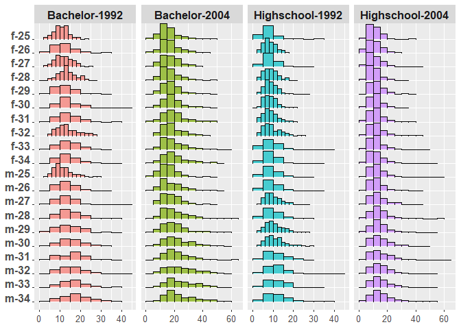
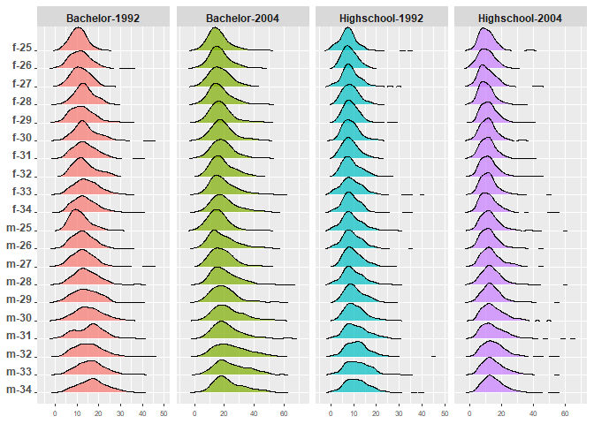
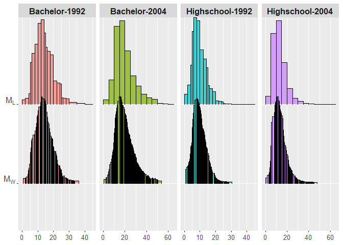
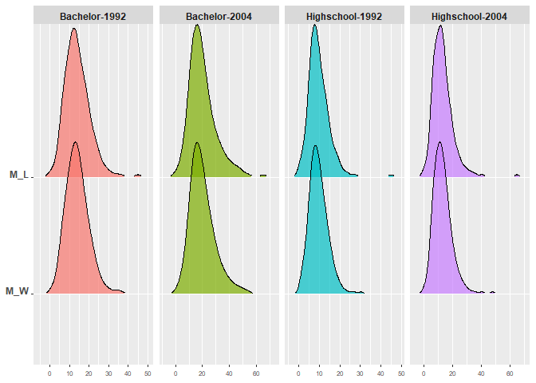

```r
library(HistDAWass)
library(tidyverse)
library(latex2exp)
library(AER)
source('Useful_funs.R')
```


```r
data("CPSSW9204")
dd<-CPSSW9204
dd<-dd %>% mutate(S_A=paste(substring(gender, 1, 1),age,sep="-"),
                  Y_type=paste(sub("(.)", "\\U\\1", degree, perl=TRUE),
                               year,sep="-"))
dd$S_A<-factor(dd$S_A)
dd<-dd %>% arrange(S_A)
#dd$earnings<-log10(dd$earnings)
tt<-from_LONG_to_WIDE_MH(dd,val_from = 2,rows_labs = 6,vars_from = 7)
show(plot(tt)+theme(axis.text.x = element_text(size=10),axis.text.y = element_text(size=12),strip.text.x=element_text(size=12)))
```

<!-- -->

```r
show(plot(tt,type="DENS"))
```

<!-- -->


```r
data<-tt
ROUND<-TRUE
pos1<-2
pos2<-2
source('Descriptive_statistics.R')
show(plot(MEA)+scale_y_discrete(labels=c('M_L'=parse(text = TeX('$M_L$')),'M_W'=parse(text = TeX('$M_W$'))))+theme(axis.text.x = element_text(size=10),axis.text.y = element_text(size=12),strip.text.x=element_text(size=12)))
```

<!-- -->

```r
show(plot(MEA,type="DENS"))
```

<!-- -->

```r
show(round(t(bb),3))
```

```
##                                 M_L    M_W               M_L   M_W            
## Bachelor-1992   13.958 1.781 13.958 13.958 5.786 0.986 6.117 5.758 0.644 0.313
## Bachelor-2004   19.925 2.704 19.925 19.925 9.202 1.428 9.673 9.164 0.960 0.264
## Highschool-1992  9.702 1.241  9.702  9.702 4.543 0.749 4.758 4.518 0.935 0.312
## Highschool-2004 13.225 1.724 13.225 13.225 6.523 1.022 6.809 6.488 1.353 0.369
##                   M_L   M_W               M_L   M_W
## Bachelor-1992   0.822 0.617 3.955 1.052 4.340 3.708
## Bachelor-2004   1.089 0.935 4.220 0.949 4.467 4.013
## Highschool-1992 1.079 0.878 5.025 2.115 5.594 4.521
## Highschool-2004 1.512 1.304 6.905 2.229 7.664 6.326
```

```r
show(round(WH.correlation(tt),3))
```

```
##                 Bachelor-1992 Bachelor-2004 Highschool-1992 Highschool-2004
## Bachelor-1992           1.000         0.837           0.728           0.701
## Bachelor-2004           0.837         1.000           0.788           0.777
## Highschool-1992         0.728         0.788           1.000           0.828
## Highschool-2004         0.701         0.777           0.828           1.000
```

```r
show(round(cor(get.MatH.stats(tt)$mat),3))
```

```
##                 Bachelor-1992 Bachelor-2004 Highschool-1992 Highschool-2004
## Bachelor-1992           1.000         0.933           0.867           0.791
## Bachelor-2004           0.933         1.000           0.898           0.850
## Highschool-1992         0.867         0.898           1.000           0.951
## Highschool-2004         0.791         0.850           0.951           1.000
```

```r
show(round(WH.correlation(tt),3)-round(cor(get.MatH.stats(tt)$mat),3))
```

```
##                 Bachelor-1992 Bachelor-2004 Highschool-1992 Highschool-2004
## Bachelor-1992           0.000        -0.096          -0.139          -0.090
## Bachelor-2004          -0.096         0.000          -0.110          -0.073
## Highschool-1992        -0.139        -0.110           0.000          -0.123
## Highschool-2004        -0.090        -0.073          -0.123           0.000
```


```r
CV<-WH.var.covar(tt)
ctab<-get.MatH.stats(tt)$mat
CVc<-cov(ctab)*(get.MatH.nrows(tt)-1)/get.MatH.nrows(tt)
CVv<-CV-CVc
show(CV)
```

```
##                 Bachelor-1992 Bachelor-2004 Highschool-1992 Highschool-2004
## Bachelor-1992        4.256039      5.341702        2.237688        2.983858
## Bachelor-2004        5.341702      9.576059        3.635917        4.960578
## Highschool-1992      2.237688      3.635917        2.222310        2.547620
## Highschool-2004      2.983858      4.960578        2.547620        4.261362
```

```r
show(CVc)
```

```
##                 Bachelor-1992 Bachelor-2004 Highschool-1992 Highschool-2004
## Bachelor-1992        3.013608      4.267255        1.820498        2.306513
## Bachelor-2004        4.267255      6.944841        2.860348        3.763567
## Highschool-1992      1.820498      2.860348        1.462141        1.932518
## Highschool-2004      2.306513      3.763567        1.932518        2.823856
```

```r
show(CVv)
```

```
##                 Bachelor-1992 Bachelor-2004 Highschool-1992 Highschool-2004
## Bachelor-1992       1.2424311      1.074447       0.4171890       0.6773441
## Bachelor-2004       1.0744469      2.631217       0.7755690       1.1970108
## Highschool-1992     0.4171890      0.775569       0.7601687       0.6151021
## Highschool-2004     0.6773441      1.197011       0.6151021       1.4375058
```

```r
show(diag(CVc)/diag(CV)*100)
```

```
##   Bachelor-1992   Bachelor-2004 Highschool-1992 Highschool-2004 
##        70.80780        72.52296        65.79376        66.26652
```

```r
VAR_mat<-rbind(Total=diag(CV),Center=diag(CVc),Variab=diag(CVv),per_c=diag(CVc)/diag(CV)*100,std=sqrt(diag(CV)))
show(VAR_mat)
```

```
##        Bachelor-1992 Bachelor-2004 Highschool-1992 Highschool-2004
## Total       4.256039      9.576059       2.2223098        4.261362
## Center      3.013608      6.944841       1.4621412        2.823856
## Variab      1.242431      2.631217       0.7601687        1.437506
## per_c      70.807805     72.522961      65.7937590       66.266519
## std         2.063017      3.094521       1.4907414        2.064307
```

```r
CORRc<-cor(ctab)
CORRt<-WH.correlation(tt)
CORR_c<-CVc/(t(t(diag(sqrt(CV))))%*%(t(diag(sqrt(CV)))))
CORR_v<-CVv/(t(t(diag(sqrt(CV))))%*%(t(diag(sqrt(CV)))))
show (CORRc)
```

```
##                 Bachelor-1992 Bachelor-2004 Highschool-1992 Highschool-2004
## Bachelor-1992       1.0000000     0.9327690       0.8672660       0.7906628
## Bachelor-2004       0.9327690     1.0000000       0.8976211       0.8498597
## Highschool-1992     0.8672660     0.8976211       1.0000000       0.9510593
## Highschool-2004     0.7906628     0.8498597       0.9510593       1.0000000
```

```r
show (CORRt)
```

```
##                 Bachelor-1992 Bachelor-2004 Highschool-1992 Highschool-2004
## Bachelor-1992       1.0000000     0.8367264       0.7276028       0.7006499
## Bachelor-2004       0.8367264     1.0000000       0.7881670       0.7765415
## Highschool-1992     0.7276028     0.7881670       1.0000000       0.8278624
## Highschool-2004     0.7006499     0.7765415       0.8278624       1.0000000
```

```r
show (CORR_c)
```

```
##                 Bachelor-1992 Bachelor-2004 Highschool-1992 Highschool-2004
## Bachelor-1992       0.7080780     0.6684246       0.5919503       0.5416004
## Bachelor-2004       0.6684246     0.7252296       0.6200449       0.5891584
## Highschool-1992     0.5919503     0.6200449       0.6579376       0.6279818
## Highschool-2004     0.5416004     0.5891584       0.6279818       0.6626652
```

```r
show (CORR_v)
```

```
##                 Bachelor-1992 Bachelor-2004 Highschool-1992 Highschool-2004
## Bachelor-1992       0.2919220     0.1683018       0.1356525       0.1590495
## Bachelor-2004       0.1683018     0.2747704       0.1681221       0.1873831
## Highschool-1992     0.1356525     0.1681221       0.3420624       0.1998806
## Highschool-2004     0.1590495     0.1873831       0.1998806       0.3373348
```

